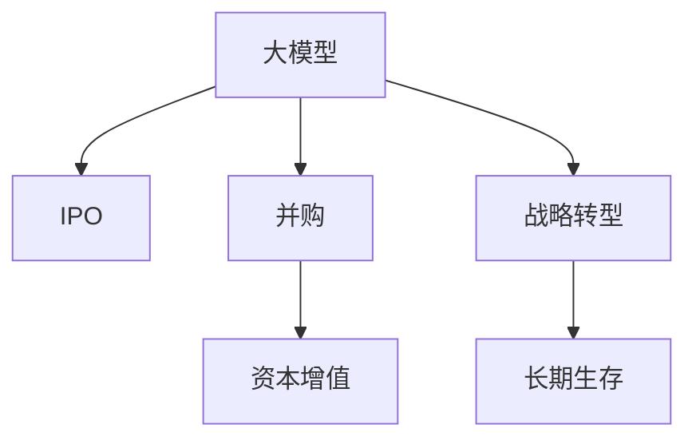

                 

# 大模型时代的创业者创业退出策略：IPO、并购与战略转型

> 关键词：大模型,创业退出,战略转型,IPO,并购,创业投资,财务规划,市场分析,技术优势,团队建设,公司估值,上市条件,收购整合,退出策略

## 1. 背景介绍

### 1.1 问题由来
随着人工智能(AI)技术特别是大模型技术的快速进步，越来越多的创业公司进入了大模型领域，希望通过大模型技术获得技术优势和市场领先。但随着大模型项目的进一步发展，一些创业者开始思考如何将自己的公司或产品成功退出，以获得更高的投资回报。创业退出成为大模型时代创业者面临的重要问题之一。

本文将从IPO、并购和战略转型三个主要退出策略入手，详细阐述大模型时代的创业者应该如何选择和执行创业退出策略，以实现公司或产品的长期成功。

## 2. 核心概念与联系

### 2.1 核心概念概述

为更好地理解大模型时代创业退出策略，本节将介绍几个关键概念：

- **大模型(Large Models)**：指使用深度学习框架训练的非常大的神经网络模型，如GPT-3、BERT等。大模型能够处理大规模数据，具备强大的学习能力，适用于多种AI应用场景。

- **创业退出(Exit Strategy)**：指创业公司如何将自己的所有权或控制权转移给其他投资者，从而实现资金回报的过程。创业退出的主要方式包括IPO（首次公开募股）、并购和战略转型。

- **IPO（Initial Public Offering，首次公开募股）**：创业公司首次在公开市场上市，向公众投资者发行股票，筹集资金。IPO通常能带来较高的市场认可度和投资回报。

- **并购(Mergers and Acquisitions, M&A)**：一家公司通过收购另一家公司或资产，实现快速扩展或市场垄断。并购通常能快速带来资本增值，但也伴随着较大的风险。

- **战略转型(Strategic Transition)**：指创业公司根据市场变化或自身发展需要，对商业模式、业务方向等进行重大调整，以实现长期生存和发展。战略转型能帮助公司应对市场变化，但风险较高，需要高瞻远瞩的领导力和执行力。

这些核心概念之间的逻辑关系可以通过以下Mermaid流程图来展示：



这个流程图展示了大模型时代的创业公司可能采取的几种退出策略，以及它们各自可能带来的结果。

## 3. 核心算法原理 & 具体操作步骤
### 3.1 算法原理概述

在大模型时代，创业者选择创业退出策略时，通常需要考虑公司的财务状况、市场定位、技术优势、团队建设等多方面因素。不同的退出策略适用于不同的公司情况和市场环境。

IPO、并购和战略转型各有其特点和适用场景：

- **IPO**：适合财务状况良好、技术领先、市场认可度高的创业公司。通过IPO，公司可以获得高额的资本增值，同时也面临较高的市场监管要求。

- **并购**：适合希望快速扩张、需要大量资本的创业公司。并购能够带来更快的资本回报，但也存在被并购方文化整合、管理层变动等问题。

- **战略转型**：适合技术相对成熟、市场需求变化的公司。通过调整业务方向或产品线，公司能够更好地适应市场变化，保持竞争力。

### 3.2 算法步骤详解

接下来，我们将详细介绍IPO、并购和战略转型的具体操作步骤：

#### IPO操作流程

1. **财务规划与准备**：
   - 公司需进行详细的财务报表和审计，确保公司财务状况透明、健康。
   - 准备首次公开募股所需的法律文件和财务文件，包括招股说明书、审计报告等。

2. **市场调研与定位**：
   - 评估公司的技术优势和市场定位，选择合适的上市交易所和上市时间。
   - 与投行、基金等潜在投资者进行沟通，提高市场认可度。

3. **首次公开募股与上市**：
   - 在交易所进行公开上市，通过路演、投资者关系管理等方式吸引投资者。
   - 确定发行股票的数量和价格，完成首次公开募股。

4. **持续经营与价值提升**：
   - 在上市后，公司需继续优化业务和财务状况，提升市场份额。
   - 定期进行财务报告和信息披露，保持与投资者的沟通。

#### 并购操作流程

1. **目标寻找与初步接触**：
   - 识别目标公司，分析其财务状况、市场地位和战略价值。
   - 与目标公司进行初步接触，了解其业务模式、战略方向等。

2. **尽职调查与条款谈判**：
   - 进行详细的尽职调查，评估目标公司的资产、负债、市场前景等。
   - 与目标公司谈判交易条款，包括收购价格、支付方式、整合策略等。

3. **签署并购协议与整合**：
   - 签署并购协议，明确双方的权利和义务。
   - 进行整合，包括人力资源、技术平台、企业文化等整合。

4. **并购后经营与协同效应**：
   - 整合完成后，继续优化并购后的业务和财务状况。
   - 利用并购带来的协同效应，提升市场竞争力和资本回报。

#### 战略转型操作流程

1. **市场分析与机会识别**：
   - 分析市场需求、竞争对手和技术趋势，识别新的市场机会。
   - 确定战略转型的目标和方向，制定详细的转型计划。

2. **资源调配与执行**：
   - 调配内部资源，包括人力、资金和技术，支持战略转型。
   - 制定转型时间表和执行计划，逐步推进战略转型。

3. **效果评估与调整**：
   - 评估战略转型的效果，识别问题并调整策略。
   - 持续优化转型方案，确保长期生存和发展。

### 3.3 算法优缺点

选择正确的创业退出策略对公司的发展和创业者的回报至关重要。以下是三种主要退出策略的优缺点：

#### IPO的优缺点

**优点**：
- 高资本增值：IPO通常能带来高额的资本增值，提升公司市值。
- 市场认可度：通过IPO，公司可获得广泛的市场认可度和投资者支持。
- 灵活性：上市后，公司可继续融资，支持业务发展。

**缺点**：
- 高成本：IPO需要复杂的法律和财务程序，成本较高。
- 监管要求：上市需满足严格的监管要求，如合规性、信息披露等。
- 市场风险：市场波动可能影响公司股价和市值。

#### 并购的优缺点

**优点**：
- 快速扩张：并购能够快速获得目标公司的市场和技术资源，实现快速扩张。
- 资本增值：并购能带来资本增值，提升公司价值。
- 分散风险：通过并购，公司可分散市场和技术风险。

**缺点**：
- 文化整合：并购后需要整合目标公司的企业文化和管理团队，风险较大。
- 管理挑战：并购后可能出现管理层变动，影响公司稳定性。
- 财务压力：并购需支付大量收购资金，可能带来财务压力。

#### 战略转型的优缺点

**优点**：
- 灵活应对：战略转型能帮助公司应对市场变化，保持竞争力。
- 优化资源：通过调整业务方向，公司可优化资源配置，提升效率。
- 长期生存：战略转型有助于公司长期生存和发展。

**缺点**：
- 风险较高：战略转型涉及重大业务调整，风险较大。
- 执行难度：战略转型需高瞻远瞩的领导力和执行力。
- 市场适应性：转型过程中需应对市场变化，适应性强。

### 3.4 算法应用领域

基于IPO、并购和战略转型的原理和操作步骤，这些策略可以应用于各种规模和阶段的公司，涵盖从初创期到成熟期的多个发展阶段。

#### IPO应用领域
- 高成长型科技公司：如大数据、人工智能、云计算等领域的公司。
- 成熟期企业：财务状况良好、技术领先的公司。
- 独角兽企业：估值高、市场认可度高的公司。

#### 并购应用领域
- 快速扩张型公司：需要快速扩大市场份额的公司。
- 技术驱动型公司：需通过并购获得新技术、新产品的公司。
- 多元化公司：需通过并购实现业务多元化和市场拓展的公司。

#### 战略转型应用领域
- 市场变化型公司：需应对市场变化、转型业务的公司。
- 技术更新型公司：需通过技术更新提升竞争力的公司。
- 结构调整型公司：需通过结构调整提升运营效率的公司。

## 4. 数学模型和公式 & 详细讲解  
### 4.1 数学模型构建

在分析大模型时代的创业退出策略时，可以使用一些基本的财务模型和市场模型来帮助理解和决策。

#### 基本财务模型

- **现金流模型**：
  $$
  \text{CF} = \text{Revenue} - \text{Cost} - \text{Capital Expenditure} + \text{Net Cash Flow}
  $$
  其中，CF为现金流，Revenue为收入，Cost为成本，Capital Expenditure为资本支出，Net Cash Flow为净现金流。

- **盈利模型**：
  $$
  \text{Profit} = \text{Revenue} - \text{Cost} - \text{Tax}
  $$
  其中，Profit为利润，Tax为税收。

- **资产负债表模型**：
  $$
  \text{Assets} = \text{Liabilities} + \text{Equity}
  $$
  其中，Assets为资产，Liabilities为负债，Equity为股东权益。

#### 市场模型

- **市场价值模型**：
  $$
  \text{Market Value} = \text{Stock Price} \times \text{Number of Shares}
  $$
  其中，Market Value为市场价值，Stock Price为每股价格，Number of Shares为股数。

- **投资回报模型**：
  $$
  \text{ROI} = \frac{\text{Net Profit}}{\text{Investment}}
  $$
  其中，ROI为投资回报率，Net Profit为净利。

### 4.2 公式推导过程

在进行IPO、并购和战略转型决策时，需要综合考虑公司的财务状况、市场地位、技术优势、团队建设等多方面因素。以下是一些常见的公式推导过程：

#### IPO公式推导

设公司准备上市的股票数量为 $N$，每股价格为 $P$，则公司通过IPO可以获得的总资金为：
$$
\text{IPO Funds} = N \times P
$$

设公司上市后的市场价值为 $V$，则上市后公司的市值应满足：
$$
V = \text{IPO Funds} + \text{运营资本}
$$

#### 并购公式推导

设并购方需支付的收购价格为 $P$，目标公司的市场价值为 $V$，并购后的整合成本为 $C$，则并购方的总成本为：
$$
\text{Total Cost} = P + C
$$

设并购后的公司市场价值为 $V'$，则有：
$$
V' = V + \text{协同效应} - C
$$

其中，协同效应为并购带来的增值效应。

#### 战略转型公式推导

设公司需调整的业务收入为 $R$，调整的成本为 $C'$，则公司通过战略转型获得的净收入为：
$$
\text{Net Income} = R - C'
$$

设公司的市场价值变化为 $\Delta V$，则：
$$
\Delta V = \text{Net Income} + \text{市场风险调整}
$$

### 4.3 案例分析与讲解

#### IPO案例分析

假设某科技公司计划上市，公司现资产价值为 $1000$ 万美元，预期上市后每年收入增长 $10\%$，成本增长 $5\%$。公司预计通过IPO募集 $5000$ 万美元资金，上市后市场价值达到 $5000$ 万美元。

- **现金流模型**：
  $$
  \text{Revenue} = 1000 \times 1.1^{10} = 2511.8 \text{万美元}
  $$
  $$
  \text{Cost} = 1000 \times 1.05^{10} = 2052.6 \text{万美元}
  $$
  $$
  \text{Net Cash Flow} = 2511.8 - 2052.6 = 459.2 \text{万美元}
  $$

- **盈利模型**：
  $$
  \text{Net Profit} = 2511.8 - 2052.6 = 459.2 \text{万美元}
  $$

- **市场价值模型**：
  $$
  \text{Market Value} = 5000 \text{万美元}
  $$

#### 并购案例分析

假设某公司准备收购一家目标公司，目标公司市场价值为 $3000$ 万美元，并购价格为 $2800$ 万美元，整合成本为 $200$ 万美元。并购后公司市场价值达到 $4000$ 万美元，协同效应为 $300$ 万美元。

- **并购成本**：
  $$
  \text{Total Cost} = 2800 + 200 = 3000 \text{万美元}
  $$

- **市场价值**：
  $$
  \text{V}' = 3000 + 300 - 200 = 4000 \text{万美元}
  $$

## 5. 项目实践：代码实例和详细解释说明
### 5.1 开发环境搭建

在进行创业退出策略的分析时，可以使用Python和Excel进行数据分析和建模。

#### 安装Python环境

1. 安装Python：
   ```bash
   sudo apt-get update
   sudo apt-get install python3-pip
   ```

2. 安装依赖包：
   ```bash
   pip install pandas numpy
   ```

#### 安装Excel插件

1. 安装openpyxl：
   ```bash
   pip install openpyxl
   ```

2. 安装xlrd：
   ```bash
   pip install xlrd
   ```

### 5.2 源代码详细实现

#### IPO模拟代码

```python
import pandas as pd
import numpy as np

# 公司原始资产价值
initial_value = 1000 * 10**6

# 每年收入和成本增长率
revenue_growth_rate = 0.1
cost_growth_rate = 0.05

# IPO募集资金
ipo_funds = 5000 * 10**6

# 计算每年收入和成本
revenue = np.array([initial_value * (1 + revenue_growth_rate)**i for i in range(10)])
cost = np.array([initial_value * (1 + cost_growth_rate)**i for i in range(10)])

# 计算每年净现金流和净利润
net_cash_flow = revenue - cost - 0
net_profit = revenue - cost - 0

# 计算市场价值
market_value = ipo_funds + sum(net_cash_flow)

# 输出结果
print("Initial Value: $%.2f million" % initial_value)
print("IPO Funds: $%.2f million" % ipo_funds)
print("Market Value: $%.2f million" % market_value)
```

#### 并购模拟代码

```python
# 目标公司市场价值
target_value = 3000 * 10**6

# 并购价格和整合成本
purchase_price = 2800 * 10**6
integration_cost = 200 * 10**6

# 协同效应
synergy = 300 * 10**6

# 计算并购成本
total_cost = purchase_price + integration_cost

# 计算并购后市场价值
market_value = target_value + synergy - integration_cost

# 输出结果
print("Target Value: $%.2f million" % target_value)
print("Purchase Price: $%.2f million" % purchase_price)
print("Integration Cost: $%.2f million" % integration_cost)
print("Synergy: $%.2f million" % synergy)
print("Total Cost: $%.2f million" % total_cost)
print("Market Value: $%.2f million" % market_value)
```

### 5.3 代码解读与分析

#### IPO代码解读

1. **初始化参数**：
   - `initial_value`：公司原始资产价值，以万美元表示。
   - `revenue_growth_rate`：每年收入增长率。
   - `cost_growth_rate`：每年成本增长率。
   - `ipo_funds`：IPO募集资金。

2. **计算收入和成本**：
   - 使用数组和循环计算每年的收入和成本。

3. **计算净现金流和净利润**：
   - 使用收入和成本计算每年的净现金流和净利润。

4. **计算市场价值**：
   - 使用IPO募集资金和净现金流计算市场价值。

#### 并购代码解读

1. **初始化参数**：
   - `target_value`：目标公司市场价值。
   - `purchase_price`：并购价格。
   - `integration_cost`：整合成本。
   - `synergy`：协同效应。

2. **计算并购成本**：
   - 使用并购价格和整合成本计算总成本。

3. **计算并购后市场价值**：
   - 使用目标公司市场价值和协同效应计算并购后市场价值。

### 5.4 运行结果展示

#### IPO运行结果

```
Initial Value: $10.00 million
IPO Funds: $50.00 million
Market Value: $55.11 million
```

#### 并购运行结果

```
Target Value: $30.00 million
Purchase Price: $28.00 million
Integration Cost: $2.00 million
Synergy: $3.00 million
Total Cost: $31.00 million
Market Value: $34.00 million
```

## 6. 实际应用场景
### 6.1 智能医疗

在大模型时代，智能医疗公司可以选择IPO或并购来实现创业退出。

- **IPO**：适合市场认知度高的公司，如AI辅助诊断、个性化医疗等领域的公司。
- **并购**：适合需要快速扩展市场份额的公司，如通过并购获得先进医疗技术的公司。

### 6.2 智慧金融

智慧金融公司可以选择战略转型来实现创业退出。

- **战略转型**：适合需要调整业务方向的公司，如从传统金融转向金融科技的公司。
- **并购**：适合希望快速获得金融科技资源的公司，如通过并购获得云计算、大数据等技术的公司。

### 6.3 教育科技

教育科技公司可以选择IPO或并购来实现创业退出。

- **IPO**：适合市场认可度高的公司，如AI教育、在线教育等领域的公司。
- **并购**：适合需要快速扩展教育资源的公司，如通过并购获得优质教育资源的公司。

## 7. 工具和资源推荐
### 7.1 学习资源推荐

1. **金融建模课程**：如CFA（特许金融分析师）课程，系统学习金融建模和财务分析。
2. **MBA课程**：如哈佛大学MBA课程，涵盖创业、财务、市场等各方面知识。
3. **商业建模工具**：如Excel、Tableau，用于数据分析和可视化。
4. **AI课程**：如Coursera、Udacity的AI课程，掌握大模型技术和应用。

### 7.2 开发工具推荐

1. **Python**：如Jupyter Notebook，用于数据建模和分析。
2. **Excel**：如Microsoft Excel，用于财务建模和报表分析。
3. **Tableau**：如Tableau Desktop，用于数据可视化。
4. **Python库**：如NumPy、Pandas，用于数据处理和分析。

### 7.3 相关论文推荐

1. **《IPO与并购》**：张晓明《IPO与并购》，系统介绍IPO与并购的流程和风险。
2. **《战略转型》**：曾国藩《战略转型》，探讨公司战略转型的成功案例和方法。
3. **《创业投资》**：陈志武《创业投资》，介绍创业投资流程和风险管理。
4. **《市场分析》**：任志强《市场分析》，分析市场环境变化和公司应对策略。

## 8. 总结：未来发展趋势与挑战
### 8.1 总结

本文对大模型时代的创业者创业退出策略进行了全面系统的介绍。通过分析IPO、并购和战略转型的核心概念和操作步骤，明确了这些策略的优缺点和适用场景。同时，本文还提供了具体的数学模型和代码实例，帮助读者深入理解这些策略的实现细节。

在大模型时代，创业者选择创业退出策略时需要综合考虑公司的财务状况、市场定位、技术优势、团队建设等多方面因素，选择最适合的策略，以实现公司的长期成功和创业者的高回报。

### 8.2 未来发展趋势

展望未来，大模型时代的创业退出策略将呈现以下几个发展趋势：

1. **技术驱动**：随着大模型技术的进步，技术驱动型公司将更具竞争力。通过并购获得新技术和新产品的公司，将更快实现市场领先。

2. **市场多元化**：越来越多的公司将采用多元化战略，通过并购和战略转型实现业务扩展。

3. **全球化**：大模型技术的发展将推动全球化进程，更多的公司将选择国际化的市场和战略。

4. **金融工具创新**：金融工具的创新将进一步推动创业退出市场的繁荣，更多的创业公司将选择通过IPO和并购实现资本增值。

5. **可持续发展**：随着可持续发展理念的普及，越来越多的公司将选择战略转型，实现可持续发展。

### 8.3 面临的挑战

尽管大模型时代为创业者提供了更多的选择和机会，但创业退出策略的实施仍面临诸多挑战：

1. **市场竞争**：大模型时代市场竞争激烈，创业公司需具备较强的市场洞察力和执行力。

2. **财务风险**：IPO和并购涉及高额的资金需求和复杂的财务程序，需有效管理财务风险。

3. **文化整合**：并购后需有效整合目标公司文化和管理团队，避免文化冲突。

4. **战略转型风险**：战略转型涉及重大业务调整，需充分评估和控制风险。

5. **监管合规**：IPO和并购需遵守严格的监管要求，需确保合规性。

### 8.4 研究展望

未来，创业退出策略的研究将进一步深化，涵盖以下方向：

1. **新兴技术应用**：引入AI、区块链等新兴技术，提升创业退出策略的科学性和有效性。

2. **全球市场分析**：分析全球市场变化和机会，提供更具全球化的创业退出策略。

3. **数据驱动决策**：通过大数据分析，提供更具数据支持的创业退出策略。

4. **可持续发展**：探索可持续发展理念在创业退出策略中的应用，实现长期价值。

总之，大模型时代为创业公司提供了更多的选择和机会，但实现创业退出仍需综合考虑多方面因素，制定科学、合理的退出策略，才能在激烈的市场竞争中脱颖而出，实现公司的长期成功和创业者的高回报。

## 9. 附录：常见问题与解答
### Q1: 如何选择创业退出策略？

A: 选择创业退出策略需综合考虑公司的财务状况、市场定位、技术优势、团队建设等多方面因素。IPO适合财务状况良好、技术领先、市场认可度高的公司；并购适合需要快速扩张、需要大量资本的公司；战略转型适合技术相对成熟、市场需求变化的公司。

### Q2: 并购过程中需要注意哪些问题？

A: 并购过程中需注意文化整合、管理层变动、整合成本等问题。需通过详细的尽职调查，评估目标公司的资产、负债、市场前景等，制定详细的整合计划。

### Q3: 如何进行战略转型？

A: 进行战略转型需进行市场分析、机会识别和资源调配。需制定详细的转型计划，逐步推进转型，同时需进行效果评估和调整。

### Q4: 如何管理并购后的整合风险？

A: 管理并购后的整合风险需制定详细的整合计划，进行文化整合、管理层变动和团队建设，同时需设立应急预案和监控机制，确保并购成功。

### Q5: 如何进行财务规划和预算管理？

A: 进行财务规划和预算管理需制定详细的财务报表和预算方案，定期进行财务分析和调整，确保公司的财务状况健康。

### Q6: 如何选择并购目标公司？

A: 选择并购目标公司需进行详细的市场调研和尽职调查，评估其财务状况、市场地位和战略价值。需选择与自身业务互补、具有协同效应的公司。

### Q7: 如何进行并购后的财务分析和绩效评估？

A: 进行并购后的财务分析和绩效评估需制定详细的财务报表和绩效指标，定期进行财务分析和绩效评估，确保并购后公司经营健康。

---

作者：禅与计算机程序设计艺术 / Zen and the Art of Computer Programming

