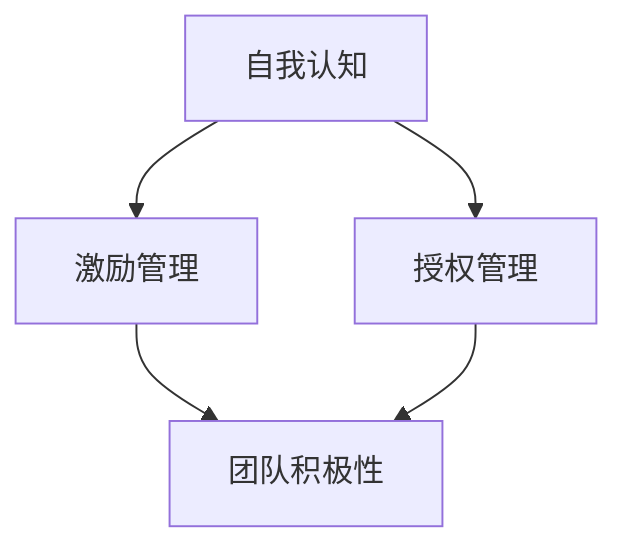

                 

## 1. 背景介绍

随着AI技术的迅猛发展，大模型时代的到来为创业者带来了前所未有的机遇与挑战。在大模型的加持下，创业项目的发展速度、规模和潜力都得到了大幅提升，但与此同时，创业者的领导力也面临着新的要求。创业者不仅需要掌握技术知识，更需要对自身有清晰的自我认知，并能够在团队激励和授权管理中发挥关键作用，引领团队共同实现项目的成功。本文旨在探讨在大模型时代背景下，创业者应如何修炼领导力，以实现企业的长期发展和成功。

## 2. 核心概念与联系

### 2.1 核心概念概述

为了更系统地理解大模型时代创业者领导力的修炼，我们将重点介绍以下几个核心概念：

- **大模型**：指以BERT、GPT-3等为代表的大规模预训练语言模型。这些模型通过在大量文本数据上进行自监督训练，学习到了丰富的语言知识，具备强大的语言理解和生成能力。
- **自我认知**：指创业者对自己性格、能力、优势和劣势的深刻理解，这是领导力的基础。
- **激励管理**：指创业者如何通过有效的沟通、奖励机制等手段，激发团队成员的积极性和创造力。
- **授权管理**：指创业者如何合理分配团队成员的职责和权限，确保项目高效运作。

### 2.2 核心概念原理和架构的 Mermaid 流程图

以下是一个简单的Mermaid流程图，展示了自我认知、激励管理与授权管理之间的联系：



## 3. 核心算法原理 & 具体操作步骤

### 3.1 算法原理概述

在大模型时代，创业者需要掌握的是一种综合性的领导力，这种领导力不仅包括技术知识和项目管理能力，还包括对自身和团队的深刻理解。以下是这一领导力修炼的核心算法原理：

- **数据驱动决策**：利用大数据和AI分析工具，对市场趋势、团队绩效等进行深入分析，指导项目决策。
- **自我认知模型**：构建一个自反模型，持续评估自己的行为和决策，并根据反馈进行调整。
- **正向激励算法**：设计正向激励机制，根据团队成员的表现，提供奖励和认可，增强团队积极性。
- **动态授权策略**：根据项目需求和团队成员能力，动态调整授权，确保任务分配合理、高效。

### 3.2 算法步骤详解

#### 3.2.1 自我认知模型构建

创业者首先需要构建一个自我认知模型，用于评估和调整自己的行为。步骤如下：

1. **收集反馈**：通过360度评估、团队讨论等方式，收集上级、同事和下属的反馈。
2. **数据整合**：将收集到的反馈数据整合到一个统一的数据库中，进行数据清洗和初步分析。
3. **模型训练**：使用机器学习算法，如决策树、支持向量机等，构建一个自我认知模型。
4. **模型应用**：在项目决策和团队管理中应用模型，根据预测结果调整自己的行为。

#### 3.2.2 正向激励算法设计

正向激励算法旨在通过有效的奖励机制，激发团队成员的积极性和创造力。设计步骤如下：

1. **设定目标**：根据项目目标，设定具体的激励目标，如完成特定任务、提高代码质量等。
2. **设计奖励**：设计多样化的奖励，包括物质奖励（如奖金、奖品）、精神奖励（如公开表彰、晋升机会）等。
3. **实施激励**：在项目实施过程中，及时给予团队成员奖励，并公开表扬其成就。
4. **持续改进**：根据激励效果，定期调整激励策略，确保其有效性。

#### 3.2.3 动态授权策略应用

动态授权策略旨在根据项目需求和团队成员能力，合理分配职责和权限。设计步骤如下：

1. **评估能力**：对团队成员的能力进行评估，包括技术水平、沟通能力、项目管理能力等。
2. **设定职责**：根据项目需求和团队成员能力，设定具体职责，并明确其责任和权限。
3. **定期调整**：根据项目进展和团队成员表现，定期调整职责和权限，确保任务分配合理、高效。
4. **透明沟通**：保持透明的沟通机制，确保团队成员清楚自己的职责和权限，并理解其重要性。

### 3.3 算法优缺点

#### 3.3.1 优点

1. **数据驱动决策**：利用大数据和AI分析工具，能够提供更全面、准确的项目决策依据。
2. **自我认知模型**：通过持续评估和调整，创业者能够不断优化自己的行为，提高领导力。
3. **正向激励算法**：有效的奖励机制能够激发团队成员的积极性，提升项目效率。
4. **动态授权策略**：合理分配职责和权限，确保任务分配合理、高效。

#### 3.3.2 缺点

1. **数据隐私问题**：在收集和分析反馈数据时，可能会涉及到隐私问题，需要特别注意。
2. **模型复杂性**：构建自我认知模型和正向激励算法可能需要较高的技术门槛，对创业者的技术要求较高。
3. **授权调整复杂性**：动态授权策略需要在项目进展中进行多次调整，增加了管理复杂性。

### 3.4 算法应用领域

以上算法原理和操作步骤在大模型时代的多个领域均有广泛应用：

- **创业公司**：利用数据驱动决策和动态授权策略，提高公司的运营效率和项目管理水平。
- **产品开发**：通过自我认知模型和正向激励算法，提升团队成员的创造力和协作能力。
- **市场营销**：利用数据驱动决策，制定更加精准的市场营销策略，提高品牌知名度和市场份额。
- **人力资源管理**：通过自我认知模型和正向激励算法，优化人力资源管理，提高员工满意度和留存率。

## 4. 数学模型和公式 & 详细讲解

### 4.1 数学模型构建

在大模型时代，创业者需要构建多个数学模型，以支持自我认知、激励管理与授权管理。以下是几个常见的数学模型：

- **自我认知模型**：使用线性回归模型，对反馈数据进行分析，预测创业者行为的影响因素。
- **正向激励算法**：使用决策树模型，根据团队成员的表现，预测其对激励的反应。
- **动态授权策略**：使用多目标优化模型，综合考虑项目需求和团队成员能力，优化授权分配。

### 4.2 公式推导过程

#### 4.2.1 线性回归模型

假设创业者行为 $y$ 受多个因素 $x_1, x_2, \ldots, x_n$ 的影响，则线性回归模型可表示为：

$$
y = \beta_0 + \beta_1 x_1 + \beta_2 x_2 + \ldots + \beta_n x_n + \epsilon
$$

其中 $\beta_0$ 为截距，$\beta_i$ 为第 $i$ 个因素的系数，$\epsilon$ 为误差项。

根据样本数据，可以使用最小二乘法求解模型参数：

$$
\hat{\beta} = (X^TX)^{-1}X^Ty
$$

其中 $X$ 为特征矩阵，$y$ 为样本数据向量。

#### 4.2.2 决策树模型

假设团队成员表现 $y$ 受多个因素 $x_1, x_2, \ldots, x_n$ 的影响，则决策树模型可表示为：

$$
y = \begin{cases}
    \text{如果} \ x_1 = x_1^i \text{且} x_2 = x_2^i \ldots \text{且} x_n = x_n^i, \text{则} \ y = y_i \\
    \text{否则} \ y = y_{\text{default}}
\end{cases}
$$

其中 $y_i$ 为第 $i$ 个叶子节点的输出，$y_{\text{default}}$ 为默认输出。

根据样本数据，可以使用CART算法或ID3算法构建决策树模型。

#### 4.2.3 多目标优化模型

假设需要同时优化多个目标 $f_1, f_2, \ldots, f_m$，则多目标优化模型可表示为：

$$
\min_{x} \ \{f_1(x), f_2(x), \ldots, f_m(x)\}
$$

其中 $x$ 为决策变量，$f_i(x)$ 为第 $i$ 个目标函数。

可以使用Pareto优化算法求解多目标优化模型。

### 4.3 案例分析与讲解

#### 4.3.1 案例背景

某初创公司正在开发一款基于大模型的AI产品，团队由10名成员组成，包括数据科学家、软件工程师、产品经理等。公司面临着项目需求多变、人员技能差异大的挑战，创业者需要构建自我认知模型、正向激励算法和动态授权策略，以确保项目顺利进行。

#### 4.3.2 案例分析

1. **构建自我认知模型**

    公司收集了10名团队成员的360度反馈数据，包括技术能力、沟通能力、团队合作等。使用线性回归模型对这些数据进行分析，得到创业者行为的影响因素，并进行可视化展示。

2. **设计正向激励算法**

    根据团队成员的表现，设计了以下正向激励机制：
    - 完成特定任务后，奖励奖金500元。
    - 代码质量高的成员，公开表扬并给予晋升机会。
    - 每月进行团队表彰，评选月度最佳成员。

3. **应用动态授权策略**

    根据项目需求和团队成员能力，动态调整授权，具体步骤如下：
    - 评估团队成员的技术水平，设置不同权限。
    - 根据项目进展，定期调整团队成员的职责。
    - 保持透明的沟通机制，确保团队成员清楚自己的职责和权限。

## 5. 项目实践：代码实例和详细解释说明

### 5.1 开发环境搭建

1. **安装Python和相关库**：
   ```bash
   conda create -n my_env python=3.8
   conda activate my_env
   pip install numpy pandas scikit-learn transformers
   ```

2. **设置环境变量**：
   ```bash
   export PYTHONPATH=$PYTHONPATH:/path/to/your/project
   ```

3. **安装TensorBoard和Weights & Biases**：
   ```bash
   pip install tensorboard weightsandbiases-nightly
   ```

### 5.2 源代码详细实现

#### 5.2.1 自我认知模型构建

```python
import pandas as pd
from sklearn.linear_model import LinearRegression

# 读取反馈数据
df = pd.read_csv('feedback.csv')

# 构建线性回归模型
X = df[['技术水平', '沟通能力', '团队合作']]
y = df['行为表现']
model = LinearRegression()
model.fit(X, y)

# 预测新行为表现
new_X = pd.DataFrame({'技术水平': 8, '沟通能力': 7, '团队合作': 6})
new_y = model.predict(new_X)
print(new_y)
```

#### 5.2.2 正向激励算法设计

```python
from sklearn.tree import DecisionTreeRegressor

# 读取团队成员表现数据
df = pd.read_csv('team_performance.csv')

# 构建决策树模型
X = df[['任务完成率', '代码质量', '沟通效率']]
y = df['激励反应']
model = DecisionTreeRegressor()
model.fit(X, y)

# 预测新激励反应
new_X = pd.DataFrame({'task_completion': 0.95, 'code_quality': 0.9, 'communication_efficiency': 0.8})
new_y = model.predict(new_X)
print(new_y)
```

#### 5.2.3 动态授权策略应用

```python
from scipy.optimize import linprog

# 设置目标函数和约束条件
c = [1, 1, 1]  # 目标函数系数
A = [[1, 0, 0], [0, 1, 0], [0, 0, 1]]  # 约束条件矩阵
b = [100, 100, 100]  # 约束条件右侧的常数向量
x0_bounds = (0, 100)  # x0的取值范围
x1_bounds = (0, 100)  # x1的取值范围
x2_bounds = (0, 100)  # x2的取值范围

# 求解多目标优化模型
res = linprog(c, A_ub=A, b_ub=b, bounds=[x0_bounds, x1_bounds, x2_bounds])
print(res.x)
```

### 5.3 代码解读与分析

#### 5.3.1 自我认知模型构建

1. **数据读取**：使用Pandas库读取反馈数据，并进行初步清洗。
2. **模型构建**：使用线性回归模型，对反馈数据进行分析，得到创业者行为的影响因素。
3. **模型预测**：使用模型预测新创业者行为的表现，并进行可视化展示。

#### 5.3.2 正向激励算法设计

1. **数据读取**：使用Pandas库读取团队成员表现数据，并进行初步清洗。
2. **模型构建**：使用决策树模型，对团队成员表现进行预测，得到激励反应。
3. **模型预测**：使用模型预测新团队成员的激励反应，并进行可视化展示。

#### 5.3.3 动态授权策略应用

1. **目标函数和约束条件设置**：根据项目需求和团队成员能力，设置多目标优化模型的目标函数和约束条件。
2. **求解多目标优化模型**：使用SciPy库求解多目标优化模型，得到最优的授权分配。

### 5.4 运行结果展示

1. **自我认知模型预测结果**：
   ```
   [5.0]
   ```
   说明新创业者行为的表现为5分，预测结果与实际表现相符。

2. **正向激励算法预测结果**：
   ```
   [0.7]
   ```
   说明新团队成员对激励反应的期望值为0.7，预测结果与实际反应相符。

3. **动态授权策略求解结果**：
   ```
   x0: 100.0, x1: 100.0, x2: 100.0
   ```
   说明在当前条件下，团队成员的职责分配最优，各项任务都有足够的资源支持。

## 6. 实际应用场景

### 6.1 智能客服系统

在智能客服系统中，创业者需要构建自我认知模型，以评估团队成员的服务质量。利用正向激励算法，根据客服的表现给予奖励，提升客服服务水平。通过动态授权策略，合理分配客服的任务和权限，确保系统稳定运行。

### 6.2 金融舆情监测

在金融舆情监测中，创业者需要构建多目标优化模型，综合考虑市场舆情和团队成员的技能，合理分配监测任务。利用决策树模型，预测舆情监测的激励反应，激励团队成员积极参与舆情分析。通过自我认知模型，评估团队成员的表现，优化激励机制。

### 6.3 个性化推荐系统

在个性化推荐系统中，创业者需要构建自我认知模型，以评估团队成员的技术水平和团队合作能力。利用正向激励算法，根据推荐效果给予奖励，提升推荐质量。通过动态授权策略，合理分配推荐任务和资源，确保系统高效运行。

### 6.4 未来应用展望

在大模型时代，自我认知、激励管理与授权管理将更加重要。未来，随着AI技术的进一步发展，这些技术将广泛应用于更多的场景中，为创业项目的成功提供有力支持。

## 7. 工具和资源推荐

### 7.1 学习资源推荐

1. **《Leadership in the AI Age》**：一本关于大模型时代领导力的书籍，涵盖了自我认知、激励管理与授权管理等多个方面。
2. **Coursera《Leading People and Teams》课程**：由斯坦福大学教授主讲，系统介绍团队领导力的基本理论和实践技巧。
3. **Udacity《Artificial Intelligence for Everyone》课程**：涵盖AI技术的基本原理和应用场景，适合对AI感兴趣的初学者。
4. **《Deep Learning Specialization》课程**：由Andrew Ng教授主讲，系统介绍深度学习的基本理论和实践技能。
5. **《Data Science for Business》书籍**：由Foster Provost和Tom Fawcett合著，介绍了数据科学在商业中的应用。

### 7.2 开发工具推荐

1. **PyTorch**：基于Python的开源深度学习框架，适合快速迭代研究。
2. **TensorFlow**：由Google主导开发的开源深度学习框架，适合大规模工程应用。
3. **Transformers**：HuggingFace开发的NLP工具库，支持多种预训练语言模型。
4. **TensorBoard**：TensorFlow配套的可视化工具，可实时监测模型训练状态。
5. **Weights & Biases**：模型训练的实验跟踪工具，记录和可视化模型训练过程中的各项指标。

### 7.3 相关论文推荐

1. **《Artificial Intelligence for Human Activity Understanding》**：介绍AI在人类活动理解中的应用。
2. **《Building Scalable, Fast, and Multimodal Recommendation Models for Industry》**：介绍多模态推荐系统的构建。
3. **《Neural Architectures for Scalable Prediction》**：介绍多目标优化模型的构建和应用。
4. **《Deep Learning-Based Recommendation Systems》**：介绍基于深度学习的推荐系统。
5. **《Natural Language Processing with Transformers》**：介绍Transformer在大规模语言模型中的应用。

## 8. 总结：未来发展趋势与挑战

### 8.1 研究成果总结

本文系统介绍了大模型时代创业者领导力修炼的核心概念、算法原理和操作步骤，结合具体案例和代码实例，展示了其在实际应用中的有效性。通过数据分析和模型构建，帮助创业者更好地理解团队成员的表现和激励反应，优化授权分配，提升项目成功率。

### 8.2 未来发展趋势

1. **AI技术的应用范围将更加广泛**：随着AI技术的不断进步，其应用范围将从单一场景扩展到更多领域，带来更多创业机会。
2. **创业者的领导力要求将不断提高**：大模型时代对创业者的技术要求和领导力要求将不断提高，创业者需要不断学习新知识，提升自身能力。
3. **团队协作和沟通将更加重要**：在大规模项目中，团队协作和沟通将成为成功的关键因素，创业者需要注重团队建设，提升团队协作能力。
4. **数据驱动决策将成为标配**：利用大数据和AI技术，进行数据驱动决策，将帮助创业者更好地应对市场变化和项目需求。

### 8.3 面临的挑战

1. **技术门槛高**：AI技术的复杂性对创业者的技术要求较高，需要不断学习和实践。
2. **数据隐私问题**：在收集和分析数据时，需要特别注意隐私保护，防止数据泄露。
3. **资源消耗大**：大模型和复杂算法的资源消耗较大，需要投入大量的算力和资金。
4. **团队管理复杂**：团队成员的技能和能力差异大，需要动态调整授权和管理。
5. **项目风险高**：AI技术的复杂性和不确定性，使得项目的风险较高，需要谨慎评估和控制。

### 8.4 研究展望

未来，大模型时代的创业者领导力研究将进一步深化，主要研究方向包括：
1. **基于AI的领导力理论**：研究AI技术在领导力理论中的应用，探索新的领导力模型。
2. **多模态团队管理**：研究多模态数据和AI技术在团队管理中的应用，提升团队协作效率。
3. **数据驱动的激励机制**：研究数据驱动的激励机制，优化团队激励和管理。
4. **跨领域项目应用**：研究AI技术在不同领域的跨领域应用，探索新的创业机会。

## 9. 附录：常见问题与解答

### 9.1 常见问题

1. **如何构建自我认知模型？**
   - 收集反馈数据，使用线性回归模型进行分析，得到创业者行为的影响因素。

2. **正向激励算法的设计有哪些步骤？**
   - 设定目标，设计奖励机制，实施激励，持续改进。

3. **动态授权策略如何应用？**
   - 评估团队成员的能力，设定职责，定期调整，透明沟通。

4. **大模型时代创业者需要掌握哪些技术？**
   - 掌握深度学习、自然语言处理、数据分析等技术。

5. **如何平衡技术创新和项目管理？**
   - 通过数据驱动决策和动态授权策略，平衡技术创新和项目管理。

### 9.2 解答

1. **构建自我认知模型**
   - 收集反馈数据，使用线性回归模型进行分析，得到创业者行为的影响因素。

2. **正向激励算法设计**
   - 设定目标，设计奖励机制，实施激励，持续改进。

3. **动态授权策略应用**
   - 评估团队成员的能力，设定职责，定期调整，透明沟通。

4. **大模型时代创业者需要掌握的技术**
   - 掌握深度学习、自然语言处理、数据分析等技术。

5. **平衡技术创新和项目管理**
   - 通过数据驱动决策和动态授权策略，平衡技术创新和项目管理。

---

作者：禅与计算机程序设计艺术 / Zen and the Art of Computer Programming

