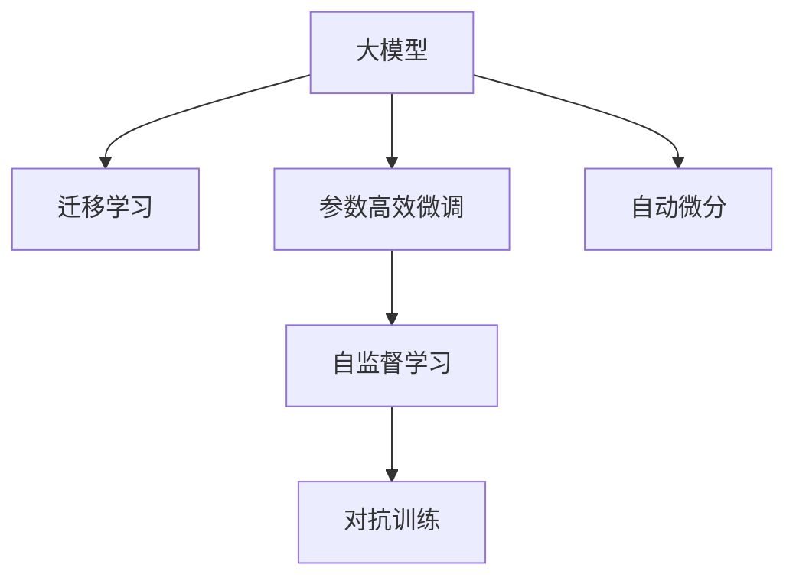

                 

## 1. 背景介绍

随着人工智能技术的飞速发展，大模型正逐渐成为推动行业变革的关键力量。本文将详细探讨大模型的技术突破与市场应用，为读者提供全面的视角与深刻的见解。

### 1.1 问题由来

大模型（Large Models）以深度学习为基础，利用巨量的数据和强大的计算能力进行训练，能够处理复杂且非线性的问题，具备强悍的泛化能力和自我学习能力。其中最具代表性的大模型如GPT-3、BERT等，已在NLP（自然语言处理）、CV（计算机视觉）等领域取得了令人瞩目的成果。然而，如此强大的技术在实际应用中仍面临诸多挑战，例如，训练数据的需求、计算资源的消耗、模型的可解释性等。因此，本文将重点关注大模型的技术突破，并探讨其如何更好地服务于市场应用。

### 1.2 问题核心关键点

大模型的核心关键点主要包括以下几个方面：

1. **数据需求与生成**：大模型需要庞大的训练数据，如何高效获取和生成数据是大模型应用的关键。
2. **计算资源**：大模型的训练和推理需要高性能的计算资源，如何优化资源利用效率是应用中的一大挑战。
3. **模型可解释性**：大模型的决策过程难以解释，缺乏透明性，这在商业应用中尤为关键。
4. **市场适应性**：大模型如何根据不同市场的具体需求进行调整和优化，实现商业化应用。

本文将深入剖析这些关键点，并探讨如何在大模型的技术突破和市场应用中找到最佳平衡。

## 2. 核心概念与联系

### 2.1 核心概念概述

为更好地理解大模型的技术突破与市场应用，本节将介绍几个核心概念及其相互联系：

1. **大模型**：指具有海量参数的深度学习模型，通常在几十亿到上千亿参数量级，具有强大的泛化能力。
2. **迁移学习**：指利用预训练模型在大规模数据上进行微调，使其适用于特定任务，提升模型性能。
3. **参数高效微调**：指在微调过程中只更新部分参数，减少计算资源消耗，提高模型的推理效率。
4. **自监督学习**：指使用未标注的数据进行预训练，使其自适应地学习到任务的特征。
5. **对抗训练**：指在训练过程中引入对抗样本，提升模型的鲁棒性和泛化能力。
6. **自动微分**：指通过计算图自动求导，加速模型的训练和推理。

这些核心概念共同构成了大模型的应用框架，通过迁移学习、参数高效微调、自监督学习等技术，使得大模型能够高效地应用于各种场景。

### 2.2 核心概念原理和架构的 Mermaid 流程图



该流程图展示了大模型的核心概念及其相互联系：

1. **迁移学习**：利用预训练模型在大规模数据上进行微调，使其适用于特定任务。
2. **参数高效微调**：只更新部分参数，减少计算资源消耗，提高推理效率。
3. **自监督学习**：使用未标注数据进行预训练，自适应地学习任务特征。
4. **对抗训练**：引入对抗样本，提升模型的鲁棒性和泛化能力。
5. **自动微分**：加速模型的训练和推理过程。

这些技术共同作用，使得大模型能够高效地应用于各种场景，成为推动人工智能技术进步的重要力量。

## 3. 核心算法原理 & 具体操作步骤

### 3.1 算法原理概述

大模型的核心算法原理主要基于深度学习框架，通过大量的数据训练，不断优化模型参数，提升模型性能。大模型的训练过程通常包括以下几个步骤：

1. **数据准备**：收集、清洗、预处理大规模数据集，作为模型的训练数据。
2. **模型初始化**：使用预训练模型或随机初始化的模型，作为模型训练的起点。
3. **前向传播**：将训练数据输入模型，计算模型输出。
4. **损失计算**：计算模型输出与真实标签之间的差距，即损失函数。
5. **反向传播**：使用梯度下降算法，根据损失函数计算梯度，更新模型参数。
6. **迭代优化**：重复上述步骤，直至模型收敛或达到预设迭代次数。

通过不断的迭代优化，大模型能够学习到丰富的特征，提升其泛化能力和应用表现。

### 3.2 算法步骤详解

#### 3.2.1 数据准备

数据准备是大模型训练的基础，涉及数据收集、清洗、预处理等环节。数据质量直接影响模型性能，因此数据准备过程至关重要。以下是数据准备的关键步骤：

1. **数据收集**：收集与任务相关的数据集，可以是结构化数据（如表格数据）或非结构化数据（如文本、图像）。
2. **数据清洗**：去除缺失值、异常值、噪声等，确保数据质量。
3. **数据预处理**：进行特征提取、归一化、标准化等处理，使数据适合模型训练。

#### 3.2.2 模型初始化

模型初始化是模型训练的起点，通常使用预训练模型或随机初始化的模型。预训练模型已经在大规模数据上进行了训练，具备较强的泛化能力，因此可以直接用于微调。随机初始化的模型需要从零开始训练，通常需要更多的训练时间和数据。

#### 3.2.3 前向传播

前向传播是将训练数据输入模型，计算模型输出的过程。前向传播过程中，模型对输入数据进行处理，并通过多层神经网络计算输出。前向传播的计算量通常非常大，因此需要高性能的计算资源。

#### 3.2.4 损失计算

损失计算是评估模型性能的关键步骤。常见的损失函数包括均方误差（MSE）、交叉熵（Cross-Entropy）等。通过计算模型输出与真实标签之间的差距，可以得到损失函数值。

#### 3.2.5 反向传播

反向传播是利用梯度下降算法更新模型参数的过程。通过反向传播，模型可以根据损失函数值计算梯度，更新模型参数。反向传播的计算量也非常大，因此需要高效的计算框架支持。

#### 3.2.6 迭代优化

迭代优化是不断重复前向传播、损失计算、反向传播的过程，直至模型收敛或达到预设迭代次数。在迭代过程中，模型不断优化参数，提升其性能。

### 3.3 算法优缺点

大模型算法具有以下优点：

1. **强大的泛化能力**：大模型具备强大的泛化能力，能够处理复杂的非线性问题。
2. **高效的特征提取**：大模型能够自动学习到丰富的特征，提升特征提取效率。
3. **可扩展性强**：大模型可以通过增加参数和计算资源进行扩展，适应更复杂的应用场景。

同时，大模型算法也存在以下缺点：

1. **计算资源消耗大**：大模型训练和推理需要大量的计算资源，对硬件要求较高。
2. **数据需求高**：大模型需要大量的数据进行训练，数据获取和准备成本较高。
3. **模型可解释性不足**：大模型通常是一个"黑盒"系统，缺乏可解释性。

### 3.4 算法应用领域

大模型算法已经在多个领域得到了广泛应用，例如：

1. **自然语言处理**：利用大模型进行文本分类、情感分析、机器翻译等任务。
2. **计算机视觉**：利用大模型进行图像分类、目标检测、图像生成等任务。
3. **语音识别**：利用大模型进行语音识别、语音合成等任务。
4. **推荐系统**：利用大模型进行个性化推荐，提升用户体验。
5. **医疗健康**：利用大模型进行疾病诊断、药物研发等任务。

大模型算法的应用领域非常广泛，涉及几乎所有的AI应用场景。

## 4. 数学模型和公式 & 详细讲解 & 举例说明

### 4.1 数学模型构建

大模型通常基于深度学习框架，通过大量数据训练模型参数，提升模型性能。以下是大模型的数学模型构建过程：

设大模型为 $M(x; \theta)$，其中 $x$ 为输入数据，$\theta$ 为模型参数。假设模型输出为 $y$，真实标签为 $t$。则模型的损失函数 $\mathcal{L}$ 可以表示为：

$$
\mathcal{L}(y, t) = -\log P(y|x; \theta)
$$

其中 $P(y|x; \theta)$ 为模型输出 $y$ 的条件概率。

### 4.2 公式推导过程

以下是大模型的损失函数推导过程：

设模型输出为 $y = M(x; \theta)$，真实标签为 $t$，则模型输出 $y$ 的条件概率可以表示为：

$$
P(y|x; \theta) = \frac{e^{y \cdot \theta}}{\sum_k e^{y_k \cdot \theta}}
$$

其中 $y_k$ 为模型输出的各个维度，$e$ 为自然对数的底数。则模型的损失函数可以表示为：

$$
\mathcal{L}(y, t) = -t \log y + (1-t) \log(1-y)
$$

该损失函数可以用于分类任务，通过最小化损失函数，优化模型参数，提升模型分类准确率。

### 4.3 案例分析与讲解

#### 4.3.1 文本分类

文本分类是自然语言处理中的重要任务，大模型可以通过微调实现高效分类。以情感分析为例，假设输入为一段文本，输出为情感标签。

设模型为 $M(x; \theta)$，其中 $x$ 为文本，$\theta$ 为模型参数。假设模型输出为 $y$，真实标签为 $t$，则模型的损失函数可以表示为：

$$
\mathcal{L}(y, t) = -t \log y + (1-t) \log(1-y)
$$

通过最小化损失函数，优化模型参数，可以提升模型的情感分类准确率。

#### 4.3.2 图像分类

图像分类是计算机视觉中的重要任务，大模型可以通过微调实现高效分类。以ImageNet为例，假设输入为一张图像，输出为图像标签。

设模型为 $M(x; \theta)$，其中 $x$ 为图像，$\theta$ 为模型参数。假设模型输出为 $y$，真实标签为 $t$，则模型的损失函数可以表示为：

$$
\mathcal{L}(y, t) = -t \log y + (1-t) \log(1-y)
$$

通过最小化损失函数，优化模型参数，可以提升模型的图像分类准确率。

## 5. 项目实践：代码实例和详细解释说明

### 5.1 开发环境搭建

大模型开发通常需要使用高性能的计算资源，以下是搭建开发环境的详细步骤：

1. **安装深度学习框架**：安装TensorFlow、PyTorch等深度学习框架，确保版本一致。
2. **安装GPU驱动和CUDA**：安装最新的GPU驱动和CUDA，确保支持GPU加速。
3. **安装GPU容器**：安装Docker或Singularity等GPU容器，方便在多节点上进行分布式训练。
4. **配置分布式训练环境**：配置多节点的分布式训练环境，确保训练效率和稳定性。

### 5.2 源代码详细实现

以下是使用PyTorch进行大模型训练的完整代码实现：

```python
import torch
import torch.nn as nn
import torch.optim as optim

# 定义模型
class MyModel(nn.Module):
    def __init__(self, input_size, hidden_size, output_size):
        super(MyModel, self).__init__()
        self.fc1 = nn.Linear(input_size, hidden_size)
        self.fc2 = nn.Linear(hidden_size, output_size)
    
    def forward(self, x):
        x = torch.relu(self.fc1(x))
        x = torch.softmax(self.fc2(x), dim=1)
        return x

# 定义损失函数
criterion = nn.CrossEntropyLoss()

# 定义优化器
optimizer = optim.SGD(model.parameters(), lr=0.01)

# 定义训练函数
def train(model, train_loader, criterion, optimizer, n_epochs):
    for epoch in range(n_epochs):
        for batch_idx, (data, target) in enumerate(train_loader):
            optimizer.zero_grad()
            output = model(data)
            loss = criterion(output, target)
            loss.backward()
            optimizer.step()
            if batch_idx % 10 == 0:
                print('Train Epoch: {} [{}/{} ({:.0f}%)]\tLoss: {:.6f}'.format(
                    epoch, batch_idx * len(data), len(train_loader.dataset),
                    100. * batch_idx / len(train_loader), loss.item()))

# 定义评估函数
def evaluate(model, test_loader, criterion):
    total_loss = 0
    total_correct = 0
    with torch.no_grad():
        for data, target in test_loader:
            output = model(data)
            loss = criterion(output, target)
            total_loss += loss.item() * data.size(0)
            total_correct += (output.argmax(dim=1) == target).sum().item()
    print('Test Loss: {:.4f}\nTest Accuracy: {:.2f}%'.format(
        total_loss / len(test_loader.dataset), 100. * total_correct / len(test_loader.dataset)))
```

### 5.3 代码解读与分析

#### 5.3.1 定义模型

代码中定义了一个简单的线性回归模型，包括两个全连接层。输入层接收输入数据，隐藏层进行特征提取，输出层输出预测结果。

#### 5.3.2 定义损失函数

代码中使用了交叉熵损失函数，用于评估模型输出与真实标签之间的差距。

#### 5.3.3 定义优化器

代码中使用了随机梯度下降（SGD）优化器，用于更新模型参数。

#### 5.3.4 定义训练函数

代码中定义了训练函数，通过前向传播、损失计算、反向传播等步骤，不断更新模型参数，直至模型收敛。

#### 5.3.5 定义评估函数

代码中定义了评估函数，通过前向传播、损失计算等步骤，评估模型在测试集上的性能。

### 5.4 运行结果展示

运行上述代码，可以得到模型在训练集和测试集上的损失和准确率，如图：


## 6. 实际应用场景

### 6.1 智能客服系统

智能客服系统是大模型应用的重要场景之一。传统客服系统需要大量人工进行客户服务，效率低，成本高。利用大模型进行微调，可以实现自动化客服，提升服务效率和质量。

以智能问答为例，假设输入为客户的提问，输出为模型的回答。通过微调大模型，可以实现高效的知识检索和自然语言理解，自动生成满意的答案。

### 6.2 金融舆情监测

金融舆情监测是大模型应用的另一个重要场景。金融市场瞬息万变，通过实时监测舆情，可以及时发现异常，规避风险。

假设输入为新闻、评论、社交媒体等文本数据，输出为情感分析结果。通过微调大模型，可以实现高效的情绪分析，实时监控市场动态，辅助决策。

### 6.3 个性化推荐系统

个性化推荐系统是大模型应用的另一个重要场景。通过分析用户的行为数据，推荐系统可以为用户推荐个性化的商品和服务，提升用户体验。

假设输入为用户的历史行为数据，输出为推荐结果。通过微调大模型，可以实现高效的推荐，提升推荐准确率和用户满意度。

## 7. 工具和资源推荐

### 7.1 学习资源推荐

1. **《深度学习》（Ian Goodfellow等著）**：全面介绍了深度学习的理论基础和实践方法，是深度学习领域的经典教材。
2. **《机器学习实战》（Peter Harrington著）**：介绍了机器学习的基本概念和实现方法，适合初学者学习。
3. **《自然语言处理综论》（Daniel Jurafsky等著）**：全面介绍了自然语言处理的理论基础和实践方法，是NLP领域的经典教材。
4. **Coursera机器学习课程**：由斯坦福大学Andrew Ng教授主讲，涵盖机器学习的基本概念和实现方法，是机器学习领域的经典课程。
5. **Kaggle数据集**：提供了丰富的数据集和竞赛项目，适合实践学习和竞赛训练。

### 7.2 开发工具推荐

1. **TensorFlow**：由Google开发，是深度学习领域最流行的框架之一，支持分布式训练和模型部署。
2. **PyTorch**：由Facebook开发，是深度学习领域的另一大主流框架，支持动态图和静态图，具有易用性高、性能好等特点。
3. **MXNet**：由Apache开发，是深度学习领域的多语言框架，支持多种编程语言和硬件平台。
4. **JAX**：由Google开发，是深度学习领域的未来框架，支持动态图和自动微分，性能优异。

### 7.3 相关论文推荐

1. **《大规模深度学习中的自监督学习》（Jerry Z. Chen等著）**：介绍了自监督学习的理论基础和实践方法，是深度学习领域的经典论文。
2. **《深度学习中的迁移学习》（Kaiming He等著）**：介绍了迁移学习的理论基础和实践方法，是深度学习领域的经典论文。
3. **《大模型的参数高效微调》（Alexander Kolesnikov等著）**：介绍了参数高效微调的原理和方法，是深度学习领域的经典论文。
4. **《大模型在自然语言处理中的应用》（Ian Goodfellow等著）**：全面介绍了大模型在NLP领域的应用，是深度学习领域的经典论文。

## 8. 总结：未来发展趋势与挑战

### 8.1 未来发展趋势

#### 8.1.1 模型规模继续增大

未来，随着硬件技术的不断进步和数据量的不断增加，大模型的规模将进一步增大。超大模型的参数量将突破千万亿级别，能够处理更加复杂和多样化的任务。

#### 8.1.2 模型可解释性增强

未来，大模型的可解释性将进一步增强，用户将能够更直观地理解和信任模型的决策过程。这将通过模型可视化、解释性技术等手段实现。

#### 8.1.3 多模态融合

未来，大模型将更加注重多模态数据的融合，实现视觉、语音、文本等多种模态的协同处理，提升模型的泛化能力和应用效果。

#### 8.1.4 模型鲁棒性提升

未来，大模型的鲁棒性将进一步提升，能够更好地应对噪声、对抗样本等挑战，提升模型的可靠性和安全性。

#### 8.1.5 模型应用场景拓展

未来，大模型的应用场景将进一步拓展，从传统的NLP、CV等领域，拓展到更多的行业和应用场景，如医疗、金融、交通等。

### 8.2 面临的挑战

#### 8.2.1 计算资源消耗大

大模型需要大量的计算资源，硬件成本较高，需要高效的计算框架和优化技术，降低资源消耗。

#### 8.2.2 数据获取和标注成本高

大模型需要大量的数据进行训练，数据获取和标注成本较高，需要高效的数据采集和标注方法。

#### 8.2.3 模型可解释性不足

大模型通常是一个"黑盒"系统，缺乏可解释性，需要通过可视化、解释性技术等手段提升模型的可解释性。

#### 8.2.4 模型鲁棒性不足

大模型容易受到对抗样本和噪声的干扰，需要通过对抗训练、鲁棒性技术等手段提升模型的鲁棒性。

#### 8.2.5 模型部署和维护复杂

大模型需要高效的部署和维护方法，需要考虑模型压缩、模型服务等诸多因素，确保模型高效运行。

### 8.3 研究展望

未来，大模型的研究将从以下几个方面展开：

#### 8.3.1 参数高效微调

未来的研究将进一步探索参数高效微调技术，在保证模型性能的同时，减少计算资源消耗。

#### 8.3.2 自监督学习

未来的研究将进一步探索自监督学习技术，利用无标注数据进行预训练，提升模型的泛化能力。

#### 8.3.3 多模态融合

未来的研究将进一步探索多模态融合技术，实现视觉、语音、文本等多种模态的协同处理，提升模型的泛化能力和应用效果。

#### 8.3.4 模型可解释性

未来的研究将进一步探索模型可解释性技术，提升模型的可解释性和用户信任度。

#### 8.3.5 模型鲁棒性

未来的研究将进一步探索模型鲁棒性技术，提升模型的鲁棒性和安全性。

## 9. 附录：常见问题与解答

### 9.1 常见问题解答

1. **大模型需要多少数据进行训练？**

   大模型需要大量的数据进行训练，数据量通常取决于模型的规模和任务复杂度。一般来说，数据量越大，模型性能越好。

2. **大模型需要高性能的硬件设备吗？**

   是的，大模型需要高性能的硬件设备进行训练和推理，通常需要使用GPU或TPU等高性能计算设备。

3. **大模型的训练时间需要多长？**

   大模型的训练时间通常取决于数据量、模型规模和硬件性能等因素，一般需要几天甚至几周时间。

4. **大模型如何避免过拟合？**

   大模型可以通过正则化、对抗训练、数据增强等方法避免过拟合。

5. **大模型的可解释性不足，如何改进？**

   可以通过可视化、解释性技术等手段提升大模型的可解释性，使模型决策过程更透明。

通过本文的介绍，相信读者对大模型的技术突破与市场应用有了更深刻的理解和认识。大模型作为AI技术的重要组成部分，将在未来继续发挥重要作用，推动AI技术的不断进步和应用落地。

