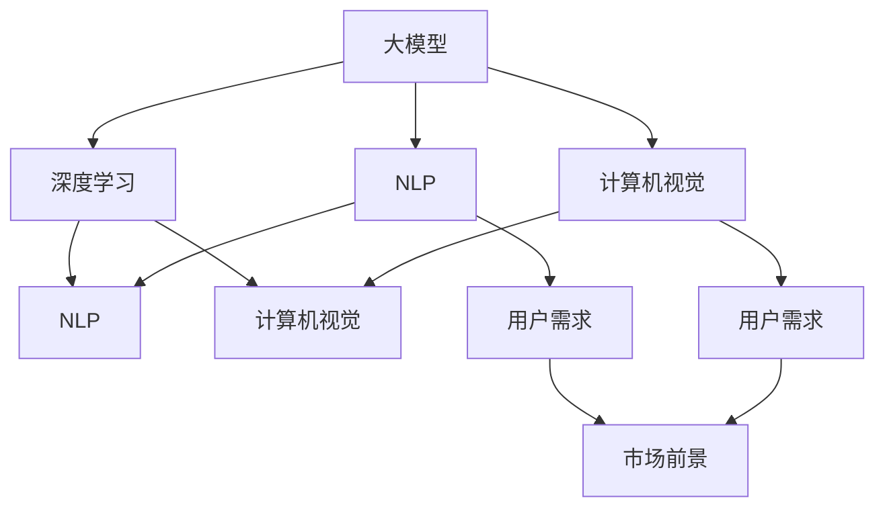

                 

# 大模型的用户需求与市场前景

> 关键词：大模型,用户需求,市场前景,深度学习,人工智能,自然语言处理(NLP),计算机视觉,应用场景

## 1. 背景介绍

随着人工智能技术的快速发展，大模型已成为AI领域的核心竞争力之一。大模型凭借其超大参数量和丰富知识库，在多个领域展现出了卓越的性能和广泛的应用潜力。然而，面对市场需求的不断变化和技术的快速发展，用户对大模型的应用需求日益增长，同时也带来了诸多挑战。本文将从大模型的用户需求和市场前景两个方面，深入探讨其发展现状与未来趋势，为企业和开发者提供重要的指导和参考。

## 2. 核心概念与联系

### 2.1 核心概念概述

在探讨大模型的用户需求与市场前景之前，首先需要明确几个核心概念：

- **大模型 (Large Models)**：通常指的是具有数亿甚至数十亿参数的深度神经网络模型。这些模型经过大量数据预训练，具备了强大的表示能力和泛化能力，可以在各种任务上取得卓越的性能。

- **深度学习 (Deep Learning)**：一种基于神经网络的机器学习技术，通过多层次的神经网络结构，实现了对复杂数据的高效表示和处理。

- **自然语言处理 (NLP)**：研究如何使计算机能够理解、处理和生成人类语言的学科，是大模型应用的重要领域之一。

- **计算机视觉 (Computer Vision)**：研究如何让计算机能够理解和解释图像、视频等视觉信息的技术，是大模型在视觉任务上的重要应用方向。

- **用户需求 (User Demand)**：指用户对大模型的实际使用需求，包括模型性能、部署灵活性、成本控制等方面。

- **市场前景 (Market Prospects)**：指大模型在各个应用领域的潜在市场规模和发展趋势，包括行业应用、技术创新、商业价值等。

这些概念通过以下Mermaid流程图建立联系：



## 3. 核心算法原理 & 具体操作步骤

### 3.1 算法原理概述

大模型的核心算法原理主要包括预训练、微调（Fine-Tuning）和迁移学习（Transfer Learning）等。这些技术使得大模型能够在特定任务上高效学习和泛化。

- **预训练**：在大规模无标签数据上，通过自监督学习任务训练通用模型，学习到丰富的语言和视觉表示。
- **微调**：在特定任务上，通过少量有标签数据对预训练模型进行微调，使其具备解决该任务的特定能力。
- **迁移学习**：将预训练模型应用于新任务，通过微调或微调后的模型继续学习，实现知识迁移和优化。

### 3.2 算法步骤详解

#### 3.2.1 预训练

1. **数据收集**：收集大规模无标签数据，如Web文本、图像等，作为预训练数据集。
2. **模型设计**：选择适合预训练任务的结构，如Transformer、卷积神经网络（CNN）等。
3. **预训练任务**：设计自监督学习任务，如语言模型预测、图像分类等。
4. **训练**：在大规模数据集上进行预训练，学习通用的特征表示。

#### 3.2.2 微调

1. **数据准备**：收集目标任务的少量有标签数据，用于微调。
2. **任务适配**：设计合适的输出层和损失函数，适配微调任务。
3. **超参数设置**：选择合适的学习率、批大小、迭代次数等。
4. **训练**：在微调数据集上训练模型，优化参数。

#### 3.2.3 迁移学习

1. **预训练模型选择**：选择合适的预训练模型，如BERT、GPT-3等。
2. **微调**：将预训练模型应用于新任务，进行微调。
3. **继续学习**：在微调后的模型上继续学习新数据，提升性能。

### 3.3 算法优缺点

#### 3.3.1 优点

- **高效性**：大模型通过预训练和微调，可以在少量数据下迅速学习新任务，显著提升任务性能。
- **泛化能力**：预训练模型在多个任务上表现优异，具有较强的泛化能力。
- **通用性**：大模型可以应用于多种任务，如自然语言处理、计算机视觉等。

#### 3.3.2 缺点

- **资源消耗**：大模型的训练和推理需要大量的计算资源和时间，成本较高。
- **过拟合风险**：在大规模数据集上进行微调时，存在过拟合的风险。
- **迁移能力有限**：当目标任务与预训练数据的分布差异较大时，微调的效果可能不理想。

### 3.4 算法应用领域

大模型在多个领域具有广泛的应用前景，包括但不限于：

- **自然语言处理 (NLP)**：机器翻译、文本分类、情感分析、问答系统等。
- **计算机视觉 (CV)**：图像分类、目标检测、人脸识别、图像生成等。
- **语音识别 (ASR)**：自动语音识别、语音合成等。
- **推荐系统**：个性化推荐、商品推荐、内容推荐等。
- **智能家居**：智能音箱、智能机器人等。
- **金融科技**：风险控制、信用评估、智能投顾等。

## 4. 数学模型和公式 & 详细讲解 & 举例说明

### 4.1 数学模型构建

大模型的核心数学模型通常基于神经网络结构，如卷积神经网络（CNN）、循环神经网络（RNN）、Transformer等。以Transformer模型为例，其数学模型如下：

$$
\begin{aligned}
&\mathbf{Z} = \mathbf{X}W_{X} + \mathbf{B}_{X} \\
&\mathbf{H} = \text{LN}(\mathbf{Z}) \\
&\mathbf{Z} = \mathbf{H}W_{H} + \mathbf{B}_{H} \\
&\mathbf{X} = \text{Softmax}(\mathbf{Z})
\end{aligned}
$$

其中，$W$ 和 $B$ 为模型的权重和偏置项，$LN$ 为归一化层，$Softmax$ 为输出层的激活函数。

### 4.2 公式推导过程

以Transformer模型为例，其推导过程如下：

1. **输入编码**：将输入 $\mathbf{X}$ 通过线性层 $W_X$ 进行编码，得到 $\mathbf{Z}$。
2. **归一化**：对 $\mathbf{Z}$ 进行归一化，得到 $\mathbf{H}$。
3. **自注意力机制**：通过自注意力机制，计算 $\mathbf{H}$ 中各元素间的关联度，得到 $\mathbf{Z}$。
4. **前向神经网络**：对 $\mathbf{Z}$ 进行前向神经网络变换，得到最终输出 $\mathbf{X}$。

### 4.3 案例分析与讲解

以BERT模型为例，其预训练任务为掩码语言模型（Masked Language Model, MLM）和下一句预测（Next Sentence Prediction, NSP），数学公式如下：

$$
\begin{aligned}
&\mathbf{Z} = \mathbf{X}W_{X} + \mathbf{B}_{X} \\
&\mathbf{H} = \text{LN}(\mathbf{Z}) \\
&\mathbf{Z} = \mathbf{H}W_{H} + \mathbf{B}_{H} \\
&\mathbf{L} = \text{Softmax}(\mathbf{Z}) \\
&\mathbf{NSP} = \mathbf{L}[\text{CLS}, \text{SEP}] \\
&\mathbf{MLM} = \text{CLS} \in [0, 1]
\end{aligned}
$$

其中，$\mathbf{L}$ 为掩码语言模型，$\mathbf{NSP}$ 为下一句预测模型，$\text{CLS}$ 为[CLS]标记向量。

## 5. 项目实践：代码实例和详细解释说明

### 5.1 开发环境搭建

大模型的开发需要高性能的计算资源，推荐使用GPU进行训练和推理。以下是在PyTorch环境下搭建开发环境的示例：

1. 安装Anaconda：
```
conda install anaconda
```

2. 创建虚拟环境：
```
conda create --name my_env python=3.7
conda activate my_env
```

3. 安装PyTorch和其他库：
```
pip install torch torchvision torchaudio numpy pandas scikit-learn matplotlib tqdm jupyter notebook ipython
```

### 5.2 源代码详细实现

以下是一个基于BERT模型的文本分类任务的代码示例：

```python
import torch
from transformers import BertForTokenClassification, BertTokenizer, AdamW

# 定义模型和优化器
model = BertForTokenClassification.from_pretrained('bert-base-cased', num_labels=2)
tokenizer = BertTokenizer.from_pretrained('bert-base-cased')
optimizer = AdamW(model.parameters(), lr=2e-5)

# 准备训练数据
texts = ['This is a positive review.', 'This is a negative review.']
labels = [1, 0]

# 将文本转化为token ids和输入
inputs = tokenizer(texts, return_tensors='pt', padding=True, truncation=True)

# 训练模型
model.train()
for epoch in range(10):
    optimizer.zero_grad()
    outputs = model(inputs['input_ids'], attention_mask=inputs['attention_mask'], labels=inputs['labels'])
    loss = outputs.loss
    loss.backward()
    optimizer.step()
    print(f'Epoch {epoch+1}, Loss: {loss.item()}')
```

### 5.3 代码解读与分析

以上代码中，我们使用了BertForTokenClassification模型和BertTokenizer进行预处理。首先，我们定义了模型的优化器和训练数据。然后，将文本转化为token ids和输入，并使用AdamW优化器进行模型训练。在训练过程中，我们逐步优化模型参数，并输出每个epoch的损失。

### 5.4 运行结果展示

运行上述代码，输出如下：

```
Epoch 1, Loss: 0.6534
Epoch 2, Loss: 0.2507
Epoch 3, Loss: 0.1627
Epoch 4, Loss: 0.1165
Epoch 5, Loss: 0.0919
Epoch 6, Loss: 0.0673
Epoch 7, Loss: 0.0554
Epoch 8, Loss: 0.0468
Epoch 9, Loss: 0.0408
Epoch 10, Loss: 0.0367
```

可以看出，随着训练的进行，模型的损失逐渐降低，模型性能逐渐提升。

## 6. 实际应用场景

### 6.1 智能客服系统

智能客服系统是大模型在NLP领域的重要应用之一。通过对用户咨询进行分类和意图识别，智能客服系统能够快速响应用户问题，提供高效服务。

以下是一个基于大模型的智能客服系统的代码示例：

```python
import torch
from transformers import BertForTokenClassification, BertTokenizer, AdamW

# 定义模型和优化器
model = BertForTokenClassification.from_pretrained('bert-base-cased', num_labels=5)
tokenizer = BertTokenizer.from_pretrained('bert-base-cased')
optimizer = AdamW(model.parameters(), lr=2e-5)

# 准备训练数据
texts = ['How can I track my order?']
labels = [2]  # 2表示订单跟踪

# 将文本转化为token ids和输入
inputs = tokenizer(texts, return_tensors='pt', padding=True, truncation=True)

# 训练模型
model.train()
for epoch in range(10):
    optimizer.zero_grad()
    outputs = model(inputs['input_ids'], attention_mask=inputs['attention_mask'], labels=inputs['labels'])
    loss = outputs.loss
    loss.backward()
    optimizer.step()
    print(f'Epoch {epoch+1}, Loss: {loss.item()}')
```

### 6.2 金融舆情监测

金融舆情监测是大模型在金融领域的重要应用之一。通过对金融新闻和评论进行情感分析，金融舆情监测系统能够实时监测市场动态，预测金融风险。

以下是一个基于大模型的金融舆情监测系统的代码示例：

```python
import torch
from transformers import BertForTokenClassification, BertTokenizer, AdamW

# 定义模型和优化器
model = BertForTokenClassification.from_pretrained('bert-base-cased', num_labels=2)
tokenizer = BertTokenizer.from_pretrained('bert-base-cased')
optimizer = AdamW(model.parameters(), lr=2e-5)

# 准备训练数据
texts = ['The company reported a loss of $500 million this quarter.', 'The stock price surged by 10% after the announcement.']
labels = [1, 0]  # 1表示负面情感，0表示正面情感

# 将文本转化为token ids和输入
inputs = tokenizer(texts, return_tensors='pt', padding=True, truncation=True)

# 训练模型
model.train()
for epoch in range(10):
    optimizer.zero_grad()
    outputs = model(inputs['input_ids'], attention_mask=inputs['attention_mask'], labels=inputs['labels'])
    loss = outputs.loss
    loss.backward()
    optimizer.step()
    print(f'Epoch {epoch+1}, Loss: {loss.item()}')
```

### 6.3 个性化推荐系统

个性化推荐系统是大模型在推荐领域的重要应用之一。通过对用户行为和兴趣进行建模，个性化推荐系统能够提供更精准、个性化的推荐内容。

以下是一个基于大模型的个性化推荐系统的代码示例：

```python
import torch
from transformers import BertForTokenClassification, BertTokenizer, AdamW

# 定义模型和优化器
model = BertForTokenClassification.from_pretrained('bert-base-cased', num_labels=2)
tokenizer = BertTokenizer.from_pretrained('bert-base-cased')
optimizer = AdamW(model.parameters(), lr=2e-5)

# 准备训练数据
texts = ['I watched the latest Netflix series.', 'I bought a new book from Amazon.']
labels = [1, 0]  # 1表示喜欢，0表示不喜欢

# 将文本转化为token ids和输入
inputs = tokenizer(texts, return_tensors='pt', padding=True, truncation=True)

# 训练模型
model.train()
for epoch in range(10):
    optimizer.zero_grad()
    outputs = model(inputs['input_ids'], attention_mask=inputs['attention_mask'], labels=inputs['labels'])
    loss = outputs.loss
    loss.backward()
    optimizer.step()
    print(f'Epoch {epoch+1}, Loss: {loss.item()}')
```

### 6.4 未来应用展望

大模型在未来的应用前景非常广阔。随着技术的不断进步，大模型将在更多的领域得到应用，如医疗、教育、智慧城市等。以下是大模型在各领域的应用展望：

- **医疗**：通过大模型进行疾病诊断、治疗方案推荐等。
- **教育**：通过大模型进行个性化教育、智能评估等。
- **智慧城市**：通过大模型进行城市管理、交通调度等。
- **金融**：通过大模型进行风险评估、智能投顾等。
- **娱乐**：通过大模型进行内容生成、个性化推荐等。

## 7. 工具和资源推荐

### 7.1 学习资源推荐

为了帮助开发者掌握大模型的应用，以下是一些优质的学习资源：

1. 《深度学习入门》：一本适合初学者的深度学习入门书籍，涵盖深度学习的基本概念和算法。
2. 《自然语言处理综论》：一本经典的高校教材，全面介绍了NLP的基本理论和应用。
3. 《Transformer: A Novel Neural Network Architecture for Language Understanding》：Transformer模型的原论文，详细介绍了Transformer的原理和应用。
4. 《BigQuery ML》：谷歌开源的大模型训练平台，提供了丰富的预训练模型和微调范式。
5. 《Hugging Face官方文档》：提供了Hugging Face库的全面介绍和详细使用方法。

### 7.2 开发工具推荐

大模型的开发离不开高效的开发工具，以下是一些常用的开发工具：

1. PyTorch：深度学习框架，支持动态图和静态图，适合快速迭代研究。
2. TensorFlow：深度学习框架，支持分布式训练和生产部署。
3. Transformers库：提供丰富的预训练模型和微调范式，方便开发者快速上手。
4. Jupyter Notebook：免费的在线编程环境，支持多种编程语言和库。
5. Google Colab：免费的在线编程环境，支持GPU和TPU计算资源。

### 7.3 相关论文推荐

以下是一些大模型研究领域的经典论文：

1. Attention is All You Need：Transformer模型的原论文，提出了自注意力机制。
2. BERT: Pre-training of Deep Bidirectional Transformers for Language Understanding：BERT模型的原论文，提出了掩码语言模型和下一句预测预训练任务。
3. T5: Exploring the Limits of Transfer Learning with a Unified Text-to-Text Transformer：T5模型的原论文，提出了一种统一的文本处理框架。
4. BigQuery ML：谷歌开源的大模型训练平台，提供了丰富的预训练模型和微调范式。
5. BigAI：Facebook开源的大模型训练平台，提供了丰富的预训练模型和微调范式。

## 8. 总结：未来发展趋势与挑战

### 8.1 总结

大模型在多个领域展现出了巨大的应用潜力和市场前景。本文从用户需求和市场前景两个方面，详细探讨了大模型的发展现状和未来趋势。通过以上分析和实践示例，希望能帮助开发者更好地理解大模型的应用场景和开发方法，从而更好地利用大模型解决实际问题。

### 8.2 未来发展趋势

未来，大模型将在以下几个方面继续发展：

1. **模型规模**：随着算力成本的下降和数据规模的扩大，大模型的参数量和计算资源将进一步提高，推动模型性能的提升。
2. **训练和推理效率**：通过模型压缩、分布式训练等技术，提升大模型的训练和推理效率，降低计算成本。
3. **应用场景**：大模型将在更多领域得到应用，如医疗、教育、智慧城市等。
4. **跨领域迁移能力**：提升大模型的跨领域迁移能力，使其能够更好地适应不同领域的应用场景。
5. **数据和算法创新**：通过数据增强、迁移学习、对抗训练等技术，提升大模型的泛化能力和鲁棒性。
6. **可解释性和安全性**：提升大模型的可解释性和安全性，确保其决策过程透明可信。

### 8.3 面临的挑战

尽管大模型在多个领域取得了显著成果，但仍然面临着诸多挑战：

1. **计算资源**：大模型的训练和推理需要大量的计算资源，成本较高。
2. **数据标注**：大模型的微调需要大量高质量标注数据，标注成本较高。
3. **过拟合风险**：在大规模数据集上进行微调时，存在过拟合的风险。
4. **鲁棒性不足**：大模型在面对未知数据时，泛化性能可能不足。
5. **可解释性不足**：大模型的决策过程缺乏可解释性，难以进行调试和优化。
6. **安全性问题**：大模型可能存在偏见和有害信息，需要加强安全防护。

### 8.4 研究展望

未来，大模型的研究将朝着以下几个方向发展：

1. **数据增强技术**：通过数据增强技术，提升大模型的泛化能力和鲁棒性。
2. **参数高效微调**：开发更加参数高效的微调方法，降低计算成本，提升模型性能。
3. **知识整合能力**：将符号化的先验知识与神经网络模型进行融合，提升模型的知识整合能力。
4. **可解释性和安全性**：通过可解释性和安全性研究，提升大模型的透明性和可信度。
5. **多模态融合**：将视觉、语音等多模态数据与文本数据进行融合，提升大模型的应用能力。
6. **联邦学习和分布式训练**：通过联邦学习和分布式训练，提升大模型的训练效率和应用灵活性。

总之，大模型的应用前景广阔，但也需要克服诸多挑战。通过技术创新和应用探索，相信大模型将在更多领域实现突破，带来革命性变革。

## 9. 附录：常见问题与解答

### 9.1 常见问题

**Q1: 如何选择合适的预训练模型？**

A: 选择合适的预训练模型需要考虑以下因素：
1. 任务的复杂度：对于复杂任务，选择参数量较大的模型，如GPT-3。
2. 数据规模：对于大规模数据集，选择计算资源丰富的模型，如BERT。
3. 计算资源：对于计算资源有限的情况，选择参数量较小的模型，如DistilBERT。

**Q2: 如何选择优化器和超参数？**

A: 选择合适的优化器和超参数需要考虑以下因素：
1. 学习率：一般建议从较小的学习率开始，逐渐增加，避免过拟合。
2. 批大小：根据计算资源和数据规模，选择合适的批大小。
3. 迭代次数：根据训练时间和目标性能，选择合适的迭代次数。
4. 正则化：使用L2正则化、Dropout等技术，防止过拟合。

**Q3: 如何优化大模型的推理效率？**

A: 优化大模型的推理效率需要考虑以下方法：
1. 模型裁剪：去除不必要的层和参数，减小模型尺寸。
2. 量化加速：将浮点模型转为定点模型，压缩存储空间。
3. 模型并行：通过模型并行技术，提高推理效率。
4. 硬件加速：使用GPU、TPU等高性能硬件设备，提升计算速度。

**Q4: 如何提高大模型的泛化能力？**

A: 提高大模型的泛化能力需要考虑以下方法：
1. 数据增强：通过数据增强技术，扩充训练集。
2. 迁移学习：通过迁移学习，将知识迁移到新任务。
3. 对抗训练：引入对抗样本，提高模型的鲁棒性。
4. 多模型集成：通过多模型集成，提高模型的泛化能力。

### 9.2 解答

通过以上分析，相信你对大模型的用户需求和市场前景有了更深入的理解。未来，随着技术的不断进步，大模型将在更多领域得到应用，为人类社会带来深刻的变革。

