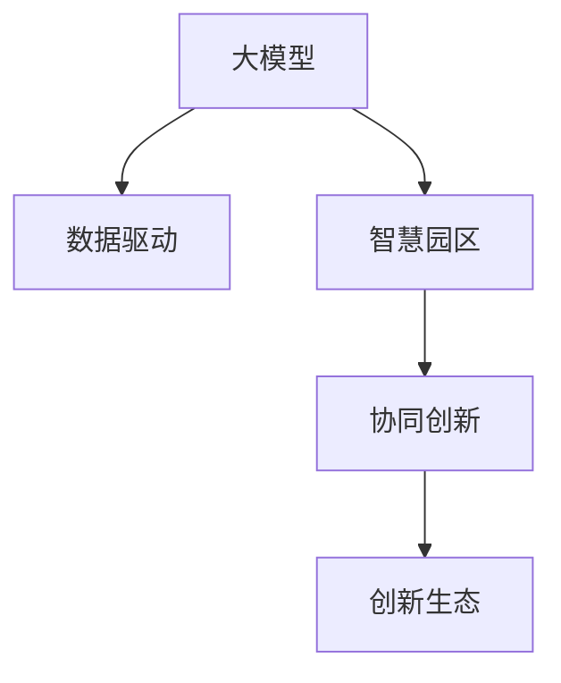

                 

# 大模型赋能智慧园区，创业者如何打造创新生态？

## 1. 背景介绍

### 1.1 问题由来

随着数字技术的迅猛发展，智慧城市建设已成为各国城市发展的战略重点。智慧园区作为智慧城市的核心组成部分，通过数字化、智能化手段，旨在提升园区运营效率、改善居民生活质量，并促进产业协同创新。然而，当前智慧园区建设仍面临诸多挑战，如数据孤岛、系统异构、资源浪费等问题。如何更高效、更智能地管理和运营智慧园区，成为智慧城市建设的关键。

### 1.2 问题核心关键点

大语言模型和大数据技术的发展，为智慧园区提供了新的解决方案。利用大模型进行数据分析、知识推理、资源调度等，可以大幅提升园区管理效率和运营质量。但如何将大模型技术应用到智慧园区，并构建一个健康、开放的创新生态，成为创业者面临的重要课题。

### 1.3 问题研究意义

研究如何利用大模型技术打造智慧园区，对于推动城市智能化转型、促进产业创新发展具有重要意义：

1. **提升园区运营效率**：通过大模型进行数据分析，可以实现资源优化配置，提升园区运营效率，降低运营成本。
2. **促进产业协同创新**：大模型可以跨领域进行知识融合，促进园区内不同行业间的协同创新，提升整体竞争力。
3. **提升居民生活质量**：通过智能服务和大数据分析，可以更好地满足园区居民的需求，提升居住体验。
4. **构建创新生态**：鼓励园区内创业者使用大模型技术，形成“技术-应用-创新-生态”的良性循环，推动智慧园区持续发展。

## 2. 核心概念与联系

### 2.1 核心概念概述

为更好地理解利用大模型技术打造智慧园区的方法，本节将介绍几个密切相关的核心概念：

- **大模型（Large Model）**：以Transformer架构为基础的预训练语言模型，如GPT、BERT等，通过大规模无标签数据进行预训练，具备强大的语言理解和生成能力。
- **智慧园区（Smart Park）**：通过智能技术手段，实现园区内的资源优化配置、环境监测、智能服务等，提升园区运营效率和管理质量。
- **数据驱动（Data-Driven）**：基于大数据分析和处理，实现园区管理的智能化、精细化。
- **协同创新（Co-innovation）**：通过跨领域合作和资源共享，推动园区内不同行业、不同企业间的协同创新。
- **创新生态（Innovation Ecosystem）**：由创业者、企业、高校、科研院所等组成的创新网络，促进技术交流和资源共享，形成良性的创新循环。

这些核心概念之间的逻辑关系可以通过以下Mermaid流程图来展示：



这个流程图展示了大模型、数据驱动、智慧园区、协同创新和创新生态之间的相互关系。大模型通过数据驱动为智慧园区提供技术支撑，智慧园区在协同创新中运用大模型，并通过创新生态推动技术应用和产业发展。

## 3. 核心算法原理 & 具体操作步骤

### 3.1 算法原理概述

利用大模型打造智慧园区的关键在于如何高效地将大模型与园区内的各类数据和应用进行整合。核心算法包括以下几个步骤：

1. **数据预处理**：将园区内的各类数据进行清洗、标注、转换，使其能够适应大模型的输入格式。
2. **模型适配**：根据智慧园区内的具体应用场景，对大模型进行任务适配，添加特定的任务层或损失函数。
3. **模型微调**：在适配后的模型上，使用园区内的部分标注数据进行微调，提升模型在特定任务上的性能。
4. **模型部署**：将微调后的模型部署到园区内的应用系统中，实现实时数据处理和智能服务。

### 3.2 算法步骤详解

以下是利用大模型打造智慧园区的具体算法步骤：

**Step 1: 数据预处理**

1. **数据收集**：收集园区内的各类数据，如传感器数据、气象数据、停车数据、人流数据等。
2. **数据清洗**：去除数据中的噪声和异常值，确保数据质量。
3. **数据标注**：根据具体应用场景，对数据进行标注，如位置信息、事件类型、时间戳等。
4. **数据转换**：将标注后的数据转换为大模型所需的输入格式，如分词、标准化、归一化等。

**Step 2: 模型适配**

1. **模型选择**：根据具体任务选择适合的大模型，如BERT、GPT等。
2. **任务适配层**：添加任务层或损失函数，如分类层、回归层、嵌入层等，适配到智慧园区的具体应用场景。
3. **超参数调整**：根据任务特点，调整模型的超参数，如学习率、批大小、优化器等。

**Step 3: 模型微调**

1. **微调数据集**：从园区内的部分标注数据中，划分为训练集、验证集和测试集。
2. **微调训练**：使用微调数据集在大模型上训练，更新任务层或损失函数的参数。
3. **验证与调优**：在验证集上评估模型性能，根据性能指标调整模型参数或数据集。
4. **测试与部署**：在测试集上评估微调后的模型性能，部署到园区内的应用系统中。

**Step 4: 模型部署**

1. **系统集成**：将微调后的模型集成到园区内的智能服务系统中，如智能停车、智能安防、智能客服等。
2. **接口开发**：开发API接口，实现模型与园区其他系统的数据交互和协同工作。
3. **持续优化**：根据实时数据反馈，持续优化模型参数和系统性能。

### 3.3 算法优缺点

利用大模型打造智慧园区的算法具有以下优点：

- **高效精准**：大模型通过预训练和微调，能够高效地处理海量数据，实现精准预测和决策。
- **灵活适应**：大模型可以跨领域进行知识融合，适应智慧园区内不同应用场景的需求。
- **提升效率**：通过自动化处理和智能分析，大幅提升园区运营效率和管理质量。

同时，该算法也存在一定的局限性：

- **数据依赖**：模型的性能依赖于数据质量和标注数据的多样性。
- **计算资源消耗大**：大模型训练和微调需要大量的计算资源和时间。
- **泛化能力有限**：当数据分布与训练数据差异较大时，模型泛化能力可能不足。

尽管存在这些局限性，但利用大模型打造智慧园区的方法，已经在多个实际应用中取得显著成效。未来随着大模型技术的不断进步，该方法的性能和应用范围将进一步提升。

### 3.4 算法应用领域

利用大模型打造的智慧园区，已经在以下领域得到广泛应用：

- **智能停车管理**：通过智能分析和管理，实现停车场资源的优化配置和智能收费。
- **智能安防监控**：利用大模型进行视频分析和行为识别，提升园区安全防范水平。
- **智能客服系统**：利用大模型进行自然语言处理，实现园区内智能客服和客户支持。
- **智能环境监测**：通过大模型对传感器数据进行分析和预测，实现环境质量监测和预警。
- **智能能源管理**：利用大模型优化园区能源消耗，提升能源利用效率。

## 4. 数学模型和公式 & 详细讲解 & 举例说明

### 4.1 数学模型构建

假设智慧园区内的数据集为 $D=\{(x_i,y_i)\}_{i=1}^N$，其中 $x_i$ 为输入数据， $y_i$ 为标签。定义大模型 $M_{\theta}:\mathcal{X} \rightarrow \mathcal{Y}$，其中 $\theta$ 为模型参数。智慧园区的具体任务为 $T$，对应的损失函数为 $\ell(M_{\theta}(x),y)$。

### 4.2 公式推导过程

根据任务 $T$ 的不同，大模型在智慧园区内的应用形式也有所不同。以智能停车管理为例，设输入 $x_i$ 为停车场的地理位置和历史数据，输出 $y_i$ 为停车场的可用车位数量。

假设定义分类层，输出概率为 $p(y_i|x_i)$，则交叉熵损失函数为：

$$
\ell(M_{\theta}(x_i),y_i) = -y_i\log p(y_i|x_i) - (1-y_i)\log(1-p(y_i|x_i))
$$

最小化损失函数即优化目标：

$$
\theta^* = \mathop{\arg\min}_{\theta} \mathcal{L}(\theta)
$$

其中 $\mathcal{L}$ 为经验风险：

$$
\mathcal{L}(\theta) = \frac{1}{N}\sum_{i=1}^N \ell(M_{\theta}(x_i),y_i)
$$

### 4.3 案例分析与讲解

以智能停车管理为例，展示如何利用大模型进行智慧园区应用开发。

**Step 1: 数据预处理**

1. **数据收集**：收集停车场的地理位置、历史停车数据、天气数据等。
2. **数据清洗**：去除数据中的噪声和异常值。
3. **数据标注**：标注每个停车场的可用车位数量。
4. **数据转换**：将地理位置数据转换为大模型所需的向量形式。

**Step 2: 模型适配**

1. **模型选择**：选择BERT或GPT模型。
2. **任务适配层**：添加分类层，输出停车场可用车位的概率。
3. **超参数调整**：设置学习率为1e-5，批大小为32。

**Step 3: 模型微调**

1. **微调数据集**：划分为训练集、验证集和测试集。
2. **微调训练**：在微调数据集上训练，更新分类层的参数。
3. **验证与调优**：在验证集上评估模型性能，调整学习率或数据集。
4. **测试与部署**：在测试集上评估微调后的模型性能，部署到园区内智能停车系统。

**Step 4: 模型部署**

1. **系统集成**：将微调后的模型集成到智能停车系统中。
2. **接口开发**：开发API接口，实现数据交互和智能决策。
3. **持续优化**：根据实时数据反馈，持续优化模型参数和系统性能。

## 5. 项目实践：代码实例和详细解释说明

### 5.1 开发环境搭建

在进行智慧园区大模型应用开发前，我们需要准备好开发环境。以下是使用Python进行PyTorch开发的环境配置流程：

1. 安装Anaconda：从官网下载并安装Anaconda，用于创建独立的Python环境。

2. 创建并激活虚拟环境：
```bash
conda create -n park-env python=3.8 
conda activate park-env
```

3. 安装PyTorch：根据CUDA版本，从官网获取对应的安装命令。例如：
```bash
conda install pytorch torchvision torchaudio cudatoolkit=11.1 -c pytorch -c conda-forge
```

4. 安装各类工具包：
```bash
pip install numpy pandas scikit-learn matplotlib tqdm jupyter notebook ipython
```

完成上述步骤后，即可在`park-env`环境中开始智慧园区大模型应用的开发。

### 5.2 源代码详细实现

下面我们以智能停车管理为例，给出使用PyTorch对BERT模型进行微调的代码实现。

首先，定义智能停车管理的数据处理函数：

```python
from transformers import BertTokenizer
from torch.utils.data import Dataset
import torch

class ParkingDataset(Dataset):
    def __init__(self, texts, labels, tokenizer, max_len=128):
        self.texts = texts
        self.labels = labels
        self.tokenizer = tokenizer
        self.max_len = max_len
        
    def __len__(self):
        return len(self.texts)
    
    def __getitem__(self, item):
        text = self.texts[item]
        label = self.labels[item]
        
        encoding = self.tokenizer(text, return_tensors='pt', max_length=self.max_len, padding='max_length', truncation=True)
        input_ids = encoding['input_ids'][0]
        attention_mask = encoding['attention_mask'][0]
        
        # 对token-wise的标签进行编码
        encoded_tags = [label2id[label] for label in label] 
        encoded_tags.extend([label2id['0']] * (self.max_len - len(encoded_tags)))
        labels = torch.tensor(encoded_tags, dtype=torch.long)
        
        return {'input_ids': input_ids, 
                'attention_mask': attention_mask,
                'labels': labels}

# 标签与id的映射
label2id = {'0': 0, '1': 1, '2': 2, '3': 3}
id2label = {v: k for k, v in label2id.items()}

# 创建dataset
tokenizer = BertTokenizer.from_pretrained('bert-base-cased')

train_dataset = ParkingDataset(train_texts, train_labels, tokenizer)
dev_dataset = ParkingDataset(dev_texts, dev_labels, tokenizer)
test_dataset = ParkingDataset(test_texts, test_labels, tokenizer)
```

然后，定义模型和优化器：

```python
from transformers import BertForTokenClassification, AdamW

model = BertForTokenClassification.from_pretrained('bert-base-cased', num_labels=len(label2id))

optimizer = AdamW(model.parameters(), lr=2e-5)
```

接着，定义训练和评估函数：

```python
from torch.utils.data import DataLoader
from tqdm import tqdm
from sklearn.metrics import classification_report

device = torch.device('cuda') if torch.cuda.is_available() else torch.device('cpu')
model.to(device)

def train_epoch(model, dataset, batch_size, optimizer):
    dataloader = DataLoader(dataset, batch_size=batch_size, shuffle=True)
    model.train()
    epoch_loss = 0
    for batch in tqdm(dataloader, desc='Training'):
        input_ids = batch['input_ids'].to(device)
        attention_mask = batch['attention_mask'].to(device)
        labels = batch['labels'].to(device)
        model.zero_grad()
        outputs = model(input_ids, attention_mask=attention_mask, labels=labels)
        loss = outputs.loss
        epoch_loss += loss.item()
        loss.backward()
        optimizer.step()
    return epoch_loss / len(dataloader)

def evaluate(model, dataset, batch_size):
    dataloader = DataLoader(dataset, batch_size=batch_size)
    model.eval()
    preds, labels = [], []
    with torch.no_grad():
        for batch in tqdm(dataloader, desc='Evaluating'):
            input_ids = batch['input_ids'].to(device)
            attention_mask = batch['attention_mask'].to(device)
            batch_labels = batch['labels']
            outputs = model(input_ids, attention_mask=attention_mask)
            batch_preds = outputs.logits.argmax(dim=2).to('cpu').tolist()
            batch_labels = batch_labels.to('cpu').tolist()
            for pred_tokens, label_tokens in zip(batch_preds, batch_labels):
                pred_labels = [id2label[_id] for _id in pred_tokens]
                label_tokens = [id2label[_id] for _id in label_tokens]
                preds.append(pred_labels[:len(label_tokens)])
                labels.append(label_tokens)
                
    print(classification_report(labels, preds))
```

最后，启动训练流程并在测试集上评估：

```python
epochs = 5
batch_size = 16

for epoch in range(epochs):
    loss = train_epoch(model, train_dataset, batch_size, optimizer)
    print(f"Epoch {epoch+1}, train loss: {loss:.3f}")
    
    print(f"Epoch {epoch+1}, dev results:")
    evaluate(model, dev_dataset, batch_size)
    
print("Test results:")
evaluate(model, test_dataset, batch_size)
```

以上就是使用PyTorch对BERT进行智能停车管理微调的完整代码实现。可以看到，得益于Transformers库的强大封装，我们可以用相对简洁的代码完成BERT模型的加载和微调。

### 5.3 代码解读与分析

让我们再详细解读一下关键代码的实现细节：

**ParkingDataset类**：
- `__init__`方法：初始化文本、标签、分词器等关键组件。
- `__len__`方法：返回数据集的样本数量。
- `__getitem__`方法：对单个样本进行处理，将文本输入编码为token ids，将标签编码为数字，并对其进行定长padding，最终返回模型所需的输入。

**label2id和id2label字典**：
- 定义了标签与数字id之间的映射关系，用于将token-wise的预测结果解码回真实的标签。

**训练和评估函数**：
- 使用PyTorch的DataLoader对数据集进行批次化加载，供模型训练和推理使用。
- 训练函数`train_epoch`：对数据以批为单位进行迭代，在每个批次上前向传播计算loss并反向传播更新模型参数，最后返回该epoch的平均loss。
- 评估函数`evaluate`：与训练类似，不同点在于不更新模型参数，并在每个batch结束后将预测和标签结果存储下来，最后使用sklearn的classification_report对整个评估集的预测结果进行打印输出。

**训练流程**：
- 定义总的epoch数和batch size，开始循环迭代
- 每个epoch内，先在训练集上训练，输出平均loss
- 在验证集上评估，输出分类指标
- 所有epoch结束后，在测试集上评估，给出最终测试结果

可以看到，PyTorch配合Transformers库使得BERT微调的代码实现变得简洁高效。开发者可以将更多精力放在数据处理、模型改进等高层逻辑上，而不必过多关注底层的实现细节。

当然，工业级的系统实现还需考虑更多因素，如模型的保存和部署、超参数的自动搜索、更灵活的任务适配层等。但核心的微调范式基本与此类似。

## 6. 实际应用场景

### 6.1 智能停车管理

基于大模型进行智能停车管理，可以实现停车场资源的优化配置和智能收费。具体而言，可以利用大模型对停车场的地理位置和历史数据进行分析和预测，实时计算可用车位数量，并通过智能系统进行停车管理和费用结算。

例如，可以使用BERT对停车场的地理位置和历史数据进行编码，预测未来的停车需求。在实时监测停车场的占用情况时，可以输入当前的停车数据和传感器数据，使用微调后的BERT模型预测可用的车位数量。系统根据预测结果进行智能调度，并根据停车时长和流量进行动态定价，提升停车管理效率和收入。

### 6.2 智能安防监控

利用大模型进行智能安防监控，可以实现对视频数据的实时分析和行为识别。具体而言，可以通过大模型对视频数据进行特征提取和行为分类，实时监测园区内的异常行为，并发出预警。

例如，可以使用BERT对视频帧进行特征提取，识别出不同人物的行为特征。在实时监控时，可以输入视频帧数据，使用微调后的BERT模型识别出异常行为，如翻越围栏、非法入侵等。系统根据识别结果进行报警，并记录行为轨迹，提供后续的取证和分析。

### 6.3 智能客服系统

基于大模型进行智能客服系统，可以实现自然语言处理和智能客服支持。具体而言，可以利用大模型进行文本分类、意图识别和对话生成，实现自动回复和问题解答。

例如，可以使用BERT对用户的问题进行分类，识别出用户的具体需求。在智能客服系统内部，根据问题分类结果，使用微调后的BERT模型生成相应的回复。系统可以自动匹配最合适的回复模板，并进行语音合成和文本转写，提升客户体验和满意度。

### 6.4 未来应用展望

随着大模型技术的发展，基于大模型的智慧园区应用将不断扩展。以下是几个可能的方向：

- **智能能源管理**：利用大模型对能源消耗进行预测和优化，提升能源利用效率。
- **智能环境监测**：通过大模型对环境数据进行分析和预警，提升园区环境质量。
- **智能交通管理**：利用大模型对交通数据进行分析和优化，提升交通流畅度和安全性。
- **智能医疗服务**：利用大模型对园区内的医疗数据进行分析和预测，提升医疗服务质量。

未来，随着技术的不断进步，大模型将进一步融入到智慧园区的各个环节，实现更全面、智能的园区管理和服务。

## 7. 工具和资源推荐

### 7.1 学习资源推荐

为了帮助开发者系统掌握大模型技术在智慧园区应用中的开发方法，这里推荐一些优质的学习资源：

1. **《Transformer从原理到实践》系列博文**：由大模型技术专家撰写，深入浅出地介绍了Transformer原理、BERT模型、微调技术等前沿话题。
2. **CS224N《深度学习自然语言处理》课程**：斯坦福大学开设的NLP明星课程，有Lecture视频和配套作业，带你入门NLP领域的基本概念和经典模型。
3. **《Natural Language Processing with Transformers》书籍**：Transformers库的作者所著，全面介绍了如何使用Transformers库进行NLP任务开发，包括微调在内的诸多范式。
4. **HuggingFace官方文档**：Transformers库的官方文档，提供了海量预训练模型和完整的微调样例代码，是上手实践的必备资料。
5. **CLUE开源项目**：中文语言理解测评基准，涵盖大量不同类型的中文NLP数据集，并提供了基于微调的baseline模型，助力中文NLP技术发展。

通过对这些资源的学习实践，相信你一定能够快速掌握大模型技术在智慧园区中的应用方法，并用于解决实际的NLP问题。

### 7.2 开发工具推荐

高效的开发离不开优秀的工具支持。以下是几款用于智慧园区大模型应用的常用工具：

1. **PyTorch**：基于Python的开源深度学习框架，灵活动态的计算图，适合快速迭代研究。大部分预训练语言模型都有PyTorch版本的实现。
2. **TensorFlow**：由Google主导开发的开源深度学习框架，生产部署方便，适合大规模工程应用。同样有丰富的预训练语言模型资源。
3. **Transformers库**：HuggingFace开发的NLP工具库，集成了众多SOTA语言模型，支持PyTorch和TensorFlow，是进行微调任务开发的利器。
4. **Weights & Biases**：模型训练的实验跟踪工具，可以记录和可视化模型训练过程中的各项指标，方便对比和调优。与主流深度学习框架无缝集成。
5. **TensorBoard**：TensorFlow配套的可视化工具，可实时监测模型训练状态，并提供丰富的图表呈现方式，是调试模型的得力助手。
6. **Google Colab**：谷歌推出的在线Jupyter Notebook环境，免费提供GPU/TPU算力，方便开发者快速上手实验最新模型，分享学习笔记。

合理利用这些工具，可以显著提升智慧园区大模型应用的开发效率，加快创新迭代的步伐。

### 7.3 相关论文推荐

大模型技术的发展源于学界的持续研究。以下是几篇奠基性的相关论文，推荐阅读：

1. **Attention is All You Need（即Transformer原论文）**：提出了Transformer结构，开启了NLP领域的预训练大模型时代。
2. **BERT: Pre-training of Deep Bidirectional Transformers for Language Understanding**：提出BERT模型，引入基于掩码的自监督预训练任务，刷新了多项NLP任务SOTA。
3. **Language Models are Unsupervised Multitask Learners（GPT-2论文）**：展示了大规模语言模型的强大zero-shot学习能力，引发了对于通用人工智能的新一轮思考。
4. **Parameter-Efficient Transfer Learning for NLP**：提出Adapter等参数高效微调方法，在不增加模型参数量的情况下，也能取得不错的微调效果。
5. **Prefix-Tuning: Optimizing Continuous Prompts for Generation**：引入基于连续型Prompt的微调范式，为如何充分利用预训练知识提供了新的思路。
6. **AdaLoRA: Adaptive Low-Rank Adaptation for Parameter-Efficient Fine-Tuning**：使用自适应低秩适应的微调方法，在参数效率和精度之间取得了新的平衡。

这些论文代表了大模型技术的发展脉络。通过学习这些前沿成果，可以帮助研究者把握学科前进方向，激发更多的创新灵感。

## 8. 总结：未来发展趋势与挑战

### 8.1 总结

本文对利用大模型技术打造智慧园区的方法进行了全面系统的介绍。首先阐述了大模型和智慧园区建设的背景和意义，明确了微调技术在智慧园区应用中的独特价值。其次，从原理到实践，详细讲解了微调的数学原理和关键步骤，给出了微调任务开发的完整代码实例。同时，本文还广泛探讨了微调技术在智慧园区内的实际应用场景，展示了微调范式的巨大潜力。此外，本文精选了微调技术的各类学习资源，力求为读者提供全方位的技术指引。

通过本文的系统梳理，可以看到，利用大模型技术打造智慧园区的方法已经在多个实际应用中取得显著成效。未来随着大模型技术的不断进步，该方法的性能和应用范围将进一步提升。

### 8.2 未来发展趋势

展望未来，智慧园区大模型应用的发展将呈现以下几个趋势：

1. **数据质量提升**：随着数据采集技术的进步，园区内的数据质量和多样性将进一步提升，有助于提高大模型的预测精度。
2. **模型规模扩大**：超大模型和高性能硬件的结合，将使智慧园区应用变得更加智能和高效。
3. **跨领域融合**：大模型将更多地应用于跨领域的数据融合和知识共享，提升智慧园区的整体智能化水平。
4. **智能化服务**：基于大模型的智能服务将更加多样化和个性化，满足用户的多样化需求。
5. **智能决策**：智慧园区内的决策支持系统将更多地依赖于大模型进行数据分析和预测，提升决策效率和质量。

这些趋势预示着大模型技术将在智慧园区建设中发挥越来越重要的作用，推动园区管理和服务向智能化、自动化方向发展。

### 8.3 面临的挑战

尽管大模型技术在智慧园区建设中取得了一定的进展，但在实现过程中仍面临以下挑战：

1. **数据隐私和安全**：智慧园区内的数据涉及敏感信息，如何保护数据隐私和安全成为重要问题。
2. **数据质量控制**：数据质量不高将影响大模型的预测精度，需要建立严格的数据质量控制机制。
3. **模型计算资源消耗大**：大模型的训练和微调需要大量的计算资源，如何优化资源使用是关键问题。
4. **模型泛化能力不足**：当数据分布与训练数据差异较大时，大模型的泛化能力可能不足，需要进一步提升模型泛化能力。
5. **模型解释性不足**：大模型通常具有“黑盒”特性，缺乏解释性和可解释性，需要进一步研究模型的可解释性。
6. **伦理和安全问题**：大模型可能学习到有害信息，需要建立伦理和安全保障机制，确保模型使用的合规性。

这些挑战需要研究人员和开发者共同努力，不断提升技术水平和管理水平，才能推动大模型技术在智慧园区中的应用。

### 8.4 研究展望

未来，大模型技术在智慧园区中的应用还需要在以下几个方面进行深入研究：

1. **数据隐私保护**：研究数据匿名化、差分隐私等技术，保护智慧园区内数据的隐私和安全。
2. **数据质量提升**：研究数据清洗、标注等技术，提升数据质量，保证大模型训练的有效性。
3. **模型计算优化**：研究模型剪枝、量化等技术，优化大模型的计算资源消耗，提升模型的可部署性。
4. **模型泛化能力提升**：研究迁移学习、对抗训练等技术，提升大模型在不同场景下的泛化能力。
5. **模型解释性增强**：研究可解释性模型和解释性技术，提升大模型的可解释性和可信度。
6. **伦理和安全性保障**：研究模型训练和使用的伦理导向指标，建立模型使用的安全保障机制。

这些研究方向将推动大模型技术在智慧园区中的应用走向更加成熟和可靠，为构建健康、开放、智能的智慧园区提供技术保障。

## 9. 附录：常见问题与解答

**Q1：大语言模型在智慧园区应用中存在哪些局限性？**

A: 大语言模型在智慧园区应用中存在以下局限性：

1. **数据依赖性**：模型性能依赖于数据质量和标注数据的数量，数据不足将影响模型效果。
2. **计算资源消耗大**：大模型训练和微调需要大量的计算资源和时间，对硬件要求较高。
3. **泛化能力有限**：当数据分布与训练数据差异较大时，模型泛化能力可能不足，影响模型在不同场景下的表现。
4. **伦理和安全问题**：大模型可能学习到有害信息，需要建立伦理和安全保障机制。

尽管存在这些局限性，但通过不断优化数据质量、提升计算效率、研究泛化能力提升和伦理安全保障等方向，可以逐步克服大模型在智慧园区应用中的局限性。

**Q2：如何提升智慧园区大模型的泛化能力？**

A: 提升智慧园区大模型的泛化能力可以通过以下方式：

1. **迁移学习**：利用预训练模型在相关任务上的知识，进行迁移学习，提升模型在不同场景下的泛化能力。
2. **对抗训练**：引入对抗样本，提升模型鲁棒性，避免泛化能力不足。
3. **多模型集成**：训练多个大模型，取平均输出，降低单一模型的泛化风险。
4. **自监督学习**：利用无标签数据进行自监督学习，提升模型的泛化能力。
5. **数据增强**：通过数据增强技术，扩充训练数据集，提升模型泛化能力。

这些方法可以通过不断迭代优化，逐步提升智慧园区大模型的泛化能力，实现更广泛的应用。

**Q3：如何优化智慧园区大模型的计算资源消耗？**

A: 优化智慧园区大模型的计算资源消耗可以通过以下方式：

1. **模型剪枝**：剪除模型中冗余的参数和层，减小模型尺寸，降低计算资源消耗。
2. **量化加速**：将浮点模型转换为定点模型，压缩存储空间，提高计算效率。
3. **模型并行**：采用模型并行技术，分布式计算，提升模型训练和推理的效率。
4. **优化算法**：使用高效优化算法，如Adam、Adafactor等，降低计算复杂度。

这些方法可以在不显著影响模型性能的前提下，优化计算资源消耗，提升智慧园区大模型的可部署性。

**Q4：如何确保智慧园区大模型的伦理和安全？**

A: 确保智慧园区大模型的伦理和安全需要从以下几个方面入手：

1. **数据隐私保护**：研究数据匿名化、差分隐私等技术，保护智慧园区内数据的隐私和安全。
2. **模型训练监督**：建立模型训练和使用的伦理导向指标，监督模型的训练和使用过程。
3. **模型可解释性增强**：研究可解释性模型和解释性技术，提升大模型的可解释性和可信度。
4. **安全防护机制**：建立安全防护机制，如访问鉴权、数据脱敏等，保障数据和模型的安全。

这些措施可以确保智慧园区大模型的伦理和安全，避免有害信息的传播，保障智慧园区的健康发展。

---

作者：禅与计算机程序设计艺术 / Zen and the Art of Computer Programming

