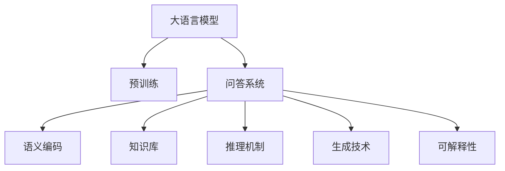

                 

# 大模型问答机器人如何编码语义

> 关键词：大语言模型,问答系统,语义理解,编码,自然语言处理(NLP),Transformers,BERT,深度学习

## 1. 背景介绍

### 1.1 问题由来
随着人工智能技术的不断发展，大语言模型在自然语言处理(NLP)领域取得了显著的突破。这些大模型通过在海量无标签文本数据上进行预训练，学习到了丰富的语言知识和常识，可以生成流畅且语义连贯的文本，甚至可以在特定的任务中表现出色。

问答系统作为NLP应用的一个重要领域，近年来也得到了广泛关注。传统的问答系统依赖于规则和模板，难以处理复杂问题，而基于大语言模型的问答机器人可以理解自然语言，进行语义理解，并生成结构化的答案。这种问答系统具有更强的通用性和灵活性，能够适应多种复杂场景，从而提升用户体验。

### 1.2 问题核心关键点
构建一个高效、准确、可解释性强的问答系统，需要解决以下关键问题：

- 语义理解：如何理解自然语言输入，将其转化为结构化的语义表示？
- 知识编码：如何将预训练模型学到的知识进行有效的编码，便于机器人快速检索和使用？
- 生成答案：如何基于编码好的知识生成符合用户需求的答案？
- 可解释性：如何设计系统，使其决策过程可解释，增强用户信任？

这些核心问题构成了问答系统开发的核心挑战，也促进了预训练大模型在问答领域的应用研究。

## 2. 核心概念与联系

### 2.1 核心概念概述

为更好地理解基于大语言模型的问答系统，本节将介绍几个关键概念：

- 大语言模型(Large Language Model, LLM)：如GPT、BERT等，通过在海量无标签文本数据上进行自监督预训练，学习通用的语言表示。
- 预训练(Pre-training)：指在无标签数据上通过自监督任务训练语言模型，学习到语言的通用表示。
- 问答系统(QA system)：系统能够自动回答用户提出的自然语言问题，通常由文本理解和生成两部分组成。
- 语义编码(Semantic Encoding)：将自然语言转化为结构化的语义表示，便于系统理解和推理。
- 知识库(Knowledge Base)：包含结构化的知识，供问答系统进行快速检索和推理。
- 推理机制(Inference Mechanism)：基于语义编码和知识库，系统如何得出答案。
- 生成技术(Generative Technology)：基于编码好的语义信息，生成结构化的答案或自然语言文本。
- 可解释性(Explainability)：系统决策过程的透明性和用户信任度。

这些核心概念之间的联系和互动关系，可以通过以下Mermaid流程图来展示：



这个流程图展示了大语言模型、预训练、问答系统、语义编码、知识库、推理机制、生成技术和可解释性等核心概念之间的逻辑关系。

## 3. 核心算法原理 & 具体操作步骤

### 3.1 算法原理概述

基于大语言模型的问答系统，本质上是一个深度学习模型，用于理解自然语言输入，并根据知识库检索和推理，生成结构化的答案。其核心思想是：将自然语言输入转化为结构化的语义表示，然后基于知识库进行检索和推理，生成最终答案。

具体地，问答系统的工作流程如下：

1. **输入处理**：将用户输入的自然语言转化为结构化的语义表示，通常使用向量编码。
2. **检索匹配**：在知识库中检索与语义表示最匹配的知识片段。
3. **推理生成**：基于匹配的知识片段和推理机制，生成最终答案。

### 3.2 算法步骤详解

#### 3.2.1 输入处理

输入处理是问答系统的第一步，通常包含以下几个步骤：

- **分词与标记**：将自然语言输入分割成单词或子词，并标注词性、命名实体等。
- **编码表示**：将分词后的输入转化为数值向量表示，供模型处理。
- **语义理解**：使用预训练语言模型对输入进行语义理解，得到语义表示。

#### 3.2.2 检索匹配

检索匹配是问答系统的关键步骤，通过在知识库中检索最匹配的知识片段，实现答案的生成。具体步骤如下：

- **向量计算**：将用户输入的语义表示与知识库中的文本向量进行相似度计算。
- **排序与选择**：根据相似度排序，选择最匹配的若干知识片段。
- **检索结果处理**：对检索结果进行去重、排序等处理，选择最相关和可信的片段。

#### 3.2.3 推理生成

推理生成是问答系统的最后一步，基于匹配的知识片段生成答案。具体步骤如下：

- **抽取信息**：从匹配的知识片段中抽取相关信息。
- **格式化输出**：将抽取的信息格式化为结构化的答案，如表格、列表等。
- **自然语言生成**：使用生成技术，将结构化信息转化为自然语言文本。

### 3.3 算法优缺点

基于大语言模型的问答系统具有以下优点：

- **语义理解能力强**：通过预训练语言模型的语义理解能力，可以更好地处理复杂的自然语言输入。
- **可扩展性强**：知识库和推理机制可以根据应用场景进行定制，实现功能扩展。
- **生成质量高**：通过生成技术，可以生成流畅且语义连贯的文本答案。
- **可解释性强**：通过可解释性技术，可以提供决策过程的透明性和用户信任。

但同时，该方法也存在一些局限性：

- **依赖标注数据**：问答系统的效果很大程度上依赖于预训练语言模型的质量，预训练模型的训练数据往往需要大量的标注数据，成本较高。
- **知识库构建复杂**：知识库的构建和维护需要专业知识，对于特定领域的应用场景，可能需要构建专用的知识库。
- **推理效率低**：基于预训练模型的推理过程通常较为复杂，需要大量的计算资源和时间。
- **可解释性不足**：大模型缺乏透明的决策过程，推理生成的答案难以解释。

尽管存在这些局限性，但基于大语言模型的问答系统已经在大规模应用中取得了显著的效果，并逐步成为NLP应用的一个重要方向。

### 3.4 算法应用领域

基于大语言模型的问答系统，已经在诸多领域得到了应用，包括：

- **智能客服**：自动回答用户的常见问题，提升服务效率。
- **教育辅导**：提供个性化学习方案和答疑，辅助学生学习。
- **医疗咨询**：自动解答医疗相关问题，提供健康建议。
- **法律咨询**：回答法律相关问题，提供法律建议。
- **旅游推荐**：提供旅行咨询和建议，提升用户体验。
- **金融咨询**：自动解答金融相关问题，提供投资建议。
- **智能家居**：回答问题并控制智能设备，提升生活便捷性。

这些应用场景展示了问答系统的广泛应用前景，通过高效、准确的回答，提升了各领域的智能化水平和服务质量。

## 4. 数学模型和公式 & 详细讲解 & 举例说明

### 4.1 数学模型构建

本节将使用数学语言对基于大语言模型的问答系统进行更加严格的刻画。

记问答系统为 $Q = (E, K, I)$，其中 $E$ 为编码器，$K$ 为知识库，$I$ 为推理器。假设自然语言输入为 $x$，知识库中包含 $N$ 个知识点 $k_i$，推理结果为 $y$。

定义编码器 $E$ 的输出向量为 $z_x = E(x)$，知识库中的知识点编码为 $z_{k_i} = K(k_i)$。推理器的输出为 $y = I(z_x, z_{k_i})$。

### 4.2 公式推导过程

假设用户输入为自然语言 $x$，编码器的输出向量为 $z_x \in \mathbb{R}^d$，知识库中每个知识点编码为 $z_{k_i} \in \mathbb{R}^d$。知识库检索的相似度矩阵为 $S = \{s_i\}_{i=1}^N$，其中 $s_i = \text{cosine}(z_x, z_{k_i})$。

推理器将检索到的知识片段和输入向量 $z_x$ 进行综合，得到推理结果 $y$。假设推理器为深度神经网络，其输出层的权重矩阵为 $W$，偏置向量为 $b$。则推理器的输出为：

$$
y = W \cdot z_x + b
$$

其中 $W$ 和 $b$ 需要根据知识库中已有的知识点进行训练，使其能够生成符合预期的答案。

### 4.3 案例分析与讲解

假设用户输入为问题 $x = "今天天气怎么样？" \in \mathbb{R}^d$，编码器的输出向量为 $z_x = E(x)$，知识库中包含 $N = 1000$ 个知识点，每个知识点编码为 $z_{k_i} \in \mathbb{R}^d$。知识库检索的相似度矩阵为 $S = \{s_i\}_{i=1}^N$，其中 $s_i = \text{cosine}(z_x, z_{k_i})$。

推理器将检索到的知识片段和输入向量 $z_x$ 进行综合，得到推理结果 $y$。假设推理器为深度神经网络，其输出层的权重矩阵为 $W \in \mathbb{R}^{d \times d}$，偏置向量为 $b \in \mathbb{R}^d$。则推理器的输出为：

$$
y = W \cdot z_x + b
$$

在实际应用中，为了进一步提升推理精度，可以通过引入注意力机制、上下文理解等技术，提升知识片段与输入向量之间的关联度，从而生成更加准确的答案。

## 5. 项目实践：代码实例和详细解释说明

### 5.1 开发环境搭建

在进行问答系统开发前，我们需要准备好开发环境。以下是使用Python进行PyTorch开发的环境配置流程：

1. 安装Anaconda：从官网下载并安装Anaconda，用于创建独立的Python环境。

2. 创建并激活虚拟环境：
```bash
conda create -n pytorch-env python=3.8 
conda activate pytorch-env
```

3. 安装PyTorch：根据CUDA版本，从官网获取对应的安装命令。例如：
```bash
conda install pytorch torchvision torchaudio cudatoolkit=11.1 -c pytorch -c conda-forge
```

4. 安装Transformers库：
```bash
pip install transformers
```

5. 安装各类工具包：
```bash
pip install numpy pandas scikit-learn matplotlib tqdm jupyter notebook ipython
```

完成上述步骤后，即可在`pytorch-env`环境中开始问答系统开发。

### 5.2 源代码详细实现

这里我们以BERT作为问答系统的基础模型，构建一个简单的问答系统。代码如下：

```python
import torch
from transformers import BertTokenizer, BertForQuestionAnswering

# 初始化BERT模型和分词器
tokenizer = BertTokenizer.from_pretrained('bert-base-uncased')
model = BertForQuestionAnswering.from_pretrained('bert-base-uncased')

# 定义问答函数
def answer_question(question, context):
    # 分词处理
    inputs = tokenizer(question, context, return_tensors='pt', padding=True, max_length=512)
    
    # 计算注意力得分
    with torch.no_grad():
        logits = model(**inputs).logits
    
    # 获取最大得分和索引
    max_score, max_idx = torch.max(logits, dim=1)
    
    # 获取答案起始和终止位置
    start, end = max_idx.view(-1).item(), max_idx.view(-1)[0] + 1
    answer = tokenizer.convert_tokens_to_string(tokenizer.convert_ids_to_tokens(inputs['input_ids'][0][start:end]))
    
    return answer

# 测试问答系统
question = "Who is the president of the United States?"
context = "The United States of America is a country located in North America. It consists of 50 states, a federal district, and various territories. The president is the head of state and government."
answer = answer_question(question, context)
print(answer)
```

### 5.3 代码解读与分析

让我们再详细解读一下关键代码的实现细节：

**tokenizer对象**：
- 使用BertTokenizer分词器，对问题和上下文进行分词处理。
- 返回一个字典，包含输入的token ids、position ids、segment ids等。

**model对象**：
- 使用BertForQuestionAnswering模型，对分词处理后的输入进行问答计算。
- 返回一个字典，包含logits、start_logits、end_logits等。

**answer函数**：
- 对logits进行最大值计算，获取注意力得分最大的位置。
- 根据最大得分的位置，获取答案的起始和终止位置。
- 将token ids转换为token字符串，得到最终答案。

**测试问答系统**：
- 定义一个问题和一段上下文。
- 调用answer函数，获取问题对应的答案。
- 输出答案。

可以看到，PyTorch配合Transformers库使得BERT问答系统的实现相对简洁。开发者可以将更多精力放在数据处理、模型改进等高层逻辑上，而不必过多关注底层的实现细节。

当然，工业级的系统实现还需考虑更多因素，如模型的保存和部署、超参数的自动搜索、更灵活的任务适配层等。但核心的问答范式基本与此类似。

## 6. 实际应用场景

### 6.1 智能客服系统

基于大语言模型的问答系统可以广泛应用于智能客服系统的构建。传统客服往往需要配备大量人力，高峰期响应缓慢，且一致性和专业性难以保证。而使用问答系统，可以7x24小时不间断服务，快速响应客户咨询，用自然流畅的语言解答各类常见问题。

在技术实现上，可以收集企业内部的历史客服对话记录，将问题和最佳答复构建成监督数据，在此基础上对BERT等模型进行微调。微调后的模型能够自动理解用户意图，匹配最合适的答案模板进行回复。对于客户提出的新问题，还可以接入检索系统实时搜索相关内容，动态组织生成回答。如此构建的智能客服系统，能大幅提升客户咨询体验和问题解决效率。

### 6.2 金融舆情监测

金融机构需要实时监测市场舆论动向，以便及时应对负面信息传播，规避金融风险。传统的人工监测方式成本高、效率低，难以应对网络时代海量信息爆发的挑战。基于大语言模型的问答系统，可以为金融舆情监测提供新的解决方案。

具体而言，可以收集金融领域相关的新闻、报道、评论等文本数据，并对其进行主题标注和情感标注。在此基础上对BERT等模型进行微调，使其能够自动判断文本属于何种主题，情感倾向是正面、中性还是负面。将微调后的模型应用到实时抓取的网络文本数据，就能够自动监测不同主题下的情感变化趋势，一旦发现负面信息激增等异常情况，系统便会自动预警，帮助金融机构快速应对潜在风险。

### 6.3 个性化推荐系统

当前的推荐系统往往只依赖用户的历史行为数据进行物品推荐，无法深入理解用户的真实兴趣偏好。基于大语言模型问答系统，可以更好地挖掘用户行为背后的语义信息，从而提供更精准、多样的推荐内容。

在实践中，可以收集用户浏览、点击、评论、分享等行为数据，提取和用户交互的物品标题、描述、标签等文本内容。将文本内容作为模型输入，用户的后续行为（如是否点击、购买等）作为监督信号，在此基础上微调BERT等模型。微调后的模型能够从文本内容中准确把握用户的兴趣点。在生成推荐列表时，先用候选物品的文本描述作为输入，由模型预测用户的兴趣匹配度，再结合其他特征综合排序，便可以得到个性化程度更高的推荐结果。

### 6.4 未来应用展望

随着大语言模型和问答系统的不断发展，基于问答系统范式将在更多领域得到应用，为传统行业带来变革性影响。

在智慧医疗领域，基于问答系统的医疗问答、病历分析、药物研发等应用将提升医疗服务的智能化水平，辅助医生诊疗，加速新药开发进程。

在智能教育领域，问答系统可应用于作业批改、学情分析、知识推荐等方面，因材施教，促进教育公平，提高教学质量。

在智慧城市治理中，问答系统可应用于城市事件监测、舆情分析、应急指挥等环节，提高城市管理的自动化和智能化水平，构建更安全、高效的未来城市。

此外，在企业生产、社会治理、文娱传媒等众多领域，基于大语言模型的问答系统也将不断涌现，为经济社会发展注入新的动力。相信随着技术的日益成熟，问答系统必将引领NLP技术的产业化进程，推动NLP技术向更广阔的应用领域拓展。

## 7. 工具和资源推荐

### 7.1 学习资源推荐

为了帮助开发者系统掌握基于大语言模型的问答系统的理论基础和实践技巧，这里推荐一些优质的学习资源：

1. 《深度学习理论与实践》系列博文：由大模型技术专家撰写，深入浅出地介绍了深度学习理论和实践，涵盖自然语言处理、计算机视觉等多个领域。

2. CS231n《深度学习计算机视觉》课程：斯坦福大学开设的深度学习计算机视觉明星课程，有Lecture视频和配套作业，带你入门深度学习的基本概念和经典模型。

3. 《自然语言处理与深度学习》书籍：斯坦福大学公开课讲义，详细介绍了自然语言处理的基本原理和深度学习技术的应用。

4. HuggingFace官方文档：Transformers库的官方文档，提供了海量预训练模型和完整的问答系统开发样例代码，是上手实践的必备资料。

5. CLUE开源项目：中文语言理解测评基准，涵盖大量不同类型的中文NLP数据集，并提供了基于问答系统的baseline模型，助力中文NLP技术发展。

通过对这些资源的学习实践，相信你一定能够快速掌握大语言模型问答系统的精髓，并用于解决实际的NLP问题。

### 7.2 开发工具推荐

高效的开发离不开优秀的工具支持。以下是几款用于大语言模型问答系统开发的常用工具：

1. PyTorch：基于Python的开源深度学习框架，灵活动态的计算图，适合快速迭代研究。BERT等预训练模型都有PyTorch版本的实现。

2. TensorFlow：由Google主导开发的开源深度学习框架，生产部署方便，适合大规模工程应用。BERT等模型也有TensorFlow的版本。

3. Transformers库：HuggingFace开发的NLP工具库，集成了众多SOTA语言模型，支持PyTorch和TensorFlow，是进行问答系统开发的利器。

4. Weights & Biases：模型训练的实验跟踪工具，可以记录和可视化模型训练过程中的各项指标，方便对比和调优。与主流深度学习框架无缝集成。

5. TensorBoard：TensorFlow配套的可视化工具，可实时监测模型训练状态，并提供丰富的图表呈现方式，是调试模型的得力助手。

6. Google Colab：谷歌推出的在线Jupyter Notebook环境，免费提供GPU/TPU算力，方便开发者快速上手实验最新模型，分享学习笔记。

合理利用这些工具，可以显著提升大语言模型问答系统的开发效率，加快创新迭代的步伐。

### 7.3 相关论文推荐

大语言模型和问答系统的研究源于学界的持续研究。以下是几篇奠基性的相关论文，推荐阅读：

1. Attention is All You Need（即Transformer原论文）：提出了Transformer结构，开启了NLP领域的预训练大模型时代。

2. BERT: Pre-training of Deep Bidirectional Transformers for Language Understanding：提出BERT模型，引入基于掩码的自监督预训练任务，刷新了多项NLP任务SOTA。

3. T5: Exploring the Limits of Transfer Learning with a Unified Text-to-Text Transformer：提出T5模型，通过预训练大模型解决各种文本处理任务，简化了NLP任务的处理流程。

4. BART: Denoising Sequence-to-Sequence Pre-training for Natural Language Generation, Translation, and Comprehension：提出BART模型，通过预训练生成大模型，提升了序列生成任务的性能。

5. CLIP: A Simple yet Powerful Method for Unsupervised Visual Recognition and Detection：提出CLIP模型，通过预训练生成大模型，提升了图像识别和分类任务的性能。

这些论文代表了大语言模型问答系统的研究脉络，通过学习这些前沿成果，可以帮助研究者把握学科前进方向，激发更多的创新灵感。

## 8. 总结：未来发展趋势与挑战

### 8.1 总结

本文对基于大语言模型的问答系统进行了全面系统的介绍。首先阐述了问答系统的研究背景和意义，明确了问答系统在提升智能化水平和服务质量方面的独特价值。其次，从原理到实践，详细讲解了问答系统的数学原理和关键步骤，给出了问答系统开发的完整代码实例。同时，本文还广泛探讨了问答系统在智能客服、金融舆情、个性化推荐等多个领域的应用前景，展示了问答系统的广泛应用前景。此外，本文精选了问答系统的各类学习资源，力求为读者提供全方位的技术指引。

通过本文的系统梳理，可以看到，基于大语言模型的问答系统在大规模应用中取得了显著的效果，并逐步成为NLP应用的一个重要方向。未来，伴随大语言模型和问答系统的不断演进，问答系统必将在更多领域得到应用，为传统行业带来变革性影响。

### 8.2 未来发展趋势

展望未来，基于大语言模型的问答系统将呈现以下几个发展趋势：

1. **模型规模持续增大**。随着算力成本的下降和数据规模的扩张，大语言模型的参数量还将持续增长。超大规模语言模型蕴含的丰富语言知识，有望支撑更加复杂多变的问答任务。

2. **微调方法日趋多样**。除了传统的全参数微调外，未来会涌现更多参数高效的微调方法，如 Adapter、LoRA等，在节省计算资源的同时也能保证问答系统的准确性。

3. **知识库的多样化和个性化**。未来的知识库将更加多样化、个性化，根据应用场景定制，满足不同用户的需求。知识库的构建和维护也将更加智能化，借助知识图谱、专家系统等技术，实现知识的动态更新和推理。

4. **多模态问答系统**。未来的问答系统将支持多模态数据处理，将视觉、语音、文本等多种信息融合，实现更全面、深入的理解和推理。

5. **上下文理解能力增强**。未来的问答系统将具备更强的上下文理解能力，能够理解长序列的文本输入，捕捉复杂的语义关系。

6. **生成能力的提升**。未来的问答系统将具备更强的生成能力，能够生成流畅、连贯的自然语言答案，提供更优质的用户体验。

以上趋势凸显了问答系统的发展方向，这些方向的探索发展，必将进一步提升问答系统的性能和应用范围，为NLP技术的产业化进程提供新的动力。

### 8.3 面临的挑战

尽管大语言模型问答系统已经取得了显著的效果，但在迈向更加智能化、普适化应用的过程中，它仍面临着诸多挑战：

1. **标注成本瓶颈**。虽然问答系统的效果很大程度上依赖于预训练语言模型的质量，但标注数据的质量和数量仍需提升，以进一步提升问答系统的性能。

2. **知识库构建复杂**。知识库的构建和维护需要专业知识，对于特定领域的应用场景，可能需要构建专用的知识库。

3. **推理效率低**。基于大语言模型的推理过程通常较为复杂，需要大量的计算资源和时间。

4. **可解释性不足**。大模型缺乏透明的决策过程，推理生成的答案难以解释。

5. **知识库更新维护困难**。知识库需要不断更新，以适应新知识和用户需求的变化，但维护知识库的过程复杂且耗时。

6. **鲁棒性和泛化性不足**。问答系统在处理噪声数据、长序列输入等方面可能表现不佳，泛化性能有待提升。

尽管存在这些挑战，但随着学界和产业界的共同努力，这些问题终将逐一被克服，大语言模型问答系统必将在构建人机协同的智能系统过程中发挥越来越重要的作用。

### 8.4 研究展望

面对大语言模型问答系统所面临的挑战，未来的研究需要在以下几个方面寻求新的突破：

1. **知识库的自动构建与维护**。开发自动构建知识库的技术，利用NLP技术从开放数据源中自动提取知识，并实现知识库的动态更新。

2. **推理机制的优化**。引入深度强化学习等技术，优化问答系统的推理机制，提升推理效率和准确性。

3. **多模态问答的融合**。将视觉、语音、文本等多种信息进行融合，提升系统的理解和推理能力。

4. **生成能力的提升**。引入生成对抗网络等技术，提升问答系统的生成能力，生成流畅、连贯的自然语言答案。

5. **上下文理解能力的增强**。引入上下文感知网络等技术，提升问答系统对长序列文本的理解能力。

6. **知识库的多样化和个性化**。开发多模态知识库的构建技术，提升知识库的丰富度和个性化程度。

这些研究方向的探索，必将引领大语言模型问答系统技术迈向更高的台阶，为构建安全、可靠、可解释、可控的智能系统铺平道路。面向未来，大语言模型问答系统还需要与其他人工智能技术进行更深入的融合，如知识表示、因果推理、强化学习等，多路径协同发力，共同推动自然语言理解和智能交互系统的进步。只有勇于创新、敢于突破，才能不断拓展问答系统的边界，让智能技术更好地造福人类社会。

## 9. 附录：常见问题与解答

**Q1：问答系统如何理解自然语言输入？**

A: 问答系统通过预训练语言模型对输入的自然语言进行语义理解，得到语义表示。常用的方法是使用BERT等模型，将输入文本编码成向量表示，用于后续的推理计算。

**Q2：问答系统如何进行知识库检索？**

A: 问答系统通过相似度计算，在知识库中检索与输入语义表示最匹配的知识点。常用的方法是使用余弦相似度或点积相似度等计算方法，根据相似度排序选择最匹配的知识点。

**Q3：问答系统如何进行推理生成？**

A: 问答系统通过深度神经网络对检索到的知识片段和输入向量进行综合，生成最终的推理结果。常用的方法是使用全连接层、注意力机制等，将知识片段和输入向量进行综合计算，得到结构化的答案。

**Q4：问答系统如何提高可解释性？**

A: 问答系统可以通过引入可解释性技术，如部分解码、文本解释等，提高系统的可解释性。常用的方法是使用LIME、SHAP等方法，对系统决策过程进行解释，提高用户信任。

**Q5：问答系统如何在多模态数据中处理图像信息？**

A: 问答系统可以引入计算机视觉技术，对图像进行理解，并结合文本信息进行综合推理。常用的方法是使用CLIP、DETR等模型，将视觉信息编码为向量表示，与文本信息进行融合计算。

---

作者：禅与计算机程序设计艺术 / Zen and the Art of Computer Programming

