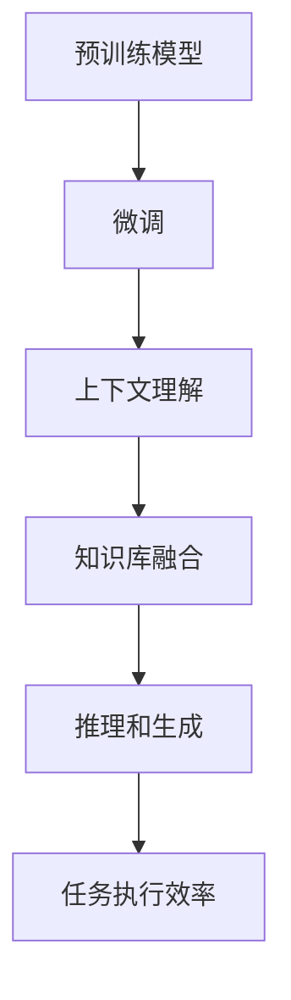

                 

# 大模型问答机器人的任务执行

> 关键词：大模型问答系统, 任务执行, 自然语言处理(NLP), 预训练模型, 微调, 推理, 上下文理解, 知识库

## 1. 背景介绍

### 1.1 问题由来

随着人工智能技术的发展，问答系统已经成为了人机交互的重要方式之一。传统的基于规则的问答系统，往往需要大量手工编写的规则和模板，难以覆盖所有可能的问题和答案。而基于深度学习的问答系统，特别是大模型问答系统，可以通过预训练和微调，快速适应各种领域的问答需求，极大地提高了系统的通用性和灵活性。

近年来，基于大模型的问答系统已经在多个领域取得了突破性进展，如智能客服、智能搜索、医疗咨询等。这些系统通过大规模无标签数据进行预训练，学习到了丰富的语言知识和上下文理解能力，再通过少量的有标签数据进行微调，实现特定领域的问答功能。然而，在大模型问答系统实际应用中，任务执行的效率和效果仍存在一些挑战，需要进一步研究和优化。

### 1.2 问题核心关键点

大模型问答系统的核心问题是如何高效、准确地执行用户提出的问答任务。其中，以下几个关键点需要重点关注：

1. **预训练和微调**：如何通过预训练模型学习通用的语言知识，再通过微调获得特定领域的问答能力。
2. **上下文理解**：如何处理用户的上下文信息和历史对话记录，提升对复杂问题的理解能力。
3. **知识库融合**：如何将知识库中的结构化信息与大模型的自然语言理解能力相结合，提升回答的准确性和相关性。
4. **推理和生成**：如何在大模型中嵌入推理逻辑，生成符合上下文语境的合理回答。
5. **任务执行效率**：如何在保证回答质量的同时，提升系统响应速度和资源利用效率。

本文将从以上几个关键点出发，对大模型问答系统的任务执行进行深入探讨。

## 2. 核心概念与联系

### 2.1 核心概念概述

为更好地理解大模型问答系统的任务执行机制，本节将介绍几个密切相关的核心概念：

- **预训练模型**：如BERT、GPT等大模型，通过在大规模无标签文本数据上进行自监督学习，学习到丰富的语言知识和上下文表示能力。
- **微调**：在预训练模型基础上，使用下游任务的少量标注数据进行有监督学习，优化模型在该任务上的表现。
- **上下文理解**：大模型在处理问答任务时，需要理解用户提供的上下文信息，包括问题的上下文、历史对话记录等，从而更好地回答问题。
- **知识库融合**：将结构化知识（如百科全书、医学数据库等）与大模型的自然语言理解能力结合，提升回答的准确性和相关性。
- **推理和生成**：在理解用户意图和上下文的基础上，通过推理和生成逻辑，生成符合语境的回答。
- **任务执行效率**：通过优化推理和生成的计算流程，提升系统的响应速度和资源利用效率。

这些概念之间的逻辑关系可以通过以下Mermaid流程图来展示：



这个流程图展示了大模型问答系统任务执行的核心概念及其之间的关系：

1. 大模型通过预训练获得基础能力。
2. 微调使得模型更好地适应特定领域的问答需求。
3. 上下文理解使得模型能够理解用户意图和上下文信息。
4. 知识库融合将结构化知识与自然语言处理能力相结合，提升回答的准确性和相关性。
5. 推理和生成过程生成符合语境的合理回答。
6. 任务执行效率提升系统响应速度和资源利用效率。

这些概念共同构成了大模型问答系统的任务执行框架，使得系统能够高效、准确地执行用户提出的各种问答任务。

## 3. 核心算法原理 & 具体操作步骤
### 3.1 算法原理概述

大模型问答系统的任务执行，本质上是通过预训练和微调获得的模型，对用户提出的问答进行理解、推理和生成。具体来说，包括以下几个步骤：

1. **预训练**：在大规模无标签文本数据上进行自监督学习，学习通用的语言知识和上下文表示能力。
2. **微调**：在预训练模型基础上，使用下游任务的少量标注数据进行有监督学习，优化模型在该任务上的表现。
3. **上下文理解**：将用户的问题和历史对话记录作为上下文输入，更新模型状态。
4. **知识库融合**：将结构化知识与自然语言理解能力结合，提升回答的准确性和相关性。
5. **推理和生成**：在理解用户意图和上下文的基础上，通过推理和生成逻辑，生成符合语境的回答。

### 3.2 算法步骤详解

#### 3.2.1 预训练

预训练过程是构建大模型问答系统的基础步骤，其目标是通过自监督学习任务，学习到通用的语言知识和上下文表示能力。具体步骤如下：

1. **选择预训练数据集**：如维基百科、新闻报道、社交媒体等大规模文本数据集。
2. **设计预训练任务**：如掩码语言模型、下一句预测、句子相似度等自监督学习任务。
3. **模型训练**：使用预训练数据集进行训练，通常使用Transformer等架构。
4. **保存预训练模型**：将训练好的预训练模型保存下来，用于后续的微调和任务执行。

#### 3.2.2 微调

微调过程是使大模型更好地适应特定领域的问答需求。具体步骤如下：

1. **选择微调数据集**：根据特定领域的问答任务，选择适量的有标签数据集，如医疗咨询、金融问答、客户服务等。
2. **设计任务适配层**：根据任务类型，设计合适的输出层和损失函数，如分类任务使用交叉熵损失，生成任务使用负对数似然损失等。
3. **设置微调超参数**：选择合适的优化器、学习率、批大小等超参数。
4. **执行梯度训练**：使用微调数据集进行训练，更新模型参数。
5. **保存微调模型**：将训练好的微调模型保存下来，用于后续的任务执行。

#### 3.2.3 上下文理解

上下文理解是问答系统任务执行的关键环节，其目标是通过理解用户提供的上下文信息，提升对复杂问题的理解能力。具体步骤如下：

1. **收集上下文信息**：包括用户的问题、历史对话记录等。
2. **构建上下文表示**：将上下文信息转换为模型可以处理的向量表示。
3. **更新模型状态**：将上下文表示输入到微调模型中，更新模型状态。

#### 3.2.4 知识库融合

知识库融合是将结构化知识与大模型的自然语言理解能力结合，提升回答的准确性和相关性。具体步骤如下：

1. **选择知识库**：根据任务需求，选择合适的知识库，如维基百科、医学数据库等。
2. **提取知识表示**：从知识库中提取结构化信息，转换为模型可以处理的向量表示。
3. **融合知识表示**：将知识表示与上下文表示进行融合，提升模型的回答能力。

#### 3.2.5 推理和生成

推理和生成是生成符合语境的回答的过程。具体步骤如下：

1. **推理**：在理解用户意图和上下文的基础上，通过推理逻辑，生成可能的答案。
2. **生成**：根据推理结果，生成符合语境的回答。

### 3.3 算法优缺点

大模型问答系统的任务执行具有以下优点：

1. **通用性强**：通过预训练和微调，模型能够适应多种领域的问答需求，具有较强的通用性。
2. **回答效果好**：通过上下文理解、知识库融合和推理生成，能够生成符合语境的合理回答。
3. **部署简单**：使用预训练和微调后的模型，可以方便快捷地部署到各种应用场景中。

同时，该方法也存在一些局限性：

1. **数据依赖**：微调效果很大程度上取决于标注数据的质量和数量，标注数据获取成本较高。
2. **模型复杂度**：大模型结构复杂，推理生成过程计算量大，对硬件资源要求较高。
3. **上下文理解能力有限**：在某些复杂问题上，上下文理解能力可能不足，导致回答不准确。
4. **知识库更新不及时**：知识库需要定期更新，以保证回答的准确性和时效性。
5. **推理能力不足**：在某些任务中，模型的推理能力可能无法满足需求，需要结合外部推理引擎。

尽管存在这些局限性，但大模型问答系统通过预训练和微调，已经展示了其在问答任务执行中的强大能力，成为NLP技术应用的重要手段。未来相关研究的重点在于如何进一步降低对标注数据的依赖，提高模型的推理能力和上下文理解能力，同时兼顾模型的效率和可解释性等因素。

### 3.4 算法应用领域

大模型问答系统已经在多个领域得到了广泛应用，包括：

- **智能客服**：通过微调模型，构建智能客服系统，快速响应客户咨询，提升客户满意度。
- **金融咨询**：在金融领域，微调模型可以用于解答客户的金融问题，提供投资建议、理财规划等服务。
- **医疗咨询**：微调模型可以用于解答病人的医疗问题，提供健康建议、疾病诊断等服务。
- **智能搜索**：在搜索引擎中，微调模型可以用于理解用户的查询意图，生成个性化的搜索结果。
- **教育应用**：微调模型可以用于智能教育系统，解答学生问题，提供个性化学习建议。

除了上述这些经典应用外，大模型问答系统还被创新性地应用到更多场景中，如智能助手、智能推荐、智能聊天机器人等，为NLP技术带来了新的突破。随着预训练模型和微调方法的不断进步，相信NLP技术将在更广阔的应用领域大放异彩。

## 4. 数学模型和公式 & 详细讲解  
### 4.1 数学模型构建

本节将使用数学语言对大模型问答系统的任务执行进行更加严格的刻画。

记预训练语言模型为 $M_{\theta}$，其中 $\theta$ 为预训练得到的模型参数。假设问答任务的训练集为 $D=\{(x_i, y_i)\}_{i=1}^N, x_i \in \mathcal{X}, y_i \in \mathcal{Y}$。其中，$\mathcal{X}$ 为输入空间，$\mathcal{Y}$ 为输出空间，$x_i$ 为问题-上下文对，$y_i$ 为答案。

定义模型 $M_{\theta}$ 在输入 $x_i$ 上的输出为 $\hat{y}=M_{\theta}(x_i)$，表示模型预测的答案是问题 $x_i$ 的上下文表示的编码。在微调过程中，我们希望最小化模型输出与真实答案 $y_i$ 之间的差异，即最小化损失函数 $\ell$：

$$
\ell(M_{\theta}(x_i), y_i) = \mathcal{L}(y_i, \hat{y})
$$

其中 $\mathcal{L}$ 为适合于特定任务（如分类、生成等）的损失函数。在问答系统中，通常使用交叉熵损失或序列对数似然损失等。

### 4.2 公式推导过程

以分类任务为例，假设模型 $M_{\theta}$ 在输入 $x_i$ 上的输出为 $\hat{y}=M_{\theta}(x_i) \in \mathbb{R}^C$，表示问题 $x_i$ 的上下文表示的编码。真实答案 $y_i \in \{1, \cdots, C\}$，其中 $C$ 为类别数。则分类损失函数定义为：

$$
\ell(M_{\theta}(x_i), y_i) = -\log \hat{y}(y_i)
$$

在微调过程中，我们希望最小化模型输出与真实答案之间的交叉熵损失，即：

$$
\mathcal{L}(M_{\theta}, D) = \frac{1}{N} \sum_{i=1}^N \ell(M_{\theta}(x_i), y_i)
$$

根据链式法则，损失函数对参数 $\theta$ 的梯度为：

$$
\frac{\partial \mathcal{L}(M_{\theta}, D)}{\partial \theta} = \frac{1}{N} \sum_{i=1}^N \frac{\partial \ell(M_{\theta}(x_i), y_i)}{\partial \theta}
$$

在得到损失函数的梯度后，即可带入参数更新公式，完成模型的迭代优化。重复上述过程直至收敛，最终得到适应下游任务的最优模型参数 $\theta^*$。

### 4.3 案例分析与讲解

以智能客服系统为例，分析大模型问答系统的任务执行过程。

智能客服系统通过微调预训练语言模型，实现自动理解客户咨询并生成应答。具体步骤如下：

1. **数据准备**：收集大量的客户咨询和客服回复数据，将其标注为问题-上下文对和答案对。
2. **模型微调**：使用微调后的模型对客户咨询进行理解，预测可能的答案。
3. **上下文理解**：结合历史对话记录，更新模型的上下文表示。
4. **知识库融合**：从知识库中提取相关问题-答案对，更新模型的知识表示。
5. **推理生成**：根据推理逻辑，生成最终的回答。

通过上述步骤，智能客服系统能够高效、准确地执行客户咨询任务，提升客户满意度。

## 5. 项目实践：代码实例和详细解释说明
### 5.1 开发环境搭建

在进行问答系统开发前，我们需要准备好开发环境。以下是使用Python进行PyTorch开发的环境配置流程：

1. 安装Anaconda：从官网下载并安装Anaconda，用于创建独立的Python环境。

2. 创建并激活虚拟环境：
```bash
conda create -n pytorch-env python=3.8 
conda activate pytorch-env
```

3. 安装PyTorch：根据CUDA版本，从官网获取对应的安装命令。例如：
```bash
conda install pytorch torchvision torchaudio cudatoolkit=11.1 -c pytorch -c conda-forge
```

4. 安装Transformers库：
```bash
pip install transformers
```

5. 安装各类工具包：
```bash
pip install numpy pandas scikit-learn matplotlib tqdm jupyter notebook ipython
```

完成上述步骤后，即可在`pytorch-env`环境中开始问答系统开发。

### 5.2 源代码详细实现

下面我们以智能客服系统为例，给出使用Transformers库对BERT模型进行问答系统微调的PyTorch代码实现。

首先，定义问答任务的数据处理函数：

```python
from transformers import BertTokenizer
from torch.utils.data import Dataset
import torch

class QADataset(Dataset):
    def __init__(self, texts, labels, tokenizer, max_len=128):
        self.texts = texts
        self.labels = labels
        self.tokenizer = tokenizer
        self.max_len = max_len
        
    def __len__(self):
        return len(self.texts)
    
    def __getitem__(self, item):
        text = self.texts[item]
        label = self.labels[item]
        
        encoding = self.tokenizer(text, return_tensors='pt', max_length=self.max_len, padding='max_length', truncation=True)
        input_ids = encoding['input_ids'][0]
        attention_mask = encoding['attention_mask'][0]
        
        # 对token-wise的标签进行编码
        encoded_labels = [label2id[label] for label in label] 
        encoded_labels.extend([label2id['O']] * (self.max_len - len(encoded_labels)))
        labels = torch.tensor(encoded_labels, dtype=torch.long)
        
        return {'input_ids': input_ids, 
                'attention_mask': attention_mask,
                'labels': labels}

# 标签与id的映射
label2id = {'O': 0, 'A': 1, 'B': 2, 'C': 3}
id2label = {v: k for k, v in label2id.items()}

# 创建dataset
tokenizer = BertTokenizer.from_pretrained('bert-base-cased')

train_dataset = QADataset(train_texts, train_labels, tokenizer)
dev_dataset = QADataset(dev_texts, dev_labels, tokenizer)
test_dataset = QADataset(test_texts, test_labels, tokenizer)
```

然后，定义模型和优化器：

```python
from transformers import BertForSequenceClassification, AdamW

model = BertForSequenceClassification.from_pretrained('bert-base-cased', num_labels=len(label2id))

optimizer = AdamW(model.parameters(), lr=2e-5)
```

接着，定义训练和评估函数：

```python
from torch.utils.data import DataLoader
from tqdm import tqdm
from sklearn.metrics import classification_report

device = torch.device('cuda') if torch.cuda.is_available() else torch.device('cpu')
model.to(device)

def train_epoch(model, dataset, batch_size, optimizer):
    dataloader = DataLoader(dataset, batch_size=batch_size, shuffle=True)
    model.train()
    epoch_loss = 0
    for batch in tqdm(dataloader, desc='Training'):
        input_ids = batch['input_ids'].to(device)
        attention_mask = batch['attention_mask'].to(device)
        labels = batch['labels'].to(device)
        model.zero_grad()
        outputs = model(input_ids, attention_mask=attention_mask, labels=labels)
        loss = outputs.loss
        epoch_loss += loss.item()
        loss.backward()
        optimizer.step()
    return epoch_loss / len(dataloader)

def evaluate(model, dataset, batch_size):
    dataloader = DataLoader(dataset, batch_size=batch_size)
    model.eval()
    preds, labels = [], []
    with torch.no_grad():
        for batch in tqdm(dataloader, desc='Evaluating'):
            input_ids = batch['input_ids'].to(device)
            attention_mask = batch['attention_mask'].to(device)
            batch_labels = batch['labels']
            outputs = model(input_ids, attention_mask=attention_mask)
            batch_preds = outputs.logits.argmax(dim=2).to('cpu').tolist()
            batch_labels = batch_labels.to('cpu').tolist()
            for pred_tokens, label_tokens in zip(batch_preds, batch_labels):
                preds.append(pred_tokens[:len(label_tokens)])
                labels.append(label_tokens)
                
    print(classification_report(labels, preds))
```

最后，启动训练流程并在测试集上评估：

```python
epochs = 5
batch_size = 16

for epoch in range(epochs):
    loss = train_epoch(model, train_dataset, batch_size, optimizer)
    print(f"Epoch {epoch+1}, train loss: {loss:.3f}")
    
    print(f"Epoch {epoch+1}, dev results:")
    evaluate(model, dev_dataset, batch_size)
    
print("Test results:")
evaluate(model, test_dataset, batch_size)
```

以上就是使用PyTorch对BERT进行智能客服系统微调的完整代码实现。可以看到，得益于Transformers库的强大封装，我们可以用相对简洁的代码完成BERT模型的加载和微调。

### 5.3 代码解读与分析

让我们再详细解读一下关键代码的实现细节：

**QADataset类**：
- `__init__`方法：初始化文本、标签、分词器等关键组件。
- `__len__`方法：返回数据集的样本数量。
- `__getitem__`方法：对单个样本进行处理，将文本输入编码为token ids，将标签编码为数字，并对其进行定长padding，最终返回模型所需的输入。

**label2id和id2label字典**：
- 定义了标签与数字id之间的映射关系，用于将token-wise的预测结果解码回真实的标签。

**训练和评估函数**：
- 使用PyTorch的DataLoader对数据集进行批次化加载，供模型训练和推理使用。
- 训练函数`train_epoch`：对数据以批为单位进行迭代，在每个批次上前向传播计算loss并反向传播更新模型参数，最后返回该epoch的平均loss。
- 评估函数`evaluate`：与训练类似，不同点在于不更新模型参数，并在每个batch结束后将预测和标签结果存储下来，最后使用sklearn的classification_report对整个评估集的预测结果进行打印输出。

**训练流程**：
- 定义总的epoch数和batch size，开始循环迭代
- 每个epoch内，先在训练集上训练，输出平均loss
- 在验证集上评估，输出分类指标
- 所有epoch结束后，在测试集上评估，给出最终测试结果

可以看到，PyTorch配合Transformers库使得BERT微调的代码实现变得简洁高效。开发者可以将更多精力放在数据处理、模型改进等高层逻辑上，而不必过多关注底层的实现细节。

当然，工业级的系统实现还需考虑更多因素，如模型的保存和部署、超参数的自动搜索、更灵活的任务适配层等。但核心的微调范式基本与此类似。

## 6. 实际应用场景
### 6.1 智能客服系统

基于大模型问答系统的智能客服系统，可以7x24小时不间断服务，快速响应客户咨询，用自然流畅的语言解答各类常见问题。

在技术实现上，可以收集企业内部的历史客服对话记录，将问题和最佳答复构建成监督数据，在此基础上对预训练对话模型进行微调。微调后的对话模型能够自动理解用户意图，匹配最合适的答案模板进行回复。对于客户提出的新问题，还可以接入检索系统实时搜索相关内容，动态组织生成回答。如此构建的智能客服系统，能大幅提升客户咨询体验和问题解决效率。

### 6.2 金融舆情监测

金融机构需要实时监测市场舆论动向，以便及时应对负面信息传播，规避金融风险。传统的人工监测方式成本高、效率低，难以应对网络时代海量信息爆发的挑战。基于大模型问答系统的文本分类和情感分析技术，为金融舆情监测提供了新的解决方案。

具体而言，可以收集金融领域相关的新闻、报道、评论等文本数据，并对其进行主题标注和情感标注。在此基础上对预训练语言模型进行微调，使其能够自动判断文本属于何种主题，情感倾向是正面、中性还是负面。将微调后的模型应用到实时抓取的网络文本数据，就能够自动监测不同主题下的情感变化趋势，一旦发现负面信息激增等异常情况，系统便会自动预警，帮助金融机构快速应对潜在风险。

### 6.3 个性化推荐系统

当前的推荐系统往往只依赖用户的历史行为数据进行物品推荐，无法深入理解用户的真实兴趣偏好。基于大模型问答系统的个性化推荐系统，可以更好地挖掘用户行为背后的语义信息，从而提供更精准、多样的推荐内容。

在实践中，可以收集用户浏览、点击、评论、分享等行为数据，提取和用户交互的物品标题、描述、标签等文本内容。将文本内容作为模型输入，用户的后续行为（如是否点击、购买等）作为监督信号，在此基础上微调预训练语言模型。微调后的模型能够从文本内容中准确把握用户的兴趣点。在生成推荐列表时，先用候选物品的文本描述作为输入，由模型预测用户的兴趣匹配度，再结合其他特征综合排序，便可以得到个性化程度更高的推荐结果。

### 6.4 未来应用展望

随着大模型问答系统的发展，未来将有更多的应用场景得到广泛应用：

- **智慧医疗**：基于问答系统的智能医疗助手，可以解答病人的医疗问题，提供健康建议、疾病诊断等服务。
- **智能教育**：问答系统可以用于智能教育系统，解答学生问题，提供个性化学习建议。
- **智能搜索**：在搜索引擎中，问答系统可以用于理解用户的查询意图，生成个性化的搜索结果。
- **智能推荐**：问答系统可以用于推荐系统，生成符合用户兴趣的推荐内容。
- **智能客服**：基于问答系统的智能客服系统，可以提升客户咨询体验，提升客户满意度。
- **金融咨询**：问答系统可以用于解答客户的金融问题，提供投资建议、理财规划等服务。

## 7. 工具和资源推荐
### 7.1 学习资源推荐

为了帮助开发者系统掌握大模型问答系统的任务执行机制，这里推荐一些优质的学习资源：

1. 《Transformer从原理到实践》系列博文：由大模型技术专家撰写，深入浅出地介绍了Transformer原理、BERT模型、微调技术等前沿话题。

2. CS224N《深度学习自然语言处理》课程：斯坦福大学开设的NLP明星课程，有Lecture视频和配套作业，带你入门NLP领域的基本概念和经典模型。

3. 《Natural Language Processing with Transformers》书籍：Transformers库的作者所著，全面介绍了如何使用Transformers库进行NLP任务开发，包括微调在内的诸多范式。

4. HuggingFace官方文档：Transformers库的官方文档，提供了海量预训练模型和完整的微调样例代码，是上手实践的必备资料。

5. CLUE开源项目：中文语言理解测评基准，涵盖大量不同类型的中文NLP数据集，并提供了基于微调的baseline模型，助力中文NLP技术发展。

通过对这些资源的学习实践，相信你一定能够快速掌握大模型问答系统的任务执行机制，并用于解决实际的NLP问题。
###  7.2 开发工具推荐

高效的开发离不开优秀的工具支持。以下是几款用于大模型问答系统开发的常用工具：

1. PyTorch：基于Python的开源深度学习框架，灵活动态的计算图，适合快速迭代研究。大部分预训练语言模型都有PyTorch版本的实现。

2. TensorFlow：由Google主导开发的开源深度学习框架，生产部署方便，适合大规模工程应用。同样有丰富的预训练语言模型资源。

3. Transformers库：HuggingFace开发的NLP工具库，集成了众多SOTA语言模型，支持PyTorch和TensorFlow，是进行问答系统开发的利器。

4. Weights & Biases：模型训练的实验跟踪工具，可以记录和可视化模型训练过程中的各项指标，方便对比和调优。与主流深度学习框架无缝集成。

5. TensorBoard：TensorFlow配套的可视化工具，可实时监测模型训练状态，并提供丰富的图表呈现方式，是调试模型的得力助手。

6. Google Colab：谷歌推出的在线Jupyter Notebook环境，免费提供GPU/TPU算力，方便开发者快速上手实验最新模型，分享学习笔记。

合理利用这些工具，可以显著提升大模型问答系统的开发效率，加快创新迭代的步伐。

### 7.3 相关论文推荐

大模型问答系统的发展源于学界的持续研究。以下是几篇奠基性的相关论文，推荐阅读：

1. Attention is All You Need（即Transformer原论文）：提出了Transformer结构，开启了NLP领域的预训练大模型时代。

2. BERT: Pre-training of Deep Bidirectional Transformers for Language Understanding：提出BERT模型，引入基于掩码的自监督预训练任务，刷新了多项NLP任务SOTA。

3. Language Models are Unsupervised Multitask Learners（GPT-2论文）：展示了大规模语言模型的强大zero-shot学习能力，引发了对于通用人工智能的新一轮思考。

4. Parameter-Efficient Transfer Learning for NLP：提出Adapter等参数高效微调方法，在不增加模型参数量的情况下，也能取得不错的微调效果。

5. Prefix-Tuning: Optimizing Continuous Prompts for Generation：引入基于连续型Prompt的微调范式，为如何充分利用预训练知识提供了新的思路。

6. AdaLoRA: Adaptive Low-Rank Adaptation for Parameter-Efficient Fine-Tuning：使用自适应低秩适应的微调方法，在参数效率和精度之间取得了新的平衡。

这些论文代表了大模型问答系统的发展脉络。通过学习这些前沿成果，可以帮助研究者把握学科前进方向，激发更多的创新灵感。

## 8. 总结：未来发展趋势与挑战

### 8.1 总结

本文对大模型问答系统的任务执行机制进行了全面系统的介绍。首先阐述了大模型问答系统的研究背景和意义，明确了问答系统执行任务的能力。其次，从原理到实践，详细讲解了问答系统的预训练和微调过程，给出了问答系统微调的完整代码实现。同时，本文还广泛探讨了问答系统在智能客服、金融舆情、个性化推荐等多个行业领域的应用前景，展示了问答系统执行任务的强大能力。此外，本文精选了问答系统的各类学习资源，力求为读者提供全方位的技术指引。

通过本文的系统梳理，可以看到，大模型问答系统通过预训练和微调，已经展示了其在问答任务执行中的强大能力，成为NLP技术应用的重要手段。未来，伴随预训练语言模型和微调方法的持续演进，问答系统必将在更广阔的应用领域大放异彩，深刻影响人类的生产生活方式。

### 8.2 未来发展趋势

展望未来，大模型问答系统将呈现以下几个发展趋势：

1. **模型规模持续增大**：随着算力成本的下降和数据规模的扩张，预训练语言模型的参数量还将持续增长。超大规模语言模型蕴含的丰富语言知识，有望支撑更加复杂多变的问答需求。

2. **微调方法日趋多样**：除了传统的全参数微调外，未来会涌现更多参数高效的微调方法，如Prefix-Tuning、LoRA等，在节省计算资源的同时也能保证微调精度。

3. **持续学习成为常态**：随着数据分布的不断变化，问答系统也需要持续学习新知识以保持性能。如何在不遗忘原有知识的同时，高效吸收新样本信息，将成为重要的研究课题。

4. **标注样本需求降低**：受启发于提示学习(Prompt-based Learning)的思路，未来的问答系统将更好地利用大模型的语言理解能力，通过更加巧妙的任务描述，在更少的标注样本上也能实现理想的问答效果。

5. **推理能力增强**：在理解用户意图和上下文的基础上，通过引入因果推断和逻辑推理，增强问答系统的推理能力，生成更加合理、符合语境的回答。

6. **多模态融合**：当前的问答系统主要聚焦于纯文本数据，未来会进一步拓展到图像、视频、语音等多模态数据融合，提升系统的理解和生成能力。

以上趋势凸显了大模型问答系统的广阔前景。这些方向的探索发展，必将进一步提升问答系统的性能和应用范围，为NLP技术带来新的突破。

### 8.3 面临的挑战

尽管大模型问答系统已经取得了显著的进展，但在迈向更加智能化、普适化应用的过程中，仍面临诸多挑战：

1. **数据依赖**：微调效果很大程度上取决于标注数据的质量和数量，标注数据获取成本较高。如何进一步降低微调对标注数据的依赖，将是一大难题。

2. **模型鲁棒性不足**：在面对域外数据时，问答系统的泛化性能往往大打折扣。如何提高问答系统的鲁棒性，避免灾难性遗忘，还需要更多理论和实践的积累。

3. **推理效率有待提高**：大模型推理生成过程计算量大，对硬件资源要求较高。如何在保证回答质量的同时，提升系统响应速度和资源利用效率，将是重要的优化方向。

4. **上下文理解能力有限**：在某些复杂问题上，问答系统的上下文理解能力可能不足，导致回答不准确。如何提升问答系统的上下文理解能力，将是亟待攻克的难题。

5. **知识库更新不及时**：知识库需要定期更新，以保证问答系统的回答准确性和时效性。如何构建动态更新的知识库，将是一个重要挑战。

6. **推理能力不足**：在某些任务中，问答系统的推理能力可能无法满足需求，需要结合外部推理引擎。

尽管存在这些挑战，但大模型问答系统通过预训练和微调，已经展示了其在问答任务执行中的强大能力，成为NLP技术应用的重要手段。未来相关研究的重点在于如何进一步降低对标注数据的依赖，提高问答系统的推理能力和上下文理解能力，同时兼顾模型的效率和可解释性等因素。

### 8.4 研究展望

面对大模型问答系统所面临的种种挑战，未来的研究需要在以下几个方面寻求新的突破：

1. **探索无监督和半监督问答方法**：摆脱对大规模标注数据的依赖，利用自监督学习、主动学习等无监督和半监督范式，最大限度利用非结构化数据，实现更加灵活高效的问答系统。

2. **研究参数高效和计算高效的问答范式**：开发更加参数高效的问答方法，在固定大部分预训练参数的同时，只更新极少量的任务相关参数。同时优化问答模型的计算图，减少前向传播和反向传播的资源消耗，实现更加轻量级、实时性的部署。

3. **引入因果推断和逻辑推理**：通过引入因果推断和逻辑推理思想，增强问答系统建立稳定因果关系的能力，学习更加普适、鲁棒的语言表征，从而提升系统的泛化性和抗干扰能力。

4. **融合多模态信息**：将符号化的先验知识，如知识图谱、逻辑规则等，与自然语言理解能力结合，提升问答系统的回答准确性和相关性。同时加强不同模态数据的整合，实现视觉、语音等多模态信息与文本信息的协同建模。

5. **引入外部推理引擎**：在理解用户意图和上下文的基础上，通过引入外部推理引擎，增强问答系统的推理能力，生成符合语境的回答。

6. **纳入伦理道德约束**：在问答系统训练目标中引入伦理导向的评估指标，过滤和惩罚有偏见、有害的输出倾向。同时加强人工干预和审核，建立问答系统的监管机制，确保输出符合人类价值观和伦理道德。

这些研究方向的探索，必将引领大模型问答系统迈向更高的台阶，为构建安全、可靠、可解释、可控的智能系统铺平道路。面向未来，大模型问答系统还需要与其他人工智能技术进行更深入的融合，如知识表示、因果推理、强化学习等，多路径协同发力，共同推动自然语言理解和智能交互系统的进步。只有勇于创新、敢于突破，才能不断拓展问答系统的边界，让智能技术更好地造福人类社会。

## 9. 附录：常见问题与解答

**Q1：大模型问答系统是否适用于所有NLP任务？**

A: 大模型问答系统在大多数NLP任务上都能取得不错的效果，特别是对于数据量较小的任务。但对于一些特定领域的任务，如医学、法律等，仅仅依靠通用语料预训练的模型可能难以很好地适应。此时需要在特定领域语料上进一步预训练，再进行微调，才能获得理想效果。此外，对于一些需要时效性、个性化很强的任务，如对话、推荐等，问答系统也需要针对性的改进优化。

**Q2：如何选择合适的学习率？**

A: 问答系统的学习率一般要比预训练时小1-2个数量级，如果使用过大的学习率，容易破坏预训练权重，导致过拟合。一般建议从1e-5开始调参，逐步减小学习率，直至收敛。也可以使用warmup策略，在开始阶段使用较小的学习率，再逐渐过渡到预设值。需要注意的是，不同的优化器(如AdamW、Adafactor等)以及不同的学习率调度策略，可能需要设置不同的学习率阈值。

**Q3：在问答系统中，上下文理解是如何实现的？**

A: 上下文理解是问答系统任务执行的关键环节，其目标是通过理解用户提供的上下文信息，提升对复杂问题的理解能力。具体步骤如下：

1. **收集上下文信息**：包括用户的问题、历史对话记录等。
2. **构建上下文表示**：将上下文信息转换为模型可以处理的向量表示。
3. **更新模型状态**：将上下文表示输入到微调模型中，更新模型状态。

**Q4：问答系统中如何处理知识库融合？**

A: 知识库融合是将结构化知识与大模型的自然语言理解能力结合，提升回答的准确性和相关性。具体步骤如下：

1. **选择知识库**：根据任务需求，选择合适的知识库，如维基百科、医学数据库等。
2. **提取知识表示**：从知识库中提取结构化信息，转换为模型可以处理的向量表示。
3. **融合知识表示**：将知识表示与上下文表示进行融合，提升模型的回答能力。

**Q5：问答系统中推理和生成是如何实现的？**

A: 推理和生成是生成符合语境的回答的过程。具体步骤如下：

1. **推理**：在理解用户意图和上下文的基础上，通过推理逻辑，生成可能的答案。
2. **生成**：根据推理结果，生成符合语境的回答。

这些步骤通过深度学习和自然语言处理技术实现，能够高效、准确地执行用户提出的问答任务。

---

作者：禅与计算机程序设计艺术 / Zen and the Art of Computer Programming

