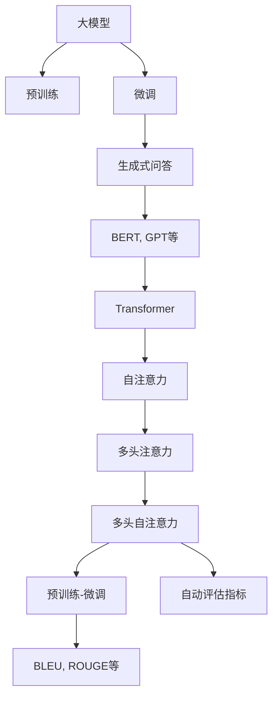

                 

# 大模型问答机器人的生成能力

## 1. 背景介绍

在自然语言处理（NLP）领域，问答机器人（QA Robot）正逐渐成为一种重要的应用场景。它们能够理解和回答人类提出的自然语言问题，广泛应用于客服、教育、医疗、智能助手等多个领域。现代问答机器人通常依赖于深度学习技术，尤其是基于大模型的生成式问答系统。

近年来，大模型在预训练和微调方面取得了显著进展，推动了问答机器人技术的快速发展。谷歌的BERT、OpenAI的GPT系列、Facebook的RoBERTa等预训练模型，通过大规模无标签文本数据的自监督学习，学习到了丰富的语言知识，显著提升了问答机器人系统的生成能力。本文将深入探讨大模型问答机器人的生成能力，分析其原理、操作步骤，并讨论其在实际应用中的优缺点及应用领域。

## 2. 核心概念与联系

### 2.1 核心概念概述

1. **大模型（Large Model）**：指参数规模较大的神经网络模型，如BERT、GPT等。这些模型通过大规模无标签文本数据的预训练，学习到丰富的语言知识和结构信息。

2. **预训练（Pre-training）**：指在大量无标签文本数据上训练模型，学习通用语言表示的过程。预训练过程中，模型通常会进行自监督学习任务，如掩码语言模型（Masked Language Model, MLM）、下一句预测（Next Sentence Prediction, NSP）等。

3. **微调（Fine-tuning）**：指在预训练模型的基础上，利用少量标注数据进行有监督学习，优化模型在特定任务上的性能，如问答系统、文本分类、命名实体识别等。

4. **生成式问答（Generative Question Answering）**：指问答机器人通过大模型生成符合逻辑、语法正确的回答，而非直接选择已有答案或模板。生成式问答系统能够处理复杂的多轮对话，更具自然性和智能性。

5. **Transformer**：一种常用的神经网络结构，用于实现大模型的自注意力机制。Transformer通过多头注意力机制，使得模型能够处理长距离依赖关系，提升生成效果。

6. **Prompt（提示）**：在微调和生成过程中，通过设计输入模板（Prompt Template），引导模型生成预期输出。

7. **BLEU、ROUGE等自动评估指标**：用于评估生成回答的质量，如BLEU（Bilingual Evaluation Understudy）、ROUGE（Recall-Oriented Understudy for Gisting Evaluation）等。

这些概念之间的关系可以通过以下Mermaid流程图来展示：



该流程图展示了从大模型到生成式问答的流程：大模型通过预训练学习通用语言表示，微调后进行生成式问答，利用自注意力机制提升生成效果，通过自动评估指标进行模型评估。

## 3. 核心算法原理 & 具体操作步骤

### 3.1 算法原理概述

大模型问答机器人基于生成式模型，其核心算法原理包括预训练、微调和生成三个步骤。

1. **预训练**：在无标签文本数据上，通过掩码语言模型（MLM）等自监督学习任务，训练模型学习到语言结构和语义表示。

2. **微调**：利用少量标注数据，对预训练模型进行有监督学习，优化模型在特定问答任务上的性能。

3. **生成**：在微调后的模型上，通过输入问题（Prompt）和上下文（Context），生成符合语法和逻辑的回答。

### 3.2 算法步骤详解

#### 3.2.1 预训练

1. **数据准备**：收集大规模无标签文本数据，如维基百科、新闻、小说等。

2. **模型训练**：使用Transformer架构的模型，在预训练数据上进行自监督学习，如掩码语言模型（MLM）。

3. **保存预训练模型**：将预训练模型保存，以便后续微调使用。

#### 3.2.2 微调

1. **数据准备**：收集目标问答任务的标注数据集，如问答对（Question-Answer Pair）。

2. **模型加载**：加载预训练模型，并将其作为微调的初始参数。

3. **任务适配层设计**：设计适合的输出层和损失函数，如分类任务的softmax损失，生成任务的负对数似然损失。

4. **模型训练**：使用微调数据集，通过反向传播算法更新模型参数，最小化损失函数。

5. **评估与优化**：在验证集上评估模型性能，根据评估结果调整学习率、批大小等超参数。

#### 3.2.3 生成

1. **输入处理**：将用户输入的问题（Prompt）和上下文（Context）作为模型的输入。

2. **模型生成**：使用微调后的模型，根据Prompt和Context生成回答。

3. **后处理**：对生成的回答进行后处理，如去除冗余、纠正语法错误等。

### 3.3 算法优缺点

**优点**：

1. **通用性**：大模型预训练后，通过微调可以适应多种问答任务，具有较高的泛化能力。

2. **生成能力强**：生成式问答系统能够处理多轮对话，生成符合语境的回答，更具自然性和智能性。

3. **技术成熟**：基于预训练和微调的生成式问答系统，技术相对成熟，易于实现和部署。

**缺点**：

1. **依赖数据**：微调和生成需要大量的标注数据，数据获取成本较高。

2. **计算资源要求高**：大模型和微调过程对计算资源（如GPU）有较高要求。

3. **可解释性不足**：生成式问答系统通常是"黑盒"模型，难以解释其内部工作机制。

4. **噪声敏感**：生成回答可能受到噪声干扰，生成效果不稳定。

### 3.4 算法应用领域

大模型问答机器人广泛应用于以下领域：

1. **客户服务**：用于自动回答客户问题，提高客服效率。

2. **教育**：用于智能答疑，辅助学生学习。

3. **医疗**：用于医疗问答，提供初步健康建议。

4. **智能助手**：提供智能问答，提升用户体验。

5. **智能推荐**：根据用户问题，推荐相关内容或服务。

## 4. 数学模型和公式 & 详细讲解 & 举例说明

### 4.1 数学模型构建

大模型问答机器人通常基于生成式Transformer模型。假设输入为Question，上下文为Context，输出为Answer。数学模型构建如下：

1. **编码器（Encoder）**：将Question和Context输入编码器，得到表示向量 $E(Q)$ 和 $E(C)$。

2. **解码器（Decoder）**：使用Decoder生成Answer，将表示向量 $E(Q)$ 和 $E(C)$ 作为初始状态。

3. **输出层**：使用线性层将解码器输出转换为Answer的分布，最小化损失函数。

### 4.2 公式推导过程

以掩码语言模型（MLM）为例，假设输入为 $X=\{w_1, w_2, ..., w_n\}$，模型通过掩码向量 $M$ 遮盖部分输入，如 $X'=\{w_1, [MASK], w_3, ..., w_n\}$。模型预测被遮盖位置的词，计算交叉熵损失：

$$
\mathcal{L}_{MLM} = -\sum_{i=1}^N \log p(w_i|X, M)
$$

其中 $p(w_i|X, M)$ 为在输入 $X$ 和掩码 $M$ 条件下，输出 $w_i$ 的概率。

在微调过程中，以分类任务的softmax损失为例：

$$
\mathcal{L}_{softmax} = -\sum_{i=1}^N \log p(y_i|Q, C)
$$

其中 $p(y_i|Q, C)$ 为在Question $Q$ 和Context $C$ 条件下，输出 $y_i$ 的概率。

### 4.3 案例分析与讲解

以GPT-3为例，其微调过程分为以下步骤：

1. **数据准备**：收集目标问答任务的标注数据集。

2. **模型加载**：加载预训练的GPT-3模型。

3. **任务适配层设计**：设计分类任务的softmax输出层，以预测答案类别。

4. **模型训练**：使用标注数据集进行微调，最小化softmax损失。

5. **评估与优化**：在验证集上评估模型性能，调整学习率等超参数。

6. **生成回答**：将用户问题作为输入，使用微调后的模型生成Answer。

## 5. 项目实践：代码实例和详细解释说明

### 5.1 开发环境搭建

1. **安装Python和PyTorch**：确保Python环境已安装，并安装PyTorch。

2. **安装相关库**：安装必要的NLP库，如HuggingFace的Transformers库。

3. **数据准备**：准备问答数据集，并进行预处理。

### 5.2 源代码详细实现

以使用GPT-3进行问答为例，代码如下：

```python
import torch
from transformers import GPT3ForQuestionAnswering, GPT3Tokenizer

# 加载预训练模型和tokenizer
model = GPT3ForQuestionAnswering.from_pretrained('gpt3-medium')
tokenizer = GPT3Tokenizer.from_pretrained('gpt3-medium')

# 定义微调过程
def fine_tune(model, data_loader, optimizer):
    model.train()
    for batch in data_loader:
        inputs = tokenizer(batch['question'], batch['context'], return_tensors='pt')
        outputs = model(**inputs)
        loss = outputs.loss
        optimizer.zero_grad()
        loss.backward()
        optimizer.step()

# 定义生成回答
def generate_answer(question, context):
    inputs = tokenizer(question, context, return_tensors='pt')
    outputs = model(**inputs)
    answer = tokenizer.decode(outputs.logits.argmax(-1))
    return answer

# 准备数据集和模型训练
data_loader = ...

# 定义优化器
optimizer = torch.optim.Adam(model.parameters(), lr=1e-5)

# 微调模型
fine_tune(model, data_loader, optimizer)

# 生成回答
answer = generate_answer("What is the capital of France?", "France is a country in Europe.")
print(answer)
```

### 5.3 代码解读与分析

- **预训练模型加载**：使用HuggingFace库加载预训练的GPT-3模型。

- **tokenizer准备**：使用预训练模型的tokenizer，将输入转换为模型可接受的格式。

- **微调过程**：定义微调函数，将问题（question）和上下文（context）输入模型，计算损失并反向传播更新参数。

- **生成回答**：定义生成函数，将输入转换为模型可接受的格式，使用微调后的模型生成回答。

- **优化器选择**：使用Adam优化器进行微调。

### 5.4 运行结果展示

在微调完成后，可以生成符合预期的回答。例如，对于问题 "What is the capital of France?" 和上下文 "France is a country in Europe."，生成的回答可能为 "Paris"。

## 6. 实际应用场景

### 6.1 智能客服

大模型问答机器人可以应用于智能客服系统，自动回答常见问题，提高客服效率和客户满意度。

### 6.2 在线教育

问答机器人可以辅助在线教育平台，自动解答学生疑问，提供个性化推荐，提升学习体验。

### 6.3 智能推荐

根据用户问题，生成相关推荐内容，如商品推荐、新闻推荐等。

### 6.4 未来应用展望

随着技术进步，大模型问答机器人将具备更强的生成能力和鲁棒性，广泛应用于更多领域。未来可能的发展方向包括：

1. **多模态融合**：结合图像、语音等多模态信息，提升问答系统性能。

2. **跨领域迁移**：将大模型在特定领域的微调经验，迁移到其他领域。

3. **主动学习**：通过主动学习，优化标注数据集，减少标注成本。

4. **分布式训练**：利用分布式训练技术，提高模型训练效率。

5. **实时推理**：通过优化推理算法，提升系统响应速度。

6. **联邦学习**：在分布式环境下，联合训练模型，保护隐私。

## 7. 工具和资源推荐

### 7.1 学习资源推荐

1. **《自然语言处理综述与实践》**：深入介绍NLP基础知识和实践技巧，涵盖问答系统、生成模型等内容。

2. **NLP Guru网站**：提供丰富的NLP教程、工具和案例，适合初学者和进阶者。

3. **HuggingFace博客**：分享最新的NLP研究进展和实战经验，涵盖大模型问答机器人等内容。

### 7.2 开发工具推荐

1. **HuggingFace Transformers库**：提供预训练模型和工具，便于微调和生成回答。

2. **TensorBoard**：可视化模型训练过程和指标，帮助调试和优化。

3. **Weights & Biases**：记录和跟踪模型训练过程，自动化超参数调优。

### 7.3 相关论文推荐

1. **"Attention is All You Need"**：介绍Transformer架构，奠定大模型的基础。

2. **"BERT: Pre-training of Deep Bidirectional Transformers for Language Understanding"**：提出BERT模型，提高生成回答的质量。

3. **"GPT-3: Language Models are Unsupervised Multitask Learners"**：展示GPT-3的强大生成能力。

## 8. 总结：未来发展趋势与挑战

### 8.1 研究成果总结

大模型问答机器人技术在生成能力方面取得了显著进展，提升了问答系统的自然性和智能性。未来需要进一步优化模型结构和训练策略，提高生成回答的质量和效率。

### 8.2 未来发展趋势

1. **技术成熟化**：大模型问答机器人技术将进一步成熟，广泛应用于更多领域。

2. **模型规模化**：随着计算资源的发展，大模型规模将进一步增大，提升生成回答的准确性和鲁棒性。

3. **多模态融合**：结合多模态信息，提升问答系统的综合性能。

4. **跨领域迁移**：将大模型在特定领域的微调经验，迁移到其他领域。

5. **主动学习**：通过主动学习，优化标注数据集，减少标注成本。

### 8.3 面临的挑战

1. **数据获取**：高质量标注数据的获取成本较高，制约了大模型的应用。

2. **计算资源**：大模型的训练和推理需要大量计算资源，成本较高。

3. **模型复杂度**：大模型结构复杂，需要优化模型压缩和推理算法。

4. **公平性**：大模型可能存在偏见和歧视，需要采取措施确保生成回答的公平性。

### 8.4 研究展望

1. **模型压缩与优化**：通过模型压缩和优化，降低计算资源需求，提升系统效率。

2. **公平性保障**：通过公平性训练和验证，确保生成回答的公平性和透明性。

3. **多模态融合**：结合视觉、语音等多模态信息，提升问答系统的综合性能。

4. **跨领域迁移**：将大模型在特定领域的微调经验，迁移到其他领域。

5. **主动学习**：通过主动学习，优化标注数据集，减少标注成本。

## 9. 附录：常见问题与解答

**Q1：大模型问答机器人是否适用于所有问答场景？**

A: 大模型问答机器人适用于大部分问答场景，但具体效果需根据数据质量和模型结构进行调整。对于一些专业性较强的领域，可能需要更针对性的预训练和微调。

**Q2：如何优化生成回答的质量？**

A: 优化生成回答的质量需要多方面的努力：

1. **数据集优化**：收集更多高质量的标注数据，提高模型训练的鲁棒性。

2. **模型改进**：使用先进的模型结构，如BERT、GPT-3等，提升生成效果。

3. **超参数调优**：调整学习率、批大小等超参数，优化模型训练过程。

4. **正则化**：使用正则化技术，如Dropout、L2正则等，避免过拟合。

**Q3：生成回答的鲁棒性如何保证？**

A: 生成回答的鲁棒性主要通过以下措施保证：

1. **数据增强**：使用数据增强技术，如回译、近义替换等，提升模型泛化能力。

2. **对抗训练**：引入对抗样本，提高模型鲁棒性。

3. **模型压缩**：通过模型压缩和优化，减小模型规模，提高生成速度和鲁棒性。

**Q4：如何提高生成回答的可解释性？**

A: 提高生成回答的可解释性可以通过以下措施：

1. **提示模板设计**：设计合理的提示模板，引导模型生成更具可解释性的回答。

2. **后处理技术**：使用后处理技术，如去冗余、纠错等，提升回答质量。

3. **专家审核**：引入专家审核机制，对生成回答进行验证和解释。

**Q5：如何保证生成回答的公平性？**

A: 保证生成回答的公平性主要通过以下措施：

1. **公平性训练**：在训练过程中加入公平性约束，避免模型偏见。

2. **公平性验证**：在验证集上验证生成回答的公平性，确保模型输出符合伦理道德。

3. **人工干预**：引入人工干预机制，对生成回答进行审查和修正。

---

作者：禅与计算机程序设计艺术 / Zen and the Art of Computer Programming

