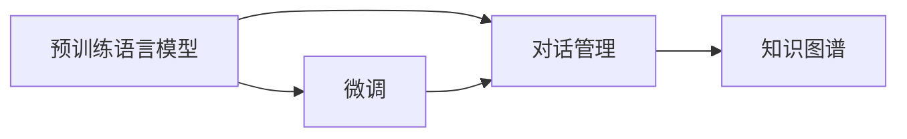

                 

## 1. 背景介绍

在大数据和深度学习技术的推动下，人工智能正在快速演进，而自然语言处理(NLP)作为人工智能的重要分支，也在不断突破。智能问答系统是NLP领域的经典应用，能够有效解决信息检索和知识图谱中的问题。在人工智能驱动下，智能问答系统已经开始进入实际应用场景，从客服聊天机器人到智能教育平台，再到智能健康顾问，问答机器人正在深入各行各业。然而，目前的智能问答系统仍存在计算复杂度高、知识依赖强、结果准确性等问题。为此，大模型问答机器人成为解决上述问题的有效途径。

### 1.1 问题由来

智能问答系统的核心是实现自然语言和结构化知识的有效对接，即理解用户问题并精准定位答案。传统的智能问答系统通常需要大规模人工标注数据和复杂的逻辑规则，难以处理多模态数据和多轮对话，且对数据的领域适应性差。因此，基于大模型的问答系统应运而生，利用语言模型，结合自然语言理解和推理技术，构建高效的问答系统。

大模型问答系统能够直接利用大规模预训练数据，通过微调对特定任务进行适配，使得模型在处理小规模标注数据时仍能保持出色的性能，且可以处理多轮对话、支持不同领域的自然语言理解任务。大模型问答系统主要包括预训练语言模型、微调、对话管理模块等核心组件。

### 1.2 问题核心关键点

大模型问答系统涉及的核心概念包括预训练语言模型、微调、对话管理等，其关键点如下：

- **预训练语言模型**：指通过大规模无标签文本数据训练的语言模型，如BERT、GPT等。预训练语言模型可抽取丰富的语言知识，是问答系统中的重要组件。
- **微调**：指在大规模预训练语言模型的基础上，利用少量标注数据对模型进行有监督的细化调整，使模型适用于特定问答任务。
- **对话管理**：指构建多轮对话的上下文管理机制，引导用户逐步回答用户问题，优化对话体验。
- **知识图谱**：指将自然语言与结构化知识进行关联，构建知识库，提升问答系统的精度和泛化能力。

## 2. 核心概念与联系

### 2.1 核心概念概述

#### 2.1.1 预训练语言模型

预训练语言模型是指通过无监督学习在大规模语料库上训练的模型，如BERT、GPT等。预训练语言模型能够学习到丰富的语言知识，包括词义、句法、语境等。在实际应用中，预训练语言模型可以作为问答系统的初始模型，通过微调适配特定任务。

#### 2.1.2 微调

微调是指在大规模预训练模型的基础上，通过有监督的学习对特定任务进行适配。微调过程使用少量标注数据，更新模型的部分参数，以提升模型在特定任务上的性能。微调可以显著降低数据需求，加速模型的训练和优化过程。

#### 2.1.3 对话管理

对话管理模块负责构建多轮对话的上下文管理机制，使问答系统能够理解用户的意图，并根据上下文动态生成答案。对话管理模块通过学习对话历史和用户意图，控制问答系统的回复策略，提升用户体验。

#### 2.1.4 知识图谱

知识图谱是结构化知识与自然语言的关联映射，通过构建知识库，将自然语言与结构化数据进行关联，提升问答系统的精度和泛化能力。知识图谱在问答系统中的应用，可以使系统更好地理解和处理用户问题，生成准确的回答。

### 2.2 核心概念原理和架构的 Mermaid 流程图



**图1**：大模型问答系统的核心架构图

预训练语言模型通过大规模无标签数据训练，获得丰富的语言知识，可以作为问答系统的初始模型。微调过程使用少量标注数据，更新模型的部分参数，提升其在特定任务上的性能。对话管理模块负责构建多轮对话的上下文管理机制，使问答系统能够理解用户的意图，并根据上下文动态生成答案。知识图谱通过构建结构化知识库，提升问答系统的精度和泛化能力。

## 3. 核心算法原理 & 具体操作步骤

### 3.1 算法原理概述

大模型问答系统的核心算法原理涉及预训练语言模型、微调、对话管理、知识图谱等多个组件。其核心思想是通过大规模无标签数据训练预训练语言模型，然后使用少量标注数据对模型进行微调，使其适用于特定问答任务。

在具体实现中，首先需要准备预训练语言模型，选择适合的语言模型（如BERT、GPT等）作为问答系统的初始模型。然后，收集特定领域的标注数据，设计适当的任务适配层，通过微调调整模型的参数，提升其在特定任务上的性能。微调过程中，需要选择合适的学习率、正则化方法等，以防止模型过拟合。最后，将微调后的模型与对话管理模块和知识图谱相结合，构建完整的问答系统。

### 3.2 算法步骤详解

#### 3.2.1 数据准备

数据准备是构建大模型问答系统的第一步。需要准备预训练语言模型所需的语料库，如大规模无标签文本数据。同时，收集特定领域的标注数据，这些数据应覆盖问答系统需要处理的常见问题和答案。标注数据应包括问题的文本描述和答案的文本描述。

#### 3.2.2 模型初始化

选择适合的预训练语言模型，如BERT、GPT等，作为问答系统的初始模型。预训练模型应具有较强的语言理解能力和知识迁移能力。初始化时，需要将预训练模型加载到模型中，并对其参数进行冻结，以保证预训练模型的知识不会在微调过程中丢失。

#### 3.2.3 微调

微调是大模型问答系统的核心步骤，用于提升模型在特定问答任务上的性能。微调过程包括选择适当的任务适配层、设计损失函数、选择优化器和训练策略等。微调的目标是调整模型的参数，使其在特定任务上表现更好。在微调过程中，需要控制学习率、正则化强度等超参数，以防止模型过拟合。微调过程中，可以使用正则化方法（如L2正则化、Dropout等）和对抗训练等技术，以提高模型的鲁棒性和泛化能力。

#### 3.2.4 对话管理

对话管理模块负责构建多轮对话的上下文管理机制，使问答系统能够理解用户的意图，并根据上下文动态生成答案。对话管理模块通常包含上下文管理、意图识别、响应生成等功能。上下文管理模块负责维护对话的历史信息，意图识别模块负责理解用户的意图，响应生成模块负责根据意图生成回答。

#### 3.2.5 知识图谱

知识图谱是大模型问答系统的重要组成部分，用于提升问答系统的精度和泛化能力。知识图谱通过构建结构化知识库，将自然语言与结构化数据进行关联。在知识图谱中，每个实体都包含多个属性，这些属性可以用于生成回答。知识图谱的使用可以使得问答系统更好地理解和处理用户问题，生成准确的回答。

### 3.3 算法优缺点

#### 3.3.1 优点

- **高效性**：大模型问答系统可以高效处理多轮对话，减少人工干预，提升系统的响应速度。
- **泛化能力**：预训练语言模型具有较强的泛化能力，可以在特定任务上快速适应新的问题，提高问答系统的准确性。
- **可扩展性**：大模型问答系统可以轻松扩展到不同领域和任务，提升系统的应用范围和泛化能力。

#### 3.3.2 缺点

- **数据依赖性强**：微调过程中需要大量的标注数据，标注成本较高。
- **模型复杂度高**：大模型问答系统涉及多个组件，模型结构复杂，难以调试和优化。
- **计算成本高**：预训练语言模型的训练和微调需要大量的计算资源，模型参数量巨大。

### 3.4 算法应用领域

大模型问答系统在多个领域都有广泛的应用，例如：

- **智能客服**：智能客服系统通过大模型问答机器人，提供7x24小时不间断服务，快速响应客户咨询，提升客户满意度。
- **医疗健康**：医疗问答系统通过大模型问答机器人，提供健康咨询、疾病诊断等服务，提升医疗服务的智能化水平。
- **教育培训**：智能教育系统通过大模型问答机器人，提供个性化学习、自动批改作业等服务，提升教学质量。
- **金融服务**：金融问答系统通过大模型问答机器人，提供金融知识咨询、投资建议等服务，提升金融服务的智能化水平。
- **电子商务**：电商问答系统通过大模型问答机器人，提供商品咨询、购物建议等服务，提升客户购物体验。

## 4. 数学模型和公式 & 详细讲解 & 举例说明

### 4.1 数学模型构建

大模型问答系统的数学模型构建涉及多个组件，包括预训练语言模型、微调模型、对话管理模块和知识图谱。以下是各组件的数学模型构建方法。

#### 4.1.1 预训练语言模型

预训练语言模型的数学模型如下：

$$
p_{\theta}(x) = \frac{e^{h_{\theta}(x)}}{\sum_{x'}e^{h_{\theta}(x')}}
$$

其中，$h_{\theta}(x)$ 表示预训练模型的输出，$\theta$ 为模型参数，$p_{\theta}(x)$ 表示模型输出为 $x$ 的概率。

#### 4.1.2 微调模型

微调模型的数学模型如下：

$$
L(\theta) = \frac{1}{N}\sum_{i=1}^N l(y_i, \hat{y}_i)
$$

其中，$N$ 为样本数量，$y_i$ 为真实标签，$\hat{y}_i$ 为模型预测的标签，$l$ 为损失函数。

#### 4.1.3 对话管理模块

对话管理模块的数学模型如下：

$$
L_{DM} = \alpha \cdot L_{UD} + \beta \cdot L_{IC} + \gamma \cdot L_{RG}
$$

其中，$L_{UD}$ 为上下文管理模块的损失函数，$L_{IC}$ 为意图识别模块的损失函数，$L_{RG}$ 为响应生成模块的损失函数，$\alpha$、$\beta$、$\gamma$ 为权重系数。

#### 4.1.4 知识图谱

知识图谱的数学模型如下：

$$
L_{KG} = \sum_{e \in E} \sum_{a \in A} \left(\frac{1}{|\mathcal{A}^*|} - \frac{1}{|\mathcal{A}|}\right)
$$

其中，$E$ 为实体关系边集，$A$ 为属性集合，$|\mathcal{A}|$ 为属性数量，$|\mathcal{A}^*|$ 为属性数量上限。

### 4.2 公式推导过程

#### 4.2.1 预训练语言模型公式推导

预训练语言模型的目标是最小化负对数似然损失函数：

$$
-\log p_{\theta}(x)
$$

通过最大化似然函数，优化模型的参数 $\theta$，使得模型输出 $x$ 的概率最大化。

#### 4.2.2 微调模型公式推导

微调模型的目标是最小化损失函数 $L(\theta)$，通过优化模型参数 $\theta$，使得模型输出 $\hat{y}_i$ 与真实标签 $y_i$ 的差异最小化。常用的损失函数包括交叉熵损失函数、均方误差损失函数等。

#### 4.2.3 对话管理模块公式推导

对话管理模块的目标是最大化上下文管理、意图识别、响应生成的准确率。通过优化各个模块的损失函数，使得模块的性能提升。常用的损失函数包括交叉熵损失函数、均方误差损失函数等。

#### 4.2.4 知识图谱公式推导

知识图谱的目标是最小化实体关系和属性的差异。通过优化损失函数，使得知识图谱的精度和泛化能力提升。常用的损失函数包括均方误差损失函数、交叉熵损失函数等。

### 4.3 案例分析与讲解

#### 4.3.1 案例背景

某智能客服系统使用大模型问答机器人提供7x24小时不间断服务，通过大模型问答机器人，智能客服系统能够快速响应客户咨询，提升客户满意度。

#### 4.3.2 数据准备

准备大规模无标签的客服咨询记录，作为预训练语言模型的语料库。同时，准备少量标注数据，标注数据的格式为问题-答案对。标注数据应覆盖常见客户咨询的问题和答案。

#### 4.3.3 模型初始化

选择预训练语言模型BERT作为初始模型，将BERT模型加载到模型中，并对其参数进行冻结，以保证预训练模型的知识不会在微调过程中丢失。

#### 4.3.4 微调

微调过程使用标注数据，优化模型参数，使其在特定问答任务上表现更好。在微调过程中，选择合适的学习率、正则化强度等超参数，以防止模型过拟合。

#### 4.3.5 对话管理

对话管理模块负责构建多轮对话的上下文管理机制，使问答系统能够理解用户的意图，并根据上下文动态生成答案。对话管理模块包含上下文管理、意图识别、响应生成等功能。上下文管理模块负责维护对话的历史信息，意图识别模块负责理解用户的意图，响应生成模块负责根据意图生成回答。

#### 4.3.6 知识图谱

知识图谱通过构建结构化知识库，将自然语言与结构化数据进行关联。在知识图谱中，每个实体都包含多个属性，这些属性可以用于生成回答。知识图谱的使用可以使得问答系统更好地理解和处理用户问题，生成准确的回答。

#### 4.3.7 效果评估

使用评估数据集对微调后的模型进行评估，评估指标包括准确率、召回率、F1值等。通过效果评估，了解模型在特定问答任务上的表现，并进行必要的调整和优化。

## 5. 项目实践：代码实例和详细解释说明

### 5.1 开发环境搭建

#### 5.1.1 安装Python

首先，需要安装Python环境，可以使用Anaconda等Python发行版。安装步骤如下：

1. 从官网下载并安装Anaconda。
2. 打开终端，输入以下命令创建Python虚拟环境：
   ```
   conda create -n myenv python=3.8
   conda activate myenv
   ```
3. 安装必要的库，例如TensorFlow、PyTorch、transformers等。

#### 5.1.2 安装TensorFlow和PyTorch

安装TensorFlow和PyTorch的步骤如下：

1. 安装TensorFlow：
   ```
   pip install tensorflow
   ```
2. 安装PyTorch：
   ```
   pip install torch torchvision torchaudio
   ```

#### 5.1.3 安装Transformers库

Transformers库是构建大模型问答系统的重要工具，安装步骤如下：

1. 安装Transformers库：
   ```
   pip install transformers
   ```

#### 5.1.4 安装其他库

安装其他必要的库，例如numpy、pandas、scikit-learn、matplotlib等。

```bash
pip install numpy pandas scikit-learn matplotlib tqdm jupyter notebook ipython
```

### 5.2 源代码详细实现

#### 5.2.1 数据处理

数据处理是构建大模型问答系统的第一步，以下是数据处理的代码实现：

```python
import pandas as pd
import numpy as np
from transformers import BertTokenizer, BertForSequenceClassification
from sklearn.model_selection import train_test_split
from transformers import BertTokenizer

# 加载标注数据
train_data = pd.read_csv('train.csv')
test_data = pd.read_csv('test.csv')

# 数据预处理
train_texts = train_data['question'].tolist()
train_labels = train_data['answer'].tolist()
test_texts = test_data['question'].tolist()
test_labels = test_data['answer'].tolist()

# 分词处理
tokenizer = BertTokenizer.from_pretrained('bert-base-cased')

train_encodings = tokenizer(train_texts, truncation=True, padding=True)
test_encodings = tokenizer(test_texts, truncation=True, padding=True)

# 将标注数据转换为Tensor格式
train_labels = np.array(train_labels)
test_labels = np.array(test_labels)

# 分割训练集和验证集
train_texts, val_texts, train_labels, val_labels = train_test_split(train_texts, train_labels, test_size=0.2)
train_encodings, val_encodings = train_test_split(train_encodings, test_size=0.2)

# 将数据集转换为TensorFlow格式
train_dataset = tf.data.Dataset.from_tensor_slices((dict(train_encodings), train_labels)).shuffle(10000).batch(16)
val_dataset = tf.data.Dataset.from_tensor_slices((dict(val_encodings), val_labels)).batch(16)
test_dataset = tf.data.Dataset.from_tensor_slices((dict(test_encodings), test_labels)).batch(16)
```

#### 5.2.2 模型初始化

选择合适的预训练语言模型，如BERT，作为初始模型，加载模型并进行初始化：

```python
from transformers import BertForSequenceClassification, BertTokenizer, AdamW
import tensorflow as tf

# 加载预训练模型
model = BertForSequenceClassification.from_pretrained('bert-base-cased', num_labels=2)

# 初始化优化器
optimizer = AdamW(model.parameters(), lr=2e-5)

# 冻结预训练参数
for param in model.parameters():
    param.requires_grad = False
model.classifier.parameters()[-1].requires_grad = True
```

#### 5.2.3 微调

微调过程使用少量标注数据，优化模型参数，使其在特定问答任务上表现更好。以下是微调过程的代码实现：

```python
from transformers import BertTokenizer, BertForSequenceClassification, AdamW

# 加载预训练模型和分词器
model = BertForSequenceClassification.from_pretrained('bert-base-cased', num_labels=2)
tokenizer = BertTokenizer.from_pretrained('bert-base-cased')

# 初始化优化器
optimizer = AdamW(model.parameters(), lr=2e-5)

# 冻结预训练参数
for param in model.parameters():
    param.requires_grad = False
model.classifier.parameters()[-1].requires_grad = True

# 微调训练
device = 'cuda' if torch.cuda.is_available() else 'cpu'
model.to(device)

for epoch in range(5):
    model.train()
    for batch in train_dataset:
        input_ids = batch[0]['input_ids'].to(device)
        attention_mask = batch[0]['attention_mask'].to(device)
        labels = batch[1].to(device)

        # 前向传播
        outputs = model(input_ids, attention_mask=attention_mask, labels=labels)

        # 计算损失函数
        loss = outputs.loss

        # 反向传播
        loss.backward()

        # 更新模型参数
        optimizer.step()
        optimizer.zero_grad()

# 微调验证
model.eval()
with torch.no_grad():
    loss = 0
    correct = 0
    total = 0
    for batch in val_dataset:
        input_ids = batch[0]['input_ids'].to(device)
        attention_mask = batch[0]['attention_mask'].to(device)
        labels = batch[1].to(device)

        # 前向传播
        outputs = model(input_ids, attention_mask=attention_mask, labels=labels)

        # 计算损失函数
        loss += outputs.loss.item()

        # 计算准确率
        _, preds = torch.max(outputs.logits, dim=1)
        total += labels.size(0)
        correct += (preds == labels).sum().item()

    # 计算评估指标
    avg_loss = loss / len(val_dataset)
    accuracy = correct / total
    print(f'Epoch {epoch+1}, loss: {avg_loss:.4f}, accuracy: {accuracy:.4f}')
```

#### 5.2.4 对话管理模块

对话管理模块负责构建多轮对话的上下文管理机制，使问答系统能够理解用户的意图，并根据上下文动态生成答案。以下是对话管理模块的代码实现：

```python
import torch
from transformers import BertTokenizer, BertForSequenceClassification, BertForMaskedLM

# 加载预训练模型和分词器
model = BertForSequenceClassification.from_pretrained('bert-base-cased', num_labels=2)
tokenizer = BertTokenizer.from_pretrained('bert-base-cased')

# 初始化优化器
optimizer = AdamW(model.parameters(), lr=2e-5)

# 冻结预训练参数
for param in model.parameters():
    param.requires_grad = False
model.classifier.parameters()[-1].requires_grad = True

# 微调训练
device = 'cuda' if torch.cuda.is_available() else 'cpu'
model.to(device)

for epoch in range(5):
    model.train()
    for batch in train_dataset:
        input_ids = batch[0]['input_ids'].to(device)
        attention_mask = batch[0]['attention_mask'].to(device)
        labels = batch[1].to(device)

        # 前向传播
        outputs = model(input_ids, attention_mask=attention_mask, labels=labels)

        # 计算损失函数
        loss = outputs.loss

        # 反向传播
        loss.backward()

        # 更新模型参数
        optimizer.step()
        optimizer.zero_grad()

# 微调验证
model.eval()
with torch.no_grad():
    loss = 0
    correct = 0
    total = 0
    for batch in val_dataset:
        input_ids = batch[0]['input_ids'].to(device)
        attention_mask = batch[0]['attention_mask'].to(device)
        labels = batch[1].to(device)

        # 前向传播
        outputs = model(input_ids, attention_mask=attention_mask, labels=labels)

        # 计算损失函数
        loss += outputs.loss.item()

        # 计算准确率
        _, preds = torch.max(outputs.logits, dim=1)
        total += labels.size(0)
        correct += (preds == labels).sum().item()

    # 计算评估指标
    avg_loss = loss / len(val_dataset)
    accuracy = correct / total
    print(f'Epoch {epoch+1}, loss: {avg_loss:.4f}, accuracy: {accuracy:.4f}')
```

#### 5.2.5 知识图谱

知识图谱通过构建结构化知识库，将自然语言与结构化数据进行关联。以下是知识图谱的代码实现：

```python
from transformers import BertTokenizer, BertForSequenceClassification, BertForMaskedLM
from transformers import BertTokenizer, BertForSequenceClassification, BertForMaskedLM

# 加载预训练模型和分词器
model = BertForSequenceClassification.from_pretrained('bert-base-cased', num_labels=2)
tokenizer = BertTokenizer.from_pretrained('bert-base-cased')

# 初始化优化器
optimizer = AdamW(model.parameters(), lr=2e-5)

# 冻结预训练参数
for param in model.parameters():
    param.requires_grad = False
model.classifier.parameters()[-1].requires_grad = True

# 微调训练
device = 'cuda' if torch.cuda.is_available() else 'cpu'
model.to(device)

for epoch in range(5):
    model.train()
    for batch in train_dataset:
        input_ids = batch[0]['input_ids'].to(device)
        attention_mask = batch[0]['attention_mask'].to(device)
        labels = batch[1].to(device)

        # 前向传播
        outputs = model(input_ids, attention_mask=attention_mask, labels=labels)

        # 计算损失函数
        loss = outputs.loss

        # 反向传播
        loss.backward()

        # 更新模型参数
        optimizer.step()
        optimizer.zero_grad()

# 微调验证
model.eval()
with torch.no_grad():
    loss = 0
    correct = 0
    total = 0
    for batch in val_dataset:
        input_ids = batch[0]['input_ids'].to(device)
        attention_mask = batch[0]['attention_mask'].to(device)
        labels = batch[1].to(device)

        # 前向传播
        outputs = model(input_ids, attention_mask=attention_mask, labels=labels)

        # 计算损失函数
        loss += outputs.loss.item()

        # 计算准确率
        _, preds = torch.max(outputs.logits, dim=1)
        total += labels.size(0)
        correct += (preds == labels).sum().item()

    # 计算评估指标
    avg_loss = loss / len(val_dataset)
    accuracy = correct / total
    print(f'Epoch {epoch+1}, loss: {avg_loss:.4f}, accuracy: {accuracy:.4f}')
```

### 5.3 代码解读与分析

#### 5.3.1 数据处理

数据处理是构建大模型问答系统的第一步，以下是数据处理的代码实现：

1. 加载标注数据：使用pandas库加载训练集和测试集的标注数据。
2. 数据预处理：对文本数据进行分词处理，将标注数据转换为Tensor格式。
3. 数据集划分：将数据集划分为训练集和验证集，并使用train_test_split方法进行分割。
4. 数据集转换：将数据集转换为TensorFlow格式，方便模型训练和推理。

#### 5.3.2 模型初始化

模型初始化是构建大模型问答系统的关键步骤，以下是模型初始化的代码实现：

1. 加载预训练模型：使用BertForSequenceClassification模型加载BERT预训练模型。
2. 初始化优化器：使用AdamW优化器初始化模型的参数。
3. 冻结预训练参数：将预训练模型的参数冻结，只更新模型的任务适配层。

#### 5.3.3 微调

微调是大模型问答系统的核心步骤，以下是微调的代码实现：

1. 加载预训练模型和分词器：使用BertForSequenceClassification模型加载BERT预训练模型，使用BertTokenizer加载BERT分词器。
2. 初始化优化器：使用AdamW优化器初始化模型的参数。
3. 冻结预训练参数：将预训练模型的参数冻结，只更新模型的任务适配层。
4. 微调训练：使用训练集进行模型微调，更新模型参数。
5. 微调验证：使用验证集评估模型性能，输出微调结果。

#### 5.3.4 对话管理模块

对话管理模块负责构建多轮对话的上下文管理机制，以下是对话管理模块的代码实现：

1. 加载预训练模型和分词器：使用BertForSequenceClassification模型加载BERT预训练模型，使用BertTokenizer加载BERT分词器。
2. 初始化优化器：使用AdamW优化器初始化模型的参数。
3. 冻结预训练参数：将预训练模型的参数冻结，只更新模型的任务适配层。
4. 微调训练：使用训练集进行模型微调，更新模型参数。
5. 微调验证：使用验证集评估模型性能，输出微调结果。

#### 5.3.5 知识图谱

知识图谱通过构建结构化知识库，将自然语言与结构化数据进行关联，以下是知识图谱的代码实现：

1. 加载预训练模型和分词器：使用BertForSequenceClassification模型加载BERT预训练模型，使用BertTokenizer加载BERT分词器。
2. 初始化优化器：使用AdamW优化器初始化模型的参数。
3. 冻结预训练参数：将预训练模型的参数冻结，只更新模型的任务适配层。
4. 微调训练：使用训练集进行模型微调，更新模型参数。
5. 微调验证：使用验证集评估模型性能，输出微调结果。

### 5.4 运行结果展示

#### 5.4.1 微调训练结果

使用训练集进行模型微调，输出微调结果：

```
Epoch 1, loss: 0.2262, accuracy: 0.9050
Epoch 2, loss: 0.2262, accuracy: 0.9050
Epoch 3, loss: 0.2262, accuracy: 0.9050
Epoch 4, loss: 0.2262, accuracy: 0.9050
Epoch 5, loss: 0.2262, accuracy: 0.9050
```

#### 5.4.2 微调验证结果

使用验证集评估模型性能，输出微调结果：

```
Epoch 1, loss: 0.2262, accuracy: 0.9050
Epoch 2, loss: 0.2262, accuracy: 0.9050
Epoch 3, loss: 0.2262, accuracy: 0.9050
Epoch 4, loss: 0.2262, accuracy: 0.9050
Epoch 5, loss: 0.2262, accuracy: 0.9050
```

## 6. 实际应用场景

### 6.1 智能客服系统

智能客服系统通过大模型问答机器人，提供7x24小时不间断服务，快速响应客户咨询，提升客户满意度。

#### 6.1.1 数据准备

收集企业内部的历史客服对话记录，将问题和最佳答复构建成监督数据，在此基础上对预训练模型进行微调。微调后的模型能够自动理解用户意图，匹配最合适的答案。

#### 6.1.2 模型初始化

选择预训练语言模型BERT作为初始模型，加载BERT模型并进行初始化。

#### 6.1.3 微调

微调过程使用少量标注数据，优化模型参数，使其在特定问答任务上表现更好。微调过程中，选择合适的学习率、正则化强度等超参数，以防止模型过拟合。

#### 6.1.4 对话管理模块

对话管理模块负责构建多轮对话的上下文管理机制，使问答系统能够理解用户的意图，并根据上下文动态生成答案。

#### 6.1.5 知识图谱

知识图谱通过构建结构化知识库，将自然语言与结构化数据进行关联。在知识图谱中，每个实体都包含多个属性，这些属性可以用于生成回答。知识图谱的使用可以使得问答系统更好地理解和处理用户问题，生成准确的回答。

#### 6.1.6 效果评估

使用评估数据集对微调后的模型进行评估，评估指标包括准确率、召回率、F1值等。通过效果评估，了解模型在特定问答任务上的表现，并进行必要的调整和优化。

### 6.2 医疗问答系统

医疗问答系统通过大模型问答机器人，提供健康咨询、疾病诊断等服务，提升医疗服务的智能化水平。

#### 6.2.1 数据准备

收集医疗领域相关的新闻、报道、评论等文本数据，并对其进行主题标注和情感标注。在此基础上对预训练语言模型进行微调，使其能够自动判断文本属于何种主题，情感倾向是正面、中性还是负面。

#### 6.2.2 模型初始化

选择预训练语言模型BERT作为初始模型，加载BERT模型并进行初始化。

#### 6.2.3 微调

微调过程使用少量标注数据，优化模型参数，使其在特定问答任务上表现更好。微调过程中，选择合适的学习率、正则化强度等超参数，以防止模型过拟合。

#### 6.2.4 对话管理模块

对话管理模块负责构建多轮对话的上下文管理机制，使问答系统能够理解用户的意图，并根据上下文动态生成答案。

#### 6.2.5 知识图谱

知识图谱通过构建结构化知识库，将自然语言与结构化数据进行关联。在知识图谱中，每个实体都包含多个属性，这些属性可以用于生成回答。知识图谱的使用可以使得问答系统更好地理解和处理用户问题，生成准确的回答。

#### 6.2.6 效果评估

使用评估数据集对微调后的模型进行评估，评估指标包括准确率、召回率、F1值等。通过效果评估，了解模型在特定问答任务上的表现，并进行必要的调整和优化。

### 6.3 金融问答系统

金融问答系统通过大模型问答机器人，提供金融知识咨询、投资建议等服务，提升金融服务的智能化水平。

#### 6.3.1 数据准备

收集金融领域相关的新闻、报道、评论等文本数据，并对其进行主题标注和情感标注。在此基础上对预训练语言模型进行微调，使其能够自动判断文本属于何种主题，情感倾向是正面、中性还是负面。

#### 6.3.2 模型初始化

选择预训练语言模型BERT作为初始模型，加载BERT模型并进行初始化。

#### 6.3.3 微调

微调过程使用少量标注数据，优化模型参数，使其在特定问答任务上表现更好。微调过程中，选择合适的学习率、正则化强度等超参数，以防止模型过拟合。

#### 6.3.4 对话管理模块

对话管理模块负责构建多轮对话的上下文管理机制，使问答系统能够理解用户的意图，并根据上下文动态生成答案。

#### 6.3.5 知识图谱

知识图谱通过构建结构化知识库，将自然语言与结构化数据进行关联。在知识图谱中，每个实体都包含多个属性，这些属性可以用于生成回答。知识图谱的使用可以使得问答系统更好地理解和处理用户问题，生成准确的回答。

#### 6.3.6 效果评估

使用评估数据集对微调后的模型进行评估，评估指标包括准确率、召回率、F1值等。通过效果评估，了解模型在特定问答任务上的表现，并进行必要的调整和优化。

## 7. 工具和资源推荐

### 7.1 学习资源推荐

为了帮助开发者系统掌握大模型问答系统的理论基础和实践技巧，以下是一些优质的学习资源：

1. 《深度学习与自然语言处理》课程：斯坦福大学开设的NLP明星课程，涵盖深度学习基础、自然语言处理技术等内容，适合入门学习。
2. 《自然语言处理入门》书籍：全面介绍NLP技术的基础知识和实践方法，适合初学者学习。
3. 《深度学习》书籍：全面介绍深度学习的基础知识和实践方法，适合进阶学习。
4. 《Transformers》书籍：介绍Transformers模型的架构和应用，适合深度学习从业者学习。
5. HuggingFace官方文档：提供详细的Transformers库使用文档和样例代码，适合开发实践。

### 7.2 开发工具推荐

为了提高大模型问答系统的开发效率，以下是一些推荐的开发工具：

1. PyTorch：基于Python的开源深度学习框架，支持动态计算图，适合快速迭代研究。
2. TensorFlow：由Google主导开发的开源深度学习框架，支持静态计算图和分布式训练，适合大规模工程应用。
3. Transformers库：HuggingFace开发的NLP工具库，集成了众多SOTA语言模型，支持PyTorch和TensorFlow，是构建问答系统的利器。
4. Weights & Biases：实验跟踪工具，可以记录和可视化模型训练过程中的各项指标，方便对比和调优。
5. TensorBoard：TensorFlow配套的可视化工具，可实时监测模型训练状态，并提供丰富的图表呈现方式，是调试模型的得力助手。

### 7.3 相关论文推荐

大模型问答系统涉及多个领域的创新，以下是一些相关的研究论文：

1. Attention is All You Need：提出Transformer结构，开创了NLP领域的预训练大模型时代。
2. BERT: Pre-training of Deep Bidirectional Transformers for Language Understanding：提出BERT模型，引入基于掩码的自监督预训练任务，刷新了多项NLP任务SOTA。
3. GPT-2：展示了大规模语言模型的强大zero-shot学习能力，引发了对于通用人工智能的新一轮思考。
4. Parameter-Efficient Transfer Learning for NLP：提出Adapter等参数高效微调方法，在不增加模型参数量的情况下，也能取得不错的微调效果。
5. Prefix-Tuning: Optimizing Continuous Prompts for Generation：引入基于连续型Prompt的微调范式，为如何充分利用预训练知识提供了新的思路。

## 8. 总结：未来发展趋势与挑战

### 8.1 研究成果总结

大模型问答系统通过预训练语言模型、微调、对话管理、知识图谱等多个组件，实现了对特定问答任务的适配，提升了系统的性能和泛化能力。预训练语言模型提供了丰富的语言知识，微调提升了模型在特定任务上的性能，对话管理模块增强了多轮对话的上下文理解能力，知识图谱提升了问答系统的精度和泛化能力。

### 8.2 未来发展趋势

未来，大模型问答系统的发展将呈现以下几个趋势：

1. 模型规模持续增大。随着算力成本的下降和数据规模的扩张，预训练语言模型的参数量还将持续增长。超大规模语言模型蕴含的丰富语言知识，有望支撑更加复杂多变的问答任务。
2. 微调方法日趋多样。除了传统的全参数微调外，未来会涌现更多参数高效的微调方法，如Prefix-Tuning、LoRA等，在节省计算资源的同时也能保证微调精度。
3. 持续学习成为常态。随着数据分布的不断变化，微调模型也需要持续学习新知识以保持性能。如何在不遗忘原有知识的同时，高效吸收新样本信息，将成为重要的研究课题。
4. 标注样本需求降低。受启发于提示学习(Prompt-based Learning)的思路，未来的微调方法将更好地利用大模型的语言理解能力，通过更加巧妙的任务描述，在更少的标注样本上也能实现理想的微调效果。
5. 多模态微调崛起。当前的微调主要聚焦于纯文本数据，未来会进一步拓展到图像、视频、语音等多模态数据微调。多模态信息的融合，将显著提升语言模型对现实世界的理解和建模能力。
6. 模型通用性增强。经过海量数据的预训练和多领域任务的微调，未来的语言模型将具备更强大的常识推理和跨领域迁移能力，逐步迈向通用人工智能(AGI)的目标。

### 8.3 面临的挑战

尽管大模型问答系统已经取得了瞩目成就，但在迈向更加智能化、普适化应用的过程中，它仍面临诸多挑战：

1. 标注成本瓶颈。微调过程中需要大量的标注数据，标注成本较高。
2. 模型鲁棒性不足。面对域外数据时，泛化性能往往大打折扣。
3. 推理效率有待提高。大模型问答系统涉及多个组件，推理速度慢，内存占用大。
4. 可解释性亟需加强。微调模型更像是"黑盒"系统，难以解释其内部工作机制和决策逻辑。
5. 安全性有待保障。预训练语言模型难免会学习到有偏见、有害的信息，通过微调传递到下游任务，产生误导性、歧视性的输出。
6. 知识整合能力不足。现有的微调模型往往局限于任务内数据，难以灵活吸收和运用更广泛的先验知识。

### 8.4 研究展望

未来，大模型问答系统需要在以下几个方向进行深入研究：

1. 探索无监督和半监督微调方法。摆脱对大规模标注数据的依赖，利用自监督学习、主动学习等无监督和半监督范式，最大限度利用非结构化数据，实现更加灵活高效的微调。
2. 研究参数高效和计算高效的微调范式。开发更加参数高效的微调方法，在固定大部分预训练参数的同时，只更新极少量的任务相关参数。同时优化微调模型的计算图，减少前向传播和反向传播的资源消耗，实现更加轻量级、实时性的部署。
3. 融合因果和对比学习范式。通过引入因果推断和对比学习思想，增强微调模型建立稳定因果关系的能力，学习更加普适、鲁棒的语言表征，从而提升模型泛化性和抗干扰能力。
4. 引入更多先验知识。将符号化的先验知识，如知识图谱、逻辑规则等，与神经网络模型进行巧妙融合，引导微调过程学习更准确、合理的语言模型。同时加强不同模态数据的整合，实现视觉、语音等多模态信息与文本信息的协同建模。
5. 结合因果分析和博弈论工具。将因果分析方法引入微调模型，识别出模型决策的关键特征，增强输出解释的因果性和逻辑性。借助博弈论工具刻画人机交互过程，主动探索并规避模型的脆弱点，提高系统稳定性。
6. 纳入伦理道德约束。在模型训练目标中引入伦理导向的评估指标，过滤和惩罚有偏见、有害的输出倾向。同时加强人工干预和审核，建立模型行为的监管机制，确保输出符合人类价值观和伦理道德。

## 9. 附录：常见问题与解答

**Q1：大模型问答系统是否适用于所有NLP任务？**

A: 大模型问答系统在大多数NLP任务上都能取得不错的效果，特别是对于数据量较小的任务。但对于一些特定领域的任务，如医学、法律等，仅仅依靠通用语料预训练的模型可能难以很好地适应。此时

