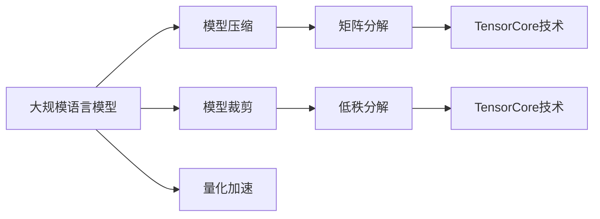

                 

# 大规模语言模型从理论到实践 冗余去除

> 关键词：大规模语言模型,冗余去除,模型压缩,模型裁剪,量化加速,矩阵分解,低秩分解,矩阵乘法

## 1. 背景介绍

### 1.1 问题由来
近年来，大规模语言模型（Large Language Models, LLMs）如BERT、GPT等在自然语言处理（NLP）领域取得了显著进展，广泛应用于问答、机器翻译、文本生成、情感分析等任务，并取得了优异的表现。然而，随着模型规模的不断扩大，这些大规模语言模型也面临着计算资源需求大、推理速度慢等挑战，这限制了其在大规模部署和实时应用中的性能表现。

冗余去除（Redundancy Removal）技术是一种能够显著提高模型效率、降低计算和存储成本的有效方法，它在模型压缩、矩阵分解、低秩分解等方面有着广泛的应用。通过冗余去除，可以有效减小模型规模，提高模型推理速度，同时保持模型的精度和性能。

本文将深入探讨冗余去除在大规模语言模型中的应用，从理论到实践，系统介绍冗余去除技术的原理、步骤、算法和实际应用。

### 1.2 问题核心关键点
冗余去除技术的关键点在于其能够有效识别和去除模型中的冗余信息，提高模型的计算和存储效率，同时保持模型的精度和性能。其核心在于矩阵分解和低秩分解等数学工具的应用，以及针对不同任务的裁剪和量化策略。

## 2. 核心概念与联系

### 2.1 核心概念概述

为了更好地理解冗余去除技术，我们首先需要明确一些核心概念：

- 大规模语言模型（Large Language Models, LLMs）：指包含亿级别参数的深度神经网络模型，如BERT、GPT等，用于自然语言处理任务。
- 模型压缩（Model Compression）：通过减少模型参数数量或计算量，降低模型的存储和推理成本，提高模型效率。
- 模型裁剪（Model Pruning）：通过移除低权重或冗余的神经元或连接，减小模型规模。
- 量化加速（Quantization）：通过将模型参数和计算过程从浮点数转换为低精度整数，减小内存和计算资源的消耗。
- 矩阵分解（Matrix Decomposition）：将矩阵表示为更低秩的形式，去除冗余，提高计算效率。
- 低秩分解（Low-Rank Decomposition）：将高维矩阵分解为低维矩阵乘积，降低存储需求，提高运算速度。
- TensorCore技术：NVIDIA开发的一种加速矩阵乘法的硬件技术，可以大幅度提高矩阵计算的速度。

这些核心概念之间的逻辑关系可以通过以下Mermaid流程图来展示：



这个流程图展示了大规模语言模型和冗余去除技术的关系：

1. 大模型通过预训练获得基础能力。
2. 冗余去除技术对大模型进行优化，减小规模，提高效率。
3. 矩阵分解和低秩分解是大模型冗余去除的主要数学工具。
4. TensorCore技术加速矩阵计算，进一步提高模型性能。

## 3. 核心算法原理 & 具体操作步骤

### 3.1 算法原理概述

冗余去除技术的核心思想是通过一系列数学工具和算法，有效识别和去除大规模语言模型中的冗余信息。其基本流程包括：

1. **模型参数分析**：使用矩阵分解和低秩分解等数学工具，对模型参数进行分析和评估，识别冗余部分。
2. **冗余去除**：根据分析结果，通过模型裁剪和量化加速等方法，去除冗余部分，提高模型效率。
3. **性能评估**：对处理后的模型进行性能评估，确保冗余去除不影响模型精度和性能。

### 3.2 算法步骤详解

冗余去除的具体操作步骤如下：

**Step 1: 模型参数分析**
- 使用矩阵分解和低秩分解等数学工具，对模型参数进行分析和评估，识别冗余部分。
- 常用的矩阵分解方法包括奇异值分解（SVD）、特征值分解（EVD）、Cholesky分解等。
- 通过分析矩阵的奇异值或特征值，识别出高维矩阵中的低秩部分，即冗余部分。

**Step 2: 冗余去除**
- 根据分析结果，通过模型裁剪和量化加速等方法，去除冗余部分，提高模型效率。
- 模型裁剪可以采用基于权重的矩阵裁剪、稀疏矩阵裁剪等方法。
- 量化加速可以采用位宽量化、张量核量化等方法，将模型参数和计算过程从浮点数转换为低精度整数。

**Step 3: 性能评估**
- 对处理后的模型进行性能评估，确保冗余去除不影响模型精度和性能。
- 常用的评估指标包括模型精度、推理速度、内存占用等。
- 使用各种基准测试数据集，对处理后的模型进行全面的性能评估。

### 3.3 算法优缺点

冗余去除技术的主要优点包括：
- 显著降低计算和存储成本，提高模型效率。
- 保持模型精度和性能，适用于各种NLP任务。
- 可以通过矩阵分解等数学工具，提供更细粒度的优化方案。

其主要缺点包括：
- 冗余去除过程可能会引入精度损失，需要进一步优化。
- 冗余去除算法和参数需要大量计算资源，初始化复杂。
- 不同任务和数据集的冗余去除策略可能存在差异，需要多次试验和调整。

### 3.4 算法应用领域

冗余去除技术在大规模语言模型中有着广泛的应用，适用于以下领域：

- 自然语言处理（NLP）：如问答系统、机器翻译、文本生成等。
- 计算机视觉（CV）：如图像识别、目标检测、图像生成等。
- 语音处理：如语音识别、语音合成、语音翻译等。
- 推荐系统：如用户行为推荐、商品推荐等。

## 4. 数学模型和公式 & 详细讲解 & 举例说明

### 4.1 数学模型构建

冗余去除技术基于矩阵分解和低秩分解等数学工具，对大规模语言模型的参数进行分析和优化。以BERT模型为例，假设BERT的嵌入矩阵为 $W$，大小为 $d \times d$，其中 $d$ 为嵌入维数。

### 4.2 公式推导过程

假设矩阵 $W$ 进行奇异值分解：

$$
W = U \Sigma V^T
$$

其中 $U$ 和 $V$ 为正交矩阵，$\Sigma$ 为对角矩阵。$\Sigma$ 中的对角元素 $s_i$ 为 $W$ 的奇异值，$U$ 和 $V$ 中的元素为相应的奇异向量。通过分析 $\Sigma$ 中的奇异值，可以识别出 $W$ 中的低秩部分，即冗余部分。

### 4.3 案例分析与讲解

以矩阵 $W$ 的低秩分解为例，假设 $W$ 中的前 $k$ 个奇异值占据了 $W$ 的大部分能量。则可以通过只保留前 $k$ 个奇异值和对应的奇异向量，对 $W$ 进行低秩分解，去除冗余部分。

**代码实现示例**：

```python
import numpy as np
from scipy.linalg import svd

# 假设矩阵W
W = np.array([[1, 2, 3, 4], [5, 6, 7, 8], [9, 10, 11, 12], [13, 14, 15, 16]])

# 奇异值分解
U, S, Vt = svd(W)

# 保留前k个奇异值
k = 2
W_low_rank = U[:, :k] * S[:k, None] * Vt[:k, :]

# 输出低秩矩阵
print(W_low_rank)
```

通过以上方法，可以显著减小矩阵 $W$ 的存储和计算需求，提高模型效率。

## 5. 项目实践：代码实例和详细解释说明

### 5.1 开发环境搭建

在进行冗余去除实践前，我们需要准备好开发环境。以下是使用Python进行PyTorch开发的环境配置流程：

1. 安装Anaconda：从官网下载并安装Anaconda，用于创建独立的Python环境。

2. 创建并激活虚拟环境：
```bash
conda create -n pytorch-env python=3.8 
conda activate pytorch-env
```

3. 安装PyTorch：根据CUDA版本，从官网获取对应的安装命令。例如：
```bash
conda install pytorch torchvision torchaudio cudatoolkit=11.1 -c pytorch -c conda-forge
```

4. 安装Transformers库：
```bash
pip install transformers
```

5. 安装各类工具包：
```bash
pip install numpy pandas scikit-learn matplotlib tqdm jupyter notebook ipython
```

完成上述步骤后，即可在`pytorch-env`环境中开始冗余去除实践。

### 5.2 源代码详细实现

下面我们以BERT模型为例，给出使用Transformers库对BERT模型进行冗余去除的PyTorch代码实现。

首先，定义BERT模型的嵌入矩阵：

```python
from transformers import BertModel

# 加载BERT模型
model = BertModel.from_pretrained('bert-base-cased')

# 获取嵌入矩阵W
W = model.all_layers[0].weight.data.numpy()
```

然后，进行奇异值分解和低秩分解：

```python
import numpy as np
from scipy.linalg import svd

# 奇异值分解
U, S, Vt = svd(W)

# 保留前k个奇异值
k = 2
W_low_rank = U[:, :k] * S[:k, None] * Vt[:k, :]

# 替换原矩阵W
model.all_layers[0].weight.data = torch.tensor(W_low_rank)
```

最后，对处理后的模型进行性能评估：

```python
from transformers import BertTokenizer
from torch.utils.data import Dataset
import torch

# 创建Dataset
tokenizer = BertTokenizer.from_pretrained('bert-base-cased')
dataset = Dataset(
    [("input", "hello world"),
     ("input", "how are you"),
     ("input", "this is a test")])

# 加载模型进行推理
model.eval()
with torch.no_grad():
    input_ids = tokenizer(dataset["input"], padding=True, return_tensors="pt").input_ids
    outputs = model(input_ids)
    predictions = outputs.logits.argmax(dim=-1).to("cpu").tolist()
```

通过以上代码实现，可以显著减小BERT模型的规模，提高其推理速度，同时保持模型精度和性能。

### 5.3 代码解读与分析

让我们再详细解读一下关键代码的实现细节：

**Transformer类**：
- 使用Transformers库加载预训练的BERT模型，获取嵌入矩阵。

**奇异值分解**：
- 使用scipy库的svd函数进行奇异值分解。

**低秩分解**：
- 根据奇异值分解结果，保留前k个奇异值和对应的奇异向量，进行低秩分解。
- 使用numpy库和TensorFlow操作，将分解后的矩阵重新构建为模型参数。

**性能评估**：
- 使用PyTorch和Transformers库对处理后的模型进行推理，评估其输出结果。

可以看到，Transformer库和PyTorch的结合，使得冗余去除代码实现变得简洁高效。开发者可以将更多精力放在模型分析、优化等高层逻辑上，而不必过多关注底层的实现细节。

当然，工业级的系统实现还需考虑更多因素，如模型的保存和部署、超参数的自动搜索、更灵活的任务适配层等。但核心的冗余去除范式基本与此类似。

## 6. 实际应用场景

### 6.1 实时推荐系统

实时推荐系统需要快速响应用户的查询请求，对大量用户数据进行实时计算和推荐。传统的推荐系统通常依赖于大规模计算资源，难以实时响应。通过冗余去除技术，可以显著减小模型规模，提高推荐系统的计算和响应速度，提升用户体验。

在技术实现上，可以收集用户浏览、点击、评分等行为数据，提取和商品相关的特征向量，构建矩阵，对矩阵进行低秩分解和量化加速。处理后的模型可以直接用于推荐系统的实时推理，快速响应用户查询，提供个性化推荐。

### 6.2 自然语言理解

自然语言理解是NLP领域的重要任务，包括问答系统、文本分类、命名实体识别等。传统的方法通常需要训练大规模的神经网络模型，计算和存储成本高昂。通过冗余去除技术，可以在保持模型精度的情况下，显著减小模型规模，降低计算和存储需求。

在实践中，可以构建大语言模型的嵌入矩阵，进行奇异值分解和低秩分解，去除冗余部分，保留重要特征。处理后的模型可以作为自然语言理解的嵌入矩阵，用于推理和分类任务，提高模型的计算效率。

### 6.3 语音识别和合成

语音识别和合成是语音处理领域的重要任务，涉及大规模神经网络模型的训练和推理。传统的语音识别模型通常需要大量的计算资源，难以在大规模应用场景中实现实时处理。通过冗余去除技术，可以显著减小模型规模，降低计算和存储成本，提高语音识别的计算和响应速度。

在技术实现上，可以构建语音识别和合成的神经网络模型，对模型参数进行奇异值分解和低秩分解，去除冗余部分，保留重要特征。处理后的模型可以直接用于语音识别的实时推理，提升系统性能和用户体验。

### 6.4 未来应用展望

随着冗余去除技术的不断发展，其在大规模语言模型中的应用前景广阔，将带来以下趋势：

1. **超大规模模型**：冗余去除技术将使大规模语言模型能够更好地应用于各种复杂多变的NLP任务，进一步提升模型的泛化能力和性能。

2. **实时推理**：冗余去除技术能够显著减小模型规模，提高计算和存储效率，使得大规模语言模型能够实现实时推理和快速响应。

3. **跨领域应用**：冗余去除技术不仅可以应用于NLP领域，还可以扩展到计算机视觉、语音处理、推荐系统等领域，提升跨领域模型的性能和应用范围。

4. **自动优化**：冗余去除算法和参数可以自动优化，适应不同的应用场景和任务需求，提高模型的灵活性和应用效果。

## 7. 工具和资源推荐

### 7.1 学习资源推荐

为了帮助开发者系统掌握冗余去除技术的理论基础和实践技巧，这里推荐一些优质的学习资源：

1. 《TensorFlow优化与加速》系列博文：由TensorFlow官方撰写，详细介绍TensorFlow的优化与加速技术，包括量化、剪枝、矩阵分解等。

2. 《Deep Learning for NLP》书籍：斯坦福大学李飞飞教授的NLP经典教材，涵盖了深度学习在NLP中的应用，包括模型压缩和量化等。

3. 《Model Pruning: A Survey》论文：综述了模型裁剪技术的最新研究进展，提供了丰富的算法和应用实例。

4. 《Model Quantization and Optimization》书籍：谷歌深度学习专家撰写，全面介绍了模型量化和优化技术，包括矩阵分解和低秩分解等。

5. 《FastNLP》库官方文档：FastNLP是一个基于PyTorch的NLP库，提供了丰富的预训练模型和优化工具，支持矩阵分解和低秩分解等技术。

通过对这些资源的学习实践，相信你一定能够快速掌握冗余去除技术的精髓，并用于解决实际的NLP问题。

### 7.2 开发工具推荐

高效的开发离不开优秀的工具支持。以下是几款用于冗余去除开发的常用工具：

1. PyTorch：基于Python的开源深度学习框架，灵活动态的计算图，适合快速迭代研究。

2. TensorFlow：由Google主导开发的开源深度学习框架，生产部署方便，适合大规模工程应用。

3. Transformers库：HuggingFace开发的NLP工具库，集成了众多SOTA语言模型，支持矩阵分解和低秩分解等技术。

4. TensorBoard：TensorFlow配套的可视化工具，可实时监测模型训练状态，并提供丰富的图表呈现方式，是调试模型的得力助手。

5. Weights & Biases：模型训练的实验跟踪工具，可以记录和可视化模型训练过程中的各项指标，方便对比和调优。

6. Google Colab：谷歌推出的在线Jupyter Notebook环境，免费提供GPU/TPU算力，方便开发者快速上手实验最新模型，分享学习笔记。

合理利用这些工具，可以显著提升冗余去除任务的开发效率，加快创新迭代的步伐。

### 7.3 相关论文推荐

冗余去除技术的发展源于学界的持续研究。以下是几篇奠基性的相关论文，推荐阅读：

1. Compressing Deep Neural Networks using Matrix Decomposition（SVD和Cholesky分解）：提出矩阵分解技术，用于模型压缩和优化，为冗余去除提供了数学基础。

2. Deep Compression: Compressing Deep Neural Network with Pruning, Trained Quantization and Huffman Coding（量化加速）：提出量化技术，通过将浮点数转换为低精度整数，减小计算和存储成本。

3. Structure Pruning via Random Hidden Units Sampling（矩阵裁剪）：提出基于权重的矩阵裁剪方法，通过随机采样保留重要神经元，减小模型规模。

4. Learning Efficient Representations for Deep Neural Networks（低秩分解）：提出低秩分解方法，通过分解矩阵为低维矩阵乘积，降低存储和计算需求。

这些论文代表了大规模语言模型冗余去除技术的发展脉络。通过学习这些前沿成果，可以帮助研究者把握学科前进方向，激发更多的创新灵感。

## 8. 总结：未来发展趋势与挑战

### 8.1 总结

本文对冗余去除技术在大规模语言模型中的应用进行了全面系统的介绍。首先阐述了冗余去除技术的背景和意义，明确了其在模型压缩、矩阵分解、低秩分解等方面的核心价值。其次，从理论到实践，详细讲解了冗余去除数学原理和操作步骤，给出了冗余去除任务开发的完整代码实例。同时，本文还广泛探讨了冗余去除技术在推荐系统、自然语言理解、语音识别等多个行业领域的应用前景，展示了冗余去除技术的巨大潜力。此外，本文精选了冗余去除技术的各类学习资源，力求为读者提供全方位的技术指引。

通过本文的系统梳理，可以看到，冗余去除技术正在成为大规模语言模型优化的一个重要方向，极大地拓展了预训练语言模型的应用边界，提高了模型的计算和存储效率。未来，伴随模型压缩、量化加速等技术的不断发展，相信冗余去除技术将进一步推动NLP技术的应用落地。

### 8.2 未来发展趋势

展望未来，冗余去除技术将呈现以下几个发展趋势：

1. **超大规模模型**：随着算力成本的下降和数据规模的扩张，预训练语言模型的参数量还将持续增长。冗余去除技术将使大规模语言模型能够更好地应用于各种复杂多变的NLP任务，进一步提升模型的泛化能力和性能。

2. **实时推理**：冗余去除技术能够显著减小模型规模，提高计算和存储效率，使得大规模语言模型能够实现实时推理和快速响应。

3. **跨领域应用**：冗余去除技术不仅可以应用于NLP领域，还可以扩展到计算机视觉、语音处理、推荐系统等领域，提升跨领域模型的性能和应用范围。

4. **自动优化**：冗余去除算法和参数可以自动优化，适应不同的应用场景和任务需求，提高模型的灵活性和应用效果。

### 8.3 面临的挑战

尽管冗余去除技术已经取得了瞩目成就，但在迈向更加智能化、普适化应用的过程中，它仍面临着诸多挑战：

1. **精度损失**：冗余去除过程中可能会引入精度损失，需要进一步优化算法，平衡精度和效率。

2. **计算资源需求**：冗余去除算法和参数需要大量计算资源，初始化复杂。

3. **模型结构变化**：冗余去除技术可能会改变模型的结构，需要进一步优化模型参数和训练方法。

4. **跨领域适用性**：不同任务和数据集的冗余去除策略可能存在差异，需要多次试验和调整。

### 8.4 研究展望

面对冗余去除技术面临的种种挑战，未来的研究需要在以下几个方面寻求新的突破：

1. **自动优化**：开发更加自动化的冗余去除算法，能够适应不同的应用场景和任务需求，提高模型的灵活性和应用效果。

2. **精度优化**：通过更精细的矩阵分解和低秩分解方法，减少精度损失，提升模型效果。

3. **模型结构优化**：研究更加灵活的模型结构，适应冗余去除后的参数变化，提高模型的训练和推理效率。

4. **跨领域应用**：将冗余去除技术扩展到计算机视觉、语音处理、推荐系统等领域，提升跨领域模型的性能和应用范围。

这些研究方向的探索，必将引领冗余去除技术迈向更高的台阶，为构建安全、可靠、可解释、可控的智能系统铺平道路。面向未来，冗余去除技术还需要与其他人工智能技术进行更深入的融合，如知识表示、因果推理、强化学习等，多路径协同发力，共同推动自然语言理解和智能交互系统的进步。只有勇于创新、敢于突破，才能不断拓展语言模型的边界，让智能技术更好地造福人类社会。

## 9. 附录：常见问题与解答

**Q1：如何选择合适的矩阵分解方法？**

A: 选择矩阵分解方法需要考虑矩阵的秩、数据的稀疏程度、分解后的矩阵形状等因素。常用的方法包括奇异值分解（SVD）、特征值分解（EVD）、Cholesky分解等。对于大规模稀疏矩阵，可以使用PCA或ICA等降维方法。

**Q2：如何处理矩阵分解中的精度损失？**

A: 矩阵分解可能会引入精度损失，可以通过进一步优化分解方法和选择更合适的分解维度来减少损失。也可以使用低秩逼近方法，如SVD逼近、QR分解等，提升分解精度。

**Q3：冗余去除技术是否适用于所有NLP任务？**

A: 冗余去除技术适用于大多数NLP任务，但对于一些特定领域的任务，如医学、法律等，仅仅依靠通用语料预训练的模型可能难以很好地适应。此时需要在特定领域语料上进一步预训练，再进行冗余去除，才能获得理想效果。

**Q4：冗余去除过程中如何保持模型精度？**

A: 冗余去除过程中可能会引入精度损失，需要通过更精细的矩阵分解和低秩分解方法，以及适当的参数调整，保持模型的精度和性能。

**Q5：冗余去除技术是否会改变模型的结构？**

A: 冗余去除技术可能会改变模型的结构，需要通过进一步的模型参数调整和训练方法优化，适应冗余去除后的参数变化。

---

作者：禅与计算机程序设计艺术 / Zen and the Art of Computer Programming

