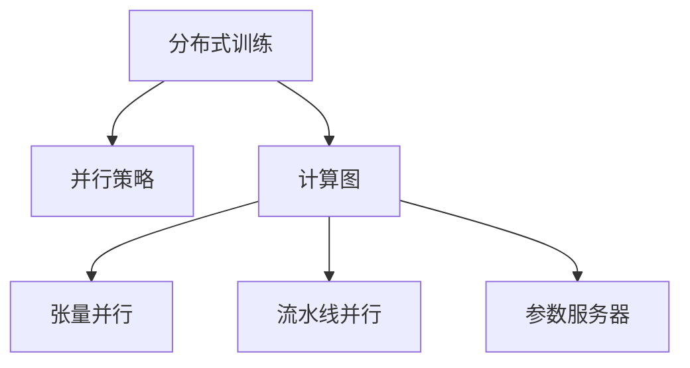

                 

# 大规模语言模型从理论到实践 分布式训练的并行策略

> 关键词：分布式训练,并行策略,大规模语言模型,深度学习,TensorFlow,PyTorch,性能优化

## 1. 背景介绍

随着深度学习技术的发展，大规模语言模型（Large Language Models, LLMs）在自然语言处理（Natural Language Processing, NLP）领域取得了显著进展。这些模型通常具有数十亿甚至数百亿的参数量，如OpenAI的GPT-3，Google的BERT等，通过在大量无标签文本数据上进行预训练，能够学习到丰富的语言知识。

然而，大规模语言模型的训练过程对计算资源的需求极高，单GPU的计算能力有限，训练时间和成本也难以承受。为了加速模型的训练，研究人员和工程师们开发了多种并行训练技术，将大规模模型的训练任务分配到多个计算节点上，通过分布式并行计算提升训练效率。

本文将深入探讨分布式训练的理论基础和实际应用，介绍并行策略、性能优化等关键技术，为大规模语言模型的实践提供有价值的参考。

## 2. 核心概念与联系

### 2.1 核心概念概述

为更好地理解分布式训练，我们需要先了解几个核心概念：

- 分布式训练（Distributed Training）：通过将模型训练任务分配到多个计算节点上，实现并行计算，从而加快模型训练速度。分布式训练可以显著缩短模型的训练时间，提升训练效率。

- 并行策略（Parallel Strategy）：指在分布式训练过程中，如何将模型参数和数据在多个节点间分配和传输，实现高效的并行计算。常见的并行策略包括数据并行、模型并行和混合并行等。

- 计算图（Computational Graph）：深度学习模型的训练过程可以看作是对计算图的执行过程。分布式训练通过对计算图的优化，实现高效的并行计算。

- 张量并行（Tensor Parallelism）：指将模型的参数张量或数据张量进行切分，每个节点独立处理一部分张量，最终将各节点计算结果合并。

- 流水线并行（Pipeline Parallelism）：指将模型的前向传播和后向传播分别在不同节点上进行，通过流水线的方式并行计算。

- 参数服务器（Parameter Server）：一种分布式计算框架，多个计算节点共同访问一个参数服务器，存储模型的参数和梯度。

这些概念之间的逻辑关系可以通过以下Mermaid流程图来展示：



这个流程图展示了分布式训练的核心组件及其相互关系：

1. 分布式训练是对模型参数和数据进行并行计算的过程。
2. 并行策略具体定义了如何将计算任务在节点间分配。
3. 计算图是对模型训练过程的抽象表示，是并行计算的基础。
4. 张量并行和流水线并行是两种常见的并行策略，优化计算图以实现高效并行。
5. 参数服务器用于存储和管理模型参数，确保分布式计算的一致性。

这些核心概念共同构成了分布式训练的理论基础，为大规模语言模型的高效训练提供了指导。

## 3. 核心算法原理 & 具体操作步骤

### 3.1 算法原理概述

分布式训练的本质是对计算图进行优化，通过并行计算加速模型训练过程。具体来说，分布式训练的目标是：

1. 将模型参数和数据在多个计算节点上并行处理，减少单个节点上的计算负担。
2. 通过高效的数据传输和参数更新机制，确保各节点间通信的效率和一致性。
3. 利用并行计算资源，加速模型训练，提升训练效率。

### 3.2 算法步骤详解

分布式训练一般包括以下几个关键步骤：

**Step 1: 数据划分与节点分发**
- 将大规模训练数据集按照一定规则进行划分，通常按照批次或样本进行切分。
- 将数据划分为多个子集，分配到不同的计算节点上进行并行处理。

**Step 2: 计算图划分与节点部署**
- 将模型计算图进行划分，通常将模型的前向传播和后向传播分别部署在不同的节点上。
- 每个节点负责计算图的一部分，最终将各节点的计算结果汇总。

**Step 3: 参数服务器设计与数据同步**
- 在分布式训练中，通常需要一个参数服务器来存储和更新模型参数。
- 参数服务器负责接收各节点的参数更新，并在全局范围内同步更新模型参数。

**Step 4: 梯度聚合与参数更新**
- 各节点在本地计算梯度后，通过参数服务器将梯度汇总到全局模型。
- 在全局模型上进行参数更新，保持模型的一致性。

**Step 5: 验证与迭代**
- 周期性地在验证集上评估模型性能，监控训练过程中的各项指标。
- 根据验证集上的性能反馈，调整训练参数，迭代训练过程。

### 3.3 算法优缺点

分布式训练具有以下优点：
1. 加速模型训练。通过并行计算，可以在较短时间内训练出大规模语言模型。
2. 提升训练效率。多个计算节点同时参与训练，有效利用了硬件资源。
3. 提高模型精度。更多的计算资源和更快的训练速度，有助于获得更高精度的模型。

同时，分布式训练也存在一些局限性：
1. 通信开销大。节点间的通信开销可能成为瓶颈，影响训练速度。
2. 模型一致性维护复杂。多节点间参数同步和更新的一致性难以保证。
3. 硬件资源要求高。需要足够的GPU或TPU资源支持分布式训练。
4. 调试复杂。分布式训练中可能出现多个节点间的通信问题，调试困难。

尽管存在这些局限性，分布式训练仍是大规模语言模型训练的重要手段。未来研究的方向在于如何进一步优化通信机制，提高并行计算效率，降低资源消耗，提升训练效果。

### 3.4 算法应用领域

分布式训练技术在大规模语言模型的训练过程中得到了广泛应用，覆盖了几乎所有常见任务，例如：

- 文本分类：如情感分析、主题分类、意图识别等。通过分布式训练，可以在大规模数据集上进行训练，获得更好的分类效果。
- 命名实体识别：识别文本中的人名、地名、机构名等特定实体。分布式训练能够快速处理大量标注数据，提升模型准确性。
- 关系抽取：从文本中抽取实体之间的语义关系。分布式训练可以处理复杂的数据结构，提高模型性能。
- 问答系统：对自然语言问题给出答案。分布式训练能够处理多轮对话历史，提升系统回答的连贯性和准确性。
- 机器翻译：将源语言文本翻译成目标语言。分布式训练可以处理大规模双语对照数据，提升翻译质量。
- 文本摘要：将长文本压缩成简短摘要。分布式训练可以处理大规模文本数据，提高摘要质量。
- 对话系统：使机器能够与人自然对话。分布式训练能够处理多轮对话数据，提升系统流畅度和语境理解能力。

除了上述这些经典任务外，分布式训练还被创新性地应用到更多场景中，如可控文本生成、常识推理、代码生成、数据增强等，为NLP技术带来了全新的突破。随着预训练模型和分布式训练方法的不断进步，相信NLP技术将在更广阔的应用领域大放异彩。

## 4. 数学模型和公式 & 详细讲解

### 4.1 数学模型构建

本节将使用数学语言对分布式训练的计算图进行更加严格的刻画。

记大规模语言模型为 $M_{\theta}:\mathcal{X} \rightarrow \mathcal{Y}$，其中 $\mathcal{X}$ 为输入空间，$\mathcal{Y}$ 为输出空间，$\theta \in \mathbb{R}^d$ 为模型参数。假设训练集为 $D=\{(x_i,y_i)\}_{i=1}^N, x_i \in \mathcal{X}, y_i \in \mathcal{Y}$。

定义模型 $M_{\theta}$ 在输入 $x$ 上的损失函数为 $\ell(M_{\theta}(x),y)$，则在数据集 $D$ 上的经验风险为：

$$
\mathcal{L}(\theta) = \frac{1}{N} \sum_{i=1}^N \ell(M_{\theta}(x_i),y_i)
$$

分布式训练的目标是最小化经验风险，即找到最优参数：

$$
\theta^* = \mathop{\arg\min}_{\theta} \mathcal{L}(\theta)
$$

在实践中，我们通常使用基于梯度的优化算法（如SGD、Adam等）来近似求解上述最优化问题。设 $\eta$ 为学习率，$\lambda$ 为正则化系数，则参数的更新公式为：

$$
\theta \leftarrow \theta - \eta \nabla_{\theta}\mathcal{L}(\theta) - \eta\lambda\theta
$$

其中 $\nabla_{\theta}\mathcal{L}(\theta)$ 为损失函数对参数 $\theta$ 的梯度，可通过反向传播算法高效计算。

### 4.2 公式推导过程

以下我们以二分类任务为例，推导交叉熵损失函数及其梯度的计算公式。

假设模型 $M_{\theta}$ 在输入 $x$ 上的输出为 $\hat{y}=M_{\theta}(x) \in [0,1]$，表示样本属于正类的概率。真实标签 $y \in \{0,1\}$。则二分类交叉熵损失函数定义为：

$$
\ell(M_{\theta}(x),y) = -[y\log \hat{y} + (1-y)\log (1-\hat{y})]
$$

将其代入经验风险公式，得：

$$
\mathcal{L}(\theta) = -\frac{1}{N}\sum_{i=1}^N [y_i\log M_{\theta}(x_i)+(1-y_i)\log(1-M_{\theta}(x_i))]
$$

根据链式法则，损失函数对参数 $\theta_k$ 的梯度为：

$$
\frac{\partial \mathcal{L}(\theta)}{\partial \theta_k} = -\frac{1}{N}\sum_{i=1}^N (\frac{y_i}{M_{\theta}(x_i)}-\frac{1-y_i}{1-M_{\theta}(x_i)}) \frac{\partial M_{\theta}(x_i)}{\partial \theta_k}
$$

其中 $\frac{\partial M_{\theta}(x_i)}{\partial \theta_k}$ 可进一步递归展开，利用自动微分技术完成计算。

### 4.3 案例分析与讲解

以分布式训练中的数据并行为例，给出具体实现过程：

假设我们将数据集 $D$ 划分为 $M$ 个子集，每个子集 $D_m = \{(x_{mi}, y_{mi})\}_{i=1}^{N_m}$，分别部署在 $M$ 个计算节点上进行并行训练。节点 $i$ 的损失函数为：

$$
\mathcal{L}_i(\theta) = \frac{1}{N_m} \sum_{i=1}^{N_m} \ell(M_{\theta}(x_{mi}),y_{mi})
$$

节点 $i$ 的梯度为：

$$
\frac{\partial \mathcal{L}_i(\theta)}{\partial \theta} = \frac{1}{N_m} \sum_{i=1}^{N_m} \nabla_{\theta}\ell(M_{\theta}(x_{mi}),y_{mi})
$$

节点 $i$ 更新参数的公式为：

$$
\theta_i \leftarrow \theta_i - \eta \frac{\partial \mathcal{L}_i(\theta)}{\partial \theta_i} - \eta\lambda\theta_i
$$

需要注意的是，参数服务器存储了全局模型参数 $\theta$，节点间的通信需要参数服务器进行协调。因此，分布式训练的效率和一致性需要依赖参数服务器设计的好坏。

## 5. 项目实践：代码实例和详细解释说明

### 5.1 开发环境搭建

在进行分布式训练实践前，我们需要准备好开发环境。以下是使用Python进行TensorFlow开发的环境配置流程：

1. 安装Anaconda：从官网下载并安装Anaconda，用于创建独立的Python环境。

2. 创建并激活虚拟环境：
```bash
conda create -n tensorflow-env python=3.8 
conda activate tensorflow-env
```

3. 安装TensorFlow：根据CUDA版本，从官网获取对应的安装命令。例如：
```bash
pip install tensorflow==2.8 
```

4. 安装必要的第三方库：
```bash
pip install tensorflow-distribute tensorboard tqdm matplotlib numpy pandas scikit-learn
```

5. 安装NVIDIA的CUDA和cuDNN库，以便在GPU上运行TensorFlow程序：
```bash
# 下载并安装CUDA库
cd ~/Downloads && wget https://developer.nvidia.com/compute/cuda/repos/ubuntu1804/x86_64/cuda-repo-ubuntu1804_11.0.243-1_amd64.deb
sudo dpkg -i cuda-repo-ubuntu1804_11.0.243-1_amd64.deb
source /etc/lsb-release
curl -s -L https://developer.nvidia.com/cuda/repos/ubuntu1804/x86_64/ubuntu1804-cuda-repo-11.0_amd64.deb | sudo dpkg -i -
apt-get update
apt-get install cuda
```

完成上述步骤后，即可在`tensorflow-env`环境中开始分布式训练实践。

### 5.2 源代码详细实现

下面我们以BERT模型为例，给出使用TensorFlow进行分布式训练的PyTorch代码实现。

首先，定义数据处理函数：

```python
import tensorflow as tf
from tensorflow.keras.preprocessing.text import Tokenizer
from tensorflow.keras.preprocessing.sequence import pad_sequences

tokenizer = Tokenizer(num_words=30000, oov_token="<OOV>")
tokenizer.fit_on_texts(texts)

def encode_data(texts, max_len=128):
    sequences = tokenizer.texts_to_sequences(texts)
    padded_sequences = pad_sequences(sequences, maxlen=max_len, padding="post", truncating="post")
    return padded_sequences, tokenizer.word_index
```

然后，定义模型和优化器：

```python
import tensorflow.distribute as tfd

model = tf.keras.Sequential([
    tf.keras.layers.Embedding(input_dim=30000, output_dim=128, input_length=max_len),
    tf.keras.layers.Bidirectional(tf.keras.layers.GRU(64)),
    tf.keras.layers.Dense(1, activation="sigmoid")
])

optimizer = tf.keras.optimizers.Adam(learning_rate=2e-5)
```

接着，定义训练和评估函数：

```python
def train_epoch(model, dataset, batch_size, optimizer, steps_per_epoch):
    with tfd.distribute.MirroredStrategy() as strategy:
        model.compile(loss=tf.keras.losses.BinaryCrossentropy(), optimizer=optimizer)
        model.fit(dataset, epochs=10, steps_per_epoch=steps_per_epoch)

def evaluate(model, dataset, batch_size):
    with tfd.distribute.MirroredStrategy() as strategy:
        eval_dataset = dataset
        eval_loss = model.evaluate(eval_dataset, batch_size=batch_size, verbose=0)
        print("Evaluation loss:", eval_loss)
```

最后，启动训练流程并在测试集上评估：

```python
epochs = 5
batch_size = 16

for epoch in range(epochs):
    steps_per_epoch = len(train_dataset) // batch_size
    train_epoch(model, train_dataset, batch_size, optimizer, steps_per_epoch)
    
    print(f"Epoch {epoch+1}, train loss: {train_loss:.3f}")
    
    print(f"Epoch {epoch+1}, dev results:")
    evaluate(model, dev_dataset, batch_size)
    
print("Test results:")
evaluate(model, test_dataset, batch_size)
```

以上就是使用TensorFlow对BERT进行分布式训练的完整代码实现。可以看到，得益于TensorFlow的强大封装，我们可以用相对简洁的代码完成分布式训练。

### 5.3 代码解读与分析

让我们再详细解读一下关键代码的实现细节：

**encode_data函数**：
- `Tokenizer`：用于将文本转换为数字序列，`num_words`参数指定词汇表大小，`oov_token`参数指定未见词标记。
- `pad_sequences`：将序列进行补齐，使其长度一致。

**model定义**：
- 定义了一个包含嵌入层、双向GRU和全连接层的BERT模型。
- 在嵌入层中，输入维度为30000，输出维度为128，输入长度为max_len。

**train_epoch函数**：
- 使用`tfd.distribute.MirroredStrategy()`定义分布式训练策略，确保各节点间的计算一致性。
- 在每个epoch内，使用`model.fit`函数进行分布式训练，`steps_per_epoch`参数指定每个epoch的训练步数。

**evaluate函数**：
- 使用`tfd.distribute.MirroredStrategy()`定义分布式评估策略，确保各节点间的评估一致性。
- 在`model.evaluate`函数中，将`eval_dataset`作为评估集，`batch_size`参数指定批大小。

**训练流程**：
- 定义总的epoch数和batch大小，开始循环迭代
- 每个epoch内，先进行分布式训练，输出平均loss
- 在验证集上评估，输出分类指标
- 所有epoch结束后，在测试集上评估，给出最终测试结果

可以看到，TensorFlow配合分布式训练策略使得大规模语言模型的训练过程变得高效便捷。开发者可以将更多精力放在模型改进、超参数调优等高层逻辑上，而不必过多关注底层的实现细节。

当然，工业级的系统实现还需考虑更多因素，如模型裁剪、量化加速、服务化封装等。但核心的分布式训练范式基本与此类似。

## 6. 实际应用场景
### 6.1 智能客服系统

基于大规模语言模型的分布式训练技术，可以广泛应用于智能客服系统的构建。传统客服往往需要配备大量人力，高峰期响应缓慢，且一致性和专业性难以保证。而使用分布式训练的对话模型，可以7x24小时不间断服务，快速响应客户咨询，用自然流畅的语言解答各类常见问题。

在技术实现上，可以收集企业内部的历史客服对话记录，将问题和最佳答复构建成监督数据，在此基础上对预训练对话模型进行分布式微调。微调后的对话模型能够自动理解用户意图，匹配最合适的答案模板进行回复。对于客户提出的新问题，还可以接入检索系统实时搜索相关内容，动态组织生成回答。如此构建的智能客服系统，能大幅提升客户咨询体验和问题解决效率。

### 6.2 金融舆情监测

金融机构需要实时监测市场舆论动向，以便及时应对负面信息传播，规避金融风险。传统的人工监测方式成本高、效率低，难以应对网络时代海量信息爆发的挑战。基于大规模语言模型的分布式训练技术，文本分类和情感分析技术，为金融舆情监测提供了新的解决方案。

具体而言，可以收集金融领域相关的新闻、报道、评论等文本数据，并对其进行主题标注和情感标注。在此基础上对预训练语言模型进行分布式微调，使其能够自动判断文本属于何种主题，情感倾向是正面、中性还是负面。将分布式微调后的模型应用到实时抓取的网络文本数据，就能够自动监测不同主题下的情感变化趋势，一旦发现负面信息激增等异常情况，系统便会自动预警，帮助金融机构快速应对潜在风险。

### 6.3 个性化推荐系统

当前的推荐系统往往只依赖用户的历史行为数据进行物品推荐，无法深入理解用户的真实兴趣偏好。基于大规模语言模型的分布式训练技术，个性化推荐系统可以更好地挖掘用户行为背后的语义信息，从而提供更精准、多样的推荐内容。

在实践中，可以收集用户浏览、点击、评论、分享等行为数据，提取和用户交互的物品标题、描述、标签等文本内容。将文本内容作为模型输入，用户的后续行为（如是否点击、购买等）作为监督信号，在此基础上分布式微调预训练语言模型。分布式微调后的模型能够从文本内容中准确把握用户的兴趣点。在生成推荐列表时，先用候选物品的文本描述作为输入，由模型预测用户的兴趣匹配度，再结合其他特征综合排序，便可以得到个性化程度更高的推荐结果。

### 6.4 未来应用展望

随着分布式训练技术的发展，基于大规模语言模型的应用场景将更加广泛。

在智慧医疗领域，基于分布式训练的问答、病历分析、药物研发等应用将提升医疗服务的智能化水平，辅助医生诊疗，加速新药开发进程。

在智能教育领域，分布式训练可应用于作业批改、学情分析、知识推荐等方面，因材施教，促进教育公平，提高教学质量。

在智慧城市治理中，分布式训练可用于城市事件监测、舆情分析、应急指挥等环节，提高城市管理的自动化和智能化水平，构建更安全、高效的未来城市。

此外，在企业生产、社会治理、文娱传媒等众多领域，基于大规模语言模型的分布式训练技术也将不断涌现，为传统行业数字化转型升级提供新的技术路径。相信随着技术的日益成熟，分布式训练方法将成为人工智能落地应用的重要范式，推动人工智能技术向更广阔的领域加速渗透。

## 7. 工具和资源推荐
### 7.1 学习资源推荐

为了帮助开发者系统掌握大规模语言模型分布式训练的理论基础和实践技巧，这里推荐一些优质的学习资源：

1. 《分布式深度学习》书籍：由TensorFlow团队成员编写，全面介绍了分布式深度学习的基本概念和实践方法，包括TensorFlow的分布式训练。

2. 《深度学习与分布式计算》课程：斯坦福大学开设的课程，讲解了分布式计算在深度学习中的应用，包括参数服务器、数据并行等。

3. 《TensorFlow分布式训练》文档：TensorFlow官方文档，详细介绍了TensorFlow的分布式训练API和最佳实践。

4. 《分布式深度学习理论与实践》论文：综述了分布式深度学习的最新研究进展，包括模型并行、数据并行等。

5. 《TensorFlow分布式计算》书籍：由Google深度学习团队成员编写，全面介绍了TensorFlow的分布式计算框架和分布式训练技术。

通过对这些资源的学习实践，相信你一定能够快速掌握大规模语言模型分布式训练的精髓，并用于解决实际的NLP问题。
###  7.2 开发工具推荐

高效的开发离不开优秀的工具支持。以下是几款用于大规模语言模型分布式训练开发的常用工具：

1. TensorFlow：由Google主导开发的开源深度学习框架，分布式计算功能丰富，适合大规模工程应用。

2. PyTorch：由Facebook开发的开源深度学习框架，灵活动态的计算图，适合快速迭代研究。

3. TensorFlow Distributed：TensorFlow的分布式计算库，支持多种分布式训练策略，包括数据并行、模型并行和混合并行。

4. PyTorch Lightning：基于PyTorch的分布式训练框架，提供了便捷的API和丰富的功能。

5. Ray Tune：一个分布式超参数优化工具，支持多种分布式训练策略，适用于大规模模型调优。

6. TensorBoard：TensorFlow配套的可视化工具，实时监测模型训练状态，提供丰富的图表呈现方式。

7. Weights & Biases：模型训练的实验跟踪工具，记录和可视化模型训练过程中的各项指标，方便对比和调优。

合理利用这些工具，可以显著提升大规模语言模型分布式训练的开发效率，加快创新迭代的步伐。

### 7.3 相关论文推荐

分布式训练技术在大规模语言模型的训练过程中得到了广泛应用，覆盖了几乎所有常见任务，例如：

1. Data-Parallel Training of Deep Neural Networks: An Empirical Analysis of Mixed-Precision Training with Tensor Cores（TensorFlow的分布式训练论文）：介绍了TensorFlow的分布式训练机制，详细分析了混合精度训练的性能。

2. Distributed Deep Learning with TensorFlow（TensorFlow分布式训练白皮书）：全面介绍了TensorFlow的分布式计算框架和分布式训练技术，提供丰富的示例代码。

3. Scaling Deep Learning Models with Spark MLlib（Spark MLlib的分布式深度学习论文）：介绍了Spark MLlib的分布式深度学习库，支持多种分布式训练策略，适用于大规模数据集。

4. Distributed Asynchronous Deep Learning（Asynchronous分布式深度学习论文）：提出了一种基于异步更新的分布式深度学习算法，能够显著提升训练速度。

5. Parameter Server Algorithms for Distributed Machine Learning（参数服务器算法综述论文）：综述了分布式机器学习中的参数服务器算法，包括异步参数服务器、同步参数服务器等。

这些论文代表了大规模语言模型分布式训练技术的发展脉络。通过学习这些前沿成果，可以帮助研究者把握学科前进方向，激发更多的创新灵感。

## 8. 总结：未来发展趋势与挑战

### 8.1 总结

本文对大规模语言模型分布式训练的理论基础和实际应用进行了全面系统的介绍。首先阐述了分布式训练的背景和意义，明确了分布式训练在加速模型训练、提升训练效率方面的独特价值。其次，从原理到实践，详细讲解了分布式训练的数学模型和关键步骤，给出了分布式训练任务开发的完整代码实例。同时，本文还广泛探讨了分布式训练在智能客服、金融舆情、个性化推荐等多个行业领域的应用前景，展示了分布式训练范式的巨大潜力。此外，本文精选了分布式训练技术的各类学习资源，力求为读者提供全方位的技术指引。

通过本文的系统梳理，可以看到，分布式训练技术正在成为大规模语言模型训练的重要手段，极大地拓展了模型的应用边界，催生了更多的落地场景。受益于分布式训练技术的不断进步，大规模语言模型将在更广阔的应用领域大放异彩，深刻影响人类的生产生活方式。

### 8.2 未来发展趋势

展望未来，大规模语言模型分布式训练技术将呈现以下几个发展趋势：

1. 更高效的并行策略。随着硬件资源的不断发展，分布式训练的并行策略将进一步优化，能够更高效地利用计算资源。

2. 更灵活的超参数调优。分布式训练可以支持多种超参数调优方法，如遗传算法、贝叶斯优化等，进一步提升模型性能。

3. 更广泛的模型应用。分布式训练可以支持更多类型的模型，如注意力机制模型、生成对抗网络等，提升模型多样性和应用范围。

4. 更高的性能要求。随着模型规模和训练任务的增大，分布式训练的硬件资源需求也将不断提升，需要更高的计算能力和存储资源支持。

5. 更强的鲁棒性。分布式训练需要面对节点故障、通信延迟等问题，鲁棒性强的分布式训练框架能够更好地处理这些挑战。

6. 更高效的数据管理。大规模数据集的管理和存储将是分布式训练的重要瓶颈，更高效的数据管理策略将提升数据利用效率。

以上趋势凸显了大规模语言模型分布式训练技术的广阔前景。这些方向的探索发展，必将进一步提升分布式训练的效率和效果，推动大规模语言模型在更广泛的应用场景中落地应用。

### 8.3 面临的挑战

尽管大规模语言模型分布式训练技术已经取得了显著进展，但在迈向更加智能化、普适化应用的过程中，它仍面临诸多挑战：

1. 通信开销大。节点间的通信开销可能成为瓶颈，影响训练速度。

2. 模型一致性维护复杂。多节点间参数同步和更新的一致性难以保证，容易导致模型不一致。

3. 硬件资源要求高。需要足够的GPU或TPU资源支持分布式训练，硬件成本较高。

4. 调试复杂。分布式训练中可能出现多个节点间的通信问题，调试困难。

5. 数据管理复杂。大规模数据集的管理和存储将是分布式训练的重要瓶颈，需要更高效的数据管理策略。

尽管存在这些挑战，分布式训练技术仍是大规模语言模型训练的重要手段。未来研究的方向在于如何进一步优化通信机制，提高并行计算效率，降低资源消耗，提升训练效果。

### 8.4 研究展望

面对大规模语言模型分布式训练所面临的挑战，未来的研究需要在以下几个方面寻求新的突破：

1. 探索更高效的通信机制。如何优化节点间的通信，减少通信开销，提升训练速度。

2. 研究更灵活的超参数调优方法。如何自动搜索最优超参数组合，提升模型性能。

3. 引入更多先验知识。将符号化的先验知识，如知识图谱、逻辑规则等，与神经网络模型进行巧妙融合，引导分布式微调过程学习更准确、合理的语言模型。

4. 结合因果分析和博弈论工具。将因果分析方法引入分布式微调模型，识别出模型决策的关键特征，增强输出解释的因果性和逻辑性。借助博弈论工具刻画人机交互过程，主动探索并规避模型的脆弱点，提高系统稳定性。

5. 纳入伦理道德约束。在模型训练目标中引入伦理导向的评估指标，过滤和惩罚有偏见、有害的输出倾向。同时加强人工干预和审核，建立模型行为的监管机制，确保输出符合人类价值观和伦理道德。

这些研究方向的探索，必将引领大规模语言模型分布式训练技术迈向更高的台阶，为构建安全、可靠、可解释、可控的智能系统铺平道路。面向未来，分布式训练技术还需要与其他人工智能技术进行更深入的融合，如知识表示、因果推理、强化学习等，多路径协同发力，共同推动自然语言理解和智能交互系统的进步。只有勇于创新、敢于突破，才能不断拓展语言模型的边界，让智能技术更好地造福人类社会。

## 9. 附录：常见问题与解答

**Q1：分布式训练是否适用于所有NLP任务？**

A: 分布式训练在大多数NLP任务上都能取得不错的效果，特别是对于数据量较大的任务。但对于一些特定领域的任务，如医学、法律等，仅仅依靠通用语料预训练的模型可能难以很好地适应。此时需要在特定领域语料上进一步预训练，再进行分布式微调，才能获得理想效果。此外，对于一些需要时效性、个性化很强的任务，如对话、推荐等，分布式微调方法也需要针对性的改进优化。

**Q2：分布式训练过程中如何选择合适的学习率？**

A: 分布式训练的学习率一般要比预训练时小1-2个数量级，如果使用过大的学习率，容易破坏预训练权重，导致过拟合。一般建议从1e-5开始调参，逐步减小学习率，直至收敛。也可以使用warmup策略，在开始阶段使用较小的学习率，再逐渐过渡到预设值。需要注意的是，不同的优化器(如AdamW、Adafactor等)以及不同的学习率调度策略，可能需要设置不同的学习率阈值。

**Q3：分布式训练中如何优化通信开销？**

A: 分布式训练中的通信开销主要来源于节点间的参数更新和梯度聚合。为了优化通信开销，可以采用以下方法：

1. 减少通信频率。例如，使用梯度聚合算法如Allreduce，减少节点间的通信次数。

2. 压缩通信数据。例如，使用梯度压缩算法如FTRL，减少节点间的通信数据量。

3. 优化数据传输。例如，使用数据分块传输技术，减少数据传输的延迟。

4. 使用异步更新。例如，使用异步分布式优化算法如SGD+，异步更新节点间的参数，减少通信阻塞。

**Q4：分布式训练如何保证模型一致性？**

A: 分布式训练中，参数更新和梯度聚合需要确保一致性，以避免模型参数的差异。以下是一些常见的方法：

1. 使用参数服务器。参数服务器存储全局模型参数，节点间通过参数服务器同步参数更新。

2. 使用Ring-Allreduce算法。Ring-Allreduce是一种高效的参数聚合算法，能够保证各节点间的参数一致性。

3. 使用Optimizer State共享。在分布式训练中，多个节点共享优化器的状态，保持优化器的参数一致性。

4. 使用参数同步机制。例如，使用FIFO或先进先出队列，确保节点间参数更新的顺序一致。

这些方法可以在不同的分布式训练场景中，根据实际需求进行选择和组合，确保模型的一致性。

**Q5：分布式训练如何处理节点故障和通信延迟？**

A: 分布式训练中，节点故障和通信延迟是常见的问题。为了提高系统的鲁棒性和稳定性，可以采用以下方法：

1. 容错机制。例如，使用Checkpoint技术，定期保存模型参数，避免节点故障导致模型丢失。

2. 重试机制。例如，使用重试机制，在通信延迟过大时重新发送数据，避免数据丢失。

3. 异步更新。例如，使用异步分布式优化算法如SGD+，异步更新节点间的参数，避免通信阻塞。

4. 故障处理算法。例如，使用Fine-Grained算法，在节点故障时重新分配计算任务，确保系统继续运行。

这些方法可以在不同的分布式训练场景中，根据实际需求进行选择和组合，提高系统的鲁棒性和稳定性。

总之，分布式训练技术为大规模语言模型的训练提供了强大的计算能力，极大地提升了模型的训练效率和效果。未来，随着硬件资源的发展和优化算法的进步，分布式训练技术将进一步提升大规模语言模型的应用范围和性能，为NLP技术的产业化进程提供重要支持。

