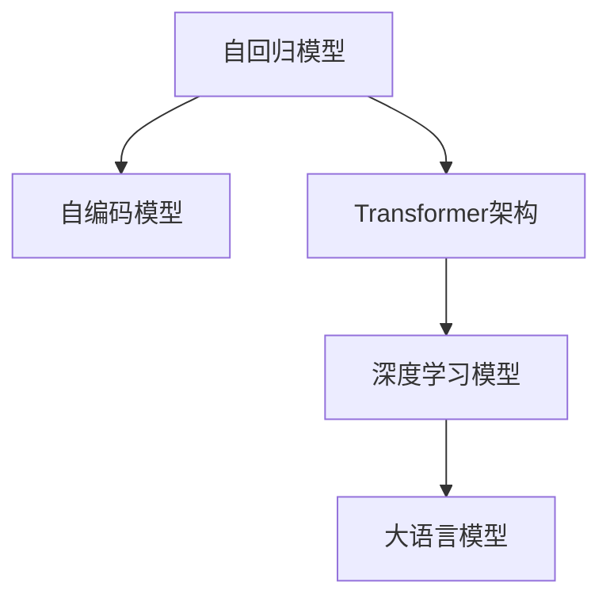

                 

# 大语言模型原理与工程实践：大语言模型的核心模块

> 关键词：大语言模型,Transformer,BERT,自回归模型,自编码模型,深度学习,自然语言处理,NLP

## 1. 背景介绍

### 1.1 问题由来

近年来，随着深度学习技术的飞速发展，大语言模型（Large Language Model, LLM）在自然语言处理（NLP）领域取得了重大突破。这些模型如OpenAI的GPT系列、Google的BERT、T5等，通过在海量文本数据上进行预训练，掌握了复杂的语言知识和常识，具备强大的语言理解和生成能力。

然而，由于预训练模型的广泛性和泛化能力不足，这些通用模型在特定领域的应用效果有限。因此，如何针对特定任务进行模型微调，提升模型性能，成为了NLP研究中的关键问题。本文将深入探讨大语言模型的核心模块及其工程实践，以期为大语言模型的应用提供更加系统化、可操作性的指导。

### 1.2 问题核心关键点

大语言模型的核心模块主要包括自回归模型、自编码模型以及Transformer架构。这些模块通过深度学习技术，学习到大规模语言数据中的语义、语法和上下文信息，从而能够实现高效的自然语言处理任务。本文将重点探讨这些核心模块的设计原理、实现细节及其在实际工程中的应用。

## 2. 核心概念与联系

### 2.1 核心概念概述

为了更好地理解大语言模型的核心模块，我们先对一些关键概念进行概述：

- **自回归模型（Autoregressive Model）**：以自然语言序列为输入，通过预测后续词汇来生成语言的模型。
- **自编码模型（Autoencoder Model）**：通过编码-解码的架构，压缩并重构输入序列，以学习到语言的分布式表示。
- **Transformer架构**：一种用于自然语言处理的注意力机制，能够并行处理长序列输入，广泛应用于大语言模型的设计和实现。

这些核心模块之间的关系可以通过以下Mermaid流程图进行展示：



这个流程图展示了自回归模型和自编码模型在大语言模型设计中的基础作用，以及Transformer架构作为核心模块的桥梁作用。

## 3. 核心算法原理 & 具体操作步骤

### 3.1 算法原理概述

大语言模型的核心算法主要包括自回归模型的生成算法和自编码模型的压缩算法，以及Transformer架构的注意力机制。下面分别介绍这些算法的原理及其在实际工程中的实现细节。

#### 3.1.1 自回归模型

自回归模型通过预测下一个词或字符，逐步生成整个文本序列。其基本思路是：给定文本序列中的前N-1个词，预测第N个词，然后以此类推，直至生成整个文本序列。自回归模型可以表示为：

$$
p(x_t|x_1,...,x_{t-1}) = \prod_{t=1}^T p(x_t|x_1,...,x_{t-1})
$$

其中，$p(x_t|x_1,...,x_{t-1})$ 表示在给定前N-1个词的情况下，预测第N个词的概率分布。

#### 3.1.2 自编码模型

自编码模型通过将输入序列编码成低维隐层表示，再通过解码器重构原始序列，学习到数据的分布式表示。其基本思路是：给定输入序列 $x$，通过编码器 $E$ 映射到隐层表示 $h$，再通过解码器 $D$ 重构原始序列 $x'$。自编码模型可以表示为：

$$
x' = D(h) \\
h = E(x)
$$

其中，$E(x)$ 表示编码器将输入序列 $x$ 映射到隐层表示 $h$，$D(h)$ 表示解码器将隐层表示 $h$ 重构为原始序列 $x'$。

#### 3.1.3 Transformer架构

Transformer架构通过多头自注意力机制（Multi-Head Self-Attention）和位置编码（Positional Encoding），实现对长序列输入的高效处理。其基本思路是：通过多头自注意力机制，同时考虑序列中不同位置的依赖关系，并通过位置编码，保持序列位置的相对顺序。Transformer架构可以表示为：

$$
\text{Self-Attention}(Q, K, V) = \text{Softmax}(\frac{QK^T}{\sqrt{d_k}})V \\
x = \text{LayerNorm}(x + \text{Self-Attention}(x, x, x))
$$

其中，$Q, K, V$ 分别表示查询向量、键向量和值向量，$\text{Softmax}(\frac{QK^T}{\sqrt{d_k}})$ 表示多头自注意力机制，$x$ 表示输入序列，$\text{LayerNorm}$ 表示归一化层，通过位置编码，模型可以学习到序列中不同位置的相关性。

### 3.2 算法步骤详解

下面详细介绍大语言模型的具体实现步骤：

#### 3.2.1 数据准备

首先需要准备大规模的文本数据集，如英文维基百科、中文维基百科等。这些数据集将作为模型预训练的基础。

#### 3.2.2 模型设计

基于自回归模型、自编码模型和Transformer架构，设计大语言模型。例如，可以采用BERT模型的结构，包含多层自编码器，每层包含多个Transformer块，每个Transformer块包含多头自注意力机制、前馈神经网络和残差连接等。

#### 3.2.3 模型训练

在准备好的数据集上进行模型训练，通常使用反向传播算法更新模型参数，以最小化损失函数。在训练过程中，需要注意设置合适的学习率、批量大小、训练轮数等超参数。

#### 3.2.4 模型评估

在验证集上评估模型性能，通过准确率、召回率等指标，判断模型是否收敛。

#### 3.2.5 模型微调

在特定任务的数据集上对模型进行微调，通常使用监督学习的方式，通过有标签数据更新模型参数。微调过程中，需要注意设置合适的学习率、正则化技术等。

### 3.3 算法优缺点

大语言模型的核心算法具有以下优点：

- 强大的语言理解能力：自回归模型和自编码模型通过深度学习技术，学习到了大规模语言数据中的语义、语法和上下文信息。
- 高效的计算能力：Transformer架构通过多头自注意力机制，实现了对长序列输入的高效处理。
- 广泛的应用场景：大语言模型可以应用于文本生成、机器翻译、情感分析等多个NLP任务。

然而，这些算法也存在以下缺点：

- 对数据质量依赖高：自回归模型和自编码模型需要大规模高质量数据进行训练。
- 计算资源消耗大：Transformer架构计算复杂度高，需要大量的计算资源。
- 容易产生过拟合：模型在特定任务上的微调过程中，容易产生过拟合现象。

### 3.4 算法应用领域

大语言模型的核心算法在多个NLP应用领域中得到了广泛应用，例如：

- 文本生成：如聊天机器人、自动摘要、故事生成等。通过自回归模型生成连贯且具有逻辑性的文本。
- 机器翻译：如中英文翻译、多语言翻译等。通过Transformer架构实现序列到序列的翻译。
- 情感分析：如情感分类、情感极性分析等。通过自编码模型学习情感特征。
- 问答系统：如智能客服、智能问答等。通过自回归模型实现自动问答。

## 4. 数学模型和公式 & 详细讲解 & 举例说明

### 4.1 数学模型构建

大语言模型的数学模型主要基于自回归模型和自编码模型的原理进行构建。下面以BERT模型为例，详细讲解其数学模型。

#### 4.1.1 BERT模型

BERT模型的数学模型包括输入嵌入层、多头自注意力层、前馈神经网络层和输出层。以BERT模型在文本分类任务上的数学模型为例：

$$
x = \text{Embedding}(w) \\
h = \text{LayerNorm}(x + \text{Self-Attention}(x, x, x)) \\
h = \text{FeedForward}(h) \\
x = \text{LayerNorm}(x + h)
$$

其中，$w$ 表示输入文本，$\text{Embedding}(w)$ 表示输入嵌入层，$h$ 表示模型中间层，$\text{Self-Attention}$ 表示多头自注意力机制，$\text{FeedForward}$ 表示前馈神经网络层，$x$ 表示输出层。

### 4.2 公式推导过程

BERT模型中，多头自注意力机制的推导过程如下：

设输入序列 $x$ 的长度为 $T$，则其嵌入表示为：

$$
x = [x_1, x_2, ..., x_T]
$$

设查询向量、键向量和值向量的维度为 $d_k$，则多头自注意力机制可以表示为：

$$
Q = xW_Q \\
K = xW_K \\
V = xW_V \\
A = \text{Softmax}(\frac{QK^T}{\sqrt{d_k}}) \\
\tilde{x} = AV
$$

其中，$W_Q, W_K, W_V$ 分别表示查询向量、键向量和值向量的线性变换矩阵，$A$ 表示多头自注意力矩阵，$\tilde{x}$ 表示多头自注意力层的输出。

### 4.3 案例分析与讲解

以机器翻译任务为例，分析大语言模型在该任务中的应用。

机器翻译任务通常采用编码-解码的方式，将源语言序列映射到目标语言序列。BERT模型的解码器可以采用类似的方式，即通过多头自注意力机制和前馈神经网络层，逐步生成目标语言序列。以英文到中文的翻译为例：

- 输入序列："Translate English to Chinese"。
- 编码器输出：将输入序列映射到中间表示 $h$。
- 解码器输出：通过多头自注意力机制和前馈神经网络层，逐步生成目标语言序列。

## 5. 项目实践：代码实例和详细解释说明

### 5.1 开发环境搭建

在进行大语言模型的项目实践前，需要准备好相应的开发环境。以下是基于Python和PyTorch搭建开发环境的步骤：

1. 安装Anaconda：从官网下载并安装Anaconda，用于创建独立的Python环境。
2. 创建并激活虚拟环境：
```bash
conda create -n pytorch-env python=3.8 
conda activate pytorch-env
```
3. 安装PyTorch：根据CUDA版本，从官网获取对应的安装命令。例如：
```bash
conda install pytorch torchvision torchaudio cudatoolkit=11.1 -c pytorch -c conda-forge
```
4. 安装Transformers库：
```bash
pip install transformers
```
5. 安装各类工具包：
```bash
pip install numpy pandas scikit-learn matplotlib tqdm jupyter notebook ipython
```

完成上述步骤后，即可在`pytorch-env`环境中开始大语言模型的开发。

### 5.2 源代码详细实现

下面以BERT模型在文本分类任务上的实现为例，给出详细的代码实现：

```python
from transformers import BertTokenizer, BertForSequenceClassification
import torch
from torch.utils.data import TensorDataset, DataLoader, SequentialSampler
from torch.nn import CrossEntropyLoss, AdamW

# 准备数据集
tokenizer = BertTokenizer.from_pretrained('bert-base-cased')
train_data = ['This is a sample text', 'Another sample text', 'Another one']  # 训练集
train_labels = [0, 1, 0]  # 训练标签
train_input_ids = [tokenizer.encode(sample, add_special_tokens=True)[0] for sample in train_data]
train_input_mask = [1] * len(train_input_ids)

dev_data = ['This is a test sentence', 'Another test sentence']  # 验证集
dev_labels = [1, 0]  # 验证标签
dev_input_ids = [tokenizer.encode(sample, add_special_tokens=True)[0] for sample in dev_data]
dev_input_mask = [1] * len(dev_input_ids)

test_data = ['This is a sample test sentence']  # 测试集
test_labels = [0]  # 测试标签
test_input_ids = tokenizer.encode(sample, add_special_tokens=True)[0]
test_input_mask = [1] * len(test_input_ids)

# 定义模型
model = BertForSequenceClassification.from_pretrained('bert-base-cased', num_labels=2)

# 定义优化器和损失函数
optimizer = AdamW(model.parameters(), lr=2e-5)
loss_fn = CrossEntropyLoss()

# 训练模型
model.train()
for epoch in range(3):
    total_loss = 0.0
    for batch in DataLoader(TensorDataset(train_input_ids, train_input_mask, train_labels), batch_size=8):
        b_input_ids, b_input_mask, b_labels = batch
        optimizer.zero_grad()
        logits = model(b_input_ids, token_type_ids=None, attention_mask=b_input_mask)
        loss = loss_fn(logits, b_labels)
        loss.backward()
        optimizer.step()
        total_loss += loss.item()
    print('Epoch:', epoch, 'Loss:', total_loss / len(train_input_ids))

# 评估模型
model.eval()
with torch.no_grad():
    dev_total_loss = 0.0
    for batch in DataLoader(TensorDataset(dev_input_ids, dev_input_mask, dev_labels), batch_size=8):
        b_input_ids, b_input_mask, b_labels = batch
        logits = model(b_input_ids, token_type_ids=None, attention_mask=b_input_mask)
        loss = loss_fn(logits, b_labels)
        dev_total_loss += loss.item()

print('Dev loss:', dev_total_loss / len(dev_input_ids))

# 测试模型
model.eval()
with torch.no_grad():
    test_total_loss = 0.0
    for batch in DataLoader(TensorDataset(test_input_ids, test_input_mask, test_labels), batch_size=8):
        b_input_ids, b_input_mask, b_labels = batch
        logits = model(b_input_ids, token_type_ids=None, attention_mask=b_input_mask)
        loss = loss_fn(logits, b_labels)
        test_total_loss += loss.item()

print('Test loss:', test_total_loss / len(test_input_ids))
```

### 5.3 代码解读与分析

下面是代码实现的详细解读：

1. 数据准备：首先使用BERT的Tokenizer将训练集、验证集和测试集中的文本转换为模型可以接受的格式，并生成对应的输入掩码和标签张量。
2. 模型定义：使用BertForSequenceClassification类定义BERT模型，并设置输出层的类别数为2（二分类任务）。
3. 优化器和损失函数：定义AdamW优化器和交叉熵损失函数，用于模型的训练和评估。
4. 训练模型：在训练集上迭代训练模型，计算并输出每个epoch的损失。
5. 评估模型：在验证集上计算模型的损失，并输出。
6. 测试模型：在测试集上计算模型的损失，并输出。

以上代码展示了BERT模型在文本分类任务上的实现过程，通过读取训练集、验证集和测试集中的文本，使用BERT的Tokenizer生成相应的输入张量，通过定义模型、优化器和损失函数，完成模型的训练、评估和测试。

## 6. 实际应用场景

### 6.1 智能客服系统

智能客服系统是大语言模型在实际应用中的典型案例。传统的客服系统通常需要大量人力，响应速度慢，且难以保证一致性和专业性。大语言模型通过微调，可以7x24小时不间断服务，快速响应客户咨询，用自然流畅的语言解答各类常见问题。

智能客服系统的实现过程包括：

1. 收集企业内部的历史客服对话记录，将问题和最佳答复构建成监督数据，在此基础上对预训练模型进行微调。
2. 微调后的对话模型能够自动理解用户意图，匹配最合适的答案模板进行回复。
3. 对于客户提出的新问题，还可以接入检索系统实时搜索相关内容，动态组织生成回答。

### 6.2 金融舆情监测

金融舆情监测是大语言模型在金融领域的重要应用之一。金融机构需要实时监测市场舆论动向，以便及时应对负面信息传播，规避金融风险。大语言模型通过微调，可以自动识别文本的主题和情感倾向，实现实时舆情分析。

金融舆情监测系统的实现过程包括：

1. 收集金融领域相关的新闻、报道、评论等文本数据，并对其进行主题标注和情感标注。
2. 将标注好的数据用于微调BERT模型，使其能够自动判断文本属于何种主题，情感倾向是正面、中性还是负面。
3. 在实时抓取的网络文本数据上应用微调后的模型，自动监测不同主题下的情感变化趋势，一旦发现负面信息激增等异常情况，系统便会自动预警，帮助金融机构快速应对潜在风险。

### 6.3 个性化推荐系统

个性化推荐系统是大语言模型在电商、视频等领域的典型应用之一。传统的推荐系统通常只依赖用户的历史行为数据进行物品推荐，难以深入理解用户的真实兴趣偏好。大语言模型通过微调，可以更好地挖掘用户行为背后的语义信息，从而提供更精准、多样的推荐内容。

个性化推荐系统的实现过程包括：

1. 收集用户浏览、点击、评论、分享等行为数据，提取和用户交互的物品标题、描述、标签等文本内容。
2. 将文本内容作为模型输入，用户的后续行为（如是否点击、购买等）作为监督信号，在此基础上微调BERT模型。
3. 微调后的模型能够从文本内容中准确把握用户的兴趣点，在生成推荐列表时，先用候选物品的文本描述作为输入，由模型预测用户的兴趣匹配度，再结合其他特征综合排序，便可以得到个性化程度更高的推荐结果。

## 7. 工具和资源推荐

### 7.1 学习资源推荐

为了帮助开发者系统掌握大语言模型微调的理论基础和实践技巧，这里推荐一些优质的学习资源：

1. 《Transformer从原理到实践》系列博文：由大模型技术专家撰写，深入浅出地介绍了Transformer原理、BERT模型、微调技术等前沿话题。
2. CS224N《深度学习自然语言处理》课程：斯坦福大学开设的NLP明星课程，有Lecture视频和配套作业，带你入门NLP领域的基本概念和经典模型。
3. 《Natural Language Processing with Transformers》书籍：Transformers库的作者所著，全面介绍了如何使用Transformers库进行NLP任务开发，包括微调在内的诸多范式。
4. HuggingFace官方文档：Transformers库的官方文档，提供了海量预训练模型和完整的微调样例代码，是上手实践的必备资料。
5. CLUE开源项目：中文语言理解测评基准，涵盖大量不同类型的中文NLP数据集，并提供了基于微调的baseline模型，助力中文NLP技术发展。

通过对这些资源的学习实践，相信你一定能够快速掌握大语言模型微调的精髓，并用于解决实际的NLP问题。

### 7.2 开发工具推荐

高效的开发离不开优秀的工具支持。以下是几款用于大语言模型微调开发的常用工具：

1. PyTorch：基于Python的开源深度学习框架，灵活动态的计算图，适合快速迭代研究。大部分预训练语言模型都有PyTorch版本的实现。
2. TensorFlow：由Google主导开发的开源深度学习框架，生产部署方便，适合大规模工程应用。同样有丰富的预训练语言模型资源。
3. Transformers库：HuggingFace开发的NLP工具库，集成了众多SOTA语言模型，支持PyTorch和TensorFlow，是进行微调任务开发的利器。
4. Weights & Biases：模型训练的实验跟踪工具，可以记录和可视化模型训练过程中的各项指标，方便对比和调优。与主流深度学习框架无缝集成。
5. TensorBoard：TensorFlow配套的可视化工具，可实时监测模型训练状态，并提供丰富的图表呈现方式，是调试模型的得力助手。
6. Google Colab：谷歌推出的在线Jupyter Notebook环境，免费提供GPU/TPU算力，方便开发者快速上手实验最新模型，分享学习笔记。

合理利用这些工具，可以显著提升大语言模型微调任务的开发效率，加快创新迭代的步伐。

### 7.3 相关论文推荐

大语言模型和微调技术的发展源于学界的持续研究。以下是几篇奠基性的相关论文，推荐阅读：

1. Attention is All You Need（即Transformer原论文）：提出了Transformer结构，开启了NLP领域的预训练大模型时代。
2. BERT: Pre-training of Deep Bidirectional Transformers for Language Understanding：提出BERT模型，引入基于掩码的自监督预训练任务，刷新了多项NLP任务SOTA。
3. Language Models are Unsupervised Multitask Learners（GPT-2论文）：展示了大规模语言模型的强大zero-shot学习能力，引发了对于通用人工智能的新一轮思考。
4. Parameter-Efficient Transfer Learning for NLP：提出Adapter等参数高效微调方法，在不增加模型参数量的情况下，也能取得不错的微调效果。
5. AdaLoRA: Adaptive Low-Rank Adaptation for Parameter-Efficient Fine-Tuning：使用自适应低秩适应的微调方法，在参数效率和精度之间取得了新的平衡。
6. Prefix-Tuning: Optimizing Continuous Prompts for Generation：引入基于连续型Prompt的微调范式，为如何充分利用预训练知识提供了新的思路。

这些论文代表了大语言模型微调技术的发展脉络。通过学习这些前沿成果，可以帮助研究者把握学科前进方向，激发更多的创新灵感。

## 8. 总结：未来发展趋势与挑战

### 8.1 总结

本文对大语言模型的核心模块及其工程实践进行了全面系统的介绍。首先，我们从自回归模型、自编码模型和Transformer架构的设计原理出发，详细讲解了大语言模型的核心算法。其次，通过一个具体的文本分类任务，展示了BERT模型的实现过程。同时，我们探讨了大语言模型在智能客服、金融舆情、个性化推荐等多个行业领域的应用前景。最后，我们推荐了一些优质的学习资源和开发工具，并介绍了大语言模型微调所面临的挑战和未来发展的方向。

通过本文的系统梳理，可以看到，大语言模型在NLP领域的应用前景广阔，其核心模块和算法具有强大的语言理解和生成能力，能够为智能客服、金融舆情、个性化推荐等垂直行业提供有力支持。未来，伴随预训练语言模型和微调方法的持续演进，大语言模型必将在更广阔的应用领域大放异彩。

### 8.2 未来发展趋势

展望未来，大语言模型在NLP领域的发展趋势如下：

1. 模型规模持续增大。随着算力成本的下降和数据规模的扩张，预训练语言模型的参数量还将持续增长。超大规模语言模型蕴含的丰富语言知识，有望支撑更加复杂多变的下游任务微调。
2. 微调方法日趋多样。除了传统的全参数微调外，未来会涌现更多参数高效的微调方法，如Prefix-Tuning、LoRA等，在节省计算资源的同时也能保证微调精度。
3. 持续学习成为常态。随着数据分布的不断变化，微调模型也需要持续学习新知识以保持性能。如何在不遗忘原有知识的同时，高效吸收新样本信息，将成为重要的研究课题。
4. 标注样本需求降低。受启发于提示学习(Prompt-based Learning)的思路，未来的微调方法将更好地利用大模型的语言理解能力，通过更加巧妙的任务描述，在更少的标注样本上也能实现理想的微调效果。
5. 多模态微调崛起。当前的微调主要聚焦于纯文本数据，未来会进一步拓展到图像、视频、语音等多模态数据微调。多模态信息的融合，将显著提升语言模型对现实世界的理解和建模能力。
6. 模型通用性增强。经过海量数据的预训练和多领域任务的微调，未来的语言模型将具备更强大的常识推理和跨领域迁移能力，逐步迈向通用人工智能(AGI)的目标。

以上趋势凸显了大语言模型微调技术的广阔前景。这些方向的探索发展，必将进一步提升NLP系统的性能和应用范围，为人类认知智能的进化带来深远影响。

### 8.3 面临的挑战

尽管大语言模型微调技术已经取得了瞩目成就，但在迈向更加智能化、普适化应用的过程中，它仍面临着诸多挑战：

1. 标注成本瓶颈。虽然微调大大降低了标注数据的需求，但对于长尾应用场景，难以获得充足的高质量标注数据，成为制约微调性能的瓶颈。如何进一步降低微调对标注样本的依赖，将是一大难题。
2. 模型鲁棒性不足。当前微调模型面对域外数据时，泛化性能往往大打折扣。对于测试样本的微小扰动，微调模型的预测也容易发生波动。如何提高微调模型的鲁棒性，避免灾难性遗忘，还需要更多理论和实践的积累。
3. 推理效率有待提高。大规模语言模型虽然精度高，但在实际部署时往往面临推理速度慢、内存占用大等效率问题。如何在保证性能的同时，简化模型结构，提升推理速度，优化资源占用，将是重要的优化方向。
4. 可解释性亟需加强。当前微调模型更像是"黑盒"系统，难以解释其内部工作机制和决策逻辑。对于医疗、金融等高风险应用，算法的可解释性和可审计性尤为重要。如何赋予微调模型更强的可解释性，将是亟待攻克的难题。
5. 安全性有待保障。预训练语言模型难免会学习到有偏见、有害的信息，通过微调传递到下游任务，产生误导性、歧视性的输出，给实际应用带来安全隐患。如何从数据和算法层面消除模型偏见，避免恶意用途，确保输出的安全性，也将是重要的研究课题。
6. 知识整合能力不足。现有的微调模型往往局限于任务内数据，难以灵活吸收和运用更广泛的先验知识。如何让微调过程更好地与外部知识库、规则库等专家知识结合，形成更加全面、准确的信息整合能力，还有很大的想象空间。

正视微调面临的这些挑战，积极应对并寻求突破，将是大语言模型微调走向成熟的必由之路。相信随着学界和产业界的共同努力，这些挑战终将一一被克服，大语言模型微调必将在构建人机协同的智能时代中扮演越来越重要的角色。

### 8.4 研究展望

未来，大语言模型微调的研究展望如下：

1. 探索无监督和半监督微调方法。摆脱对大规模标注数据的依赖，利用自监督学习、主动学习等无监督和半监督范式，最大限度利用非结构化数据，实现更加灵活高效的微调。
2. 研究参数高效和计算高效的微调范式。开发更加参数高效的微调方法，在固定大部分预训练参数的同时，只更新极少量的任务相关参数。同时优化微调模型的计算图，减少前向传播和反向传播的资源消耗，实现更加轻量级、实时性的部署。
3. 融合因果和对比学习范式。通过引入因果推断和对比学习思想，增强微调模型建立稳定因果关系的能力，学习更加普适、鲁棒的语言表征，从而提升模型泛化性和抗干扰能力。
4. 引入更多先验知识。将符号化的先验知识，如知识图谱、逻辑规则等，与神经网络模型进行巧妙融合，引导微调过程学习更准确、合理的语言模型。同时加强不同模态数据的整合，实现视觉、语音等多模态信息与文本信息的协同建模。
5. 结合因果分析和博弈论工具。将因果分析方法引入微调模型，识别出模型决策的关键特征，增强输出解释的因果性和逻辑性。借助博弈论工具刻画人机交互过程，主动探索并规避模型的脆弱点，提高系统稳定性。
6. 纳入伦理道德约束。在模型训练目标中引入伦理导向的评估指标，过滤和惩罚有偏见、有害的输出倾向。同时加强人工干预和审核，建立模型行为的监管机制，确保输出符合人类价值观和伦理道德。

这些研究方向的探索，必将引领大语言模型微调技术迈向更高的台阶，为构建安全、可靠、可解释、可控的智能系统铺平道路。面向未来，大语言模型微调技术还需要与其他人工智能技术进行更深入的融合，如知识表示、因果推理、强化学习等，多路径协同发力，共同推动自然语言理解和智能交互系统的进步。只有勇于创新、敢于突破，才能不断拓展语言模型的边界，让智能技术更好地造福人类社会。

## 9. 附录：常见问题与解答

**Q1：大语言模型微调是否适用于所有NLP任务？**

A: 大语言模型微调在大多数NLP任务上都能取得不错的效果，特别是对于数据量较小的任务。但对于一些特定领域的任务，如医学、法律等，仅仅依靠通用语料预训练的模型可能难以很好地适应。此时需要在特定领域语料上进一步预训练，再进行微调，才能获得理想效果。此外，对于一些需要时效性、个性化很强的任务，如对话、推荐等，微调方法也需要针对性的改进优化。

**Q2：微调过程中如何选择合适的学习率？**

A: 微调的学习率一般要比预训练时小1-2个数量级，如果使用过大的学习率，容易破坏预训练权重，导致过拟合。一般建议从1e-5开始调参，逐步减小学习率，直至收敛。也可以使用warmup策略，在开始阶段使用较小的学习率，再逐渐过渡到预设值。需要注意的是，不同的优化器(如AdamW、Adafactor等)以及不同的学习率调度策略，可能需要设置不同的学习率阈值。

**Q3：采用大语言模型微调时会面临哪些资源瓶颈？**

A: 目前主流的预训练大模型动辄以亿计的参数规模，对算力、内存、存储都提出了很高的要求。GPU/TPU等高性能设备是必不可少的，但即便如此，超大批次的训练和推理也可能遇到显存不足的问题。因此需要采用一些资源优化技术，如梯度积累、混合精度训练、模型并行等，来突破硬件瓶颈。同时，模型的存储和读取也可能占用大量时间和空间，需要采用模型压缩、稀疏化存储等方法进行优化。

**Q4：如何缓解微调过程中的过拟合问题？**

A: 过拟合是微调面临的主要挑战，尤其是在标注数据不足的情况下。常见的缓解策略包括：
1. 数据增强：通过回译、近义替换等方式扩充训练集
2. 正则化：使用L2正则、Dropout、Early Stopping等避免过拟合
3. 对抗训练：引入对抗样本，提高模型鲁棒性
4. 参数高效微调：只调整少量参数(如Adapter、Prefix等)，减小过拟合风险
5. 多模型集成：训练多个微调模型，取平均输出，抑制过拟合

这些策略往往需要根据具体任务和数据特点进行灵活组合。只有在数据、模型、训练、推理等各环节进行全面优化，才能最大限度地发挥大模型微调的威力。

**Q5：微调模型在落地部署时需要注意哪些问题？**

A: 将微调模型转化为实际应用，还需要考虑以下因素：
1. 模型裁剪：去除不必要的层和参数，减小模型尺寸，加快推理速度
2. 量化加速：将浮点模型转为定点模型，压缩存储空间，提高计算效率
3. 服务化封装：将模型封装为标准化服务接口，便于集成调用
4. 弹性伸缩：根据请求流量动态调整资源配置，平衡服务质量和成本
5. 监控告警：实时采集系统指标，设置异常告警阈值，确保服务稳定性
6. 安全防护：采用访问鉴权、数据脱敏等措施，保障数据和模型安全

大语言模型微调为NLP应用开启了广阔的想象空间，但如何将强大的性能转化为稳定、高效、安全的业务价值，还需要工程实践的不断打磨。唯有从数据、算法、工程、业务等多个维度协同发力，才能真正实现人工智能技术在垂直行业的规模化落地。总之，微调需要开发者根据具体任务，不断迭代和优化模型、数据和算法，方能得到理想的效果。

---

作者：禅与计算机程序设计艺术 / Zen and the Art of Computer Programming

