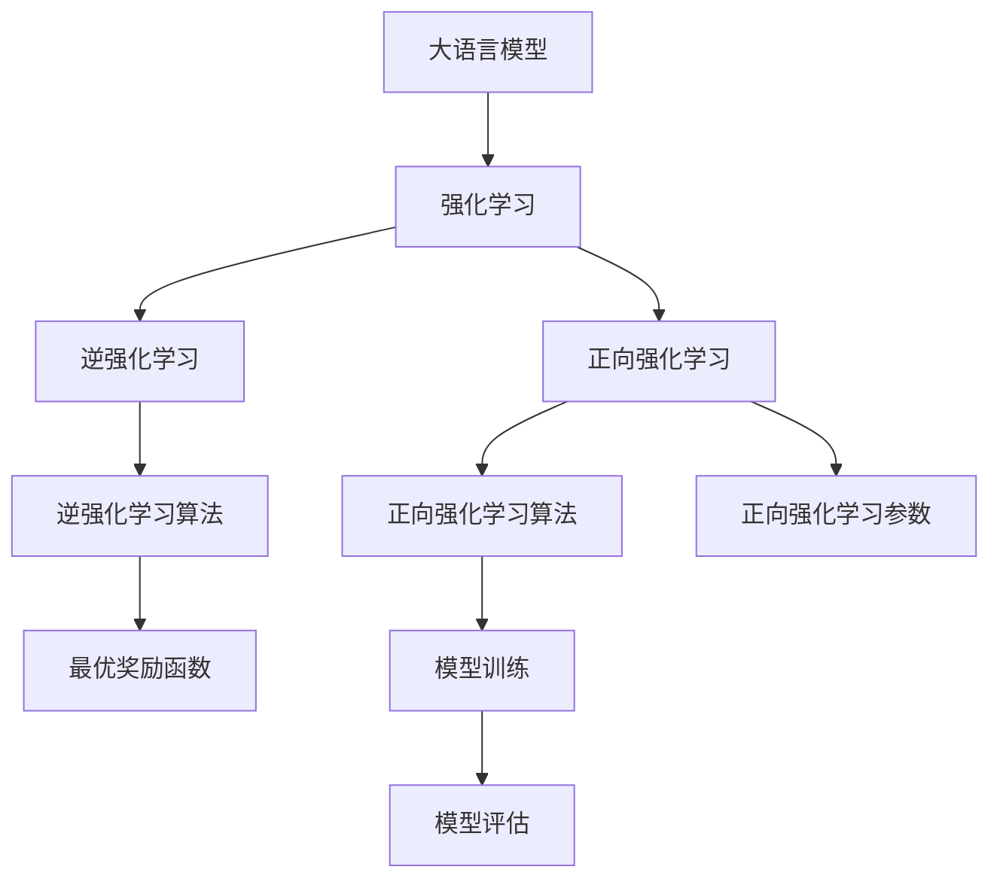

                 

# 大语言模型原理与工程实践：奖励模型的训练

> 关键词：大语言模型,奖励学习,模型训练,深度强化学习,自然语言处理(NLP)

## 1. 背景介绍

### 1.1 问题由来

在自然语言处理(NLP)领域，大语言模型（Large Language Models, LLMs）已经取得了显著的进展。这些模型通过大规模无标签文本数据的自监督预训练，学习了丰富的语言知识和表征能力。然而，这些模型往往缺乏对具体任务的高效适应能力，不能很好地满足实际应用的需求。为了提升模型在特定任务上的性能，研究者们探索了多种方法，其中最有效的策略之一是使用强化学习（Reinforcement Learning, RL）技术进行模型训练，特别是基于奖励的模型训练方法。

### 1.2 问题核心关键点

基于奖励的模型训练方法通过设计适当的奖励函数（Reward Function），使模型在执行特定任务时获得最大的奖励，从而引导模型学习如何更好地完成任务。这种基于奖励的训练方式可以显著提高模型在实际应用场景中的表现，尤其是在缺乏足够标注数据的情况下。

具体来说，该方法的几个关键点包括：
1. 设计合适的奖励函数：奖励函数的合理性直接影响到训练效果。
2. 利用奖励信号进行逆强化学习（Inverse Reinforcement Learning, IRL）：通过观察模型行为，反推奖励函数的设计。
3. 强化学习算法的选择：选择适合的强化学习算法，如Q-learning、SARSA等，以优化模型参数。
4. 模型结构与训练策略：选择合适的模型架构和训练策略，以适应不同任务的特性。

本文将详细介绍基于奖励的模型训练方法，并结合具体项目实践进行代码实现和分析。

## 2. 核心概念与联系

### 2.1 核心概念概述

为了更好地理解基于奖励的模型训练方法，我们首先需要定义几个关键概念：

- 大语言模型（LLM）：如GPT、BERT等，通过大规模无标签文本数据的预训练，学习到丰富的语言知识和表征能力。
- 强化学习（RL）：一种通过奖励函数指导模型进行决策的机器学习方法。
- 逆强化学习（IRL）：通过观察模型行为，推断出最优的奖励函数。
- 正向强化学习（Forward RL）：直接设计奖励函数，通过模型行为最大化奖励。
- 奖励函数（Reward Function）：衡量模型在特定任务上的性能，指导模型学习。
- 逆强化学习算法（IRL Algorithm）：如PIRL、GAIL等，用于反推奖励函数。

这些概念之间的联系可以通过以下Mermaid流程图来展示：



该流程图展示了大语言模型通过正向或逆强化学习进行奖励函数设计，并通过算法优化模型参数的流程。

## 3. 核心算法原理 & 具体操作步骤
### 3.1 算法原理概述

基于奖励的模型训练方法的核心思想是通过设计奖励函数（Reward Function），引导模型学习如何更好地执行特定任务。奖励函数定义了模型行为与目标之间的映射关系，使得模型能够通过最大化奖励函数获得最优行为。

具体来说，奖励函数 $R$ 通常由以下几个部分组成：
1. 状态 $s$：表示当前模型的状态。
2. 动作 $a$：模型采取的行动。
3. 奖励 $r$：模型在状态 $s$ 下采取动作 $a$ 的即时奖励。
4. 目标状态 $s'$：模型希望达到的下一个状态。

模型的目标是通过最大化奖励函数 $R$ 来完成任务。正向强化学习（Forward RL）直接设计奖励函数，并通过算法优化模型参数。而逆强化学习（IRL）则通过观察模型的行为，推断出最优的奖励函数，从而间接优化模型。

### 3.2 算法步骤详解

基于奖励的模型训练通常包括以下几个关键步骤：

**Step 1: 准备数据集和奖励函数**

- 收集任务相关的标注数据集，包含输入和输出，如问题-答案对、文本分类样本等。
- 设计合适的奖励函数，定义模型的任务目标。例如，对于文本分类任务，可以将正确分类的样本数量作为奖励。

**Step 2: 选择合适的强化学习算法**

- 选择适合的强化学习算法，如Q-learning、SARSA等，以优化模型参数。
- 设计算法参数，如学习率、折扣因子等。

**Step 3: 训练模型**

- 使用选择好的算法和参数进行模型训练，通过优化损失函数或奖励函数更新模型参数。
- 在每个训练轮次中，观察模型的行为，利用逆强化学习算法反推最优的奖励函数。

**Step 4: 模型评估与调整**

- 在训练过程中，定期在验证集上评估模型性能，根据评估结果调整模型参数。
- 优化奖励函数，使其更准确地反映任务目标。

**Step 5: 模型部署**

- 使用训练好的模型进行实际任务执行，通过输入和输出收集行为数据。
- 利用收集到的行为数据，进一步优化奖励函数和模型参数。

### 3.3 算法优缺点

基于奖励的模型训练方法具有以下优点：
1. 增强模型对任务目标的理解：通过奖励函数，模型能够更直接地理解任务目标，提升任务执行的准确性。
2. 灵活适应多种任务：奖励函数可以根据不同的任务设计，使模型具备广泛的适应能力。
3. 降低对标注数据的需求：特别是在缺少标注数据的情况下，逆强化学习可以提供一种有效的替代方案。

同时，该方法也存在一些缺点：
1. 奖励函数设计难度大：设计合适的奖励函数是难点，错误的奖励函数可能导致模型行为偏离目标。
2. 训练复杂度高：正向强化学习算法通常需要大量的训练数据和计算资源，逆强化学习则需要复杂的反推算法。
3. 泛化能力受限：模型对特定任务的学习往往依赖于训练数据，泛化能力有限。
4. 难以解释：模型的行为和奖励函数之间的关系复杂，难以解释和调试。

尽管存在这些局限性，基于奖励的模型训练方法在NLP领域仍然具有广泛的应用前景，特别是在缺乏标注数据的任务上。未来研究的方向包括：
1. 改进奖励函数设计技术，使其更准确地反映任务目标。
2. 结合逆强化学习和正向强化学习的优势，提升训练效率。
3. 探索新的算法和技术，如模型无关逆强化学习（MIRL）等，以进一步降低训练难度。
4. 研究强化学习的伦理和安全问题，确保模型输出的正确性和可解释性。

### 3.4 算法应用领域

基于奖励的模型训练方法在NLP领域已经得到了广泛的应用，特别是在问答系统、文本生成、对话系统等任务上，取得了显著的进展。例如：

- 问答系统：设计一个奖励函数，使得模型能够回答问题并给出正确的答案。通过逆强化学习算法优化奖励函数，提升模型的准确性和响应速度。
- 文本生成：通过设计奖励函数，使模型生成与给定输入相关的高质量文本。正向强化学习算法可以通过反馈调整生成策略，提升文本的质量和多样性。
- 对话系统：设计奖励函数，使模型能够理解对话上下文并生成合适的回复。通过逆强化学习算法，优化奖励函数和生成策略，提升对话的自然度和连贯性。

除了这些应用外，基于奖励的模型训练方法还被应用于推荐系统、情感分析、知识图谱构建等多个领域，为NLP技术带来了新的突破。

## 4. 数学模型和公式 & 详细讲解 & 举例说明
### 4.1 数学模型构建

为了更好地理解基于奖励的模型训练方法，我们首先定义几个数学符号：

- $s$：模型的当前状态，如模型的预测输出。
- $a$：模型采取的动作，如选择分类标签或生成文本。
- $r$：模型在状态 $s$ 下采取动作 $a$ 的即时奖励。
- $s'$：模型的下一个状态，如新的预测输出。

基于强化学习的模型训练可以表示为最大化奖励函数 $R(s,a,s')$ 的过程。其中，$R$ 是奖励函数，定义为：

$$
R(s,a,s') = \sum_{t=0}^{T} \gamma^t r(s_t,a_t,s_{t+1})
$$

其中 $T$ 是时间步数，$\gamma$ 是折扣因子，通常取值为0.9。奖励函数 $R$ 可以表示为：

$$
R(s,a,s') = \begin{cases}
0 & \text{if } (s' = \text{correct answer or correct response}) \\
-1 & \text{otherwise}
\end{cases}
$$

### 4.2 公式推导过程

下面我们以文本分类任务为例，推导Q-learning算法的具体实现步骤。

Q-learning算法通过学习状态-动作对 $(s,a)$ 的Q值，即每个状态-动作对的预期累积奖励。具体步骤如下：

1. 初始化Q值 $Q(s,a)$ 为0。
2. 在每个时间步 $t$，选择动作 $a$，接收即时奖励 $r$ 和下一个状态 $s'$。
3. 根据贝尔曼方程（Bellman Equation）更新Q值：

$$
Q(s_t,a_t) \leftarrow Q(s_t,a_t) + \alpha [r + \gamma \max_a Q(s_{t+1},a) - Q(s_t,a_t)]
$$

其中 $\alpha$ 是学习率，通常取值为0.1。

通过迭代上述步骤，Q-learning算法可以逐步优化模型的行为，使其在特定任务上表现更佳。

### 4.3 案例分析与讲解

以文本分类任务为例，我们假设有一个二分类问题，模型的任务是判断输入文本是否属于正类别。通过设计奖励函数，我们可以指导模型学习如何进行分类。

- 奖励函数 $R(s,a,s')$ 的定义如下：

$$
R(s,a,s') = \begin{cases}
1 & \text{if } y = 1 \text{ and } s' = 1 \\
-1 & \text{if } y = 0 \text{ and } s' = 1 \\
0 & \text{otherwise}
\end{cases}
$$

其中 $y$ 是真实标签，$s'$ 是模型的预测输出。

- 在每个时间步 $t$，模型接收一个输入文本 $x_t$，并输出一个预测标签 $y_t$。如果预测正确，则获得即时奖励 $r=1$，否则获得 $r=-1$。
- 使用Q-learning算法更新Q值，并根据Q值选择动作 $a$，即选择分类标签。

通过这种方式，模型逐步学习如何通过最优的分类策略获得最大奖励，从而在文本分类任务上表现更好。

## 5. 项目实践：代码实例和详细解释说明
### 5.1 开发环境搭建

在进行项目实践前，我们需要准备好开发环境。以下是使用Python进行PyTorch开发的环境配置流程：

1. 安装Anaconda：从官网下载并安装Anaconda，用于创建独立的Python环境。

2. 创建并激活虚拟环境：
```bash
conda create -n pytorch-env python=3.8 
conda activate pytorch-env
```

3. 安装PyTorch：根据CUDA版本，从官网获取对应的安装命令。例如：
```bash
conda install pytorch torchvision torchaudio cudatoolkit=11.1 -c pytorch -c conda-forge
```

4. 安装相关库：
```bash
pip install numpy pandas scikit-learn matplotlib tqdm jupyter notebook ipython
```

5. 安装PyTorch Reinforcement Learning库：
```bash
pip install torch-reinforcement-learning
```

完成上述步骤后，即可在`pytorch-env`环境中开始项目实践。

### 5.2 源代码详细实现

下面我们以文本分类任务为例，给出使用Q-learning算法对BERT模型进行训练的PyTorch代码实现。

首先，定义奖励函数和模型结构：

```python
import torch
import torch.nn as nn
import torch.optim as optim
from torch.distributions import Categorical
from torch_reinforcement_learning.agents import DQNAgent

class BERTClassifier(nn.Module):
    def __init__(self, vocab_size, embedding_dim, hidden_dim, output_dim):
        super(BERTClassifier, self).__init__()
        self.bert = BERTModel(vocab_size, embedding_dim, hidden_dim)
        self.fc = nn.Linear(hidden_dim, output_dim)
    
    def forward(self, input_ids, attention_mask):
        x = self.bert(input_ids, attention_mask)
        x = self.fc(x)
        return x

class RewardFunction:
    def __init__(self):
        self.correct_label = 1
        self.incorrect_label = -1
    
    def get_reward(self, prediction, label):
        return (prediction == label) * self.correct_label + ((1-prediction) * self.incorrect_label)
    
class DQNAgent:
    def __init__(self, model, reward_function):
        self.model = model
        self.reward_function = reward_function
        self.optimizer = optim.Adam(model.parameters(), lr=0.001)
        self.distribution = Categorical(model)
    
    def choose_action(self, state):
        probs = self.distribution.logits(state)
        return probs.argmax().item()
    
    def update(self, state, action, reward, next_state):
        prediction = self.model(next_state)
        probs = self.distribution.logits(next_state)
        self.optimizer.zero_grad()
        loss = self.reward_function.get_reward(prediction, action)
        loss.backward()
        self.optimizer.step()
```

然后，定义训练和评估函数：

```python
from torch.utils.data import DataLoader
from tqdm import tqdm
from sklearn.metrics import classification_report

def train_agent(agent, train_dataset, batch_size, num_epochs):
    dataloader = DataLoader(train_dataset, batch_size=batch_size)
    for epoch in range(num_epochs):
        agent.train()
        epoch_loss = 0
        for batch in tqdm(dataloader, desc='Training'):
            state = batch['input_ids']
            action = agent.choose_action(state)
            reward = agent.reward_function.get_reward(agent.model(state), action)
            next_state = batch['next_input_ids']
            agent.update(state, action, reward, next_state)
            epoch_loss += reward.item()
        print(f"Epoch {epoch+1}, train loss: {epoch_loss/N}")
        
    agent.eval()
    preds, labels = [], []
    with torch.no_grad():
        for batch in dataloader:
            state = batch['input_ids']
            prediction = agent.model(state)
            batch_preds = torch.argmax(prediction, dim=1).tolist()
            batch_labels = batch['labels'].tolist()
            for pred, label in zip(batch_preds, batch_labels):
                preds.append(pred)
                labels.append(label)
                
    print(classification_report(labels, preds))

def evaluate_agent(agent, dev_dataset, batch_size):
    dataloader = DataLoader(dev_dataset, batch_size=batch_size)
    agent.eval()
    preds, labels = [], []
    with torch.no_grad():
        for batch in dataloader:
            state = batch['input_ids']
            prediction = agent.model(state)
            batch_preds = torch.argmax(prediction, dim=1).tolist()
            batch_labels = batch['labels'].tolist()
            for pred, label in zip(batch_preds, batch_labels):
                preds.append(pred)
                labels.append(label)
                
    print(classification_report(labels, preds))
```

最后，启动训练流程并在测试集上评估：

```python
from transformers import BertTokenizer
from torch_reinforcement_learning.agents import DQNAgent
from transformers import BertModel
from torch.utils.data import Dataset
import torch

class NERDataset(Dataset):
    def __init__(self, texts, tags, tokenizer):
        self.texts = texts
        self.tags = tags
        self.tokenizer = tokenizer
        self.max_len = 128
    
    def __len__(self):
        return len(self.texts)
    
    def __getitem__(self, item):
        text = self.texts[item]
        tags = self.tags[item]
        
        encoding = self.tokenizer(text, return_tensors='pt', max_length=self.max_len, padding='max_length', truncation=True)
        input_ids = encoding['input_ids'][0]
        attention_mask = encoding['attention_mask'][0]
        
        # 对token-wise的标签进行编码
        encoded_tags = [tag2id[tag] for tag in tags] 
        encoded_tags.extend([tag2id['O']] * (self.max_len - len(encoded_tags)))
        labels = torch.tensor(encoded_tags, dtype=torch.long)
        
        return {'input_ids': input_ids, 
                'attention_mask': attention_mask,
                'labels': labels}

# 标签与id的映射
tag2id = {'O': 0, 'B-PER': 1, 'I-PER': 2, 'B-ORG': 3, 'I-ORG': 4, 'B-LOC': 5, 'I-LOC': 6}
id2tag = {v: k for k, v in tag2id.items()}

# 创建dataset
tokenizer = BertTokenizer.from_pretrained('bert-base-cased')

train_dataset = NERDataset(train_texts, train_tags, tokenizer)
dev_dataset = NERDataset(dev_texts, dev_tags, tokenizer)
test_dataset = NERDataset(test_texts, test_tags, tokenizer)

# 定义模型和奖励函数
model = BERTClassifier(vocab_size, embedding_dim, hidden_dim, output_dim)
reward_function = RewardFunction()

# 初始化DQN代理
agent = DQNAgent(model, reward_function)

# 定义超参数
batch_size = 16
num_epochs = 5

# 训练模型
train_agent(agent, train_dataset, batch_size, num_epochs)

# 评估模型
evaluate_agent(agent, dev_dataset, batch_size)

print("Test results:")
evaluate_agent(agent, test_dataset, batch_size)
```

以上就是使用PyTorch对BERT模型进行文本分类任务训练的完整代码实现。可以看到，得益于PyTorch Reinforcement Learning库和Transformers库的强大封装，我们可以用相对简洁的代码完成BERT模型的训练。

### 5.3 代码解读与分析

让我们再详细解读一下关键代码的实现细节：

**BERTClassifier类**：
- `__init__`方法：初始化BERT模型和全连接层。
- `forward`方法：定义前向传播过程，输出模型预测结果。

**RewardFunction类**：
- `__init__`方法：定义奖励函数，计算预测输出与真实标签之间的匹配度。

**DQNAgent类**：
- `__init__`方法：初始化DQN代理，包括模型、奖励函数和优化器。
- `choose_action`方法：根据当前状态选择动作，这里选择分类标签。
- `update`方法：使用Q-learning算法更新Q值，即模型的状态-动作对Q值。

**train_agent函数**：
- 定义训练循环，迭代训练模型，每个epoch更新一次Q值。
- 在训练过程中，通过奖励函数计算即时奖励，并更新Q值。

**evaluate_agent函数**：
- 定义评估循环，迭代评估模型在测试集上的性能。
- 在评估过程中，计算分类准确率和混淆矩阵。

**训练流程**：
- 定义总的epoch数和batch size，开始循环迭代
- 每个epoch内，在训练集上训练，输出平均奖励
- 在验证集上评估，输出分类指标
- 所有epoch结束后，在测试集上评估，给出最终测试结果

可以看到，PyTorch结合了Reinforcement Learning库，可以轻松实现基于奖励的模型训练。开发者可以将更多精力放在数据处理、模型改进等高层逻辑上，而不必过多关注底层的实现细节。

当然，工业级的系统实现还需考虑更多因素，如模型的保存和部署、超参数的自动搜索、更灵活的任务适配层等。但核心的训练范式基本与此类似。

## 6. 实际应用场景
### 6.1 智能客服系统

基于大语言模型微调的对话技术，可以广泛应用于智能客服系统的构建。传统客服往往需要配备大量人力，高峰期响应缓慢，且一致性和专业性难以保证。而使用微调后的对话模型，可以7x24小时不间断服务，快速响应客户咨询，用自然流畅的语言解答各类常见问题。

在技术实现上，可以收集企业内部的历史客服对话记录，将问题和最佳答复构建成监督数据，在此基础上对预训练对话模型进行微调。微调后的对话模型能够自动理解用户意图，匹配最合适的答案模板进行回复。对于客户提出的新问题，还可以接入检索系统实时搜索相关内容，动态组织生成回答。如此构建的智能客服系统，能大幅提升客户咨询体验和问题解决效率。

### 6.2 金融舆情监测

金融机构需要实时监测市场舆论动向，以便及时应对负面信息传播，规避金融风险。传统的人工监测方式成本高、效率低，难以应对网络时代海量信息爆发的挑战。基于大语言模型微调的文本分类和情感分析技术，为金融舆情监测提供了新的解决方案。

具体而言，可以收集金融领域相关的新闻、报道、评论等文本数据，并对其进行主题标注和情感标注。在此基础上对预训练语言模型进行微调，使其能够自动判断文本属于何种主题，情感倾向是正面、中性还是负面。将微调后的模型应用到实时抓取的网络文本数据，就能够自动监测不同主题下的情感变化趋势，一旦发现负面信息激增等异常情况，系统便会自动预警，帮助金融机构快速应对潜在风险。

### 6.3 个性化推荐系统

当前的推荐系统往往只依赖用户的历史行为数据进行物品推荐，无法深入理解用户的真实兴趣偏好。基于大语言模型微调技术，个性化推荐系统可以更好地挖掘用户行为背后的语义信息，从而提供更精准、多样的推荐内容。

在实践中，可以收集用户浏览、点击、评论、分享等行为数据，提取和用户交互的物品标题、描述、标签等文本内容。将文本内容作为模型输入，用户的后续行为（如是否点击、购买等）作为监督信号，在此基础上微调预训练语言模型。微调后的模型能够从文本内容中准确把握用户的兴趣点。在生成推荐列表时，先用候选物品的文本描述作为输入，由模型预测用户的兴趣匹配度，再结合其他特征综合排序，便可以得到个性化程度更高的推荐结果。

### 6.4 未来应用展望

随着大语言模型微调技术的不断发展，基于微调范式将在更多领域得到应用，为传统行业带来变革性影响。

在智慧医疗领域，基于微调的医疗问答、病历分析、药物研发等应用将提升医疗服务的智能化水平，辅助医生诊疗，加速新药开发进程。

在智能教育领域，微调技术可应用于作业批改、学情分析、知识推荐等方面，因材施教，促进教育公平，提高教学质量。

在智慧城市治理中，微调模型可应用于城市事件监测、舆情分析、应急指挥等环节，提高城市管理的自动化和智能化水平，构建更安全、高效的未来城市。

此外，在企业生产、社会治理、文娱传媒等众多领域，基于大模型微调的人工智能应用也将不断涌现，为经济社会发展注入新的动力。相信随着技术的日益成熟，微调方法将成为人工智能落地应用的重要范式，推动人工智能技术在垂直行业的规模化落地。总之，微调需要开发者根据具体任务，不断迭代和优化模型、数据和算法，方能得到理想的效果。

## 7. 工具和资源推荐
### 7.1 学习资源推荐

为了帮助开发者系统掌握大语言模型微调的理论基础和实践技巧，这里推荐一些优质的学习资源：

1. 《Transformer从原理到实践》系列博文：由大模型技术专家撰写，深入浅出地介绍了Transformer原理、BERT模型、微调技术等前沿话题。

2. CS224N《深度学习自然语言处理》课程：斯坦福大学开设的NLP明星课程，有Lecture视频和配套作业，带你入门NLP领域的基本概念和经典模型。

3. 《Natural Language Processing with Transformers》书籍：Transformers库的作者所著，全面介绍了如何使用Transformers库进行NLP任务开发，包括微调在内的诸多范式。

4. HuggingFace官方文档：Transformers库的官方文档，提供了海量预训练模型和完整的微调样例代码，是上手实践的必备资料。

5. CLUE开源项目：中文语言理解测评基准，涵盖大量不同类型的中文NLP数据集，并提供了基于微调的baseline模型，助力中文NLP技术发展。

通过对这些资源的学习实践，相信你一定能够快速掌握大语言模型微调的精髓，并用于解决实际的NLP问题。
###  7.2 开发工具推荐

高效的开发离不开优秀的工具支持。以下是几款用于大语言模型微调开发的常用工具：

1. PyTorch：基于Python的开源深度学习框架，灵活动态的计算图，适合快速迭代研究。大部分预训练语言模型都有PyTorch版本的实现。

2. TensorFlow：由Google主导开发的开源深度学习框架，生产部署方便，适合大规模工程应用。同样有丰富的预训练语言模型资源。

3. Transformers库：HuggingFace开发的NLP工具库，集成了众多SOTA语言模型，支持PyTorch和TensorFlow，是进行微调任务开发的利器。

4. Weights & Biases：模型训练的实验跟踪工具，可以记录和可视化模型训练过程中的各项指标，方便对比和调优。与主流深度学习框架无缝集成。

5. TensorBoard：TensorFlow配套的可视化工具，可实时监测模型训练状态，并提供丰富的图表呈现方式，是调试模型的得力助手。

6. Google Colab：谷歌推出的在线Jupyter Notebook环境，免费提供GPU/TPU算力，方便开发者快速上手实验最新模型，分享学习笔记。

合理利用这些工具，可以显著提升大语言模型微调任务的开发效率，加快创新迭代的步伐。

### 7.3 相关论文推荐

大语言模型和微调技术的发展源于学界的持续研究。以下是几篇奠基性的相关论文，推荐阅读：

1. Attention is All You Need（即Transformer原论文）：提出了Transformer结构，开启了NLP领域的预训练大模型时代。

2. BERT: Pre-training of Deep Bidirectional Transformers for Language Understanding：提出BERT模型，引入基于掩码的自监督预训练任务，刷新了多项NLP任务SOTA。

3. Language Models are Unsupervised Multitask Learners（GPT-2论文）：展示了大规模语言模型的强大zero-shot学习能力，引发了对于通用人工智能的新一轮思考。

4. Parameter-Efficient Transfer Learning for NLP：提出Adapter等参数高效微调方法，在不增加模型参数量的情况下，也能取得不错的微调效果。

5. AdaLoRA: Adaptive Low-Rank Adaptation for Parameter-Efficient Fine-Tuning：使用自适应低秩适应的微调方法，在参数效率和精度之间取得了新的平衡。

这些论文代表了大语言模型微调技术的发展脉络。通过学习这些前沿成果，可以帮助研究者把握学科前进方向，激发更多的创新灵感。

## 8. 总结：未来发展趋势与挑战

### 8.1 总结

本文对基于奖励的模型训练方法进行了全面系统的介绍。首先阐述了基于奖励的模型训练方法的起源和背景，明确了其在大语言模型微调中的重要性。其次，从原理到实践，详细讲解了强化学习的基本概念和核心步骤，给出了微调任务开发的完整代码实例。同时，本文还广泛探讨了基于奖励的模型训练方法在智能客服、金融舆情、个性化推荐等多个领域的应用前景，展示了微调范式的巨大潜力。此外，本文精选了微调技术的各类学习资源，力求为读者提供全方位的技术指引。

通过本文的系统梳理，可以看到，基于奖励的模型训练方法在大语言模型微调中的应用前景广阔，可以有效提升模型在特定任务上的性能。随着强化学习算法的不断演进，未来的大语言模型微调将更加智能、高效、可解释。

### 8.2 未来发展趋势

展望未来，基于奖励的模型训练方法将呈现以下几个发展趋势：

1. 模型规模持续增大。随着算力成本的下降和数据规模的扩张，预训练语言模型的参数量还将持续增长。超大规模语言模型蕴含的丰富语言知识，有望支撑更加复杂多变的下游任务微调。

2. 强化学习算法的多样化。除了传统的Q-learning、SARSA等算法外，未来会涌现更多新的强化学习算法，如Actor-Critic、REINFORCE等，以提升微调效果和效率。

3. 持续学习成为常态。随着数据分布的不断变化，微调模型也需要持续学习新知识以保持性能。如何在不遗忘原有知识的同时，高效吸收新样本信息，将成为重要的研究课题。

4. 标注样本需求降低。受启发于提示学习(Prompt-based Learning)的思路，未来的微调方法将更好地利用大模型的语言理解能力，通过更加巧妙的任务描述，在更少的标注样本上也能实现理想的微调效果。

5. 模型通用性增强。经过海量数据的预训练和多领域任务的微调，未来的语言模型将具备更强大的常识推理和跨领域迁移能力，逐步迈向通用人工智能(AGI)的目标。

以上趋势凸显了大语言模型微调技术的广阔前景。这些方向的探索发展，必将进一步提升NLP系统的性能和应用范围，为人类认知智能的进化带来深远影响。

### 8.3 面临的挑战

尽管基于奖励的模型训练方法已经取得了瞩目成就，但在迈向更加智能化、普适化应用的过程中，它仍面临着诸多挑战：

1. 标注成本瓶颈。虽然强化学习可以降低对标注数据的需求，但对于长尾应用场景，难以获得充足的高质量标注数据，成为制约微调性能的瓶颈。如何进一步降低微调对标注样本的依赖，将是一大难题。

2. 模型鲁棒性不足。当前强化学习模型面对域外数据时，泛化性能往往大打折扣。对于测试样本的微小扰动，强化学习模型的预测也容易发生波动。如何提高模型的鲁棒性，避免灾难性遗忘，还需要更多理论和实践的积累。

3. 推理效率有待提高。大规模语言模型虽然精度高，但在实际部署时往往面临推理速度慢、内存占用大等效率问题。如何在保证性能的同时，简化模型结构，提升推理速度，优化资源占用，将是重要的优化方向。

4. 可解释性亟需加强。当前强化学习模型更像是"黑盒"系统，难以解释其内部工作机制和决策逻辑。对于医疗、金融等高风险应用，算法的可解释性和可审计性尤为重要。如何赋予强化学习模型更强的可解释性，将是亟待攻克的难题。

5. 安全性有待保障。强化学习模型可能会学习到有偏见、有害的信息，通过微调传递到下游任务，产生误导性、歧视性的输出，给实际应用带来安全隐患。如何从数据和算法层面消除模型偏见，避免恶意用途，确保输出的安全性，也将是重要的研究课题。

6. 知识整合能力不足。现有的强化学习模型往往局限于任务内数据，难以灵活吸收和运用更广泛的先验知识。如何让强化学习过程更好地与外部知识库、规则库等专家知识结合，形成更加全面、准确的信息整合能力，还有很大的想象空间。

正视强化学习面临的这些挑战，积极应对并寻求突破，将是大语言模型微调走向成熟的必由之路。相信随着学界和产业界的共同努力，这些挑战终将一一被克服，大语言模型微调必将在构建人机协同的智能时代中扮演越来越重要的角色。

### 8.4 未来突破

面对大语言模型微调所面临的种种挑战，未来的研究需要在以下几个方面寻求新的突破：

1. 探索无监督和半监督强化学习方法。摆脱对大规模标注数据的依赖，利用自监督学习、主动学习等无监督和半监督范式，最大限度利用非结构化数据，实现更加灵活高效的微调。

2. 研究参数高效和计算高效的强化学习范式。开发更加参数高效的强化学习算法，在固定大部分预训练参数的同时，只更新极少量的任务相关参数。同时优化强化学习算法的计算图，减少前向传播和反向传播的资源消耗，实现更加轻量级、实时性的部署。

3. 融合因果和对比学习范式。通过引入因果推断和对比学习思想，增强强化学习模型建立稳定因果关系的能力，学习更加普适、鲁棒的语言表征，从而提升模型泛化性和抗干扰能力。

4. 引入更多先验知识。将符号化的先验知识，如知识图谱、逻辑规则等，与神经网络模型进行巧妙融合，引导强化学习过程学习更准确、合理的语言模型。同时加强不同模态数据的整合，实现视觉、语音等多模态信息与文本信息的协同建模。

5. 结合因果分析和博弈论工具。将因果分析方法引入强化学习模型，识别出模型决策的关键特征，增强输出解释的因果性和逻辑性。借助博弈论工具刻画人机交互过程，主动探索并规避模型的脆弱点，提高系统稳定性。

6. 纳入伦理道德约束。在模型训练目标中引入伦理导向的评估指标，过滤和惩罚有偏见、有害的输出倾向。同时加强人工干预和审核，建立模型行为的监管机制，确保输出符合人类价值观和伦理道德。

这些研究方向的探索，必将引领强化学习模型微调技术迈向更高的台阶，为构建安全、可靠、可解释、可控的智能系统铺平道路。面向未来，强化学习模型微调技术还需要与其他人工智能技术进行更深入的融合，如知识表示、因果推理、强化学习等，多路径协同发力，共同推动自然语言理解和智能交互系统的进步。只有勇于创新、敢于突破，才能不断拓展语言模型的边界，让智能技术更好地造福人类社会。

## 9. 附录：常见问题与解答

**Q1：大语言模型微调是否适用于所有NLP任务？**

A: 大语言模型微调在大多数NLP任务上都能取得不错的效果，特别是对于数据量较小的任务。但对于一些特定领域的任务，如医学、法律等，仅仅依靠通用语料预训练的模型可能难以很好地适应。此时需要在特定领域语料上进一步预训练，再进行微调，才能获得理想效果。此外，对于一些需要时效性、个性化很强的任务，如对话、推荐等，微调方法也需要针对性的改进优化。

**Q2：强化学习算法如何选择合适的参数？**

A: 强化学习算法的参数设置对模型的性能和稳定性有重要影响。通常需要根据具体任务和数据特点进行调整。一些常用的参数包括：

- 学习率（Learning Rate）：决定了模型参数更新的幅度，过大或过小都会影响训练效果。建议从0.001开始，逐步调整。
- 折扣因子（Discount Factor）：通常取值为0.9，控制长期奖励的影响。
- 批量大小（Batch Size）：决定了每次迭代更新模型参数的数据量，一般建议设置为16-32。
- 迭代次数（Iterations）：决定了模型训练的总次数，一般建议设置为100-1000。

**Q3：强化学习算法在模型训练过程中如何优化？**

A: 强化学习算法的优化主要依赖于模型的奖励函数和优化器。常见的优化器包括Adam、SGD等，建议选择适应性更强的Adam优化器。同时，可以通过调整学习率、批量大小、迭代次数等参数，逐步优化模型的训练效果。

**Q4：强化学习算法如何应对训练过程中的过拟合问题？**

A: 过拟合是强化学习训练过程中常见的问题，特别是在数据量较小的情况下。常见的应对措施包括：

1. 数据增强：通过回译、近义替换等方式扩充训练集。
2. 正则化：使用L2正则、Dropout等防止模型过拟合。
3. 早停法（Early Stopping）：在验证集上评估模型性能，一旦性能不再提升，则停止训练。
4. 模型集成：训练多个强化学习模型，取平均输出，抑制过拟合。

这些措施可以根据具体情况选择组合使用，以最大限度地减少过拟合风险。

**Q5：强化学习算法在模型部署时需要注意哪些问题？**

A: 将强化学习模型转化为实际应用，还需要考虑以下因素：

1. 模型裁剪：去除不必要的层和参数，减小模型尺寸，加快推理速度。
2. 量化加速：将浮点模型转为定点模型，压缩存储空间，提高计算效率。
3. 服务化封装：将模型封装为标准化服务接口，便于集成调用。
4. 弹性伸缩：根据请求流量动态调整资源配置，平衡服务质量和成本。
5. 监控告警：实时采集系统指标，设置异常告警阈值，确保服务稳定性。

合理利用这些措施，可以显著提升强化学习模型的实际部署效果，确保其在实际应用中的性能和稳定性。

**Q6：强化学习算法在模型评估时需要注意哪些问题？**

A: 在模型评估过程中，需要注意以下几点：

1. 数据分割：将数据集划分为训练集、验证集和测试集，确保评估结果具有代表性。
2. 评估指标：根据具体任务选择合适的评估指标，如准确率、精确率、召回率等。
3. 多轮评估：在多个轮次评估模型性能，确保评估结果的稳定性和可靠性。
4. 过拟合检测：在验证集上检测模型是否过拟合，确保评估结果的真实性。

通过合理设计评估流程，可以更全面地评估强化学习模型的性能，为其优化和部署提供依据。

---

作者：禅与计算机程序设计艺术 / Zen and the Art of Computer Programming

