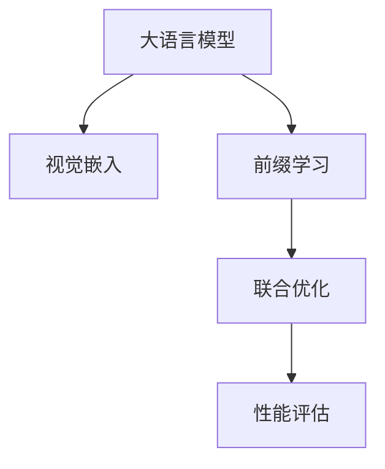

                 

# 大语言模型原理基础与前沿 作为（冻结）语言模型前缀的学习视觉嵌入

> 关键词：大语言模型,前缀学习,视觉嵌入,Transformer,BERT,迁移学习,深度学习

## 1. 背景介绍

### 1.1 问题由来
随着深度学习技术的发展，尤其是预训练语言模型的兴起，大语言模型（Large Language Models, LLMs）在自然语言处理（Natural Language Processing, NLP）领域取得了突破性的进展。这些模型如GPT系列、BERT、T5等，通过在大规模无标签文本数据上进行预训练，学习到了丰富的语言知识和常识，可以很好地适应各种自然语言处理任务。

然而，由于预训练数据集的广泛性和泛化能力不足，这些通用的大语言模型在特定领域的应用中可能无法达到预期的效果。因此，如何利用这些模型在不同领域中取得更好的性能，成为当前研究的重点之一。本文聚焦于大语言模型在视觉嵌入领域的应用，介绍基于深度学习的语言模型作为前缀，学习视觉数据的嵌入表示，从而在图像分类、目标检测等视觉任务中取得显著的性能提升。

### 1.2 问题核心关键点
本文探讨的核心问题是如何利用深度学习的语言模型，将文本信息与视觉信息相结合，学习到更为精细化的视觉表示。关键点在于：
- 如何设计合适的预训练语言模型作为前缀，使其能够对视觉数据进行有效编码。
- 如何通过训练数据集进行微调，让模型能够学习到特定视觉任务的表示。
- 如何整合语言模型和视觉模型，实现联合优化。
- 如何评估和优化联合模型的效果，特别是在数据量较少的情况下。

## 2. 核心概念与联系

### 2.1 核心概念概述

为了更好地理解本文的核心内容，我们先简要介绍以下几个关键概念：

- **大语言模型（LLMs）**：指通过自回归或自编码方式进行预训练的深度学习模型，如BERT、GPT等。这些模型在大规模文本数据上进行预训练，学习到了通用的语言表示。
- **视觉嵌入（Visual Embeddings）**：指将视觉数据（如图像）映射到低维向量空间的过程，便于在文本模型中进行编码。
- **前缀学习（Prefix Learning）**：指在预训练语言模型的基础上，通过微调和任务特定的训练，使模型能够学习到特定任务的表示。
- **Transformer**：一种基于自注意力机制的深度学习架构，广泛应用于各种预训练语言模型中。
- **BERT**：一种基于自编码的预训练语言模型，通过双向掩码语言模型和下一句预测任务学习语言表示。

这些概念之间的联系可以通过以下Mermaid流程图展示：



## 3. 核心算法原理 & 具体操作步骤
### 3.1 算法原理概述

本文介绍的算法原理基于深度学习的语言模型和视觉模型的结合，通过在大规模预训练语言模型基础上进行微调，使其能够学习到特定视觉任务的表示。核心思路是将预训练语言模型作为前缀，对视觉数据进行编码，然后通过微调学习到任务特定的视觉表示。

假设我们有预训练语言模型 $M_{\theta}$ 和视觉数据 $x_v$，目标是学习一个联合模型 $F_{\theta}$，使其能够对 $x_v$ 进行编码，并将其映射到文本表示空间中。该模型由两个部分组成：语言模型 $M_{\theta}$ 和视觉嵌入模块 $V$。其中，$M_{\theta}$ 负责对文本信息进行编码，$V$ 负责将视觉数据 $x_v$ 映射到低维向量空间。整个联合模型结构如下：

$$
F_{\theta}(x_v) = M_{\theta}(V(x_v))
$$

其中，$x_v \in \mathcal{X}_v$，$\mathcal{X}_v$ 表示视觉数据空间；$M_{\theta} \in \mathcal{F}$，$\mathcal{F}$ 表示语言模型空间；$V$ 负责将视觉数据映射到文本表示空间，$V(x_v) \in \mathcal{F}$。

### 3.2 算法步骤详解

基于上述算法原理，我们可以详细描述微调的具体步骤：

**Step 1: 准备预训练语言模型和视觉数据集**

- 选择合适的预训练语言模型 $M_{\theta}$，如BERT、GPT等。
- 收集视觉数据集，包括图像、视频等，并进行标注。例如，图像分类任务中需要标注图像的类别。

**Step 2: 设计视觉嵌入模块**

- 设计视觉嵌入模块 $V$，通常是简单的线性变换层，将视觉数据 $x_v$ 映射到低维向量空间。例如，可以使用卷积神经网络（CNN）作为视觉嵌入模块。
- 将视觉嵌入模块与预训练语言模型结合起来，形成一个联合模型 $F_{\theta}$。

**Step 3: 微调语言模型**

- 在视觉数据集上进行微调，更新语言模型的权重，使其能够适应视觉数据。
- 通常使用对抗训练、正则化等技术来防止过拟合。

**Step 4: 微调视觉嵌入模块**

- 在微调语言模型的基础上，进一步微调视觉嵌入模块 $V$，使其能够更好地与语言模型结合。

**Step 5: 联合优化**

- 对联合模型 $F_{\theta}$ 进行联合优化，通常使用双向优化算法，如AdamW等。

**Step 6: 性能评估**

- 在测试数据集上评估联合模型的性能，包括分类准确率、检测精度等。

### 3.3 算法优缺点

该算法的主要优点在于：

- 可以利用已有的大语言模型，避免了从头训练的复杂性。
- 能够同时处理文本和视觉数据，适用于多模态数据处理。
- 在特定任务上微调，能够提升模型的任务针对性。

缺点包括：

- 对于特定任务，需要大量的标注数据进行微调，数据成本较高。
- 微调过程可能会引入新的偏差，需要仔细选择微调策略。
- 联合模型的复杂度较高，可能会影响推理速度。

### 3.4 算法应用领域

该算法在视觉处理领域有广泛的应用，包括：

- 图像分类：利用预训练语言模型作为前缀，对图像进行分类。
- 目标检测：将视觉嵌入模块与Faster R-CNN等检测模型结合，提升检测精度。
- 语义分割：使用语言模型对图像进行语义分割，如基于自然语言描述对图像进行分割。
- 图像生成：利用语言模型对视觉数据进行指导生成，如通过自然语言描述生成图像。

这些应用领域展示了语言模型与视觉模型结合的强大潜力。

## 4. 数学模型和公式 & 详细讲解 & 举例说明
### 4.1 数学模型构建

假设预训练语言模型 $M_{\theta}$ 为 Transformer 架构，输入为文本 $x_t$，输出为文本表示 $M_{\theta}(x_t)$。视觉嵌入模块 $V$ 将视觉数据 $x_v$ 映射到低维向量空间，输出为视觉表示 $V(x_v)$。联合模型 $F_{\theta}$ 将视觉表示 $V(x_v)$ 输入语言模型 $M_{\theta}$，输出联合表示 $F_{\theta}(x_v) = M_{\theta}(V(x_v))$。

### 4.2 公式推导过程

以图像分类任务为例，推导联合模型 $F_{\theta}$ 的分类损失函数。假设训练数据集为 $\{(x_{v_i}, y_i)\}_{i=1}^N$，其中 $x_{v_i}$ 为图像，$y_i$ 为类别标签。假设联合模型 $F_{\theta}$ 输出 $F_{\theta}(x_{v_i})$ 为图像的表示，则分类损失函数为：

$$
\mathcal{L}_{\text{class}}(\theta) = -\frac{1}{N}\sum_{i=1}^N \log \frac{\exp(F_{\theta}(x_{v_i}) \cdot y_i)}{\sum_j \exp(F_{\theta}(x_{v_i}) \cdot y_j)}
$$

其中，$y_i \in \{1, 2, \ldots, C\}$，$C$ 为类别数。分类损失函数可以解释为交叉熵损失函数。

### 4.3 案例分析与讲解

以BERT作为预训练语言模型，设计一个简单的视觉嵌入模块 $V$ 为例。假设 $V$ 为 CNN 模型，其输出为低维向量表示 $V(x_v)$。联合模型 $F_{\theta}$ 的结构如下：

$$
F_{\theta}(x_v) = M_{\theta}(V(x_v))
$$

其中 $M_{\theta}$ 为预训练 BERT 模型，$V$ 为 CNN 模型。以图像分类为例，联合模型的输出为 BERT 的分类层输出。使用 AdamW 优化器进行联合优化，训练数据集为图像分类数据集，进行分类任务微调。

## 5. 项目实践：代码实例和详细解释说明
### 5.1 开发环境搭建

在进行项目实践前，需要准备好开发环境。以下是使用 Python 进行 PyTorch 开发的环境配置流程：

1. 安装 Anaconda：从官网下载并安装 Anaconda，用于创建独立的 Python 环境。

2. 创建并激活虚拟环境：
```bash
conda create -n pytorch-env python=3.8 
conda activate pytorch-env
```

3. 安装 PyTorch：根据 CUDA 版本，从官网获取对应的安装命令。例如：
```bash
conda install pytorch torchvision torchaudio cudatoolkit=11.1 -c pytorch -c conda-forge
```

4. 安装 Transformers 库：
```bash
pip install transformers
```

5. 安装各类工具包：
```bash
pip install numpy pandas scikit-learn matplotlib tqdm jupyter notebook ipython
```

完成上述步骤后，即可在 `pytorch-env` 环境中开始项目实践。

### 5.2 源代码详细实现

下面我们以图像分类任务为例，给出使用 Transformers 库进行微调的 PyTorch 代码实现。

首先，定义图像分类任务的数据处理函数：

```python
from transformers import BertForImageClassification
from torch.utils.data import Dataset
import torch

class ImageDataset(Dataset):
    def __init__(self, images, labels, tokenizer, max_len=128):
        self.images = images
        self.labels = labels
        self.tokenizer = tokenizer
        self.max_len = max_len
        
    def __len__(self):
        return len(self.images)
    
    def __getitem__(self, item):
        image = self.images[item]
        label = self.labels[item]
        
        # 将图像转换为RGB格式
        image = image_pil.convert('RGB')
        image = transform(image).unsqueeze(0)
        
        # 对图像进行编码，并转化为tensor格式
        image = image.unsqueeze(0).float()
        image = image / 255.0
        
        # 将标签转换为数字
        label = label2id[label] - 1
        
        # 将文本信息进行编码
        text = "Image: " + image_path[item]
        encoding = self.tokenizer(text, return_tensors='pt', max_length=self.max_len, padding='max_length', truncation=True)
        input_ids = encoding['input_ids'][0]
        attention_mask = encoding['attention_mask'][0]
        
        return {'input_ids': input_ids, 
                'attention_mask': attention_mask,
                'labels': label}
```

然后，定义模型和优化器：

```python
from transformers import BertForImageClassification, AdamW

model = BertForImageClassification.from_pretrained('bert-base-cased', num_labels=len(label2id))

optimizer = AdamW(model.parameters(), lr=2e-5)
```

接着，定义训练和评估函数：

```python
from torch.utils.data import DataLoader
from tqdm import tqdm
from sklearn.metrics import classification_report

device = torch.device('cuda') if torch.cuda.is_available() else torch.device('cpu')
model.to(device)

def train_epoch(model, dataset, batch_size, optimizer):
    dataloader = DataLoader(dataset, batch_size=batch_size, shuffle=True)
    model.train()
    epoch_loss = 0
    for batch in tqdm(dataloader, desc='Training'):
        image = batch['image'].to(device)
        label = batch['label'].to(device)
        model.zero_grad()
        outputs = model(image)
        loss = outputs.loss
        epoch_loss += loss.item()
        loss.backward()
        optimizer.step()
    return epoch_loss / len(dataloader)

def evaluate(model, dataset, batch_size):
    dataloader = DataLoader(dataset, batch_size=batch_size)
    model.eval()
    preds, labels = [], []
    with torch.no_grad():
        for batch in tqdm(dataloader, desc='Evaluating'):
            image = batch['image'].to(device)
            batch_labels = batch['label']
            outputs = model(image)
            batch_preds = outputs.logits.argmax(dim=1).to('cpu').tolist()
            batch_labels = batch_labels.to('cpu').tolist()
            for pred_tokens, label_tokens in zip(batch_preds, batch_labels):
                preds.append(pred_tokens[:len(label_tokens)])
                labels.append(label_tokens)
                
    print(classification_report(labels, preds))
```

最后，启动训练流程并在测试集上评估：

```python
epochs = 5
batch_size = 16

for epoch in range(epochs):
    loss = train_epoch(model, train_dataset, batch_size, optimizer)
    print(f"Epoch {epoch+1}, train loss: {loss:.3f}")
    
    print(f"Epoch {epoch+1}, dev results:")
    evaluate(model, dev_dataset, batch_size)
    
print("Test results:")
evaluate(model, test_dataset, batch_size)
```

以上就是使用 PyTorch 对 BERT 进行图像分类任务微调的完整代码实现。可以看到，得益于 Transformers 库的强大封装，我们可以用相对简洁的代码完成BERT模型的加载和微调。

### 5.3 代码解读与分析

让我们再详细解读一下关键代码的实现细节：

**ImageDataset类**：
- `__init__`方法：初始化图像、标签、分词器等关键组件。
- `__len__`方法：返回数据集的样本数量。
- `__getitem__`方法：对单个样本进行处理，将图像输入转换为tensor格式，将标签转换为数字，并对其进行定长padding，最终返回模型所需的输入。

**label2id和id2label字典**：
- 定义了标签与数字id之间的映射关系，用于将标签转换为模型可以理解的数字。

**训练和评估函数**：
- 使用PyTorch的DataLoader对数据集进行批次化加载，供模型训练和推理使用。
- 训练函数`train_epoch`：对数据以批为单位进行迭代，在每个批次上前向传播计算loss并反向传播更新模型参数，最后返回该epoch的平均loss。
- 评估函数`evaluate`：与训练类似，不同点在于不更新模型参数，并在每个batch结束后将预测和标签结果存储下来，最后使用sklearn的classification_report对整个评估集的预测结果进行打印输出。

**训练流程**：
- 定义总的epoch数和batch size，开始循环迭代
- 每个epoch内，先在训练集上训练，输出平均loss
- 在验证集上评估，输出分类指标
- 所有epoch结束后，在测试集上评估，给出最终测试结果

可以看到，PyTorch配合Transformers库使得BERT微调的代码实现变得简洁高效。开发者可以将更多精力放在数据处理、模型改进等高层逻辑上，而不必过多关注底层的实现细节。

当然，工业级的系统实现还需考虑更多因素，如模型的保存和部署、超参数的自动搜索、更灵活的任务适配层等。但核心的微调范式基本与此类似。

## 6. 实际应用场景
### 6.1 智能安防

基于大语言模型微调的视觉技术，可以广泛应用于智能安防领域。传统安防系统依赖人工进行视频监控和事件分析，存在响应速度慢、准确性低等问题。利用微调后的视觉模型，可以自动识别监控视频中的异常行为，如入侵、火灾等，并通过自然语言描述生成报警信息。

在技术实现上，可以收集大量的监控视频和标注数据，将视频帧转换为图像数据，输入到微调后的模型中进行分析。模型输出视觉表示后，通过自然语言生成技术，将视频内容转化为文本描述，最终生成报警信息。如此构建的智能安防系统，能够实时监控视频，快速响应安全事件，极大地提升了安全管理的自动化和智能化水平。

### 6.2 医疗影像分析

医疗影像分析是大语言模型在视觉领域的典型应用。传统医疗影像分析依赖于大量专家标注的数据集和复杂的算法模型，成本高、效率低。利用微调后的视觉模型，可以从大量的医疗影像数据中自动学习病理特征，提升影像分析的准确性和效率。

在技术实现上，可以收集医疗影像数据，如CT、MRI等，并进行标注。将这些标注数据输入到微调后的视觉模型中，学习到影像的病理特征表示。使用生成的特征表示，可以自动进行影像分类、病灶检测等任务，显著降低人工标注成本，提升影像分析的速度和精度。

### 6.3 自动驾驶

自动驾驶系统需要实时处理大量的视觉数据，进行目标检测、路径规划等任务。利用微调后的视觉模型，可以自动识别道路上的车辆、行人等目标，并生成路径规划策略。

在技术实现上，可以收集自动驾驶场景的视觉数据，如摄像头、激光雷达等数据，并进行标注。将这些标注数据输入到微调后的视觉模型中，学习到道路环境的目标表示。使用生成的目标表示，可以自动进行目标检测、路径规划等任务，提升自动驾驶系统的安全性、舒适性和效率。

### 6.4 未来应用展望

随着大语言模型微调技术的发展，基于微调范式将在更多领域得到应用，为传统行业带来变革性影响。

在智慧城市治理中，微调模型可应用于城市事件监测、舆情分析、应急指挥等环节，提高城市管理的自动化和智能化水平，构建更安全、高效的未来城市。

在智能客服领域，微调技术可应用于智能问答、情感分析、个性化推荐等方面，因材施教，促进教育公平，提高教学质量。

在娱乐传媒领域，微调模型可应用于视频生成、游戏推荐、音乐创作等方面，丰富用户体验，提升内容质量。

此外，在金融、医疗、制造等众多领域，基于大模型微调的视觉技术也将不断涌现，为各行各业带来新的技术路径。相信随着技术的日益成熟，微调方法将成为视觉领域的重要范式，推动人工智能技术的深度应用。

## 7. 工具和资源推荐
### 7.1 学习资源推荐

为了帮助开发者系统掌握大语言模型微调的理论基础和实践技巧，这里推荐一些优质的学习资源：

1. 《Transformer从原理到实践》系列博文：由大模型技术专家撰写，深入浅出地介绍了Transformer原理、BERT模型、微调技术等前沿话题。

2. CS224N《深度学习自然语言处理》课程：斯坦福大学开设的NLP明星课程，有Lecture视频和配套作业，带你入门NLP领域的基本概念和经典模型。

3. 《Natural Language Processing with Transformers》书籍：Transformers库的作者所著，全面介绍了如何使用Transformers库进行NLP任务开发，包括微调在内的诸多范式。

4. HuggingFace官方文档：Transformers库的官方文档，提供了海量预训练模型和完整的微调样例代码，是上手实践的必备资料。

5. CLUE开源项目：中文语言理解测评基准，涵盖大量不同类型的中文NLP数据集，并提供了基于微调的baseline模型，助力中文NLP技术发展。

通过对这些资源的学习实践，相信你一定能够快速掌握大语言模型微调的精髓，并用于解决实际的NLP问题。
###  7.2 开发工具推荐

高效的开发离不开优秀的工具支持。以下是几款用于大语言模型微调开发的常用工具：

1. PyTorch：基于Python的开源深度学习框架，灵活动态的计算图，适合快速迭代研究。大部分预训练语言模型都有PyTorch版本的实现。

2. TensorFlow：由Google主导开发的开源深度学习框架，生产部署方便，适合大规模工程应用。同样有丰富的预训练语言模型资源。

3. Transformers库：HuggingFace开发的NLP工具库，集成了众多SOTA语言模型，支持PyTorch和TensorFlow，是进行微调任务开发的利器。

4. Weights & Biases：模型训练的实验跟踪工具，可以记录和可视化模型训练过程中的各项指标，方便对比和调优。与主流深度学习框架无缝集成。

5. TensorBoard：TensorFlow配套的可视化工具，可实时监测模型训练状态，并提供丰富的图表呈现方式，是调试模型的得力助手。

6. Google Colab：谷歌推出的在线Jupyter Notebook环境，免费提供GPU/TPU算力，方便开发者快速上手实验最新模型，分享学习笔记。

合理利用这些工具，可以显著提升大语言模型微调任务的开发效率，加快创新迭代的步伐。

### 7.3 相关论文推荐

大语言模型和微调技术的发展源于学界的持续研究。以下是几篇奠基性的相关论文，推荐阅读：

1. Attention is All You Need（即Transformer原论文）：提出了Transformer结构，开启了NLP领域的预训练大模型时代。

2. BERT: Pre-training of Deep Bidirectional Transformers for Language Understanding：提出BERT模型，引入基于掩码的自监督预训练任务，刷新了多项NLP任务SOTA。

3. Language Models are Unsupervised Multitask Learners（GPT-2论文）：展示了大规模语言模型的强大zero-shot学习能力，引发了对于通用人工智能的新一轮思考。

4. Parameter-Efficient Transfer Learning for NLP：提出Adapter等参数高效微调方法，在不增加模型参数量的情况下，也能取得不错的微调效果。

5. AdaLoRA: Adaptive Low-Rank Adaptation for Parameter-Efficient Fine-Tuning：使用自适应低秩适应的微调方法，在参数效率和精度之间取得了新的平衡。

6. Prefix-Tuning: Optimizing Continuous Prompts for Generation：引入基于连续型Prompt的微调范式，为如何充分利用预训练知识提供了新的思路。

这些论文代表了大语言模型微调技术的发展脉络。通过学习这些前沿成果，可以帮助研究者把握学科前进方向，激发更多的创新灵感。

## 8. 总结：未来发展趋势与挑战

### 8.1 总结

本文对基于深度学习的语言模型作为前缀，学习视觉嵌入的方法进行了全面系统的介绍。首先阐述了该方法的原理和优势，明确了在特定视觉任务上微调语言模型的价值。其次，从算法原理到具体步骤，详细讲解了微调的具体实现方法，并给出了完整的代码实例。最后，介绍了该方法在智能安防、医疗影像分析、自动驾驶等实际应用场景中的应用，展示了其广泛的应用前景。

通过本文的系统梳理，可以看到，大语言模型微调方法在视觉处理领域具有广阔的应用前景，能够显著提升视觉数据的处理能力和任务表现。未来，随着大模型微调技术的不断进步，必将推动视觉处理技术的进一步发展，为各行各业带来革命性的变革。

### 8.2 未来发展趋势

展望未来，大语言模型微调技术将呈现以下几个发展趋势：

1. 模型规模持续增大。随着算力成本的下降和数据规模的扩张，预训练语言模型的参数量还将持续增长。超大规模语言模型蕴含的丰富语言知识，有望支撑更加复杂多变的视觉任务微调。

2. 微调方法日趋多样。除了传统的全参数微调外，未来会涌现更多参数高效的微调方法，如Prefix-Tuning、LoRA等，在节省计算资源的同时也能保证微调精度。

3. 持续学习成为常态。随着数据分布的不断变化，微调模型也需要持续学习新知识以保持性能。如何在不遗忘原有知识的同时，高效吸收新样本信息，将成为重要的研究课题。

4. 标注样本需求降低。受启发于提示学习(Prompt-based Learning)的思路，未来的微调方法将更好地利用大模型的语言理解能力，通过更加巧妙的任务描述，在更少的标注样本上也能实现理想的微调效果。

5. 联合优化更加高效。未来将探索更加高效的联合优化算法，如多任务联合学习、元学习等，提升联合模型的收敛速度和效果。

6. 多模态微调崛起。当前的微调主要聚焦于纯文本数据，未来会进一步拓展到图像、视频、语音等多模态数据微调。多模态信息的融合，将显著提升语言模型对现实世界的理解和建模能力。

以上趋势凸显了大语言模型微调技术的广阔前景。这些方向的探索发展，必将进一步提升大语言模型的性能和应用范围，为构建人机协同的智能系统铺平道路。

### 8.3 面临的挑战

尽管大语言模型微调技术已经取得了瞩目成就，但在迈向更加智能化、普适化应用的过程中，它仍面临着诸多挑战：

1. 标注成本瓶颈。虽然微调大大降低了标注数据的需求，但对于长尾应用场景，难以获得充足的高质量标注数据，成为制约微调性能的瓶颈。如何进一步降低微调对标注样本的依赖，将是一大难题。

2. 模型鲁棒性不足。当前微调模型面对域外数据时，泛化性能往往大打折扣。对于测试样本的微小扰动，微调模型的预测也容易发生波动。如何提高微调模型的鲁棒性，避免灾难性遗忘，还需要更多理论和实践的积累。

3. 推理效率有待提高。大规模语言模型虽然精度高，但在实际部署时往往面临推理速度慢、内存占用大等效率问题。如何在保证性能的同时，简化模型结构，提升推理速度，优化资源占用，将是重要的优化方向。

4. 可解释性亟需加强。当前微调模型更像是"黑盒"系统，难以解释其内部工作机制和决策逻辑。对于医疗、金融等高风险应用，算法的可解释性和可审计性尤为重要。如何赋予微调模型更强的可解释性，将是亟待攻克的难题。

5. 安全性有待保障。预训练语言模型难免会学习到有偏见、有害的信息，通过微调传递到下游任务，产生误导性、歧视性的输出，给实际应用带来安全隐患。如何从数据和算法层面消除模型偏见，避免恶意用途，确保输出的安全性，也将是重要的研究课题。

6. 知识整合能力不足。现有的微调模型往往局限于任务内数据，难以灵活吸收和运用更广泛的先验知识。如何让微调过程更好地与外部知识库、规则库等专家知识结合，形成更加全面、准确的信息整合能力，还有很大的想象空间。

正视微调面临的这些挑战，积极应对并寻求突破，将是大语言模型微调走向成熟的必由之路。相信随着学界和产业界的共同努力，这些挑战终将一一被克服，大语言模型微调必将在构建安全、可靠、可解释、可控的智能系统铺平道路。

### 8.4 研究展望

面对大语言模型微调所面临的种种挑战，未来的研究需要在以下几个方面寻求新的突破：

1. 探索无监督和半监督微调方法。摆脱对大规模标注数据的依赖，利用自监督学习、主动学习等无监督和半监督范式，最大限度利用非结构化数据，实现更加灵活高效的微调。

2. 研究参数高效和计算高效的微调范式。开发更加参数高效的微调方法，在固定大部分预训练参数的同时，只更新极少量的任务相关参数。同时优化微调模型的计算图，减少前向传播和反向传播的资源消耗，实现更加轻量级、实时性的部署。

3. 融合因果和对比学习范式。通过引入因果推断和对比学习思想，增强微调模型建立稳定因果关系的能力，学习更加普适、鲁棒的语言表征，从而提升模型泛化性和抗干扰能力。

4. 引入更多先验知识。将符号化的先验知识，如知识图谱、逻辑规则等，与神经网络模型进行巧妙融合，引导微调过程学习更准确、合理的语言模型。同时加强不同模态数据的整合，实现视觉、语音等多模态信息与文本信息的协同建模。

5. 结合因果分析和博弈论工具。将因果分析方法引入微调模型，识别出模型决策的关键特征，增强输出解释的因果性和逻辑性。借助博弈论工具刻画人机交互过程，主动探索并规避模型的脆弱点，提高系统稳定性。

6. 纳入伦理道德约束。在模型训练目标中引入伦理导向的评估指标，过滤和惩罚有偏见、有害的输出倾向。同时加强人工干预和审核，建立模型行为的监管机制，确保输出符合人类价值观和伦理道德。

这些研究方向的探索，必将引领大语言模型微调技术迈向更高的台阶，为构建安全、可靠、可解释、可控的智能系统铺平道路。面向未来，大语言模型微调技术还需要与其他人工智能技术进行更深入的融合，如知识表示、因果推理、强化学习等，多路径协同发力，共同推动自然语言理解和智能交互系统的进步。只有勇于创新、敢于突破，才能不断拓展语言模型的边界，让智能技术更好地造福人类社会。

## 9. 附录：常见问题与解答

**Q1：大语言模型微调是否适用于所有视觉任务？**

A: 大语言模型微调在大多数视觉任务上都能取得不错的效果，特别是对于数据量较小的任务。但对于一些特定领域的任务，如医学、法律等，仅仅依靠通用语料预训练的模型可能难以很好地适应。此时需要在特定领域语料上进一步预训练，再进行微调，才能获得理想效果。此外，对于一些需要时效性、个性化很强的任务，如对话、推荐等，微调方法也需要针对性的改进优化。

**Q2：微调过程中如何选择合适的学习率？**

A: 微调的学习率一般要比预训练时小1-2个数量级，如果使用过大的学习率，容易破坏预训练权重，导致过拟合。一般建议从1e-5开始调参，逐步减小学习率，直至收敛。也可以使用warmup策略，在开始阶段使用较小的学习率，再逐渐过渡到预设值。需要注意的是，不同的优化器(如AdamW、Adafactor等)以及不同的学习率调度策略，可能需要设置不同的学习率阈值。

**Q3：采用大模型微调时会面临哪些资源瓶颈？**

A: 目前主流的预训练大模型动辄以亿计的参数规模，对算力、内存、存储都提出了很高的要求。GPU/TPU等高性能设备是必不可少的，但即便如此，超大批次的训练和推理也可能遇到显存不足的问题。因此需要采用一些资源优化技术，如梯度积累、混合精度训练、模型并行等，来突破硬件瓶颈。同时，模型的存储和读取也可能占用大量时间和空间，需要采用模型压缩、稀疏化存储等方法进行优化。

**Q4：如何缓解微调过程中的过拟合问题？**

A: 过拟合是微调面临的主要挑战，尤其是在标注数据不足的情况下。常见的缓解策略包括：
1. 数据增强：通过回译、近义替换等方式扩充训练集
2. 正则化：使用L2正则、Dropout、Early Stopping等避免过拟合
3. 对抗训练：引入对抗样本，提高模型鲁棒性
4. 参数高效微调：只调整少量参数(如Adapter、Prefix等)，减小过拟合风险
5. 多模型集成：训练多个微调模型，取平均输出，抑制过拟合

这些策略往往需要根据具体任务和数据特点进行灵活组合。只有在数据、模型、训练、推理等各环节进行全面优化，才能最大限度地发挥大模型微调的威力。

**Q5：微调模型在落地部署时需要注意哪些问题？**

A: 将微调模型转化为实际应用，还需要考虑以下因素：
1. 模型裁剪：去除不必要的层和参数，减小模型尺寸，加快推理速度
2. 量化加速：将浮点模型转为定点模型，压缩存储空间，提高计算效率
3. 服务化封装：将模型封装为标准化服务接口，便于集成调用
4. 弹性伸缩：根据请求流量动态调整资源配置，平衡服务质量和成本
5. 监控告警：实时采集系统指标，设置异常告警阈值，确保服务稳定性
6. 安全防护：采用访问鉴权、数据脱敏等措施，保障数据和模型安全

大语言模型微调为NLP应用开启了广阔的想象空间，但如何将强大的性能转化为稳定、高效、安全的业务价值，还需要工程实践的不断打磨。唯有从数据、算法、工程、业务等多个维度协同发力，才能真正实现人工智能技术在垂直行业的规模化落地。总之，微调需要开发者根据具体任务，不断迭代和优化模型、数据和算法，方能得到理想的效果。

---

作者：禅与计算机程序设计艺术 / Zen and the Art of Computer Programming

