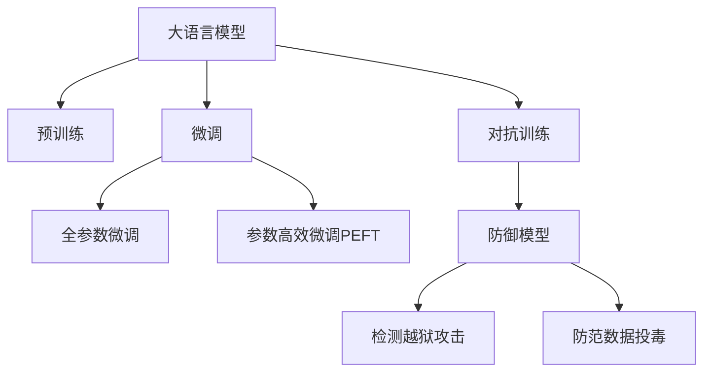

                 

## 1. 背景介绍

### 1.1 问题由来

随着人工智能技术的发展，大语言模型（Large Language Models, LLMs）在自然语言处理（NLP）领域取得了显著的进步。这些模型通过在大规模无标签文本数据上进行预训练，学习到了丰富的语言知识和常识，展现出卓越的自然语言理解与生成能力。然而，这种强大的能力同时也带来了新的挑战，尤其是在数据安全领域。

### 1.2 问题核心关键点

大语言模型的广泛应用在带来便利的同时，也引发了一系列安全问题。其中，越狱攻击和数据投毒（data poisoning）是大模型安全面临的两个重要挑战。

- **越狱攻击**：攻击者通过恶意操作，使得预训练模型能够突破安全限制，执行非法操作，如生成恶意代码、控制计算机系统等。
- **数据投毒**：攻击者故意向训练数据集中注入噪声或恶意数据，以误导模型学习，导致模型性能下降甚至失效。

### 1.3 问题研究意义

理解和应对这些安全威胁对于大语言模型的实际应用至关重要。防范越狱攻击和数据投毒，不仅可以保护用户数据安全，还可以提升模型的信任度和可靠性，推动人工智能技术的健康发展。

## 2. 核心概念与联系

### 2.1 核心概念概述

为全面理解越狱攻击和数据投毒问题，本节将介绍几个关键概念及其相互联系：

- **大语言模型（LLMs）**：一种通过大规模无标签数据预训练得到的，具备强大语言生成和理解能力的神经网络模型。
- **预训练**：在大规模无标签数据上进行的自监督学习过程，使模型学习到通用的语言表示。
- **微调（Fine-tuning）**：在预训练模型的基础上，使用有标签数据对其进行特定任务的优化。
- **越狱攻击**：攻击者通过各种手段，使得模型执行非法操作，如生成恶意代码、控制计算机系统等。
- **数据投毒**：攻击者向训练数据集中注入噪声或恶意数据，误导模型学习，导致性能下降或失效。
- **对抗训练**：通过在训练数据中引入对抗样本，提升模型对攻击的鲁棒性。
- **防御模型**：用于检测和防范越狱攻击和数据投毒的模型。

这些概念之间的逻辑关系可以通过以下Mermaid流程图来展示：



这个流程图展示了大语言模型从预训练到微调，再到对抗训练和防御模型的逻辑关系。

## 3. 核心算法原理 & 具体操作步骤
### 3.1 算法原理概述

大语言模型的越狱攻击和数据投毒问题，本质上是由模型参数的不稳定性导致的。攻击者通过精心设计的输入数据，试图改变模型行为，从而实现越狱攻击或数据投毒。

为应对这些安全威胁，主流的方法包括对抗训练、防御模型构建等。

- **对抗训练**：通过在训练数据中引入对抗样本，提升模型的鲁棒性，使其在面对恶意输入时仍能保持稳定。
- **防御模型**：通过构建专门用于检测和防范攻击的模型，及时发现并拦截恶意行为。

### 3.2 算法步骤详解

#### 3.2.1 对抗训练步骤

1. **数据准备**：准备一组训练数据，其中包含正常样本和对抗样本。对抗样本可以通过对正常样本进行微小扰动生成。
2. **模型训练**：在训练过程中，将对抗样本和正常样本交替输入模型，以增强模型的鲁棒性。
3. **模型评估**：在测试集上评估模型性能，确保对抗样本仍能被正确分类。

#### 3.2.2 防御模型构建步骤

1. **威胁建模**：分析可能的攻击类型和攻击方式，确定需要防范的威胁场景。
2. **模型设计**：设计专用的检测模型，如异常检测器、恶意行为识别器等。
3. **模型训练**：使用标注过的数据训练检测模型，使其能够识别并拦截攻击行为。
4. **模型部署**：将训练好的模型集成到系统架构中，实时监测并拦截恶意行为。

### 3.3 算法优缺点

**对抗训练的优点**：
1. **提升鲁棒性**：通过对抗样本的训练，模型对攻击的鲁棒性显著提高，能够有效抵御恶意输入。
2. **广泛适用**：对抗训练方法可以应用于多种模型，包括大语言模型、卷积神经网络等。

**对抗训练的缺点**：
1. **计算成本高**：对抗训练需要生成和标注大量对抗样本，计算成本较高。
2. **模型复杂性增加**：对抗训练引入的对抗样本处理增加了模型的复杂性，可能影响模型性能。

**防御模型的优点**：
1. **实时防护**：防御模型能够实时监测和拦截恶意行为，保护系统免受攻击。
2. **适用于多种攻击场景**：防御模型可以针对不同攻击类型进行设计，具有广泛的适用性。

**防御模型的缺点**：
1. **误报率高**：防御模型可能误报正常行为为攻击，影响用户体验。
2. **易受攻击**：防御模型本身也可能被攻击，导致防护失效。

### 3.4 算法应用领域

对抗训练和防御模型在大语言模型的应用中具有广泛的应用前景，以下是几个典型的应用场景：

- **自然语言处理（NLP）**：在生成对抗样本的基础上，对语言模型进行对抗训练，提升其在恶意文本生成和攻击检测中的应用。
- **计算机视觉（CV）**：通过对抗样本生成，增强图像分类模型的鲁棒性，防御图像攻击。
- **网络安全**：构建防御模型，实时检测和拦截网络中的恶意行为，如DDoS攻击、恶意软件传播等。
- **自动驾驶**：在自动驾驶场景中，通过对抗训练提升模型的鲁棒性，防范攻击行为，保障行车安全。
- **智能家居**：构建防御模型，实时监测和防范家居设备中的恶意行为，保护用户隐私。

## 4. 数学模型和公式 & 详细讲解  
### 4.1 数学模型构建

为了深入理解大语言模型的安全问题，本节将介绍相关数学模型及其构建方法。

设大语言模型为 $M_{\theta}$，其中 $\theta$ 为模型参数。假设攻击者试图通过对抗样本 $x_{adv}$ 使得模型输出 $M_{\theta}(x_{adv})$ 偏离正常输出 $M_{\theta}(x_{norm})$。攻击者可以通过以下步骤实现这一目标：

1. **生成对抗样本**：通过微小扰动，生成对抗样本 $x_{adv} = x_{norm} + \delta$，其中 $\delta$ 是扰动向量。
2. **模型预测**：输入对抗样本到模型，计算预测输出 $M_{\theta}(x_{adv})$。
3. **对抗损失函数**：定义对抗损失函数 $L(x_{adv}) = f(M_{\theta}(x_{adv})) - f(M_{\theta}(x_{norm}))$，其中 $f$ 为衡量预测输出与正常输出的距离的函数。

### 4.2 公式推导过程

对抗损失函数的形式可以根据具体任务进行调整，以下是一些常见的对抗损失函数：

1. **对抗性分类损失**：对于分类任务，可以使用交叉熵损失函数，计算攻击前后的分类误差：
   $$
   L_{adv} = -\log \frac{M_{\theta}(x_{adv})}{\sum_{i} M_{\theta}(x_i)}
   $$

2. **对抗性回归损失**：对于回归任务，可以使用均方误差损失函数，计算攻击前后的回归误差：
   $$
   L_{adv} = (M_{\theta}(x_{adv}) - y_{norm})^2
   $$

3. **对抗性生成损失**：对于生成任务，可以使用生成对抗网络（GAN）框架，计算生成样本与真实样本的距离：
   $$
   L_{adv} = -\log D(M_{\theta}(x_{adv}))
   $$

### 4.3 案例分析与讲解

以对抗性分类损失为例，我们可以对这一损失函数进行详细分析：

假设有一组正常样本 $(x_1, y_1), (x_2, y_2), \ldots, (x_n, y_n)$，其中 $y_i \in \{0, 1\}$ 为二分类标签。攻击者试图通过对抗样本 $x_{adv} = x_{norm} + \delta$ 使得模型输出 $M_{\theta}(x_{adv})$ 偏离正常输出 $M_{\theta}(x_{norm})$。

具体而言，对抗样本生成过程如下：
1. **扰动生成**：通过微小扰动 $\delta$，生成对抗样本 $x_{adv} = x_{norm} + \delta$。
2. **模型预测**：输入对抗样本到模型，计算预测输出 $M_{\theta}(x_{adv})$。
3. **对抗损失计算**：计算预测输出与正常输出之间的距离，得到对抗损失 $L_{adv}$。

以下是一个简化的对抗样本生成和对抗损失计算的代码示例：

```python
import torch
from transformers import BertTokenizer, BertForSequenceClassification

# 假设模型已经加载，tokenizer已经定义
tokenizer = BertTokenizer.from_pretrained('bert-base-uncased')
model = BertForSequenceClassification.from_pretrained('bert-base-uncased', num_labels=2)

# 生成对抗样本
def generate_adv_sample(text, delta):
    input_ids = tokenizer(text, return_tensors='pt').input_ids
    attention_mask = tokenizer(text, return_tensors='pt').attention_mask
    adv_input_ids = input_ids + delta
    adv_attention_mask = attention_mask + delta
    return adv_input_ids, adv_attention_mask

# 计算对抗损失
def calc_adv_loss(text, y, delta):
    adv_input_ids, adv_attention_mask = generate_adv_sample(text, delta)
    logits = model(adv_input_ids, attention_mask=adv_attention_mask)
    adv_loss = -torch.log(logits[0][y] / (1 - logits[0][y]))
    return adv_loss

# 示例
text = "I like this movie"
y = 1
delta = 0.001
adv_loss = calc_adv_loss(text, y, delta)
print(adv_loss)
```

通过上述代码示例，可以观察到对抗样本生成和对抗损失计算的过程。

## 5. 项目实践：代码实例和详细解释说明
### 5.1 开发环境搭建

在进行大语言模型安全问题的项目实践前，我们需要准备好开发环境。以下是使用Python进行PyTorch开发的环境配置流程：

1. 安装Anaconda：从官网下载并安装Anaconda，用于创建独立的Python环境。

2. 创建并激活虚拟环境：
```bash
conda create -n pytorch-env python=3.8 
conda activate pytorch-env
```

3. 安装PyTorch：根据CUDA版本，从官网获取对应的安装命令。例如：
```bash
conda install pytorch torchvision torchaudio cudatoolkit=11.1 -c pytorch -c conda-forge
```

4. 安装TensorFlow：
```bash
pip install tensorflow
```

5. 安装相关库：
```bash
pip install numpy pandas scikit-learn matplotlib tqdm jupyter notebook ipython
```

完成上述步骤后，即可在`pytorch-env`环境中开始项目实践。

### 5.2 源代码详细实现

下面以对抗样本生成和对抗训练为例，给出使用PyTorch进行大语言模型对抗训练的代码实现。

首先，定义对抗样本生成函数：

```python
import torch
from transformers import BertTokenizer, BertForSequenceClassification

tokenizer = BertTokenizer.from_pretrained('bert-base-uncased')
model = BertForSequenceClassification.from_pretrained('bert-base-uncased', num_labels=2)

def generate_adv_sample(text, delta):
    input_ids = tokenizer(text, return_tensors='pt').input_ids
    attention_mask = tokenizer(text, return_tensors='pt').attention_mask
    adv_input_ids = input_ids + delta
    adv_attention_mask = attention_mask + delta
    return adv_input_ids, adv_attention_mask
```

然后，定义对抗训练函数：

```python
from torch.utils.data import Dataset
import torch

class Dataset(Dataset):
    def __init__(self, texts, labels):
        self.texts = texts
        self.labels = labels
        
    def __len__(self):
        return len(self.texts)
    
    def __getitem__(self, item):
        text = self.texts[item]
        label = self.labels[item]
        input_ids, attention_mask = generate_adv_sample(text, 0.001)
        return {'input_ids': input_ids, 
                'attention_mask': attention_mask,
                'labels': torch.tensor(label, dtype=torch.long)}

# 准备训练集
texts = ['This is a good movie', 'This is a bad movie']
labels = [1, 0]

# 创建数据集
train_dataset = Dataset(texts, labels)
```

接下来，定义对抗训练流程：

```python
from transformers import AdamW

optimizer = AdamW(model.parameters(), lr=2e-5)

for epoch in range(5):
    for batch in train_dataset:
        input_ids = batch['input_ids'].to(device)
        attention_mask = batch['attention_mask'].to(device)
        labels = batch['labels'].to(device)
        model.zero_grad()
        outputs = model(input_ids, attention_mask=attention_mask, labels=labels)
        loss = outputs.loss
        loss.backward()
        optimizer.step()
```

最后，测试训练后的模型：

```python
# 定义测试集
test_texts = ['I like this movie', 'I dislike this movie']
test_labels = [1, 0]

# 创建测试集
test_dataset = Dataset(test_texts, test_labels)

# 评估模型性能
model.eval()
with torch.no_grad():
    test_loss = 0
    for batch in test_dataset:
        input_ids = batch['input_ids'].to(device)
        attention_mask = batch['attention_mask'].to(device)
        batch_labels = batch['labels']
        outputs = model(input_ids, attention_mask=attention_mask)
        test_loss += outputs.loss.item()

    print(f"Test loss: {test_loss/len(test_dataset)}")
```

以上代码展示了如何通过对抗样本生成和对抗训练来增强模型的鲁棒性。通过生成对抗样本，并将其作为训练数据的一部分，可以有效地提高模型对抗恶意输入的能力。

### 5.3 代码解读与分析

让我们再详细解读一下关键代码的实现细节：

**Dataset类**：
- `__init__`方法：初始化文本和标签。
- `__len__`方法：返回数据集长度。
- `__getitem__`方法：对单个样本进行处理，生成对抗样本并返回输入。

**对抗样本生成函数**：
- 使用BertTokenizer生成输入和注意力掩码，并对其微小扰动生成对抗样本。
- 注意在生成对抗样本时，需要同时更新输入和注意力掩码，以确保对抗样本的合理性。

**对抗训练流程**：
- 定义优化器，设置学习率。
- 在每个epoch内，对训练集中的每个样本进行对抗样本生成和对抗训练。
- 计算并累加每个样本的损失，最后计算平均损失。

**测试流程**：
- 定义测试集，使用测试数据进行模型评估。
- 在模型评估过程中，使用`eval`模式，并关闭梯度更新。
- 计算并输出测试损失。

可以看到，PyTorch框架提供了便捷的工具来支持大语言模型的对抗训练。开发者只需关注具体的模型和数据处理逻辑，而无需过多考虑底层实现细节。

## 6. 实际应用场景
### 6.1 智能客服系统

智能客服系统是大语言模型在实际应用中的一个典型场景。在智能客服系统中，大模型需要对用户的自然语言输入进行理解和生成，从而提供个性化的服务。然而，这种系统也面临着越狱攻击和数据投毒的威胁。

攻击者可能通过生成恶意输入或注入噪声数据，试图破坏系统，如篡改响应、传播病毒等。通过对抗训练和防御模型，可以有效防范这些攻击，保障客服系统的安全稳定运行。

### 6.2 金融舆情监测

金融舆情监测系统需要实时监测和分析大量网络数据，以发现潜在的金融风险。然而，这些系统中可能存在恶意输入和噪声数据，导致模型输出错误，影响风险评估结果。

通过对抗训练和防御模型，可以有效防范数据投毒攻击，提高舆情监测的准确性和可靠性。确保金融数据的真实性和安全性，避免由于攻击导致的金融风险。

### 6.3 个性化推荐系统

个性化推荐系统通常通过用户行为数据进行训练，以推荐合适的物品或服务。然而，攻击者可能通过注入恶意数据或噪声，试图误导推荐模型，降低推荐效果。

通过对抗训练和防御模型，可以有效防范数据投毒攻击，提升推荐系统的鲁棒性和准确性，避免恶意数据对推荐结果的影响。

### 6.4 未来应用展望

随着大语言模型的不断进步，其在实际应用中的安全问题也日益突出。未来的研究将从以下几个方向进行：

1. **鲁棒性增强**：通过对抗训练和防御模型，提升大语言模型的鲁棒性和安全性，防范各种恶意攻击。
2. **多模型集成**：构建多模型联合防御系统，提升系统整体的安全性和鲁棒性，防范复杂攻击。
3. **动态防御**：实时监测和分析网络数据，动态调整防御策略，及时防范新的攻击方式。
4. **联邦学习**：通过联邦学习技术，在多方数据不出本地的情况下，进行模型训练和防御，提升系统隐私和安全。
5. **因果推理**：引入因果推理方法，提升攻击检测的准确性，避免误报和漏报。

以上方向的研究将进一步提升大语言模型在实际应用中的安全性，推动人工智能技术的健康发展。

## 7. 工具和资源推荐
### 7.1 学习资源推荐

为了帮助开发者系统掌握大语言模型安全问题的理论基础和实践技巧，这里推荐一些优质的学习资源：

1. **《网络安全与人工智能》系列博文**：由网络安全专家撰写，详细讲解网络安全和大语言模型的融合应用。

2. **斯坦福大学《网络安全》课程**：提供网络安全领域的经典课程和资源，涵盖人工智能在网络安全中的应用。

3. **《网络安全与人工智能》书籍**：系统介绍网络安全和大语言模型的结合应用，提供详细的理论分析和技术实现。

4. **HuggingFace官方文档**：提供丰富的预训练模型和微调样例代码，帮助开发者快速上手实验。

5. **IEEE TNS系列论文**：收录网络安全和人工智能领域的最新研究成果，提供丰富的理论支持和实践案例。

通过学习这些资源，相信你一定能够快速掌握大语言模型安全问题的精髓，并用于解决实际的系统安全问题。

### 7.2 开发工具推荐

高效的开发离不开优秀的工具支持。以下是几款用于大语言模型安全问题的常用工具：

1. **TensorFlow**：谷歌开源的深度学习框架，生产部署方便，适合大规模工程应用。

2. **PyTorch**：基于Python的开源深度学习框架，灵活动态的计算图，适合快速迭代研究。

3. **Keras**：用户友好的深度学习框架，提供了丰富的模型构建和训练工具，适合快速原型开发。

4. **TensorBoard**：TensorFlow配套的可视化工具，实时监测模型训练状态，提供丰富的图表呈现方式。

5. **Weights & Biases**：模型训练的实验跟踪工具，记录和可视化模型训练过程中的各项指标，方便对比和调优。

6. **Jupyter Notebook**：交互式编程环境，适合进行快速原型开发和实验验证。

合理利用这些工具，可以显著提升大语言模型安全问题的开发效率，加快创新迭代的步伐。

### 7.3 相关论文推荐

大语言模型安全问题是一个新兴的研究方向，以下是几篇奠基性的相关论文，推荐阅读：

1. **《对抗样本生成》**：综述对抗样本的生成方法和攻击手段，提供丰富的理论支持和实践案例。

2. **《大语言模型的安全威胁》**：系统介绍大语言模型面临的各种安全威胁，提供详细的分析和技术实现。

3. **《防御模型的设计与实现》**：介绍防御模型的构建和应用，提供实用的方法论和技术支持。

4. **《网络安全与人工智能的融合》**：探讨网络安全和大语言模型的结合应用，提供丰富的理论支持和实践案例。

这些论文代表了大语言模型安全问题的发展脉络。通过学习这些前沿成果，可以帮助研究者把握学科前进方向，激发更多的创新灵感。

## 8. 总结：未来发展趋势与挑战
### 8.1 研究成果总结

本文对大语言模型在越狱攻击和数据投毒场景中的应用进行了全面系统的介绍。首先阐述了这两个问题的背景和核心关键点，明确了其对模型安全性的影响。其次，从算法原理和具体操作步骤出发，详细讲解了对抗训练和防御模型的构建过程，并给出了代码实例和详细解释说明。同时，本文还广泛探讨了这些方法在智能客服、金融舆情、个性化推荐等实际应用场景中的应用前景，展示了其广泛的应用价值。最后，本文精选了相关的学习资源、开发工具和论文推荐，力求为读者提供全方位的技术指引。

通过本文的系统梳理，可以看到，大语言模型在越狱攻击和数据投毒场景中的安全性问题是一个亟待解决的重要课题。解决这些问题不仅能有效保护用户数据，还能提升模型的信任度和可靠性，推动人工智能技术的健康发展。

### 8.2 未来发展趋势

展望未来，大语言模型在越狱攻击和数据投毒场景中的应用将呈现以下几个发展趋势：

1. **自动化防御**：通过自动化工具和算法，实时检测和防范攻击，减少人工干预的复杂性。
2. **自适应防御**：动态调整防御策略，实时应对新的攻击手段和模式，提升防御系统的灵活性。
3. **跨领域应用**：将大语言模型应用于更广泛的安全领域，如网络安全、医疗安全等，提升系统整体的鲁棒性和安全性。
4. **模型可解释性**：提升防御模型的可解释性，帮助用户理解系统的防御机制，增强信任度。
5. **联邦学习**：通过联邦学习技术，在多方数据不出本地的情况下，进行模型训练和防御，提升系统隐私和安全。

这些趋势凸显了大语言模型在安全领域的应用前景。这些方向的探索发展，将进一步提升大语言模型在实际应用中的安全性，推动人工智能技术的健康发展。

### 8.3 面临的挑战

尽管大语言模型在越狱攻击和数据投毒场景中的安全性问题已经取得了一定的进展，但在迈向更加智能化、普适化应用的过程中，仍面临着诸多挑战：

1. **攻击手段多样性**：随着攻击技术的发展，攻击手段变得越来越多样化，防御策略需要不断更新，以应对新的攻击方式。
2. **资源消耗高**：对抗训练和防御模型需要大量的计算资源，如何在资源有限的情况下，实现最优的防御效果，是一个重要的研究方向。
3. **模型复杂性**：对抗训练和防御模型的实现涉及复杂的算法和模型结构，如何在保证安全性的同时，提高模型的计算效率和可解释性，是一个重要的挑战。
4. **数据隐私保护**：在联邦学习和跨领域应用中，需要保护数据的隐私和安全性，避免数据泄露和滥用。
5. **伦理和法律问题**：大语言模型在安全领域的应用需要考虑伦理和法律问题，确保模型的使用符合法律法规和社会道德。

正视这些挑战，积极应对并寻求突破，将是大语言模型在越狱攻击和数据投毒场景中走向成熟的必由之路。相信随着学界和产业界的共同努力，这些挑战终将一一被克服，大语言模型在安全领域的应用必将继续深入，为构建安全、可靠、可解释、可控的智能系统铺平道路。

### 8.4 研究展望

面对大语言模型在越狱攻击和数据投毒场景中面临的挑战，未来的研究需要在以下几个方面寻求新的突破：

1. **自动化防御技术**：开发自动化防御工具和算法，实时检测和防范攻击，减少人工干预的复杂性。
2. **自适应防御算法**：研究动态调整防御策略的方法，实时应对新的攻击手段和模式，提升防御系统的灵活性。
3. **跨领域防御模型**：将大语言模型应用于更广泛的安全领域，提升系统整体的鲁棒性和安全性。
4. **模型可解释性研究**：提升防御模型的可解释性，帮助用户理解系统的防御机制，增强信任度。
5. **联邦学习**：通过联邦学习技术，在多方数据不出本地的情况下，进行模型训练和防御，提升系统隐私和安全。

这些研究方向的研究，必将引领大语言模型在越狱攻击和数据投毒场景中的应用迈向更高的台阶，为构建安全、可靠、可解释、可控的智能系统铺平道路。

## 9. 附录：常见问题与解答

**Q1：大语言模型在越狱攻击场景中的防御策略有哪些？**

A: 大语言模型在越狱攻击场景中的防御策略主要包括对抗训练和防御模型构建。

1. **对抗训练**：通过在训练数据中引入对抗样本，提升模型的鲁棒性，使其在面对恶意输入时仍能保持稳定。
2. **防御模型**：构建专用的检测模型，如异常检测器、恶意行为识别器等，实时监测和拦截恶意行为。

**Q2：数据投毒攻击的常见手段有哪些？**

A: 数据投毒攻击的常见手段包括：

1. **数据注入**：通过向训练数据集中注入噪声或恶意数据，误导模型学习。
2. **对抗样本注入**：通过生成对抗样本，试图改变模型行为，使其输出错误。
3. **数据篡改**：篡改训练数据中的信息，使其与真实情况不符。

**Q3：如何应对大规模数据集中的数据投毒攻击？**

A: 应对大规模数据集中的数据投毒攻击，可以从以下几个方面入手：

1. **数据预处理**：在数据预处理阶段，使用数据清洗、去重等技术，提高数据质量。
2. **模型鲁棒性提升**：通过对抗训练等方法，提升模型的鲁棒性和泛化能力，使其在面对噪声数据时仍能保持稳定。
3. **多模型集成**：构建多模型联合防御系统，通过模型间的相互验证，提高系统的整体鲁棒性。
4. **实时监控**：在模型部署后，实时监测和分析数据，及时发现并拦截投毒数据。

**Q4：对抗训练中对抗样本生成的具体步骤是什么？**

A: 对抗样本生成的具体步骤如下：

1. **预处理**：对输入数据进行预处理，生成模型可以接受的输入形式。
2. **扰动生成**：通过微小扰动，生成对抗样本。扰动方式包括L-BFGS、L-SVR、C&W等。
3. **验证评估**：验证生成的对抗样本是否能够成功欺骗模型，即是否满足对抗性条件。

**Q5：在实际应用中，如何构建有效的防御模型？**

A: 在实际应用中，构建有效的防御模型需要从以下几个方面入手：

1. **威胁建模**：分析可能的攻击类型和攻击方式，确定需要防范的威胁场景。
2. **模型设计**：设计专用的检测模型，如异常检测器、恶意行为识别器等。
3. **模型训练**：使用标注过的数据训练检测模型，使其能够识别并拦截攻击行为。
4. **模型部署**：将训练好的模型集成到系统架构中，实时监测并拦截恶意行为。

通过上述方法，可以有效构建出适用于实际应用场景的防御模型，提升系统整体的安全性和鲁棒性。

---

作者：禅与计算机程序设计艺术 / Zen and the Art of Computer Programming

