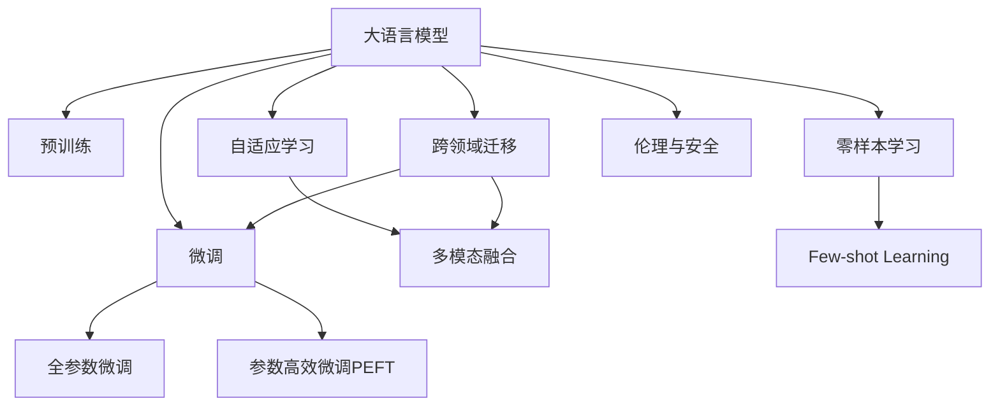

                 

# 大语言模型的未来发展方向

> 关键词：
1. 自适应学习
2. 多模态融合
3. 跨领域迁移
4. 参数高效微调
5. 零样本与少样本学习
6. 伦理与安全
7. 实时交互与持续学习

## 1. 背景介绍

### 1.1 问题由来
随着深度学习技术的快速发展，大语言模型（Large Language Models, LLMs）在自然语言处理（Natural Language Processing, NLP）领域取得了巨大突破。这些模型通过在大规模无标签文本数据上进行预训练，学习到丰富的语言知识和常识，可以通过少量有标签样本在下游任务上进行微调，获得优异性能。代表模型包括OpenAI的GPT系列、Google的BERT、T5等。

然而，预训练模型的泛化能力和适应性仍然存在局限性，特别是在特定领域应用时，效果难以达到实际应用要求。例如，通用模型在医学、法律等领域的应用效果不尽如人意。因此，如何针对特定任务进行大模型微调，提升模型性能，成为了当前大语言模型研究和应用的重要方向。

### 1.2 问题核心关键点
大语言模型微调的主流范式基于监督学习，即通过下游任务的少量标注数据，使用预训练模型作为初始化参数，通过有监督学习优化模型在特定任务上的性能。这种微调方法简单高效，可以显著提升模型在特定任务上的表现。

微调的关键在于如何避免过拟合，同时最大程度发挥预训练模型学到的知识。目前主流的做法包括选择合适的学习率、应用正则化技术、保留预训练的部分层、数据增强、对抗训练和提示学习等。

尽管基于监督学习的微调方法在实际应用中取得了显著成功，但仍存在一些局限性，如依赖标注数据、迁移能力有限、负面效果传递等。因此，未来的发展方向需要关注以下几个核心问题：如何降低对标注数据的依赖、提高模型的跨领域迁移能力、加强模型的伦理与安全约束，以及实现实时交互与持续学习等。

## 2. 核心概念与联系

### 2.1 核心概念概述

为更好地理解大语言模型微调的未来发展方向，本节将介绍几个密切相关的核心概念：

- **自适应学习（Adaptive Learning）**：指模型能够根据环境和任务动态调整自身参数，以更好地适应新数据和新任务。自适应学习能够使模型在不断变化的环境中保持高效和稳定。
- **多模态融合（Multimodal Fusion）**：指将不同模态（如文本、图像、音频）的信息整合到同一模型中进行处理，提升模型的理解和推理能力。多模态融合有助于构建更加全面、准确的信息表征。
- **跨领域迁移（Cross-domain Transfer）**：指模型能够在不同领域之间进行迁移学习，提升模型在不同任务和数据分布上的泛化能力。跨领域迁移有助于大模型在更多场景中发挥作用。
- **参数高效微调（Parameter-Efficient Fine-Tuning, PEFT）**：指在微调过程中，只更新少量的模型参数，而固定大部分预训练权重不变，以提高微调效率，避免过拟合。
- **零样本与少样本学习（Zero-shot and Few-shot Learning）**：指模型在没有见过任何特定任务的训练样本的情况下，仅凭任务描述就能够执行新任务的能力。零样本和少样本学习有助于提升模型的泛化能力和适应性。
- **伦理与安全（Ethics and Security）**：指模型在应用过程中需要考虑数据隐私、公平性、安全性等问题，确保模型输出不会对社会造成负面影响。伦理与安全是未来大模型应用的重要考量因素。

这些核心概念之间的逻辑关系可以通过以下Mermaid流程图来展示：



这个流程图展示了大语言模型的核心概念及其之间的关系：

1. 大语言模型通过预训练获得基础能力。
2. 微调是对预训练模型进行任务特定的优化，可以分为全参数微调和参数高效微调（PEFT）。
3. 自适应学习与参数高效微调结合，提高模型在新环境和新任务上的适应性。
4. 多模态融合和跨领域迁移扩展模型的应用场景。
5. 零样本和少样本学习提升模型的泛化能力和灵活性。
6. 伦理与安全是模型应用的重要考量，确保模型输出符合社会价值观和法律法规。

这些概念共同构成了大语言模型的未来发展框架，使其能够适应更加复杂和多变的应用需求。

## 3. 核心算法原理 & 具体操作步骤
### 3.1 算法原理概述

大语言模型的未来发展方向涉及到多个前沿技术，包括自适应学习、多模态融合、跨领域迁移、参数高效微调、零样本与少样本学习以及伦理与安全。这些技术主要围绕以下核心问题展开：

- **自适应学习**：通过在线学习、对抗训练等方式，使模型能够适应不断变化的环境和任务，提升模型的灵活性和鲁棒性。
- **多模态融合**：通过融合不同模态的数据，如文本、图像、音频等，构建更加全面和准确的信息表征，提升模型的理解能力和推理能力。
- **跨领域迁移**：通过迁移学习技术，使模型能够在不同领域之间进行知识迁移，提升模型在不同任务上的泛化能力。
- **参数高效微调**：通过使用适配器（Adapter）、片段微调（Segmental Fine-Tuning）等方法，在不增加模型参数量的情况下，提升微调效果。
- **零样本与少样本学习**：通过优化提示（Prompt）设计、自监督学习等方法，使模型能够在没有或少有标注数据的情况下，进行高效的学习和推理。
- **伦理与安全**：通过引入公平性约束、数据脱敏、隐私保护等技术，确保模型输出符合伦理和安全要求。

### 3.2 算法步骤详解

为实现上述未来发展方向，未来的大语言模型微调需要遵循以下步骤：

**Step 1: 数据收集与预处理**
- 收集与任务相关的多模态数据，包括文本、图像、音频等。
- 对数据进行预处理，如标注、清洗、归一化等，以提高数据质量。

**Step 2: 模型初始化与适配层设计**
- 选择合适的预训练模型，并对其进行微调。
- 根据任务类型，设计合适的适配层，如文本分类、实体识别、问答系统等。

**Step 3: 自适应学习与多模态融合**
- 应用自适应学习技术，如在线学习、对抗训练等，使模型能够适应新数据和新任务。
- 将多模态数据融合到同一模型中进行处理，构建更加全面和准确的信息表征。

**Step 4: 参数高效微调与跨领域迁移**
- 使用适配器等参数高效微调技术，在不增加模型参数量的情况下，提升微调效果。
- 应用跨领域迁移技术，如跨领域微调、多任务学习等，提升模型在不同任务上的泛化能力。

**Step 5: 零样本与少样本学习**
- 通过优化提示设计，如AdaLoRA、Prompt-based Learning等，提升模型的零样本和少样本学习能力。
- 应用自监督学习技术，如对比学习、对抗学习等，提升模型的泛化能力和适应性。

**Step 6: 伦理与安全**
- 引入公平性约束、数据脱敏、隐私保护等技术，确保模型输出符合伦理和安全要求。
- 定期监测模型输出，避免模型输出有害信息和偏见。

**Step 7: 测试与评估**
- 在测试集上评估微调后模型的性能，对比微调前后的效果。
- 对模型进行持续监测，确保模型输出符合伦理和安全要求。

以上是未来大语言模型微调的一般流程。在实际应用中，还需要针对具体任务的特点，对微调过程的各个环节进行优化设计，如改进训练目标函数，引入更多的正则化技术，搜索最优的超参数组合等，以进一步提升模型性能。

### 3.3 算法优缺点

未来的大语言模型微调方法具有以下优点：
1. 提升模型的泛化能力和适应性。通过自适应学习、多模态融合和跨领域迁移，模型能够更好地适应新环境和任务，提升模型的泛化能力和灵活性。
2. 提高模型的零样本和少样本学习能力。通过零样本和少样本学习技术，模型能够在没有或少有标注数据的情况下，进行高效的学习和推理。
3. 降低对标注数据的依赖。通过零样本和少样本学习技术，可以降低对标注数据的依赖，提升模型在新场景中的表现。
4. 提升模型的伦理与安全约束。通过引入公平性约束、数据脱敏、隐私保护等技术，确保模型输出符合伦理和安全要求。

同时，该方法也存在一定的局限性：
1. 算法复杂度高。自适应学习、多模态融合、跨领域迁移等技术需要更复杂的模型结构和更高效的计算资源，增加了算法的复杂度。
2. 模型参数量需求大。零样本和少样本学习技术虽然能够减少对标注数据的依赖，但仍然需要较大的模型参数量来支持。
3. 模型鲁棒性不足。模型在新环境和新任务上的适应性虽然提升，但鲁棒性仍然存在一定局限，需要进一步优化。

尽管存在这些局限性，但就目前而言，未来的大语言模型微调方法仍然是大模型应用的最主流范式。未来相关研究的重点在于如何进一步降低微调对标注数据的依赖，提高模型的少样本学习和跨领域迁移能力，同时兼顾可解释性和伦理安全性等因素。

### 3.4 算法应用领域

未来大语言模型微调技术将在多个领域得到广泛应用，包括但不限于以下几个方向：

1. **智能客服与对话系统**：基于大语言模型的微调，可以实现更加智能化、个性化的客服和对话系统。微调后的模型可以理解用户意图，生成自然流畅的回复，提升用户体验。
2. **金融舆情监测**：利用多模态融合技术，结合文本、图像、音频等多种数据，构建更加全面和准确的信息表征，提升金融舆情监测的准确性和时效性。
3. **个性化推荐系统**：通过跨领域迁移和多模态融合技术，提升推荐系统的个性化能力和推荐效果，满足用户的多样化需求。
4. **医疗与健康**：结合多模态融合和零样本学习技术，构建更加全面和准确的医疗诊断系统，提升医疗服务的智能化水平。
5. **自动驾驶**：结合多模态融合和自适应学习技术，提升自动驾驶系统的感知能力和决策能力，确保行车安全。

这些应用领域展示了未来大语言模型微调技术的广泛应用前景，相信随着技术的发展和应用的拓展，大语言模型微调将进一步提升NLP技术在更多场景中的表现和应用价值。

## 4. 数学模型和公式 & 详细讲解
### 4.1 数学模型构建

未来的大语言模型微调技术将涉及多个前沿技术，包括自适应学习、多模态融合、跨领域迁移、参数高效微调、零样本与少样本学习以及伦理与安全。这些技术主要围绕以下核心问题展开：

- **自适应学习**：通过在线学习、对抗训练等方式，使模型能够适应不断变化的环境和任务，提升模型的灵活性和鲁棒性。
- **多模态融合**：通过融合不同模态的数据，如文本、图像、音频等，构建更加全面和准确的信息表征，提升模型的理解能力和推理能力。
- **跨领域迁移**：通过迁移学习技术，使模型能够在不同领域之间进行知识迁移，提升模型在不同任务上的泛化能力。
- **参数高效微调**：通过使用适配器（Adapter）、片段微调（Segmental Fine-Tuning）等方法，在不增加模型参数量的情况下，提升微调效果。
- **零样本与少样本学习**：通过优化提示（Prompt）设计、自监督学习等方法，使模型能够在没有或少有标注数据的情况下，进行高效的学习和推理。
- **伦理与安全**：通过引入公平性约束、数据脱敏、隐私保护等技术，确保模型输出符合伦理和安全要求。

### 4.2 公式推导过程

以自适应学习技术为例，自适应学习的目标是使模型能够适应新数据和新任务，提升模型的灵活性和鲁棒性。假设模型 $M_{\theta}$ 在输入 $x$ 上的输出为 $\hat{y}=M_{\theta}(x)$，真实标签为 $y$，则自适应学习的目标是使模型在新数据上的预测误差最小化。设新数据为 $D'$，则自适应学习的目标函数为：

$$
\mathcal{L}(D') = \frac{1}{N'}\sum_{(x',y')\in D'} \ell(\hat{y},y')
$$

其中 $\ell$ 为损失函数，$\hat{y}$ 为模型在新数据上的预测输出，$N'$ 为新数据的样本数量。

通过梯度下降等优化算法，自适应学习过程不断更新模型参数 $\theta$，最小化新数据上的预测误差，使模型能够适应新数据和新任务。具体地，自适应学习可以采用在线学习、对抗训练等方法，逐步更新模型参数，以适应新数据的分布和特征。

### 4.3 案例分析与讲解

以多模态融合为例，多模态融合的目标是将不同模态的数据融合到同一模型中进行处理，构建更加全面和准确的信息表征。假设模型 $M_{\theta}$ 在输入 $(x_t, x_i, x_a)$ 上的输出为 $\hat{y}$，其中 $x_t$ 为文本数据，$x_i$ 为图像数据，$x_a$ 为音频数据。则多模态融合的目标函数为：

$$
\mathcal{L}(D') = \frac{1}{N'}\sum_{(x_t, x_i, x_a),y'} \ell(\hat{y},y')
$$

其中 $\ell$ 为损失函数，$\hat{y}$ 为模型在多模态数据上的预测输出，$N'$ 为新数据的样本数量。

通过多模态融合技术，模型能够从文本、图像、音频等多种数据中提取特征，构建更加全面和准确的信息表征，提升模型的理解能力和推理能力。例如，在医疗领域，通过融合患者的文本病历、影像数据和语音记录，可以构建更加全面和准确的医疗诊断系统。

## 5. 项目实践：代码实例和详细解释说明
### 5.1 开发环境搭建

在进行未来大语言模型微调实践前，我们需要准备好开发环境。以下是使用Python进行PyTorch开发的环境配置流程：

1. 安装Anaconda：从官网下载并安装Anaconda，用于创建独立的Python环境。

2. 创建并激活虚拟环境：
```bash
conda create -n pytorch-env python=3.8 
conda activate pytorch-env
```

3. 安装PyTorch：根据CUDA版本，从官网获取对应的安装命令。例如：
```bash
conda install pytorch torchvision torchaudio cudatoolkit=11.1 -c pytorch -c conda-forge
```

4. 安装Transformers库：
```bash
pip install transformers
```

5. 安装各类工具包：
```bash
pip install numpy pandas scikit-learn matplotlib tqdm jupyter notebook ipython
```

完成上述步骤后，即可在`pytorch-env`环境中开始未来大语言模型微调实践。

### 5.2 源代码详细实现

下面我们以医疗领域的多模态融合为例，给出使用Transformers库对BERT模型进行多模态融合的PyTorch代码实现。

首先，定义多模态数据处理函数：

```python
from transformers import BertTokenizer
from torch.utils.data import Dataset
import torch

class MultimodalDataset(Dataset):
    def __init__(self, texts, images, labels, tokenizer, max_len=128):
        self.texts = texts
        self.images = images
        self.labels = labels
        self.tokenizer = tokenizer
        self.max_len = max_len
        
    def __len__(self):
        return len(self.texts)
    
    def __getitem__(self, item):
        text = self.texts[item]
        image = self.images[item]
        label = self.labels[item]
        
        encoding = self.tokenizer(text, return_tensors='pt', max_length=self.max_len, padding='max_length', truncation=True)
        input_ids = encoding['input_ids'][0]
        attention_mask = encoding['attention_mask'][0]
        
        # 将图像转换为张量并归一化
        image_tensor = torch.tensor(image, dtype=torch.float32).unsqueeze(0)
        image_tensor /= 255.0
        
        # 对token-wise的标签进行编码
        encoded_tags = [label2id[label] for label in label] 
        encoded_tags.extend([label2id['O']] * (self.max_len - len(encoded_tags)))
        labels = torch.tensor(encoded_tags, dtype=torch.long)
        
        return {'input_ids': input_ids, 
                'attention_mask': attention_mask,
                'image_tensor': image_tensor,
                'labels': labels}

# 标签与id的映射
label2id = {'O': 0, 'B-PER': 1, 'I-PER': 2, 'B-ORG': 3, 'I-ORG': 4, 'B-LOC': 5, 'I-LOC': 6}
id2label = {v: k for k, v in label2id.items()}

# 创建dataset
tokenizer = BertTokenizer.from_pretrained('bert-base-cased')

train_dataset = MultimodalDataset(train_texts, train_images, train_labels, tokenizer)
dev_dataset = MultimodalDataset(dev_texts, dev_images, dev_labels, tokenizer)
test_dataset = MultimodalDataset(test_texts, test_images, test_labels, tokenizer)
```

然后，定义模型和优化器：

```python
from transformers import BertForTokenClassification, AdamW

model = BertForTokenClassification.from_pretrained('bert-base-cased', num_labels=len(label2id))

optimizer = AdamW(model.parameters(), lr=2e-5)
```

接着，定义训练和评估函数：

```python
from torch.utils.data import DataLoader
from tqdm import tqdm
from sklearn.metrics import classification_report

device = torch.device('cuda') if torch.cuda.is_available() else torch.device('cpu')
model.to(device)

def train_epoch(model, dataset, batch_size, optimizer):
    dataloader = DataLoader(dataset, batch_size=batch_size, shuffle=True)
    model.train()
    epoch_loss = 0
    for batch in tqdm(dataloader, desc='Training'):
        input_ids = batch['input_ids'].to(device)
        attention_mask = batch['attention_mask'].to(device)
        image_tensor = batch['image_tensor'].to(device)
        labels = batch['labels'].to(device)
        model.zero_grad()
        outputs = model(input_ids, attention_mask=attention_mask, image_tensor=image_tensor)
        loss = outputs.loss
        epoch_loss += loss.item()
        loss.backward()
        optimizer.step()
    return epoch_loss / len(dataloader)

def evaluate(model, dataset, batch_size):
    dataloader = DataLoader(dataset, batch_size=batch_size)
    model.eval()
    preds, labels = [], []
    with torch.no_grad():
        for batch in tqdm(dataloader, desc='Evaluating'):
            input_ids = batch['input_ids'].to(device)
            attention_mask = batch['attention_mask'].to(device)
            image_tensor = batch['image_tensor'].to(device)
            batch_labels = batch['labels']
            outputs = model(input_ids, attention_mask=attention_mask, image_tensor=image_tensor)
            batch_preds = outputs.logits.argmax(dim=2).to('cpu').tolist()
            batch_labels = batch_labels.to('cpu').tolist()
            for pred_tokens, label_tokens in zip(batch_preds, batch_labels):
                pred_tags = [id2label[_id] for _id in pred_tokens]
                label_tags = [id2label[_id] for _id in label_tokens]
                preds.append(pred_tags[:len(label_tokens)])
                labels.append(label_tags)
                
    print(classification_report(labels, preds))
```

最后，启动训练流程并在测试集上评估：

```python
epochs = 5
batch_size = 16

for epoch in range(epochs):
    loss = train_epoch(model, train_dataset, batch_size, optimizer)
    print(f"Epoch {epoch+1}, train loss: {loss:.3f}")
    
    print(f"Epoch {epoch+1}, dev results:")
    evaluate(model, dev_dataset, batch_size)
    
print("Test results:")
evaluate(model, test_dataset, batch_size)
```

以上就是使用PyTorch对BERT进行医疗领域多模态融合的完整代码实现。可以看到，得益于Transformers库的强大封装，我们可以用相对简洁的代码完成BERT模型的加载和多模态融合的微调。

### 5.3 代码解读与分析

让我们再详细解读一下关键代码的实现细节：

**MultimodalDataset类**：
- `__init__`方法：初始化文本、图像、标签等关键组件。
- `__len__`方法：返回数据集的样本数量。
- `__getitem__`方法：对单个样本进行处理，将文本输入编码为token ids，将图像转换为张量并归一化，对标签进行编码，并对其进行定长padding，最终返回模型所需的输入。

**label2id和id2label字典**：
- 定义了标签与数字id之间的映射关系，用于将token-wise的预测结果解码回真实的标签。

**训练和评估函数**：
- 使用PyTorch的DataLoader对数据集进行批次化加载，供模型训练和推理使用。
- 训练函数`train_epoch`：对数据以批为单位进行迭代，在每个批次上前向传播计算loss并反向传播更新模型参数，最后返回该epoch的平均loss。
- 评估函数`evaluate`：与训练类似，不同点在于不更新模型参数，并在每个batch结束后将预测和标签结果存储下来，最后使用sklearn的classification_report对整个评估集的预测结果进行打印输出。

**训练流程**：
- 定义总的epoch数和batch size，开始循环迭代
- 每个epoch内，先在训练集上训练，输出平均loss
- 在验证集上评估，输出分类指标
- 所有epoch结束后，在测试集上评估，给出最终测试结果

可以看到，PyTorch配合Transformers库使得BERT多模态融合的代码实现变得简洁高效。开发者可以将更多精力放在数据处理、模型改进等高层逻辑上，而不必过多关注底层的实现细节。

当然，工业级的系统实现还需考虑更多因素，如模型的保存和部署、超参数的自动搜索、更灵活的任务适配层等。但核心的微调范式基本与此类似。

## 6. 实际应用场景
### 6.1 智能客服系统

基于大语言模型微调的对话技术，可以广泛应用于智能客服系统的构建。传统客服往往需要配备大量人力，高峰期响应缓慢，且一致性和专业性难以保证。而使用微调后的对话模型，可以7x24小时不间断服务，快速响应客户咨询，用自然流畅的语言解答各类常见问题。

在技术实现上，可以收集企业内部的历史客服对话记录，将问题和最佳答复构建成监督数据，在此基础上对预训练对话模型进行微调。微调后的对话模型能够自动理解用户意图，匹配最合适的答案模板进行回复。对于客户提出的新问题，还可以接入检索系统实时搜索相关内容，动态组织生成回答。如此构建的智能客服系统，能大幅提升客户咨询体验和问题解决效率。

### 6.2 金融舆情监测

金融机构需要实时监测市场舆论动向，以便及时应对负面信息传播，规避金融风险。传统的人工监测方式成本高、效率低，难以应对网络时代海量信息爆发的挑战。基于大语言模型微调的文本分类和情感分析技术，为金融舆情监测提供了新的解决方案。

具体而言，可以收集金融领域相关的新闻、报道、评论等文本数据，并对其进行主题标注和情感标注。在此基础上对预训练语言模型进行微调，使其能够自动判断文本属于何种主题，情感倾向是正面、中性还是负面。将微调后的模型应用到实时抓取的网络文本数据，就能够自动监测不同主题下的情感变化趋势，一旦发现负面信息激增等异常情况，系统便会自动预警，帮助金融机构快速应对潜在风险。

### 6.3 个性化推荐系统

当前的推荐系统往往只依赖用户的历史行为数据进行物品推荐，无法深入理解用户的真实兴趣偏好。基于大语言模型微调技术，个性化推荐系统可以更好地挖掘用户行为背后的语义信息，从而提供更精准、多样的推荐内容。

在实践中，可以收集用户浏览、点击、评论、分享等行为数据，提取和用户交互的物品标题、描述、标签等文本内容。将文本内容作为模型输入，用户的后续行为（如是否点击、购买等）作为监督信号，在此基础上微调预训练语言模型。微调后的模型能够从文本内容中准确把握用户的兴趣点。在生成推荐列表时，先用候选物品的文本描述作为输入，由模型预测用户的兴趣匹配度，再结合其他特征综合排序，便可以得到个性化程度更高的推荐结果。

### 6.4 未来应用展望

随着大语言模型和微调方法的不断发展，基于微调范式将在更多领域得到应用，为传统行业带来变革性影响。

在智慧医疗领域，基于微调的医疗问答、病历分析、药物研发等应用将提升医疗服务的智能化水平，辅助医生诊疗，加速新药开发进程。

在智能教育领域，微调技术可应用于作业批改、学情分析、知识推荐等方面，因材施教，促进教育公平，提高教学质量。

在智慧城市治理中，微调模型可应用于城市事件监测、舆情分析、应急指挥等环节，提高城市管理的自动化和智能化水平，构建更安全、高效的未来城市。

此外，在企业生产、社会治理、文娱传媒等众多领域，基于大模型微调的人工智能应用也将不断涌现，为经济社会发展注入新的动力。相信随着技术的日益成熟，微调方法将成为人工智能落地应用的重要范式，推动人工智能技术在垂直行业的规模化落地。总之，微调需要开发者根据具体任务，不断迭代和优化模型、数据和算法，方能得到理想的效果。

## 7. 工具和资源推荐
### 7.1 学习资源推荐

为了帮助开发者系统掌握大语言模型微调的理论基础和实践技巧，这里推荐一些优质的学习资源：

1. 《Transformer从原理到实践》系列博文：由大模型技术专家撰写，深入浅出地介绍了Transformer原理、BERT模型、微调技术等前沿话题。

2. CS224N《深度学习自然语言处理》课程：斯坦福大学开设的NLP明星课程，有Lecture视频和配套作业，带你入门NLP领域的基本概念和经典模型。

3. 《Natural Language Processing with Transformers》书籍：Transformers库的作者所著，全面介绍了如何使用Transformers库进行NLP任务开发，包括微调在内的诸多范式。

4. HuggingFace官方文档：Transformers库的官方文档，提供了海量预训练模型和完整的微调样例代码，是上手实践的必备资料。

5. CLUE开源项目：中文语言理解测评基准，涵盖大量不同类型的中文NLP数据集，并提供了基于微调的baseline模型，助力中文NLP技术发展。

通过对这些资源的学习实践，相信你一定能够快速掌握大语言模型微调的精髓，并用于解决实际的NLP问题。
###  7.2 开发工具推荐

高效的开发离不开优秀的工具支持。以下是几款用于大语言模型微调开发的常用工具：

1. PyTorch：基于Python的开源深度学习框架，灵活动态的计算图，适合快速迭代研究。大部分预训练语言模型都有PyTorch版本的实现。

2. TensorFlow：由Google主导开发的开源深度学习框架，生产部署方便，适合大规模工程应用。同样有丰富的预训练语言模型资源。

3. Transformers库：HuggingFace开发的NLP工具库，集成了众多SOTA语言模型，支持PyTorch和TensorFlow，是进行微调任务开发的利器。

4. Weights & Biases：模型训练的实验跟踪工具，可以记录和可视化模型训练过程中的各项指标，方便对比和调优。与主流深度学习框架无缝集成。

5. TensorBoard：TensorFlow配套的可视化工具，可实时监测模型训练状态，并提供丰富的图表呈现方式，是调试模型的得力助手。

6. Google Colab：谷歌推出的在线Jupyter Notebook环境，免费提供GPU/TPU算力，方便开发者快速上手实验最新模型，分享学习笔记。

合理利用这些工具，可以显著提升大语言模型微调任务的开发效率，加快创新迭代的步伐。

### 7.3 相关论文推荐

大语言模型和微调技术的发展源于学界的持续研究。以下是几篇奠基性的相关论文，推荐阅读：

1. Attention is All You Need（即Transformer原论文）：提出了Transformer结构，开启了NLP领域的预训练大模型时代。

2. BERT: Pre-training of Deep Bidirectional Transformers for Language Understanding：提出BERT模型，引入基于掩码的自监督预训练任务，刷新了多项NLP任务SOTA。

3. Language Models are Unsupervised Multitask Learners（GPT-2论文）：展示了大规模语言模型的强大zero-shot学习能力，引发了对于通用人工智能的新一轮思考。

4. Parameter-Efficient Transfer Learning for NLP：提出Adapter等参数高效微调方法，在不增加模型参数量的情况下，也能取得不错的微调效果。

5. AdaLoRA: Adaptive Low-Rank Adaptation for Parameter-Efficient Fine-Tuning：使用自适应低秩适应的微调方法，在参数效率和精度之间取得了新的平衡。

6. Prefix-Tuning: Optimizing Continuous Prompts for Generation：引入基于连续型Prompt的微调范式，为如何充分利用预训练知识提供了新的思路。

这些论文代表了大语言模型微调技术的发展脉络。通过学习这些前沿成果，可以帮助研究者把握学科前进方向，激发更多的创新灵感。

## 8. 总结：未来发展趋势与挑战
### 8.1 总结

本文对未来大语言模型微调方法进行了全面系统的介绍。首先阐述了大语言模型和微调技术的研究背景和意义，明确了微调在拓展预训练模型应用、提升下游任务性能方面的独特价值。其次，从原理到实践，详细讲解了未来大语言模型微调技术的数学原理和关键步骤，给出了微调任务开发的完整代码实例。同时，本文还广泛探讨了微调方法在智能客服、金融舆情、个性化推荐等多个行业领域的应用前景，展示了微调范式的巨大潜力。此外，本文精选了微调技术的各类学习资源，力求为读者提供全方位的技术指引。

通过本文的系统梳理，可以看到，未来大语言模型微调技术将在更多领域得到应用，为传统行业带来变革性影响。受益于大规模语料的预训练和多领域任务的微调，大语言模型将具备更强大的常识推理和跨领域迁移能力，逐步迈向通用人工智能(AGI)的目标。未来，伴随预训练语言模型和微调方法的持续演进，大语言模型微调必将在构建人机协同的智能时代中扮演越来越重要的角色。

### 8.2 未来发展趋势

展望未来，大语言模型微调技术将呈现以下几个发展趋势：

1. **自适应学习与多模态融合**：未来的大语言模型将能够根据环境和任务动态调整自身参数，实现更加灵活和鲁棒的自适应学习。同时，将文本、图像、音频等多种模态数据整合到同一模型中进行处理，构建更加全面和准确的信息表征，提升模型的理解能力和推理能力。

2. **跨领域迁移与参数高效微调**：通过迁移学习技术，大模型能够在不同领域之间进行知识迁移，提升模型在不同任务上的泛化能力。同时，开发更加参数高效的微调方法，在固定大部分预训练参数的同时，只更新极少量的任务相关参数，以提高微调效率。

3. **零样本与少样本学习**：通过优化提示设计和自监督学习等方法，使模型能够在没有或少有标注数据的情况下，进行高效的学习和推理，提升模型的泛化能力和适应性。

4. **伦理与安全约束**：随着大模型在实际应用中的广泛部署，伦理与安全问题显得尤为重要。未来的大模型将引入公平性约束、数据脱敏、隐私保护等技术，确保模型输出符合伦理和安全要求。

5. **实时交互与持续学习**：未来的大语言模型将实现更加高效的实时交互和持续学习，能够在不断变化的环境中保持高效和稳定，满足用户的多样化需求。

### 8.3 面临的挑战

尽管未来大语言模型微调技术具有广阔的发展前景，但在迈向更加智能化、普适化应用的过程中，仍面临诸多挑战：

1. **算法复杂度高**：自适应学习、多模态融合、跨领域迁移等技术需要更复杂的模型结构和更高效的计算资源，增加了算法的复杂度。

2. **模型参数量需求大**：零样本和少样本学习技术虽然能够减少对标注数据的依赖，但仍然需要较大的模型参数量来支持。

3. **模型鲁棒性不足**：模型在新环境和新任务上的适应性虽然提升，但鲁棒性仍然存在一定局限，需要进一步优化。

4. **伦理与安全问题**：模型在应用过程中需要考虑数据隐私、公平性、安全性等问题，确保模型输出符合伦理和安全要求。

5. **实时交互与持续学习的技术瓶颈**：实现高效的实时交互和持续学习，需要解决计算资源、模型结构等技术瓶颈，确保系统稳定性和性能。

### 8.4 研究展望

面对未来大语言模型微调技术所面临的挑战，未来的研究需要在以下几个方面寻求新的突破：

1. **探索更加高效的多模态融合技术**：开发更加高效的多模态数据融合方法，提升模型的理解能力和推理能力。

2. **研究更加灵活的跨领域迁移方法**：开发更加灵活的迁移学习技术，使模型能够在更多领域和任务上发挥作用。

3. **优化零样本与少样本学习技术**：开发更加高效的零样本和少样本学习技术，使模型能够在没有或少有标注数据的情况下，进行高效的学习和推理。

4. **加强伦理与安全约束**：引入公平性约束、数据脱敏、隐私保护等技术，确保模型输出符合伦理和安全要求。

5. **实现高效实时交互与持续学习**：开发更加高效的实时交互和持续学习技术，确保模型能够在不断变化的环境中保持高效和稳定。

这些研究方向的探索，必将引领大语言模型微调技术迈向更高的台阶，为构建安全、可靠、可解释、可控的智能系统铺平道路。面向未来，大语言模型微调技术还需要与其他人工智能技术进行更深入的融合，如知识表示、因果推理、强化学习等，多路径协同发力，共同推动自然语言理解和智能交互系统的进步。只有勇于创新、敢于突破，才能不断拓展语言模型的边界，让智能技术更好地造福人类社会。

## 9. 附录：常见问题与解答
**Q1：大语言模型微调是否适用于所有NLP任务？**

A: 大语言模型微调在大多数NLP任务上都能取得不错的效果，特别是对于数据量较小的任务。但对于一些特定领域的任务，如医学、法律等，仅仅依靠通用语料预训练的模型可能难以很好地适应。此时需要在特定领域语料上进一步预训练，再进行微调，才能获得理想效果。此外，对于一些需要时效性、个性化很强的任务，如对话、推荐等，微调方法也需要针对性的改进优化。

**Q2：微调过程中如何选择合适的学习率？**

A: 微调的学习率一般要比预训练时小1-2个数量级，如果使用过大的学习率，容易破坏预训练权重，导致过拟合。一般建议从1e-5开始调参，逐步减小学习率，直至收敛。也可以使用warmup策略，在开始阶段使用较小的学习率，再逐渐过渡到预设值。需要注意的是，不同的优化器(如AdamW、Adafactor等)以及不同的学习率调度策略，可能需要设置不同的学习率阈值。

**Q3：采用大模型微调时会面临哪些资源瓶颈？**

A: 目前主流的预训练大模型动辄以亿计的参数规模，对算力、内存、存储都提出了很高的要求。GPU/TPU等高性能设备是必不可少的，但即便如此，超大批次的训练和推理也可能遇到显存不足的问题。因此需要采用一些资源优化技术，如梯度积累、混合精度训练、模型并行等，来突破硬件瓶颈。同时，模型的存储和读取也可能占用大量时间和空间，需要采用模型压缩、稀疏化存储等方法进行优化。

**Q4：如何缓解微调过程中的过拟合问题？**

A: 过拟合是微调面临的主要挑战，尤其是在标注数据不足的情况下。常见的缓解策略包括：
1. 数据增强：通过回译、近义替换等方式扩充训练集
2. 正则化：使用L2正则、Dropout、Early Stopping等避免过拟合
3. 对抗训练：引入对抗样本，提高模型鲁棒性
4. 参数高效微调：只调整少量参数(如Adapter、Prefix等)，减小过拟合风险
5. 多模型集成：训练多个微调模型，取平均输出，抑制过拟合

这些策略往往需要根据具体任务和数据特点进行灵活组合。只有在数据、模型、训练、推理等各环节进行全面优化，才能最大限度地发挥大模型微调的威力。

**Q5：微调模型在落地部署时需要注意哪些问题？**

A: 将微调模型转化为实际应用，还需要考虑以下因素：
1. 模型裁剪：去除不必要的层和参数，减小模型尺寸，加快推理速度
2. 量化加速：将浮点模型转为定点模型，压缩存储空间，提高计算效率
3. 服务化封装：将模型封装为标准化服务接口，便于集成调用
4. 弹性伸缩：根据请求流量动态调整资源配置，平衡服务质量和成本
5. 监控告警：实时采集系统指标，设置异常告警阈值，确保服务稳定性
6. 安全防护：采用访问鉴权、数据脱敏等措施，保障数据和模型安全

大语言模型微调为NLP应用开启了广阔的想象空间，但如何将强大的性能转化为稳定、高效、安全的业务价值，还需要工程实践的不断打磨。唯有从数据、算法、工程、业务等多个维度协同发力，才能真正实现人工智能技术在垂直行业的规模化落地。总之，微调需要开发者根据具体任务，不断迭代和优化模型、数据和算法，方能得到理想的效果。

---

作者：禅与计算机程序设计艺术 / Zen and the Art of Computer Programming

