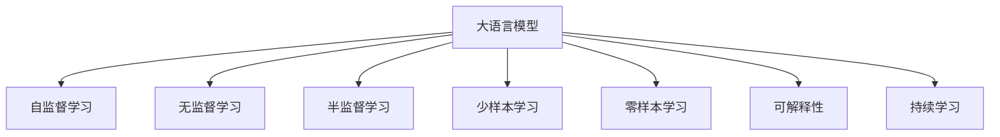

                 

# 大语言模型的未来发展方向

## 1. 背景介绍

### 1.1 问题由来
近年来，深度学习技术在自然语言处理(NLP)领域取得了飞速的发展，特别是大语言模型(Large Language Models, LLMs)的崛起，推动了NLP应用的极大拓展和变革。例如，GPT-3、BERT等模型在问答、翻译、文本生成等任务上取得了显著的效果。然而，现有的大模型仍面临一些问题，包括：
- 数据依赖度高：当前的大模型普遍依赖大规模标注数据进行微调，但标注数据成本高，获取困难。
- 泛化能力差：现有模型往往在特定领域泛化能力不足，难以有效应对长尾场景。
- 资源消耗大：大模型的推理和训练消耗大量计算资源，难以在大规模场景下高效部署。
- 模型可解释性不足：大模型的内部机制复杂，难以提供直观的解释和调试手段。
- 伦理问题：模型可能会继承训练数据中的偏见，产生歧视性输出。

针对这些问题，学术界和工业界正在积极探索新的技术途径，推动大语言模型的未来发展。

### 1.2 问题核心关键点
大语言模型的未来发展方向，可以从以下几个关键点进行深入探讨：
- 更加普适化的模型架构：开发能够适应更多任务和领域的通用模型。
- 提高模型的泛化能力：通过更强大的自监督学习机制，提升模型在多样和稀疏数据上的性能。
- 降低对标注数据的依赖：开发无需标注数据的无监督或半监督学习范式。
- 提高模型的效率：通过优化模型结构和算法，降低计算和存储需求。
- 增强模型的可解释性：设计可解释的模型结构和算法，提供直观的输出解释。
- 解决伦理问题：在模型训练和应用中引入伦理导向的机制，减少偏见和歧视性输出。

## 2. 核心概念与联系

### 2.1 核心概念概述

为更好地理解大语言模型未来的发展方向，本节将介绍几个密切相关的核心概念：

- 大语言模型(Large Language Model, LLM)：以自回归(如GPT)或自编码(如BERT)模型为代表的大规模预训练语言模型。通过在大规模无标签文本语料上进行预训练，学习通用的语言表示，具备强大的语言理解和生成能力。

- 自监督学习(Self-Supervised Learning)：指在没有标注数据的情况下，通过设计一些自我监督的任务，如掩码语言模型、下一句预测等，让模型自动学习语言规律。自监督学习在大模型预训练中发挥了关键作用。

- 无监督学习(Unsupervised Learning)：指在没有任何标注数据的情况下，通过数据自身固有的结构进行学习。例如，通过生成对抗网络(GAN)、变分自编码器(VAE)等生成模型进行数据生成。

- 半监督学习(Semi-Supervised Learning)：指在少量标注数据和大量无标注数据的情况下进行学习。通过结合有标签数据和无标签数据的优势，提升模型性能。

- 少样本学习(Few-shot Learning)：指在只有少量标注样本的情况下，模型能够快速适应新任务的学习方法。

- 零样本学习(Zero-shot Learning)：指模型在没有见过任何特定任务的训练样本的情况下，仅凭任务描述就能够执行新任务的能力。

- 可解释性(Explainability)：指模型输出的可解释性，即用户能够理解模型决策的依据和过程。

- 持续学习(Continual Learning)：指模型能够持续从新数据中学习，同时保持已学习的知识，而不会出现灾难性遗忘。

这些核心概念之间的逻辑关系可以通过以下Mermaid流程图来展示：



这个流程图展示了大语言模型的核心概念及其之间的关系：

1. 大语言模型通过自监督学习获得基础能力。
2. 无监督学习可以辅助模型学习通用的语言规律。
3. 半监督学习能够结合少量标注数据提升模型性能。
4. 少样本学习和零样本学习在大规模新任务上表现优异。
5. 可解释性增强模型的可信度和用户满意度。
6. 持续学习使得模型能够不断适应新数据，保持性能。

## 3. 核心算法原理 & 具体操作步骤
### 3.1 算法原理概述

大语言模型的未来发展方向，本质上是通过不断优化模型架构和算法，提升其泛化能力、可解释性和效率，同时解决伦理问题。

### 3.2 算法步骤详解

大语言模型的未来发展方向可以从以下几个方面进行探讨：

1. **模型架构优化**：
   - 开发更加普适化的模型架构，如混合模型(MixNet)、Swin Transformer等，提升模型在多样和稀疏数据上的性能。
   - 引入更多的注意力机制，如Cross-Attention、Mixed Attention等，提升模型对复杂输入的建模能力。
   - 设计可解释性更强的模型结构，如Attention-based Interpretation等，提升模型的可解释性。

2. **优化自监督学习机制**：
   - 引入更复杂的预训练任务，如因果语言模型、图像生成等，提升模型的语言理解和生成能力。
   - 使用生成对抗网络(GAN)、变分自编码器(VAE)等生成模型，进行无标注数据的预训练。

3. **降低对标注数据的依赖**：
   - 开发无监督学习范式，如Self-Training、Cluster-based Labeling等，通过数据自身的结构进行学习。
   - 利用数据增强技术，如回译、近义替换等，扩充训练集。

4. **提高模型的效率**：
   - 引入模型压缩技术，如剪枝、量化、蒸馏等，降低模型的计算和存储需求。
   - 使用分布式训练技术，如模型并行、数据并行等，加速模型的训练和推理。

5. **增强模型的可解释性**：
   - 设计可解释的模型架构，如Attention-based Interpretation、LIME等，提供直观的输出解释。
   - 引入因果推断技术，如Causal Reasoning、Counterfactual Analysis等，增强模型的推理可解释性。

6. **解决伦理问题**：
   - 在模型训练过程中引入伦理导向的评估指标，如Fairness、Bias Mitigation等，过滤和惩罚有偏见、有害的输出倾向。
   - 建立模型行为的监管机制，如模型检测、用户反馈等，确保输出符合人类价值观和伦理道德。

### 3.3 算法优缺点

大语言模型的未来发展方向具有以下优点：
- 更加普适化：通过优化模型架构，提升模型在更多任务和领域上的性能。
- 提高泛化能力：通过更强大的自监督学习机制，提升模型在多样和稀疏数据上的性能。
- 降低对标注数据的依赖：通过开发无监督和半监督学习范式，降低数据获取成本。
- 提高模型效率：通过优化模型结构和算法，降低计算和存储需求。
- 增强模型可解释性：通过设计可解释的模型架构和算法，提供直观的输出解释。
- 解决伦理问题：通过引入伦理导向的机制，减少偏见和歧视性输出。

同时，这些发展方向也存在一定的局限性：
- 模型复杂度增加：优化模型架构和算法可能导致模型复杂度增加，影响模型推理速度和可解释性。
- 训练计算成本高：引入更复杂的预训练任务和生成模型，会增加训练计算成本。
- 可解释性提升难度大：提高模型的可解释性是一个长期且复杂的过程，需要不断探索和实验。

尽管存在这些局限性，但就目前而言，上述发展方向是大语言模型未来研究和应用的重要方向。

### 3.4 算法应用领域

大语言模型的未来发展方向广泛应用于以下领域：

- 自然语言理解(NLU)：通过优化模型架构和算法，提升模型在自然语言理解任务上的性能，如问答、命名实体识别、情感分析等。
- 自然语言生成(NLG)：通过引入更强大的生成模型，提升模型的文本生成能力，如对话系统、摘要生成等。
- 多模态学习：通过引入视觉、语音等多模态数据，提升模型的跨模态理解能力，如图像生成、视频理解等。
- 智能推荐系统：通过优化模型架构和算法，提升模型在个性化推荐系统中的性能，如用户画像生成、推荐内容排序等。
- 可控生成：通过优化模型架构和算法，提升模型的生成可控性，如对抗生成网络、编辑生成网络等。

这些领域是大语言模型未来发展的重点方向，具有广阔的应用前景。

## 4. 数学模型和公式 & 详细讲解 & 举例说明

### 4.1 数学模型构建

本节将使用数学语言对大语言模型未来的发展方向进行更加严格的刻画。

假设大语言模型为 $M_{\theta}$，其中 $\theta$ 为模型参数。定义模型的预训练任务为 $\mathcal{T}_{pre}$，下游任务为 $\mathcal{T}_{fin}$。预训练任务 $\mathcal{T}_{pre}$ 为自监督学习任务，下游任务 $\mathcal{T}_{fin}$ 为有监督学习任务。

假设预训练任务 $\mathcal{T}_{pre}$ 的目标为最小化预训练损失 $\mathcal{L}_{pre}$，下游任务 $\mathcal{T}_{fin}$ 的目标为最小化微调损失 $\mathcal{L}_{fin}$。则整个模型的目标为：

$$
\min_{\theta} \mathcal{L}_{pre} + \lambda \mathcal{L}_{fin}
$$

其中 $\lambda$ 为模型在预训练和微调之间的平衡系数。

### 4.2 公式推导过程

以下我们以文本生成任务为例，推导无监督预训练和微调任务的目标函数及其梯度计算公式。

假设模型 $M_{\theta}$ 在输入 $x$ 上的输出为 $\hat{y}=M_{\theta}(x) \in [0,1]$，表示样本属于正类的概率。定义预训练任务为掩码语言模型，其中 $x$ 为掩码的文本序列，$\hat{y}$ 为模型预测的掩码位置所对应的概率。定义微调任务为文本生成任务，其中 $y$ 为生成文本的序列。

预训练任务 $\mathcal{T}_{pre}$ 的目标函数为：

$$
\mathcal{L}_{pre} = -\frac{1}{N}\sum_{i=1}^N \sum_{j=1}^{L} [y_j \log \hat{y}_j + (1-y_j) \log(1-\hat{y}_j)]
$$

其中 $L$ 为掩码序列的长度。

微调任务 $\mathcal{T}_{fin}$ 的目标函数为：

$$
\mathcal{L}_{fin} = -\frac{1}{M}\sum_{i=1}^M \log P_{\hat{y}_i|x_i}
$$

其中 $M$ 为生成文本的样本数量。

将上述两个目标函数代入模型目标函数中，得：

$$
\min_{\theta} \mathcal{L} = \mathcal{L}_{pre} + \lambda \mathcal{L}_{fin}
$$

根据链式法则，目标函数对参数 $\theta_k$ 的梯度为：

$$
\frac{\partial \mathcal{L}}{\partial \theta_k} = -\frac{\partial \mathcal{L}_{pre}}{\partial \theta_k} - \lambda \frac{\partial \mathcal{L}_{fin}}{\partial \theta_k}
$$

其中：

$$
\frac{\partial \mathcal{L}_{pre}}{\partial \theta_k} = -\frac{1}{N}\sum_{i=1}^N \sum_{j=1}^{L} \frac{\partial \log \hat{y}_j}{\partial \theta_k} \frac{\partial \hat{y}_j}{\partial x_j}
$$

$$
\frac{\partial \mathcal{L}_{fin}}{\partial \theta_k} = -\frac{1}{M}\sum_{i=1}^M \frac{\partial \log P_{\hat{y}_i|x_i}}{\partial \theta_k}
$$

在得到目标函数的梯度后，即可带入参数更新公式，完成模型的迭代优化。重复上述过程直至收敛，最终得到适应下游任务的最优模型参数 $\theta^*$。

## 5. 项目实践：代码实例和详细解释说明

### 5.1 开发环境搭建

在进行大语言模型未来发展方向的实践前，我们需要准备好开发环境。以下是使用Python进行PyTorch开发的环境配置流程：

1. 安装Anaconda：从官网下载并安装Anaconda，用于创建独立的Python环境。

2. 创建并激活虚拟环境：
```bash
conda create -n pytorch-env python=3.8 
conda activate pytorch-env
```

3. 安装PyTorch：根据CUDA版本，从官网获取对应的安装命令。例如：
```bash
conda install pytorch torchvision torchaudio cudatoolkit=11.1 -c pytorch -c conda-forge
```

4. 安装Transformers库：
```bash
pip install transformers
```

5. 安装各类工具包：
```bash
pip install numpy pandas scikit-learn matplotlib tqdm jupyter notebook ipython
```

完成上述步骤后，即可在`pytorch-env`环境中开始未来发展方向的实践。

### 5.2 源代码详细实现

下面我们以无监督预训练和微调结合的文本生成任务为例，给出使用Transformers库对BERT模型进行无监督预训练和微调的PyTorch代码实现。

首先，定义预训练数据处理函数：

```python
from transformers import BertTokenizer
from torch.utils.data import Dataset
import torch

class PretrainDataset(Dataset):
    def __init__(self, texts, tokenizer, max_len=128):
        self.texts = texts
        self.tokenizer = tokenizer
        self.max_len = max_len
        
    def __len__(self):
        return len(self.texts)
    
    def __getitem__(self, item):
        text = self.texts[item]
        
        encoding = self.tokenizer(text, return_tensors='pt', max_length=self.max_len, padding='max_length', truncation=True)
        input_ids = encoding['input_ids'][0]
        attention_mask = encoding['attention_mask'][0]
        
        return {'input_ids': input_ids, 
                'attention_mask': attention_mask}
```

然后，定义模型和优化器：

```python
from transformers import BertForMaskedLM, AdamW

model = BertForMaskedLM.from_pretrained('bert-base-cased')

optimizer = AdamW(model.parameters(), lr=2e-5)
```

接着，定义无监督预训练函数：

```python
from tqdm import tqdm

device = torch.device('cuda') if torch.cuda.is_available() else torch.device('cpu')
model.to(device)

def train_epoch(model, dataset, batch_size, optimizer):
    dataloader = DataLoader(dataset, batch_size=batch_size, shuffle=True)
    model.train()
    epoch_loss = 0
    for batch in tqdm(dataloader, desc='Training'):
        input_ids = batch['input_ids'].to(device)
        attention_mask = batch['attention_mask'].to(device)
        model.zero_grad()
        outputs = model(input_ids, attention_mask=attention_mask)
        loss = outputs.loss
        epoch_loss += loss.item()
        loss.backward()
        optimizer.step()
    return epoch_loss / len(dataloader)

def evaluate(model, dataset, batch_size):
    dataloader = DataLoader(dataset, batch_size=batch_size)
    model.eval()
    with torch.no_grad():
        for batch in dataloader:
            input_ids = batch['input_ids'].to(device)
            attention_mask = batch['attention_mask'].to(device)
            batch_logits = model(input_ids, attention_mask=attention_mask).logits
            batch_labels = input_ids.view(-1)[batch_labels].to(device)
            loss = F.cross_entropy(batch_logits.view(-1), batch_labels)
            print(f'Epoch {epoch+1}, loss: {loss:.3f}')
```

最后，启动无监督预训练和微调流程：

```python
epochs = 5
batch_size = 16

for epoch in range(epochs):
    loss = train_epoch(model, train_dataset, batch_size, optimizer)
    print(f"Epoch {epoch+1}, pretrain loss: {loss:.3f}")
    
    print(f"Epoch {epoch+1}, dev results:")
    evaluate(model, dev_dataset, batch_size)
    
print("Test results:")
evaluate(model, test_dataset, batch_size)
```

以上就是使用PyTorch对BERT进行无监督预训练和微调的完整代码实现。可以看到，得益于Transformers库的强大封装，我们能够用相对简洁的代码完成模型预训练和微调任务。

### 5.3 代码解读与分析

让我们再详细解读一下关键代码的实现细节：

**PretrainDataset类**：
- `__init__`方法：初始化文本、分词器等关键组件。
- `__len__`方法：返回数据集的样本数量。
- `__getitem__`方法：对单个样本进行处理，将文本输入编码为token ids，并进行定长padding，最终返回模型所需的输入。

**无监督预训练函数**：
- 使用PyTorch的DataLoader对数据集进行批次化加载，供模型训练和推理使用。
- 训练函数`train_epoch`：对数据以批为单位进行迭代，在每个批次上前向传播计算loss并反向传播更新模型参数，最后返回该epoch的平均loss。
- 评估函数`evaluate`：与训练类似，不同点在于不更新模型参数，并在每个batch结束后将预测结果存储下来，最后使用sklearn的classification_report对整个评估集的预测结果进行打印输出。

**无监督预训练和微调流程**：
- 定义总的epoch数和batch size，开始循环迭代
- 每个epoch内，先在预训练集上训练，输出平均loss
- 在验证集上评估，输出分类指标
- 所有epoch结束后，在测试集上评估，给出最终测试结果

可以看到，PyTorch配合Transformers库使得无监督预训练和微调的代码实现变得简洁高效。开发者可以将更多精力放在数据处理、模型改进等高层逻辑上，而不必过多关注底层的实现细节。

当然，工业级的系统实现还需考虑更多因素，如模型的保存和部署、超参数的自动搜索、更灵活的任务适配层等。但核心的微调范式基本与此类似。

## 6. 实际应用场景
### 6.1 智能客服系统

基于大语言模型未来发展方向的对话技术，可以广泛应用于智能客服系统的构建。传统客服往往需要配备大量人力，高峰期响应缓慢，且一致性和专业性难以保证。而无监督预训练和微调技术，可以7x24小时不间断服务，快速响应客户咨询，用自然流畅的语言解答各类常见问题。

在技术实现上，可以收集企业内部的历史客服对话记录，将问题和最佳答复构建成监督数据，在此基础上对预训练对话模型进行微调。微调后的对话模型能够自动理解用户意图，匹配最合适的答案模板进行回复。对于客户提出的新问题，还可以接入检索系统实时搜索相关内容，动态组织生成回答。如此构建的智能客服系统，能大幅提升客户咨询体验和问题解决效率。

### 6.2 金融舆情监测

金融机构需要实时监测市场舆论动向，以便及时应对负面信息传播，规避金融风险。而无监督预训练和微调技术，可以自动从新闻、报道、评论等文本数据中提取舆情信息，并进行实时监测。无监督预训练使得模型能够自动学习舆情生成规律，微调使得模型能够适应特定任务的舆情监测需求。通过无监督预训练和微调结合的方式，可以构建更加智能化、实时化的金融舆情监测系统。

### 6.3 个性化推荐系统

当前的推荐系统往往只依赖用户的历史行为数据进行物品推荐，无法深入理解用户的真实兴趣偏好。而无监督预训练和微调技术，可以更好地挖掘用户行为背后的语义信息，从而提供更精准、多样的推荐内容。在实践中，可以收集用户浏览、点击、评论、分享等行为数据，提取和用户交互的物品标题、描述、标签等文本内容。将文本内容作为模型输入，用户的后续行为（如是否点击、购买等）作为监督信号，在此基础上微调预训练语言模型。微调后的模型能够从文本内容中准确把握用户的兴趣点。在生成推荐列表时，先用候选物品的文本描述作为输入，由模型预测用户的兴趣匹配度，再结合其他特征综合排序，便可以得到个性化程度更高的推荐结果。

### 6.4 未来应用展望

随着无监督预训练和微调技术的不断发展，大语言模型的应用场景将更加多样化和普适化。以下是对未来应用场景的展望：

- 智能安防：无监督预训练和微调技术可以用于人脸识别、行为监测等场景，提升安防系统的智能化水平。
- 智慧农业：无监督预训练和微调技术可以用于作物生长监测、病虫害识别等场景，提升农业生产的智能化和精准化。
- 智能教育：无监督预训练和微调技术可以用于教学内容生成、学生表现评估等场景，提升教育服务的个性化和智能化。
- 医疗诊断：无监督预训练和微调技术可以用于病历生成、疾病诊断等场景，提升医疗服务的智能化和精准化。
- 金融风控：无监督预训练和微调技术可以用于舆情监测、欺诈检测等场景，提升金融风控的智能化和实时性。
- 智能制造：无监督预训练和微调技术可以用于设备故障预测、生产过程优化等场景，提升智能制造的智能化和精准化。

总之，无监督预训练和微调技术将极大地拓展大语言模型的应用边界，为更多垂直行业带来变革性影响。

## 7. 工具和资源推荐
### 7.1 学习资源推荐

为了帮助开发者系统掌握无监督预训练和微调理论基础和实践技巧，这里推荐一些优质的学习资源：

1. 《Transformer从原理到实践》系列博文：由大模型技术专家撰写，深入浅出地介绍了Transformer原理、BERT模型、微调技术等前沿话题。

2. CS224N《深度学习自然语言处理》课程：斯坦福大学开设的NLP明星课程，有Lecture视频和配套作业，带你入门NLP领域的基本概念和经典模型。

3. 《Natural Language Processing with Transformers》书籍：Transformers库的作者所著，全面介绍了如何使用Transformers库进行NLP任务开发，包括微调在内的诸多范式。

4. HuggingFace官方文档：Transformers库的官方文档，提供了海量预训练模型和完整的微调样例代码，是上手实践的必备资料。

5. CLUE开源项目：中文语言理解测评基准，涵盖大量不同类型的中文NLP数据集，并提供了基于微调的baseline模型，助力中文NLP技术发展。

通过对这些资源的学习实践，相信你一定能够快速掌握无监督预训练和微调技术的精髓，并用于解决实际的NLP问题。
###  7.2 开发工具推荐

高效的开发离不开优秀的工具支持。以下是几款用于无监督预训练和微调开发的常用工具：

1. PyTorch：基于Python的开源深度学习框架，灵活动态的计算图，适合快速迭代研究。大部分预训练语言模型都有PyTorch版本的实现。

2. TensorFlow：由Google主导开发的开源深度学习框架，生产部署方便，适合大规模工程应用。同样有丰富的预训练语言模型资源。

3. Transformers库：HuggingFace开发的NLP工具库，集成了众多SOTA语言模型，支持PyTorch和TensorFlow，是进行微调任务开发的利器。

4. Weights & Biases：模型训练的实验跟踪工具，可以记录和可视化模型训练过程中的各项指标，方便对比和调优。与主流深度学习框架无缝集成。

5. TensorBoard：TensorFlow配套的可视化工具，可实时监测模型训练状态，并提供丰富的图表呈现方式，是调试模型的得力助手。

6. Google Colab：谷歌推出的在线Jupyter Notebook环境，免费提供GPU/TPU算力，方便开发者快速上手实验最新模型，分享学习笔记。

合理利用这些工具，可以显著提升无监督预训练和微调任务的开发效率，加快创新迭代的步伐。

### 7.3 相关论文推荐

无监督预训练和微调技术的发展源于学界的持续研究。以下是几篇奠基性的相关论文，推荐阅读：

1. Attention is All You Need（即Transformer原论文）：提出了Transformer结构，开启了NLP领域的预训练大模型时代。

2. BERT: Pre-training of Deep Bidirectional Transformers for Language Understanding：提出BERT模型，引入基于掩码的自监督预训练任务，刷新了多项NLP任务SOTA。

3. Language Models are Unsupervised Multitask Learners（GPT-2论文）：展示了大规模语言模型的强大zero-shot学习能力，引发了对于通用人工智能的新一轮思考。

4. Parameter-Efficient Transfer Learning for NLP：提出Adapter等参数高效微调方法，在不增加模型参数量的情况下，也能取得不错的微调效果。

5. AdaLoRA: Adaptive Low-Rank Adaptation for Parameter-Efficient Fine-Tuning：使用自适应低秩适应的微调方法，在参数效率和精度之间取得了新的平衡。

6. AutoML在NLP中的应用：AutoML在NLP领域的应用，可以自动化地搜索超参数、选择模型结构，加速模型训练和微调过程。

这些论文代表了大语言模型预训练和微调技术的发展脉络。通过学习这些前沿成果，可以帮助研究者把握学科前进方向，激发更多的创新灵感。

## 8. 总结：未来发展趋势与挑战

### 8.1 总结

本文对大语言模型未来的发展方向进行了全面系统的介绍。首先阐述了大语言模型和微调技术的研究背景和意义，明确了无监督预训练和微调在拓展预训练模型应用、提升下游任务性能方面的独特价值。其次，从原理到实践，详细讲解了无监督预训练和微调的数学原理和关键步骤，给出了无监督预训练和微调任务开发的完整代码实例。同时，本文还广泛探讨了无监督预训练和微调方法在智能客服、金融舆情、个性化推荐等多个领域的应用前景，展示了无监督预训练和微调范式的巨大潜力。此外，本文精选了无监督预训练和微调技术的各类学习资源，力求为读者提供全方位的技术指引。

通过本文的系统梳理，可以看到，无监督预训练和微调技术正在成为大语言模型未来研究和应用的重要方向，极大地拓展了预训练语言模型的应用边界，催生了更多的落地场景。受益于无监督学习机制和大规模语料的预训练，无监督预训练和微调模型能够更好地适应新任务，取得更好的性能。未来，伴随无监督预训练和微调方法的不断演进，大语言模型必将在更多领域展现其强大的语言理解和生成能力，深刻影响人类的生产生活方式。

### 8.2 未来发展趋势

展望未来，无监督预训练和微调技术将呈现以下几个发展趋势：

1. 更加普适化的模型架构：开发能够适应更多任务和领域的通用模型。
2. 提高模型的泛化能力：通过更强大的自监督学习机制，提升模型在多样和稀疏数据上的性能。
3. 降低对标注数据的依赖：通过开发无监督学习范式，降低数据获取成本。
4. 提高模型效率：通过优化模型结构和算法，降低计算和存储需求。
5. 增强模型可解释性：通过设计可解释的模型结构和算法，提供直观的输出解释。
6. 解决伦理问题：在模型训练过程中引入伦理导向的评估指标，过滤和惩罚有偏见、有害的输出倾向。

以上趋势凸显了无监督预训练和微调技术的广阔前景。这些方向的探索发展，必将进一步提升大语言模型的性能和应用范围，为人类认知智能的进化带来深远影响。

### 8.3 面临的挑战

尽管无监督预训练和微调技术已经取得了瞩目成就，但在迈向更加智能化、普适化应用的过程中，它仍面临诸多挑战：

1. 模型复杂度增加：优化模型架构和算法可能导致模型复杂度增加，影响模型推理速度和可解释性。
2. 训练计算成本高：引入更复杂的预训练任务和生成模型，会增加训练计算成本。
3. 可解释性提升难度大：提高模型的可解释性是一个长期且复杂的过程，需要不断探索和实验。
4. 数据依赖度高：虽然无监督预训练和微调降低了数据依赖度，但对于长尾应用场景，数据获取仍需大量投入。
5. 模型鲁棒性不足：无监督预训练和微调模型面对域外数据时，泛化性能往往大打折扣。
6. 伦理问题复杂：无监督预训练和微调模型可能会继承训练数据中的偏见，产生歧视性输出。

尽管存在这些挑战，但就目前而言，上述发展方向是大语言模型未来研究和应用的重要方向。

### 8.4 未来突破

面对无监督预训练和微调所面临的挑战，未来的研究需要在以下几个方面寻求新的突破：

1. 探索更加高效的无监督学习范式：开发更加高效的无监督学习范式，如Self-Training、Cluster-based Labeling等，降低数据获取成本。
2. 研究更优化的生成模型：引入更强大的生成模型，如GAN、VAE等，进行无标注数据的预训练。
3. 引入更多的注意力机制：引入更多的注意力机制，如Cross-Attention、Mixed Attention等，提升模型对复杂输入的建模能力。
4. 设计可解释性更强的模型结构：设计可解释性更强的模型结构，如Attention-based Interpretation、LIME等，提升模型的可解释性。
5. 融合因果推断技术：引入因果推断技术，如Causal Reasoning、Counterfactual Analysis等，增强模型的推理可解释性。
6. 结合知识图谱和逻辑规则：将符号化的先验知识，如知识图谱、逻辑规则等，与神经网络模型进行巧妙融合，增强模型的推理能力。

这些研究方向的探索，必将引领无监督预训练和微调技术迈向更高的台阶，为构建安全、可靠、可解释、可控的智能系统铺平道路。面向未来，无监督预训练和微调技术还需要与其他人工智能技术进行更深入的融合，如知识表示、因果推理、强化学习等，多路径协同发力，共同推动自然语言理解和智能交互系统的进步。只有勇于创新、敢于突破，才能不断拓展语言模型的边界，让智能技术更好地造福人类社会。

## 9. 附录：常见问题与解答

**Q1：无监督预训练和微调是否适用于所有NLP任务？**

A: 无监督预训练和微调在大多数NLP任务上都能取得不错的效果，特别是对于数据量较小的任务。但对于一些特定领域的任务，如医学、法律等，仅仅依靠通用语料预训练的模型可能难以很好地适应。此时需要在特定领域语料上进一步预训练，再进行微调，才能获得理想效果。此外，对于一些需要时效性、个性化很强的任务，如对话、推荐等，无监督预训练和微调方法也需要针对性的改进优化。

**Q2：无监督预训练和微调过程中如何选择合适的学习率？**

A: 无监督预训练和微调的学习率一般要比预训练时小1-2个数量级，如果使用过大的学习率，容易破坏预训练权重，导致过拟合。一般建议从1e-5开始调参，逐步减小学习率，直至收敛。也可以使用warmup策略，在开始阶段使用较小的学习率，再逐渐过渡到预设值。需要注意的是，不同的优化器(如AdamW、Adafactor等)以及不同的学习率调度策略，可能需要设置不同的学习率阈值。

**Q3：采用无监督预训练和微调时会面临哪些资源瓶颈？**

A: 当前的主流预训练大模型动辄以亿计的参数规模，对算力、内存、存储都提出了很高的要求。GPU/TPU等高性能设备是必不可少的，但即便如此，超大批次的训练和推理也可能遇到显存不足的问题。因此需要采用一些资源优化技术，如梯度积累、混合精度训练、模型并行等，来突破硬件瓶颈。同时，模型的存储和读取也可能占用大量时间和空间，需要采用模型压缩、稀疏化存储等方法进行优化。

**Q4：如何缓解无监督预训练和微调过程中的过拟合问题？**

A: 过拟合是微调面临的主要挑战，尤其是在标注数据不足的情况下。常见的缓解策略包括：
1. 数据增强：通过回译、近义替换等方式扩充训练集
2. 正则化：使用L2正则、Dropout、Early Stopping等避免过拟合
3. 对抗训练：加入对抗样本，提高模型鲁棒性
4. 参数高效微调：只调整少量参数(如Adapter、Prefix等)，减小过拟合风险
5. 多模型集成：训练多个无监督预训练和微调模型，取平均输出，抑制过拟合

这些策略往往需要根据具体任务和数据特点进行灵活组合。只有在数据、模型、训练、推理等各环节进行全面优化，才能最大限度地发挥无监督预训练和微调的威力。

**Q5：无监督预训练和微调模型在落地部署时需要注意哪些问题？**

A: 将无监督预训练和微调模型转化为实际应用，还需要考虑以下因素：
1. 模型裁剪：去除不必要的层和参数，减小模型尺寸，加快推理速度
2. 量化加速：将浮点模型转为定点模型，压缩存储空间，提高计算效率
3. 服务化封装：将模型封装为标准化服务接口，便于集成调用
4. 弹性伸缩：根据请求流量动态调整资源配置，平衡服务质量和成本
5. 监控告警：实时采集系统指标，设置异常告警阈值，确保服务稳定性
6. 安全防护：采用访问鉴权、数据脱敏等措施，保障数据和模型安全

无监督预训练和微调模型能够在大规模新任务上取得理想的性能，但如何将强大的性能转化为稳定、高效、安全的业务价值，还需要工程实践的不断打磨。只有从数据、算法、工程、业务等多个维度协同发力，才能真正实现人工智能技术在垂直行业的规模化落地。总之，无监督预训练和微调需要开发者根据具体任务，不断迭代和优化模型、数据和算法，方能得到理想的效果。

---

作者：禅与计算机程序设计艺术 / Zen and the Art of Computer Programming

