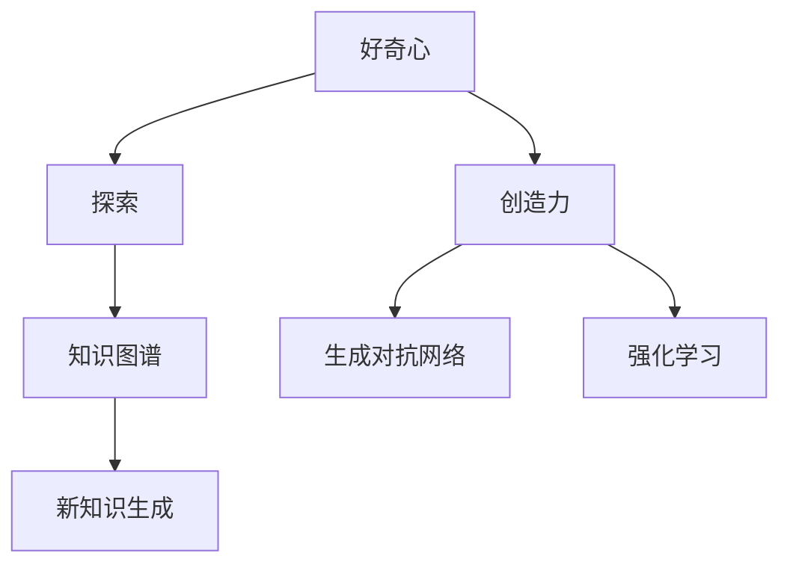

                 

# 好奇心与创造力：探索的双翼

## 1. 背景介绍

### 1.1 问题由来

在人工智能飞速发展的今天，好奇心与创造力成为了推动技术前进的双翼。无论是从学术界到产业界，从理论研究到工程实践，都在探索如何将人类的好奇心转化为创造力，推动机器学习和人工智能技术的边界不断拓展。

好奇心驱动了我们对未知事物的探索，而创造力则将这种探索转化为具体的产品和解决方案。在AI领域，好奇心与创造力的融合，推动了从深度学习模型、强化学习算法到自然语言处理技术的革新。

### 1.2 问题核心关键点

好奇心与创造力的核心在于如何构建一个能够不断学习和适应的智能系统，让其在面对复杂未知问题时，能够生成创新的解决方案。人工智能系统需要具备以下特点：

- **自适应能力**：能够通过环境反馈不断调整模型参数和算法策略，适应新的数据和任务。
- **探索能力**：能够主动探索数据和任务中的新模式和新结构，而不是被动接受输入。
- **创造能力**：能够基于已有知识，生成新的模式、新的结构、新的解决方案。

本文将聚焦于如何构建具备好奇心和创造力的人工智能系统，通过探索驱动创新，推动人工智能技术的不断发展。

## 2. 核心概念与联系

### 2.1 核心概念概述

为更好地理解好奇心与创造力在人工智能中的实现，本节将介绍几个密切相关的核心概念：

- **好奇心**：驱动AI系统主动探索未知数据和任务，生成新的数据结构和知识图谱。
- **创造力**：基于已有知识，生成新的数据结构、新的任务模式和新的解决方案。
- **探索与创造**：探索与创造是AI系统的两大核心能力，互为促进，共同推动AI系统的进步。
- **知识图谱**：表示实体间关系的图结构，是AI系统学习知识、生成新知识的基础。
- **生成对抗网络(GAN)**：一种生成模型，可以生成逼真的数据样本，用于数据增强和知识生成。
- **强化学习**：通过环境反馈指导模型优化，使模型能够自动调整策略，提升创造力。

这些核心概念之间的逻辑关系可以通过以下Mermaid流程图来展示：



这个流程图展示了好奇心与创造力在人工智能中的实现过程：

1. 好奇心驱动AI系统探索新的数据和任务。
2. 探索过程积累的知识形成知识图谱。
3. 创造力基于知识图谱生成新的数据结构、任务模式和解决方案。
4. 生成对抗网络和强化学习作为核心工具，进一步提升探索与创造能力。

## 3. 核心算法原理 & 具体操作步骤

### 3.1 算法原理概述

好奇心与创造力的实现，主要依赖于两大核心算法：探索算法和创造算法。探索算法用于主动发现数据和任务中的新模式，创造算法用于基于已有知识生成新的数据结构。

**探索算法**：基于生成对抗网络(GAN)和强化学习，使AI系统能够主动探索新的数据结构和任务模式。

**创造算法**：基于神经网络和生成对抗网络，使AI系统能够基于已有知识生成新的数据结构和任务模式。

### 3.2 算法步骤详解

**探索算法步骤**：

1. **数据准备**：收集和标注数据，构建数据集。
2. **模型选择**：选择适合探索的模型结构，如生成对抗网络(GAN)。
3. **训练优化**：在数据集上训练模型，优化生成对抗网络的损失函数，提升生成质量。
4. **探索结果评估**：使用评估指标（如Inception Score、FID等）评估探索结果。
5. **反馈优化**：根据评估结果调整模型参数，优化生成过程。

**创造算法步骤**：

1. **数据准备**：收集和标注数据，构建数据集。
2. **模型选择**：选择适合创造的模型结构，如生成对抗网络(GAN)和神经网络。
3. **训练优化**：在数据集上训练模型，优化生成对抗网络的损失函数，提升生成质量。
4. **创造结果评估**：使用评估指标（如BLEU、ROUGE等）评估创造结果。
5. **反馈优化**：根据评估结果调整模型参数，优化生成过程。

### 3.3 算法优缺点

好奇心与创造力算法具有以下优点：

- **自适应性强**：基于生成对抗网络和强化学习，能够自动适应新数据和任务。
- **生成效果逼真**：生成对抗网络能够生成高质量的生成样本，用于数据增强和知识生成。
- **多样性高**：基于神经网络和生成对抗网络，生成结果多样化，能够覆盖更多未知数据和任务。

但同时，这些算法也存在一些缺点：

- **计算成本高**：生成对抗网络和神经网络训练复杂，计算资源消耗大。
- **数据需求高**：需要大量高质量标注数据，数据获取成本高。
- **模型复杂度高**：模型结构复杂，参数多，难以调试和优化。

### 3.4 算法应用领域

好奇心与创造力算法在多个领域得到了广泛应用，例如：

- **自然语言处理(NLP)**：用于生成对话系统、文本摘要、机器翻译等。
- **计算机视觉(CV)**：用于生成图像、视频、音频等。
- **机器人学**：用于生成机器人行为策略、控制信号等。
- **游戏设计**：用于生成游戏地图、角色、任务等。
- **艺术创作**：用于生成艺术作品、音乐、文学作品等。

这些领域的应用展示了好奇心与创造力算法的多样性和广泛性。

## 4. 数学模型和公式 & 详细讲解 & 举例说明

### 4.1 数学模型构建

好奇心与创造力算法的数学模型构建，主要依赖于生成对抗网络和强化学习。生成对抗网络由生成器和判别器组成，其损失函数为：

$$
\mathcal{L} = \mathcal{L}_G + \mathcal{L}_D
$$

其中 $\mathcal{L}_G$ 为生成器损失函数， $\mathcal{L}_D$ 为判别器损失函数。

强化学习基于环境反馈，优化策略 $\pi$ 以最大化累计奖励，其数学模型为：

$$
\pi^* = \mathop{\arg\max}_{\pi} \mathbb{E}_{s_0\sim p_0} \sum_{t=0}^{\infty} \gamma^t \mathbb{E}_{a_t \sim \pi} [r_{t+1}]
$$

其中 $s_0$ 为初始状态， $r_{t+1}$ 为环境反馈奖励， $\gamma$ 为折扣因子。

### 4.2 公式推导过程

生成对抗网络的生成器损失函数 $\mathcal{L}_G$ 通常采用对抗性损失，其形式为：

$$
\mathcal{L}_G = \mathbb{E}_{x\sim p_x}[\log D(G(z))] + \mathbb{E}_{z\sim p_z}[\log (1-D(G(z))]
$$

其中 $D$ 为判别器， $G$ 为生成器， $z$ 为噪声向量， $p_x$ 为真实数据分布， $p_z$ 为噪声向量分布。

判别器的损失函数 $\mathcal{L}_D$ 也采用对抗性损失，其形式为：

$$
\mathcal{L}_D = \mathbb{E}_{x\sim p_x}[\log D(x)] + \mathbb{E}_{z\sim p_z}[\log (1-D(G(z)))
$$

强化学习的目标是在给定策略 $\pi$ 下，最大化累计奖励，其优化目标函数为：

$$
\mathcal{L} = \mathbb{E}_{s_0\sim p_0} \sum_{t=0}^{\infty} \gamma^t [r_{t+1} + \gamma V_{\pi}(s_{t+1})]
$$

其中 $V_{\pi}$ 为状态值函数， $s_{t+1}$ 为下一个状态。

### 4.3 案例分析与讲解

以生成对抗网络用于图像生成为例，其生成过程可以如下描述：

1. 生成器 $G$ 接收噪声向量 $z$，生成图像 $x$。
2. 判别器 $D$ 判断图像 $x$ 是否真实，返回概率 $p(x)$。
3. 生成器 $G$ 和判别器 $D$ 在损失函数 $\mathcal{L}$ 的指导下，相互竞争，优化生成图像的质量。

在训练过程中，生成器 $G$ 的目标是生成尽可能逼真的图像，而判别器 $D$ 的目标是区分真实图像和生成图像。最终，当 $G$ 生成的图像足以欺骗 $D$ 时，训练停止，生成器 $G$ 即获得了高质量的生成图像。

## 5. 项目实践：代码实例和详细解释说明

### 5.1 开发环境搭建

在进行好奇心与创造力算法实践前，我们需要准备好开发环境。以下是使用Python进行TensorFlow开发的环境配置流程：

1. 安装Anaconda：从官网下载并安装Anaconda，用于创建独立的Python环境。

2. 创建并激活虚拟环境：
```bash
conda create -n tf-env python=3.8 
conda activate tf-env
```

3. 安装TensorFlow：从官网获取对应的安装命令。例如：
```bash
conda install tensorflow -c conda-forge -c pytorch -c pypi
```

4. 安装Keras：
```bash
pip install keras
```

5. 安装Gym环境：
```bash
pip install gym
```

6. 安装其他工具包：
```bash
pip install numpy matplotlib scikit-learn tqdm jupyter notebook ipython
```

完成上述步骤后，即可在`tf-env`环境中开始实践。

### 5.2 源代码详细实现

下面以生成对抗网络用于图像生成为例，给出使用TensorFlow实现生成对抗网络的基本代码。

```python
import tensorflow as tf
from tensorflow.keras import layers

# 定义生成器
def make_generator_model():
    model = tf.keras.Sequential()
    model.add(layers.Dense(256, use_bias=False, input_shape=(100,)))
    model.add(layers.BatchNormalization())
    model.add(layers.LeakyReLU())
    model.add(layers.Dense(512))
    model.add(layers.BatchNormalization())
    model.add(layers.LeakyReLU())
    model.add(layers.Dense(1024))
    model.add(layers.BatchNormalization())
    model.add(layers.LeakyReLU())
    model.add(layers.Dense(784, activation='tanh'))
    return model

# 定义判别器
def make_discriminator_model():
    model = tf.keras.Sequential()
    model.add(layers.Flatten(input_shape=(28, 28, 1)))
    model.add(layers.Dense(1024))
    model.add(layers.LeakyReLU())
    model.add(layers.Dropout(0.2))
    model.add(layers.Dense(512))
    model.add(layers.LeakyReLU())
    model.add(layers.Dropout(0.2))
    model.add(layers.Dense(1, activation='sigmoid'))
    return model

# 定义生成对抗网络
def make_gan_model(generator, discriminator):
    model = tf.keras.Sequential()
    model.add(generator)
    model.add(discriminator)
    return model

# 定义损失函数
def make_loss():
    adversarial_loss = tf.keras.losses.BinaryCrossentropy(from_logits=True)
    def loss_fn_real(real_images, fake_images):
        real_outputs = discriminator(real_images, training=True)
        fake_outputs = discriminator(fake_images, training=True)
        real_loss = adversarial_loss(tf.ones_like(real_outputs), real_outputs)
        fake_loss = adversarial_loss(tf.zeros_like(fake_outputs), fake_outputs)
        return real_loss + fake_loss
    return loss_fn_real

# 定义训练步骤
def train_gan(generator, discriminator, loss_fn, dataset, epochs):
    discriminator_optimizer = tf.keras.optimizers.Adam(1e-4)
    generator_optimizer = tf.keras.optimizers.Adam(1e-4)
    for epoch in range(epochs):
        for image_batch in dataset:
            real_images = tf.cast(image_batch, tf.float32)
            real_images = (real_images / 255.0) - 0.5
            real_images = 2 * real_images
            with tf.GradientTape() as dtape:
                generated_images = generator(tf.random.normal([real_images.shape[0], 100]))
                real_outputs = discriminator(real_images, training=True)
                fake_outputs = discriminator(generated_images, training=True)
                loss = loss_fn(real_images, fake_images)
            gradients_of_generator = dtape.gradient(loss, generator.trainable_variables)
            gradients_of_discriminator = dtape.gradient(loss, discriminator.trainable_variables)
            generator_optimizer.apply_gradients(zip(gradients_of_generator, generator.trainable_variables))
            discriminator_optimizer.apply_gradients(zip(gradients_of_discriminator, discriminator.trainable_variables))
```

### 5.3 代码解读与分析

让我们再详细解读一下关键代码的实现细节：

**make_generator_model函数**：
- 定义生成器的神经网络结构，包含多个全连接层和激活函数。

**make_discriminator_model函数**：
- 定义判别器的神经网络结构，包含多个全连接层和激活函数。

**make_gan_model函数**：
- 将生成器和判别器连接起来，形成生成对抗网络。

**make_loss函数**：
- 定义生成对抗网络的损失函数，包含真实图像和生成图像的判别器输出损失。

**train_gan函数**：
- 定义生成对抗网络的训练步骤，包括生成器和判别器的优化器、损失函数和梯度计算。

## 6. 实际应用场景

### 6.1 智能游戏设计

基于好奇心与创造力算法的生成对抗网络，可以应用于智能游戏设计。通过生成对抗网络，自动生成游戏地图、角色、任务等，可以极大地提升游戏设计的效率和创新性。

具体而言，可以利用生成对抗网络生成各种游戏元素，通过自动设计游戏地图和角色，使得游戏设计更加多样化，同时提升游戏的可玩性和体验。

### 6.2 艺术创作

生成对抗网络在艺术创作中也得到了广泛应用，可以生成逼真的绘画、音乐、文学作品等。利用生成对抗网络，可以自动生成各种艺术作品，激发艺术家的创作灵感。

具体而言，艺术家可以通过指导生成对抗网络生成特定的艺术风格、主题等，自动生成各种艺术作品。这种技术的应用，不仅提升了艺术创作的效率，还为艺术家提供了更多的创作思路和素材。

### 6.3 个性化推荐

基于好奇心与创造力算法的生成对抗网络，可以应用于个性化推荐系统。通过生成对抗网络，自动生成推荐内容，可以提升推荐系统的准确性和多样性。

具体而言，推荐系统可以利用生成对抗网络生成各种推荐内容，自动匹配用户的兴趣和需求，提升推荐系统的推荐效果和用户满意度。

### 6.4 未来应用展望

随着生成对抗网络和强化学习技术的不断发展，基于好奇心与创造力算法的应用将更加广泛。未来的研究需要在以下几个方面寻求新的突破：

1. **多模态生成**：将生成对抗网络应用于多种模态数据，如图像、视频、音频等，提升生成效果的多样性和逼真度。
2. **大规模训练**：利用分布式训练技术，提升生成对抗网络的训练速度和效果，处理大规模数据集。
3. **交互生成**：引入交互式生成算法，提升生成对抗网络的生成效果，增强生成结果的可解释性和可控性。
4. **联合学习**：将生成对抗网络和强化学习联合应用，提升生成模型的适应性和鲁棒性，增强生成结果的稳定性和多样性。
5. **知识图谱**：利用生成对抗网络和强化学习生成知识图谱，提升生成对抗网络的生成效果，增强生成结果的可解释性和可控性。

这些方向的探索，将进一步推动生成对抗网络在人工智能中的应用，为人工智能系统的创新和发展提供新的动力。

## 7. 工具和资源推荐

### 7.1 学习资源推荐

为了帮助开发者系统掌握好奇心与创造力算法的理论基础和实践技巧，这里推荐一些优质的学习资源：

1. **生成对抗网络：理论到实践**：由深度学习专家撰写，深入浅出地介绍了生成对抗网络的理论基础和实际应用。

2. **强化学习：从零到一**：由强化学习专家撰写，系统介绍了强化学习的基本原理和常用算法，适合入门学习。

3. **深度学习实战**：由TensorFlow官方出版，介绍了TensorFlow的深度学习应用，包括生成对抗网络和强化学习等。

4. **Kaggle竞赛**：参加Kaggle竞赛，利用生成对抗网络和强化学习解决实际问题，积累实践经验。

5. **GitHub代码库**：利用GitHub上的生成对抗网络和强化学习项目，了解前沿技术和应用案例。

通过对这些资源的学习实践，相信你一定能够快速掌握生成对抗网络和强化学习算法的精髓，并用于解决实际的AI问题。

### 7.2 开发工具推荐

高效的开发离不开优秀的工具支持。以下是几款用于生成对抗网络和强化学习开发的常用工具：

1. **TensorFlow**：由Google主导开发的开源深度学习框架，支持生成对抗网络和强化学习等，具有强大的计算图和自动微分功能。

2. **PyTorch**：由Facebook主导开发的开源深度学习框架，灵活易用，支持生成对抗网络和强化学习等，是深度学习研究的主流框架。

3. **Keras**：基于TensorFlow和Theano开发的高级深度学习库，简单易用，支持生成对抗网络和强化学习等，适合快速原型开发。

4. **JAX**：Google推出的高效深度学习库，支持自动微分和分布式训练，适用于生成对抗网络和强化学习等复杂任务的开发。

5. **Gym环境**：OpenAI开发的强化学习环境，支持多种游戏和模拟环境，适合测试和评估强化学习算法。

合理利用这些工具，可以显著提升生成对抗网络和强化学习任务的开发效率，加快创新迭代的步伐。

### 7.3 相关论文推荐

生成对抗网络和强化学习技术的发展源于学界的持续研究。以下是几篇奠基性的相关论文，推荐阅读：

1. **Generative Adversarial Nets**（生成对抗网络原论文）：提出了生成对抗网络的框架，奠定了生成对抗网络的研究基础。

2. **Playing Atari with Deep Reinforcement Learning**：展示了深度强化学习在智能游戏中的应用，开启了AI在游戏中的研究。

3. **Deep Q-Networks**：提出了深度强化学习的Q-learning算法，在智能游戏中取得突破性进展。

4. **AlphaGo**：展示了深度强化学习在围棋游戏中的应用，取得了历史性胜利。

5. **Generative Adversarial Imitation Learning**：提出了生成对抗网络的模仿学习算法，提升了生成对抗网络的生成效果。

这些论文代表了大模型微调技术的发展脉络。通过学习这些前沿成果，可以帮助研究者把握学科前进方向，激发更多的创新灵感。

## 8. 总结：未来发展趋势与挑战

### 8.1 总结

本文对基于好奇心与创造力算法的生成对抗网络和强化学习进行了全面系统的介绍。首先阐述了好奇心与创造力算法的背景和意义，明确了生成对抗网络和强化学习在AI系统中的核心地位。其次，从原理到实践，详细讲解了生成对抗网络和强化学习的数学原理和关键步骤，给出了生成对抗网络的基本代码实例。同时，本文还广泛探讨了生成对抗网络和强化学习在智能游戏、艺术创作、个性化推荐等诸多领域的应用前景，展示了生成对抗网络和强化学习的多样性和广泛性。

通过本文的系统梳理，可以看到，基于好奇心与创造力算法的生成对抗网络和强化学习技术正在成为AI领域的重要范式，极大地拓展了AI系统的应用边界，催生了更多的落地场景。未来，伴随生成对抗网络和强化学习方法的持续演进，相信AI技术必将在更广阔的应用领域大放异彩，深刻影响人类的生产生活方式。

### 8.2 未来发展趋势

展望未来，生成对抗网络和强化学习技术将呈现以下几个发展趋势：

1. **多模态生成**：将生成对抗网络应用于多种模态数据，如图像、视频、音频等，提升生成效果的多样性和逼真度。
2. **大规模训练**：利用分布式训练技术，提升生成对抗网络的训练速度和效果，处理大规模数据集。
3. **交互生成**：引入交互式生成算法，提升生成对抗网络的生成效果，增强生成结果的可解释性和可控性。
4. **联合学习**：将生成对抗网络和强化学习联合应用，提升生成模型的适应性和鲁棒性，增强生成结果的稳定性和多样性。
5. **知识图谱**：利用生成对抗网络和强化学习生成知识图谱，提升生成对抗网络的生成效果，增强生成结果的可解释性和可控性。

以上趋势凸显了生成对抗网络和强化学习技术的广阔前景。这些方向的探索发展，必将进一步提升生成对抗网络和强化学习算法的性能和应用范围，为人工智能系统的创新和发展提供新的动力。

### 8.3 面临的挑战

尽管生成对抗网络和强化学习技术已经取得了瞩目成就，但在迈向更加智能化、普适化应用的过程中，它仍面临着诸多挑战：

1. **计算成本高**：生成对抗网络和强化学习训练复杂，计算资源消耗大。
2. **数据需求高**：需要大量高质量标注数据，数据获取成本高。
3. **模型复杂度高**：模型结构复杂，参数多，难以调试和优化。
4. **生成结果多样性不足**：生成结果多样性不足，缺乏创新性。
5. **模型稳定性差**：生成对抗网络和强化学习模型稳定性差，容易过拟合。

### 8.4 研究展望

面对生成对抗网络和强化学习所面临的这些挑战，未来的研究需要在以下几个方面寻求新的突破：

1. **多模态生成**：提升生成对抗网络和强化学习模型在多种模态数据上的生成效果，增强生成结果的多样性和逼真度。
2. **大规模训练**：利用分布式训练技术，提升生成对抗网络和强化学习模型的训练速度和效果，处理大规模数据集。
3. **交互生成**：引入交互式生成算法，提升生成对抗网络和强化学习模型的生成效果，增强生成结果的可解释性和可控性。
4. **联合学习**：将生成对抗网络和强化学习模型联合应用，提升生成模型的适应性和鲁棒性，增强生成结果的稳定性和多样性。
5. **知识图谱**：利用生成对抗网络和强化学习模型生成知识图谱，提升生成对抗网络和强化学习模型的生成效果，增强生成结果的可解释性和可控性。

这些研究方向的探索，必将引领生成对抗网络和强化学习技术的不断发展，推动人工智能系统的进步。

## 9. 附录：常见问题与解答

**Q1：生成对抗网络和强化学习是否适用于所有AI任务？**

A: 生成对抗网络和强化学习在大多数AI任务上都能取得不错的效果，特别是对于需要生成和优化决策的任务。但对于一些特定领域的任务，如医学、法律等，仅仅依靠生成对抗网络和强化学习可能难以很好地适应。此时需要在特定领域语料上进一步训练，再进行微调，才能获得理想效果。此外，对于一些需要时效性、个性化很强的任务，如对话、推荐等，生成对抗网络和强化学习也需要针对性的改进优化。

**Q2：如何缓解生成对抗网络和强化学习过程中的过拟合问题？**

A: 过拟合是生成对抗网络和强化学习面临的主要挑战，尤其是在标注数据不足的情况下。常见的缓解策略包括：
1. 数据增强：通过回译、近义替换等方式扩充训练集
2. 正则化：使用L2正则、Dropout、Early Stopping等避免过拟合
3. 对抗训练：引入对抗样本，提高模型鲁棒性
4. 参数高效微调：只调整少量参数(如Adapter、Prefix等)，减小过拟合风险
5. 多模型集成：训练多个生成对抗网络和强化学习模型，取平均输出，抑制过拟合

这些策略往往需要根据具体任务和数据特点进行灵活组合。只有在数据、模型、训练、推理等各环节进行全面优化，才能最大限度地发挥生成对抗网络和强化学习算法的威力。

**Q3：生成对抗网络和强化学习在落地部署时需要注意哪些问题？**

A: 将生成对抗网络和强化学习模型转化为实际应用，还需要考虑以下因素：
1. 模型裁剪：去除不必要的层和参数，减小模型尺寸，加快推理速度
2. 量化加速：将浮点模型转为定点模型，压缩存储空间，提高计算效率
3. 服务化封装：将模型封装为标准化服务接口，便于集成调用
4. 弹性伸缩：根据请求流量动态调整资源配置，平衡服务质量和成本
5. 监控告警：实时采集系统指标，设置异常告警阈值，确保服务稳定性
6. 安全防护：采用访问鉴权、数据脱敏等措施，保障数据和模型安全

生成对抗网络和强化学习技术需要在多方面进行优化，才能真正实现智能化应用。

---

作者：禅与计算机程序设计艺术 / Zen and the Art of Computer Programming

