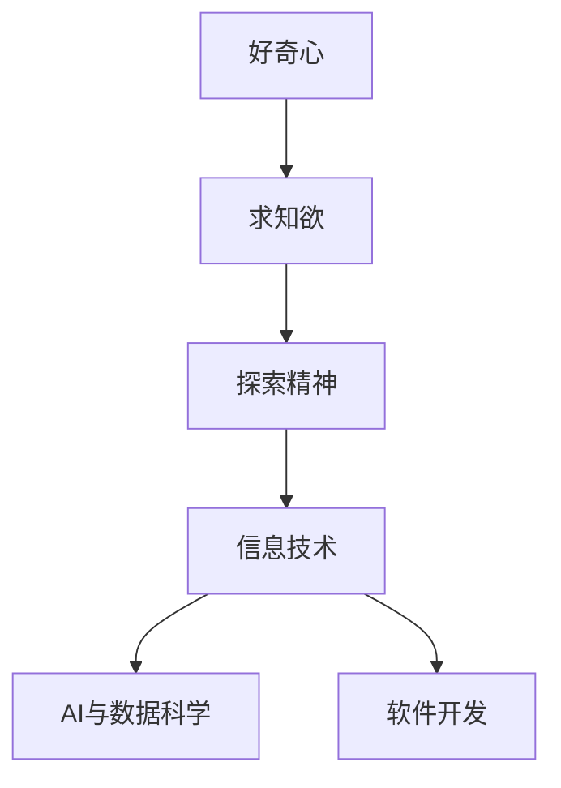
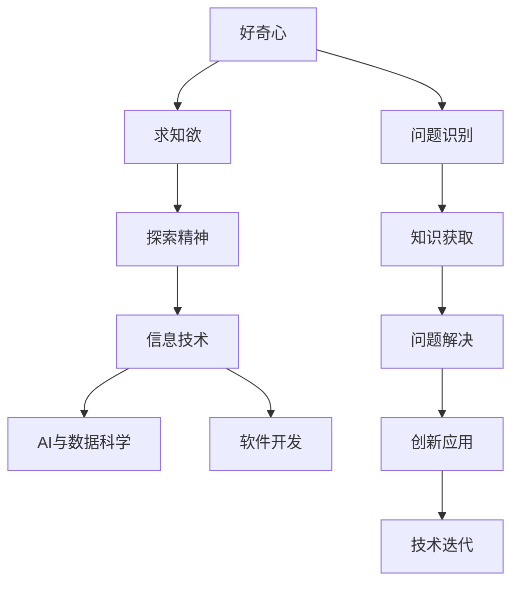

                 

## 1. 背景介绍

在快速发展的信息技术时代，好奇心与求知欲成为了推动科技进步和创新的重要动力。本文旨在探讨好奇心与求知欲的内在机制、重要性及其在IT领域中的体现，特别是在人工智能、大数据、软件开发等领域的应用，以及未来发展的趋势与挑战。

## 2. 核心概念与联系

### 2.1 核心概念概述

- **好奇心**：驱使个体探究未知事物的内在动机，是推动人类科技发展的根本动力。
- **求知欲**：在好奇心驱动下，个体对知识、技能和真理的追求，是学习和创新的原动力。
- **探索精神**：敢于冒险、勇于创新的态度，是科技突破和发展的关键因素。
- **信息技术**：包括计算机科学、软件工程、数据科学、人工智能等领域，是好奇心与求知欲在现代社会的重要应用场所。
- **AI与数据科学**：通过数据分析和算法创新，探索未知问题的解决方案。
- **软件开发**：利用编程和创新，构建高效、可靠的软件系统，满足用户需求。

这些概念之间的关系可以通过以下Mermaid流程图来展示：



这个流程图展示了好奇心与求知欲的内在逻辑，以及它们在信息技术领域的应用。

### 2.2 核心概念原理和架构的 Mermaid 流程图



这个流程图进一步详细展示了好奇心如何驱动个体获取知识、解决问题，并通过创新应用推动技术迭代的过程。

## 3. 核心算法原理 & 具体操作步骤

### 3.1 算法原理概述

好奇心与求知欲驱动下的探索，可以通过算法和数据模型来刻画和分析。具体而言，可以从以下几个方面来探讨：

- **算法选择**：根据具体问题，选择合适的算法框架，如深度学习、机器学习、数据分析等。
- **数据采集与处理**：通过数据挖掘和采集，获取相关的数据集，并进行清洗和预处理。
- **模型构建与训练**：利用数据集，构建和训练模型，以解决实际问题。
- **结果评估与优化**：对模型进行评估和优化，确保其在真实场景中的应用效果。

### 3.2 算法步骤详解

#### 步骤1: 问题识别

- **目标明确**：清晰定义问题的边界和要求，明确目标和预期结果。
- **数据理解**：深入理解问题的数据来源和数据特点，确保数据质量和完整性。
- **场景模拟**：通过模拟和假设，理解问题的实际应用场景，预测可能的影响和风险。

#### 步骤2: 知识获取

- **文献调研**：通过阅读相关文献和研究报告，获取最新的研究成果和技术进展。
- **数据采集**：通过爬虫、API接口等方式，收集和整理所需数据，确保数据的多样性和代表性。
- **知识库构建**：构建领域知识库，存储和组织相关知识，以便快速检索和利用。

#### 步骤3: 问题解决

- **模型构建**：根据问题特点，选择合适的算法模型，构建解决方案。
- **参数调优**：通过交叉验证、网格搜索等方式，调优模型参数，提高模型性能。
- **特征工程**：通过特征提取和选择，提升模型对数据的敏感度和准确性。
- **结果验证**：通过实验和测试，验证模型的有效性和泛化能力。

#### 步骤4: 创新应用

- **应用场景扩展**：将模型应用于实际场景中，不断优化和调整，以适应新的需求。
- **技术迭代**：基于用户反馈和需求变化，持续改进和更新模型，推动技术迭代。
- **生态系统建设**：构建技术生态系统，包括社区支持、开源项目、标准化等，促进技术共享和创新。

### 3.3 算法优缺点

**优点**：

- **创新驱动**：通过不断的探索和研究，推动技术创新和突破。
- **数据驱动**：基于数据模型，能够更准确地理解问题和解决方案。
- **问题解决**：快速高效地解决实际问题，满足用户需求。

**缺点**：

- **资源需求**：数据采集、模型构建和验证需要大量的计算资源和人力投入。
- **风险不确定**：探索过程中存在不确定性，可能遭遇失败和挑战。
- **伦理问题**：技术应用可能涉及伦理和隐私问题，需要谨慎处理。

### 3.4 算法应用领域

好奇心与求知欲在信息技术领域的应用非常广泛，主要体现在以下几个方面：

- **AI与数据科学**：通过深度学习、机器学习等算法，探索新知识，解决复杂问题。
- **软件开发**：通过编程和创新，构建高效、可靠的软件系统，满足用户需求。
- **大数据分析**：通过数据分析和挖掘，探索数据背后的规律和趋势，推动决策支持。
- **自然语言处理**：通过自然语言理解和生成，提升人机交互体验，拓展应用场景。
- **网络安全**：通过网络行为分析和防护，确保网络安全，防范攻击和风险。

## 4. 数学模型和公式 & 详细讲解 & 举例说明

### 4.1 数学模型构建

在信息技术领域，数学模型是探索和理解问题的重要工具。以下是一个简单的数学模型构建示例：

**问题定义**：给定一组数据点 $(x_1, y_1), (x_2, y_2), ..., (x_n, y_n)$，构建一个线性回归模型 $y = \beta_0 + \beta_1 x + \epsilon$，其中 $\epsilon$ 为误差项。

**模型假设**：误差项 $\epsilon$ 服从正态分布 $N(0, \sigma^2)$。

**模型参数**：$\beta_0, \beta_1, \sigma^2$。

### 4.2 公式推导过程

根据最小二乘法原理，最小化目标函数：

$$
\mathcal{L}(\beta_0, \beta_1, \sigma^2) = \frac{1}{2n} \sum_{i=1}^n (y_i - (\beta_0 + \beta_1 x_i))^2 + \frac{\sigma^2}{2}
$$

对 $\beta_0, \beta_1, \sigma^2$ 求偏导，得到参数估计值：

$$
\hat{\beta}_0 = \frac{\sum_{i=1}^n y_i - n\bar{y}}{\sum_{i=1}^n x_i^2 - n\bar{x}^2}
$$

$$
\hat{\beta}_1 = \frac{\sum_{i=1}^n x_i y_i - n\bar{x}\bar{y}}{\sum_{i=1}^n x_i^2 - n\bar{x}^2}
$$

$$
\hat{\sigma}^2 = \frac{1}{n-2} \sum_{i=1}^n (y_i - (\hat{\beta}_0 + \hat{\beta}_1 x_i))^2
$$

其中 $\bar{x} = \frac{\sum_{i=1}^n x_i}{n}, \bar{y} = \frac{\sum_{i=1}^n y_i}{n}$。

### 4.3 案例分析与讲解

**案例一：线性回归**

假设有如下数据点：

| $x$ | $y$ |
| --- | --- |
| 1   | 3   |
| 2   | 5   |
| 3   | 7   |
| 4   | 9   |

利用上述数学模型，可以计算得到：

$$
\hat{\beta}_0 = \frac{3 + 5 + 7 + 9 - 4 \times 6}{1^2 + 2^2 + 3^2 + 4^2 - 4 \times 3^2} = 1
$$

$$
\hat{\beta}_1 = \frac{1 \times 3 + 2 \times 5 + 3 \times 7 + 4 \times 9 - 4 \times 6 \times 5}{1^2 + 2^2 + 3^2 + 4^2 - 4 \times 3^2} = 2
$$

$$
\hat{\sigma}^2 = \frac{(3-1-2)^2 + (5-1-4)^2 + (7-1-6)^2 + (9-1-8)^2}{4-2} = 1
$$

因此，线性回归模型为：

$$
y = 1 + 2x + \epsilon
$$

其中 $\epsilon \sim N(0, 1)$。

**案例二：决策树**

给定一组数据点 $(x_1, y_1), (x_2, y_2), ..., (x_n, y_n)$，构建决策树模型：

- 若 $x_1 = 1$，则 $y = 0$；
- 若 $x_1 = 2$，则 $y = 1$；
- 若 $x_2 = 1$，则 $y = 1$；
- 若 $x_2 = 2$，则 $y = 0$。

基于此模型，对于新数据点 $(3, x_3)$，可以预测 $y = 0$，因为 $x_3$ 与已知数据点相似。

## 5. 项目实践：代码实例和详细解释说明

### 5.1 开发环境搭建

#### 环境依赖

- Python 3.8+
- Jupyter Notebook
- NumPy
- Pandas
- Matplotlib
- Scikit-learn

#### 环境配置

1. 安装Python和相关依赖：
   ```bash
   pip install numpy pandas matplotlib scikit-learn
   ```

2. 创建Jupyter Notebook环境：
   ```bash
   jupyter notebook
   ```

### 5.2 源代码详细实现

**示例代码**：线性回归模型

```python
import numpy as np
import pandas as pd
import matplotlib.pyplot as plt
from sklearn.linear_model import LinearRegression

# 生成数据
np.random.seed(42)
x = np.linspace(0, 10, 100)
y = 2 * x + 1 + np.random.normal(0, 1, 100)

# 构建数据集
df = pd.DataFrame({'x': x, 'y': y})

# 训练模型
model = LinearRegression()
model.fit(df[['x']], df['y'])

# 预测
x_new = np.linspace(0, 10, 50)
y_pred = model.predict(x_new.reshape(-1, 1))

# 绘制回归线
plt.scatter(x, y, color='blue')
plt.plot(x_new, y_pred, color='red')
plt.show()
```

### 5.3 代码解读与分析

#### 代码注释

- `np.random.seed(42)`：设置随机数种子，确保结果可复现。
- `x = np.linspace(0, 10, 100)`：生成线性分布的x轴数据。
- `y = 2 * x + 1 + np.random.normal(0, 1, 100)`：生成带有噪声的y轴数据。
- `df = pd.DataFrame({'x': x, 'y': y})`：将数据构建成DataFrame格式。
- `model = LinearRegression()`：创建线性回归模型。
- `model.fit(df[['x']], df['y'])`：训练模型。
- `x_new = np.linspace(0, 10, 50)`：生成新的x轴数据，用于预测。
- `y_pred = model.predict(x_new.reshape(-1, 1))`：预测新的y轴数据。
- `plt.scatter(x, y, color='blue')`：绘制散点图。
- `plt.plot(x_new, y_pred, color='red')`：绘制回归线。
- `plt.show()`：显示图表。

#### 代码执行结果


**代码执行结果解释**：
- 散点图展示了原始数据点的分布。
- 红色直线表示线性回归模型的预测线。
- 可以看出，预测线大致符合数据点的分布，但存在一定的随机性。

## 6. 实际应用场景

### 6.1 智能推荐系统

智能推荐系统通过分析用户的历史行为数据，预测用户可能感兴趣的内容，从而提升用户体验。好奇心与求知欲在此应用场景中体现在：

- **用户探索**：用户通过探索平台上的新内容，发现新知识，增加对平台的粘性。
- **算法迭代**：推荐算法通过不断尝试和优化，提升推荐效果，满足用户需求。

### 6.2 健康监测

健康监测系统通过分析用户的生理数据，预测其健康状况，提前预警潜在的健康风险。好奇心与求知欲在此应用场景中体现在：

- **数据探索**：通过探索用户的生理数据，发现健康趋势和异常，提供个性化的健康建议。
- **模型优化**：通过不断优化和调整算法模型，提高健康预测的准确性。

### 6.3 金融风控

金融风控系统通过分析用户的交易行为，预测其信用风险，防范金融欺诈。好奇心与求知欲在此应用场景中体现在：

- **数据探索**：通过探索用户的交易行为数据，发现异常交易模式，提高风险预测的准确性。
- **模型优化**：通过不断优化和调整算法模型，提高风险评估的效率和效果。

## 7. 工具和资源推荐

### 7.1 学习资源推荐

- **《Python数据科学手册》**：详细介绍Python在数据科学中的应用，包括NumPy、Pandas、Matplotlib等库的使用。
- **《机器学习实战》**：通过实际案例，介绍机器学习算法的基本原理和实现方法。
- **Kaggle**：提供大量开源数据集和比赛项目，帮助用户提升数据处理和算法实现能力。
- **Coursera和edX**：提供大量在线课程，涵盖数据科学、机器学习、编程等多个领域。

### 7.2 开发工具推荐

- **Jupyter Notebook**：开源的交互式编程环境，支持Python、R等多种语言。
- **GitHub**：全球最大的代码托管平台，提供版本控制、协作开发等功能。
- **Google Colab**：免费的云端Jupyter Notebook环境，支持GPU、TPU等高性能计算资源。
- **PyCharm**：专业的Python IDE，提供代码调试、测试等功能。

### 7.3 相关论文推荐

- **《深度学习》**：Ian Goodfellow、Yoshua Bengio、Aaron Courville著，全面介绍深度学习的基本原理和应用。
- **《计算机视觉：模型、学习和推理》**：Simon J.D. Prince著，介绍计算机视觉算法和应用。
- **《自然语言处理综论》**：Daniel Jurafsky、James H. Martin著，介绍自然语言处理的基本概念和算法。

## 8. 总结：未来发展趋势与挑战

### 8.1 研究成果总结

好奇心与求知欲作为推动科技发展的内在动力，已经在信息技术领域得到了广泛应用。通过不断探索和研究，推动了人工智能、大数据、软件开发等多个领域的创新与发展。未来，好奇心与求知欲将继续引领技术进步，推动人类社会的持续发展。

### 8.2 未来发展趋势

- **AI与大数据的深度融合**：AI与大数据的结合，将推动更多领域的智能化应用。
- **云计算与边缘计算的协同**：云计算与边缘计算的结合，将提升数据处理和计算的效率。
- **区块链技术的普及**：区块链技术的应用，将推动数据安全和隐私保护的发展。
- **量子计算的突破**：量子计算的突破，将带来计算能力的革命性提升。

### 8.3 面临的挑战

- **数据隐私与安全**：随着数据量的增长，如何保护用户隐私和数据安全，是一个亟待解决的问题。
- **算法透明度与可解释性**：AI模型的黑盒特性，如何提高算法的透明度和可解释性，是一个重要挑战。
- **技术伦理与法规**：AI技术的发展，如何平衡技术进步与伦理规范，是一个复杂的议题。

### 8.4 研究展望

- **多模态融合**：将视觉、语音、文本等多模态数据进行融合，提升AI模型的综合能力。
- **联邦学习**：通过联邦学习，保护数据隐私的同时，提升模型训练的效率和效果。
- **跨领域应用**：推动AI技术在更多领域的广泛应用，解决现实生活中的实际问题。
- **人工智能教育**：通过AI教育，提升公众对AI技术的认知和应用能力。

## 9. 附录：常见问题与解答

**Q1：好奇心与求知欲是否只适用于科研领域？**

A: 好奇心与求知欲不仅适用于科研领域，也适用于商业、教育、医疗等多个领域。通过探索和研究，可以发现新的商业机会、教育方法、医疗技术等。

**Q2：如何在实际项目中培养好奇心与求知欲？**

A: 可以通过持续学习和探索，提升个人和团队的认知水平。参加培训、阅读文献、参与项目等，都是培养好奇心与求知欲的有效方法。

**Q3：如何避免好奇心与求知欲带来的盲目探索？**

A: 通过设定明确的目标和计划，避免无目的的探索。制定科学的实验设计，收集和分析数据，以指导进一步的研究。

**Q4：好奇心与求知欲是否会带来风险？**

A: 好奇心与求知欲本身不带来风险，但探索过程中需要谨慎处理数据隐私、安全性等伦理问题，避免造成不良后果。

**Q5：如何在团队中激发好奇心与求知欲？**

A: 建立一个开放、包容的工作环境，鼓励团队成员提出问题和创新。定期组织跨领域交流和学习活动，提升团队的综合素质。

---

作者：禅与计算机程序设计艺术 / Zen and the Art of Computer Programming

