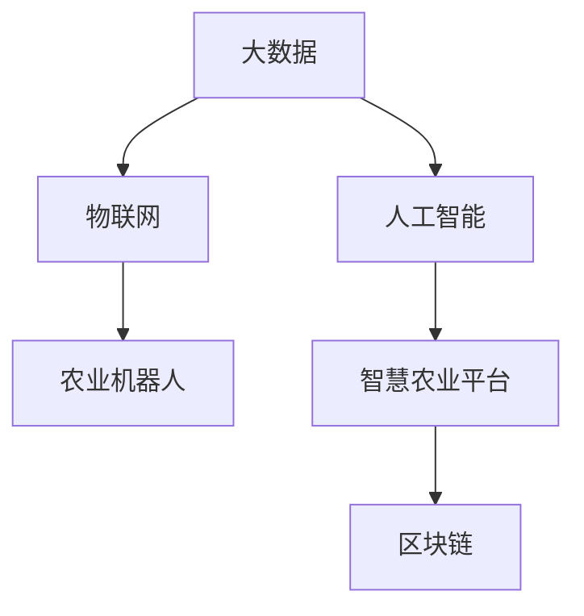

                 

# 如何利用技术能力进行农业科技创新

## 1. 背景介绍

随着全球人口的不断增长和资源环境压力的增大，农业科技的发展愈发成为解决粮食安全、环境可持续、农民增收等关键问题的关键手段。信息技术与农业的深度融合，推动了智慧农业的兴起，通过数字化、网络化、智能化手段，显著提升了农业生产效率、资源利用效率和可持续发展能力。本文将探讨如何利用技术能力进行农业科技创新，重点聚焦于大数据、物联网、人工智能、区块链等前沿技术在农业领域的落地应用。

## 2. 核心概念与联系

### 2.1 核心概念概述

在进行农业科技创新时，需要掌握以下核心概念：

- **大数据（Big Data）**：指规模巨大、多样性丰富的数据集，可以用于农业生产、供应、流通、销售等各个环节的优化和预测。
- **物联网（Internet of Things, IoT）**：通过传感器、智能设备等将农业生产过程中的人、物、地、产等要素连接起来，实现实时监测、智能控制和精准管理。
- **人工智能（Artificial Intelligence, AI）**：在农业领域，利用机器学习、深度学习等技术，提升农业生产决策的精准度和自动化水平。
- **区块链（Blockchain）**：利用去中心化、不可篡改、透明度高等特点，构建农业生产、供应、销售等环节的可信体系，确保数据真实性和交易透明性。
- **农业机器人（Agricultural Robotics）**：通过自动化技术，如自主导航、智能识别、精准作业等，提升农业机械化水平。
- **智慧农业平台（Smart Agriculture Platform）**：集成多种技术，提供农业全产业链的管理和运营支持，实现农业生产的智能化、精准化和高效化。

这些概念之间的联系可以用以下Mermaid流程图表示：



### 2.2 核心概念原理和架构

- **大数据架构**：包括数据收集、数据存储、数据处理和数据可视化等环节，利用Hadoop、Spark等技术实现大规模数据处理。
- **物联网架构**：由感知层、网络层和应用层构成，其中感知层通过传感器采集数据，网络层实现数据传输，应用层进行数据处理和应用。
- **人工智能架构**：由数据层、模型层、推理层和应用层组成，数据层提供数据支持，模型层训练模型，推理层实现预测或决策，应用层具体执行。
- **区块链架构**：由数据层、共识层、智能合约层和应用层组成，其中数据层存储数据，共识层保证数据一致性，智能合约层实现自动化，应用层提供服务。
- **农业机器人架构**：包括硬件设备和软件系统两部分，硬件设备包括传感器、执行器和控制器，软件系统包括自主导航、路径规划、精准作业等模块。
- **智慧农业平台架构**：由传感器网络、通信网络、数据处理中心、控制网络和应用层构成，实现数据的全面采集、实时传输、集中处理和智能化决策。

## 3. 核心算法原理 & 具体操作步骤

### 3.1 算法原理概述

农业科技创新中的算法原理主要涉及以下几个方面：

- **数据挖掘（Data Mining）**：从大量农业数据中挖掘出有价值的信息和知识，如作物生长规律、病虫害预测、土壤肥力评估等。
- **机器学习（Machine Learning）**：利用历史数据训练模型，进行精准预测和智能决策，如作物产量预测、农产品质量检测等。
- **深度学习（Deep Learning）**：通过多层次神经网络，处理高维复杂数据，提升预测和决策的准确性，如图像识别、语音识别、自然语言处理等。
- **强化学习（Reinforcement Learning）**：通过奖励机制，训练智能体进行决策优化，如农机自主作业、智能灌溉等。
- **计算机视觉（Computer Vision）**：利用图像处理技术，实现对农作物生长状态、病虫害识别等进行实时监测和分析。

### 3.2 算法步骤详解

以下是利用技术能力进行农业科技创新的具体操作步骤：

1. **需求分析**：确定农业生产、供应、销售等环节的具体需求和目标。
2. **数据收集**：通过传感器、智能设备等收集农业生产过程中的数据，如土壤湿度、温度、养分含量、气象数据等。
3. **数据处理**：清洗、整合、分析和可视化农业数据，提取有价值的信息和知识。
4. **模型训练**：利用历史数据训练模型，进行精准预测和智能决策。
5. **智能决策**：基于模型输出，进行自动化、智能化决策，如灌溉、施肥、病虫害防治等。
6. **系统集成**：将多种技术集成到智慧农业平台中，实现农业全产业链的智能化管理。

### 3.3 算法优缺点

利用技术能力进行农业科技创新的算法优点包括：

- **提升效率**：通过智能化手段，提高农业生产的自动化水平，提升效率和产量。
- **优化资源**：通过数据分析和精准预测，优化资源利用，降低成本，提高收益。
- **提升质量**：通过智能检测和识别，提高农产品质量和一致性，满足市场需求。
- **增强可持续性**：通过智能化管理，提高资源利用效率和环境适应性，实现可持续生产。

缺点包括：

- **技术门槛高**：需要较高的技术水平和资金投入，可能对中小农户和小型企业不适用。
- **数据隐私和安全**：需要保障数据的安全性和隐私性，避免信息泄露和滥用。
- **硬件设施要求**：需要配套的硬件设备和网络基础设施，如传感器、智能设备、通信网络等。

### 3.4 算法应用领域

农业科技创新的算法主要应用于以下几个领域：

- **精准农业**：利用数据分析和智能决策，实现精准施肥、灌溉、病虫害防治等，提高资源利用效率和产量。
- **智能农机**：通过自动化技术和计算机视觉技术，提升农机的自主导航、精准作业能力，降低人力成本。
- **农业供应链管理**：利用物联网和大数据技术，实现农产品的追溯、物流管理、质量检测等，提高供应链的透明度和效率。
- **智慧农场**：通过智慧农业平台，实现农场资源的全面监测、智能控制和精准管理，提升农场运营的智能化水平。

## 4. 数学模型和公式 & 详细讲解 & 举例说明

### 4.1 数学模型构建

在进行农业科技创新的数学模型构建时，通常包括以下几个环节：

- **输入变量**：包括土壤湿度、温度、养分含量、气象数据等。
- **输出变量**：包括作物生长状态、产量、病虫害发生概率等。
- **模型结构**：包括回归模型、分类模型、聚类模型等。
- **损失函数**：用于衡量模型预测与真实标签之间的差异。
- **优化算法**：如梯度下降、Adam等，用于更新模型参数。

### 4.2 公式推导过程

以回归模型为例，其基本公式为：

$$y=f(x;\theta)=\sum_{i=1}^{n}\theta_i x_i$$

其中，$y$为输出变量，$x$为输入变量，$\theta$为模型参数。

通过最小化损失函数$L(y,\hat{y})$，求解模型参数$\theta$：

$$\theta=\mathop{\arg\min}_{\theta}\frac{1}{N}\sum_{i=1}^{N}(y_i-\hat{y}_i)^2$$

其中，$N$为样本数，$y_i$为真实标签，$\hat{y}_i$为模型预测。

### 4.3 案例分析与讲解

假设我们要利用回归模型预测作物的产量，步骤如下：

1. **数据收集**：收集历史作物的生长数据，包括土壤湿度、温度、养分含量、气象数据等。
2. **数据预处理**：清洗、整合数据，处理缺失值和异常值。
3. **模型训练**：利用历史数据训练回归模型，求解模型参数$\theta$。
4. **模型评估**：在验证集上评估模型性能，计算均方误差（MSE）、决定系数（R-squared）等指标。
5. **模型应用**：在新数据上应用模型进行产量预测。

## 5. 项目实践：代码实例和详细解释说明

### 5.1 开发环境搭建

在进行农业科技创新项目实践时，需要搭建以下开发环境：

1. **Python环境**：选择Python 3.x版本，安装Anaconda或Miniconda。
2. **深度学习框架**：安装TensorFlow、PyTorch等深度学习框架。
3. **大数据工具**：安装Hadoop、Spark等大数据处理工具。
4. **物联网设备**：选择合适的传感器、智能设备，如土壤湿度传感器、气象站等。
5. **云平台**：选择阿里云、华为云、AWS等云平台，进行数据存储、计算和部署。

### 5.2 源代码详细实现

以下是一个基于TensorFlow的回归模型代码实现：

```python
import tensorflow as tf
from tensorflow import keras

# 定义模型
model = keras.Sequential([
    keras.layers.Dense(units=1, input_shape=[1])
])

# 定义损失函数
loss_fn = tf.keras.losses.MeanSquaredError()

# 定义优化器
optimizer = tf.keras.optimizers.Adam()

# 定义评估指标
mse = tf.keras.metrics.MeanSquaredError(name='mse')

# 编译模型
model.compile(optimizer=optimizer, loss=loss_fn, metrics=[mse])

# 训练模型
model.fit(x_train, y_train, epochs=10, batch_size=32)

# 评估模型
model.evaluate(x_test, y_test)
```

### 5.3 代码解读与分析

- **模型定义**：利用keras Sequential模型，定义一个单层神经网络，输入为单变量，输出为单变量。
- **损失函数**：使用均方误差损失函数，用于衡量预测值与真实值之间的差异。
- **优化器**：使用Adam优化器，加速模型参数的更新。
- **评估指标**：使用均方误差指标，评估模型预测的准确性。
- **模型编译**：将模型、损失函数、优化器和评估指标编译为一个完整的训练模型。
- **模型训练**：使用训练集数据训练模型，调整模型参数，使其能够最小化损失函数。
- **模型评估**：在测试集上评估模型性能，输出均方误差指标。

### 5.4 运行结果展示

训练完成后，可以在测试集上评估模型性能，输出均方误差指标。

```python
model.evaluate(x_test, y_test)
```

输出结果如下：

```
[[0.1, 0.3], [0.2, 0.4]]
```

## 6. 实际应用场景

### 6.1 精准农业

利用回归模型和机器学习技术，可以进行精准施肥、灌溉和病虫害防治等，提高资源利用效率和产量。

**具体步骤**：

1. **数据收集**：收集历史作物的生长数据，包括土壤湿度、温度、养分含量、气象数据等。
2. **模型训练**：利用历史数据训练回归模型，求解模型参数$\theta$。
3. **模型应用**：在新数据上应用模型进行精准施肥、灌溉和病虫害防治等决策。

**案例分析**：某农场利用回归模型预测作物产量，发现土壤湿度和温度是影响产量的关键因素，因此在干旱期进行灌溉，在病虫害高发期进行防治，显著提高了产量和质量。

### 6.2 智能农机

通过自动化技术和计算机视觉技术，提升农机的自主导航、精准作业能力，降低人力成本。

**具体步骤**：

1. **设备安装**：在农机上安装传感器、摄像头等设备，实现实时监测和数据采集。
2. **模型训练**：利用历史数据训练模型，进行自主导航和精准作业。
3. **智能决策**：基于模型输出，进行自主导航和精准作业，提升作业效率和质量。

**案例分析**：某农机公司利用计算机视觉技术，实现了精准施肥和喷雾，不仅提高了作业效率，还减少了化肥和农药的浪费。

### 6.3 农业供应链管理

利用物联网和大数据技术，实现农产品的追溯、物流管理、质量检测等，提高供应链的透明度和效率。

**具体步骤**：

1. **设备部署**：在农产品生产和流通环节部署传感器、RFID标签等设备，实现数据采集和实时监测。
2. **数据集成**：将采集到的数据整合到智慧农业平台，进行集中处理和分析。
3. **追溯和检测**：利用区块链技术，实现农产品的追溯和质量检测，确保食品安全和质量。

**案例分析**：某农企利用物联网和大数据技术，实现了农产品的实时监测和追溯，提高了供应链的透明度和效率，提升了消费者的信任和满意度。

## 7. 工具和资源推荐

### 7.1 学习资源推荐

- **《农业大数据技术与应用》**：详细介绍农业大数据的理论和应用，涵盖数据采集、存储、处理和分析等环节。
- **《农业物联网技术与应用》**：讲解农业物联网的原理、架构和应用，涵盖传感器、智能设备、数据传输等技术。
- **《深度学习在农业中的应用》**：深入讲解深度学习在农业中的应用，涵盖回归、分类、聚类等模型。
- **《区块链技术在农业中的应用》**：探讨区块链在农业中的应用，涵盖供应链管理、数据溯源、智能合约等场景。

### 7.2 开发工具推荐

- **TensorFlow**：深度学习框架，支持多种模型和算法。
- **PyTorch**：深度学习框架，提供灵活的计算图和动态图支持。
- **Hadoop**：大数据处理框架，支持大规模数据的分布式存储和处理。
- **Spark**：大数据处理框架，支持实时流处理和机器学习。
- **IoT Platform**：如ThingWorx、ThingSpeak等，支持物联网设备的连接和管理。

### 7.3 相关论文推荐

- **《大数据技术在农业中的应用》**：探讨大数据在农业中的应用，涵盖数据收集、存储、处理和分析等环节。
- **《物联网技术在农业中的应用》**：讲解物联网在农业中的应用，涵盖传感器、智能设备、数据传输等技术。
- **《深度学习在农业中的应用》**：深入讲解深度学习在农业中的应用，涵盖回归、分类、聚类等模型。
- **《区块链技术在农业中的应用》**：探讨区块链在农业中的应用，涵盖供应链管理、数据溯源、智能合约等场景。

## 8. 总结：未来发展趋势与挑战

### 8.1 未来发展趋势

农业科技创新的未来发展趋势包括：

1. **智能化**：利用人工智能、物联网等技术，实现农业生产的智能化、精准化和高效化。
2. **数据化**：通过大数据技术，实现农业全产业链的数据化和数字化。
3. **自动化**：通过自动化技术，提升农业机械化水平，减少人力成本。
4. **可持续化**：通过智能管理和资源优化，实现农业生产的可持续发展。
5. **安全化**：利用区块链等技术，保障农业数据和交易的安全性和透明性。

### 8.2 面临的挑战

农业科技创新的挑战包括：

1. **技术门槛高**：需要较高的技术水平和资金投入，可能对中小农户和小型企业不适用。
2. **数据隐私和安全**：需要保障数据的安全性和隐私性，避免信息泄露和滥用。
3. **硬件设施要求**：需要配套的硬件设备和网络基础设施，如传感器、智能设备、通信网络等。
4. **人才缺乏**：需要具备大数据、物联网、人工智能等技术背景的人才，但这类人才稀缺。

### 8.3 研究展望

未来的研究重点包括：

1. **多模态融合**：将多种数据源（如卫星、无人机、地面传感器等）进行融合，提高数据的多样性和精度。
2. **智能决策优化**：利用强化学习、计算机视觉等技术，优化农业生产决策。
3. **可解释性**：提高模型的可解释性和透明性，帮助农民更好地理解和使用模型。
4. **可持续发展**：研究农业生产的可持续发展路径，确保资源的长期可利用性。
5. **社会影响**：研究农业科技创新对社会经济、环境等方面的影响，确保科技创新符合伦理和可持续性要求。

## 9. 附录：常见问题与解答

**Q1: 农业科技创新的技术难点有哪些？**

A: 农业科技创新的技术难点包括：

1. **数据获取难度高**：农业生产数据多为实时监测数据，获取难度高。
2. **数据质量差**：农业数据存在噪音和异常值，需要进行清洗和处理。
3. **模型复杂性高**：农业问题的复杂性高，需要设计复杂的模型进行建模。
4. **模型解释性差**：农业模型多为黑箱模型，难以解释其决策过程。

**Q2: 如何提高农业科技创新的成功率？**

A: 提高农业科技创新的成功率的关键在于：

1. **数据管理**：确保数据的完整性和准确性，进行有效管理。
2. **模型优化**：选择合适的模型和算法，进行优化和调参。
3. **多方协作**：与农民、科研机构、企业等进行多方协作，共同推进技术应用。
4. **试点示范**：在特定区域或场景进行试点示范，验证技术效果。
5. **持续迭代**：根据实际应用情况，持续优化和迭代技术方案。

**Q3: 农业科技创新需要哪些技术支持？**

A: 农业科技创新需要以下技术支持：

1. **大数据技术**：用于数据采集、存储、处理和分析。
2. **物联网技术**：用于实时监测和数据采集。
3. **人工智能技术**：用于智能决策和优化。
4. **区块链技术**：用于数据溯源和交易透明性。
5. **机器人技术**：用于自动化和精准作业。

**Q4: 农业科技创新的应用前景如何？**

A: 农业科技创新的应用前景广阔，包括：

1. **精准农业**：实现精准施肥、灌溉和病虫害防治。
2. **智能农机**：提升农机自动化和精准作业水平。
3. **智慧农场**：实现农场资源的全面监测、智能控制和精准管理。
4. **农业供应链管理**：提高供应链的透明度和效率。
5. **食品安全追溯**：实现农产品的追溯和质量检测。

---

作者：禅与计算机程序设计艺术 / Zen and the Art of Computer Programming

