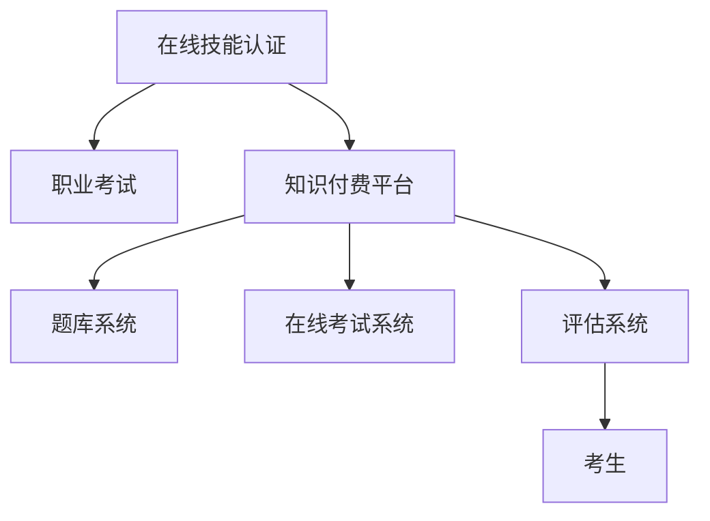

                 

## 1. 背景介绍

在知识经济时代，技能认证与职业考试成为了个人职业发展和企业人才选拔的重要环节。传统的考试方式不仅耗费时间和资源，还存在诸多问题，如考试难度不一、评估标准不统一、考试内容与实际需求脱节等。这些问题使得传统的考试方式难以适应快速变化的行业需求，也限制了企业对人才的精准选拔。

为解决这些问题，知识付费平台的兴起，为在线技能认证与职业考试提供了一种全新的解决方案。通过知识付费平台，企业和考生可以借助先进的互联网技术和丰富的教育资源，实施在线考试，从而提升考试公平性、透明度和实用性。本文将从背景介绍、核心概念、核心算法、项目实践、实际应用场景、工具和资源推荐等多个角度，详细探讨如何利用知识付费实现在线技能认证与职业考试。

## 2. 核心概念与联系

### 2.1 核心概念概述

为更好地理解在线技能认证与职业考试的实施流程，本节将介绍几个密切相关的核心概念：

- **在线技能认证**：通过在线方式，对考生进行技能考核，以评估其是否具备某一职业所需的技能。
- **职业考试**：评估考生是否具备从事特定职业所必需的知识和技能。
- **知识付费平台**：基于互联网技术的平台，提供各种知识付费服务，如课程、考试、问答等。
- **题库系统**：存储和管理考试试题的数据库系统。
- **在线考试系统**：提供考生在线答题、实时计分、自动阅卷等功能的软件系统。
- **评估系统**：基于自动化评分算法，对考生答题结果进行公正客观评估的系统。

这些核心概念之间的逻辑关系可以通过以下Mermaid流程图来展示：



这个流程图展示的核心概念以及它们之间的关系：

1. 在线技能认证和职业考试是最终目标，通过知识付费平台实现。
2. 知识付费平台利用题库系统、在线考试系统和评估系统，提供全程在线化的考核机制。
3. 考生通过在线考试系统完成答题，由评估系统进行公正客观评估。

## 3. 核心算法原理 & 具体操作步骤

### 3.1 算法原理概述

在线技能认证与职业考试的核心算法原理主要包括三个部分：

- **题库建设**：构建与职业岗位相关的题库，涵盖各知识点和技能点。
- **在线考试设计**：设计在线考试系统，实现考生实时答题、自动阅卷等功能。
- **评估算法**：开发基于机器学习的评估算法，公正客观地评估考生答题结果。

### 3.2 算法步骤详解

#### 3.2.1 题库建设

1. **内容分析**：对职业岗位的需求进行分析，确定考核知识点和技能点。
2. **题目设计**：根据知识点和技能点设计题目，涵盖选择题、判断题、简答题、编程题等多种题型。
3. **题目校验**：对题目进行校验和优化，确保题目质量和难度合理。
4. **数据存储**：将题库数据存储在数据库中，支持快速检索和更新。

#### 3.2.2 在线考试设计

1. **考试平台搭建**：搭建一个功能完善的在线考试平台，支持考生登录、题目浏览、实时作答、提交答题等功能。
2. **答题环境设计**：设计与实际考试环境相似的答题环境，包括考试时间、答题界面、在线监控等。
3. **实时计分**：实时记录考生答题情况，并展示得分、剩余时间等信息，帮助考生掌握考试进度。
4. **自动阅卷**：开发自动阅卷算法，快速高效地对考生答题进行评分。

#### 3.2.3 评估算法

1. **评估模型选择**：根据考试内容和题型选择适当的评估模型，如逻辑回归、决策树、神经网络等。
2. **数据预处理**：对考生答题数据进行预处理，包括数据清洗、归一化、特征工程等。
3. **模型训练**：使用历史答题数据对评估模型进行训练，生成评估模型。
4. **结果评估**：使用测试集对评估模型进行测试，评估模型的准确率和召回率等性能指标。

### 3.3 算法优缺点

#### 3.3.1 优点

1. **效率高**：在线考试和评估可以节省大量时间和资源，提高考试效率。
2. **公平公正**：在线考试和评估过程全程记录，减少了人为干预，提高了考试的公平性和公正性。
3. **覆盖面广**：在线考试和评估可以覆盖更多题型和知识点，满足不同考生的需求。
4. **灵活性高**：在线考试和评估可以根据实际需求，随时调整考试内容和难度。

#### 3.3.2 缺点

1. **技术要求高**：在线考试和评估系统需要较高的技术水平和开发成本。
2. **安全问题**：在线考试和评估过程中，可能存在网络安全问题，如数据泄露、答题作弊等。
3. **用户体验**：部分考生可能不习惯在线答题，影响考试的公平性。

### 3.4 算法应用领域

在线技能认证与职业考试主要应用于以下几个领域：

1. **企业招聘**：用于选拔符合企业需求的人才，如软件开发工程师、产品经理、数据分析师等。
2. **职业资格认证**：用于评估考生是否具备特定职业的资格，如医师、律师、会计师等。
3. **学术评估**：用于考核学生的学术水平，如硕士、博士论文答辩。
4. **专业认证**：用于评估考生是否具备某一专业技能，如网络安全、人工智能等。
5. **技能培训**：用于评估学员是否掌握了培训课程的知识和技能，如编程、项目管理等。

## 4. 数学模型和公式 & 详细讲解 & 举例说明

### 4.1 数学模型构建

在线考试和评估过程中，常用的数学模型包括：

- **逻辑回归**：用于评估选择题和判断题。
- **决策树**：用于评估简答题和编程题。
- **神经网络**：用于评估复杂题型的综合能力。

### 4.2 公式推导过程

#### 4.2.1 逻辑回归

逻辑回归是一种常见的二分类模型，适用于评估选择题和判断题。其公式为：

$$
P(y=1|x) = \frac{1}{1+e^{-z}}
$$

其中 $z$ 为线性模型输出，$y$ 为分类标签。

#### 4.2.2 决策树

决策树是一种基于树结构的分类模型，适用于评估简答题和编程题。其公式为：

$$
P(y|x) = \sum_{i} P(x_i|y)P(y)
$$

其中 $P(y)$ 为类别概率，$P(x_i|y)$ 为特征条件概率。

#### 4.2.3 神经网络

神经网络是一种常见的多层模型，适用于评估复杂题型的综合能力。其公式为：

$$
P(y|x) = \frac{1}{Z}e^{z}
$$

其中 $Z$ 为归一化因子，$z$ 为线性模型输出。

### 4.3 案例分析与讲解

以下以逻辑回归模型为例，给出其在线考试和评估的具体实现：

1. **数据准备**：准备历史答题数据，包括题目、答案、得分等。
2. **模型训练**：使用历史答题数据对逻辑回归模型进行训练，生成评估模型。
3. **数据预处理**：对考生答题数据进行预处理，包括数据清洗、归一化等。
4. **模型评估**：使用测试集对评估模型进行测试，评估模型的准确率和召回率等性能指标。
5. **结果输出**：将评估结果反馈给考生，并生成相应的证书。

## 5. 项目实践：代码实例和详细解释说明

### 5.1 开发环境搭建

在进行项目实践前，我们需要准备好开发环境。以下是使用Python进行Flask开发的环境配置流程：

1. 安装Anaconda：从官网下载并安装Anaconda，用于创建独立的Python环境。
2. 创建并激活虚拟环境：
```bash
conda create -n flask-env python=3.8 
conda activate flask-env
```
3. 安装Flask：
```bash
pip install Flask
```
4. 安装相关库：
```bash
pip install SQLAlchemy Flask-WTF Flask-Login Flask-Mail
```
完成上述步骤后，即可在`flask-env`环境中开始项目开发。

### 5.2 源代码详细实现

这里我们以一个简单的在线考试系统为例，给出使用Flask和SQLAlchemy实现的代码：

#### 5.2.1 数据模型设计

```python
from flask_sqlalchemy import SQLAlchemy

db = SQLAlchemy()

class User(db.Model):
    id = db.Column(db.Integer, primary_key=True)
    username = db.Column(db.String(80), unique=True, nullable=False)
    password = db.Column(db.String(120), nullable=False)

class Exam(db.Model):
    id = db.Column(db.Integer, primary_key=True)
    title = db.Column(db.String(120), nullable=False)
    content = db.Column(db.Text, nullable=False)
    answer = db.Column(db.Text, nullable=False)
    score = db.Column(db.Integer, nullable=False)

class Answer(db.Model):
    id = db.Column(db.Integer, primary_key=True)
    exam_id = db.Column(db.Integer, db.ForeignKey('exam.id'))
    user_id = db.Column(db.Integer, db.ForeignKey('user.id'))
    answer = db.Column(db.Text, nullable=False)
```

#### 5.2.2 用户登录与注册

```python
from flask import render_template, request, redirect, url_for
from flask_login import LoginManager, login_user, logout_user, login_required

login_manager = LoginManager()
login_manager.init_app(app)

@app.route('/')
def index():
    return render_template('index.html')

@app.route('/login', methods=['GET', 'POST'])
def login():
    if request.method == 'POST':
        username = request.form['username']
        password = request.form['password']
        user = User.query.filter_by(username=username).first()
        if user and user.check_password(password):
            login_user(user, remember=True)
            return redirect(url_for('dashboard'))
        return render_template('login.html', error='Invalid username or password')
    return render_template('login.html')

@app.route('/logout')
@login_required
def logout():
    logout_user()
    return redirect(url_for('index'))

@login_manager.user_loader
def load_user(user_id):
    return User.query.get(int(user_id))

@app.route('/dashboard')
@login_required
def dashboard():
    exam = Exam.query.filter_by(title='Python基础').first()
    answer = Answer.query.filter_by(user_id=current_user.id, exam_id=exam.id).first()
    if answer:
        return render_template('dashboard.html', title=exam.title, content=exam.content, answer=answer.answer, score=exam.score)
    return redirect(url_for('register'))

@app.route('/register', methods=['GET', 'POST'])
def register():
    if request.method == 'POST':
        username = request.form['username']
        password = request.form['password']
        user = User(username=username)
        user.set_password(password)
        db.session.add(user)
        db.session.commit()
        login_user(user, remember=True)
        return redirect(url_for('dashboard'))
    return render_template('register.html')
```

#### 5.2.3 在线答题与结果评估

```python
from flask import render_template, request, redirect, url_for
from flask_login import current_user

@app.route('/exam', methods=['GET', 'POST'])
@login_required
def exam():
    exam = Exam.query.filter_by(title='Python基础').first()
    if request.method == 'POST':
        answer = request.form['answer']
        user_answer = Answer(answer=answer, user=current_user, exam=exam)
        db.session.add(user_answer)
        db.session.commit()
        return redirect(url_for('dashboard'))
    return render_template('exam.html', title=exam.title, content=exam.content)
```

### 5.3 代码解读与分析

让我们再详细解读一下关键代码的实现细节：

1. **数据模型设计**：
   - `User` 模型：用户信息，包含用户名和密码。
   - `Exam` 模型：考试信息，包含考试标题、内容、答案、得分。
   - `Answer` 模型：答题信息，包含用户ID、考试ID、答案。

2. **用户登录与注册**：
   - 使用 `flask_login` 库实现用户登录和注册功能，支持记住登录状态。
   - 用户登录和注册页面分别渲染 `login.html` 和 `register.html` 模板。

3. **在线答题与结果评估**：
   - 答题页面渲染 `exam.html` 模板，展示考试内容和答题区域。
   - 答题结果保存为 `Answer` 模型，记录用户ID、考试ID和答案。

4. **结果评估**：
   - 答题结果与考试标准答案进行比对，计算得分。
   - 结果展示页面渲染 `dashboard.html` 模板，展示考试标题、内容、答案、得分。

### 5.4 运行结果展示

- **登录和注册**：用户成功登录和注册后，跳转到仪表盘页面。
- **在线答题**：用户进入答题页面，输入答案并提交。
- **结果评估**：答题结果实时显示，用户可以查看得分和标准答案。

## 6. 实际应用场景

### 6.1 企业招聘

在线技能认证与职业考试可以应用于企业招聘，通过技术手段，对候选人进行全面评估。例如，某大型IT公司在进行软件开发工程师招聘时，可以设计一个包含算法题、编程题和软技能题的多维考试，使用在线考试系统进行考核，评估候选人的技术能力和团队协作能力。

### 6.2 职业资格认证

在线技能认证与职业考试可以应用于职业资格认证，为特定职业设定统一的考核标准。例如，律师资格考试可以设计一个包含法律基础知识、法律实务和职业伦理的多维考试，使用在线考试系统进行考核，评估考生的专业知识和职业素养。

### 6.3 学术评估

在线技能认证与职业考试可以应用于学术评估，如硕士、博士论文答辩。例如，某大学在进行硕士研究生论文答辩时，可以设计一个包含论文内容、研究方法和实验结果的答辩考试，使用在线考试系统进行考核，评估学生的学术水平和研究能力。

### 6.4 专业认证

在线技能认证与职业考试可以应用于专业认证，如网络安全、人工智能等。例如，某网络安全公司在进行网络安全工程师认证时，可以设计一个包含安全原理、防护技术和安全操作的多维考试，使用在线考试系统进行考核，评估考生的安全知识和技能。

## 7. 工具和资源推荐

### 7.1 学习资源推荐

为帮助开发者掌握在线技能认证与职业考试的开发技术，以下是一些优质的学习资源：

1. **Flask官方文档**：Flask官方文档提供了详细的Flask框架使用指南，是新手入门的必备资料。
2. **SQLAlchemy官方文档**：SQLAlchemy官方文档提供了详细的SQLAlchemy ORM使用指南，是数据建模的必备工具。
3. **在线考试系统教程**：如《Python在线考试系统实现》等书籍和博客，深入讲解在线考试系统的实现方法。
4. **机器学习课程**：如《机器学习基础》课程，提供深度学习模型的理论基础和实践方法。
5. **在线平台**：如Coursera、Udemy等，提供在线技能认证与职业考试的系统课程和实战项目。

通过学习这些资源，相信你一定能够掌握在线技能认证与职业考试的开发技术，为实现企业招聘、职业资格认证、学术评估、专业认证等应用场景提供技术支持。

### 7.2 开发工具推荐

高效的开发离不开优秀的工具支持。以下是几款用于在线技能认证与职业考试开发的常用工具：

1. **Flask**：基于Python的轻量级Web框架，支持快速搭建Web应用。
2. **SQLAlchemy**：基于SQLite的数据库ORM，支持Python中的ORM操作。
3. **Jinja2**：基于Python的模板引擎，支持动态生成HTML页面。
4. **Flask-Login**：基于Flask的认证扩展，支持用户登录和记住登录状态。
5. **Flask-Mail**：基于Flask的邮件模块，支持发送邮件通知。

合理利用这些工具，可以显著提升在线技能认证与职业考试开发的效率，加快创新迭代的步伐。

### 7.3 相关论文推荐

在线技能认证与职业考试的发展源于学界的持续研究。以下是几篇奠基性的相关论文，推荐阅读：

1. **《在线考试系统的设计与实现》**：介绍了在线考试系统的基本架构和关键技术，如安全认证、实时监控等。
2. **《基于机器学习的考试评估系统》**：提出使用机器学习模型进行考试评估，提升评估的公正性和客观性。
3. **《分布式在线考试系统的设计》**：介绍分布式在线考试系统的架构设计和实现方法，支持大规模考生同时在线答题。
4. **《在线技能认证与职业考试的理论与实践》**：探讨在线技能认证与职业考试的理论基础和实践方法，提出系统化的解决方案。

这些论文代表了大语言模型微调技术的发展脉络。通过学习这些前沿成果，可以帮助研究者把握学科前进方向，激发更多的创新灵感。

## 8. 总结：未来发展趋势与挑战

### 8.1 研究成果总结

本文对在线技能认证与职业考试的实施流程进行了详细探讨。通过分析核心概念和关键技术，提供了系统化的解决方案。具体包括以下几个方面：

1. **在线技能认证与职业考试**：通过在线考试系统，对考生进行全面评估。
2. **题库建设**：涵盖各知识点和技能点，支持多样化题型。
3. **在线考试设计**：设计实时答题、自动阅卷等功能，提升考试效率。
4. **评估算法**：开发基于机器学习的评估算法，确保评估的公正性和客观性。

### 8.2 未来发展趋势

展望未来，在线技能认证与职业考试将呈现以下几个发展趋势：

1. **技术成熟化**：在线考试和评估技术将不断成熟，支持更多题型和知识点。
2. **考试智能化**：基于人工智能和机器学习的评估算法将不断优化，提升评估的准确性和公平性。
3. **考试自动化**：自动化答题、自动阅卷等技术将不断提升，减少人工干预。
4. **考试多样化**：支持多种考试形式，如在线考试、论文答辩、项目评审等。
5. **考试标准化**：制定统一的考试标准，确保评估结果的一致性和可靠性。

### 8.3 面临的挑战

尽管在线技能认证与职业考试已经取得了显著进展，但在迈向更加智能化、普适化应用的过程中，它仍面临诸多挑战：

1. **技术复杂性**：在线考试和评估系统涉及多种技术，如Web开发、数据库、机器学习等，开发难度较大。
2. **数据安全**：在线考试和评估过程中，可能存在数据泄露、答题作弊等安全问题。
3. **用户体验**：部分考生可能不习惯在线答题，影响考试的公平性。
4. **评估公平性**：评估算法需要不断优化，避免存在偏见和不公平。

### 8.4 研究展望

面对在线技能认证与职业考试所面临的挑战，未来的研究需要在以下几个方面寻求新的突破：

1. **开发更智能的评估算法**：引入更多先进的机器学习算法，提升评估的准确性和公正性。
2. **提升数据安全**：采用加密技术、安全认证等措施，保障数据安全。
3. **改进用户体验**：设计更加友好的用户界面和答题体验，提升考生的参与度。
4. **标准化考试流程**：制定统一的考试标准和规范，确保评估结果的一致性和可靠性。

总之，在线技能认证与职业考试技术的不断发展，必将成为技能评估和人才培养的重要手段，为各行业提供更加高效、公正、可靠的人才选拔机制。

## 9. 附录：常见问题与解答

**Q1：在线技能认证与职业考试是否适用于所有职业领域？**

A: 在线技能认证与职业考试适用于大多数职业领域，特别是对标准化、规范化的职业评估。但对于一些高度个性化、实践性强的职业，如手工艺、艺术类等，在线考试和评估可能难以全面覆盖。

**Q2：在线技能认证与职业考试是否需要大量前期开发成本？**

A: 在线技能认证与职业考试的前期开发成本较高，涉及题库建设、考试设计、技术实现等环节。但通过合理的设计和使用先进的互联网技术，可以大幅降低开发成本。

**Q3：在线技能认证与职业考试是否适合跨地区、跨国界的应用？**

A: 在线技能认证与职业考试适合跨地区、跨国界的应用，通过互联网技术，可以实现全球范围内的在线考试和评估。但需要注意不同地区的网络环境、法律法规等差异，进行相应的适配。

**Q4：在线技能认证与职业考试是否需要持续更新和维护？**

A: 在线技能认证与职业考试需要持续更新和维护，以适应技术发展和考试需求的变化。需要定期更新题库、评估算法等，确保系统的有效性和稳定性。

总之，在线技能认证与职业考试技术的不断发展，必将成为技能评估和人才培养的重要手段，为各行业提供更加高效、公正、可靠的人才选拔机制。通过不断优化技术，加强用户体验，提高评估的公平性和准确性，未来在线技能认证与职业考试必将在更多的应用场景中大放异彩。

