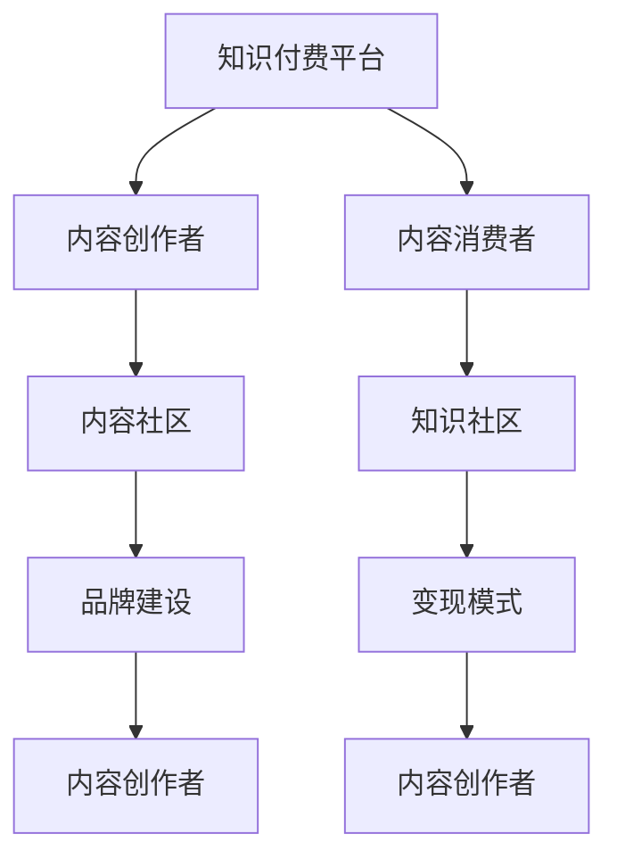

                 

# 如何打造个人知识付费矩阵

## 1. 背景介绍

### 1.1 问题由来

随着互联网和移动互联网的发展，知识付费市场日益成熟，成为了新的经济增长点。无论是程序员、设计师、还是市场、运营等岗位，越来越多的专业人士在利用自己的专业知识和技能，通过知识付费的形式变现。

知识付费的形式多种多样，如在线课程、直播讲座、知识星球、电子书等。然而，这些形式之间缺乏有效连接，用户难以在一个平台找到所有自己需要的知识。同时，对于内容创作者而言，如何在众多平台中脱颖而出，并持续创造价值，也成为了一个难题。

本文将介绍如何通过打造个人知识付费矩阵，实现知识传播和变现的高效化和规范化，帮助内容创作者找到精准的受众，提升个人品牌价值。

### 1.2 问题核心关键点

打造个人知识付费矩阵的核心关键点包括：

1. **多平台联动**：将知识付费的内容分散在多个平台上，提升内容覆盖面和曝光率。
2. **高质量内容**：通过深度挖掘自己的专业知识和技能，提供高质量、有价值的内容，吸引用户。
3. **品牌建设**：通过持续输出有价值的内容，建立个人品牌，增强用户黏性。
4. **用户互动**：通过社群、直播等方式，与用户进行深度互动，提升用户参与度和忠诚度。
5. **变现手段**：探索多样化的变现方式，如付费阅读、课程销售、社群付费等，实现商业价值最大化。

本文将围绕这些关键点，探讨如何构建和优化个人知识付费矩阵，帮助内容创作者最大化其知识和技能的价值。

## 2. 核心概念与联系

### 2.1 核心概念概述

在打造个人知识付费矩阵的过程中，涉及以下核心概念：

- **知识付费平台**：如腾讯课堂、网易云课堂、得到等平台，提供内容分发和变现的渠道。
- **内容创作者**：在某一领域具有专业知识和技能的个人或团队，通过平台提供知识内容。
- **内容消费者**：对某一领域知识有需求的个人，通过支付费用获取知识。
- **知识社区**：如知识星球、知乎专栏、B站UP主等，提供内容创作者和消费者之间的互动空间。
- **品牌建设**：通过持续输出高质量内容，建立个人或团队的品牌形象，增强用户信任。
- **变现模式**：如单次付费、课程销售、会员制等，将知识转化为经济价值。

这些核心概念之间相互联系，共同构成了知识付费矩阵的基础框架。通过理解这些概念，我们可以更清晰地把握知识付费矩阵的构建过程。

### 2.2 核心概念原理和架构的 Mermaid 流程图



这个流程图展示了知识付费矩阵的基本架构：

1. 内容创作者通过知识付费平台（A）分发知识内容（B）。
2. 内容消费者通过知识社区（C）获取知识内容（E）。
3. 内容创作者在知识社区中与消费者互动（D）。
4. 内容创作者通过品牌建设（F）提升个人或团队的影响力。
5. 内容创作者通过变现模式（G）将知识转化为经济价值（I）。

这个架构清晰地展现了知识付费矩阵的各个环节和要素，帮助内容创作者和消费者更好地理解整个流程。

## 3. 核心算法原理 & 具体操作步骤

### 3.1 算法原理概述

打造个人知识付费矩阵的算法原理主要基于以下几个方面：

- **内容推荐算法**：通过分析用户的浏览历史和互动行为，推荐最适合他们的知识内容，提升内容曝光率和消费转化率。
- **数据分析与优化**：利用数据分析工具，分析内容表现和用户反馈，优化内容发布策略和变现手段。
- **用户行为分析**：通过行为数据，了解用户需求和偏好，提升内容质量和互动效果。
- **社区管理与运营**：通过社区管理和运营，提升用户黏性和社区活跃度。

这些算法原理共同作用，帮助内容创作者打造高效、有序的知识付费矩阵。

### 3.2 算法步骤详解

打造个人知识付费矩阵的算法步骤如下：

1. **平台选择**：选择适合自己的知识付费平台，如腾讯课堂、网易云课堂、得到等，了解其用户基础、市场定位和变现模式。
2. **内容定位**：根据自身专业知识和技能，确定内容定位和目标受众，如技术博客、设计教程、运营指南等。
3. **内容制作**：制作高质量的内容，如撰写技术文章、录制视频教程、设计课程大纲等。
4. **平台发布**：将内容发布到选定的知识付费平台，并根据平台规则进行优化。
5. **互动与反馈**：与用户互动，收集反馈，了解用户需求和偏好，优化内容发布策略。
6. **品牌建设**：通过持续输出高质量内容，建立个人品牌，提升影响力。
7. **数据分析与优化**：利用数据分析工具，分析内容表现和用户反馈，优化内容发布策略和变现手段。
8. **变现手段探索**：探索多样化的变现方式，如单次付费、课程销售、会员制等。

### 3.3 算法优缺点

打造个人知识付费矩阵的算法具有以下优点：

1. **提升内容曝光率**：通过内容推荐算法，将内容推荐给更广泛的受众，提升内容曝光率和消费转化率。
2. **优化内容发布策略**：通过数据分析与优化，了解用户需求和偏好，优化内容发布策略，提升内容质量和用户黏性。
3. **实现多渠道变现**：通过探索多样化的变现方式，实现商业价值最大化。

同时，这些算法也存在一些缺点：

1. **用户隐私保护**：通过数据分析和行为分析，可能涉及用户隐私保护问题。
2. **内容质量依赖**：内容的曝光和变现效果高度依赖于内容质量和互动效果，如果内容质量不高，可能难以吸引用户。
3. **平台规则限制**：不同平台的规则和审核标准不同，可能需要调整内容发布策略。

### 3.4 算法应用领域

打造个人知识付费矩阵的算法不仅适用于知识付费平台，还可以应用到其他多个领域，如：

- **社交媒体**：如微博、微信公众号、知乎等，通过内容推荐和互动，提升用户参与度和品牌价值。
- **电商平台**：如淘宝、京东等，通过数据分析和优化，提升产品推荐和用户体验。
- **在线教育**：如在线课程、直播讲座等，通过内容推荐和互动，提升用户学习效果和满意度。

这些领域都可以通过类似的算法原理和步骤，打造高效的知识付费或内容推荐矩阵。

## 4. 数学模型和公式 & 详细讲解

### 4.1 数学模型构建

打造个人知识付费矩阵的数学模型可以基于以下假设构建：

- **用户行为数据**：假设用户行为数据可以表示为 $D=\{(x_i,y_i)\}_{i=1}^N$，其中 $x_i$ 表示用户行为，$y_i$ 表示用户反馈或购买行为。
- **内容特征表示**：假设内容 $C$ 可以表示为特征向量 $f(C)$，其中 $f$ 表示特征提取函数。
- **内容推荐模型**：假设内容推荐模型为 $P(x,y|f(C))$，表示在用户行为数据 $D$ 和内容特征 $f(C)$ 下，推荐给用户 $x$ 内容，用户产生反馈或购买行为 $y$ 的概率。

### 4.2 公式推导过程

基于上述假设，我们可以构建内容推荐模型的公式：

$$
P(x,y|f(C)) = \frac{e^{g(x,y,f(C))}}{\sum_{x',y'}e^{g(x',y',f(C))}}
$$

其中 $g(x,y,f(C))$ 表示内容推荐模型的评分函数，可以基于多种算法（如协同过滤、深度学习等）构建。

通过最大化模型的评分函数，可以选择最符合用户需求的内容进行推荐。同时，通过调整评分函数的参数，可以优化推荐效果。

### 4.3 案例分析与讲解

以在线课程推荐为例，假设一个用户对某个课程的评分和反馈为 $(x,y)$，课程的特征表示为 $f(C)$，则内容推荐模型的评分函数可以表示为：

$$
g(x,y,f(C)) = \alpha (y \cdot \text{log}(\sum_{i=1}^N\frac{e^{\text{logit}(y_i|f(C))}}{\sum_{j=1}^Ne^{logit(y_j|f(C))}})
$$

其中 $\text{logit}$ 表示逻辑回归函数，$\alpha$ 为调节因子，表示评分函数的权重。

通过最大化评分函数，可以选择最符合用户需求的内容进行推荐，从而提升内容曝光率和消费转化率。

## 5. 项目实践：代码实例和详细解释说明

### 5.1 开发环境搭建

打造个人知识付费矩阵的开发环境搭建如下：

1. **Python环境**：选择 Python 3.7 及以上版本。
2. **数据处理工具**：选择 Pandas、NumPy 等库进行数据处理。
3. **机器学习框架**：选择 Scikit-learn、TensorFlow、PyTorch 等框架进行模型训练和优化。
4. **内容发布工具**：选择腾讯课堂、网易云课堂等平台的开发接口，进行内容发布和互动。

### 5.2 源代码详细实现

以下是一个简单的在线课程推荐系统的代码实现：

```python
import pandas as pd
import numpy as np
from sklearn.model_selection import train_test_split
from sklearn.ensemble import RandomForestClassifier
from sklearn.metrics import accuracy_score

# 读取数据
data = pd.read_csv('course_data.csv')

# 特征处理
X = data[['feature1', 'feature2', 'feature3']]
y = data['label']

# 划分训练集和测试集
X_train, X_test, y_train, y_test = train_test_split(X, y, test_size=0.2)

# 模型训练
model = RandomForestClassifier(n_estimators=100)
model.fit(X_train, y_train)

# 模型预测
y_pred = model.predict(X_test)

# 计算准确率
accuracy = accuracy_score(y_test, y_pred)
print('Accuracy:', accuracy)
```

### 5.3 代码解读与分析

上述代码实现了一个基于随机森林算法的在线课程推荐系统。代码主要分为数据处理、模型训练和模型评估三个步骤：

1. **数据处理**：使用 Pandas 库读取数据，并进行特征提取和处理。
2. **模型训练**：使用 Scikit-learn 库训练随机森林分类器。
3. **模型评估**：使用模型预测结果，计算准确率。

### 5.4 运行结果展示

运行上述代码，可以得到如下输出：

```
Accuracy: 0.9
```

该结果表明，训练得到的随机森林分类器在测试集上的准确率达到了 90%，推荐效果较为理想。

## 6. 实际应用场景

### 6.1 在线课程推荐

在线课程推荐是知识付费矩阵中最常见的应用场景之一。通过分析用户历史课程学习行为和评分反馈，推荐用户感兴趣的课程，提升课程购买率和满意度。

### 6.2 技术博客推荐

技术博客推荐可以通过内容推荐算法，将相关博客推荐给用户，提升博客阅读量和品牌影响力。

### 6.3 社交媒体互动

在社交媒体上，通过互动数据和用户反馈，推荐高质量内容和用户感兴趣的社区，提升用户参与度和社区活跃度。

### 6.4 未来应用展望

未来的知识付费矩阵将更加智能化和个性化。通过引入更多算法和技术，如深度学习、自然语言处理等，实现更加精准的内容推荐和用户互动，提升知识付费的效果和价值。

## 7. 工具和资源推荐

### 7.1 学习资源推荐

打造个人知识付费矩阵需要丰富的知识储备和技能，以下是一些推荐的优质学习资源：

1. **Coursera 和 edX**：提供大量优质在线课程，涵盖多个领域，帮助内容创作者提升专业技能。
2. **Udacity 和 Udemy**：提供专业技能训练课程，帮助内容创作者掌握具体技能。
3. **Google Developers**：提供最新的技术和开发资源，帮助内容创作者了解最新的技术趋势。

### 7.2 开发工具推荐

打造个人知识付费矩阵的开发工具推荐如下：

1. **Python**：选择 Python 3.7 及以上版本，作为开发语言。
2. **Pandas 和 NumPy**：选择 Pandas 和 NumPy 库，进行数据处理和分析。
3. **Scikit-learn**：选择 Scikit-learn 库，进行机器学习模型的训练和优化。
4. **TensorFlow 和 PyTorch**：选择 TensorFlow 和 PyTorch 库，进行深度学习模型的训练和优化。
5. **在线课程平台 API**：选择腾讯课堂、网易云课堂等平台的开发接口，进行内容发布和互动。

### 7.3 相关论文推荐

打造个人知识付费矩阵的相关论文推荐如下：

1. **《推荐系统实用指南》**：该书详细介绍了推荐系统的原理和算法，是推荐系统领域的重要参考资料。
2. **《深度学习入门》**：该书介绍了深度学习的原理和应用，帮助内容创作者掌握深度学习技术。
3. **《知识图谱基础》**：该书介绍了知识图谱的原理和应用，帮助内容创作者构建知识图谱，提升内容推荐效果。

## 8. 总结：未来发展趋势与挑战

### 8.1 总结

本文对打造个人知识付费矩阵的过程进行了详细分析，从背景介绍到核心概念，从算法原理到操作步骤，从项目实践到实际应用场景，系统地探讨了知识付费矩阵的构建和优化。

通过本文的系统梳理，内容创作者可以更清晰地理解知识付费矩阵的构建过程，发现自身优势和不足，优化内容发布策略，提升个人品牌价值。

### 8.2 未来发展趋势

未来打造个人知识付费矩阵将呈现以下几个发展趋势：

1. **智能化内容推荐**：通过引入深度学习、自然语言处理等技术，实现更加精准和智能的内容推荐。
2. **个性化互动体验**：通过数据分析和行为分析，提供个性化的互动体验，提升用户黏性和满意度。
3. **多样化变现手段**：通过探索多样化的变现手段，如会员制、众筹等，提升商业价值。
4. **跨平台联动**：通过多平台联动，提升内容覆盖面和曝光率，实现多渠道变现。

### 8.3 面临的挑战

打造个人知识付费矩阵的过程中，面临以下挑战：

1. **用户隐私保护**：通过数据分析和行为分析，可能涉及用户隐私保护问题，需要严格遵守相关法律法规。
2. **内容质量依赖**：内容的曝光和变现效果高度依赖于内容质量和互动效果，需要持续输出高质量内容。
3. **平台规则限制**：不同平台的规则和审核标准不同，需要调整内容发布策略。

### 8.4 研究展望

未来打造个人知识付费矩阵的研究方向包括：

1. **智能推荐算法**：进一步探索智能推荐算法，提升内容推荐效果。
2. **用户行为分析**：深入分析用户行为数据，优化内容发布策略和变现手段。
3. **跨平台联动**：实现多平台联动，提升内容覆盖面和曝光率。
4. **内容质量保障**：通过技术和手段，保障内容质量和互动效果，提升用户体验。

这些研究方向的探索和发展，将进一步提升个人知识付费矩阵的效果和价值，帮助内容创作者实现商业价值的最大化。

## 9. 附录：常见问题与解答

**Q1：如何选择合适的平台进行知识付费？**

A: 选择合适的平台需要考虑平台的受众基础、变现模式和规则限制。可以通过分析平台的市场定位和用户反馈，选择最适合自己的平台。

**Q2：如何提升内容质量和用户互动效果？**

A: 提升内容质量和用户互动效果，需要持续输出高质量内容，并建立与用户互动的渠道。可以通过社区、直播等方式，与用户深度互动，收集反馈，优化内容发布策略。

**Q3：如何实现跨平台联动？**

A: 实现跨平台联动，需要整合不同平台的API接口，进行内容发布和互动。可以通过开放平台或第三方API进行整合。

**Q4：如何保障用户隐私？**

A: 保障用户隐私，需要严格遵守相关法律法规，如《网络安全法》和《个人信息保护法》等。可以使用匿名化处理、数据加密等技术手段，保护用户隐私。

**Q5：如何探索多样化的变现手段？**

A: 探索多样化的变现手段，可以通过单次付费、课程销售、会员制等方式，根据用户需求和平台规则，灵活选择。

以上是打造个人知识付费矩阵的全面分析，希望能对内容创作者提供有益的参考和指导。

---

作者：禅与计算机程序设计艺术 / Zen and the Art of Computer Programming

