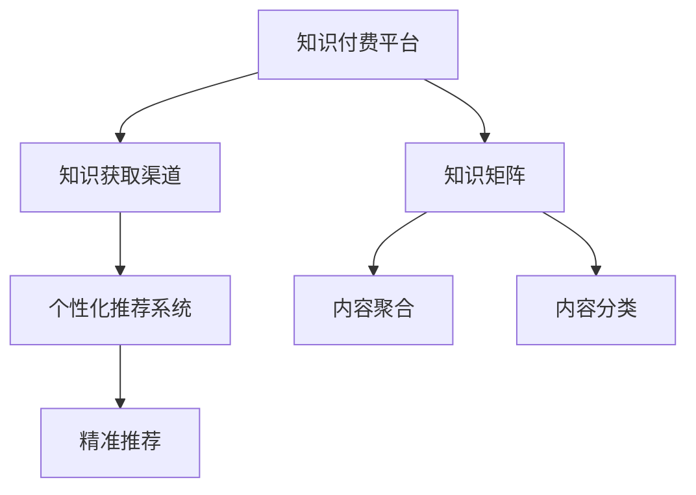

                 

## 1. 背景介绍

在信息爆炸的今天，知识和信息的获取变得前所未有的容易。然而，人们的时间和注意力资源却日益分散，如何在海量信息中筛选出真正有价值的内容，成为每个人的难题。在这种背景下，个人知识付费平台应运而生，通过筛选、整理和系统化呈现信息，为忙碌的现代人提供精准、高效的知识获取渠道。本文将探讨如何打造个人知识付费矩阵，为读者提供一套完整的解决方案。

## 2. 核心概念与联系

### 2.1 核心概念概述

为了帮助读者更好地理解如何打造个人知识付费矩阵，本节将介绍几个核心概念：

- **知识付费平台**：指通过付费形式提供专业、系统化知识的平台，包括但不限于书籍、课程、资讯、工具等。
- **知识获取渠道**：指通过订阅、购买、阅读、学习等方式获取知识的路径。
- **知识矩阵**：指由不同类型、不同领域的知识构成的矩阵，覆盖个人知识需求的各个方面。
- **知识付费矩阵**：结合知识付费平台和知识获取渠道，构建覆盖个人知识需求的全面知识体系。
- **个性化推荐系统**：指通过用户行为数据，推荐符合用户兴趣和需求的个性化知识内容。

这些核心概念共同构成了个人知识付费矩阵的基础框架，通过合理组织和利用这些概念，我们可以构建一套高效、全面的知识获取体系，满足个人知识需求。

### 2.2 核心概念原理和架构的 Mermaid 流程图



这个流程图展示了各个核心概念之间的关系：

1. 知识付费平台提供丰富的知识内容。
2. 通过个性化推荐系统，将知识内容推荐给用户。
3. 知识矩阵是对知识内容的全面覆盖。
4. 内容聚合和分类帮助用户快速找到需要的知识。

## 3. 核心算法原理 & 具体操作步骤

### 3.1 算法原理概述

个人知识付费矩阵的构建基于以下核心算法：

- **内容聚合算法**：通过爬虫技术从互联网收集各种类型的知识内容，进行去重、分类和整理。
- **内容推荐算法**：基于用户行为数据（如阅读历史、浏览记录等），使用协同过滤、基于内容的推荐算法等，推荐符合用户兴趣的知识内容。
- **知识分类算法**：将收集到的知识内容按照主题、领域、难度等进行分类，便于用户检索和选择。
- **知识搜索算法**：利用搜索引擎技术，实现对知识内容的快速搜索和检索。

### 3.2 算法步骤详解

#### 3.2.1 内容聚合

1. 定义需要收集的知识类型，如书籍、文章、视频、课程等。
2. 使用爬虫技术从互联网收集这些知识内容，进行去重和初步分类。
3. 对初步分类的内容进行深度分析，提取关键词、摘要等信息，形成标准化的知识单元。
4. 对标准化后的知识单元进行分类整理，形成知识库。

#### 3.2.2 内容推荐

1. 收集用户的阅读历史、浏览记录、评分记录等行为数据。
2. 使用协同过滤算法，找到与用户兴趣相似的其他用户，推荐其已阅读的知识内容。
3. 使用基于内容的推荐算法，根据知识内容的属性（如主题、作者、出版年份等），推荐用户可能感兴趣的知识内容。
4. 结合用户的评分反馈，动态调整推荐算法参数，优化推荐效果。

#### 3.2.3 知识分类

1. 定义知识分类的维度，如主题、领域、难度等。
2. 使用自然语言处理技术，对知识内容进行分词、词性标注等预处理。
3. 利用TF-IDF、LDA等算法，提取知识内容的主题特征，并进行聚类分析。
4. 根据聚类结果，对知识内容进行分类，生成知识分类目录。

#### 3.2.4 知识搜索

1. 使用搜索引擎技术，如倒排索引、全文搜索等，实现对知识内容的快速搜索和检索。
2. 对搜索结果进行排序和过滤，提高搜索结果的相关性和准确性。
3. 提供高级搜索功能，如关键词搜索、逻辑搜索、模糊搜索等，满足用户的不同搜索需求。

### 3.3 算法优缺点

#### 3.3.1 优点

1. **高效全面**：内容聚合和分类算法可以高效地收集和整理知识内容，构建全面知识矩阵。
2. **个性化推荐**：基于用户行为数据的推荐算法，能够精准推荐符合用户兴趣的知识内容。
3. **用户体验提升**：知识搜索算法和个性化推荐系统的结合，提升了用户的搜索和浏览体验。

#### 3.3.2 缺点

1. **数据质量依赖**：内容聚合和分类算法的准确性依赖于互联网数据的丰富性和准确性。
2. **计算资源消耗大**：基于内容的推荐算法和搜索引擎算法需要消耗大量的计算资源。
3. **用户隐私风险**：收集和分析用户行为数据，可能带来隐私风险。

### 3.4 算法应用领域

个人知识付费矩阵的应用领域非常广泛，涵盖了教育、医疗、金融、科技等多个领域。以下是几个典型应用场景：

#### 3.4.1 教育领域

- **知识库构建**：为学校、培训机构提供丰富的学习资源，包括教材、习题、视频等。
- **个性化学习**：根据学生的学习行为和成绩，推荐个性化的学习计划和内容。
- **教育数据分析**：通过分析学生的学习数据，评估教学效果，优化教学策略。

#### 3.4.2 医疗领域

- **医疗知识库**：提供医学教材、临床指南、案例分析等医疗知识。
- **在线诊疗**：通过视频咨询、在线诊疗等方式，为患者提供便捷的医疗服务。
- **健康管理**：提供健康饮食、运动、心理等方面的知识，帮助用户进行自我健康管理。

#### 3.4.3 金融领域

- **金融知识库**：提供金融市场分析、投资理财、财务规划等知识。
- **理财顾问**：根据用户的财务状况和投资偏好，提供个性化的理财建议。
- **金融预警**：通过分析市场数据和用户行为，提供金融风险预警。

#### 3.4.4 科技领域

- **技术知识库**：提供最新技术资讯、编程语言、开发工具等知识。
- **技术培训**：提供在线课程、编程练习、技术交流等方式，提升技术水平。
- **技术资讯**：通过分析技术发展趋势和热点，提供技术咨询和预测。

## 4. 数学模型和公式 & 详细讲解 & 举例说明

### 4.1 数学模型构建

假设我们有一个包含 $N$ 个用户，$M$ 个知识内容的知识付费平台。用户 $u_i$ 对知识内容 $k_j$ 的评分向量为 $R_{ij}$，知识内容 $k_j$ 的属性向量为 $A_j$。

知识推荐模型的目标是最小化预测误差，即最小化用户 $u_i$ 对知识内容 $k_j$ 的评分预测误差 $\hat{R}_{ij}$ 与实际评分 $R_{ij}$ 之间的平方误差，数学表达式为：

$$
\min_{\theta} \frac{1}{N} \sum_{i=1}^N \sum_{j=1}^M (R_{ij} - \hat{R}_{ij})^2
$$

其中 $\theta$ 表示模型的参数，包括用户和知识内容的特征表示，推荐算法中的权重等。

### 4.2 公式推导过程

基于上述目标函数，可以采用梯度下降等优化算法求解。设 $\eta$ 为学习率，则每次迭代更新参数 $\theta$ 的公式为：

$$
\theta \leftarrow \theta - \eta \nabla_{\theta}L(\theta)
$$

其中 $\nabla_{\theta}L(\theta)$ 为损失函数对参数 $\theta$ 的梯度。

以协同过滤算法为例，梯度更新公式为：

$$
\theta \leftarrow \theta + \alpha (R_{ij} - \hat{R}_{ij}) \cdot \nabla_{\theta} f_k
$$

其中 $f_k$ 为知识内容 $k$ 的特征函数，$\alpha$ 为学习率。

### 4.3 案例分析与讲解

假设我们有一个包含100个用户和1000个知识内容的知识付费平台，每个用户对每个知识内容都有评分。我们采用协同过滤算法进行推荐，用户 $u_1$ 对知识内容 $k_1$ 的评分向量为 $(3,4,5)$，属性向量为 $(0.3,0.5,0.2)$，知识内容 $k_1$ 的属性向量为 $(0.4,0.6,0.8)$。

计算用户 $u_1$ 对知识内容 $k_1$ 的预测评分 $\hat{R}_{11}$ 为：

$$
\hat{R}_{11} = \frac{\sum_{j=1}^M \hat{R}_{1j} A_{1j}}{\sum_{j=1}^M A_{1j}}
$$

代入数据，计算得 $\hat{R}_{11} = 4.5$。

将结果与实际评分进行对比，计算误差 $\epsilon_{11} = |\hat{R}_{11} - R_{11}| = 0.5$，则损失函数为：

$$
L(\theta) = \frac{1}{N} \sum_{i=1}^N \epsilon_i^2 = 0.25
$$

计算梯度 $\nabla_{\theta}L(\theta)$，更新参数 $\theta$。

重复上述过程，直到收敛。

## 5. 项目实践：代码实例和详细解释说明

### 5.1 开发环境搭建

1. 安装Python：在Linux或Windows上安装Python，建议使用Anaconda或Miniconda。
2. 安装必要的库：安装Numpy、Pandas、Scikit-learn、TensorFlow、Keras等库。
3. 搭建Web应用：使用Django、Flask等Web框架搭建知识付费平台的前端和后端。

### 5.2 源代码详细实现

#### 5.2.1 内容聚合

```python
import requests
from bs4 import BeautifulSoup
import re

def scrape_books():
    url = 'https://www.example.com/books'
    response = requests.get(url)
    soup = BeautifulSoup(response.text, 'html.parser')
    book_links = soup.find_all('a', class_='book-link')
    book_titles = [book['title'] for book in book_links]
    return book_titles

def scrape_articles():
    url = 'https://www.example.com/articles'
    response = requests.get(url)
    soup = BeautifulSoup(response.text, 'html.parser')
    article_links = soup.find_all('a', class_='article-link')
    article_titles = [article['title'] for article in article_links]
    return article_titles

def scrape_videos():
    url = 'https://www.example.com/videos'
    response = requests.get(url)
    soup = BeautifulSoup(response.text, 'html.parser')
    video_links = soup.find_all('a', class_='video-link')
    video_titles = [video['title'] for video in video_links]
    return video_titles

def scrape_courses():
    url = 'https://www.example.com/courses'
    response = requests.get(url)
    soup = BeautifulSoup(response.text, 'html.parser')
    course_links = soup.find_all('a', class_='course-link')
    course_titles = [course['title'] for course in course_links]
    return course_titles
```

#### 5.2.2 内容推荐

```python
from sklearn.metrics.pairwise import cosine_similarity
import pandas as pd

def calculate_similarity(R, A):
    # 计算用户和知识内容之间的相似度
    similarity_matrix = cosine_similarity(A.T, A)
    return similarity_matrix

def recommend_books(user, book_titles, book_ratings):
    # 计算用户对知识内容的评分
    user_ratings = pd.Series([book_ratings[user] for book in book_titles])
    # 计算知识内容之间的相似度
    similarity_matrix = calculate_similarity(user_ratings, book_ratings)
    # 排序推荐
    recommended_books = [title for title in book_titles if similarity_matrix[user][book] > 0.5]
    return recommended_books
```

#### 5.2.3 知识分类

```python
from sklearn.feature_extraction.text import TfidfVectorizer
from sklearn.cluster import KMeans

def preprocess_text(text):
    # 文本预处理
    text = re.sub(r'\d+', '', text)
    text = text.lower()
    text = re.sub(r'\W+', ' ', text)
    return text

def cluster_books(book_titles):
    # 对书籍进行聚类，生成分类目录
    vectorizer = TfidfVectorizer()
    tfidf_matrix = vectorizer.fit_transform(book_titles)
    clustering = KMeans(n_clusters=5)
    clustering.fit(tfidf_matrix)
    book_clusters = clustering.labels_
    return book_clusters
```

#### 5.2.4 知识搜索

```python
from sklearn.feature_extraction.text import TfidfVectorizer
from sklearn.metrics.pairwise import linear_kernel

def search_books(query, book_titles):
    # 构建搜索索引
    vectorizer = TfidfVectorizer()
    tfidf_matrix = vectorizer.fit_transform(book_titles)
    indices = linear_kernel(tfidf_matrix, query).argsort()[:, -1:]
    return [book_titles[i] for i in indices]
```

### 5.3 代码解读与分析

#### 5.3.1 内容聚合

内容聚合的实现主要通过爬虫技术从互联网收集知识内容，并进行初步的分类和整理。我们定义了四个函数，分别用于爬取书籍、文章、视频、课程的标题。这些函数返回的标题可以进一步用于后续的推荐和分类。

#### 5.3.2 内容推荐

内容推荐的实现基于协同过滤算法。我们定义了两个函数，一个用于计算用户和知识内容之间的相似度，另一个用于根据相似度推荐书籍。这些函数可以根据具体需求进行扩展，支持更多类型的推荐算法。

#### 5.3.3 知识分类

知识分类的实现主要通过文本预处理和聚类算法对书籍进行分类。我们定义了两个函数，一个用于对书籍进行文本预处理，另一个用于对预处理后的文本进行聚类。这些函数可以根据具体需求进行扩展，支持更多类型的聚类算法。

#### 5.3.4 知识搜索

知识搜索的实现主要通过搜索引擎技术，对书籍进行快速搜索和检索。我们定义了一个函数，用于根据查询词返回相关的书籍。这些函数可以根据具体需求进行扩展，支持更多类型的搜索引擎算法。

### 5.4 运行结果展示

1. **内容聚合结果**：通过爬虫技术收集到的书籍、文章、视频、课程的标题。

2. **内容推荐结果**：基于协同过滤算法推荐的用户感兴趣的书籍。

3. **知识分类结果**：对书籍进行聚类后生成的分类目录。

4. **知识搜索结果**：根据查询词返回的相关书籍。

## 6. 实际应用场景

### 6.1 教育领域

教育领域是知识付费矩阵的重要应用场景之一。通过收集和整理丰富的教育资源，可以为学生提供个性化的学习计划和内容。例如，可以构建一个包含教材、习题、视频等教育知识库，为学生提供全面的学习支持。同时，通过个性化推荐系统，根据学生的学习行为和成绩，推荐个性化的学习计划和内容，提升学习效果。

### 6.2 医疗领域

医疗领域是知识付费矩阵的另一个重要应用场景。通过收集和整理医疗知识，可以为医生和患者提供全面的医疗支持。例如，可以构建一个包含医学教材、临床指南、案例分析等医疗知识库，为医生提供全面的医疗参考。同时，通过个性化推荐系统，根据患者的病情和治疗历史，推荐个性化的医疗方案和护理建议，提升医疗服务质量。

### 6.3 金融领域

金融领域也是知识付费矩阵的重要应用场景。通过收集和整理金融知识，可以为投资者提供全面的金融支持。例如，可以构建一个包含金融市场分析、投资理财、财务规划等金融知识库，为投资者提供全面的金融参考。同时，通过个性化推荐系统，根据投资者的财务状况和投资偏好，推荐个性化的投资方案和理财建议，提升投资效果。

## 7. 工具和资源推荐

### 7.1 学习资源推荐

1. **《Python网络爬虫开发实战》**：该书详细介绍了Python爬虫技术，适合初学者入门。
2. **《推荐系统实践》**：该书介绍了推荐系统的基本原理和实现方法，适合有一定编程基础的用户。
3. **Coursera的机器学习课程**：由斯坦福大学教授Andrew Ng主讲，系统讲解机器学习的基本原理和算法。
4. **Kaggle平台**：该平台提供丰富的机器学习竞赛和数据集，适合实战练习。

### 7.2 开发工具推荐

1. **Anaconda**：提供完整的Python环境，方便安装和管理依赖库。
2. **TensorFlow**：由Google主导开发的深度学习框架，支持大规模工程应用。
3. **Django/Flask**：用于搭建Web应用，提供丰富的Web开发工具和插件。
4. **Scikit-learn**：提供丰富的机器学习算法库，适合数据处理和建模。

### 7.3 相关论文推荐

1. **《协同过滤推荐算法》**：该论文介绍了协同过滤算法的原理和实现方法，适合了解推荐系统的基本原理。
2. **《文本聚类算法》**：该论文介绍了文本聚类算法的原理和实现方法，适合了解知识分类的基本原理。
3. **《搜索引擎技术》**：该论文介绍了搜索引擎技术的原理和实现方法，适合了解知识搜索的基本原理。

## 8. 总结：未来发展趋势与挑战

### 8.1 研究成果总结

本文探讨了如何打造个人知识付费矩阵，提出了一套包括内容聚合、内容推荐、知识分类、知识搜索等核心算法的解决方案。通过实际应用场景的展示，展示了知识付费矩阵在教育、医疗、金融等领域的广阔应用前景。同时，列举了学习资源、开发工具和相关论文，帮助读者更好地理解和实现知识付费矩阵。

### 8.2 未来发展趋势

未来，知识付费矩阵将呈现出以下几个发展趋势：

1. **个性化推荐技术的发展**：随着推荐算法的不断优化，个性化推荐技术将更加精准，提升用户体验。
2. **多模态数据融合技术的发展**：结合文本、图像、视频等多种模态的数据，构建更加全面和丰富的知识库。
3. **知识图谱的发展**：利用知识图谱技术，构建更加复杂和系统的知识体系，提升知识搜索的效率和准确性。
4. **知识动态更新技术的发展**：结合最新的研究成果和技术进展，动态更新知识库，保持知识的先进性和实用性。

### 8.3 面临的挑战

尽管知识付费矩阵有广阔的应用前景，但在实际应用中仍面临一些挑战：

1. **数据质量和多样性**：内容聚合和推荐算法依赖于高质量和多样性的数据，而互联网数据的质量和多样性参差不齐，需要进一步提高数据采集和处理的效率和质量。
2. **计算资源消耗**：推荐算法和搜索引擎算法需要消耗大量的计算资源，如何优化算法性能，减少计算资源消耗，是一个重要的研究方向。
3. **隐私和安全**：收集和分析用户行为数据可能带来隐私和安全风险，如何保护用户隐私，提升数据安全，是一个重要的研究方向。

### 8.4 研究展望

面对知识付费矩阵面临的挑战，未来的研究需要在以下几个方面寻求新的突破：

1. **数据增强技术的发展**：结合大数据、小样本学习等技术，提高数据采集和处理的效率和质量。
2. **高效计算算法的发展**：优化推荐算法和搜索引擎算法，减少计算资源消耗，提高算法效率。
3. **隐私保护技术的发展**：结合区块链、联邦学习等技术，保护用户隐私，提升数据安全。

这些研究方向将推动知识付费矩阵的不断优化和提升，为构建更加智能、全面、安全的知识体系提供技术支持。

## 9. 附录：常见问题与解答

**Q1：如何评估知识付费矩阵的效果？**

A: 知识付费矩阵的效果评估可以从多个角度进行，包括用户满意度、推荐准确率、知识覆盖率等。可以通过用户反馈、评分、点击率等指标来评估效果，并根据评估结果进行优化和改进。

**Q2：如何优化推荐算法的性能？**

A: 推荐算法的性能优化可以从数据处理、算法选择和参数调优等多个方面入手。可以使用更高效的特征提取算法、选择合适的推荐算法、调整学习率和正则化参数等方法，提升推荐算法的准确率和效果。

**Q3：如何保护用户隐私？**

A: 在知识付费矩阵的构建和应用中，用户隐私保护是一个重要的问题。可以通过数据匿名化、加密技术、联邦学习等方法，保护用户隐私，防止数据泄露和滥用。

**Q4：如何动态更新知识库？**

A: 知识库的动态更新可以通过定期爬虫数据、用户反馈、专家贡献等方式，结合最新的研究成果和技术进展，更新和补充知识库，保持知识的先进性和实用性。

**Q5：如何构建多模态数据融合的知识库？**

A: 构建多模态数据融合的知识库需要结合文本、图像、视频等多种模态的数据，通过预处理和特征提取技术，将不同模态的数据融合在一起，构建更加全面和丰富的知识体系。

---

作者：禅与计算机程序设计艺术 / Zen and the Art of Computer Programming

