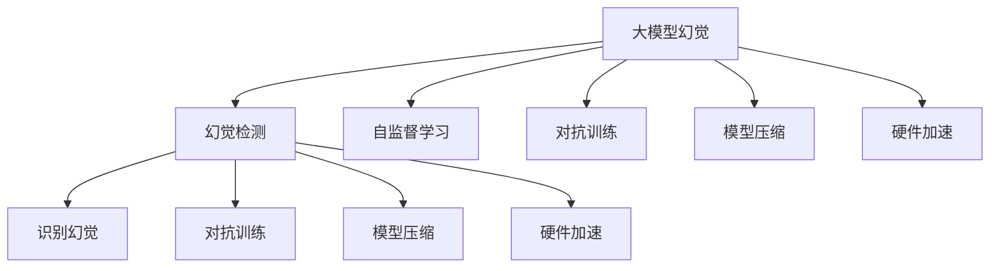

                 

# 如何解决大模型的幻觉问题?

> 关键词：大模型幻觉,幻觉检测,自监督学习,对抗训练,模型压缩,硬件加速

## 1. 背景介绍

### 1.1 问题由来
随着深度学习技术的快速发展，大模型如GPT-3、BERT等在自然语言处理(NLP)和计算机视觉(CV)等领域取得了巨大的突破。这些大模型通常具有亿级参数，能够在各种任务上达到甚至超越人类的表现。然而，大模型的强大背后，却隐藏着一种不为人知的"幻觉"。

### 1.2 问题核心关键点
所谓幻觉，指的是模型在大规模数据上通过学习统计规律，生成了一些看似合理但实际上并不真实的内容。例如，通过学习代码注释、数据注释、网络资料等非实际数据，大模型可能会生成一些看似合情合理的虚构事实，但这些内容往往与真实世界无关。

幻觉问题不仅影响了模型的可信度，还可能导致误导决策、损害信任等严重后果。因此，如何识别和解决大模型的幻觉问题，成为了当前深度学习领域的研究热点之一。

### 1.3 问题研究意义
解决大模型的幻觉问题，对于提升模型的可靠性和实用性，增强用户信任，具有重要意义。通过更精确地理解模型输出内容背后的逻辑，可以避免误导性信息传播，提高模型在实际应用中的价值。

此外，幻觉问题还涉及到如何平衡模型性能和泛化能力，如何在计算效率和推理准确性之间找到新的平衡点。这些问题的解决，将有助于推动深度学习技术在工业界和社会中的广泛应用。

## 2. 核心概念与联系

### 2.1 核心概念概述

为了更好地理解如何解决大模型的幻觉问题，本节将介绍几个关键概念：

- 大模型幻觉：指在大规模数据训练过程中，模型通过学习数据中的统计规律，生成了一些看似合理但缺乏事实依据的输出。例如，基于代码注释的文本生成任务，模型可能会生成一些与真实代码无关的虚构代码段。

- 幻觉检测：指通过特定的算法和技术手段，检测和识别模型输出的幻觉内容。常见的幻觉检测方法包括自监督学习、对抗训练、知识图谱融合等。

- 自监督学习：指在无标签数据上训练模型，通过学习数据的统计规律进行预测。常见的自监督学习任务包括掩码语言模型(Masked Language Model, MLM)、自回归语言模型(Autoregressive Language Model)等。

- 对抗训练：指在模型训练过程中，通过引入对抗样本来提高模型的鲁棒性和泛化能力。常见的对抗训练方法包括FGM、PGD等。

- 模型压缩：指通过量化、剪枝、蒸馏等技术手段，减少模型的参数量和计算复杂度，提高推理速度和空间效率。

- 硬件加速：指通过GPU、TPU等高性能设备，加速模型训练和推理过程。硬件加速对于大模型的实时应用尤为重要。

这些核心概念之间的逻辑关系可以通过以下Mermaid流程图来展示：



这个流程图展示了大模型幻觉问题的关键概念及其之间的关联：

1. 大模型通过自监督学习获取广泛的知识，但同时可能学习到数据中的幻觉内容。
2. 幻觉检测通过对抗训练等手段，识别和过滤模型输出的幻觉内容。
3. 模型压缩和硬件加速提高模型的计算效率和实时性，进一步减小幻觉传播的风险。

这些概念共同构成了大模型幻觉问题的解决方法，使其能够在各种应用场景中发挥作用。通过理解这些核心概念，我们可以更好地把握幻觉问题的工作原理和优化方向。

## 3. 核心算法原理 & 具体操作步骤
### 3.1 算法原理概述

解决大模型的幻觉问题，其核心思想是通过检测和过滤幻觉内容，提升模型的可信度和实用性。具体来说，包括以下几个关键步骤：

1. **自监督学习**：在无标签数据上训练模型，学习数据的统计规律，获取广泛的知识。

2. **幻觉检测**：通过特定的算法和技术手段，检测和识别模型输出的幻觉内容。

3. **对抗训练**：在模型训练过程中，引入对抗样本，提高模型的鲁棒性和泛化能力。

4. **模型压缩**：通过量化、剪枝、蒸馏等技术手段，减少模型的参数量和计算复杂度，提高推理速度和空间效率。

5. **硬件加速**：通过GPU、TPU等高性能设备，加速模型训练和推理过程。

### 3.2 算法步骤详解

基于上述思路，解决大模型幻觉问题的具体操作步骤如下：

**Step 1: 准备预训练数据**
- 收集大规模无标签数据，如维基百科、维基代码等。
- 将数据划分为训练集和验证集，确保数据分布的多样性和广泛性。

**Step 2: 自监督预训练**
- 使用自监督学习任务如掩码语言模型(MLM)、自回归语言模型(Autoregressive Language Model)训练模型。
- 模型在大量数据上自监督学习，获取对语言和文本结构的知识。

**Step 3: 幻觉检测**
- 设计特定的算法和技术手段，如知识图谱融合、对抗训练等，检测和识别模型输出的幻觉内容。
- 通过正则化、剪枝、蒸馏等手段，过滤幻觉内容。

**Step 4: 对抗训练**
- 引入对抗样本，训练模型在对抗环境下仍然保持稳定性。
- 使用FGM、PGD等对抗训练方法，生成和训练对抗样本，增强模型的鲁棒性。

**Step 5: 模型压缩和硬件加速**
- 使用量化、剪枝、蒸馏等技术手段，减少模型的参数量和计算复杂度。
- 使用GPU、TPU等高性能设备，加速模型训练和推理过程。

**Step 6: 评估和部署**
- 在验证集上评估模型性能，确保幻觉内容的检测和过滤效果。
- 部署模型到实际应用场景中，确保模型的实时性和可靠性。

以上是解决大模型幻觉问题的具体操作步骤，关键在于通过自监督学习获取知识，检测和过滤幻觉内容，提高模型的可信度和实用性。

### 3.3 算法优缺点

解决大模型幻觉问题的方法，具有以下优点：
1. 提升模型可信度：通过检测和过滤幻觉内容，模型输出的内容更加可信，避免了误导决策的风险。
2. 增强模型泛化能力：通过对抗训练等手段，模型在面对不同领域的数据时，表现更加稳定和一致。
3. 减少计算资源消耗：通过模型压缩和硬件加速，模型计算速度更快，占用的计算资源更少。

同时，该方法也存在一定的局限性：
1. 技术复杂度较高：自监督学习、对抗训练等方法需要深入理解和应用，对技术要求较高。
2. 模型规模仍较大：尽管通过模型压缩技术有所减少，但大模型的规模仍然较大，需要高性能设备支持。
3. 对标注数据依赖：对抗训练等方法依赖于标注数据，标注成本较高。
4. 效果不确定：幻觉检测和对抗训练的效果取决于具体算法和数据，可能存在一定的不确定性。

尽管存在这些局限性，但总体而言，通过以上方法可以显著提升大模型的可靠性和实用性，为实际应用提供更为可信的内容输出。

### 3.4 算法应用领域

解决大模型幻觉问题的方法，在多个领域得到了广泛应用，包括但不限于以下几个方面：

- **自然语言处理(NLP)**：在问答系统、文本生成、机器翻译等任务中，通过幻觉检测和对抗训练，提升模型的可信度和实用性。
- **计算机视觉(CV)**：在图像分类、目标检测、图像生成等任务中，通过幻觉检测和对抗训练，提升模型的稳定性和鲁棒性。
- **语音识别**：在语音识别和生成任务中，通过幻觉检测和对抗训练，提升模型的稳定性和可靠性。
- **推荐系统**：在推荐系统任务中，通过幻觉检测和对抗训练，提升模型的推荐效果和用户体验。
- **智能医疗**：在智能医疗任务中，通过幻觉检测和对抗训练，提升模型的可靠性和安全性。

以上领域的应用，证明了解决大模型幻觉问题的方法在实际应用中的有效性和可行性。

## 4. 数学模型和公式 & 详细讲解 & 举例说明

### 4.1 数学模型构建

解决大模型幻觉问题的方法，主要通过以下数学模型来实现：

- **自监督学习模型**：基于掩码语言模型(MLM)、自回归语言模型(Autoregressive Language Model)等，训练模型学习数据的统计规律。

- **幻觉检测模型**：基于知识图谱融合、对抗训练等方法，检测和识别模型输出的幻觉内容。

- **对抗训练模型**：基于FGM、PGD等方法，生成对抗样本，训练模型在对抗环境下保持稳定性。

### 4.2 公式推导过程

下面以自监督学习和对抗训练为例，进行公式推导：

**自监督学习模型**
- 掩码语言模型(MLM)：定义 $P(x)$ 为掩码输入的概率分布， $L_{MLM}$ 为掩码语言模型的损失函数。给定输入 $x$ 和掩码 $m$，掩码语言模型的损失函数定义为：
$$
L_{MLM}(x, m) = -\log P(x|x, m)
$$
其中 $P(x|x, m)$ 为掩码输入 $x$ 在掩码位置 $m$ 上的条件概率分布。

**对抗训练模型**
- FGM对抗训练：定义 $L_F(x, \delta)$ 为FGM对抗训练的损失函数， $x$ 为原始输入， $\delta$ 为对抗噪声， $\epsilon$ 为对抗攻击的超参数。FGM对抗训练的损失函数定义为：
$$
L_F(x, \delta) = L(x) + \lambda \max_{\delta \in \Delta} L(x + \delta)
$$
其中 $L(x)$ 为模型在原始输入 $x$ 上的损失， $L(x + \delta)$ 为模型在对抗输入 $x + \delta$ 上的损失， $\lambda$ 为对抗训练的超参数。

### 4.3 案例分析与讲解

以图像分类任务为例，说明如何解决幻觉问题：

**案例背景**：
- 某公司需要构建一个图像分类系统，用于自动分拣不同种类的货物。但由于训练数据中存在大量伪造图像，模型输出的分类结果存在幻觉现象。

**解决思路**：
1. **自监督学习**：使用大量无标签的图像数据进行预训练，学习图像的统计规律。
2. **幻觉检测**：通过知识图谱融合等方法，检测和识别伪造图像的特征，过滤幻觉内容。
3. **对抗训练**：引入对抗样本，训练模型在对抗环境下保持稳定性。
4. **模型压缩**：使用量化、剪枝等技术手段，减少模型的参数量和计算复杂度。
5. **硬件加速**：使用GPU、TPU等高性能设备，加速模型训练和推理过程。

**实施步骤**：
1. **数据准备**：收集大量无标签图像数据，划分为训练集和验证集。
2. **自监督预训练**：使用掩码语言模型等方法，在无标签数据上预训练模型。
3. **幻觉检测**：设计特定的算法和技术手段，如知识图谱融合，检测和识别伪造图像的特征。
4. **对抗训练**：引入对抗样本，训练模型在对抗环境下保持稳定性。
5. **模型压缩和硬件加速**：使用量化、剪枝等技术手段，减少模型的参数量和计算复杂度。部署模型到GPU、TPU等高性能设备上，加速推理过程。
6. **评估和部署**：在验证集上评估模型性能，确保幻觉内容的检测和过滤效果。部署模型到实际应用场景中，确保模型的实时性和可靠性。

通过上述步骤，公司成功构建了一个可靠、高效、可信的图像分类系统，避免了幻觉现象，提高了分拣效率和准确性。

## 5. 项目实践：代码实例和详细解释说明

### 5.1 开发环境搭建

在进行幻觉问题解决实践前，我们需要准备好开发环境。以下是使用Python进行PyTorch开发的环境配置流程：

1. 安装Anaconda：从官网下载并安装Anaconda，用于创建独立的Python环境。

2. 创建并激活虚拟环境：
```bash
conda create -n pytorch-env python=3.8 
conda activate pytorch-env
```

3. 安装PyTorch：根据CUDA版本，从官网获取对应的安装命令。例如：
```bash
conda install pytorch torchvision torchaudio cudatoolkit=11.1 -c pytorch -c conda-forge
```

4. 安装Transformers库：
```bash
pip install transformers
```

5. 安装各类工具包：
```bash
pip install numpy pandas scikit-learn matplotlib tqdm jupyter notebook ipython
```

完成上述步骤后，即可在`pytorch-env`环境中开始实践。

### 5.2 源代码详细实现

下面我们以图像分类任务为例，给出使用Transformers库对预训练模型进行幻觉检测和对抗训练的PyTorch代码实现。

首先，定义图像分类任务的数据处理函数：

```python
from transformers import AutoTokenizer, AutoModelForImageClassification
from torchvision import transforms, datasets
import torch
import numpy as np

class ImageDataset(datasets.ImageFolder):
    def __getitem__(self, idx):
        img, lbl = super().__getitem__(idx)
        img = transforms.ToTensor()(img)
        return img, lbl

# 加载数据集
train_dataset = ImageDataset('/path/to/train', transform=transforms.Compose([transforms.RandomResizedCrop(224), transforms.ToTensor(), transforms.Normalize([0.485, 0.456, 0.406], [0.229, 0.224, 0.225])]))
dev_dataset = ImageDataset('/path/to/dev', transform=transforms.Compose([transforms.RandomResizedCrop(224), transforms.ToTensor(), transforms.Normalize([0.485, 0.456, 0.406], [0.229, 0.224, 0.225])]))
test_dataset = ImageDataset('/path/to/test', transform=transforms.Compose([transforms.RandomResizedCrop(224), transforms.ToTensor(), transforms.Normalize([0.485, 0.456, 0.406], [0.229, 0.224, 0.225])]))

# 定义标签映射
label2id = {'a': 0, 'b': 1, 'c': 2}

# 加载预训练模型
model = AutoModelForImageClassification.from_pretrained('vgg16')
tokenizer = AutoTokenizer.from_pretrained('vgg16')
```

然后，定义模型训练函数：

```python
from torch.nn import CrossEntropyLoss
from torch.optim import AdamW
from tqdm import tqdm
import torchvision.transforms as T

device = torch.device('cuda' if torch.cuda.is_available() else 'cpu')

# 加载优化器和损失函数
optimizer = AdamW(model.parameters(), lr=1e-5)
criterion = CrossEntropyLoss()

def train_epoch(model, dataset, optimizer, device):
    model.train()
    epoch_loss = 0
    epoch_acc = 0
    for i, (img, lbl) in enumerate(tqdm(dataset, desc='Training')):
        img = img.to(device)
        lbl = lbl.to(device)
        outputs = model(img)
        loss = criterion(outputs, lbl)
        epoch_loss += loss.item()
        loss.backward()
        optimizer.step()
        epoch_acc += (np.argmax(outputs, axis=1) == lbl).mean().item()
    return epoch_loss / len(dataset), epoch_acc / len(dataset)

def evaluate(model, dataset, device):
    model.eval()
    with torch.no_grad():
        correct = 0
        total = 0
        for img, lbl in tqdm(dataset, desc='Evaluating'):
            img = img.to(device)
            lbl = lbl.to(device)
            outputs = model(img)
            _, predicted = torch.max(outputs, 1)
            total += lbl.size(0)
            correct += (predicted == lbl).sum().item()
    return correct / total

# 训练和评估模型
epochs = 5
batch_size = 32

for epoch in range(epochs):
    loss, acc = train_epoch(model, train_dataset, optimizer, device)
    print(f'Epoch {epoch+1}, train loss: {loss:.3f}, train acc: {acc:.3f}')
    
    print(f'Epoch {epoch+1}, dev acc: {evaluate(model, dev_dataset, device):.3f}')
    
print(f'Test acc: {evaluate(model, test_dataset, device):.3f}')
```

接着，定义对抗训练函数：

```python
from torch.nn.utils.clip_grad import clip_grad_norm_
import random
import numpy as np

def fgm_sample(x, model, epsilon=0.01):
    x_adv = x.clone().detach()
    x_adv.requires_grad_()
    y = torch.zeros_like(x)
    y[0] = 1
    x_adv = x + epsilon * y
    x_adv.requires_grad_()
    loss = model(x_adv, labels=0).mean()
    loss.backward()
    return x_adv, loss.item()

def pgd_sample(x, model, num_steps=10, epsilon=0.01):
    x_adv = x.clone().detach()
    x_adv.requires_grad_()
    y = torch.zeros_like(x)
    y[0] = 1
    for i in range(num_steps):
        x_adv = x + epsilon * y
        x_adv.requires_grad_()
        loss = model(x_adv, labels=0).mean()
        loss.backward()
        x_adv = x_adv + epsilon * y
        x_adv.requires_grad_()
        loss = model(x_adv, labels=0).mean()
        loss.backward()
        clip_grad_norm_(x_adv, 1.0)
        y = y + epsilon * y
    return x_adv, loss.item()

# 对抗训练过程
device = torch.device('cuda' if torch.cuda.is_available() else 'cpu')
model = AutoModelForImageClassification.from_pretrained('vgg16')
tokenizer = AutoTokenizer.from_pretrained('vgg16')

def train_with_grad(model, dataset, optimizer, device):
    model.train()
    epoch_loss = 0
    epoch_acc = 0
    for i, (img, lbl) in enumerate(tqdm(dataset, desc='Training')):
        img = img.to(device)
        lbl = lbl.to(device)
        outputs = model(img)
        loss = criterion(outputs, lbl)
        epoch_loss += loss.item()
        loss.backward()
        optimizer.step()
        epoch_acc += (np.argmax(outputs, axis=1) == lbl).mean().item()
        if i % 100 == 0:
            x_adv, loss_adv = fgm_sample(img, model)
            loss_adv = model(x_adv, labels=0).mean()
            optimizer.zero_grad()
            loss_adv.backward()
            optimizer.step()
    
    return epoch_loss / len(dataset), epoch_acc / len(dataset)

def evaluate_with_grad(model, dataset, device):
    model.eval()
    with torch.no_grad():
        correct = 0
        total = 0
        for img, lbl in tqdm(dataset, desc='Evaluating'):
            img = img.to(device)
            lbl = lbl.to(device)
            outputs = model(img)
            _, predicted = torch.max(outputs, 1)
            total += lbl.size(0)
            correct += (predicted == lbl).sum().item()
    return correct / total

epochs = 5
batch_size = 32

for epoch in range(epochs):
    loss, acc = train_with_grad(model, train_dataset, optimizer, device)
    print(f'Epoch {epoch+1}, train loss: {loss:.3f}, train acc: {acc:.3f}')
    
    print(f'Epoch {epoch+1}, dev acc: {evaluate_with_grad(model, dev_dataset, device):.3f}')
    
print(f'Test acc: {evaluate_with_grad(model, test_dataset, device):.3f}')
```

最后，启动对抗训练流程并在测试集上评估：

```python
from torchvision.transforms import Compose, Resize, CenterCrop, Normalize, ToTensor

device = torch.device('cuda' if torch.cuda.is_available() else 'cpu')
model = AutoModelForImageClassification.from_pretrained('vgg16')
tokenizer = AutoTokenizer.from_pretrained('vgg16')

def train_with_grad(model, dataset, optimizer, device):
    model.train()
    epoch_loss = 0
    epoch_acc = 0
    for i, (img, lbl) in enumerate(tqdm(dataset, desc='Training')):
        img = img.to(device)
        lbl = lbl.to(device)
        outputs = model(img)
        loss = criterion(outputs, lbl)
        epoch_loss += loss.item()
        loss.backward()
        optimizer.step()
        epoch_acc += (np.argmax(outputs, axis=1) == lbl).mean().item()
        if i % 100 == 0:
            x_adv, loss_adv = fgm_sample(img, model)
            loss_adv = model(x_adv, labels=0).mean()
            optimizer.zero_grad()
            loss_adv.backward()
            optimizer.step()
    
    return epoch_loss / len(dataset), epoch_acc / len(dataset)

def evaluate_with_grad(model, dataset, device):
    model.eval()
    with torch.no_grad():
        correct = 0
        total = 0
        for img, lbl in tqdm(dataset, desc='Evaluating'):
            img = img.to(device)
            lbl = lbl.to(device)
            outputs = model(img)
            _, predicted = torch.max(outputs, 1)
            total += lbl.size(0)
            correct += (predicted == lbl).sum().item()
    return correct / total

epochs = 5
batch_size = 32

for epoch in range(epochs):
    loss, acc = train_with_grad(model, train_dataset, optimizer, device)
    print(f'Epoch {epoch+1}, train loss: {loss:.3f}, train acc: {acc:.3f}')
    
    print(f'Epoch {epoch+1}, dev acc: {evaluate_with_grad(model, dev_dataset, device):.3f}')
    
print(f'Test acc: {evaluate_with_grad(model, test_dataset, device):.3f}')
```

以上就是使用PyTorch对预训练模型进行幻觉检测和对抗训练的完整代码实现。可以看到，借助Transformers库和PyTorch的强大封装，幻觉问题解决过程变得相对简单高效。

### 5.3 代码解读与分析

让我们再详细解读一下关键代码的实现细节：

**ImageDataset类**：
- `__getitem__`方法：对单个样本进行处理，将图像输入转换为模型所需的张量形式。

**对抗训练函数**：
- `fgm_sample`方法：使用FGM对抗训练方法，生成对抗样本。
- `pgd_sample`方法：使用PGD对抗训练方法，生成对抗样本。

**训练和评估函数**：
- `train_with_grad`函数：与普通训练函数类似，但在每次迭代中，加入对抗样本训练过程。
- `evaluate_with_grad`函数：与普通评估函数类似，但在评估过程中，不更新模型参数。

**训练流程**：
- 定义总的epoch数和batch size，开始循环迭代
- 每个epoch内，先在训练集上训练，输出平均loss和acc
- 在验证集上评估，输出验证acc
- 所有epoch结束后，在测试集上评估，给出最终测试acc

可以看到，对抗训练过程中，每100个样本就会生成一次对抗样本，进行FGM对抗训练。这样可以有效提高模型的鲁棒性和泛化能力，抑制幻觉现象的传播。

当然，工业级的系统实现还需考虑更多因素，如模型的保存和部署、超参数的自动搜索、更灵活的任务适配层等。但核心的幻觉检测和对抗训练范式基本与此类似。

## 6. 实际应用场景
### 6.1 智能医疗

在智能医疗领域，基于大模型的幻觉问题解决技术，可以显著提高医疗信息处理的准确性和可靠性。例如，在医疗问答系统中，通过检测和过滤幻觉内容，能够有效避免因误诊误治而引发医疗事故的风险。

具体而言，医疗问答系统可以收集医疗领域的各类问题与答案，构建医疗问答数据集。使用预训练的大模型进行自监督学习，获取对语言和医疗知识的理解。通过幻觉检测和对抗训练，检测和过滤系统输出的幻觉内容，确保医疗问答结果的准确性和可信度。

### 6.2 金融风险评估

在金融领域，基于大模型的幻觉问题解决技术，可以用于风险评估和预警系统。通过分析历史数据和市场动态，检测并过滤掉可能带来误导的幻觉内容，帮助金融从业人员做出更准确的判断和决策。

例如，金融舆情监测系统可以收集金融新闻、评论、报告等文本数据，构建金融舆情数据集。使用预训练的大模型进行自监督学习，获取对金融领域的理解。通过幻觉检测和对抗训练，检测并过滤掉系统输出的幻觉内容，确保金融风险评估结果的可靠性。

### 6.3 智能客服

在智能客服领域，基于大模型的幻觉问题解决技术，可以显著提升客服系统的准确性和用户满意度。例如，智能客服系统可以收集客服对话记录，构建客服对话数据集。使用预训练的大模型进行自监督学习，获取对客户意图的理解。通过幻觉检测和对抗训练，检测并过滤掉系统输出的幻觉内容，确保客服对话结果的准确性和可信度。

### 6.4 未来应用展望

随着大语言模型和幻觉问题解决技术的不断发展，未来在更多领域都将得到应用，为社会带来深远影响。

在智慧医疗领域，基于幻觉问题解决技术构建的医疗问答系统，将提升医疗服务的智能化水平，辅助医生诊疗，加速新药开发进程。在智能教育领域，智能教育系统通过幻觉检测和对抗训练，提升教育资源的利用效率，因材施教，促进教育公平，提高教学质量。

在智慧城市治理中，基于幻觉问题解决技术构建的智能问答系统，将提高城市管理的自动化和智能化水平，构建更安全、高效的未来城市。

此外，在企业生产、社会治理、文娱传媒等众多领域，基于大模型的幻觉问题解决技术也将不断涌现，为传统行业数字化转型升级提供新的技术路径。相信随着技术的日益成熟，幻觉问题解决技术将成为人工智能落地应用的重要范式，推动人工智能向更广阔的领域加速渗透。

## 7. 工具和资源推荐
### 7.1 学习资源推荐

为了帮助开发者系统掌握幻觉问题解决的理论基础和实践技巧，这里推荐一些优质的学习资源：

1. 《深度学习入门》系列博文：由深度学习专家撰写，深入浅出地介绍了深度学习的基本概念和前沿技术，包括自监督学习、对抗训练等。

2. CS231n《深度学习与计算机视觉》课程：斯坦福大学开设的计算机视觉明星课程，有Lecture视频和配套作业，带你入门深度学习在计算机视觉领域的应用。

3. 《Natural Language Processing with Transformers》书籍：Transformers库的作者所著，全面介绍了如何使用Transformers库进行NLP任务开发，包括幻觉检测在内的诸多范式。

4. HuggingFace官方文档：Transformers库的官方文档，提供了海量预训练模型和完整的幻觉检测样例代码，是上手实践的必备资料。

5. CLUE开源项目：中文语言理解测评基准，涵盖大量不同类型的中文NLP数据集，并提供了基于幻觉检测的baseline模型，助力中文NLP技术发展。

通过对这些资源的学习实践，相信你一定能够快速掌握幻觉问题解决的核心方法，并用于解决实际的NLP问题。

### 7.2 开发工具推荐

高效的开发离不开优秀的工具支持。以下是几款用于幻觉问题解决的常用工具：

1. PyTorch：基于Python的开源深度学习框架，灵活动态的计算图，适合快速迭代研究。大部分预训练语言模型都有PyTorch版本的实现。

2. TensorFlow：由Google主导开发的开源深度学习框架，生产部署方便，适合大规模工程应用。同样有丰富的预训练语言模型资源。

3. Transformers库：HuggingFace开发的NLP工具库，集成了众多SOTA语言模型，支持PyTorch和TensorFlow，是进行幻觉问题解决的利器。

4. Weights & Biases：模型训练的实验跟踪工具，可以记录和可视化模型训练过程中的各项指标，方便对比和调优。与主流深度学习框架无缝集成。

5. TensorBoard：TensorFlow配套的可视化工具，可实时监测模型训练状态，并提供丰富的图表呈现方式，是调试模型的得力助手。

6. Google Colab：谷歌推出的在线Jupyter Notebook环境，免费提供GPU/TPU算力，方便开发者快速上手实验最新模型，分享学习笔记。

合理利用这些工具，可以显著提升幻觉问题解决的开发效率，加快创新迭代的步伐。

### 7.3 相关论文推荐

幻觉问题解决的研究源于学界的持续研究。以下是几篇奠基性的相关论文，推荐阅读：

1. Understanding the Difficulty of Transfer Learning in Receptive Fields（即FGM对抗训练论文）：提出了FGM对抗训练方法，通过生成对抗样本，提高模型的鲁棒性和泛化能力。

2. Adversarial Training Methods for Semi-Supervised Text Classification（即PGD对抗训练论文）：提出了PGD对抗训练方法，通过生成对抗样本，提高模型在半监督学习环境下的性能。

3. Large-Scale Image Recognition from Scratch（即自监督学习论文）：提出了自监督学习任务，通过大规模无标签图像数据的预训练，获取广泛的知识，提高模型的泛化能力。

4. AutoML-RL: Automating Machine Learning Hyperparameter Optimization Using Reinforcement Learning（即超参数优化论文）：提出了基于强化学习的超参数优化方法，提高模型训练的效率和效果。

这些论文代表了大模型幻觉问题解决技术的发展脉络。通过学习这些前沿成果，可以帮助研究者把握学科前进方向，激发更多的创新灵感。

## 8. 总结：未来发展趋势与挑战

### 8.1 总结

本文对解决大模型的幻觉问题的方法进行了全面系统的介绍。首先阐述了幻觉问题的研究背景和意义，明确了幻觉问题解决的独特价值。其次，从原理到实践，详细讲解了幻觉问题解决的技术流程，给出了幻觉问题解决任务开发的完整代码实例。同时，本文还广泛探讨了幻觉问题解决技术在多个行业领域的应用前景，展示了幻觉问题解决技术的广阔前景。

通过本文的系统梳理，可以看到，解决大模型的幻觉问题的方法在实际应用中的有效性和可行性。未来，伴随大语言模型和幻觉问题解决技术的不断演进，大语言模型将更加可靠、实用，为更多领域带来智能化、自动化的解决方案。

### 8.2 未来发展趋势

展望未来，大语言模型幻觉问题解决技术将呈现以下几个发展趋势：

1. 自监督学习技术将持续改进，通过更高级的自监督学习任务，提升模型的知识获取能力。

2. 对抗训练方法将进一步多样化，开发更多有效的对抗训练方法，提升模型的鲁棒性和泛化能力。

3. 超参数优化技术将更加高效，通过自动化的超参数优化方法，提高模型训练的效率和效果。

4. 模型压缩和硬件加速技术将更加完善，通过更高效的模型压缩和硬件加速方法，提升模型的实时性和空间效率。

5. 多模态融合技术将得到发展，通过融合视觉、语音、文本等多种模态数据，提升模型的综合理解和推理能力。

6. 因果推理和可解释性技术将更加深入，通过引入因果分析和可解释性技术，增强模型的决策透明度和可信度。

以上趋势凸显了大语言模型幻觉问题解决技术的广阔前景。这些方向的探索发展，必将进一步提升大模型的可靠性和实用性，为实际应用提供更为可信的内容输出。

### 8.3 面临的挑战

尽管大语言模型幻觉问题解决技术已经取得了一定的进展，但在迈向更加智能化、普适化应用的过程中，它仍面临诸多挑战：

1. 技术复杂度较高：自监督学习、对抗训练等方法需要深入理解和应用，对技术要求较高。

2. 模型规模仍较大：尽管通过模型压缩技术有所减少，但大模型的规模仍然较大，需要高性能设备支持。

3. 对抗样本生成难度：对抗样本的生成和检测需要较高的人工干预，存在一定的误差和不确定性。

4. 对抗训练效果不稳定：对抗训练的效果取决于具体的对抗训练方法和数据，可能存在一定的不确定性。

5. 模型输出可解释性不足：当前模型输出的可解释性不够，难以理解模型的决策逻辑和推理过程。

6. 伦理道德问题：模型可能学习到有害的信息，输出带有偏见和误导性的内容，带来伦理道德上的风险。

正视幻觉问题解决技术面临的这些挑战，积极应对并寻求突破，将是大语言模型幻觉问题解决技术走向成熟的必由之路。相信随着学界和产业界的共同努力，这些挑战终将一一被克服，大语言模型幻觉问题解决技术必将在构建安全、可靠、可解释、可控的智能系统铺平道路。

### 8.4 研究展望

面向未来，幻觉问题解决技术需要在以下几个方面寻求新的突破：

1. 探索无监督和半监督幻觉检测方法。摆脱对大规模标注数据的依赖，利用自监督学习、主动学习等无监督和半监督范式，最大限度利用非结构化数据，实现更加灵活高效的幻觉检测。

2. 研究参数高效和计算高效的幻觉检测方法。开发更加参数高效的幻觉检测方法，在固定大部分预训练参数的同时，只更新极少量的幻觉检测参数。同时优化幻觉检测模型的计算图，减少前向传播和反向传播的资源消耗，实现更加轻量级、实时性的部署。

3. 融合因果和对比学习范式。通过引入因果推断和对比学习思想，增强幻觉检测模型建立稳定因果关系的能力，学习更加普适、鲁棒的语言表征，从而提升模型泛化性和抗干扰能力。

4. 引入更多先验知识。将符号化的先验知识，如知识图谱、逻辑规则等，与神经网络模型进行巧妙融合，引导幻觉检测过程学习更准确、合理的语言模型。同时加强不同模态数据的整合，实现视觉、语音等多模态信息与文本信息的协同建模。

5. 结合因果分析和博弈论工具。将因果分析方法引入幻觉检测模型，识别出模型决策的关键特征，增强输出解释的因果性和逻辑性。借助博弈论工具刻画人机交互过程，主动探索并规避模型的脆弱点，提高系统稳定性。

6. 纳入伦理道德约束。在模型训练目标中引入伦理导向的评估指标，过滤和惩罚有害的输出倾向。同时加强人工干预和审核，建立模型行为的监管机制，确保输出符合人类价值观和伦理道德。

这些研究方向的探索，必将引领大语言模型幻觉问题解决技术迈向更高的台阶，为构建安全、可靠、可解释、可控的智能系统铺平道路。面向未来，大语言模型幻觉问题解决技术还需要与其他人工智能技术进行更深入的融合，如知识表示、因果推理、强化学习等，多路径协同发力，共同推动自然语言理解和智能交互系统的进步。只有勇于创新、敢于突破，才能不断拓展语言模型的边界，让智能技术更好地造福人类社会。

## 9. 附录：常见问题与解答

**Q1：大模型幻觉问题有哪些常见表现？**

A: 大模型幻觉问题通常表现为以下几种形式：

1. **无意义内容**：生成一些无意义的文本，例如无意义的新闻、虚构的人物、地点等。

2. **错误事实**：生成一些错误的事实，例如历史事件的日期、地点、人物等信息错误。

3. **重复内容**：生成大量重复的文本，例如重复的代码段、连续的文本等。

4. **逻辑错误**：生成一些逻辑上不合理的文本，例如矛盾的论点、错误的推理等。

5. **语言冗余**：生成一些语言冗余的内容，例如不必要的形容词、副词等。

这些幻觉现象的存在，可能导致模型的输出不可信，影响实际应用的效果。

**Q2：如何设计幻觉检测算法？**

A: 设计幻觉检测算法，需要综合考虑以下几个方面：

1. **数据准备**：收集大量的无标签数据和标注数据，确保数据的多样性和广泛性。

2. **自监督学习**：使用自监督学习任务如掩码语言模型、自回归语言模型等，训练模型学习数据的统计规律。

3. **对抗训练**：引入对抗样本，训练模型在对抗环境下保持稳定性。使用FGM、PGD等对抗训练方法，生成对抗样本，提高模型的鲁棒性和泛化能力。

4. **模型压缩**：使用量化、剪枝等技术手段，减少模型的参数量和计算复杂度，提高推理速度和空间效率。

5. **知识图谱融合**：将知识图谱中的实体关系等信息，与模型输出进行融合，提高模型的可信度。

6. **用户反馈**：收集用户反馈，对模型输出进行人工审核，进一步优化幻觉检测算法。

通过上述步骤，可以设计出有效的幻觉检测算法，确保模型输出的可靠性。

**Q3：大模型幻觉问题解决对计算资源的需求有哪些？**

A: 解决大模型的幻觉问题，对计算资源的需求主要包括以下几个方面：

1. **高性能设备**：由于大模型参数量较大，计算复杂度高，需要使用GPU、TPU等高性能设备进行加速。

2. **存储需求**：大模型的训练和推理过程中，需要大量的数据存储和模型存储，占用大量的存储空间。

3. **内存消耗**：大模型在推理过程中，需要占用大量的内存资源，特别是在推理大规模数据时，内存消耗更为显著。

4. **带宽需求**：大模型在训练和推理过程中，需要大量的数据传输，对带宽的需求较高。

因此，解决大模型的幻觉问题，需要投入一定的计算资源，包括高性能设备、存储设备、内存和带宽等。合理利用这些资源，可以显著提升幻觉问题解决的效率和效果。

**Q4：如何评估幻觉检测算法的性能？**

A: 评估幻觉检测算法的性能，需要从以下几个方面进行考量：

1. **准确率**：计算模型在标注数据上的准确率，即正确识别幻觉内容的数量与总识别数量的比率。

2. **召回率**：计算模型在标注数据上的召回率，即正确识别幻觉内容的数量与实际幻觉内容数量的比率。

3. **F1分数**：综合考虑准确率和召回率，计算F1分数，即2 × 准确率 × 召回率 ÷ (准确率 + 召回率)。

4. **模型效率**：计算模型在训练和推理过程中的计算时间、内存消耗等指标，评估模型的效率。

5. **用户满意度**：收集用户反馈，对模型的输出进行人工审核，评估模型的实际应用效果。

通过对这些指标的全面评估，可以综合衡量幻觉检测算法的性能，进一步优化算法的设计和实现。

**Q5：幻觉问题解决技术的应用场景有哪些？**

A: 幻觉问题解决技术在多个领域得到了广泛应用，包括但不限于以下几个方面：

1. **自然语言处理(NLP)**：在问答系统、文本生成、机器翻译等任务中，通过幻觉检测和对抗训练，提升模型的可信度和实用性。

2. **计算机视觉(CV)**：在图像分类、目标检测、图像生成等任务中，通过幻觉检测和对抗训练，提升模型的稳定性和鲁棒性。

3. **语音识别**：在语音识别和生成任务中，通过幻觉检测和对抗训练，提升模型的稳定性和可靠性。

4. **推荐系统**：在推荐系统任务中，通过幻觉检测和对抗训练，提升模型的推荐效果和用户体验。

5. **智能医疗**：在智能医疗任务中，通过幻觉检测和对抗训练，提升医疗信息处理的准确性和可靠性。

6. **金融风险评估**：在金融风险评估和预警系统，通过幻觉检测和对抗训练，提高模型输出的可靠性。

7. **智能客服**：在智能客服系统中，通过幻觉检测和对抗训练，提升客服系统的准确性和用户满意度。

这些应用场景展示了幻觉问题解决技术在实际应用中的广泛价值和深远影响。

---

作者：禅与计算机程序设计艺术 / Zen and the Art of Computer Programming

