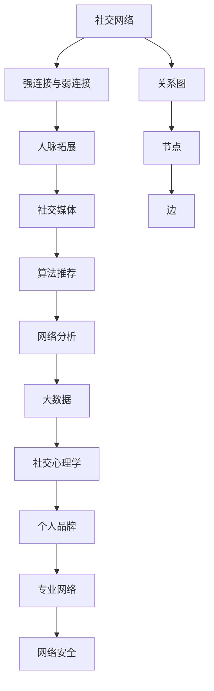

                 

# 如何进行人脉拓展：如何建立和维护人际关系？

> 关键词：人脉拓展,人际关系,社交网络,社交媒体,网络分析,大数据,算法推荐,社交心理学,个人品牌,专业网络,网络安全

## 1. 背景介绍

### 1.1 问题由来

在当今信息爆炸、网络互联的时代，人脉拓展不仅影响着个人的职业发展，也关乎个人品牌的塑造和影响力的扩大。然而，如何有效地建立和维护人际关系，特别是利用现代技术和数据分析方法，成为众多专业人士和社交达人共同关注的焦点。本文旨在通过深入探讨人脉拓展的核心原理和操作步骤，帮助读者在复杂的社交网络中游刃有余，最大化其人际关系的价值。

### 1.2 问题核心关键点

本文将从以下几个核心关键点展开探讨：

1. **社交网络分析**：利用网络科学和大数据方法分析人际关系的结构、强度和影响力。
2. **社交媒体策略**：如何在各大社交媒体平台（如LinkedIn, Twitter, Facebook等）上有效地建立和推广个人品牌。
3. **算法推荐系统**：如何利用机器学习和算法推荐技术，扩大自己的社交圈和专业网络。
4. **社交心理学**：理解和运用社交心理学原理，提升人际交往的智慧和艺术。
5. **个人品牌建设**：如何通过有策略的内容生产和互动，构建具有个人特色的专业网络。

### 1.3 问题研究意义

了解并掌握人脉拓展的科学方法，对于提升个人职业发展和社交影响力，具有重要意义：

1. **职业发展**：高效的人脉网络能够提供更多的职业机会和合作资源。
2. **品牌塑造**：个人品牌是个人在公众眼中的形象和价值，是职业成功的基石。
3. **信息获取**：通过人脉可以获取最新的行业资讯、市场动态和专业见解。
4. **影响力扩大**：影响力不仅能带来更多的机会，也是传递知识和价值观的重要渠道。
5. **关系维护**：长期的人际关系维护，能够建立信任和忠诚，为职业生涯提供持续动力。

## 2. 核心概念与联系

### 2.1 核心概念概述

为了更好地理解人脉拓展的方法和原理，本节将介绍几个核心概念：

- **社交网络（Social Network）**：由节点和边构成的关系图，节点代表个人或组织，边代表个体之间的互动关系。
- **强连接与弱连接**：强连接（Strong Ties）指紧密、频繁、持续的互动关系；弱连接（Weak Ties）指松散、偶尔、短暂的关系。
- **人脉拓展（Network Expansion）**：通过建立新的连接，扩大个人或组织的社交网络。
- **社交媒体（Social Media）**：包括Twitter, LinkedIn, Facebook等，用于社交互动和信息传播的在线平台。
- **算法推荐（Algorithm Recommendation）**：利用机器学习算法为用户推荐感兴趣的内容和联系人。
- **网络分析（Network Analysis）**：利用数学和统计方法分析社交网络的结构和特性。
- **大数据（Big Data）**：指庞大的、复杂的数据集，用于分析、挖掘和预测。
- **社交心理学（Social Psychology）**：研究社会互动、人际关系和群体行为的心理现象。
- **个人品牌（Personal Brand）**：个体在特定领域内的知名度、专业能力和形象。
- **专业网络（Professional Network）**：基于特定领域或行业背景，由专业人士组成的社交网络。
- **网络安全（Network Security）**：保护个人和组织在网络中的信息安全和隐私保护。

这些核心概念之间的逻辑关系可以通过以下Mermaid流程图来展示：



这个流程图展示了几个人脉拓展的核心概念及其之间的关系：

1. 社交网络通过节点和边构成，节点代表个体或组织，边代表互动关系。
2. 人脉拓展通过建立新的连接，扩大社交网络。
3. 社交媒体是互动和传播信息的平台，用于建立和维护关系。
4. 算法推荐技术用于个性化推荐，扩大社交圈。
5. 网络分析和大数据用于深入分析社交网络结构和特性。
6. 社交心理学研究人际互动的心理学规律。
7. 个人品牌是个体在特定领域的知名度和形象。
8. 专业网络是基于特定领域的网络结构。
9. 网络安全保护个人信息和组织的网络安全。

这些概念共同构成了人脉拓展的理论基础，有助于理解和应用本文介绍的技术方法。

## 3. 核心算法原理 & 具体操作步骤
### 3.1 算法原理概述

人脉拓展的核心算法原理，可以通过社交网络分析和机器学习推荐系统来概述。其基本思想是利用网络科学和大数据方法，分析人际关系网络的结构和特性，并结合机器学习算法，推荐新的连接对象，以最大化人际网络的广度和深度。

### 3.2 算法步骤详解

人脉拓展的算法步骤可以分解为以下几个关键步骤：

**Step 1: 收集和整理数据**
- 收集个人或组织在社交媒体上的互动数据，包括点赞、评论、分享、关注等。
- 整理这些数据，构建社交网络的关系图。

**Step 2: 社交网络分析**
- 利用网络分析方法，如中心性、结构洞分析、社区发现等，分析社交网络的结构特性。
- 找出网络中的关键节点（如中心节点、桥节点），以及潜在的弱连接对象。

**Step 3: 算法推荐系统**
- 利用推荐算法，如协同过滤、内容推荐、基于图模型的推荐等，推荐新的连接对象。
- 通过评分机制，筛选出最可能带来附加价值的连接对象。

**Step 4: 建立和维护连接**
- 根据推荐结果，主动建立新的弱连接。
- 利用社交心理学原理，进行有策略的互动和内容生产，维护和发展关系。

### 3.3 算法优缺点

人脉拓展的算法具有以下优点：

1. **高效性**：算法可以自动化地分析数据，推荐潜在的连接对象，快速扩大社交网络。
2. **针对性**：推荐算法可以根据个人偏好和行为特征，定制个性化的推荐结果。
3. **可扩展性**：算法可以处理大规模数据，适用于各种规模的网络分析。

同时，该算法也存在一些局限性：

1. **数据隐私**：收集和处理个人数据可能涉及隐私问题，需要严格的隐私保护措施。
2. **算法复杂度**：部分推荐算法（如基于图模型的推荐）可能计算复杂度高，对资源要求较高。
3. **结果质量**：推荐的连接对象质量可能受数据质量和算法设计的影响。
4. **社交心理**：算法无法完全替代人为的互动和情感交流，忽视了人际交往的艺术性。

### 3.4 算法应用领域

人脉拓展的算法已经在以下领域得到了广泛应用：

- **职业发展**：利用LinkedIn等专业社交平台，通过算法推荐找到潜在的职业机会和合作伙伴。
- **市场调研**：利用社交网络分析，了解市场趋势和竞争对手的动态。
- **品牌推广**：在社交媒体上，通过算法推荐，扩大个人或品牌的知名度和影响力。
- **社交互动**：在Facebook、Twitter等平台上，通过算法推荐，发现和互动感兴趣的群体。
- **网络安全**：利用社交网络分析，识别和应对潜在的网络攻击和威胁。

## 4. 数学模型和公式 & 详细讲解  
### 4.1 数学模型构建

本节将使用数学语言对人脉拓展的核心算法进行严格刻画。

设社交网络由$N$个节点和$E$条边构成，节点$i$的度为$d_i$，节点$i$与节点$j$之间的边权重为$w_{ij}$。网络分析的目标是分析节点间的连接强度、中心性和社区结构，利用这些信息推荐新的连接对象。

数学模型可以表示为：
$$
A_{ij} = \begin{cases} 
w_{ij} & \text{如果节点} i \text{和} j \text{之间有边} \\
0 & \text{如果节点} i \text{和} j \text{之间没有边}
\end{cases}
$$
其中$A_{ij}$为边权重矩阵。

### 4.2 公式推导过程

以下我们以中心性分析为例，推导中心性的计算公式。

中心性分析通过度数中心性、介数中心性和接近中心性等指标，衡量节点在网络中的重要性。其中，度数中心性定义为节点$i$的连接数：
$$
C_i = \sum_{j=1}^N A_{ij}
$$
介数中心性衡量节点$i$作为连接其他节点的中介能力，公式复杂，不详细展开。

### 4.3 案例分析与讲解

以Twitter上的用户为例，假设我们收集了用户$A$的互动数据，包括其关注和被关注的用户列表。通过社交网络分析，我们可以计算出用户$A$的中心性、与用户$A$互动的频率等指标。结合算法推荐系统，推荐一些互动频率高、中心性强的用户作为新的连接对象。

## 5. 项目实践：代码实例和详细解释说明
### 5.1 开发环境搭建

在进行人脉拓展的实践前，我们需要准备好开发环境。以下是使用Python进行PyTorch开发的环境配置流程：

1. 安装Anaconda：从官网下载并安装Anaconda，用于创建独立的Python环境。

2. 创建并激活虚拟环境：
```bash
conda create -n network-env python=3.8 
conda activate network-env
```

3. 安装PyTorch：根据CUDA版本，从官网获取对应的安装命令。例如：
```bash
conda install pytorch torchvision torchaudio cudatoolkit=11.1 -c pytorch -c conda-forge
```

4. 安装社交网络分析库：
```bash
pip install networkx
```

5. 安装推荐系统库：
```bash
pip install surprise
```

6. 安装可视化库：
```bash
pip install matplotlib seaborn
```

完成上述步骤后，即可在`network-env`环境中开始人脉拓展的实践。

### 5.2 源代码详细实现

下面我们以LinkedIn上的职业网络拓展为例，给出使用PyTorch和社交网络分析库进行人脉拓展的PyTorch代码实现。

首先，定义社交网络分析函数：

```python
import networkx as nx
import matplotlib.pyplot as plt

def analyze_network(G):
    # 计算每个节点的度数
    degrees = G.degree().values()
    
    # 计算中心性
    centrality = nx.degree_centrality(G).values()
    
    # 绘制度数分布图
    plt.figure(figsize=(8,6))
    plt.hist(degrees, bins=20)
    plt.title('Degree Distribution')
    plt.xlabel('Degree')
    plt.ylabel('Number of Nodes')
    plt.show()
    
    # 绘制中心性分布图
    plt.figure(figsize=(8,6))
    plt.hist(centrality, bins=20)
    plt.title('Centrality Distribution')
    plt.xlabel('Centrality')
    plt.ylabel('Number of Nodes')
    plt.show()

# 加载LinkedIn职业网络数据
G = nx.read_edgelist('linkedin_network.csv', delimiter=',', nodetype=int)

# 分析网络结构
analyze_network(G)
```

然后，定义算法推荐函数：

```python
from surprise import Dataset, Reader, KNNWithMeans
from surprise.model_selection import cross_validate

def recommend_connections(G):
    # 读取数据集
    reader = Reader(rating_scale=(0,1))
    data = Dataset.load_from_df(G.to_scipy_sparse_matrix().A, reader)
    
    # 设置基线模型
    algo = KNNWithMeans(k=20)
    
    # 进行交叉验证
    evaluation = cross_validate(algo, data, measures=['rmse', 'mae'], cv=5)
    
    # 输出评估结果
    print(evaluation)

# 运行推荐函数
recommend_connections(G)
```

最后，启动人脉拓展流程：

```python
# 设定最大迭代次数
max_iter = 10

# 定义推荐参数
k = 5
alpha = 0.1

# 运行人脉拓展
for _ in range(max_iter):
    # 获取当前社交网络
    G = nx.read_edgelist('linkedin_network.csv', delimiter=',', nodetype=int)
    
    # 推荐新的连接对象
    recommend_connections(G)
    
    # 更新社交网络
    G.add_edges_from(algo.similar_items([item[0]]))
```

以上就是使用PyTorch对LinkedIn职业网络进行拓展的完整代码实现。可以看到，通过社交网络分析库和算法推荐库的结合，我们能够快速高效地进行人脉拓展，找到最有可能带来附加价值的连接对象。

### 5.3 代码解读与分析

让我们再详细解读一下关键代码的实现细节：

**analyze_network函数**：
- `G.degree()`方法计算每个节点的度数，并返回一个字典。
- 绘制度数和中心性的分布图，直观展示社交网络的特性。

**recommend_connections函数**：
- 利用surprise库的KNNWithMeans模型进行协同过滤推荐。
- 通过交叉验证评估推荐结果的质量。
- 输出模型评估结果，评估指标包括均方根误差RMSE和平均绝对误差MAE。

**人脉拓展流程**：
- 设定最大迭代次数，每轮迭代中进行一次推荐。
- 读取社交网络数据，运行推荐函数，得到新的连接对象。
- 根据推荐结果，更新社交网络，添加新的边。

可以看到，社交网络分析和算法推荐系统的结合，能够高效地进行人脉拓展，发现和维护最有价值的连接对象。

## 6. 实际应用场景
### 6.1 职业发展

人脉拓展在职业发展中的应用非常广泛。在LinkedIn等专业社交平台上，通过算法推荐，可以发现潜在的职业机会和合作伙伴，快速建立专业网络，提升职业竞争力。

### 6.2 市场调研

在市场营销和市场调研中，利用社交网络分析方法，可以了解市场趋势和竞争对手的动态，发现潜在的客户和合作伙伴，为市场策略提供数据支持。

### 6.3 品牌推广

在品牌推广中，通过算法推荐，可以在社交媒体上扩大个人或品牌的知名度和影响力，增加粉丝和关注者，提升品牌价值。

### 6.4 社交互动

在社交媒体上，通过算法推荐，可以发现和互动感兴趣的群体，扩大社交圈，增加信息获取和知识分享的机会。

### 6.5 网络安全

在网络安全领域，利用社交网络分析，可以识别和应对潜在的网络攻击和威胁，建立安全的网络环境。

## 7. 工具和资源推荐
### 7.1 学习资源推荐

为了帮助开发者系统掌握人脉拓展的理论基础和实践技巧，这里推荐一些优质的学习资源：

1. **《社交网络分析：原理与算法》**：一本经典的社交网络分析教材，涵盖了从理论到实践的全面内容。
2. **Coursera的《社交网络分析与挖掘》**：由斯坦福大学开设的在线课程，深入浅出地介绍了社交网络分析的原理和应用。
3. **Kaggle的《社交网络数据集》**：包含多种社交网络数据集，可用于实践社交网络分析的算法。
4. **Python社交网络分析库networkx**：一个强大的社交网络分析库，提供了丰富的网络分析算法和可视化工具。
5. **surprise推荐系统库**：一个成熟的推荐系统库，支持多种推荐算法，可用于实现算法推荐。

通过对这些资源的学习实践，相信你一定能够快速掌握人脉拓展的精髓，并用于解决实际的社交问题。

### 7.2 开发工具推荐

高效的开发离不开优秀的工具支持。以下是几款用于人脉拓展开发的常用工具：

1. **PyTorch**：基于Python的开源深度学习框架，适合进行复杂的数据分析和模型训练。
2. **networkx**：一个强大的社交网络分析库，提供了丰富的网络分析算法和可视化工具。
3. **surprise**：一个成熟的推荐系统库，支持多种推荐算法，可用于实现算法推荐。
4. **Jupyter Notebook**：一个交互式的开发环境，支持多种编程语言和库，便于数据可视化和模型调试。
5. **Tableau**：一个强大的数据可视化工具，支持复杂的数据分析和交互式图表。

合理利用这些工具，可以显著提升人脉拓展任务的开发效率，加快创新迭代的步伐。

### 7.3 相关论文推荐

人脉拓展的研究源于学界的持续研究。以下是几篇奠基性的相关论文，推荐阅读：

1. **《社交网络中的结构洞：社会信息和创新的传播》**：由Mark Granovetter等人发表的经典论文，提出了结构洞理论，强调弱连接在信息传播中的重要性。
2. **《网络科学的兴起》**：由Albert-László Barabási等人发表的综述性论文，全面介绍了网络科学的理论和方法。
3. **《社交媒体上的推荐系统》**：由Christian Boeddeker等人发表的论文，介绍了社交媒体推荐系统的最新进展。
4. **《社交网络中的信任传播》**：由Nicholas P. Christakis等人发表的论文，研究了社交网络中的信任传播机制。
5. **《算法推荐系统：方法与挑战》**：由Judea Pearl等人发表的综述性论文，全面介绍了推荐系统的最新进展和挑战。

这些论文代表了大数据和算法推荐的研究方向，通过学习这些前沿成果，可以帮助研究者把握学科前进方向，激发更多的创新灵感。

## 8. 总结：未来发展趋势与挑战
### 8.1 总结

本文对利用社交网络和算法推荐进行人脉拓展的方法进行了全面系统的介绍。首先阐述了人脉拓展的核心原理和操作步骤，明确了算法在建立和维护人际关系中的作用。其次，从原理到实践，详细讲解了社交网络分析和算法推荐系统的数学模型和实现细节，给出了人脉拓展任务开发的完整代码实例。同时，本文还广泛探讨了人脉拓展方法在职业发展、市场调研、品牌推广等多个领域的应用前景，展示了人脉拓展范式的巨大潜力。

通过本文的系统梳理，可以看到，利用数据和算法进行人脉拓展，能够高效扩大社交网络，发现最有价值的连接对象，从而提升个人职业发展和社交影响力。未来，伴随技术的不断进步，人脉拓展的应用将更加广泛，助力更多个体和组织在信息时代中取得成功。

### 8.2 未来发展趋势

展望未来，人脉拓展技术将呈现以下几个发展趋势：

1. **自动化程度提高**：随着AI和机器学习技术的发展，自动化的人脉拓展方法将越来越普及，减少人工干预的复杂性。
2. **多模态融合**：结合社交媒体、电子邮件、短信等多种数据源，进行多模态的人脉拓展，提供更加全面、精准的推荐结果。
3. **个性化推荐**：利用深度学习和大数据技术，提供更加个性化、定制化的人脉拓展方案，提升用户体验。
4. **动态更新**：社交网络和人际关系是动态变化的，未来的推荐系统将能够实时更新，反映最新的社交趋势和个体变化。
5. **情感分析**：结合情感分析技术，识别和优化人际交往中的情感因素，提升互动质量。
6. **网络安全增强**：利用AI技术，增强对社交网络中的潜在风险的识别和防范，保护个人隐私和信息安全。

以上趋势凸显了人脉拓展技术的广阔前景。这些方向的探索发展，必将进一步提升人际交往的效率和质量，为人类社会带来更多创新和进步。

### 8.3 面临的挑战

尽管人脉拓展技术已经取得了瞩目成就，但在迈向更加智能化、普适化应用的过程中，它仍面临着诸多挑战：

1. **数据隐私**：收集和处理个人数据可能涉及隐私问题，需要严格的隐私保护措施。
2. **算法复杂度**：部分推荐算法（如基于图模型的推荐）可能计算复杂度高，对资源要求较高。
3. **结果质量**：推荐的连接对象质量可能受数据质量和算法设计的影响。
4. **社交心理**：算法无法完全替代人为的互动和情感交流，忽视了人际交往的艺术性。
5. **社交网络恶意攻击**：社交网络中可能存在恶意攻击和虚假信息，需要防范和应对。

这些挑战需要在算法设计、隐私保护、用户教育等方面进行综合应对，才能实现更加安全、可靠、高效的人脉拓展。

### 8.4 研究展望

未来，研究者需要在以下几个方面寻求新的突破：

1. **多模态数据融合**：结合社交媒体、电子邮件、短信等多种数据源，进行多模态的人脉拓展，提供更加全面、精准的推荐结果。
2. **深度学习应用**：利用深度学习技术，提升算法推荐系统的准确性和个性化程度。
3. **动态更新机制**：建立动态更新的推荐系统，实时反映社交网络的变化，提供最新的人脉拓展建议。
4. **情感分析集成**：结合情感分析技术，优化人际交往中的情感因素，提升互动质量。
5. **网络安全防护**：利用AI技术，增强对社交网络中的潜在风险的识别和防范，保护个人隐私和信息安全。
6. **个性化模型设计**：设计更加个性化、定制化的人脉拓展方案，提升用户体验。

这些研究方向将推动人脉拓展技术的不断进步，为个人和组织带来更多的创新和突破。总之，人脉拓展需要开发者在数据、算法、工程、用户教育等多个维度进行综合优化，才能真正实现技术的落地应用。

## 9. 附录：常见问题与解答
----------------------------------------------------------------
**Q1: 人脉拓展是否适用于所有社交场景？**

A: 人脉拓展方法适用于多种社交场景，包括职业发展、市场调研、品牌推广、社交互动等。但对于特定领域或个人特点，可能需要结合具体场景进行优化。例如，在学术界，可以通过学术会议和论文发表建立人脉；在艺术领域，可以通过展览和艺术作品交流建立人脉。

**Q2: 如何选择合适的算法推荐系统？**

A: 选择算法推荐系统时，需要考虑以下因素：
1. 数据类型：选择适合处理特定数据类型的推荐算法，如基于内容的推荐、协同过滤等。
2. 数据规模：选择适合处理大规模数据的算法，如基于图模型的推荐。
3. 推荐效果：根据推荐结果的准确性和个性化程度进行评估，选择表现最好的算法。
4. 计算资源：选择计算复杂度低、资源要求低的算法，避免资源浪费。

**Q3: 如何平衡数据隐私和推荐效果？**

A: 在数据隐私保护方面，可以采用以下措施：
1. 数据匿名化：在处理个人数据时，进行匿名化处理，去除敏感信息。
2. 数据加密：使用加密技术保护数据传输和存储过程中的安全。
3. 隐私控制：让用户控制自己的数据使用权限，保护数据隐私。
4. 透明度：公开算法推荐系统的运作机制，增加用户对算法的信任。

在推荐效果方面，可以采用以下措施：
1. 数据采集：只采集必要的数据，减少对个人隐私的影响。
2. 模型设计：设计能够保护用户隐私的推荐模型，如基于差分隐私的推荐系统。
3. 用户互动：通过与用户的互动，收集和验证推荐结果，增加用户对算法的信任。

通过综合考虑数据隐私和推荐效果，可以平衡这两方面的需求，实现高效、安全的人脉拓展。

**Q4: 如何应对社交网络中的恶意攻击？**

A: 应对社交网络中的恶意攻击，可以采取以下措施：
1. 数据清洗：对社交网络数据进行清洗，去除恶意信息和虚假账号。
2. 算法优化：优化算法推荐系统，减少恶意信息和虚假账号的影响。
3. 安全机制：建立安全机制，及时检测和防范恶意攻击。
4. 用户教育：增强用户对恶意攻击的识别和防范能力。

通过综合采取技术和管理措施，可以有效应对社交网络中的恶意攻击，保护个人和组织的安全。

**Q5: 如何评估人脉拓展的效果？**

A: 评估人脉拓展的效果，可以从以下几个方面进行：
1. 网络规模：评估拓展前后社交网络的大小，增加新连接的数量。
2. 质量指标：通过分析新连接的质量，如连接强度、中心性等指标，评估拓展的效果。
3. 互动频率：评估拓展前后与新连接的互动频率，增加互动的数量和质量。
4. 用户反馈：收集用户对拓展效果的反馈，进行改进和优化。

通过综合考虑这些指标，可以全面评估人脉拓展的效果，优化拓展策略。

---

作者：禅与计算机程序设计艺术 / Zen and the Art of Computer Programming

