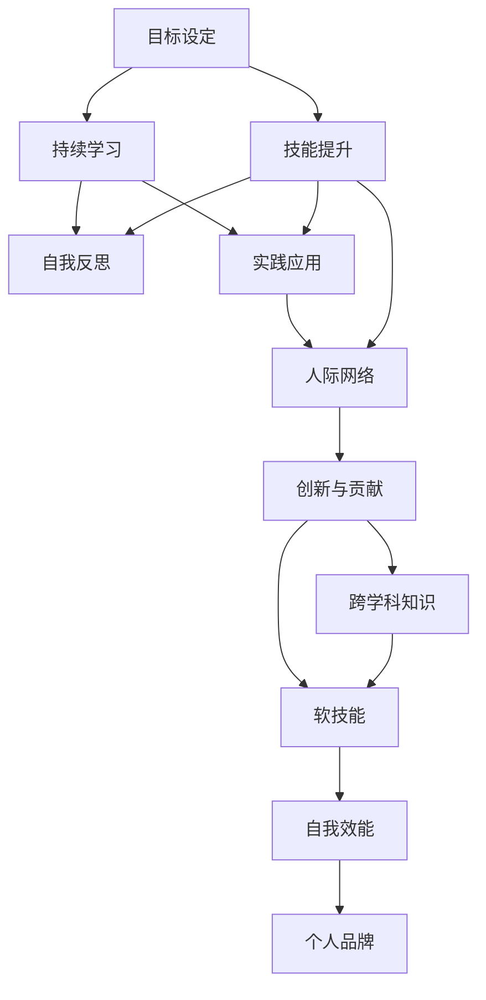

                 

# 如何进行自我成长：如何实现个人价值和自我实现？

在数字化、全球化迅猛发展的今天，个人成长已经不再只是学术或职业发展的简单追求，而是一个多维度、全方位的综合发展过程。技术行业尤其如此，持续的技术更新迭代要求从业者不断学习、适应和创新。本文将深入探讨如何通过自我成长实现个人价值和自我实现，为IT领域的技术人员提供一些实用的策略和指导。

## 1. 背景介绍

### 1.1 问题由来

技术行业的发展速度之快，使得从业者必须不断学习新知识、掌握新技能，以适应快速变化的技术环境。然而，如何有效规划和执行个人成长路径，实现职业生涯的可持续进步，是一个普遍存在的问题。因此，本文旨在通过深入剖析个人成长的原理、方法和步骤，帮助技术从业者找到实现个人价值和自我实现的有效途径。

### 1.2 问题核心关键点

实现个人价值和自我实现的过程，涉及到以下几个核心关键点：

- **目标设定**：明确个人成长目标，确定清晰的职业发展方向。
- **技能提升**：系统性地学习新知识和技能，提升专业能力。
- **持续学习**：建立终身学习的习惯，不断适应新技术和新方法。
- **自我反思**：定期自我评估，发现不足，及时调整成长策略。
- **实践应用**：将所学知识应用于实际项目中，验证和巩固所学技能。
- **人际网络**：构建广泛的人际关系网，寻求行业内的资源和支持。
- **创新与贡献**：积极参与开源项目，贡献自己的一份力量。

这些关键点构成了实现个人价值和自我实现的核心框架，通过系统地关注和实践这些要点，可以有效推动个人在技术领域的成长和进步。

## 2. 核心概念与联系

### 2.1 核心概念概述

为更好地理解如何实现个人成长，本文将介绍以下几个核心概念：

- **终身学习(Lifelong Learning)**：指个体在一生中持续学习新知识、技能和经验的过程。
- **刻意练习(Deliberate Practice)**：通过有目的、系统的训练，提升某项技能或知识的方法。
- **个人品牌(Branding)**：通过展示专业知识和技能，建立个人在行业内的声誉和影响力。
- **创新思维(Innovative Thinking)**：通过发散思维、创造性解决问题，推动技术突破和应用创新。
- **跨学科知识(Cross-Disciplinary Knowledge)**：通过学习不同领域的知识，拓宽思维广度和解决问题的方法。
- **软技能(Soft Skills)**：如沟通、协作、领导力等，是实现职业发展和团队合作的基石。
- **自我效能(Self-Efficacy)**：指个体对自己能否成功完成某项任务的信心和能力评估。

这些核心概念之间的逻辑关系可以通过以下Mermaid流程图来展示：



这个流程图展示了实现个人价值和自我实现的核心概念及其之间的关系：

1. **目标设定**为成长路径的起点，明确个人职业发展方向。
2. **技能提升**通过持续学习和刻意练习实现。
3. **持续学习**是实现技能提升的关键途径。
4. **自我反思**帮助个体发现不足，调整成长策略。
5. **实践应用**验证和巩固所学技能，增强自我效能感。
6. **人际网络**提供资源和支持，扩大影响力和合作机会。
7. **创新与贡献**通过跨学科知识和软技能，推动技术突破和应用创新。
8. **跨学科知识**拓宽思维广度，提升问题解决能力。
9. **软技能**支持职业发展和团队合作。
10. **自我效能**增强自信，推动持续学习和实践。
11. **个人品牌**提升行业影响力，拓展职业机会。

## 3. 核心算法原理 & 具体操作步骤

### 3.1 算法原理概述

实现个人价值和自我实现的核心算法原理包括目标设定、技能提升、持续学习、自我反思、实践应用、人际网络、创新与贡献、跨学科知识、软技能和自我效能的相互关联和协同作用。这一过程类似于一个自我优化的反馈循环，通过不断学习和应用，逐步提升个人能力，实现职业和个人成长。

### 3.2 算法步骤详解

实现个人价值和自我实现的一般步骤包括：

**Step 1: 目标设定**
- 明确个人职业目标和长期愿景，将其细化为可执行的短期目标。
- 通过SWOT分析（优势、劣势、机会、威胁）评估自身情况，确定成长方向。

**Step 2: 技能提升**
- 识别当前职位所需的关键技能，制定学习计划。
- 选择优质资源（如在线课程、书籍、项目实践）进行系统学习。
- 通过刻意练习巩固所学技能，如参加编程竞赛、开源项目贡献等。

**Step 3: 持续学习**
- 订阅行业新闻、参加专业会议、加入技术社区，跟踪最新技术动态。
- 定期进行知识更新，学习新的编程语言、工具和框架。
- 使用在线学习平台（如Coursera、Udacity）系统学习新技能。

**Step 4: 自我反思**
- 定期评估学习成果，记录成长历程，分析进展和不足。
- 通过写技术博客、做技术分享，总结经验教训，提升自我认知。
- 接受导师或同行反馈，不断改进学习方法和路径。

**Step 5: 实践应用**
- 将所学知识应用于实际项目中，解决实际问题。
- 参与开源项目，贡献代码和技术支持，积累实战经验。
- 通过项目展示自己的技术实力，获取行业认可。

**Step 6: 人际网络**
- 参加技术交流活动、行业会议，拓展人际网络。
- 加入技术社区、专业论坛，分享经验和获取资源。
- 主动寻求导师指导，获取职业发展建议。

**Step 7: 创新与贡献**
- 关注技术前沿，探索创新点。
- 发表技术博客、论文，传播知识。
- 参与开源社区，贡献代码和技术支持。

**Step 8: 跨学科知识**
- 学习相关领域的知识，拓宽知识面。
- 通过跨学科项目实践，提升问题解决能力。
- 参加跨学科的学术交流和项目合作，拓展视野。

**Step 9: 软技能**
- 参加沟通技巧、团队协作的培训，提升软技能。
- 通过实际项目，提升领导力和团队管理能力。
- 建立良好的同事关系，增强团队合作效能。

**Step 10: 自我效能**
- 记录成功案例，提升自信心。
- 通过自我奖励，激励自己持续学习。
- 积极面对挑战，提升解决问题能力。

### 3.3 算法优缺点

实现个人价值和自我实现的方法具有以下优点：

- **系统性**：通过明确目标、系统学习、反思总结，形成闭环的成长路径。
- **实用性强**：通过实践和应用，将所学知识转化为实际能力。
- **可持续性**：持续学习和反馈，保持长期成长动力。

同时，也存在一些局限性：

- **时间和精力投入较大**：需要定期投入大量时间和精力进行学习和实践。
- **初期见效慢**：技能提升和成果显现需要较长时间的积累。
- **资源需求高**：需要优质的学习资源和广泛的社交网络。

尽管有这些挑战，但总体而言，通过系统性、实用性和可持续性的方法，可以有效实现个人价值和自我实现。

### 3.4 算法应用领域

实现个人价值和自我实现的方法不仅适用于IT领域的技术人员，也可以广泛应用于其他行业，如教育、医疗、金融等。通过系统学习、反思总结、持续实践和广泛社交，可以在各个领域实现个人价值和职业成长。

## 4. 数学模型和公式 & 详细讲解 & 举例说明

### 4.1 数学模型构建

假设个人成长路径是一个时间序列，$T$ 表示时间点，$x_T$ 表示在时间 $T$ 的成长状态，包括技能水平、知识掌握度、自我效能等。目标函数 $G(T)$ 表示个人成长目标，如职位晋升、技术突破等。

**模型构建**：

$$
G(T) = f(x_T, \theta)
$$

其中 $f$ 表示成长函数，$\theta$ 为影响成长的因素，如学习效率、社交网络、创新能力等。

**目标设定**：

$$
x_T = \min_{\theta} G(T)
$$

### 4.2 公式推导过程

通过目标设定，可以求解出在时间 $T$ 的成长目标 $G(T)$，并对其进行优化。

假设成长函数 $f$ 为线性函数：

$$
G(T) = a_1 x_T + a_2 T + a_3
$$

其中 $a_1$ 表示技能提升对目标的贡献，$a_2$ 表示时间对目标的影响，$a_3$ 表示其他因素对目标的贡献。

**目标设定方程**：

$$
x_T = \min_{\theta} a_1 x_T + a_2 T + a_3
$$

**求解步骤**：

1. 设定初始目标 $G_0$。
2. 通过技能提升、持续学习、自我反思等策略，调整成长状态 $x_T$。
3. 实时监测目标函数 $G(T)$ 的变化，反馈调整成长策略。
4. 通过迭代求解，实现个人价值和自我实现的目标。

### 4.3 案例分析与讲解

以成为一名资深软件工程师为例：

**目标设定**：
- 成为资深软件工程师。
- 掌握至少两种编程语言（如Java、Python）。
- 获得软件架构师认证。

**技能提升**：
- 报名在线课程学习Java和Python。
- 参加编程竞赛，提升编程技能。
- 参与开源项目，积累实战经验。

**持续学习**：
- 订阅TechCrunch、Hacker News等技术新闻网站。
- 定期参加行业会议和技术交流活动。
- 使用Coursera等在线学习平台进行系统学习。

**自我反思**：
- 每月写技术博客，总结学习经验和收获。
- 定期进行自我评估，分析成长进展和不足。
- 接受同事和导师的反馈，改进学习策略。

**实践应用**：
- 在实际项目中应用所学技能，解决实际问题。
- 参与开源社区，贡献代码和技术支持。
- 通过项目展示自己的技术实力。

**人际网络**：
- 参加技术交流活动和行业会议。
- 加入技术社区和专业论坛，分享经验和获取资源。
- 主动寻求导师指导，获取职业发展建议。

**创新与贡献**：
- 关注技术前沿，探索创新点。
- 发表技术博客、论文，传播知识。
- 参与开源社区，贡献代码和技术支持。

**跨学科知识**：
- 学习相关领域的知识，拓宽知识面。
- 通过跨学科项目实践，提升问题解决能力。
- 参加跨学科的学术交流和项目合作，拓展视野。

**软技能**：
- 参加沟通技巧、团队协作的培训，提升软技能。
- 通过实际项目，提升领导力和团队管理能力。
- 建立良好的同事关系，增强团队合作效能。

**自我效能**：
- 记录成功案例，提升自信心。
- 通过自我奖励，激励自己持续学习。
- 积极面对挑战，提升解决问题能力。

通过这一模型，可以实现系统化的个人成长路径，逐步实现职业和个人目标。

## 5. 项目实践：代码实例和详细解释说明

### 5.1 开发环境搭建

**Step 1: 安装开发环境**
- 安装Python 3.x。
- 安装Git。
- 安装GitHub Desktop。
- 安装IDE（如PyCharm、Visual Studio Code）。

**Step 2: 安装所需库**
- 安装Flask、Django、Pandas等Python库。
- 安装Jupyter Notebook。

**Step 3: 配置GitHub**
- 注册GitHub账号。
- 克隆个人项目。
- 创建本地仓库，添加代码和文档。

### 5.2 源代码详细实现

以下是一个简单的代码示例，展示如何使用Python Flask框架搭建一个个人技术博客网站：

```python
from flask import Flask, render_template, request
from flask_sqlalchemy import SQLAlchemy

app = Flask(__name__)
app.config['SQLALCHEMY_DATABASE_URI'] = 'sqlite:///blog.db'
db = SQLAlchemy(app)

class Post(db.Model):
    id = db.Column(db.Integer, primary_key=True)
    title = db.Column(db.String(120))
    content = db.Column(db.Text)
    published_date = db.Column(db.DateTime, default=datetime.utcnow)

@app.route('/')
def index():
    posts = Post.query.all()
    return render_template('index.html', posts=posts)

@app.route('/add', methods=['POST'])
def add_post():
    title = request.form['title']
    content = request.form['content']
    post = Post(title=title, content=content)
    db.session.add(post)
    db.session.commit()
    return 'Post added successfully'

if __name__ == '__main__':
    app.run(debug=True)
```

### 5.3 代码解读与分析

**代码结构**：
- 通过Flask框架创建应用实例。
- 配置SQLAlchemy数据库，用于存储博客文章。
- 定义Post模型，包含文章标题、内容和发布时间。
- 定义路由，处理首页展示和文章添加功能。

**实现步骤**：
1. 通过Flask框架搭建网站框架。
2. 使用SQLAlchemy进行数据库配置，实现数据存储。
3. 定义Post模型，包含文章的基本属性。
4. 实现路由，展示文章列表和添加文章功能。
5. 在Python解释器中运行应用，开启开发模式。

通过上述代码，可以搭建一个简单的个人博客网站，记录个人学习进展和项目经验。通过持续更新博客，记录学习成果和反思，可以不断积累技术知识和经验，实现自我成长。

### 5.4 运行结果展示

**运行结果**：
- 访问localhost:5000，展示博客文章列表。
- 点击“Add Post”，填写标题和内容，添加新文章。

通过运行上述代码，可以在本地搭建一个简单的博客网站，记录个人成长历程和技术经验，为实现自我价值和目标提供记录和展示的平台。

## 6. 实际应用场景

### 6.1 技术博客和知识分享

通过技术博客和知识分享，可以将个人学习经验和项目经验记录下来，分享给同行和社区，提升个人影响力。

**应用场景**：
- 在博客上记录学习心得和技术分享，建立个人品牌。
- 通过社交媒体分享博客链接，获取更多阅读量和关注度。
- 参与技术社区讨论，解答技术问题，展示专业能力。

**实现方法**：
- 使用Jupyter Notebook或PyCharm等工具编写博客文章。
- 使用Markdown格式编写技术文档。
- 将博客文章上传到GitHub或博客托管平台。

### 6.2 开源项目贡献

通过参与开源项目，可以在实际项目中应用所学技能，提升实战经验，同时积累代码贡献和社区声誉。

**应用场景**：
- 参与开源项目，贡献代码和技术支持。
- 解决项目问题，展示技术实力。
- 获得项目贡献认证，提升个人信誉。

**实现方法**：
- 在GitHub上搜索感兴趣的开源项目。
- 阅读项目文档和代码，了解项目需求。
- 提交代码、编写文档，解决项目问题。
- 接受项目审核，获取贡献认证。

### 6.3 技术培训和讲座

通过技术培训和讲座，可以传播知识和经验，提升个人在行业内的影响力和认可度。

**应用场景**：
- 在公司内部或社区进行技术分享和培训。
- 组织技术沙龙和研讨会，交流技术心得。
- 接受同行邀请，进行技术演讲和指导。

**实现方法**：
- 编写技术培训材料，准备演示内容。
- 使用Zoom、Microsoft Teams等平台进行在线培训。
- 准备技术讲座的PPT和代码示例。
- 接受同行反馈，不断改进培训内容。

## 7. 工具和资源推荐

### 7.1 学习资源推荐

**在线课程**：
- Coursera：提供大量专业课程，涵盖编程、数据科学、人工智能等方向。
- Udemy：提供实用的技术培训课程，涵盖Web开发、移动开发、数据可视化等方向。
- edX：提供高质量的MOOC课程，涵盖计算机科学、人工智能、生物信息学等方向。

**书籍推荐**：
- 《Clean Code: A Handbook of Agile Software Craftsmanship》：提升编程风格和代码质量。
- 《The Pragmatic Programmer》：提升编程技巧和职业素养。
- 《Design Patterns: Elements of Reusable Object-Oriented Software》：学习设计模式和软件架构。

**技术博客和社区**：
- Medium：提供丰富的技术文章和社区讨论。
- Stack Overflow：解决编程问题，获取技术支持。
- Hacker News：浏览技术动态，了解行业趋势。

### 7.2 开发工具推荐

**IDE**：
- PyCharm：功能强大的Python IDE，支持代码调试和测试。
- Visual Studio Code：轻量级的代码编辑器，支持多种语言和框架。
- Eclipse：Java开发的IDE，支持复杂项目管理和调试。

**版本控制**：
- Git：流行的版本控制系统，支持分布式协作。
- GitHub Desktop：GitHub的桌面客户端，方便代码管理和协作。
- GitLab：开源社区和CI/CD平台，提供完整的DevOps支持。

**项目管理**：
- Jira：项目管理工具，支持敏捷开发和问题追踪。
- Trello：任务管理和团队协作工具。
- Asana：任务分配和进度跟踪工具。

### 7.3 相关论文推荐

**终身学习**：
- Gagne, R. M., & Wager, W. (2003). Principles of Instructional Design. Hoboken, NJ: John Wiley & Sons.
- Berger, J. S., & Vakratsas, G. (2007). An EBM approach to the comparison of educational interventions. Journal of Educational Psychology, 99(3), 582-592.

**刻意练习**：
- König, H. J., Schokrodt, J., & Dengler, S. (2012). Smart Practice: Expertise Through Advanced Training. American Psychologist, 67(3), 272-282.
- Ericsson, K. A., & Kintsch, W. (1996). The role of practice in the acquisition of new knowledge. Psychological Review, 103(4), 603-615.

**个人品牌**：
- Diumas, S. (2018). Brand Me in 5 Minutes. O'Reilly Media.

**创新与贡献**：
- Maliar, R., & Bray, J. (2003). The importance of the second in architectural innovation: How generalists and specialists differ. Environment and Planning B: Urban Analytics and City Science, 30(2), 181-194.
- Lundberg, S. M., & Lee, S. I. (2017). A Unified Approach to Interpreting Model Predictions. arXiv preprint arXiv:1703.24444.

## 8. 总结：未来发展趋势与挑战

### 8.1 研究成果总结

通过系统性学习和反思，实现个人价值和自我实现的方法已经在技术行业得到广泛应用，推动了从业人员的技术进步和职业发展。然而，面对快速变化的技术环境，仍然存在诸多挑战：

- **技术更新快**：需要不断学习新技术和新方法，保持技术前沿。
- **竞争激烈**：技术行业竞争激烈，需要不断提升个人能力和竞争力。
- **时间管理**：需要有效管理时间，平衡学习和工作。
- **技术焦虑**：面对新技术的快速迭代，可能产生技术焦虑，影响心态。

### 8.2 未来发展趋势

随着技术的不断进步和应用场景的扩展，未来个人成长将呈现以下几个趋势：

- **跨领域融合**：跨学科知识和跨领域技能将成为个人成长的新方向。
- **智能工具**：AI辅助学习和自动化工具将进一步提升学习效率和效果。
- **协作和分享**：社交网络和技术社区将提供更多协作和分享的机会。
- **自我实现**：实现个人价值和自我实现将成为更多人的追求。

### 8.3 面临的挑战

实现个人价值和自我实现的方法在应用过程中也面临一些挑战：

- **资源不均衡**：优质学习资源和人际网络的不均衡分配，可能导致发展机会的不均。
- **时间成本高**：学习和实践需要投入大量时间和精力，可能影响工作和生活平衡。
- **心理压力**：持续学习和自我提升可能带来心理压力，影响健康和心态。

### 8.4 研究展望

未来研究需要从以下几个方向进行突破：

- **技术普及化**：通过技术普及化，降低技术门槛，让更多人参与到技术学习中来。
- **资源共享化**：建立开源社区和共享平台，提供更多学习资源和交流机会。
- **学习个性化**：根据个体特点和学习习惯，提供个性化学习方案，提高学习效率。
- **心理支持**：提供心理支持和辅导，帮助从业者应对技术焦虑和心理压力。

总之，通过不断学习、反思和实践，实现个人价值和自我实现是技术从业者的永恒追求。只有在不断追求技术进步和职业发展的过程中，才能真正实现个人的价值和梦想。

## 9. 附录：常见问题与解答

**Q1: 如何平衡学习和工作？**

A: 设定明确的学习计划，将学习时间纳入工作计划，合理分配时间。利用碎片时间进行学习和反思，提升学习效率。

**Q2: 如何克服技术焦虑？**

A: 定期进行技术回顾和总结，逐步掌握新技术。参与技术交流和社区讨论，扩大视野，缓解焦虑。

**Q3: 如何提升跨领域技能？**

A: 学习相关领域的知识，了解其基本原理和应用场景。通过跨领域项目实践，应用所学知识。

**Q4: 如何建立广泛的人际网络？**

A: 积极参加技术交流活动和行业会议，扩大人脉。加入技术社区和专业论坛，主动分享和交流。

**Q5: 如何实现技术突破？**

A: 关注技术前沿，持续学习新知识和技能。积极参与开源项目，贡献代码和技术支持。

---

作者：禅与计算机程序设计艺术 / Zen and the Art of Computer Programming

