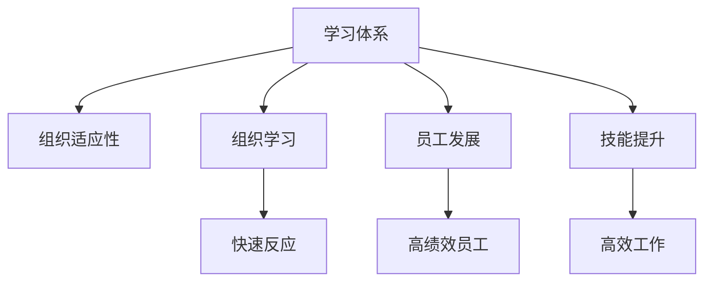
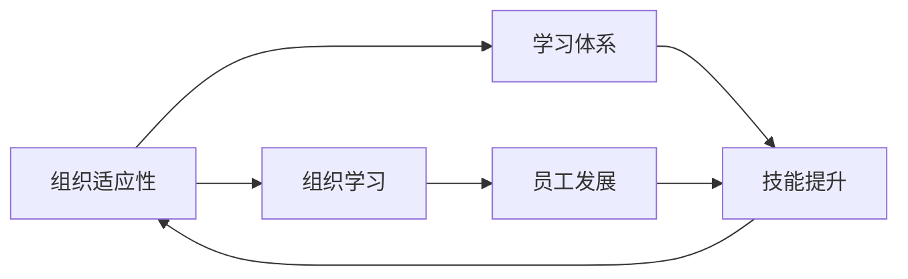

                 

# 学习体系对组织适应性的提升作用

> 关键词：学习体系, 组织适应性, 组织学习, 员工发展, 技能提升

## 1. 背景介绍

在当今快速变化的商业环境中，组织必须不断适应新趋势、新技术和新市场，才能保持竞争力。适应性（Adaptability）成为了现代企业成功的关键因素之一。然而，提高组织的适应性不仅仅依赖于外部环境的变化，也需要内部体系的优化。本文将探讨学习体系如何作为提升组织适应性的重要工具，通过构建持续的学习和成长环境，帮助组织应对未知的挑战，实现可持续发展。

## 2. 核心概念与联系

### 2.1 核心概念概述

- **学习体系（Learning System）**：是指一套旨在支持组织内部持续学习和技能提升的系统和流程，包括正式和非正式的学习方式、培训计划、知识管理、绩效反馈等元素。

- **组织适应性（Organizational Adaptability）**：指组织应对环境变化、接受新技术、适应新市场、管理变化的能力。

- **组织学习（Organizational Learning）**：通过持续的知识获取、技能提升和经验分享，增强组织应对变化的反应速度和能力。

- **员工发展（Employee Development）**：关注员工技能和能力的提升，使其能够胜任当前和未来的工作挑战。

- **技能提升（Skill Enhancement）**：通过学习体系支持员工不断学习新技能，提高工作效率和质量。

这些概念之间的逻辑关系可以通过以下Mermaid流程图来展示：



这个流程图展示了学习体系如何通过组织学习、员工发展和技能提升，最终增强组织的快速反应能力、员工绩效和整体工作效率。

### 2.2 核心概念原理和架构的 Mermaid 流程图



这个流程图展示了从组织适应性到技能提升，各个环节的相互关联和影响。学习体系作为中介，连接了组织学习、员工发展和技能提升，共同促进组织适应性的提升。

## 3. 核心算法原理 & 具体操作步骤

### 3.1 算法原理概述

基于学习体系对组织适应性的提升作用，我们可以将这一过程视为一个多阶段优化问题。其基本原理是通过不断收集和分析组织内外部的信息，识别出当前和未来的学习需求，并设计出满足这些需求的系统和流程。具体来说，该过程包括以下步骤：

1. **需求分析**：通过调研和评估，识别出组织内部和外部的变化趋势，明确学习需求。
2. **学习计划制定**：根据需求分析结果，制定相应的学习计划和目标。
3. **系统设计**：构建支持学习计划的技术和流程框架。
4. **执行与评估**：在实际工作中应用学习计划，并通过反馈机制进行持续改进。

### 3.2 算法步骤详解

#### 步骤1：需求分析

需求分析是构建学习体系的基础，主要包括以下几个方面：

1. **环境扫描**：对内部和外部环境进行全面的扫描和分析，识别潜在的威胁和机会。
2. **目标制定**：基于环境扫描结果，制定明确的学习目标，如提升某项关键技能、适应新市场等。
3. **需求识别**：通过访谈、问卷调查等方式，收集员工和业务部门的需求，明确学习的重点。

#### 步骤2：学习计划制定

在明确学习需求后，接下来需要制定具体的学习计划：

1. **课程设计**：根据需求分析结果，设计适合的课程内容，确保覆盖关键技能和知识。
2. **资源配置**：确定所需的资源，如培训师、学习工具、场地等。
3. **时间安排**：制定学习时间表，确保计划的可行性和持续性。

#### 步骤3：系统设计

系统设计是学习体系实施的关键步骤，包括以下几个方面：

1. **技术平台选择**：根据组织需求，选择合适的学习管理系统（LMS）或其他相关工具。
2. **数据整合**：将组织的知识库、培训记录、员工绩效数据等整合到系统中。
3. **流程设计**：设计学习流程，包括课程注册、学习进度跟踪、评估反馈等环节。

#### 步骤4：执行与评估

学习计划的执行和评估是持续优化的过程：

1. **实施学习计划**：按照时间表，开展培训、研讨会、在线课程等活动。
2. **反馈收集**：通过问卷、访谈等方式，收集员工对学习计划的感受和建议。
3. **效果评估**：定期评估学习计划的效果，如员工技能提升情况、工作绩效变化等。
4. **持续改进**：根据评估结果，调整和优化学习计划，确保其持续有效性。

### 3.3 算法优缺点

#### 优点

- **灵活性**：学习体系能够根据组织需求的变化，灵活调整和优化学习计划。
- **持续性**：通过持续的学习和技能提升，增强组织的适应性和竞争力。
- **成本效益**：通过提高员工技能，提升工作效率和质量，降低总体运营成本。

#### 缺点

- **复杂性**：构建和维护学习体系需要投入大量时间和资源。
- **执行难度**：实施学习计划时，可能需要跨部门协作，协调难度较大。
- **评估困难**：评估学习效果时，可能存在主观性和评估指标难以量化的挑战。

### 3.4 算法应用领域

学习体系不仅可以应用于传统企业，还可以拓展到多个新兴领域：

- **科技公司**：通过持续的技能提升，保持技术领先和创新能力。
- **教育机构**：提升教师和学生的能力，实现教育现代化和个性化。
- **政府机构**：提升公务员的专业能力和服务水平，提高治理效率。
- **非营利组织**：增强员工能力，提升组织影响力和社会贡献度。

## 4. 数学模型和公式 & 详细讲解 & 举例说明

### 4.1 数学模型构建

假设组织的学习需求可以表示为向量 $\mathbf{D} = [D_1, D_2, \dots, D_n]$，其中 $D_i$ 表示第 $i$ 个学习需求。组织的适应性提升可以通过以下数学模型来表示：

$$
\mathbf{A} = f(\mathbf{L}(\mathbf{D}))
$$

其中，$\mathbf{A}$ 表示组织的适应性，$\mathbf{L}$ 表示学习体系，$f$ 表示从学习需求到适应性的映射函数。

### 4.2 公式推导过程

在公式中，$\mathbf{L}$ 可以分解为以下几个步骤：

1. **需求识别**：通过调研和访谈，得到学习需求 $\mathbf{D}$。
2. **课程设计**：根据需求设计课程内容 $\mathbf{C}$。
3. **资源配置**：确定所需资源 $\mathbf{R}$。
4. **时间安排**：制定学习时间表 $\mathbf{T}$。
5. **执行与评估**：按照时间表执行学习计划，并定期评估效果 $\mathbf{E}$。

最终，组织适应性 $\mathbf{A}$ 可以表示为学习体系 $\mathbf{L}$ 的结果，即：

$$
\mathbf{A} = f(\mathbf{C}, \mathbf{R}, \mathbf{T}, \mathbf{E})
$$

### 4.3 案例分析与讲解

以某科技公司为例，其面临的市场和技术变化快速，需要不断提升员工的技能和知识水平。通过以下步骤，构建了其学习体系：

1. **需求分析**：通过市场调研和内部访谈，识别出需提升的技术和软技能。
2. **学习计划制定**：根据需求设计了针对不同技能层次的课程，包括初级、中级和高级课程。
3. **系统设计**：选择了适合的LMS平台，并整合了公司的知识库和培训记录。
4. **执行与评估**：定期开展培训和在线课程，并通过问卷收集员工反馈，评估学习效果。

最终，该公司的员工技能显著提升，组织适应性也得到了增强，市场竞争力进一步提升。

## 5. 项目实践：代码实例和详细解释说明

### 5.1 开发环境搭建

1. **选择LMS平台**：选择合适的学习管理系统，如Moodle、Blackboard等。
2. **配置学习环境**：搭建服务器环境，安装LMS及相关插件。
3. **集成知识库**：将公司的知识库导入LMS，方便员工访问和学习。

### 5.2 源代码详细实现

以Moodle为例，以下是实现学习体系的关键代码：

1. **需求识别模块**：通过问卷调查收集员工学习需求。

```python
from surveys import Survey
survey = Survey('员工学习需求调研')
survey.add_question('您认为当前最需要提升的技能是什么？')
survey.send_survey()
```

2. **课程设计模块**：根据需求设计课程内容。

```python
courses = [
    {'name': 'Python编程基础', 'description': '介绍Python语言基础和常用库', 'prerequisites': None},
    {'name': '数据科学入门', 'description': '讲解数据科学的基本概念和工具', 'prerequisites': 'Python编程基础'}
]
```

3. **资源配置模块**：确定所需的硬件和软件资源。

```python
resources = {
    'hardware': ['高性能服务器', '虚拟现实设备'],
    'software': ['Python开发环境', '数据科学工具']
}
```

4. **时间安排模块**：制定学习时间表。

```python
schedule = [
    {'course': 'Python编程基础', 'start_date': '2023-01-01', 'end_date': '2023-03-31'},
    {'course': '数据科学入门', 'start_date': '2023-04-01', 'end_date': '2023-06-30'}
]
```

### 5.3 代码解读与分析

**需求识别模块**：通过Survey库进行问卷调查，收集员工的学习需求。该模块简洁明了，便于快速获取数据。

**课程设计模块**：定义了两个课程，包括课程名称、描述和先决条件。课程设计需要考虑员工的背景和技能层次，确保课程的合理性。

**资源配置模块**：明确了所需的硬件和软件资源，确保学习环境的支持。

**时间安排模块**：制定了详细的学习时间表，确保课程的顺利进行。

### 5.4 运行结果展示

在实施学习计划后，公司员工的编程能力和数据分析能力显著提升，业务部门也反馈说员工的执行效率和创新能力有所增强。

## 6. 实际应用场景

### 6.1 科技公司

某科技公司面临快速变化的市场和技术挑战，需要不断提升员工的技能水平。通过构建学习体系，员工能够持续学习新技术，提升公司的创新能力和市场竞争力。

### 6.2 教育机构

某教育机构通过学习体系提升教师和学生的技能，实现了教学内容的现代化和个性化。学生能够获取更多实践机会，教师也获得了持续发展的平台。

### 6.3 政府机构

某政府机构通过学习体系提升公务员的专业能力和服务水平，提高了治理效率和公众满意度。公务员能够更好地应对复杂的公共事务。

### 6.4 未来应用展望

未来，学习体系将更加智能化和个性化。通过人工智能和大数据分析，学习体系能够根据员工的学习习惯和绩效数据，推荐最适合的学习内容和方法。同时，学习体系将更加集成化，与绩效管理系统、知识管理系统等进行深度融合，实现知识到能力的无缝转化。

## 7. 工具和资源推荐

### 7.1 学习资源推荐

- **Moodle官方文档**：详细介绍了Moodle的学习管理系统功能和配置方法。
- **Coursera和Udacity**：提供大量在线课程，支持员工的持续学习。
- **LinkedIn Learning**：通过微课程的形式，帮助员工提升职业技能。

### 7.2 开发工具推荐

- **Moodle**：广泛使用的学习管理系统，支持课程管理、学习进度跟踪等功能。
- **SurveyMonkey**：在线问卷调查工具，方便收集员工的需求和反馈。
- **JIRA**：项目管理工具，用于跟踪学习计划的执行和评估。

### 7.3 相关论文推荐

- **Kirkpatrick, L. (1994). Evaluating Training Programs: The Four Levels.** 详细介绍了培训效果的评估方法。
- **Watkins, M. (2017). Learning with a purpose: A framework for designing and implementing effective e-learning.** 提供了设计有效在线学习课程的框架和方法。
- **Brashear, A. (2013). Learning analytics: It's more than learning analytics.** 探讨了学习分析的最新研究和应用。

## 8. 总结：未来发展趋势与挑战

### 8.1 研究成果总结

本文通过分析学习体系对组织适应性的提升作用，探讨了学习体系在现代企业中的应用价值。通过需求分析、学习计划制定、系统设计和执行与评估等步骤，帮助组织构建持续的学习环境，增强适应性。

### 8.2 未来发展趋势

未来，学习体系将朝着智能化、个性化和集成化的方向发展：

- **智能化**：通过人工智能和大数据分析，学习体系将更加精准地推荐学习内容和路径。
- **个性化**：根据员工的学习习惯和绩效数据，定制个性化的学习计划和资源。
- **集成化**：与知识管理系统、绩效管理系统等进行深度融合，实现知识到能力的无缝转化。

### 8.3 面临的挑战

尽管学习体系在组织适应性提升方面具有重要价值，但仍面临一些挑战：

- **资源投入**：构建和维护学习体系需要大量时间和资源。
- **执行难度**：跨部门协作和资源配置可能存在困难。
- **效果评估**：学习效果的评估可能存在主观性和指标难以量化的问题。

### 8.4 研究展望

未来的研究需要关注以下几个方向：

- **学习体系的数据化**：通过大数据技术，提升学习体系的数据驱动性和智能决策能力。
- **跨领域应用**：将学习体系应用到更多领域，如医疗、制造等，探索其普适性。
- **伦理与安全**：关注学习体系中的隐私保护和数据安全问题，确保其透明性和公正性。

## 9. 附录：常见问题与解答

**Q1：如何衡量学习体系的效果？**

A: 可以通过以下指标来衡量学习体系的效果：

1. **学习参与度**：衡量员工参与学习活动的频率和时长。
2. **知识掌握度**：通过测试和评估，衡量员工对新知识的掌握情况。
3. **绩效提升**：衡量学习活动对员工绩效和工作效率的影响。
4. **反馈满意度**：通过问卷调查和访谈，收集员工对学习活动的满意度。

**Q2：学习体系的设计如何考虑员工的学习需求？**

A: 可以通过以下步骤考虑员工的学习需求：

1. **调研与访谈**：通过问卷调查、一对一访谈等方式，了解员工的学习需求和期望。
2. **需求分析**：根据调研结果，识别出关键的学习需求。
3. **课程设计**：设计符合员工需求和背景的课程内容。
4. **反馈与调整**：定期收集员工的反馈，根据反馈调整和优化学习计划。

**Q3：学习体系在实施过程中需要注意哪些问题？**

A: 在实施学习体系时，需要注意以下几个问题：

1. **跨部门协作**：确保各部门的协同和资源共享。
2. **技术支持**：提供必要的技术支持和培训，帮助员工顺利使用学习平台。
3. **持续改进**：根据反馈和评估结果，不断优化学习计划和资源配置。

---

作者：禅与计算机程序设计艺术 / Zen and the Art of Computer Programming

