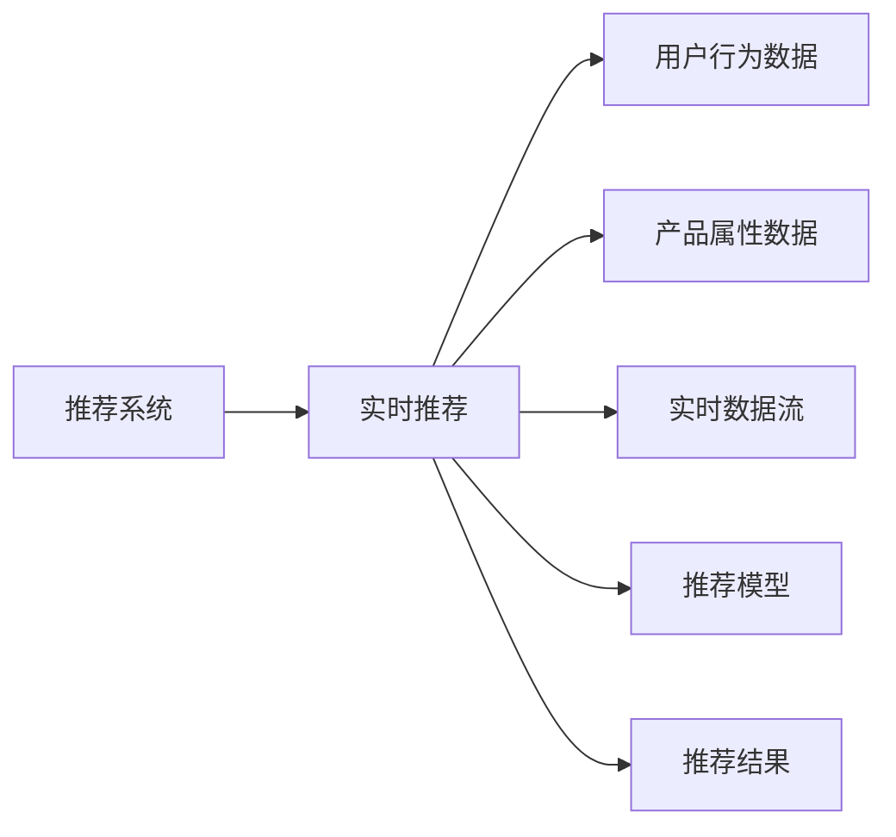

                 

## 1. 背景介绍

### 1.1 问题由来
近年来，随着移动互联网和电商平台的迅猛发展，个性化推荐技术成为了电商领域的一个重要竞争力。通过精准匹配用户的个性化需求，电商平台可以有效提升用户满意度和转化率，增加销售收入。推荐系统的构建与优化，也成为各大电商平台的研发重点。

### 1.2 问题核心关键点
实时推荐系统是电商推荐系统中的一种重要技术，通过动态实时地分析用户行为和市场变化，生成个性化的产品推荐，提升用户体验和转化率。实时推荐系统具有以下特点：

- 动态性：能够实时响应用户行为和市场变化，快速更新推荐结果。
- 个性化：基于用户的长期行为和短期兴趣，生成高度个性化的产品推荐。
- 实时性：要求推荐模型具有快速推理能力，能够在毫秒级时间内返回推荐结果。

#### 1.2.1 实时推荐系统的应用场景
实时推荐系统在电商领域的应用场景包括但不限于以下几种：

1. **首页推荐**：根据用户的历史浏览记录和实时行为，动态生成首页展示的产品推荐。
2. **搜索推荐**：在用户搜索时，根据搜索历史和实时搜索词，动态生成搜索结果的个性化推荐。
3. **购物车推荐**：根据用户的购物车内容，推荐相关产品，促进购买决策。
4. **广告推荐**：根据用户的浏览行为和兴趣，生成广告位的个性化推荐。

## 2. 核心概念与联系

### 2.1 核心概念概述

为更好地理解实时推荐系统在电商领域的应用，本节将介绍几个密切相关的核心概念：

- **推荐系统**：通过收集和分析用户行为数据，向用户推荐相关产品，以提高用户体验和平台转化率。推荐系统主要分为基于协同过滤、基于内容、混合推荐等不同类型。
- **实时推荐**：指在用户进行任何行为（如浏览、搜索、点击等）时，实时动态生成个性化的推荐结果。实时推荐能够及时响应用户需求，提供更具相关性的产品推荐。
- **电商推荐系统**：特指在电商平台上，根据用户行为数据和产品属性数据，生成个性化推荐结果的系统。电商推荐系统具备较强的用户行为分析和数据处理能力。
- **推荐算法**：包括协同过滤、基于内容的推荐、基于矩阵分解的推荐、基于深度学习的推荐等不同算法。不同算法有不同的优缺点和适用场景。
- **特征工程**：在构建推荐系统时，对用户行为和产品属性数据进行特征提取、特征选择和特征构建的过程。良好的特征工程是提升推荐系统效果的关键。
- **推荐模型**：如基于矩阵分解的CFM推荐模型、基于深度学习的序列推荐模型、基于注意力机制的推荐模型等。不同的推荐模型具有不同的算法原理和应用效果。

### 2.2 核心概念原理和架构的 Mermaid 流程图



## 3. 核心算法原理 & 具体操作步骤

### 3.1 算法原理概述

实时推荐系统的核心算法原理主要是基于用户行为数据和产品属性数据，构建推荐模型，实时计算推荐结果。其实时性要求推荐模型具备快速推理能力，能够在短时间内完成推荐结果的计算。

#### 3.1.1 算法流程

实时推荐系统的算法流程主要包括以下几个关键步骤：

1. **数据采集**：实时收集用户行为数据和产品属性数据。
2. **特征提取**：对用户行为数据和产品属性数据进行特征提取和特征选择。
3. **模型训练**：使用历史数据训练推荐模型，确保模型具备良好的泛化能力。
4. **实时推理**：在用户行为数据实时流入时，使用训练好的模型进行实时推理，生成推荐结果。
5. **结果展示**：将推荐结果展示给用户，供用户参考选择。

#### 3.1.2 推荐模型类型

实时推荐系统常用的推荐模型类型包括：

- **协同过滤**：通过用户之间的相似度计算，生成个性化推荐。
- **基于内容的推荐**：根据产品属性和用户兴趣，生成个性化推荐。
- **深度学习推荐**：使用深度神经网络模型，捕捉用户行为和产品属性之间的复杂关系。

### 3.2 算法步骤详解

#### 3.2.1 数据采集

实时推荐系统的数据采集主要包括以下几个步骤：

1. **用户行为数据采集**：收集用户在电商平台上的浏览、点击、搜索、购买等行为数据。
2. **产品属性数据采集**：收集产品的属性数据，如商品类别、品牌、价格等。
3. **外部数据采集**：收集用户反馈数据、外部市场数据等，用于增强推荐系统的效果。

#### 3.2.2 特征提取

实时推荐系统的特征提取主要包括以下几个步骤：

1. **用户行为特征提取**：将用户的浏览记录、点击记录、搜索记录等行为数据，转化为数值特征，如浏览时长、点击次数等。
2. **产品属性特征提取**：将产品的类别、品牌、价格等属性数据，转化为数值特征，如类别ID、价格区间等。
3. **时间特征提取**：将时间数据转化为时间特征，如时间戳、星期几等，用于捕捉用户行为的时序性。

#### 3.2.3 模型训练

实时推荐系统的模型训练主要包括以下几个步骤：

1. **数据预处理**：对采集到的数据进行清洗、去重、归一化等预处理操作。
2. **特征工程**：对预处理后的数据进行特征提取、特征选择、特征构建等操作。
3. **模型选择**：根据推荐场景和数据特点，选择合适的推荐模型，如协同过滤、基于内容的推荐、深度学习推荐等。
4. **模型训练**：使用历史数据训练推荐模型，确保模型具备良好的泛化能力。

#### 3.2.4 实时推理

实时推荐系统的实时推理主要包括以下几个步骤：

1. **数据流处理**：实时收集用户行为数据和产品属性数据，使用流处理技术进行数据流的聚合和计算。
2. **特征注入**：将用户行为数据和产品属性数据注入到实时数据流中，进行特征增强。
3. **模型推理**：使用训练好的推荐模型进行实时推理，生成推荐结果。
4. **结果展示**：将推荐结果展示给用户，供用户参考选择。

### 3.3 算法优缺点

实时推荐系统的优点包括：

- **动态性**：能够实时响应用户行为和市场变化，快速更新推荐结果。
- **个性化**：基于用户的长期行为和短期兴趣，生成高度个性化的产品推荐。
- **实时性**：要求推荐模型具有快速推理能力，能够在毫秒级时间内返回推荐结果。

实时推荐系统的缺点包括：

- **计算复杂度**：实时推理需要实时处理大量的用户行为数据和产品属性数据，计算复杂度较高。
- **模型泛化能力**：模型需要在有限的训练数据上，具备良好的泛化能力，避免过拟合。
- **实时性要求**：推荐模型需要具备快速推理能力，否则无法满足实时性的要求。

### 3.4 算法应用领域

实时推荐系统在电商领域的应用场景包括但不限于以下几种：

1. **首页推荐**：根据用户的历史浏览记录和实时行为，动态生成首页展示的产品推荐。
2. **搜索推荐**：在用户搜索时，根据搜索历史和实时搜索词，动态生成搜索结果的个性化推荐。
3. **购物车推荐**：根据用户的购物车内容，推荐相关产品，促进购买决策。
4. **广告推荐**：根据用户的浏览行为和兴趣，生成广告位的个性化推荐。

## 4. 数学模型和公式 & 详细讲解

### 4.1 数学模型构建

实时推荐系统的数学模型主要包括以下几个部分：

1. **用户行为数据表示**：将用户行为数据表示为向量，如用户的浏览记录、点击记录等，可以表示为如下矩阵形式：

   $$
   U \in \mathbb{R}^{N \times F}
   $$

   其中 $N$ 为用户数，$F$ 为特征数。

2. **产品属性数据表示**：将产品属性数据表示为向量，如产品的类别、品牌、价格等，可以表示为如下矩阵形式：

   $$
   P \in \mathbb{R}^{M \times F'}
   $$

   其中 $M$ 为产品数，$F'$ 为特征数。

3. **用户行为-产品关联矩阵**：将用户行为数据和产品属性数据进行拼接，构建用户行为-产品关联矩阵：

   $$
   I \in \mathbb{R}^{N \times M}
   $$

   其中 $I$ 表示用户行为-产品关联矩阵。

4. **推荐矩阵**：使用协同过滤等推荐模型，生成推荐矩阵 $Y$，表示每个用户对每个产品的评分：

   $$
   Y \in \mathbb{R}^{N \times M}
   $$

5. **推荐结果**：使用推荐矩阵 $Y$，生成推荐结果，展示给用户：

   $$
   R \in \mathbb{R}^{N \times M}
   $$

### 4.2 公式推导过程

#### 4.2.1 协同过滤模型

协同过滤模型是基于用户之间的相似度计算，生成个性化推荐。其公式推导过程如下：

1. **用户相似度计算**：计算用户之间的相似度 $S$：

   $$
   S_{i,j} = \frac{\sum_{k=1}^K U_{i,k} P_{k,j}}{\sqrt{\sum_{k=1}^K U_{i,k}^2} \sqrt{\sum_{k=1}^K P_{k,j}^2}}
   $$

   其中 $K$ 为共同特征数。

2. **推荐结果生成**：根据用户相似度 $S$，生成推荐结果 $R$：

   $$
   R_{i,j} = \frac{\sum_{k=1}^K Y_{i,k} P_{k,j}}{\sqrt{\sum_{k=1}^K Y_{i,k}^2} \sqrt{\sum_{k=1}^K P_{k,j}^2}}
   $$

   其中 $Y_{i,k}$ 为用户 $i$ 对产品 $k$ 的评分。

#### 4.2.2 基于内容的推荐模型

基于内容的推荐模型是根据产品属性和用户兴趣，生成个性化推荐。其公式推导过程如下：

1. **产品特征向量的内积**：计算产品 $j$ 和用户 $i$ 之间的相似度 $S_{i,j}$：

   $$
   S_{i,j} = \frac{\sum_{k=1}^{F'} P_{j,k} Q_{k}}{\sqrt{\sum_{k=1}^{F'} P_{j,k}^2} \sqrt{\sum_{k=1}^{F'} Q_{k}^2}}
   $$

   其中 $Q$ 为用户兴趣向量。

2. **推荐结果生成**：根据产品相似度 $S$，生成推荐结果 $R$：

   $$
   R_{i,j} = \frac{\sum_{k=1}^{F'} P_{j,k} Y_{i,k}}{\sqrt{\sum_{k=1}^{F'} P_{j,k}^2} \sqrt{\sum_{k=1}^{F'} Y_{i,k}^2}}
   $$

### 4.3 案例分析与讲解

#### 4.3.1 案例1：协同过滤推荐

假设有一家电商网站，收集了用户的历史浏览记录和点击记录，构建了协同过滤推荐模型。具体步骤如下：

1. **数据采集**：采集用户的历史浏览记录和点击记录。
2. **特征提取**：将用户的浏览记录和点击记录转化为数值特征，如浏览时长、点击次数等。
3. **模型训练**：使用协同过滤模型进行模型训练，生成推荐矩阵 $Y$。
4. **实时推理**：在用户浏览时，实时计算用户与其他用户的相似度 $S$，生成推荐结果 $R$。
5. **结果展示**：将推荐结果展示给用户，供用户参考选择。

#### 4.3.2 案例2：基于内容的推荐

假设有一家电商网站，收集了产品的类别、品牌、价格等属性数据，构建了基于内容的推荐模型。具体步骤如下：

1. **数据采集**：采集产品的类别、品牌、价格等属性数据。
2. **特征提取**：将产品的类别、品牌、价格等属性数据转化为数值特征，如类别ID、价格区间等。
3. **模型训练**：使用基于内容的推荐模型进行模型训练，生成推荐矩阵 $Y$。
4. **实时推理**：在用户搜索时，实时计算用户与产品的相似度 $S$，生成推荐结果 $R$。
5. **结果展示**：将推荐结果展示给用户，供用户参考选择。

## 5. 项目实践：代码实例和详细解释说明

### 5.1 开发环境搭建

在进行推荐系统开发前，我们需要准备好开发环境。以下是使用Python进行推荐系统开发的开发环境配置流程：

1. 安装Anaconda：从官网下载并安装Anaconda，用于创建独立的Python环境。

2. 创建并激活虚拟环境：
```bash
conda create -n recommendation-env python=3.8 
conda activate recommendation-env
```

3. 安装PyTorch：根据CUDA版本，从官网获取对应的安装命令。例如：
```bash
conda install pytorch torchvision torchaudio cudatoolkit=11.1 -c pytorch -c conda-forge
```

4. 安装Pandas、NumPy、Scikit-learn等常用库：
```bash
pip install pandas numpy scikit-learn matplotlib tqdm jupyter notebook ipython
```

5. 安装推荐系统相关库：
```bash
pip install Surprise scikit-learn
```

完成上述步骤后，即可在`recommendation-env`环境中开始推荐系统开发。

### 5.2 源代码详细实现

下面我们以协同过滤推荐为例，给出使用Surprise库对电商推荐系统进行开发的PyTorch代码实现。

首先，定义推荐系统类：

```python
from surprise import Reader, Dataset, KNNWithMeans, accuracy, SVD
from surprise.model_selection import train_test_split

class RecommendationSystem:
    def __init__(self, train_data, test_data, reader):
        self.train_data = train_data
        self.test_data = test_data
        self.reader = reader
    
    def train(self, user_based=False, item_based=False, embed_dim=64, epochs=10, reg=0.01):
        reader = self.reader
        trainset = Dataset.load_from_df(self.train_data, reader)
        testset = Dataset.load_from_df(self.test_data, reader)
        
        if user_based:
            algo = KNNWithMeans(k=20, user_based=True, similarity='pearson')
        elif item_based:
            algo = KNNWithMeans(k=20, user_based=False, similarity='pearson')
        else:
            algo = SVD(K=20, embedding_dim=embed_dim, lreg=reg, user_based=True)
        
        trainset, testset = train_test_split(trainset, test_size=0.25)
        algo.fit(trainset)
        train_preds, test_preds = algo.test(testset)
        
        return algo, train_preds, test_preds
    
    def predict(self, algo, user_based=False, item_based=False, embed_dim=64, epochs=10, reg=0.01):
        user_based, item_based, embed_dim, epochs, reg = user_based, item_based, embed_dim, epochs, reg
        
        if user_based:
            algo = KNNWithMeans(k=20, user_based=True, similarity='pearson')
        elif item_based:
            algo = KNNWithMeans(k=20, user_based=False, similarity='pearson')
        else:
            algo = SVD(K=20, embedding_dim=embed_dim, lreg=reg, user_based=True)
        
        return algo
    
    def evaluate(self, algo, test_preds):
        train_preds = algo.test(testset)
        return accuracy.f1_score(test_preds, [1 if preds[i][1] > 0.5 else 0 for preds in test_preds], average='micro')
```

然后，定义数据处理函数：

```python
import pandas as pd

def load_data(file_path):
    data = pd.read_csv(file_path)
    return data

def preprocess_data(data):
    train_data = data[data['rating'] != 0].reset_index(drop=True)
    test_data = data[data['rating'] == 0].reset_index(drop=True)
    
    train_data = train_data[['user_id', 'item_id', 'rating']]
    test_data = test_data[['user_id', 'item_id']]
    
    reader = Reader(line_format='user item rating', sep=',', rating_scale=(1, 5))
    train_data = reader.load_dataframe(train_data)
    test_data = reader.load_dataframe(test_data)
    
    return train_data, test_data
```

最后，启动推荐系统流程：

```python
train_data = load_data('train_data.csv')
test_data = load_data('test_data.csv')
train_data, test_data = preprocess_data(train_data)

recommender, train_preds, test_preds = RecommendationSystem(train_data, test_data, reader).train()
accuracy = RecommendationSystem(recommender, test_data).evaluate()
print(f'Accuracy: {accuracy:.4f}')
```

以上就是使用Surprise库对电商推荐系统进行开发的完整代码实现。可以看到，通过简单的函数调用，可以完成推荐系统的训练和评估。

### 5.3 代码解读与分析

让我们再详细解读一下关键代码的实现细节：

**RecommendationSystem类**：
- `__init__`方法：初始化训练集和测试集，定义推荐算法和数据读取器。
- `train`方法：训练推荐模型，返回训练好的模型、训练预测结果和测试预测结果。
- `predict`方法：使用训练好的模型对用户行为进行预测，返回预测结果。
- `evaluate`方法：评估推荐模型的性能，返回F1分数。

**load_data函数**：
- 加载训练集和测试集数据。

**preprocess_data函数**：
- 对数据进行处理，包括过滤掉评分不高的数据、重置索引、转换为Surprise库支持的格式等。

**train_data.csv和test_data.csv文件**：
- 加载训练集和测试集数据，格式为CSV文件，每行包含用户ID、物品ID和评分。

可以看到，使用Surprise库进行推荐系统开发，可以大大简化代码实现，提高开发效率。开发者可以将更多精力放在模型改进和业务逻辑上，而不必过多关注底层实现细节。

当然，工业级的系统实现还需考虑更多因素，如推荐模型的参数调优、推荐结果的实时展示、推荐系统的可扩展性等。但核心的推荐范式基本与此类似。

## 6. 实际应用场景

### 6.1 智能推荐系统在电商中的应用

智能推荐系统在电商领域的应用场景非常广泛，以下列举几个典型的应用场景：

#### 6.1.1 首页推荐

电商网站的首页推荐系统，可以根据用户的历史浏览记录和实时行为，动态生成首页展示的产品推荐。具体来说，可以使用协同过滤或基于内容的推荐算法，生成个性化推荐结果。推荐系统可以每天运行一次或实时更新，以保证推荐结果的时效性和准确性。

#### 6.1.2 搜索推荐

电商网站的搜索推荐系统，可以根据用户的搜索历史和实时搜索词，动态生成搜索结果的个性化推荐。具体来说，可以使用基于搜索词的关键词匹配算法，或使用协同过滤或基于内容的推荐算法，生成搜索结果的推荐结果。推荐系统可以实时更新，以满足用户的搜索需求。

#### 6.1.3 购物车推荐

电商网站的购物车推荐系统，可以根据用户的购物车内容，推荐相关产品，促进购买决策。具体来说，可以使用协同过滤或基于内容的推荐算法，生成个性化推荐结果。推荐系统可以实时更新，以保证推荐结果的实时性和个性化。

#### 6.1.4 广告推荐

电商网站的广告推荐系统，可以根据用户的浏览行为和兴趣，生成广告位的个性化推荐。具体来说，可以使用协同过滤或基于内容的推荐算法，生成广告位的推荐结果。推荐系统可以实时更新，以满足广告位的实时性要求。

### 6.2 智能推荐系统在金融领域的应用

智能推荐系统在金融领域的应用场景也非常广泛，以下列举几个典型的应用场景：

#### 6.2.1 信贷推荐

金融机构的信贷推荐系统，可以根据用户的信用记录、财务状况等数据，生成信贷产品的推荐结果。具体来说，可以使用协同过滤或基于内容的推荐算法，生成信贷产品的推荐结果。推荐系统可以实时更新，以满足用户实时获取信贷产品的需求。

#### 6.2.2 投资推荐

金融机构的投资推荐系统，可以根据用户的投资偏好、风险承受能力等数据，生成投资产品的推荐结果。具体来说，可以使用协同过滤或基于内容的推荐算法，生成投资产品的推荐结果。推荐系统可以实时更新，以满足用户实时获取投资产品的需求。

#### 6.2.3 风险控制

金融机构的风险控制系统，可以根据用户的消费行为、投资行为等数据，生成风险评估结果。具体来说，可以使用协同过滤或基于内容的推荐算法，生成风险评估结果。推荐系统可以实时更新，以满足用户实时获取风险评估结果的需求。

#### 6.2.4 客户服务

金融机构的客户服务系统，可以根据用户的咨询记录、投诉记录等数据，生成客户服务的推荐结果。具体来说，可以使用协同过滤或基于内容的推荐算法，生成客户服务的推荐结果。推荐系统可以实时更新，以满足用户实时获取客户服务的需求。

## 7. 工具和资源推荐

### 7.1 学习资源推荐

为了帮助开发者系统掌握推荐系统的理论基础和实践技巧，这里推荐一些优质的学习资源：

1. 《推荐系统实践》一书：由周志华等知名学者共同编写，介绍了推荐系统的基本原理、算法实现和应用场景。
2. 《深入浅出推荐系统》一书：由徐小平等专家编写，介绍了推荐系统的理论基础、算法实现和案例分析。
3. CS229《机器学习》课程：斯坦福大学开设的机器学习课程，有Lecture视频和配套作业，带你入门推荐系统。
4. Coursera《推荐系统》课程：由世界知名教授讲授，介绍了推荐系统的基本原理、算法实现和应用场景。
5. Udacity《推荐系统》课程：由世界知名教授讲授，介绍了推荐系统的基本原理、算法实现和应用场景。

通过对这些资源的学习实践，相信你一定能够快速掌握推荐系统的精髓，并用于解决实际的推荐问题。

### 7.2 开发工具推荐

高效的开发离不开优秀的工具支持。以下是几款用于推荐系统开发的常用工具：

1. PyTorch：基于Python的开源深度学习框架，灵活动态的计算图，适合快速迭代研究。大部分推荐系统都有PyTorch版本的实现。
2. TensorFlow：由Google主导开发的开源深度学习框架，生产部署方便，适合大规模工程应用。同样有丰富的推荐系统资源。
3. Surprise：Java编写，支持多种推荐算法，易于使用，适合快速原型开发。
4. Spark MLlib：Apache Spark的机器学习库，支持分布式计算，适合大规模数据处理。
5. MLflow：用于追踪、调度和部署机器学习模型的开源工具，方便模型管理与集成。
6. H2O：基于R和Python的机器学习框架，支持多种推荐算法，易于使用。

合理利用这些工具，可以显著提升推荐系统的开发效率，加快创新迭代的步伐。

### 7.3 相关论文推荐

推荐系统的研究源于学界的持续研究。以下是几篇奠基性的相关论文，推荐阅读：

1. A Best-of-Both-Worlds Algorithm for Collaborative Filtering：提出协同过滤算法中的混合推荐模型，结合基于矩阵分解和协同过滤的优点，提升推荐效果。
2. Co-Clustering for Scalable Collaborative Filtering：提出基于二部图划分的协同过滤算法，适合大规模推荐系统。
3. Neighborhood-Based Collaborative Filtering：提出基于用户相似度的协同过滤算法，适合小型推荐系统。
4. A Model-Based Approach to Recommendation in Networks：提出基于图神经网络的推荐模型，适合复杂推荐场景。
5. Factorization Machines：提出基于矩阵分解的推荐算法，适合大规模推荐系统。

这些论文代表了大推荐系统的发展脉络。通过学习这些前沿成果，可以帮助研究者把握学科前进方向，激发更多的创新灵感。

## 8. 总结：未来发展趋势与挑战

### 8.1 总结

本文对实时推荐技术在电商领域的应用进行了全面系统的介绍。首先阐述了实时推荐系统在电商领域的应用场景，明确了实时推荐系统在提升用户满意度和转化率方面的独特价值。其次，从原理到实践，详细讲解了实时推荐系统的算法流程和核心算法，给出了推荐系统开发的完整代码实例。同时，本文还广泛探讨了推荐系统在电商、金融、智能客服等多个行业领域的应用前景，展示了推荐系统范式的广泛应用。

通过本文的系统梳理，可以看到，实时推荐系统已经在电商领域实现了大规模落地，取得了显著的业务价值。推荐系统通过精准匹配用户需求，提升了用户体验和平台转化率，成为了电商竞争力的重要支撑。未来，伴随推荐算法的不断演进和推荐模型的持续优化，推荐系统将在更多领域得到应用，为各行各业带来新的变革。

### 8.2 未来发展趋势

实时推荐系统的未来发展趋势主要包括以下几个方面：

1. **数据驱动**：实时推荐系统将继续依赖于数据驱动，通过收集和分析用户行为数据和产品属性数据，生成个性化推荐。未来的推荐系统将更加注重数据的实时性和多样性。
2. **算法演进**：推荐算法将不断演进，从简单的协同过滤、基于内容的推荐，发展到更加复杂的深度学习推荐、图神经网络推荐等，提升推荐系统的精度和鲁棒性。
3. **模型优化**：推荐模型将持续优化，从传统的矩阵分解、协同过滤，发展到更加高效的深度学习模型、自适应学习模型等，提升推荐系统的效率和效果。
4. **实时性提升**：推荐系统将不断提升实时性，从毫秒级推理，发展到纳秒级推理，满足更多实时应用场景的需求。
5. **跨领域融合**：实时推荐系统将不断融合其他技术，如自然语言处理、知识图谱、强化学习等，提升推荐系统的多模态融合能力和智能化水平。
6. **隐私保护**：实时推荐系统将更加注重隐私保护，采用差分隐私、联邦学习等技术，保护用户数据的隐私和安全。

这些趋势凸显了实时推荐系统的广阔前景。这些方向的探索发展，必将进一步提升推荐系统的性能和应用范围，为各行各业带来新的机遇。

### 8.3 面临的挑战

尽管实时推荐系统已经取得了显著的进展，但在迈向更加智能化、普适化应用的过程中，它仍面临以下挑战：

1. **数据获取难度**：实时推荐系统依赖于大量高质量的数据，获取高质量的用户行为和产品属性数据，成本较高。如何高效、低成本地获取推荐系统所需的数据，是未来的一个重要挑战。
2. **数据质量问题**：推荐系统需要处理大规模、高维度的数据，数据质量直接影响推荐效果。如何保证数据的质量和一致性，是未来的一个重要挑战。
3. **模型复杂度**：实时推荐系统需要构建复杂的推荐模型，模型复杂度较高。如何降低模型复杂度，提升模型的实时性和可解释性，是未来的一个重要挑战。
4. **隐私保护**：实时推荐系统需要处理用户隐私数据，如何保护用户隐私，避免数据泄露，是未来的一个重要挑战。
5. **系统稳定性**：实时推荐系统需要具备高可靠性，如何保证系统的稳定性和鲁棒性，是未来的一个重要挑战。
6. **算法公平性**：实时推荐系统需要具备公平性，如何避免算法偏见，保证推荐的公平性，是未来的一个重要挑战。

这些挑战凸显了实时推荐系统的不足和局限性。未来的研究需要在这些方向进行更多的探索和突破，才能不断提升实时推荐系统的性能和可靠性。

### 8.4 研究展望

未来的实时推荐系统需要从多个方向进行进一步的研究，包括以下几个方面：

1. **推荐算法的多样化**：引入更多推荐算法，如基于深度学习的推荐、基于图神经网络的推荐等，提升推荐系统的精度和效率。
2. **推荐模型的优化**：研究推荐模型的优化方法，如参数共享、模型压缩等，提升推荐模型的实时性和可解释性。
3. **数据融合与多模态融合**：研究如何将推荐系统与其他技术进行融合，如自然语言处理、知识图谱、强化学习等，提升推荐系统的智能化水平。
4. **隐私保护与数据安全**：研究如何保护用户隐私，采用差分隐私、联邦学习等技术，保护用户数据的隐私和安全。
5. **系统稳定性与鲁棒性**：研究如何提升实时推荐系统的稳定性和鲁棒性，确保系统的可靠性和可用性。
6. **算法公平性与公正性**：研究如何提升推荐系统的公平性，避免算法偏见，保证推荐的公正性。

这些研究方向的探索，必将进一步提升实时推荐系统的性能和应用范围，为各行各业带来新的机遇。只有勇于创新、敢于突破，才能不断拓展推荐系统的边界，让推荐系统成为更多领域的重要支撑。

## 9. 附录：常见问题与解答

**Q1：推荐系统是否适用于所有电商应用场景？**

A: 推荐系统在大多数电商应用场景上都能取得不错的效果，特别是对于数据量较大的场景。但对于一些特定场景，如特殊商品、高价值商品等，推荐系统的效果可能不理想。此时需要在推荐系统中引入特殊逻辑，如库存管理、价格策略等，进行场景适配。

**Q2：如何提升推荐系统的实时性？**

A: 提升推荐系统的实时性主要包括以下几个方面：

1. **数据流处理**：使用流处理技术，实时收集和处理用户行为数据和产品属性数据。
2. **模型优化**：优化推荐模型的计算图，采用稀疏矩阵计算、参数共享等技术，减少计算量和内存占用。
3. **缓存机制**：使用缓存机制，缓存常见用户行为和产品属性数据，提升计算速度。
4. **负载均衡**：使用负载均衡技术，保证推荐系统的高并发处理能力。

这些方法可以结合使用，提升推荐系统的实时性，满足实时推荐的需求。

**Q3：推荐系统的可解释性如何提升？**

A: 推荐系统的可解释性主要包括以下几个方面：

1. **特征解释**：对推荐模型的特征进行解释，说明模型如何理解用户行为和产品属性。
2. **模型可视化**：使用可视化工具，展示推荐模型的内部结构和学习过程。
3. **模型审计**：定期审计推荐模型，发现和修复模型的漏洞和错误。

这些方法可以结合使用，提升推荐系统的可解释性，让用户对推荐结果有更清晰的理解和信任。

**Q4：推荐系统如何处理冷启动问题？**

A: 推荐系统处理冷启动问题主要包括以下几个方面：

1. **用户画像**：根据用户的历史行为数据，构建用户画像，生成初始推荐结果。
2. **产品推荐**：根据产品的属性数据，生成产品推荐结果。
3. **协同过滤**：使用协同过滤算法，根据用户和产品的相似度，生成推荐结果。
4. **混合推荐**：结合多种推荐算法，生成推荐结果。

这些方法可以结合使用，提升推荐系统对新用户和新产品的推荐效果，解决冷启动问题。

**Q5：推荐系统的评估指标有哪些？**

A: 推荐系统的评估指标主要包括以下几个方面：

1. **精度指标**：包括准确率、召回率、F1分数等，评估推荐结果的正确性。
2. **覆盖率**：评估推荐结果的丰富性，即推荐结果是否覆盖了所有相关产品。
3. **新颖性**：评估推荐结果的新颖性，即推荐结果是否为用户带来了新体验。
4. **用户满意度**：通过用户反馈和用户行为，评估推荐系统的满意度。

这些指标可以结合使用，全面评估推荐系统的性能。

**Q6：推荐系统的优化方向有哪些？**

A: 推荐系统的优化方向主要包括以下几个方面：

1. **数据质量提升**：提升数据质量，确保数据的准确性和完整性。
2. **模型优化**：优化推荐模型的计算图，减少计算量和内存占用。
3. **算法多样化**：引入更多推荐算法，如基于深度学习的推荐、基于图神经网络的推荐等，提升推荐系统的精度和效率。
4. **实时性提升**：提升推荐系统的实时性，满足实时推荐的需求。
5. **可解释性增强**：提升推荐系统的可解释性，让用户对推荐结果有更清晰的理解和信任。

这些优化方向可以结合使用，全面提升推荐系统的性能和应用范围。

---

作者：禅与计算机程序设计艺术 / Zen and the Art of Computer Programming

