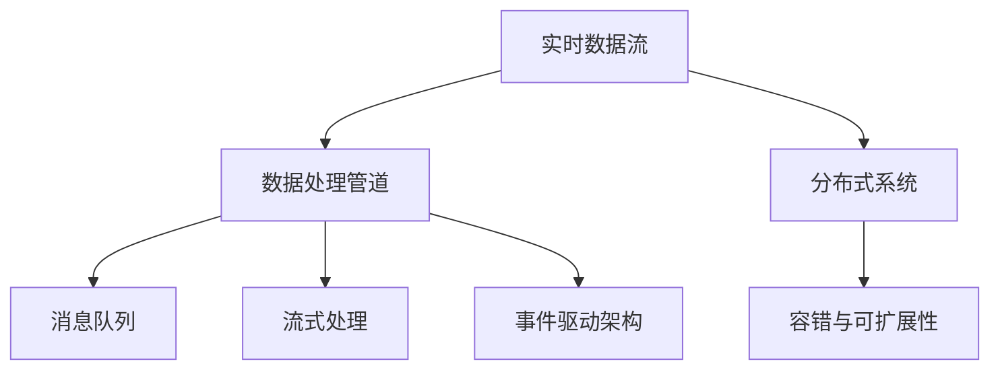

                 

# 实时数据处理 原理与代码实例讲解

> 关键词：实时数据处理,流式处理,分布式处理,Apache Kafka,Apache Flink,Apache Storm,Apache Spark,大数据技术,消息队列,事件驱动架构

## 1. 背景介绍

### 1.1 问题由来
在当今数字化时代，数据源变得日益丰富多样，数据量急剧膨胀。从日志文件、传感器数据、交易记录到社交媒体信息，各种类型的数据源源不断产生，迫切需要高效、可靠、实时的数据处理系统来对这些海量数据进行处理和分析。

传统的数据处理方式，如批处理，难以满足实时性和高吞吐量的需求。而实时数据处理系统，通过流式处理技术，可以对数据进行实时采集、存储、清洗、转换和分析，从而帮助企业快速响应市场变化，做出更准确的决策。

### 1.2 问题核心关键点
实时数据处理的本质在于将数据流按时间顺序实时地进行处理和分析。其核心关键点包括：
- 数据源：数据流来源于何处，如日志、传感器、消息队列等。
- 数据处理：对数据进行清洗、转换、计算等处理操作。
- 数据存储：将处理后的数据进行存储，供后续分析或再处理使用。
- 数据分发：将数据分发至不同的应用或系统。
- 实时性要求：对数据处理的延迟和准确性有严格要求。

### 1.3 问题研究意义
实时数据处理技术的广泛应用，对于提升企业的数据处理效率、增强决策支持能力、提升用户体验等具有重要意义：

1. 提升决策效率：通过实时处理数据，企业可以快速获得市场动态和客户行为，迅速做出决策。
2. 优化运营效率：实时数据处理可以实时监控系统状态和业务流程，快速发现问题并解决。
3. 改善用户体验：实时数据处理可以提供更准确、及时的个性化推荐和客户服务。
4. 促进数据洞察：通过实时分析数据，可以发现业务规律和趋势，促进业务创新和发展。
5. 保障安全合规：实时监控数据可以及时发现和应对安全威胁和合规风险。

## 2. 核心概念与联系

### 2.1 核心概念概述

为更好地理解实时数据处理技术，本节将介绍几个密切相关的核心概念：

- 实时数据流(Real-time Data Stream)：指按时间顺序连续生成的数据流。
- 数据处理管道(Data Processing Pipeline)：指将数据流中的数据进行连续处理的流程。
- 分布式系统(Distributed System)：指由多个计算节点组成的系统，可以协同处理大规模数据。
- 消息队列(Message Queue)：指用于异步通信的分布式系统，可以高效地存储和分发数据流。
- 流式处理(Stream Processing)：指对实时数据流进行持续不断地处理，一般采用流式算法。
- 事件驱动架构(Event-Driven Architecture)：指通过事件触发数据流处理，以异步方式处理数据。
- 容错与可扩展性(Fault Tolerance and Scalability)：指系统能够持续运行、高效扩展并处理数据丢失等问题。

这些核心概念之间的逻辑关系可以通过以下Mermaid流程图来展示：



这个流程图展示了几类关键概念及其之间的关联：

1. 实时数据流是数据处理管道的数据来源。
2. 数据处理管道对数据进行处理，包括清洗、转换、计算等操作。
3. 分布式系统可以提供高可靠性的数据处理能力，支持大规模数据处理。
4. 消息队列可以高效地存储和分发数据流，支持异步通信。
5. 流式处理可以持续不断地对数据流进行处理，支持实时性需求。
6. 事件驱动架构通过事件触发数据流处理，支持异步处理。
7. 容错与可扩展性是确保系统稳定性和高可用性的关键因素。

## 3. 核心算法原理 & 具体操作步骤

### 3.1 算法原理概述

实时数据处理的核心算法原理在于，通过分布式系统对实时数据流进行流式处理，实现数据的持续不断地清洗、转换、计算和分析。其关键步骤如下：

1. 数据采集：实时从数据源采集数据流，并进行预处理。
2. 数据传输：将数据流通过消息队列进行分发和存储。
3. 数据处理：在分布式系统上对数据流进行流式处理，包括过滤、聚合、计算等操作。
4. 数据存储：将处理后的数据存储在分布式数据库中，供后续分析或再处理使用。
5. 数据分发：将处理后的数据通过消息队列或其他方式分发至不同的应用或系统。

### 3.2 算法步骤详解

以下以Apache Flink为例，详细讲解基于Flink的实时数据处理算法的步骤：

**Step 1: 数据采集**
- 在数据源处安装数据采集组件，如Kafka Connect、Flume等。
- 配置采集组件，指定数据源、采集方式、数据格式等参数。
- 启动数据采集服务，将数据流传输至消息队列。

**Step 2: 数据传输**
- 搭建消息队列系统，如Apache Kafka，配置集群、分区、副本等参数。
- 部署消息消费器，如Apache Flink，指定消息队列、分区、消费方式等参数。
- 启动消息消费器，从消息队列中读取数据流，进行初步解析和处理。

**Step 3: 数据处理**
- 在Apache Flink中，定义DataStream API，使用DataStream API对数据流进行流式处理。
- 定义数据流管道，包括数据过滤、转换、计算等操作，如Map、Filter、Reduce、Join等。
- 配置并行度、检查点机制、任务调度等参数，优化数据流处理性能。

**Step 4: 数据存储**
- 配置Apache Flink的存储后端，如Hadoop、Cassandra等，指定数据存储路径、格式等参数。
- 使用Apache Flink的State Backend API，将数据存储至后端，保留处理状态供后续查询或再处理使用。

**Step 5: 数据分发**
- 通过Apache Flink的消息队列输出器，将处理后的数据流写入另一个消息队列或直接推送至其他应用。
- 部署数据分发系统，如Apache Kafka、RabbitMQ等，配置集群、分区、副本等参数。
- 启动数据分发服务，将数据流分发给不同的消费端，供后续应用处理和使用。

### 3.3 算法优缺点

实时数据处理系统的优点在于其高效、实时、可扩展性强。但同时也存在一些缺点，如：
1. 数据实时性要求高，系统设计复杂，需要精细化的调优。
2. 数据处理过程复杂，容易发生数据丢失、延迟等问题。
3. 对硬件资源要求高，需要高性能计算节点和高速网络。
4. 系统维护和调试困难，需要专业的运维团队。

尽管如此，实时数据处理技术在诸多场景下仍具有不可替代的价值，其高效、实时、可扩展的特点，使其成为当今数据处理的主流方式之一。

### 3.4 算法应用领域

实时数据处理技术在各个领域都有广泛的应用，具体包括：

- 金融领域：实时监控交易数据，风险管理，高频交易。
- 电商领域：实时监测销售数据，库存管理，个性化推荐。
- 物联网领域：实时处理传感器数据，设备监控，数据挖掘。
- 社交媒体领域：实时监测用户行为数据，舆情分析，广告投放。
- 健康医疗领域：实时监测患者数据，病情预测，医疗服务。
- 智能制造领域：实时监控生产数据，质量控制，设备维护。

除了以上领域，实时数据处理技术还在很多新兴领域得到应用，如智慧城市、智能家居、自动驾驶等，为各行各业提供高效、实时的数据处理能力。

## 4. 数学模型和公式 & 详细讲解 & 举例说明

### 4.1 数学模型构建

实时数据处理系统的数学模型通常涉及数据流的连续流处理和状态管理的复杂算法。以下以Apache Flink为例，介绍其数学模型构建过程。

假设数据流为 $D=\{d_1, d_2, ..., d_n\}$，其中每个元素 $d_i$ 表示为一个记录，包含多个字段。

定义数据流的处理方法为 $\mathcal{T}(D)$，其中 $\mathcal{T}$ 表示对数据流进行处理的操作集，如过滤、转换、计算等。

定义数据流的状态管理机制为 $\mathcal{S}(D)$，其中 $\mathcal{S}$ 表示对数据流进行状态管理的操作集，如增量更新、合并等。

定义数据流的存储机制为 $\mathcal{R}(D)$，其中 $\mathcal{R}$ 表示对数据流进行存储的操作集，如数据分布、数据持久化等。

数据流的整体处理方法 $\mathcal{P}(D)$ 可以表示为：

$$
\mathcal{P}(D) = \mathcal{T}(D) \times \mathcal{S}(D) \times \mathcal{R}(D)
$$

### 4.2 公式推导过程

以Apache Flink中的Window操作为例，推导其数学公式。

假设数据流 $D$ 按时间顺序排列，每个元素 $d_i$ 包含时间戳 $t_i$。

定义时间窗口为 $W$，$W$ 以时间戳 $t_0$ 为起始时间，以时间跨度 $\Delta t$ 为窗口大小，以时间间隔 $\delta t$ 为步长，即：

$$
W = \{d_i \mid t_i \in [t_0, t_0 + \Delta t), \Delta t = \delta t \times n, n \in \mathbb{N}\}
$$

在Flink中，通过Map操作对每个窗口 $W$ 进行聚合操作，如求和、计数等。

假设聚合函数为 $f$，则对于每个窗口 $W$，聚合操作可以表示为：

$$
f(W) = \sum_{d_i \in W} d_i
$$

在Flink中，通过Reduce操作将聚合结果按照时间戳排序，以支持滑动窗口的计算。

假设窗口为 $W_{t_0} \sim W_{t_1}$，则滑动窗口的计算可以表示为：

$$
\sum_{t_0}^{t_1} f(W_t) = \sum_{t_0}^{t_1} \sum_{d_i \in W_t} d_i
$$

### 4.3 案例分析与讲解

以社交媒体实时数据处理为例，展示Apache Flink的应用场景和操作。

**场景描述**：
一家社交媒体公司需要实时监控其平台上的用户行为数据，分析用户的活跃情况，进行广告投放和内容推荐。

**操作流程**：
1. 从社交媒体平台采集用户行为数据，包括用户的点赞、评论、分享等行为。
2. 使用Apache Kafka将数据流传输至Apache Flink。
3. 在Flink中，定义用户活跃度统计数据流，通过Map操作对数据进行过滤、去重等预处理。
4. 通过Reduce操作对用户活跃度数据流进行聚合计算，统计每个用户在一个小时内的活跃次数。
5. 使用Apache Cassandra将统计结果存储在分布式数据库中，保留处理状态供后续查询使用。
6. 通过Apache Kafka将统计结果推送至广告投放系统和内容推荐系统，供实时投放和推荐使用。

## 5. 项目实践：代码实例和详细解释说明

### 5.1 开发环境搭建

在进行实时数据处理项目实践前，需要搭建相应的开发环境。以下是基于Apache Flink进行实时数据处理环境配置的流程：

1. 安装Java JDK 8：
```bash
sudo apt-get install default-jdk
```

2. 安装Apache Flink：
```bash
wget http://apache.fink.apache.org/release-notices/Flink-1.15.0-bin-scala_2.12.tgz
tar -xzf Flink-1.15.0-bin-scala_2.12.tgz
cd Flink-1.15.0-bin-scala_2.12
```

3. 配置环境变量：
```bash
export FLINK_HOME=/path/to/fink
export PATH=$PATH:$FLINK_HOME/bin
```

4. 启动Flink集群：
```bash
bin/start-cluster.sh
```

完成上述步骤后，即可在Flink集群上开始实时数据处理项目实践。

### 5.2 源代码详细实现

以下以Apache Flink的WordCount为例，展示实时数据处理的代码实现。

首先，定义Flink数据流处理的基本组件：

```python
from pyflink.datastream import StreamExecutionEnvironment

env = StreamExecutionEnvironment.get_execution_environment()

# 定义数据流
ds = env.add_source(lambda x: x)

# 进行Map操作，将每个元素转换为("key", "value")元组
ds_map = ds.map(lambda x: (x, 1))

# 进行Reduce操作，统计每个元素的值
ds_reduce = ds_map.reduce(lambda x, y: x + y)

# 定义数据输出
ds_reduce.add_sink(lambda x: print(x))

# 启动数据流处理
env.execute("WordCount")
```

然后，运行代码并查看输出结果：

```bash
bin/flink-runtime.jar \
  --jar /path/to/your_jar.jar \
  --worker-jars /path/to/your_worker.jar \
  --worker-number 3
```

### 5.3 代码解读与分析

让我们再详细解读一下关键代码的实现细节：

**添加数据源**：
- `env.add_source(lambda x: x)`：定义数据流，使用lambda函数读取数据流。

**Map操作**：
- `ds_map = ds.map(lambda x: (x, 1))`：定义Map操作，将每个元素转换为("key", "value")元组。

**Reduce操作**：
- `ds_reduce = ds_map.reduce(lambda x, y: x + y)`：定义Reduce操作，统计每个元素的值。

**数据输出**：
- `ds_reduce.add_sink(lambda x: print(x))`：定义数据输出，将统计结果打印到控制台。

**启动数据流处理**：
- `env.execute("WordCount")`：启动数据流处理，执行WordCount任务。

可以看到，Flink通过简单的API调用，即可实现数据流的实时处理。开发者可以根据具体任务，灵活设计数据流的处理流程和计算操作。

## 6. 实际应用场景

### 6.1 金融领域

在金融领域，实时数据处理技术可以用于实时监控交易数据、风险管理、高频交易等场景。例如：

- 实时监控股票交易数据，发现异常交易行为。
- 实时计算股票波动率和风险指标，及时调整投资策略。
- 实时进行高频交易，获得交易价格优势。

### 6.2 电商领域

在电商领域，实时数据处理技术可以用于实时监测销售数据、库存管理、个性化推荐等场景。例如：

- 实时监测电商平台订单数据，及时发现订单异常。
- 实时计算库存水平，及时调整库存策略。
- 实时进行个性化推荐，提升用户购买体验。

### 6.3 物联网领域

在物联网领域，实时数据处理技术可以用于实时处理传感器数据、设备监控、数据挖掘等场景。例如：

- 实时处理工业设备的传感器数据，进行故障诊断和维护。
- 实时监控城市环境数据，发现环境污染问题。
- 实时挖掘物联网设备产生的数据，发现潜在商业机会。

### 6.4 未来应用展望

随着大数据和人工智能技术的不断发展，实时数据处理技术将在更多领域得到应用，为各行各业带来新的机遇和挑战。

在智慧城市领域，实时数据处理技术可以用于实时监控城市基础设施，优化城市管理，提升公共服务水平。例如：

- 实时监控交通数据，优化交通信号灯，减少交通拥堵。
- 实时监测空气质量数据，及时发布预警信息，保障市民健康。
- 实时处理公共安全数据，发现和预防安全隐患。

在智能制造领域，实时数据处理技术可以用于实时监控生产数据，优化生产流程，提升产品质量。例如：

- 实时监控生产设备数据，预测设备故障，减少停机时间。
- 实时分析产品质量数据，提高产品质量和生产效率。
- 实时处理供应链数据，优化库存和物流。

在自动驾驶领域，实时数据处理技术可以用于实时处理传感器数据，提升自动驾驶系统的安全性和准确性。例如：

- 实时处理传感器数据，进行环境感知和决策分析。
- 实时处理交通数据，优化行驶路径，减少交通事故。
- 实时处理定位数据，提高导航精度。

未来，随着实时数据处理技术的不断进步，其在各个领域的应用将更加广泛和深入，为人类社会带来更高效、便捷的服务。

## 7. 工具和资源推荐

### 7.1 学习资源推荐

为了帮助开发者系统掌握实时数据处理技术的原理和实践，这里推荐一些优质的学习资源：

1. Apache Flink官方文档：Flink官方提供的详细文档，涵盖Flink的安装、配置、使用等各个方面。
2. Apache Kafka官方文档：Kafka官方提供的详细文档，涵盖Kafka的安装、配置、使用等各个方面。
3. 《Stream Processing with Apache Flink》书籍：官方指导书籍，深入浅出地介绍Flink的使用和开发。
4. 《Real-Time Data Processing with Apache Kafka》书籍：Kafka官方指导书籍，详细介绍Kafka的使用和开发。
5. Coursera上的“Big Data Specialization”课程：由Johns Hopkins University提供的完整大数据课程，涵盖大数据技术和实时数据处理等内容。

通过对这些资源的学习实践，相信你一定能够快速掌握实时数据处理技术的精髓，并用于解决实际的业务问题。

### 7.2 开发工具推荐

高效的开发离不开优秀的工具支持。以下是几款用于实时数据处理开发的常用工具：

1. Apache Flink：基于流式处理模型的分布式计算框架，支持高可靠性的数据处理。
2. Apache Kafka：高吞吐量的分布式消息队列，支持数据异步传输和处理。
3. Apache Storm：基于微批处理模型的分布式计算框架，支持实时数据处理。
4. Apache Spark：基于内存计算模型的分布式计算框架，支持流式处理和批处理。
5. Weights & Biases：模型训练的实验跟踪工具，可以记录和可视化模型训练过程中的各项指标。
6. TensorBoard：TensorFlow配套的可视化工具，可实时监测模型训练状态，提供丰富的图表呈现方式。

合理利用这些工具，可以显著提升实时数据处理任务的开发效率，加快创新迭代的步伐。

### 7.3 相关论文推荐

实时数据处理技术的发展源于学界的持续研究。以下是几篇奠基性的相关论文，推荐阅读：

1. Borg, M. J., & Dean, J. (2005). "Cloud data management: Google's File System." Proceedings of the 8th symposium on Operating systems design and implementation, 18-31.
2. Louppe, G., & Condie, E. (2015). "Stream Processing Systems: Architectures, Algorithms, and Experiments." ACM Transactions on Management of Data (TOMACS), 8(3), 7.
3. Jambor, S., & Grossmann, D. (2015). "Pakpak: Multi-stage window processing in Apache Flink." Proceedings of the 12th USENIX conference on Hot topics in parallel and distributed systems, 7-20.
4. McMullen, J. D., & Sankaralingam, S. (2017). "Spark Streaming in the Cloud: Evaluating Apache Spark Streaming for fault-tolerant stream processing." IEEE Transactions on Parallel and Distributed Systems, 30(1), 87-101.
5. Stone, G. A., et al. (2012). "Stream Processing with Apache Storm." First international conference on cloud computing, 229-240.
6. Han, J., et al. (2008). "Scalable stream processing with Storm." 2008 ACM symposium on Principles of distributed computing, 141-150.

这些论文代表了大数据和实时数据处理技术的发展脉络。通过学习这些前沿成果，可以帮助研究者把握学科前进方向，激发更多的创新灵感。

## 8. 总结：未来发展趋势与挑战

### 8.1 总结

本文对实时数据处理技术进行了全面系统的介绍。首先阐述了实时数据处理技术的背景和意义，明确了其在提升数据处理效率、优化运营效率、改善用户体验等方面的重要价值。其次，从原理到实践，详细讲解了实时数据处理的数学模型、关键步骤和代码实现。同时，本文还广泛探讨了实时数据处理技术在多个领域的应用前景，展示了其广阔的发展空间。此外，本文精选了实时数据处理技术的各类学习资源，力求为读者提供全方位的技术指引。

通过本文的系统梳理，可以看到，实时数据处理技术已经成为当今数据处理的主流方式之一，在各个领域中发挥着越来越重要的作用。其高效、实时、可扩展的特点，使得实时数据处理技术成为数字化时代的核心基础设施。未来，随着大数据和人工智能技术的不断发展，实时数据处理技术将不断迎来新的突破，为各行各业带来更加智能、便捷的服务。

### 8.2 未来发展趋势

展望未来，实时数据处理技术将呈现以下几个发展趋势：

1. 大规模数据处理：实时数据处理系统将处理更大规模、更复杂的数据集，通过分布式计算和流式处理，提升数据处理的效率和性能。
2. 实时性优化：实时数据处理系统将进一步优化数据处理的实时性，减少延迟和抖动，提供更可靠的数据服务。
3. 自动化运维：实时数据处理系统将引入自动化运维机制，通过自动监控、故障恢复等手段，提高系统的稳定性和可靠性。
4. 智能决策：实时数据处理系统将引入智能决策引擎，通过机器学习和人工智能技术，提升数据处理的智能化水平。
5. 跨域数据融合：实时数据处理系统将实现跨域数据的融合与共享，提升数据资源的利用效率和价值。
6. 异构数据处理：实时数据处理系统将支持异构数据的处理，如文本、图像、音频等，扩展数据处理的能力和范围。

这些趋势凸显了实时数据处理技术的广阔前景。未来，实时数据处理技术将与云计算、物联网、人工智能等技术进一步融合，共同构建智能数据基础设施，提升数据处理和分析的效率和质量。

### 8.3 面临的挑战

尽管实时数据处理技术已经取得了显著进展，但在迈向更加智能化、普适化应用的过程中，仍面临诸多挑战：

1. 数据采集瓶颈：实时数据处理系统对数据采集的要求较高，数据采集设备的性能和稳定性直接影响系统的实时性。
2. 数据处理复杂度：实时数据处理系统需要处理大量实时数据，涉及数据清洗、转换、计算等多个环节，处理过程复杂且易出错。
3. 数据存储压力：实时数据处理系统需要实时存储大量数据，对存储系统的容量、速度和可靠性要求高。
4. 系统扩展性：实时数据处理系统需要高可靠性的分布式计算能力，系统扩展性需求高，但分布式系统设计复杂，难以实现高效扩展。
5. 资源消耗高：实时数据处理系统对计算和存储资源的需求高，需要高性能硬件和优化算法。
6. 数据隐私和安全：实时数据处理系统涉及大量敏感数据，数据隐私和安全问题需妥善处理。

这些挑战需要技术界的共同努力，通过不断创新和优化，才能推动实时数据处理技术的进一步发展。

### 8.4 研究展望

未来的实时数据处理研究，需要在以下几个方面寻求新的突破：

1. 分布式处理技术：探索更高效、更可靠的分布式处理算法，如多阶段处理、增量处理等。
2. 流式处理优化：优化流式处理算法的实时性和准确性，如流式算法优化、窗口优化等。
3. 数据治理与质量：研究数据治理和质量管理技术，确保数据的完整性、一致性和可靠性。
4. 自动化运维技术：引入自动化运维机制，实现系统的自动化监控、故障恢复和配置管理。
5. 跨域数据融合：研究跨域数据融合技术，提升数据资源的利用效率和价值。
6. 异构数据处理：探索异构数据处理技术，支持文本、图像、音频等数据类型。
7. 人工智能与实时数据处理：探索将人工智能技术引入实时数据处理系统，提升系统的智能化水平。

这些研究方向将推动实时数据处理技术的进一步发展，带来更多的创新和突破。通过技术界的共同努力，实时数据处理技术必将迎来更加辉煌的未来，为各行各业提供高效、可靠、智能的数据处理能力。

## 9. 附录：常见问题与解答

**Q1：什么是实时数据处理？**

A: 实时数据处理是指对数据流进行连续不断地处理和分析，支持数据的实时性和高效性，能够快速响应数据变化，提供及时、准确的数据服务。

**Q2：如何选择合适的实时数据处理系统？**

A: 选择合适的实时数据处理系统需要考虑以下几个因素：
1. 数据处理需求：根据数据处理的规模、实时性和复杂度，选择合适的系统。
2. 技术栈匹配：选择与现有技术栈兼容的系统，方便集成和使用。
3. 性能指标：评估系统的性能指标，如处理速度、延迟、吞吐量等。
4. 扩展性：选择具有良好扩展性的系统，能够应对未来数据增长和业务需求变化。
5. 成本效益：考虑系统的部署成本和运维成本，选择性价比高的系统。

**Q3：实时数据处理系统的架构设计有哪些关键点？**

A: 实时数据处理系统的架构设计需要考虑以下几个关键点：
1. 数据源和数据采集：选择合适的数据源和数据采集方式，确保数据实时性和稳定性。
2. 分布式系统设计：设计高效、可靠、可扩展的分布式系统，支持大规模数据处理。
3. 数据存储和持久化：选择合适的数据存储和持久化方式，确保数据的可靠性和持久性。
4. 数据流处理：设计高效、可靠、可扩展的数据流处理机制，支持实时性和高性能。
5. 数据分发和消费：设计高效、可靠、可扩展的数据分发和消费机制，确保数据的高效分发和使用。

**Q4：如何优化实时数据处理的性能？**

A: 优化实时数据处理的性能可以从以下几个方面入手：
1. 数据预处理：优化数据预处理流程，减少数据处理时间和延迟。
2. 数据分区和并行处理：通过数据分区和并行处理，提高数据处理的效率和性能。
3. 流式算法优化：优化流式算法，减少计算量和延迟。
4. 数据缓存和压缩：使用数据缓存和压缩技术，减少存储和传输开销。
5. 分布式调度：设计高效的分布式调度算法，优化任务分配和资源利用。

**Q5：实时数据处理系统如何保证数据的安全性和隐私保护？**

A: 实时数据处理系统需要采取多种措施来保障数据的安全性和隐私保护，包括：
1. 数据加密：对敏感数据进行加密，确保数据在传输和存储过程中的安全性。
2. 访问控制：采用严格的访问控制机制，确保只有授权用户能够访问敏感数据。
3. 数据匿名化：对敏感数据进行匿名化处理，避免数据泄露和隐私泄露。
4. 安全监控：建立安全监控机制，实时监测数据流和系统状态，及时发现和应对安全威胁。

通过本文的系统梳理，可以看到，实时数据处理技术已经成为当今数据处理的主流方式之一，其高效、实时、可扩展的特点，使得实时数据处理技术成为数字化时代的核心基础设施。未来，随着大数据和人工智能技术的不断发展，实时数据处理技术将不断迎来新的突破，为各行各业带来更加智能、便捷的服务。

---

作者：禅与计算机程序设计艺术 / Zen and the Art of Computer Programming

