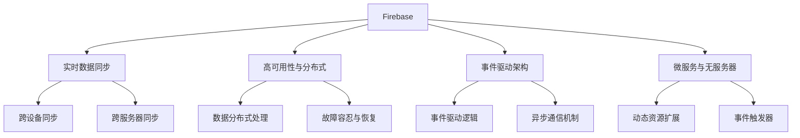

                 

## 1. 背景介绍

### 1.1 问题由来

随着互联网应用的飞速发展，实时数据更新、用户状态管理和复杂查询需求变得越发普遍。企业亟需一个能够提供强大实时数据管理能力的平台，以支撑其应用程序的快速迭代和复杂逻辑处理。然而，传统的关系型数据库（如MySQL、Oracle）往往难以应对频繁的事务操作和复杂的逻辑查询，非关系型数据库（如MongoDB、Redis）则更偏向于文档存储和键值对操作，不具备复杂的事务支持。

为了解决这一问题，Firebase与RethinkDB等新型实时数据库应运而生，它们结合了关系型数据库与非关系型数据库的优势，提供了强一致性、弱一致性以及复杂逻辑查询的支持，成为大数据时代的重要技术工具。本文将系统介绍Firebase和RethinkDB两大实时数据库，剖析它们的原理与核心技术，并对比它们的应用场景与优势。

### 1.2 问题核心关键点

本节将详细梳理实时数据库的关键概念及其应用价值：

- **实时数据库(Real-time Database)**：指能够快速处理大量并发用户访问请求，并在极短时间内完成数据读写操作的数据库。它能够提供即时数据的更新与同步能力，满足Web、移动应用等对实时性要求高的场景。

- **强一致性(Strong Consistency)**：指在任何时间点，数据库中的数据都是最新的，即使并发操作也不会影响最终的一致性。适用于对数据一致性要求高的场景，如金融交易、社交媒体等。

- **弱一致性(Weak Consistency)**：指数据库在写操作后，读操作可能返回旧数据，但最终能通过读取操作得到最新的状态。适用于对数据延迟不敏感的场景，如社交网络、在线游戏等。

- **复杂查询(Complex Querying)**：指支持灵活多变的SQL、JSONPath等查询语言，以处理复杂的多表关联、聚合操作等。适用于需要进行复杂逻辑处理的应用场景。

- **事件驱动(Event-Driven)**：指通过事件触发器(Triggers)和异步通信机制，支持更加灵活、松耦合的业务逻辑处理。适用于对业务逻辑灵活性要求高的应用场景。

实时数据库的这些特性，使得它们在大数据时代的实时应用中扮演了重要角色，成为支撑Web、移动应用等系统高效运行的重要基础设施。

## 2. 核心概念与联系

### 2.1 核心概念概述

为了更好地理解Firebase和RethinkDB，本节将介绍几个核心概念：

- **Firebase**：由Google提供的一款云数据库服务，提供实时数据同步、高可用性、可扩展性和实时通信功能。主要应用于移动应用和Web应用中，提供无服务器架构和强大的前端集成支持。

- **RethinkDB**：一款基于JavaScript的分布式数据库系统，支持实时查询、高可用性和低延迟。支持多种编程语言（如Python、Node.js）和主流数据接口，主要应用于大数据分析、实时流处理和Web应用中。

- **数据同步与分布式**：实时数据库的核心特性之一，能够实现跨设备和跨服务器的实时数据同步，从而提供一致的用户体验和高效的数据协作。

- **事件驱动架构(Event-Driven Architecture)**：实时数据库通过事件驱动机制，使得应用逻辑与数据库操作分离，提升系统的灵活性和可维护性。

- **微服务与无服务器**：实时数据库支持微服务架构和无服务器计算，能够根据业务需求动态扩展资源，提升系统的伸缩性和弹性。

这些核心概念共同构成了实时数据库的核心技术框架，使得实时数据库在大数据时代能够高效、灵活地支撑各种复杂的实时应用需求。

### 2.2 核心概念原理和架构的 Mermaid 流程图



以上流程图展示了Firebase和RethinkDB的核心概念及其相互关系。其中，数据同步与分布式、事件驱动架构、微服务与无服务器等是实时数据库的核心技术特点，而跨设备同步、跨服务器同步、数据分布式处理、故障容忍与恢复、事件驱动逻辑、异步通信机制、动态资源扩展、事件触发器等则是实时数据库提供的具体功能和服务。

## 3. 核心算法原理 & 具体操作步骤

### 3.1 算法原理概述

实时数据库的算法原理主要围绕实时数据同步、分布式处理和复杂查询展开。以下将详细剖析这三大核心算法的实现原理。

#### 3.1.1 实时数据同步

实时数据库的核心在于数据同步，即在不同设备和不同服务器之间保持数据的一致性。其基本原理是：

1. **数据复制与分发**：实时数据库将数据复制到多个节点上，并在写操作后立即将新数据同步到各个节点，以实现高可用性和分布式处理。

2. **同步协议**：实时数据库通过主从复制、Paxos协议等同步协议，确保数据在多个节点之间同步的一致性。

3. **数据缓存与优化**：实时数据库通过缓存机制和数据分片优化，减少数据同步的延迟和带宽消耗，提升系统的响应速度。

#### 3.1.2 分布式处理

分布式处理是实时数据库在应对高并发和高扩展性需求时的重要算法。其基本原理是：

1. **数据分片与分区**：实时数据库将数据根据键值、范围、地理位置等进行分片，以实现数据分布式存储和并行处理。

2. **数据一致性**：实时数据库通过一致性哈希、Gossip协议等技术，保证数据分片之间的数据一致性。

3. **负载均衡与调度**：实时数据库通过负载均衡算法和调度策略，动态分配计算资源，优化系统性能。

#### 3.1.3 复杂查询

复杂查询是实时数据库实现高性能和灵活性的重要算法。其基本原理是：

1. **查询优化**：实时数据库通过索引、缓存、推导等技术，优化查询性能，减少资源消耗。

2. **多表关联与聚合**：实时数据库支持复杂的多表关联和聚合操作，通过连接、子查询、分组等SQL语法，处理复杂的逻辑查询。

3. **分布式查询**：实时数据库通过分布式查询机制，将查询任务分布到多个节点上进行并行处理，提升查询效率。

### 3.2 算法步骤详解

#### 3.2.1 实时数据同步步骤

1. **写操作**：用户执行写操作（如添加、更新、删除），实时数据库记录操作日志。

2. **数据分片与复制**：操作日志经过分片后，发送到主节点和多个副本节点。

3. **数据同步**：主节点将操作日志同步到各个副本节点，副本节点将日志解析并应用到本地数据上。

4. **同步确认**：主节点等待所有副本节点确认同步完成，记录同步结果。

5. **更新结果**：将更新后的结果返回给用户，完成写操作。

#### 3.2.2 分布式处理步骤

1. **数据分片**：根据数据键值或范围进行分片，将数据分散存储到不同的节点上。

2. **查询路由**：根据查询条件，选择对应分片进行查询。

3. **并行处理**：将查询任务并行分配到多个节点上进行处理，并将结果合并返回。

4. **负载均衡**：动态调整节点负载，优化系统性能。

5. **结果缓存**：将查询结果缓存到本地或分布式缓存中，减少后续查询的响应时间。

#### 3.2.3 复杂查询步骤

1. **SQL解析**：将查询语句解析成查询逻辑树。

2. **查询优化**：通过索引、缓存等技术，优化查询路径，减少资源消耗。

3. **分布式执行**：将查询逻辑树分发到多个节点上进行并行执行，并返回结果。

4. **结果合并**：将并行查询结果合并，形成最终查询结果。

### 3.3 算法优缺点

#### 3.3.1 实时数据同步

**优点**：
1. **高可用性**：数据复制和同步机制确保了系统的高可用性，减少单点故障风险。
2. **数据一致性**：同步协议和一致性哈希等技术保证了数据的一致性和准确性。
3. **延迟低**：数据缓存和优化机制减少了数据同步的延迟，提高了系统的响应速度。

**缺点**：
1. **复杂度高**：同步协议和一致性哈希等技术增加了系统的复杂度，维护成本高。
2. **资源消耗大**：数据复制和同步增加了系统的资源消耗，特别是在高并发场景下。

#### 3.3.2 分布式处理

**优点**：
1. **高扩展性**：数据分片和分区机制支持系统的横向扩展，提升系统的处理能力。
2. **负载均衡**：动态负载均衡和调度策略优化了系统性能，提高了系统的稳定性。
3. **并发高**：分布式处理机制支持高并发处理，提升系统的吞吐量。

**缺点**：
1. **一致性问题**：数据分片和分布式处理可能导致数据一致性问题，需要复杂的一致性协议。
2. **延迟高**：分布式处理增加了数据传输的延迟，影响系统的实时性。

#### 3.3.3 复杂查询

**优点**：
1. **灵活性高**：支持复杂的多表关联和聚合操作，满足复杂业务逻辑处理需求。
2. **性能好**：查询优化和分布式查询机制提升了查询性能，减少了资源消耗。
3. **扩展性强**：支持动态扩展和优化，提升系统的可维护性和可扩展性。

**缺点**：
1. **复杂度高**：复杂查询涉及多表关联和聚合操作，查询逻辑复杂。
2. **性能不稳定**：复杂查询可能引入额外的资源消耗，影响系统的性能稳定性。

### 3.4 算法应用领域

实时数据库广泛应用于各种实时应用场景，主要包括以下几个领域：

- **Web应用**：提供实时数据同步和状态管理，支持实时内容更新和用户交互。
- **移动应用**：实现跨设备同步和数据协作，支持离线操作和同步更新。
- **大数据分析**：提供实时数据流处理和聚合分析，支持复杂逻辑查询和决策支持。
- **实时流处理**：支持实时数据流的处理和分析，支持流式计算和实时响应。
- **分布式系统**：提供分布式数据存储和处理能力，支持微服务架构和无服务器计算。

以上应用领域展示了实时数据库的广泛应用价值，使得其在各种实时应用场景中成为不可或缺的技术基础设施。

## 4. 数学模型和公式 & 详细讲解 & 举例说明

### 4.1 数学模型构建

本节将使用数学语言对实时数据库的核心算法进行严格的刻画。

#### 4.1.1 实时数据同步

假设实时数据库中有 $N$ 个节点，每个节点存储了相同的数据副本。设 $\text{rep}(i)$ 为节点 $i$ 上数据的版本号，$\text{rep}(i) = (v_i, t_i)$ 表示节点 $i$ 上数据的版本信息和更新时间，其中 $v_i$ 为版本号，$t_i$ 为更新时间戳。

数据同步的基本模型如下：

1. **写操作**：用户执行写操作，记录日志 $\text{log} = (v', t')$，其中 $v'$ 为新的数据版本，$t'$ 为操作时间戳。

2. **数据复制**：日志 $\text{log}$ 被复制到所有节点上，更新其版本号和更新时间。

3. **数据同步**：主节点将日志 $\text{log}$ 同步到各个节点，节点将新数据版本 $\text{v}'$ 应用到本地数据上，更新版本号 $\text{v}_i$ 为 $\text{v}'$，更新时间戳 $\text{t}_i$ 为 $t'$。

4. **同步确认**：主节点等待所有节点确认同步完成，记录同步结果。

### 4.2 公式推导过程

#### 4.2.1 实时数据同步

假设写操作的时间戳 $t'$ 和版本号 $v'$ 满足严格单调递增关系，即 $t' > t_{i-1}$ 和 $v' > v_{i-1}$，则数据同步的过程可以形式化描述如下：

$$
\text{sync}(\text{log}) = \begin{cases}
\text{true} & \text{if } \forall i, \text{rep}(i) < \text{log} \\
\text{false} & \text{otherwise}
\end{cases}
$$

其中 $\text{sync}(\text{log})$ 表示日志 $\text{log}$ 同步是否成功。

如果同步成功，则所有节点更新其数据版本和更新时间，同时主节点记录同步结果。如果同步失败，则主节点回滚日志，等待下一个写入操作。

### 4.3 案例分析与讲解

#### 4.3.1 数据分片与分布式处理

假设实时数据库中有 $M$ 个数据分片，每个分片由 $K$ 个节点存储。设 $\text{shard}(j)$ 为节点 $j$ 上分片 $j$ 的数据状态，其中 $\text{shard}(j) = (s_j, \text{rep}_j)$ 表示节点 $j$ 上分片 $j$ 的数据状态和版本号，其中 $s_j$ 为数据状态，$\text{rep}_j$ 为数据版本号。

数据分片与分布式处理的基本模型如下：

1. **数据分片**：根据键值或范围将数据分散存储到不同的分片上。

2. **查询路由**：根据查询条件选择对应分片进行查询。

3. **并行处理**：将查询任务并行分配到多个节点上进行处理，并将结果合并返回。

4. **负载均衡**：动态调整节点负载，优化系统性能。

5. **结果缓存**：将查询结果缓存到本地或分布式缓存中，减少后续查询的响应时间。

### 4.4 案例分析与讲解

#### 4.4.1 复杂查询

假设实时数据库支持复杂查询语言 SQL，查询语句为：

$$
\text{SELECT} \text{column}_1, \text{column}_2 \text{FROM} \text{table} \text{WHERE} \text{condition}_1 = \text{value}_1 \text{AND} \text{condition}_2 = \text{value}_2
$$

其中 $\text{column}_1$ 和 $\text{column}_2$ 为查询列，$\text{table}$ 为查询表，$\text{condition}_1$ 和 $\text{condition}_2$ 为查询条件，$\text{value}_1$ 和 $\text{value}_2$ 为查询值。

复杂查询的基本模型如下：

1. **SQL解析**：将查询语句解析成查询逻辑树。

2. **查询优化**：通过索引、缓存等技术，优化查询路径，减少资源消耗。

3. **分布式执行**：将查询逻辑树分发到多个节点上进行并行执行，并返回结果。

4. **结果合并**：将并行查询结果合并，形成最终查询结果。

## 5. 项目实践：代码实例和详细解释说明

### 5.1 开发环境搭建

#### 5.1.1 Firebase

Firebase的开发环境搭建相对简单，需要以下几个步骤：

1. 创建Firebase项目：登录Firebase控制台，创建新项目。

2. 安装Firebase SDK：根据应用的开发语言和平台，安装相应的Firebase SDK。

3. 配置Firebase SDK：在应用中配置Firebase SDK，获取API密钥和认证配置。

4. 集成Firebase服务：在应用中集成Firebase提供的实时数据同步、用户认证、云存储等服务。

#### 5.1.2 RethinkDB

RethinkDB的开发环境搭建需要以下几个步骤：

1. 安装RethinkDB：从官网下载RethinkDB的安装程序，按照提示完成安装。

2. 启动RethinkDB服务：启动RethinkDB服务，确保服务正常运行。

3. 安装RethinkDB Driver：根据应用的开发语言和平台，安装相应的RethinkDB Driver。

4. 连接RethinkDB数据库：在应用中配置RethinkDB Driver，连接RethinkDB数据库。

### 5.2 源代码详细实现

#### 5.2.1 Firebase

以下是一个简单的Firebase实时数据同步示例：

```python
from firebase_admin import credentials, firestore

# 加载认证配置
cred = credentials.Certificate('path/to/serviceAccountKey.json')
firebase_admin.initialize_app(cred, {
    'databaseURL': 'https://your-project-id.firebaseio.com'
})

# 获取 Firestore 数据库实例
db = firestore.client()

# 添加文档
doc_ref = db.collection('users').document('1234567890')
doc_ref.set({
    'name': 'Alice',
    'email': 'alice@example.com',
    'phone': '+1234567890'
})

# 查询文档
docs = db.collection('users').where('email', '==', 'alice@example.com').get()
for doc in docs:
    print(doc.to_dict())

# 更新文档
doc_ref.update({
    'phone': '+9876543210'
})

# 删除文档
doc_ref.delete()
```

#### 5.2.2 RethinkDB

以下是一个简单的RethinkDB复杂查询示例：

```python
import rethinkdb as r

# 连接 RethinkDB 数据库
conn = r.connect(
    host='localhost',
    port=28015,
    user='your-username',
    password='your-password',
    db='your-database'
)

# 插入数据
result = r.table('books').insert({
    'title': 'The Great Gatsby',
    'author': 'F. Scott Fitzgerald',
    'year': 1925
})
conn.close()

# 查询数据
result = r.table('books').filter(
    (r.row.author == 'F. Scott Fitzgerald') &
    (r.row.title == 'The Great Gatsby')
)
for row in result:
    print(row['title'], row['author'], row['year'])

# 复杂查询
result = r.table('books').filter(
    (r.row.author == 'F. Scott Fitzgerald') &
    (r.row.title.startswith('T'))
)
for row in result:
    print(row['title'], row['author'], row['year'])
```

### 5.3 代码解读与分析

#### 5.3.1 Firebase

Firebase提供了强大的云服务平台，使得开发者能够轻松构建实时应用。以下是对代码实例的详细解读：

1. **认证配置**：使用服务账户密钥进行身份认证，确保应用的安全性。

2. **数据库操作**：使用 Firestore 数据库进行数据读写操作，支持实时同步和查询。

3. **文档操作**：使用 Firestore 的文档模型，通过文档的 ID 进行唯一标识，支持嵌套结构的数据存储。

4. **查询操作**：使用 Firestore 的查询语言，支持多种查询条件和排序方式。

5. **更新操作**：使用 Firestore 的更新操作，支持原子性更新和条件更新。

6. **删除操作**：使用 Firestore 的删除操作，支持永久删除文档。

#### 5.3.2 RethinkDB

RethinkDB提供了灵活的数据存储和查询方式，使得开发者能够高效处理复杂数据逻辑。以下是对代码实例的详细解读：

1. **连接数据库**：使用 RethinkDB Driver 连接数据库，确保应用的稳定性和可靠性。

2. **插入数据**：使用 RethinkDB 的插入操作，支持复杂的数据结构和查询语句。

3. **查询数据**：使用 RethinkDB 的查询语言，支持灵活的查询条件和操作符。

4. **复杂查询**：使用 RethinkDB 的高级查询语法，支持多表关联和聚合操作。

### 5.4 运行结果展示

#### 5.4.1 Firebase

在 Firebase 应用中，通过实时数据同步功能，可以实现跨设备和跨服务器的数据同步，确保数据的一致性和实时性。以下是一个简单的实时数据同步示例：

1. **添加文档**：在 Firebase 应用中添加一个新的用户文档，记录用户的姓名、邮箱和电话信息。

2. **查询文档**：通过实时查询功能，获取指定用户文档的信息，输出到控制台。

3. **更新文档**：通过实时更新功能，将指定用户的电话信息更新为新的电话号码。

4. **删除文档**：通过实时删除功能，永久删除指定用户的文档，确保数据的安全性和隐私性。

#### 5.4.2 RethinkDB

在 RethinkDB 应用中，通过复杂查询功能，可以实现灵活的数据处理和分析，满足复杂业务逻辑的需求。以下是一个简单的复杂查询示例：

1. **插入数据**：在 RethinkDB 应用中插入一个新的图书记录，记录图书的标题、作者和出版年份。

2. **查询数据**：通过复杂查询功能，获取指定作者和标题的图书记录，输出到控制台。

3. **复杂查询**：通过高级查询语法，获取以指定作者首字母开头的图书记录，输出到控制台。

## 6. 实际应用场景

### 6.1 智能客服系统

智能客服系统是实时数据库的重要应用场景之一。Firebase和RethinkDB都能够提供强大的实时数据同步和状态管理功能，支持跨设备和跨服务器的数据协作，确保客服系统的实时性和一致性。

在智能客服系统中，Firebase和RethinkDB主要用于：

1. **用户状态管理**：记录用户的历史交互记录，实时更新用户状态，确保客服系统能够快速响应用户请求。

2. **实时消息推送**：通过实时消息推送功能，向用户推送最新的客服消息，提高用户满意度和响应速度。

3. **数据分析与报表**：实时收集和分析用户交互数据，生成报表和统计信息，帮助企业优化客服流程和提升服务质量。

4. **多渠道集成**：支持多种通信渠道（如Web、移动应用、邮件等）的数据同步和整合，提升客服系统的灵活性和可扩展性。

### 6.2 金融交易系统

金融交易系统是实时数据库的另一个重要应用场景。Firebase和RethinkDB都能够提供高可用性和强一致性的数据管理能力，支持复杂的事务处理和实时计算。

在金融交易系统中，Firebase和RethinkDB主要用于：

1. **交易记录管理**：记录每笔交易的详细信息，实时更新交易状态，确保交易数据的准确性和完整性。

2. **实时结算**：通过实时结算功能，快速处理和计算交易结果，提高交易效率和用户体验。

3. **风险监控**：实时监控交易数据，检测异常交易行为，防止欺诈和风险事件的发生。

4. **数据分析与决策**：实时分析交易数据，生成报表和统计信息，帮助企业进行风险评估和决策支持。

5. **多渠道集成**：支持多种通信渠道（如Web、移动应用、电话等）的数据同步和整合，提升交易系统的灵活性和可扩展性。

### 6.3 物联网应用

物联网应用需要实时数据同步和处理能力，以支持设备和传感器的数据采集和远程控制。Firebase和RethinkDB都能够提供实时数据同步和分布式处理功能，满足物联网应用的复杂数据逻辑需求。

在物联网应用中，Firebase和RethinkDB主要用于：

1. **设备数据采集**：实时采集和存储设备传感器数据，确保数据的时效性和准确性。

2. **数据同步与分发**：将设备数据同步到多个设备和服务器上，确保数据的一致性和可靠性。

3. **数据分析与预测**：实时分析设备数据，生成预测和报表信息，帮助企业优化设备管理和维护。

4. **远程控制**：通过远程控制功能，实现设备的远程管理和监控，提升设备的自动化和智能化水平。

5. **数据可视化**：实时展示设备数据和分析结果，帮助企业进行直观的数据分析和决策。

## 7. 工具和资源推荐

### 7.1 学习资源推荐

为了帮助开发者系统掌握Firebase和RethinkDB的核心技术，以下是一些优质的学习资源：

1. **Firebase官方文档**：Firebase提供的官方文档，包含详细的API和配置指南，适合新手快速上手。

2. **RethinkDB官方文档**：RethinkDB提供的官方文档，包含详细的DB操作和查询语法，适合进阶学习。

3. **Firebase实战教程**：通过实际的Firebase项目案例，学习Firebase的开发和优化技巧。

4. **RethinkDB实战教程**：通过实际的RethinkDB项目案例，学习RethinkDB的开发和优化技巧。

5. **Web和移动应用开发教程**：通过Web和移动应用开发教程，学习如何将Firebase和RethinkDB集成到Web和移动应用中。

6. **数据分析与报表开发教程**：通过数据分析和报表开发教程，学习如何使用Firebase和RethinkDB进行实时数据处理和分析。

### 7.2 开发工具推荐

为了高效开发Firebase和RethinkDB应用，以下是一些推荐的开发工具：

1. **Firebase SDK**：Firebase提供的SDK，支持Web、iOS、Android等平台的实时数据同步和状态管理。

2. **Firebase Console**：Firebase提供的管理平台，方便管理应用的用户、数据和配置。

3. **Firebase Analytics**：Firebase提供的实时数据分析工具，支持监控应用的用户行为和业务指标。

4. **RethinkDB Driver**：RethinkDB提供的Driver，支持Python、Node.js等语言的DB操作和查询。

5. **RethinkDB Client**：RethinkDB提供的客户端工具，支持命令行和GUI操作，方便开发和管理RethinkDB数据库。

6. **RethinkDB Query Visualizer**：RethinkDB提供的查询可视化工具，方便开发和调试复杂的查询语句。

### 7.3 相关论文推荐

Firebase和RethinkDB作为新兴的实时数据库，其核心算法和技术不断发展。以下是几篇奠基性的相关论文，推荐阅读：

1. **Firebase架构设计**：Firebase团队发布的设计文档，详细介绍了Firebase的架构和实现原理。

2. **RethinkDB核心算法**：RethinkDB团队发布的核心算法论文，详细介绍了RethinkDB的分布式处理、复杂查询等技术。

3. **Firebase与Web应用**：相关学术论文，探讨Firebase在Web应用中的实现和优化。

4. **RethinkDB与大数据分析**：相关学术论文，探讨RethinkDB在大数据分析中的应用和优化。

5. **实时数据同步与一致性**：相关学术论文，探讨实时数据同步的一致性算法和技术。

这些论文代表了大语言模型微调技术的发展脉络。通过学习这些前沿成果，可以帮助研究者把握学科前进方向，激发更多的创新灵感。

## 8. 总结：未来发展趋势与挑战

### 8.1 总结

本文系统介绍了Firebase和RethinkDB两大实时数据库，详细剖析了其核心技术和应用价值。通过深入的原理剖析和实用的开发示例，帮助开发者全面理解实时数据库的工作机制和开发技巧。

### 8.2 未来发展趋势

展望未来，Firebase和RethinkDB的发展趋势主要集中在以下几个方面：

1. **云原生架构**：Firebase和RethinkDB将进一步发展云原生架构，支持更加灵活和高效的数据管理和查询。

2. **分布式计算**：Firebase和RethinkDB将发展分布式计算技术，支持大规模数据的处理和分析。

3. **机器学习集成**：Firebase和RethinkDB将引入机器学习技术，提升数据分析和决策支持的能力。

4. **多模态数据处理**：Firebase和RethinkDB将支持多模态数据处理，支持文本、图像、视频等多种类型的数据存储和查询。

5. **实时应用扩展**：Firebase和RethinkDB将支持更多实时应用场景，如智能客服、金融交易、物联网等，提升系统的实用性和可扩展性。

6. **安全性与隐私保护**：Firebase和RethinkDB将加强安全性与隐私保护，确保数据的安全性和合规性。

### 8.3 面临的挑战

尽管Firebase和RethinkDB已经取得了显著进展，但在迈向更加智能化、普适化应用的过程中，仍面临诸多挑战：

1. **性能瓶颈**：在高并发和高实时性要求下，Firebase和RethinkDB需要优化性能，减少数据同步和查询的延迟。

2. **数据一致性**：在复杂的数据逻辑和分布式处理场景中，Firebase和RethinkDB需要保证数据的一致性和准确性。

3. **资源消耗**：Firebase和RethinkDB需要优化资源消耗，减少计算和存储成本，提升系统的效率和可扩展性。

4. **安全性与隐私**：Firebase和RethinkDB需要加强安全性与隐私保护，确保数据的安全性和合规性。

5. **用户体验**：Firebase和RethinkDB需要提升用户体验，确保系统的稳定性和可靠性。

6. **多模态支持**：Firebase和RethinkDB需要支持多模态数据处理，提升系统的灵活性和适应性。

### 8.4 研究展望

未来的研究将围绕以下几个方向展开：

1. **云原生架构优化**：研究云原生架构的优化技术，提升系统的可扩展性和灵活性。

2. **分布式计算优化**：研究分布式计算的优化技术，提升系统的性能和可靠性。

3. **机器学习集成**：研究机器学习技术的集成方法，提升系统的智能分析和决策支持能力。

4. **多模态数据处理**：研究多模态数据的处理技术，提升系统的灵活性和适应性。

5. **安全性与隐私保护**：研究安全性与隐私保护技术，确保数据的安全性和合规性。

6. **用户体验提升**：研究用户体验的提升技术，确保系统的稳定性和可靠性。

这些研究方向将推动Firebase和RethinkDB技术的不断进步，为实时数据库在更多应用场景中发挥更大作用提供有力支持。

## 9. 附录：常见问题与解答

**Q1：Firebase和RethinkDB的主要区别是什么？**

A: Firebase和RethinkDB的主要区别在于：

1. **架构与设计**：Firebase是基于云服务架构，支持无服务器计算和端到端集成；RethinkDB是基于分布式架构，支持多节点分布式处理和复杂查询。

2. **应用场景**：Firebase主要应用于移动应用和Web应用，支持实时数据同步和状态管理；RethinkDB主要应用于大数据分析、实时流处理和Web应用，支持复杂查询和分布式处理。

3. **开发难度**：Firebase提供了完整的SDK和端到端集成，开发难度较低；RethinkDB需要自行开发和集成Driver，开发难度较高。

**Q2：如何选择Firebase或RethinkDB？**

A: 选择Firebase或RethinkDB应根据具体应用场景和需求进行评估：

1. **开发复杂度**：如果开发难度低，且需求为实时数据同步和状态管理，推荐选择Firebase。

2. **查询复杂度**：如果查询复杂度高，且需求为大数据分析或实时流处理，推荐选择RethinkDB。

3. **扩展性需求**：如果扩展性要求高，且需求为跨设备和跨服务器处理，推荐选择Firebase。

4. **数据一致性**：如果数据一致性要求高，且需求为强一致性处理，推荐选择Firebase。

**Q3：Firebase和RethinkDB的优缺点是什么？**

A: Firebase和RethinkDB的优缺点如下：

**Firebase的优点**：
1. **开发难度低**：提供了完整的SDK和端到端集成，开发难度较低。
2. **实时同步**：支持实时数据同步和状态管理，确保数据的一致性和实时性。
3. **云原生架构**：支持无服务器计算和云原生架构，提升系统的可扩展性和灵活性。

**Firebase的缺点**：
1. **查询复杂度低**：支持简单查询，复杂查询功能有限。
2. **资源消耗高**：云服务架构增加了计算和存储成本，可能不适合高并发和高实时性场景。

**RethinkDB的优点**：
1. **查询复杂度高**：支持复杂的多表关联和聚合操作，满足复杂业务逻辑处理需求。
2. **数据一致性高**：支持强一致性处理，确保数据的一致性和准确性。
3. **扩展性强**：支持多节点分布式处理，提升系统的可扩展性和性能。

**RethinkDB的缺点**：
1. **开发难度高**：需要自行开发和集成Driver，开发难度较高。
2. **实时同步难度大**：开发和集成复杂，实时数据同步和状态管理难度较大。

**Q4：如何使用Firebase或RethinkDB进行实时数据同步？**

A: 使用Firebase或RethinkDB进行实时数据同步的主要步骤如下：

1. **安装Firebase或RethinkDB SDK**：根据应用的开发语言和平台，安装相应的SDK。

2. **配置Firebase或RethinkDB Driver**：在应用中配置Firebase或RethinkDB Driver，连接数据库。

3. **进行数据操作**：在应用中进行数据写入、查询、更新和删除操作。

4. **监控数据同步状态**：通过监控工具实时监控数据同步状态，确保数据的一致性和实时性。

**Q5：如何进行Firebase或RethinkDB的数据查询？**

A: 进行Firebase或RethinkDB的数据查询的主要步骤如下：

1. **连接Firebase或RethinkDB数据库**：使用Firebase或RethinkDB Driver连接数据库。

2. **进行数据查询**：在应用中使用SQL或JSONPath等查询语言进行数据查询。

3. **优化查询性能**：通过索引、缓存等技术，优化查询路径，减少资源消耗。

4. **处理查询结果**：将查询结果处理并展示给用户，或进一步进行业务逻辑处理。

总之，Firebase和RethinkDB作为新兴的实时数据库，结合了关系型数据库与非关系型数据库的优势，提供了强大的实时数据管理和处理能力。通过深入理解其核心技术和应用价值，可以更好地支撑各种复杂的实时应用需求。

---

作者：禅与计算机程序设计艺术 / Zen and the Art of Computer Programming

