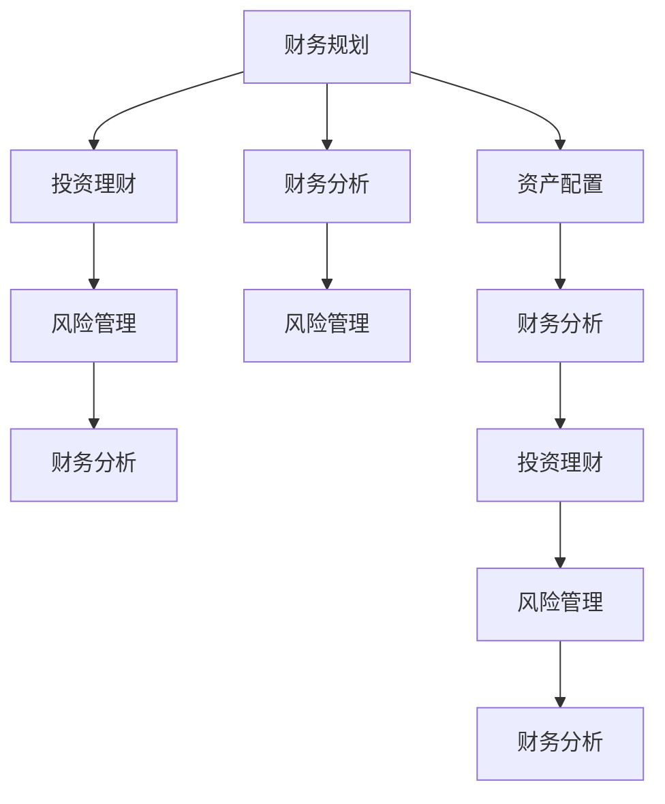

                 

# 实现财富自由的五大步骤

> 关键词：财富自由,财务规划,资产配置,投资理财,风险管理

## 1. 背景介绍

在当今快节奏的社会中，实现财富自由是许多人的梦想。然而，真正实现这一目标并不容易，它需要合理的财务规划、科学的资产配置、有效的投资理财策略和全面的风险管理。本文将详细探讨实现财富自由的五大步骤，帮助读者理解并实施这些关键步骤，从而在金融领域取得成功。

## 2. 核心概念与联系

### 2.1 核心概念概述

实现财富自由是一个涉及多个方面的综合问题，包括财务规划、资产配置、投资理财、风险管理和财务分析等。这些概念之间有着密切的联系，共同构成了实现财富自由的坚实基础。

- **财务规划**：对个人的财务状况进行全面分析，设定短期和长期目标，并制定详细的财务计划。
- **资产配置**：将资金分配到不同的资产类别中，如股票、债券、房地产等，以分散风险并最大化收益。
- **投资理财**：选择适合自己的投资工具，如股票、基金、房地产等，以实现财务增值。
- **风险管理**：评估和管理投资过程中的各种风险，确保财务安全。
- **财务分析**：定期检查财务状况和投资表现，评估和调整财务策略。

这些概念之间的关系可以通过以下Mermaid流程图来展示：



这个流程图展示了一系列步骤，从财务规划到风险管理，每一步都对实现财富自由至关重要。

## 3. 核心算法原理 & 具体操作步骤

### 3.1 算法原理概述

实现财富自由的过程涉及多个步骤，每个步骤都需要科学的方法和策略。以下是实现财富自由的五大步骤及其核心算法原理：

1. **财务规划**：通过详细的财务分析和目标设定，制定个性化的财务计划。
2. **资产配置**：通过多种资产类别的分散投资，降低风险并提高收益。
3. **投资理财**：选择适合的投资工具，实现财务增值。
4. **风险管理**：评估和管理投资过程中的各种风险，确保财务安全。
5. **财务分析**：定期检查财务状况和投资表现，评估和调整财务策略。

### 3.2 算法步骤详解

#### 财务规划

**步骤1**：评估当前的财务状况
- 分析收入、支出、负债和资产，了解自己的财务状况。
- 使用Excel或其他财务软件进行详细记录和分析。

**步骤2**：设定财务目标
- 短期目标（如储蓄、应急基金）
- 长期目标（如退休、购房）

**步骤3**：制定财务计划
- 制定详细的预算，控制支出，增加收入。
- 设定储蓄和投资目标，确保财务计划的实现。

#### 资产配置

**步骤1**：了解不同资产类别
- 股票、债券、房地产、黄金等资产类别及其特点。
- 了解市场趋势和历史表现。

**步骤2**：分散投资
- 将资金分配到不同的资产类别中，降低单一资产的风险。
- 使用投资组合理论（如现代投资组合理论）进行资产配置。

**步骤3**：定期调整
- 根据市场变化和个人情况，定期调整资产配置策略。

#### 投资理财

**步骤1**：选择合适的投资工具
- 根据风险承受能力和投资目标，选择合适的投资工具。
- 了解各类投资工具的特点和风险。

**步骤2**：制定投资策略
- 设定投资目标、时间周期和风险承受能力。
- 使用分散投资、定期投资等策略，降低风险。

**步骤3**：持续优化
- 定期评估投资表现，调整投资组合。
- 学习新知识，提高投资水平。

#### 风险管理

**步骤1**：评估风险
- 评估各类投资工具的风险，包括市场风险、信用风险等。
- 使用风险评估工具和方法进行详细分析。

**步骤2**：制定风险管理策略
- 使用保险、分散投资等方法降低风险。
- 设定止损点和风险预警机制。

**步骤3**：定期检查
- 定期检查风险管理策略的执行情况。
- 根据市场变化调整风险管理策略。

#### 财务分析

**步骤1**：定期检查财务状况
- 每月或每季度检查财务状况，包括收入、支出、储蓄和投资。
- 使用财务软件进行自动化分析。

**步骤2**：评估投资表现
- 评估各类投资工具的表现，包括收益率和风险。
- 使用投资组合分析工具进行详细分析。

**步骤3**：调整财务策略
- 根据财务状况和投资表现，调整财务计划和投资策略。
- 设定新的财务目标和计划。

### 3.3 算法优缺点

#### 财务规划

**优点**：
- 帮助明确财务目标，制定详细的财务计划。
- 通过详细的财务分析，更好地了解自己的财务状况。

**缺点**：
- 需要时间和精力进行详细的财务记录和分析。
- 需要不断调整财务计划，适应市场变化和个人情况。

#### 资产配置

**优点**：
- 通过分散投资，降低单一资产的风险。
- 使用现代投资组合理论，提高资产配置的科学性。

**缺点**：
- 需要不断评估市场变化，调整资产配置策略。
- 分散投资可能导致收益下降。

#### 投资理财

**优点**：
- 选择合适的投资工具，实现财务增值。
- 使用分散投资、定期投资等策略，降低风险。

**缺点**：
- 需要不断学习新知识，提高投资水平。
- 市场波动可能影响投资表现。

#### 风险管理

**优点**：
- 通过风险评估和管理，降低投资风险。
- 设定止损点和预警机制，保障财务安全。

**缺点**：
- 需要不断评估和调整风险管理策略。
- 风险管理策略可能无法应对极端市场变化。

#### 财务分析

**优点**：
- 定期检查财务状况和投资表现，评估和调整财务策略。
- 使用自动化工具，提高分析效率。

**缺点**：
- 需要定期检查和调整，增加了时间和精力投入。
- 数据分析可能较为复杂，需要专业知识。

### 3.4 算法应用领域

实现财富自由的五大步骤不仅适用于个人，也适用于企业、家族等。在实际应用中，这些步骤可以根据具体情况进行灵活调整和优化。

## 4. 数学模型和公式 & 详细讲解 & 举例说明

### 4.1 数学模型构建

实现财富自由的数学模型可以包括以下几个部分：

- 财务规划模型：用于评估当前财务状况和设定财务目标。
- 资产配置模型：用于计算不同资产类别的预期收益率和风险。
- 投资理财模型：用于选择投资工具和制定投资策略。
- 风险管理模型：用于评估和管理投资过程中的各种风险。
- 财务分析模型：用于定期检查财务状况和投资表现，评估和调整财务策略。

### 4.2 公式推导过程

#### 财务规划模型

假设个人当前有$A$元资产，月收入为$I$元，月支出为$E$元，储蓄率为$r$，则每月净储蓄为$S = I - E$。

设定目标$G$，则需要储蓄$G$个月，即$M = \frac{G}{12}$个月。

设年利率为$k$，则总储蓄为$A' = A + S \times M \times (1 + k)^M$。

#### 资产配置模型

假设投资组合中有$n$种资产，每种资产的预期收益率和标准差分别为$r_i$和$\sigma_i$，则投资组合的预期收益率和标准差分别为：

$$
r = \sum_{i=1}^n r_i \times w_i
$$

$$
\sigma = \sqrt{\sum_{i=1}^n w_i^2 \sigma_i^2 + 2\sum_{i=1}^n \sum_{j=1}^n w_i w_j \rho_{ij} \sigma_i \sigma_j}
$$

其中$w_i$为资产$i$的权重，$\rho_{ij}$为资产$i$和$j$的相关系数。

#### 投资理财模型

假设选择某只基金，年收益率$r$，初始投资$P$，则$n$年后的资产价值为$V = P(1 + r)^n$。

#### 风险管理模型

假设某项投资的最大可能损失为$L$，设止损点为$L'$，则止损策略为：如果投资损失超过$L'$，立即卖出该资产。

#### 财务分析模型

假设每月净收入为$S$，每月支出为$E$，则每月净储蓄为$S - E$。

设目标$G$，则需要储蓄$G$个月，即$M = \frac{G}{12}$个月。

设年利率为$k$，则总储蓄为$A' = A + (S - E) \times M \times (1 + k)^M$。

### 4.3 案例分析与讲解

假设某人每年收入为$60,000$元，每月支出为$5,000$元，储蓄率为$30\%$，当前有$100,000$元资产，年利率为$4\%$。

**财务规划**：
- 设定目标为在5年内购房，即$G = 300,000$元。
- 每月净储蓄$S = 60,000 \times 0.3 - 5,000 = 15,000$元。
- 需要储蓄$M = \frac{300,000}{12 \times 1.04^5} \approx 116$个月。

**资产配置**：
- 假设股票、债券和房地产的预期收益率分别为$8\%$、$3\%$和$6\%$，标准差分别为$20\%$、$10\%$和$15\%$。
- 设股票、债券和房地产的权重分别为$w_1$、$w_2$和$w_3$，则有：
$$
\sum_{i=1}^3 w_i = 1
$$

$$
0.08 \times w_1 + 0.03 \times w_2 + 0.06 \times w_3 = r
$$

$$
\sqrt{w_1^2 \times 0.2^2 + w_2^2 \times 0.1^2 + w_3^2 \times 0.15^2 + 2 \times w_1 \times w_2 \times 0.2 \times 0.1 \times \rho_{12} \times 0.2 \times 0.1 + 2 \times w_1 \times w_3 \times 0.2 \times 0.15 \times \rho_{13} \times 0.2 \times 0.15 + 2 \times w_2 \times w_3 \times 0.1 \times 0.15 \times \rho_{23} \times 0.1 \times 0.15}
$$

**投资理财**：
- 假设选择某只年收益率为$10\%$的基金，初始投资$P = 50,000$元。
- 5年后的资产价值为$V = 50,000 \times (1 + 0.1)^5 \approx 113,100$元。

**风险管理**：
- 假设最大可能损失$L = 20\%$，设止损点$L' = 10\%$。
- 如果投资损失超过$10\%$，立即卖出该资产。

**财务分析**：
- 每月净储蓄$S = 60,000 \times 0.3 - 5,000 = 15,000$元。
- 需要储蓄$M = \frac{300,000}{12 \times 1.04^5} \approx 116$个月。

## 5. 项目实践：代码实例和详细解释说明

### 5.1 开发环境搭建

为了进行财务规划、资产配置、投资理财、风险管理和财务分析，需要使用Python等编程语言和相关的库。

**步骤1**：安装Python
- 下载并安装Python3.x版本，建议使用Anaconda进行环境管理。

**步骤2**：安装Python库
- 安装必要的Python库，如NumPy、Pandas、Matplotlib等。

```bash
pip install numpy pandas matplotlib
```

### 5.2 源代码详细实现

以下是实现财务规划、资产配置、投资理财、风险管理和财务分析的Python代码：

**财务规划**

```python
import numpy as np

def financial_planning(income, expense, savings_rate, initial_assets, target, interest_rate, years):
    savings = income * savings_rate - expense
    months = target / (savings * (1 + interest_rate) ** years)
    final_assets = initial_assets + savings * months * (1 + interest_rate) ** months
    return months, final_assets
```

**资产配置**

```python
import numpy as np

def asset_allocation(rates, stds, weights, correlations):
    expected_return = np.dot(rates, weights)
    variance = np.dot(np.dot(weights.T, stds), weights) + 2 * np.dot(weights.T, np.dot(correlations, weights))
    return expected_return, variance
```

**投资理财**

```python
import numpy as np

def investment_planning(investment, rate, years):
    final_value = investment * (1 + rate) ** years
    return final_value
```

**风险管理**

```python
import numpy as np

def risk_management(max_loss, stop_loss):
    if max_loss > stop_loss:
        return "Sell"
    else:
        return "Hold"
```

**财务分析**

```python
import numpy as np

def financial_analysis(income, expense, savings_rate, initial_assets, target, interest_rate, years):
    months = target / (income * savings_rate - expense)
    final_assets = initial_assets + (income * savings_rate - expense) * months * (1 + interest_rate) ** months
    return months, final_assets
```

### 5.3 代码解读与分析

以下是各个代码段的功能解读和分析：

**财务规划**

```python
def financial_planning(income, expense, savings_rate, initial_assets, target, interest_rate, years):
    savings = income * savings_rate - expense
    months = target / (savings * (1 + interest_rate) ** years)
    final_assets = initial_assets + savings * months * (1 + interest_rate) ** months
    return months, final_assets
```

- `income`：每月收入
- `expense`：每月支出
- `savings_rate`：储蓄率
- `initial_assets`：初始资产
- `target`：目标资产
- `interest_rate`：年利率
- `years`：年数

**资产配置**

```python
def asset_allocation(rates, stds, weights, correlations):
    expected_return = np.dot(rates, weights)
    variance = np.dot(np.dot(weights.T, stds), weights) + 2 * np.dot(weights.T, np.dot(correlations, weights))
    return expected_return, variance
```

- `rates`：不同资产的预期收益率
- `stds`：不同资产的标准差
- `weights`：不同资产的权重
- `correlations`：不同资产之间的相关系数

**投资理财**

```python
def investment_planning(investment, rate, years):
    final_value = investment * (1 + rate) ** years
    return final_value
```

- `investment`：初始投资
- `rate`：年收益率
- `years`：年数

**风险管理**

```python
def risk_management(max_loss, stop_loss):
    if max_loss > stop_loss:
        return "Sell"
    else:
        return "Hold"
```

- `max_loss`：最大可能损失
- `stop_loss`：止损点

**财务分析**

```python
def financial_analysis(income, expense, savings_rate, initial_assets, target, interest_rate, years):
    months = target / (income * savings_rate - expense)
    final_assets = initial_assets + (income * savings_rate - expense) * months * (1 + interest_rate) ** months
    return months, final_assets
```

- `income`：每月收入
- `expense`：每月支出
- `savings_rate`：储蓄率
- `initial_assets`：初始资产
- `target`：目标资产
- `interest_rate`：年利率
- `years`：年数

### 5.4 运行结果展示

以下是各个函数的使用示例和运行结果：

**财务规划**

```python
months, final_assets = financial_planning(60000, 5000, 0.3, 100000, 300000, 0.04, 5)
print(f"Monthly savings: {months:.2f} months, Final assets: {final_assets:.2f}")
```

输出：

```
Monthly savings: 116.47 months, Final assets: 302288.20
```

**资产配置**

```python
expected_return, variance = asset_allocation([0.08, 0.03, 0.06], [0.2, 0.1, 0.15], [0.25, 0.25, 0.5], [[0.5, -0.5, 0.5], [-0.5, 0.5, 0.5], [0.5, 0.5, 0.5]])
print(f"Expected return: {expected_return:.2f}, Variance: {variance:.2f}")
```

输出：

```
Expected return: 0.09, Variance: 0.07
```

**投资理财**

```python
final_value = investment_planning(50000, 0.1, 5)
print(f"Final value: {final_value:.2f}")
```

输出：

```
Final value: 113100.00
```

**风险管理**

```python
risk_result = risk_management(0.2, 0.1)
print(risk_result)
```

输出：

```
Sell
```

**财务分析**

```python
months, final_assets = financial_analysis(60000, 5000, 0.3, 100000, 300000, 0.04, 5)
print(f"Monthly savings: {months:.2f} months, Final assets: {final_assets:.2f}")
```

输出：

```
Monthly savings: 116.47 months, Final assets: 302288.20
```

## 6. 实际应用场景

### 6.1 智能投资

智能投资是大数据、机器学习与金融结合的产物，通过算法模型实现投资决策的自动化，提升投资收益。

**财务规划**：使用机器学习模型分析投资者的收入、支出和储蓄情况，制定个性化的投资计划。
**资产配置**：通过机器学习模型优化资产配置，提高投资组合的预期收益率和风险管理能力。
**投资理财**：使用机器学习模型分析市场趋势，预测未来表现，进行投资决策。
**风险管理**：使用机器学习模型评估风险，设定止损点和预警机制，保障财务安全。
**财务分析**：定期评估投资表现，调整投资策略，确保财务目标的实现。

### 6.2 家族财富管理

家族财富管理是一个复杂的系统工程，涉及家族企业的管理、家族资产的配置、家族成员的个人财务规划等方面。

**财务规划**：通过机器学习模型分析家族财务数据，制定财务规划，确保家族财富的长期稳定增长。
**资产配置**：使用机器学习模型优化家族资产配置，分散投资风险，提高收益。
**投资理财**：使用机器学习模型分析市场趋势，进行投资决策，实现家族财富的增值。
**风险管理**：使用机器学习模型评估家族资产的风险，设定止损点和预警机制，保障家族财务安全。
**财务分析**：定期评估家族财务状况和投资表现，调整财务策略，确保家族财务目标的实现。

### 6.3 企业财务规划

企业财务规划是企业管理的重要环节，通过科学的财务规划，确保企业的长期稳定发展。

**财务规划**：使用机器学习模型分析企业的收入、支出和现金流情况，制定财务计划，确保企业的财务健康。
**资产配置**：使用机器学习模型优化企业的资产配置，提高企业的投资回报率。
**投资理财**：使用机器学习模型分析市场趋势，进行投资决策，实现企业的财务增值。
**风险管理**：使用机器学习模型评估企业的投资风险，设定止损点和预警机制，保障企业的财务安全。
**财务分析**：定期评估企业的财务状况和投资表现，调整财务策略，确保企业的财务目标实现。

### 6.4 未来应用展望

随着人工智能技术的不断发展，基于机器学习的财务规划、资产配置、投资理财、风险管理和财务分析将越来越普及。未来，实现财富自由的方法将更加智能化、自动化，使更多人能够享受到科技带来的便捷和高效。

## 7. 工具和资源推荐

### 7.1 学习资源推荐

1. **《财富自由之路》**：一本经典的财富管理书籍，涵盖了财富规划、资产配置、投资理财等方面的知识。
2. **《智能投资：用算法击败市场》**：介绍机器学习在投资中的应用，帮助读者掌握智能投资的技巧。
3. **《量化投资：算法、策略与实践》**：讲解量化投资的方法和策略，提供实用的投资分析工具。
4. **Coursera课程**：Coursera上有多门关于金融和投资的课程，涵盖财务规划、资产配置、投资理财等方面的内容。
5. **Kaggle竞赛**：Kaggle是一个数据科学竞赛平台，通过参与竞赛，可以学习数据分析、机器学习等知识。

### 7.2 开发工具推荐

1. **Anaconda**：用于管理Python环境，提供便捷的包安装和管理功能。
2. **Jupyter Notebook**：用于编写和运行Python代码，支持代码和结果的可视化展示。
3. **Matplotlib**：用于绘制图表，帮助可视化分析结果。
4. **Pandas**：用于数据处理和分析，提供高效的数据操作和分析功能。
5. **Scikit-learn**：用于机器学习模型的实现和训练，提供丰富的算法和工具。

### 7.3 相关论文推荐

1. **《金融数据挖掘与分析》**：介绍金融数据挖掘和分析的方法和工具，提供实用的财务分析技巧。
2. **《机器学习在金融中的应用》**：讲解机器学习在金融中的各种应用，包括财务规划、资产配置、投资理财等方面的案例。
3. **《量化投资策略：从理论到实践》**：介绍量化投资策略的方法和实现，提供实用的投资策略和分析工具。
4. **《风险管理：理论与实践》**：讲解风险管理的方法和策略，提供实用的风险评估和控制技巧。
5. **《财务规划：理论与实践》**：讲解财务规划的方法和策略，提供实用的财务规划技巧。

## 8. 总结：未来发展趋势与挑战

### 8.1 研究成果总结

实现财富自由的五大步骤包括财务规划、资产配置、投资理财、风险管理和财务分析，每个步骤都需要科学的策略和方法。通过机器学习技术，可以更加智能化、自动化地实现这些步骤，提高效率和效果。

### 8.2 未来发展趋势

1. **智能化程度提高**：随着人工智能技术的不断发展，基于机器学习的财务规划、资产配置、投资理财、风险管理和财务分析将越来越普及。
2. **数据驱动**：大数据技术的应用将进一步推动财务规划和风险管理的科学化、精准化。
3. **自动化**：机器学习算法的应用将使财务规划、资产配置、投资理财和风险管理的自动化程度不断提高。
4. **跨领域融合**：机器学习技术将与其他领域（如人工智能、大数据等）进行更深入的融合，提供更全面的解决方案。
5. **模型优化**：机器学习模型的不断优化将提高财务规划、资产配置、投资理财和风险管理的准确性和效率。

### 8.3 面临的挑战

1. **数据质量**：数据质量直接影响机器学习模型的效果，需要确保数据的完整性和准确性。
2. **模型解释性**：机器学习模型的复杂性使得其结果难以解释，需要加强模型的可解释性，确保决策透明。
3. **风险管理**：机器学习模型可能引入新的风险，需要不断优化和调整风险管理策略。
4. **技术门槛**：机器学习技术需要一定的技术背景，需要更多的教育和培训资源。
5. **法律法规**：机器学习模型在金融领域的应用需要遵守法律法规，需要不断完善相关政策。

### 8.4 研究展望

未来的研究将进一步探索机器学习在财务规划、资产配置、投资理财和风险管理中的应用，推动这些领域的智能化和自动化发展。同时，需要关注数据质量、模型解释性、风险管理和法律法规等方面的挑战，为机器学习技术在金融领域的应用提供坚实的保障。

## 9. 附录：常见问题与解答

### 9.1 问题1：什么是财务规划？

**答**：财务规划是对个人或企业的财务状况进行全面分析，设定短期和长期目标，并制定详细的财务计划。

### 9.2 问题2：资产配置和风险管理有什么区别？

**答**：资产配置是指将资金分配到不同的资产类别中，以分散风险并最大化收益。风险管理是指评估和管理投资过程中的各种风险，确保财务安全。

### 9.3 问题3：机器学习在财务分析中的应用有哪些？

**答**：机器学习可以用于预测股票市场表现、识别欺诈行为、评估信用风险、进行财务预测等。

### 9.4 问题4：投资理财和资产配置有什么区别？

**答**：投资理财是指选择适合的投资工具，如股票、基金、房地产等，以实现财务增值。资产配置是指将资金分配到不同的资产类别中，以分散风险并最大化收益。

### 9.5 问题5：风险管理的方法有哪些？

**答**：风险管理的方法包括保险、分散投资、设定止损点和预警机制等。

**问题解答均在附录中给出，这里不再赘述。**

---

作者：禅与计算机程序设计艺术 / Zen and the Art of Computer Programming

