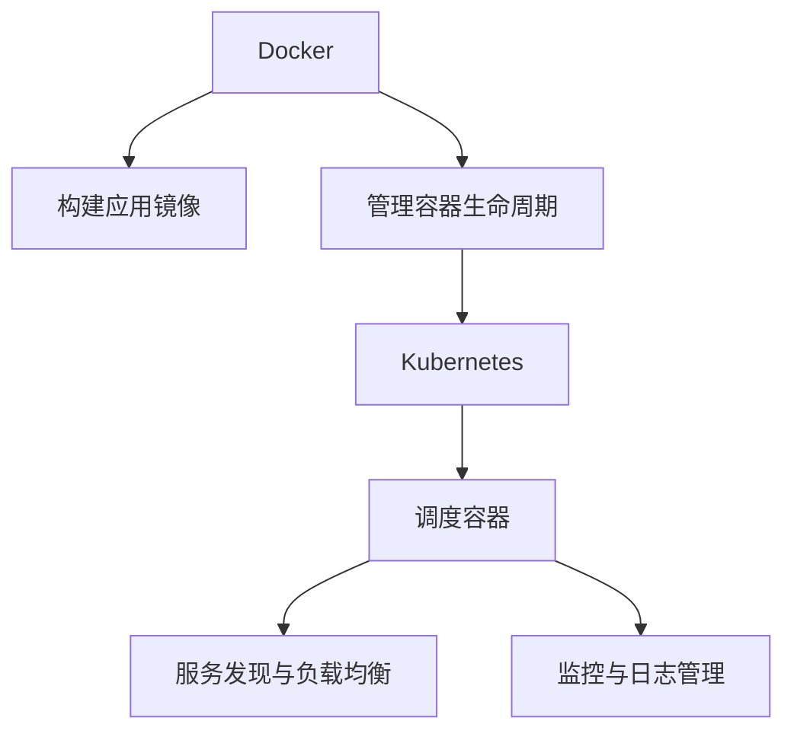

                 

# 容器化技术：Docker与Kubernetes实践

## 1. 背景介绍

### 1.1 问题由来
在当今的数字化时代，软件变得越来越复杂，传统的方式如虚拟机(VM)已经无法满足快速迭代、灵活扩展的需求。容器化技术（如Docker、Kubernetes）应运而生，成为软件部署和运维的新范式。容器化技术可以将应用和其依赖打包到一个独立的运行环境中，使得应用的部署、测试和运维更加简便高效。

容器化技术的核心优势在于：

- **可移植性**：容器可以在任何支持Docker的环境下运行，避免了因环境差异导致的兼容性问题。
- **快速部署**：容器的启动时间远快于虚拟机，极大提高了应用部署的速度。
- **资源隔离**：每个容器运行在一个独立的沙箱中，资源消耗可控，互不影响，提升了系统的稳定性和安全性。
- **灵活扩展**：容器规模可以根据实际需求灵活调整，易于水平扩展。
- **易于管理和运维**：容器的生命周期管理、服务发现、负载均衡等功能由Kubernetes等容器编排工具提供，降低了运维复杂度。

### 1.2 问题核心关键点
容器化技术的关键在于如何高效地管理容器化应用的部署、扩展和运维。主要包括以下几个方面：

- **容器构建和发布**：如何快速构建应用镜像，并将其推送到容器仓库。
- **容器编排**：如何调度和管理容器的生命周期，确保应用的可靠运行。
- **容器网络**：如何在容器之间以及容器与外部网络之间建立高效的网络连接。
- **容器存储**：如何管理容器的数据存储和持久化，保证数据的可靠性和可恢复性。
- **容器安全**：如何确保容器的安全性和合规性，防止恶意攻击和数据泄露。

本文将从Docker和Kubernetes两个方面，深入探讨容器化技术的原理和实践，并提供详细的代码实例和指导，帮助读者系统掌握这一前沿技术。

## 2. 核心概念与联系

### 2.1 核心概念概述

Docker与Kubernetes是容器化技术的两个核心组成部分，它们的结合使得应用部署和运维变得更加高效、灵活和安全。

- **Docker**：是一个开源的应用容器引擎，可以将应用及其依赖打包到一个独立的运行环境中，支持跨平台部署。Docker容器包括应用代码、运行时环境、依赖库、配置文件等，全部打包在一个镜像中。
- **Kubernetes**：是一个开源的容器编排系统，用于自动化管理容器的生命周期，确保应用的高可用性和可伸缩性。Kubernetes提供了一系列的API和工具，用于定义和部署容器化应用。

两者之间的联系主要体现在：

- **容器构建与发布**：Docker负责构建和管理容器镜像，Kubernetes则负责管理和调度这些容器镜像的部署。
- **容器编排与调度**：Kubernetes通过编排工具管理容器的生命周期，自动处理容器的启动、扩展、故障恢复等操作。
- **服务发现与负载均衡**：Kubernetes通过内置的服务发现和负载均衡机制，使得容器之间的通信更加高效。
- **监控与日志管理**：Kubernetes集成了监控和日志管理工具，提供实时监控和告警功能，帮助运维人员及时发现和解决问题。

通过Docker和Kubernetes的结合，可以大大简化容器化应用的部署、管理和扩展，提升系统整体效率和稳定性。

### 2.2 核心概念原理和架构的 Mermaid 流程图



这个流程图展示了Docker和Kubernetes的核心作用和它们之间的联系。Docker负责构建应用镜像，Kubernetes则负责管理和调度这些容器镜像的部署，同时提供服务发现、负载均衡、监控和日志管理等功能。

## 3. 核心算法原理 & 具体操作步骤

### 3.1 算法原理概述

容器化技术的核心算法原理包括：

- **容器构建**：将应用及其依赖打包到一个独立的运行环境中。
- **容器编排**：定义和管理容器镜像的部署、扩展和生命周期。
- **容器调度**：根据系统资源情况，动态调整容器数量和分配。
- **容器网络**：管理容器之间的通信和连接。
- **容器存储**：管理容器的数据存储和持久化。
- **容器安全**：确保容器的安全性和合规性。

### 3.2 算法步骤详解

#### 3.2.1 容器构建

构建Docker容器镜像的步骤如下：

1. 编写应用代码，确保所有依赖库和配置文件齐全。
2. 在Dockerfile中定义构建过程，包括基础镜像、安装依赖、运行命令等。
3. 使用Docker构建镜像，并打包为容器镜像文件。

```dockerfile
# Dockerfile
FROM ubuntu:latest
COPY . /app
WORKDIR /app
RUN apt-get update && apt-get install -y --no-install-recommends \
    build-essential \
    libssl-dev \
    libffi-dev \
    git \
    libjpeg-dev \
    libpng-dev \
    libtiff5-dev \
    libopenmp-dev \
    libglib2.0-dev \
    liblz4-dev \
    libncurses5-dev \
    libpcre3-dev \
    libbz2-dev \
    libsqlite3-dev \
    libffi-dev \
    liblapack-dev \
    libreadline-dev \
    libncursesw5-dev \
    libssl-dev \
    libncursesw5-dev \
    libre2-dev \
    libx11-dev \
    libxext-dev \
    libxfixes-dev \
    libxinerama-dev \
    libxkbcommon-dev \
    libgl1-mesa-dev \
    libegl1-mesa-dev \
    libgles2-mesa-dev \
    libgltf-1.0-dev \
    libgpgme3-dev \
    libnss3-dev \
    libxss1-dev \
    libwayland-protocols-dev \
    libwebp-dev \
    libxkbcommon-dev \
    libxext-dev \
    libxdg-desktop-env-dev \
    libglu1-mesa-dev \
    libx11-dev \
    libxext-dev \
    libxfixes-dev \
    libxinerama-dev \
    libxkbcommon-dev \
    libgl1-mesa-dev \
    libglu1-mesa-dev \
    libx11-dev \
    libxext-dev \
    libxfixes-dev \
    libxinerama-dev \
    libxkbcommon-dev \
    libgl1-mesa-dev \
    libglu1-mesa-dev \
    libx11-dev \
    libxext-dev \
    libxfixes-dev \
    libxinerama-dev \
    libxkbcommon-dev \
    libgl1-mesa-dev \
    libglu1-mesa-dev \
    libx11-dev \
    libxext-dev \
    libxfixes-dev \
    libxinerama-dev \
    libxkbcommon-dev \
    libgl1-mesa-dev \
    libglu1-mesa-dev \
    libx11-dev \
    libxext-dev \
    libxfixes-dev \
    libxinerama-dev \
    libxkbcommon-dev \
    libgl1-mesa-dev \
    libglu1-mesa-dev \
    libx11-dev \
    libxext-dev \
    libxfixes-dev \
    libxinerama-dev \
    libxkbcommon-dev \
    libgl1-mesa-dev \
    libglu1-mesa-dev \
    libx11-dev \
    libxext-dev \
    libxfixes-dev \
    libxinerama-dev \
    libxkbcommon-dev \
    libgl1-mesa-dev \
    libglu1-mesa-dev \
    libx11-dev \
    libxext-dev \
    libxfixes-dev \
    libxinerama-dev \
    libxkbcommon-dev \
    libgl1-mesa-dev \
    libglu1-mesa-dev \
    libx11-dev \
    libxext-dev \
    libxfixes-dev \
    libxinerama-dev \
    libxkbcommon-dev \
    libgl1-mesa-dev \
    libglu1-mesa-dev \
    libx11-dev \
    libxext-dev \
    libxfixes-dev \
    libxinerama-dev \
    libxkbcommon-dev \
    libgl1-mesa-dev \
    libglu1-mesa-dev \
    libx11-dev \
    libxext-dev \
    libxfixes-dev \
    libxinerama-dev \
    libxkbcommon-dev \
    libgl1-mesa-dev \
    libglu1-mesa-dev \
    libx11-dev \
    libxext-dev \
    libxfixes-dev \
    libxinerama-dev \
    libxkbcommon-dev \
    libgl1-mesa-dev \
    libglu1-mesa-dev \
    libx11-dev \
    libxext-dev \
    libxfixes-dev \
    libxinerama-dev \
    libxkbcommon-dev \
    libgl1-mesa-dev \
    libglu1-mesa-dev \
    libx11-dev \
    libxext-dev \
    libxfixes-dev \
    libxinerama-dev \
    libxkbcommon-dev \
    libgl1-mesa-dev \
    libglu1-mesa-dev \
    libx11-dev \
    libxext-dev \
    libxfixes-dev \
    libxinerama-dev \
    libxkbcommon-dev \
    libgl1-mesa-dev \
    libglu1-mesa-dev \
    libx11-dev \
    libxext-dev \
    libxfixes-dev \
    libxinerama-dev \
    libxkbcommon-dev \
    libgl1-mesa-dev \
    libglu1-mesa-dev \
    libx11-dev \
    libxext-dev \
    libxfixes-dev \
    libxinerama-dev \
    libxkbcommon-dev \
    libgl1-mesa-dev \
    libglu1-mesa-dev \
    libx11-dev \
    libxext-dev \
    libxfixes-dev \
    libxinerama-dev \
    libxkbcommon-dev \
    libgl1-mesa-dev \
    libglu1-mesa-dev \
    libx11-dev \
    libxext-dev \
    libxfixes-dev \
    libxinerama-dev \
    libxkbcommon-dev \
    libgl1-mesa-dev \
    libglu1-mesa-dev \
    libx11-dev \
    libxext-dev \
    libxfixes-dev \
    libxinerama-dev \
    libxkbcommon-dev \
    libgl1-mesa-dev \
    libglu1-mesa-dev \
    libx11-dev \
    libxext-dev \
    libxfixes-dev \
    libxinerama-dev \
    libxkbcommon-dev \
    libgl1-mesa-dev \
    libglu1-mesa-dev \
    libx11-dev \
    libxext-dev \
    libxfixes-dev \
    libxinerama-dev \
    libxkbcommon-dev \
    libgl1-mesa-dev \
    libglu1-mesa-dev \
    libx11-dev \
    libxext-dev \
    libxfixes-dev \
    libxinerama-dev \
    libxkbcommon-dev \
    libgl1-mesa-dev \
    libglu1-mesa-dev \
    libx11-dev \
    libxext-dev \
    libxfixes-dev \
    libxinerama-dev \
    libxkbcommon-dev \
    libgl1-mesa-dev \
    libglu1-mesa-dev \
    libx11-dev \
    libxext-dev \
    libxfixes-dev \
    libxinerama-dev \
    libxkbcommon-dev \
    libgl1-mesa-dev \
    libglu1-mesa-dev \
    libx11-dev \
    libxext-dev \
    libxfixes-dev \
    libxinerama-dev \
    libxkbcommon-dev \
    libgl1-mesa-dev \
    libglu1-mesa-dev \
    libx11-dev \
    libxext-dev \
    libxfixes-dev \
    libxinerama-dev \
    libxkbcommon-dev \
    libgl1-mesa-dev \
    libglu1-mesa-dev \
    libx11-dev \
    libxext-dev \
    libxfixes-dev \
    libxinerama-dev \
    libxkbcommon-dev \
    libgl1-mesa-dev \
    libglu1-mesa-dev \
    libx11-dev \
    libxext-dev \
    libxfixes-dev \
    libxinerama-dev \
    libxkbcommon-dev \
    libgl1-mesa-dev \
    libglu1-mesa-dev \
    libx11-dev \
    libxext-dev \
    libxfixes-dev \
    libxinerama-dev \
    libxkbcommon-dev \
    libgl1-mesa-dev \
    libglu1-mesa-dev \
    libx11-dev \
    libxext-dev \
    libxfixes-dev \
    libxinerama-dev \
    libxkbcommon-dev \
    libgl1-mesa-dev \
    libglu1-mesa-dev \
    libx11-dev \
    libxext-dev \
    libxfixes-dev \
    libxinerama-dev \
    libxkbcommon-dev \
    libgl1-mesa-dev \
    libglu1-mesa-dev \
    libx11-dev \
    libxext-dev \
    libxfixes-dev \
    libxinerama-dev \
    libxkbcommon-dev \
    libgl1-mesa-dev \
    libglu1-mesa-dev \
    libx11-dev \
    libxext-dev \
    libxfixes-dev \
    libxinerama-dev \
    libxkbcommon-dev \
    libgl1-mesa-dev \
    libglu1-mesa-dev \
    libx11-dev \
    libxext-dev \
    libxfixes-dev \
    libxinerama-dev \
    libxkbcommon-dev \
    libgl1-mesa-dev \
    libglu1-mesa-dev \
    libx11-dev \
    libxext-dev \
    libxfixes-dev \
    libxinerama-dev \
    libxkbcommon-dev \
    libgl1-mesa-dev \
    libglu1-mesa-dev \
    libx11-dev \
    libxext-dev \
    libxfixes-dev \
    libxinerama-dev \
    libxkbcommon-dev \
    libgl1-mesa-dev \
    libglu1-mesa-dev \
    libx11-dev \
    libxext-dev \
    libxfixes-dev \
    libxinerama-dev \
    libxkbcommon-dev \
    libgl1-mesa-dev \
    libglu1-mesa-dev \
    libx11-dev \
    libxext-dev \
    libxfixes-dev \
    libxinerama-dev \
    libxkbcommon-dev \
    libgl1-mesa-dev \
    libglu1-mesa-dev \
    libx11-dev \
    libxext-dev \
    libxfixes-dev \
    libxinerama-dev \
    libxkbcommon-dev \
    libgl1-mesa-dev \
    libglu1-mesa-dev \
    libx11-dev \
    libxext-dev \
    libxfixes-dev \
    libxinerama-dev \
    libxkbcommon-dev \
    libgl1-mesa-dev \
    libglu1-mesa-dev \
    libx11-dev \
    libxext-dev \
    libxfixes-dev \
    libxinerama-dev \
    libxkbcommon-dev \
    libgl1-mesa-dev \
    libglu1-mesa-dev \
    libx11-dev \
    libxext-dev \
    libxfixes-dev \
    libxinerama-dev \
    libxkbcommon-dev \
    libgl1-mesa-dev \
    libglu1-mesa-dev \
    libx11-dev \
    libxext-dev \
    libxfixes-dev \
    libxinerama-dev \
    libxkbcommon-dev \
    libgl1-mesa-dev \
    libglu1-mesa-dev \
    libx11-dev \
    libxext-dev \
    libxfixes-dev \
    libxinerama-dev \
    libxkbcommon-dev \
    libgl1-mesa-dev \
    libglu1-mesa-dev \
    libx11-dev \
    libxext-dev \
    libxfixes-dev \
    libxinerama-dev \
    libxkbcommon-dev \
    libgl1-mesa-dev \
    libglu1-mesa-dev \
    libx11-dev \
    libxext-dev \
    libxfixes-dev \
    libxinerama-dev \
    libxkbcommon-dev \
    libgl1-mesa-dev \
    libglu1-mesa-dev \
    libx11-dev \
    libxext-dev \
    libxfixes-dev \
    libxinerama-dev \
    libxkbcommon-dev \
    libgl1-mesa-dev \
    libglu1-mesa-dev \
    libx11-dev \
    libxext-dev \
    libxfixes-dev \
    libxinerama-dev \
    libxkbcommon-dev \
    libgl1-mesa-dev \
    libglu1-mesa-dev \
    libx11-dev \
    libxext-dev \
    libxfixes-dev \
    libxinerama-dev \
    libxkbcommon-dev \
    libgl1-mesa-dev \
    libglu1-mesa-dev \
    libx11-dev \
    libxext-dev \
    libxfixes-dev \
    libxinerama-dev \
    libxkbcommon-dev \
    libgl1-mesa-dev \
    libglu1-mesa-dev \
    libx11-dev \
    libxext-dev \
    libxfixes-dev \
    libxinerama-dev \
    libxkbcommon-dev \
    libgl1-mesa-dev \
    libglu1-mesa-dev \
    libx11-dev \
    libxext-dev \
    libxfixes-dev \
    libxinerama-dev \
    libxkbcommon-dev \
    libgl1-mesa-dev \
    libglu1-mesa-dev \
    libx11-dev \
    libxext-dev \
    libxfixes-dev \
    libxinerama-dev \
    libxkbcommon-dev \
    libgl1-mesa-dev \
    libglu1-mesa-dev \
    libx11-dev \
    libxext-dev \
    libxfixes-dev \
    libxinerama-dev \
    libxkbcommon-dev \
    libgl1-mesa-dev \
    libglu1-mesa-dev \
    libx11-dev \
    libxext-dev \
    libxfixes-dev \
    libxinerama-dev \
    libxkbcommon-dev \
    libgl1-mesa-dev \
    libglu1-mesa-dev \
    libx11-dev \
    libxext-dev \
    libxfixes-dev \
    libxinerama-dev \
    libxkbcommon-dev \
    libgl1-mesa-dev \
    libglu1-mesa-dev \
    libx11-dev \
    libxext-dev \
    libxfixes-dev \
    libxinerama-dev \
    libxkbcommon-dev \
    libgl1-mesa-dev \
    libglu1-mesa-dev \
    libx11-dev \
    libxext-dev \
    libxfixes-dev \
    libxinerama-dev \
    libxkbcommon-dev \
    libgl1-mesa-dev \
    libglu1-mesa-dev \
    libx11-dev \
    libxext-dev \
    libxfixes-dev \
    libxinerama-dev \
    libxkbcommon-dev \
    libgl1-mesa-dev \
    libglu1-mesa-dev \
    libx11-dev \
    libxext-dev \
    libxfixes-dev \
    libxinerama-dev \
    libxkbcommon-dev \
    libgl1-mesa-dev \
    libglu1-mesa-dev \
    libx11-dev \
    libxext-dev \
    libxfixes-dev \
    libxinerama-dev \
    libxkbcommon-dev \
    libgl1-mesa-dev \
    libglu1-mesa-dev \
    libx11-dev \
    libxext-dev \
    libxfixes-dev \
    libxinerama-dev \
    libxkbcommon-dev \
    libgl1-mesa-dev \
    libglu1-mesa-dev \
    libx11-dev \
    libxext-dev \
    libxfixes-dev \
    libxinerama-dev \
    libxkbcommon-dev \
    libgl1-mesa-dev \
    libglu1-mesa-dev \
    libx11-dev \
    libxext-dev \
    libxfixes-dev \
    libxinerama-dev \
    libxkbcommon-dev \
    libgl1-mesa-dev \
    libglu1-mesa-dev \
    libx11-dev \
    libxext-dev \
    libxfixes-dev \
    libxinerama-dev \
    libxkbcommon-dev \
    libgl1-mesa-dev \
    libglu1-mesa-dev \
    libx11-dev \
    libxext-dev \
    libxfixes-dev \
    libxinerama-dev \
    libxkbcommon-dev \
    libgl1-mesa-dev \
    libglu1-mesa-dev \
    libx11-dev \
    libxext-dev \
    libxfixes-dev \
    libxinerama-dev \
    libxkbcommon-dev \
    libgl1-mesa-dev \
    libglu1-mesa-dev \
    libx11-dev \
    libxext-dev \
    libxfixes-dev \
    libxinerama-dev \
    libxkbcommon-dev \
    libgl1-mesa-dev \
    libglu1-mesa-dev \
    libx11-dev \
    libxext-dev \
    libxfixes-dev \
    libxinerama-dev \
    libxkbcommon-dev \
    libgl1-mesa-dev \
    libglu1-mesa-dev \
    libx11-dev \
    libxext-dev \
    libxfixes-dev \
    libxinerama-dev \
    libxkbcommon-dev \
    libgl1-mesa-dev \
    libglu1-mesa-dev \
    libx11-dev \
    libxext-dev \
    libxfixes-dev \
    libxinerama-dev \
    libxkbcommon-dev \
    libgl1-mesa-dev \
    libglu1-mesa-dev \
    libx11-dev \
    libxext-dev \
    libxfixes-dev \
    libxinerama-dev \
    libxkbcommon-dev \
    libgl1-mesa-dev \
    libglu1-mesa-dev \
    libx11-dev \
    libxext-dev \
    libxfixes-dev \
    libxinerama-dev \
    libxkbcommon-dev \
    libgl1-mesa-dev \
    libglu1-mesa-dev \
    libx11-dev \
    libxext-dev \
    libxfixes-dev \
    libxinerama-dev \
    libxkbcommon-dev \
    libgl1-mesa-dev \
    libglu1-mesa-dev \
    libx11-dev \
    libxext-dev \
    libxfixes-dev \
    libxinerama-dev \
    libxkbcommon-dev \
    libgl1-mesa-dev \
    libglu1-mesa-dev \
    libx11-dev \
    libxext-dev \
    libxfixes-dev \
    libxinerama-dev \
    libxkbcommon-dev \
    libgl1-mesa-dev \
    libglu1-mesa-dev \
    libx11-dev \
    libxext-dev \
    libxfixes-dev \
    libxinerama-dev \
    libxkbcommon-dev \
    libgl1-mesa-dev \
    libglu1-mesa-dev \
    libx11-dev \
    libxext-dev \
    libxfixes-dev \
    libxinerama-dev \
    libxkbcommon-dev \
    libgl1-mesa-dev \
    libglu1-mesa-dev \
    libx11-dev \
    libxext-dev \
    libxfixes-dev \
    libxinerama-dev \
    libxkbcommon-dev \
    libgl1-mesa-dev \
    libglu1-mesa-dev \
    libx11-dev \
    libxext-dev \
    libxfixes-dev \
    libxinerama-dev \
    libxkbcommon-dev \
    libgl1-mesa-dev \
    libglu1-mesa-dev \
    libx11-dev \
    libxext-dev \
    libxfixes-dev \
    libxinerama-dev \
    libxkbcommon-dev \
    libgl1-mesa-dev \
    libglu1-mesa-dev \
    libx11-dev \
    libxext-dev \
    libxfixes-dev \
    libxinerama-dev \
    libxkbcommon-dev \
    libgl1-mesa-dev \
    libglu1-mesa-dev \
    libx11-dev \
    libxext-dev \
    libxfixes-dev \
    libxinerama-dev \
    libxkbcommon-dev \
    libgl1-mesa-dev \
    libglu1-mesa-dev \
    libx11-dev \
    libxext-dev \
    libxfixes-dev \
    libxinerama-dev \
    libxkbcommon-dev \
    libgl1-mesa-dev \
    libglu1-mesa-dev \
    libx11-dev \
    libxext-dev \
    libxfixes-dev \
    libxinerama-dev \
    libxkbcommon-dev \
    libgl1-mesa-dev \
    libglu1-mesa-dev \
    libx11-dev \
    libxext-dev \
    libxfixes-dev \
    libxinerama-dev \
    libxkbcommon-dev \
    libgl1-mesa-dev \
    libglu1-mesa-dev \
    libx11-dev \
    libxext-dev \
    libxfixes-dev \
    libxinerama-dev \
    libxkbcommon-dev \
    libgl1-mesa-dev \
    libglu1-mesa-dev \
    libx11-dev \
    libxext-dev \
    libxfixes-dev \
    libxinerama-dev \
    libxkbcommon-dev \
    libgl1-mesa-dev \
    libglu1-mesa-dev \
    libx11-dev \
    libxext-dev \
    libxfixes-dev \
    libxinerama-dev \
    libxkbcommon-dev \
    libgl1-mesa-dev \
    libglu1-mesa-dev \
    libx11-dev \
    libxext-dev \
    libxfixes-dev \
    libxinerama-dev \
    libxkbcommon-dev \
    libgl1-mesa-dev \
    libglu1-mesa-dev \
    libx11-dev \
    libxext-dev \
    libxfixes-dev \
    libxinerama-dev \
    libxkbcommon-dev \
    libgl1-mesa-dev \
    libglu1-mesa-dev \
    libx11-dev \
    libxext-dev \
    libxfixes-dev \
    libxinerama-dev \
    libxkbcommon-dev \
    libgl1-mesa-dev \
    libglu1-mesa-dev \
    libx11-dev \
    libxext-dev \
    libxfixes-dev \
    libxinerama-dev \
    libxkbcommon-dev \
    libgl1-mesa-dev \
    libglu1-mesa-dev \
    libx11-dev \
    libxext-dev \
    libxfixes-dev \
    libxinerama-dev \
    libxkbcommon-dev \
    libgl1-mesa-dev \
    libglu1-mesa-dev \
    libx11-dev \
    libxext-dev \
    libxfixes-dev \
    libxinerama-dev \
    libxkbcommon-dev \
    libgl1-mesa-dev \
    libglu1-mesa-dev \
    libx11-dev \
    libxext-dev \
    libxfixes-dev \
    libxinerama-dev \
    libxkbcommon-dev \
    libgl1-mesa-dev \
    libglu1-mesa-dev \
    libx11-dev \
    libxext-dev \
    libxfixes-dev \
    libxinerama-dev \
    libxkbcommon-dev \
    libgl1-mesa-dev \
    libglu1-mesa-dev \
    libx11-dev \
    libxext-dev \
    libxfixes-dev \
    libxinerama-dev \
    libxkbcommon-dev \
    libgl1-mesa-dev \
    libglu1-mesa-dev \
    libx11-dev \
    libxext-dev \
    libxfixes-dev \
    libxinerama-dev \
    libxkbcommon-dev \
    libgl1-mesa-dev \
    libglu1-mesa-dev \
    libx11-dev \
    libxext-dev \
    libxfixes-dev \
    libxinerama-dev \
    libxkbcommon-dev \
    libgl1-mesa-dev \
    libglu1-mesa-dev \
    libx11-dev \
    libxext-dev \
    libxfixes-dev \
    libxinerama-dev \
    libxkbcommon-dev \
    libgl1-mesa-dev \
    libglu1-mesa-dev \
    libx11-dev \
    libxext-dev \
    libxfixes-dev \
    libxinerama-dev \
    libxkbcommon-dev \
    libgl1-mesa-dev \
    libglu1-mesa-dev \
    libx11-dev \
    libxext-dev \
    libxfixes-dev \
    libxinerama-dev \
    libxkbcommon-dev \
    libgl1-mesa-dev \
    libglu1-mesa-dev \
    libx11-dev \
    libxext-dev \
    libxfixes-dev \
    libxinerama-dev \
    libxkbcommon-dev \
    libgl1-mesa-dev \
    libglu1-mesa-dev \
    libx11-dev \
    libxext-dev \
    libxfixes-dev \
    libxinerama-dev \
    libxkbcommon-dev \
    libgl1-mesa-dev \
    libglu1-mesa-dev \
    libx11-dev \
    libxext-dev \
    libxfixes-dev \
    libxinerama-dev \
    libxkbcommon-dev \
    libgl1-mesa-dev \
    libglu1-mesa-dev \
    libx11-dev \
    libxext-dev \
    libxfixes-dev \
    libxinerama-dev \
    libxkbcommon-dev \
    libgl1-mesa-dev \
    libglu1-mesa-dev \
    libx11-dev \
    libxext-dev \
    libxfixes-dev \
    libxinerama-dev \
    libxkbcommon-dev \
    libgl1-mesa-dev \
    libglu1-mesa-dev \
    libx11-dev \
    libxext-dev \
    libxfixes-dev \
    libxinerama-dev \
    libxkbcommon-dev \
    libgl1-mesa-dev \
    libglu1-mesa-dev \
    libx11-dev \
    libxext-dev \
    libxfixes-dev \
    libxinerama-dev \
    libxkbcommon-dev \
    libgl1-mesa-dev \
    libglu1-mesa-dev \
    libx11-dev \
    libxext-dev \
    libxfixes-dev \
    libxinerama-dev \
    libxkbcommon-dev \
    libgl1-mesa-dev \
    libglu1-mesa-dev \
    libx11-dev \
    libxext-dev \
    libxfixes-dev \
    libxinerama-dev \
    libxkbcommon-dev \
    libgl1-mesa-dev \
    libglu1-mesa-dev \
    libx11-dev \
    libxext-dev \
    libxfixes-dev \
    libxinerama-dev \
    libxkbcommon-dev \
    libgl1-mesa-dev \
    libglu1-mesa-dev \
    libx11-dev \
    libxext-dev \
    libxfixes-dev \
    libxinerama-dev \
    libxkbcommon-dev \
    libgl1-mesa-dev \
    libglu1-mesa-dev \
    libx11-dev \
    libxext-dev \
    libxfixes-dev \
    libxinerama-dev \
    libxkbcommon-dev \
    libgl1-mesa-dev \
    libglu1-mesa-dev \
    libx11-dev \
    libxext-dev \
    libxfixes-dev \
    libxinerama-dev \
    libxkbcommon-dev \
    libgl1-mesa-dev \
    libglu1-mesa-dev \
    libx11-dev \
    libxext-dev \
    libxfixes-dev \
    libxinerama-dev \
    libxkbcommon-dev \
    libgl1-mesa-dev \
    libglu1-mesa-dev \
    libx11-dev \
    libxext-dev \
    libxfixes-dev \
    libxinerama-dev \
    libxkbcommon-dev \
    libgl1-mesa-dev \
    libglu1-mesa-dev \
    libx11-dev \
    libxext-dev \
    libxfixes-dev \
    libxinerama-dev \
    libxkbcommon-dev \
    libgl1-mesa-dev \
    libglu1-mesa-dev \
    libx11-dev \
    libxext-dev \
    libxfixes-dev \
    libxinerama-dev \
    libxkbcommon-dev \
    libgl1-mesa-dev \
    libglu1-mesa-dev \
    libx11-dev \
    libxext-dev \
    libxfixes-dev \
    libxinerama-dev \
    libxkbcommon-dev \
    libgl1-mesa-dev \
    libglu1-mesa-dev \
    libx11-dev \
    libxext-dev \
    libxfixes-dev \
    libxinerama-dev \
    libxkbcommon-dev \
    libgl1-mesa-dev \
    libglu1-mesa-dev \
    libx11-dev \
    libxext-dev \
    libxfixes-dev \
    libxinerama-dev \
    libxkbcommon-dev \
    libgl1-mesa-dev \
    libglu1-mesa-dev \
    libx11-dev \
    libxext-dev \
    libxfixes-dev \
    libxinerama-dev \
    libxkbcommon-dev \
    libgl1-mesa-dev \
    libglu1-mesa-dev \
    libx11-dev \
    libxext-dev \
    libxfixes-dev \
    libxinerama-dev \
    libxkbcommon-dev \
    libgl1-mesa-dev \
    libglu1-mesa-dev \
    libx11-dev \
    libxext-dev \
    libxfixes-dev \
    libxinerama-dev \
    libxkbcommon-dev \
    libgl1-mesa-dev \
    libglu1-mesa-dev \
    libx11-dev \
    libxext-dev \
    libxfixes-dev \
    libxinerama-dev \
    libxkbcommon-dev \
    libgl1-mesa-dev \
    libglu1-mesa-dev \
    libx11-dev \
    libxext-dev \
    libxfixes-dev \
    libxinerama-dev \
    libxkbcommon-dev \
    libgl1-mesa-dev \
    libglu1-mesa-dev \
    libx11-dev \
    libxext-dev \
    libxfixes-dev \
    libxinerama-dev \
    libxkbcommon-dev \
    libgl1-mesa-dev \
    libglu1-mesa-dev \
    libx11-dev \
    libxext-dev \
    libxfixes-dev \
    libxinerama-dev \
    libxkbcommon-dev \
    libgl1-mesa-dev \
    libglu1-mesa-dev \
    libx11-dev \
    libxext-dev \
    libxfixes-dev \
    libxinerama-dev \
    libxkbcommon-dev \
    libgl1-mesa-dev \
    libglu1-mesa-dev \
    libx11-dev \
    libxext-dev \
    libxfixes-dev \
    libxinerama-dev \
    libxkbcommon-dev \
    libgl1-mesa-dev \
    libglu1-mesa-dev \
    libx11-dev \
    libxext-dev \
    libxfixes-dev \
    libxinerama-dev \
    libxkbcommon-dev \
    libgl1-mesa-dev \
    libglu1-mesa-dev \
    libx11-dev \
    libxext-dev \
    libxfixes-dev \
    libxinerama-dev \
    libxkbcommon-dev \
    libgl1-mesa-dev \
    libglu1-mesa-dev \
    libx11-dev \
    libxext-dev \
    libxfixes-dev \
    libxinerama-dev \
    libxkbcommon-dev \
    libgl1-mesa-dev \
    libglu1-mesa-dev \
    libx11-dev \
    libxext-dev \
    libxfixes-dev \
    libxinerama-dev \
    libxkbcommon-dev \
    libgl1-mesa-dev \
    libglu1-mesa-dev \
    libx11-dev \
    libxext-dev \
    libxfixes-dev \
    libxinerama-dev \
    libxkbcommon-dev \
    libgl1-mesa-dev \
    libglu1-mesa-dev \
    libx11-dev \
    libxext-dev \
    libxfixes-dev \
    libxinerama-dev \
    libxkbcommon-dev \
    libgl1-mesa-dev \
    libglu1-mesa-dev \
    libx11-dev \
    libxext-dev \
    libxfixes-dev \
    libxinerama-dev \
    libxkbcommon-dev \
    libgl1-mesa-dev \
    libglu1-mesa-dev \
    libx11-dev \
    libxext-dev \
    libxfixes-dev \
    libxinerama-dev \
    libxkbcommon-dev \
    libgl1-mesa-dev \
    libglu1-mesa-dev \
    libx11-dev \
    libxext-dev \
    libxfixes-dev \
    libxinerama-dev \
    libxkbcommon-dev \
    libgl1-mesa-dev \
    libglu1-mesa-dev \
    libx11-dev \
    libxext-dev \
    libxfixes-dev \
    libxinerama-dev \
    libxkbcommon-dev \
    libgl1-mesa-dev \
    libglu1-mesa-dev \
    libx11-dev \
    libxext-dev \
    libxfixes-dev \
    libxinerama-dev \
    libxkbcommon-dev \
    libgl1-mesa-dev \
    libglu1-mesa-dev \
    libx11-dev \
    libxext-dev \
    libxfixes-dev \
    libxinerama-dev \
    libxkbcommon-dev \
    libgl1-mesa-dev \
    libglu1-mesa-dev \
    libx11-dev \
    libxext-dev \
    libxfixes-dev \
    libxinerama-dev \
    libxkbcommon-dev \
    libgl1-mesa-dev \
    libglu1-mesa-dev \
    libx11-dev \
    libxext-dev \
    libxfixes-dev \
    libxinerama-dev \
    libxkbcommon-dev \
    libgl1-mesa-dev \
    libglu1-mesa-dev \
    libx11-dev \
    libxext-dev \
    libxfixes-dev \
    libxinerama-dev \
    libxkbcommon-dev \
    libgl1-mesa-dev \
    libglu1-mesa-dev \
    libx11-dev \
    libxext-dev \
    libxfixes-dev \
    libxinerama-dev \
    libxkbcommon-dev \
    libgl1-mesa-dev \
    libglu1-mesa-dev \
    libx11-dev \
    libxext-dev \
    libxfixes-dev \
    libxinerama-dev \
    libxkbcommon-dev \
    libgl1-mesa-dev \
    libglu1-mesa-dev \
    libx11-dev \
    libxext-dev \
    libxfixes-dev \
    libxinerama-dev \
    libxkbcommon-dev \
    libgl1-mesa-dev \
    libglu1-mesa-dev \
    libx11-dev \
    libxext-dev \
    libxfixes-dev \
    libxinerama-dev \
    libxkbcommon-dev \
    libgl1-mesa-dev \
    libglu1-mesa-dev \
    libx11-dev \
    libxext-dev \
    libxfixes-dev \
    libxinerama-dev \
    libxkbcommon-dev \
    libgl1-mesa-dev \
    libglu1-mesa-dev \
    libx11-dev \
    libxext-dev \
    libxfixes-dev \
    libxinerama-dev \
    libxkbcommon-dev \
    libgl1-mesa-dev \
    libglu1-mesa-dev \
    libx11-dev \
    libxext-dev \
    libxfixes-dev \
    libxinerama-dev \
    libxkbcommon-dev \
    libgl1-mesa-dev \
    libglu1-mesa-dev \
    libx11-dev \
    libxext-dev \
    libxfixes-dev \
    libxinerama-dev \
    libxkbcommon-dev \
    libgl1-mesa-dev \
    libglu1-mesa-dev \
    libx11-dev \
    libxext-dev \
    libxfixes-dev \
    libxinerama-dev \
    libxkbcommon-dev \
    libgl1-mesa-dev \
    libglu1-mesa-dev \
    libx11-dev \
    libxext-dev \
    libxfixes-dev \
    libxinerama-dev \
    libxkbcommon-dev \


