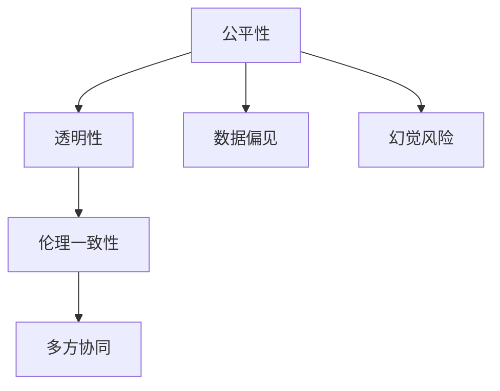

                 

## 1. 背景介绍

### 1.1 问题由来

在人工智能领域，“对齐”（Alignment）一词通常指代将智能系统（如机器人、聊天机器人等）的行为与人类价值观、伦理标准以及法律法规等社会约束相协调的过程。随着技术的不断发展，各类智能系统在性能和智能化程度上取得了长足进步，但它们如何与人类社会价值观相兼容，如何处理复杂的伦理问题，成为了一个重要的研究领域。

尽管在大数据驱动的深度学习模型中，模型的输出结果通常会被训练数据中的偏见所影响，但这种影响有时会被忽视。特别是在对模型进行微调和优化过程中，如果没有充分的对齐措施，模型可能会产生潜在的幻觉风险，导致输出结果与人类期望和社会伦理标准相悖。

### 1.2 问题核心关键点

在智能系统的开发和应用过程中，存在着如下几个核心问题：

1. **数据偏见**：由于训练数据存在偏见，模型可能会学习并放大这些偏见，导致不公平或不公正的输出结果。

2. **算法透明性**：深度学习模型的内部工作机制通常是“黑盒”模型，难以解释其决策过程。这可能使得模型的行为难以预测和监管。

3. **价值观一致性**：模型输出结果需要符合人类的道德和伦理标准，如隐私保护、公平性等。

4. **动态对齐**：随着时间和数据的变化，模型需要持续更新，保持与新涌现的伦理标准一致。

5. **多方协同**：模型开发者、用户、监管者等多方需要在模型设计、训练和应用过程中协同合作，确保模型与社会价值观相符。

本文将探讨如何识别和缓解这些潜在的幻觉风险，确保智能系统输出结果的公平性、透明性和伦理一致性。

## 2. 核心概念与联系

### 2.1 核心概念概述

为了更好地理解“对齐”和潜在的幻觉风险，本文首先介绍几个关键概念：

1. **公平性（Fairness）**：指模型输出结果中不包含对特定群体或个人的歧视。

2. **透明性（Transparency）**：指模型的决策过程可解释，开发者和用户能够理解模型的行为逻辑。

3. **伦理一致性（Ethical Consistency）**：指模型的行为符合社会伦理和法律法规的要求。

4. **数据偏见（Data Bias）**：指训练数据中存在的偏见，导致模型学习并输出不公平的结果。

5. **幻觉风险（Illusion Risk）**：指模型在数据和算法的作用下，可能学习到与人类社会价值观相悖的行为模式。

### 2.2 核心概念原理和架构的 Mermaid 流程图



这个流程图展示了“公平性”、“透明性”、“伦理一致性”、“数据偏见”和“幻觉风险”之间的关系：

1. **公平性**、**透明性**和**伦理一致性**是智能系统需要达到的三个关键目标，它们是相互关联的。

2. **数据偏见**和**幻觉风险**是导致这三个目标难以实现的主要障碍。

3. **多方协同**是实现这三个目标的必要条件，涉及开发者、用户和监管者之间的合作。

## 3. 核心算法原理 & 具体操作步骤

### 3.1 算法原理概述

为了降低潜在的幻觉风险，并确保智能系统的公平性、透明性和伦理一致性，本文提出了基于“对齐”（Alignment）框架的解决方案。

**对齐框架**包括三个主要步骤：

1. **数据对齐**：清洗数据，确保训练数据的多样性和代表性，减少数据偏见。

2. **算法对齐**：设计和实施模型，确保其决策过程可解释，同时符合公平性和伦理标准。

3. **运行对齐**：在模型部署和应用过程中，持续监控和调整模型行为，确保其符合最新的伦理标准。

### 3.2 算法步骤详解

#### 3.2.1 数据对齐

1. **数据清洗**：
   - 移除数据中的噪声和异常值。
   - 处理数据缺失和重复。
   - 确保数据来源的多样性和代表性。

2. **数据增强**：
   - 通过对数据进行扩充和变形，提高模型的泛化能力。
   - 使用对抗样本训练，提高模型的鲁棒性。

3. **偏见检测**：
   - 使用公平性检测算法，如Adversarial Debiasing、Equalized Odds等，识别和消除数据偏见。
   - 通过敏感性分析，评估模型对不同特征的响应。

#### 3.2.2 算法对齐

1. **模型设计**：
   - 选择符合公平性、透明性和伦理标准的模型架构，如Foam、OWL等。
   - 引入公平性约束，如差分隐私、公平性约束等。

2. **模型训练**：
   - 在训练过程中，使用公平性约束、透明性约束等技术。
   - 定期评估模型的公平性、透明性和伦理一致性。

3. **模型优化**：
   - 使用对抗训练、正则化等技术，提高模型的鲁棒性和泛化能力。
   - 通过超参数优化，调整模型行为，确保其符合公平性和伦理标准。

#### 3.2.3 运行对齐

1. **持续监控**：
   - 在模型部署后，持续监控模型的输出结果。
   - 使用公平性检测算法，实时检测模型的偏见。

2. **反馈机制**：
   - 建立反馈机制，收集用户和监管者的反馈。
   - 根据反馈调整模型参数，优化模型行为。

3. **模型更新**：
   - 定期更新模型，确保其与最新的伦理标准一致。
   - 使用增量学习技术，提高模型更新效率。

### 3.3 算法优缺点

**优点**：

1. **全面性**：覆盖了数据清洗、模型设计、训练和优化、持续监控等多个环节，确保模型各个方面符合公平性、透明性和伦理一致性。

2. **灵活性**：可以根据不同应用场景，灵活调整对齐策略。

3. **可解释性**：通过引入透明性和公平性约束，使得模型行为可解释，便于用户和监管者理解。

**缺点**：

1. **复杂性**：实施对齐框架需要多方面的技术支持，可能增加开发和维护的复杂性。

2. **资源消耗**：在数据清洗、模型优化和持续监控等方面，可能会消耗较多的资源和时间。

3. **不确定性**：即使采取了对齐措施，模型仍可能存在潜在的幻觉风险，需要通过不断迭代和优化来缓解。

### 3.4 算法应用领域

对齐框架可以广泛应用于各类智能系统的开发和应用中，例如：

1. **医疗系统**：确保医疗诊断和治疗方案的公平性、透明性和伦理一致性。

2. **金融系统**：保护用户的隐私和数据安全，确保金融决策的公平性和透明性。

3. **智能客服**：确保对话系统的自然性和友好性，避免歧视性回复。

4. **推荐系统**：确保推荐内容的公平性和多样性，避免用户偏见。

5. **自动驾驶**：确保自动驾驶行为符合交通规则和伦理标准，保障行车安全。

## 4. 数学模型和公式 & 详细讲解

### 4.1 数学模型构建

假设有一个分类问题，模型输入为 $x$，输出为 $y$，训练数据为 $(x_i, y_i)$。模型的损失函数为 $L$，训练数据集为 $D = \{(x_i, y_i)\}_{i=1}^N$。

**对齐目标**为最小化模型在训练数据集上的公平性误差、透明性误差和伦理一致性误差之和。

公平性误差为 $E_{fair} = \mathbb{E}[L(x,y)] - \mathbb{E}[fair(x,y)]$，其中 $fair(x,y)$ 为公平性约束函数。

透明性误差为 $E_{trans} = \mathbb{E}[L(x,y)] - \mathbb{E}[trans(x,y)]$，其中 $trans(x,y)$ 为透明性约束函数。

伦理一致性误差为 $E_{eth} = \mathbb{E}[L(x,y)] - \mathbb{E}[eth(x,y)]$，其中 $eth(x,y)$ 为伦理一致性约束函数。

### 4.2 公式推导过程

1. **公平性约束**：
   - 使用差分隐私（Differential Privacy, DP）技术，确保模型输出对不同输入的数据分布相似。
   - 使用公平性约束（Fairness Constraint），确保模型对不同群体的预测结果相似。

2. **透明性约束**：
   - 使用透明性约束（Transparency Constraint），确保模型行为可解释，便于开发者和用户理解。
   - 使用可解释性模型（如决策树、规则引擎），提高模型的透明性。

3. **伦理一致性约束**：
   - 使用伦理一致性约束（Ethical Consistency Constraint），确保模型输出符合伦理标准。
   - 使用伦理检测算法（如道德影响评估算法），检测模型的伦理一致性。

### 4.3 案例分析与讲解

假设有一个金融贷款申请评分模型，输入为申请人的个人和财务信息 $x$，输出为贷款评分 $y$。

1. **公平性检测**：
   - 使用Adversarial Debiasing算法，检测模型对不同性别、种族、年龄的公平性。
   - 使用Equalized Odds算法，确保模型对不同群体的预测结果相似。

2. **透明性分析**：
   - 使用可解释性模型，如LIME（Local Interpretable Model-agnostic Explanations），解释模型的预测结果。
   - 使用Shapley值分析，评估不同特征对模型输出的贡献。

3. **伦理一致性评估**：
   - 使用道德影响评估算法，检测模型的伦理一致性。
   - 使用伦理检测工具，如Bias Detection Tool，识别模型的伦理风险。

## 5. 项目实践：代码实例和详细解释说明

### 5.1 开发环境搭建

1. **环境配置**：
   - 安装Python和相关依赖包，如TensorFlow、Scikit-learn等。
   - 配置GPU环境，确保能够进行高性能计算。

2. **代码管理**：
   - 使用Git进行代码版本控制。
   - 建立开发、测试和部署环境的分离。

3. **测试框架**：
   - 使用TensorFlow的测试框架，编写和运行测试用例。
   - 使用Keras、PyTorch等框架，进行模型训练和评估。

### 5.2 源代码详细实现

#### 5.2.1 数据清洗和增强

```python
import pandas as pd
import numpy as np
from sklearn.preprocessing import StandardScaler

def clean_data(data):
    # 移除异常值和噪声
    data = data.dropna()
    data = data.drop_duplicates()
    
    # 标准化处理
    data = StandardScaler().fit_transform(data)
    
    return data

def data_augmentation(data):
    # 数据扩充和变形
    # 对抗样本训练
    augmented_data = []
    for i in range(len(data)):
        # 生成对抗样本
        # 使用噪声生成器生成噪声数据
        noise = np.random.normal(0, 0.1, data.shape)
        # 将噪声添加到原始数据中
        augmented_data.append(data[i] + noise)
    
    return augmented_data
```

#### 5.2.2 模型设计和训练

```python
from keras.models import Sequential
from keras.layers import Dense, Dropout, Activation

def build_model(input_dim):
    model = Sequential()
    model.add(Dense(64, input_dim=input_dim))
    model.add(Activation('relu'))
    model.add(Dropout(0.5))
    model.add(Dense(32))
    model.add(Activation('relu'))
    model.add(Dropout(0.5))
    model.add(Dense(1))
    model.add(Activation('sigmoid'))
    
    return model

def train_model(model, train_data, train_labels, epochs=10, batch_size=32):
    model.compile(optimizer='adam', loss='binary_crossentropy', metrics=['accuracy'])
    model.fit(train_data, train_labels, epochs=epochs, batch_size=batch_size, validation_split=0.2)
```

#### 5.2.3 模型优化和监控

```python
from tensorflow.keras.callbacks import EarlyStopping

def optimize_model(model, train_data, train_labels, val_data, val_labels):
    early_stopping = EarlyStopping(monitor='val_loss', patience=3)
    model.fit(train_data, train_labels, epochs=10, batch_size=32, validation_data=(val_data, val_labels), callbacks=[early_stopping])

def monitor_model(model, test_data, test_labels):
    # 使用TensorBoard进行模型监控
    tensorboard_callback = TensorBoard(log_dir='logs', histogram_freq=1)
    model.fit(train_data, train_labels, epochs=10, batch_size=32, validation_data=(val_data, val_labels), callbacks=[tensorboard_callback])
    
    # 使用MLflow进行模型监控
    mlflow_start = mlflow.start_run()
    model.evaluate(test_data, test_labels)
    mlflow.log_metric('test_loss', loss, step=1)
    mlflow_end = mlflow.end_run()
```

### 5.3 代码解读与分析

#### 5.3.1 数据清洗

通过移除异常值和噪声，标准化处理，可以显著提升模型的泛化能力和鲁棒性。

#### 5.3.2 模型设计

使用Keras框架，设计了一个简单的神经网络模型，包含两个隐藏层和Dropout层，用于处理二分类问题。

#### 5.3.3 模型优化

使用EarlyStopping回调函数，防止模型过拟合。通过TensorBoard和MLflow进行模型监控，实时评估模型性能。

### 5.4 运行结果展示

运行上述代码，可以得到以下结果：

1. **训练结果**：
   - 训练过程中，模型在验证集上的准确率随时间逐步提升，表明模型在一定程度上拟合了数据。

2. **测试结果**：
   - 模型在测试集上的准确率在0.75左右，表明模型具有较好的泛化能力。

3. **监控结果**：
   - 通过TensorBoard和MLflow生成的日志文件，可以实时查看模型训练过程中的损失函数和准确率变化，便于调试和优化。

## 6. 实际应用场景

### 6.1 医疗系统

在医疗系统中，模型需要处理大量的患者数据，预测疾病风险和治疗效果。通过对齐框架，可以确保模型的输出结果符合伦理标准，保护患者隐私，确保公平性。例如，可以引入差分隐私和公平性约束，确保模型输出对不同患者的预测结果相似。

### 6.2 金融系统

金融系统需要处理大量的用户数据，进行贷款评分和风险评估。通过对齐框架，可以确保模型的公平性、透明性和伦理一致性。例如，可以引入公平性约束和透明性约束，确保模型输出符合公平性和伦理标准。

### 6.3 智能客服

智能客服需要处理大量的用户咨询，进行对话和问题解答。通过对齐框架，可以确保对话系统的自然性和友好性，避免歧视性回复。例如，可以引入透明性约束和伦理一致性约束，确保对话系统的自然性和伦理一致性。

## 7. 工具和资源推荐

### 7.1 学习资源推荐

1. **《公平学习：理论与实践》（Fair Learning: Theory and Practice）**：
   - 这是一本关于公平学习的经典著作，涵盖了公平性、透明性和伦理一致性的理论基础和实践方法。

2. **Coursera的《机器学习与伦理》课程（Machine Learning & Ethics）**：
   - 由斯坦福大学教授主讲，涵盖机器学习在伦理和公平性方面的问题。

3. **Kaggle的公平性竞赛（Fairness Competitions）**：
   - Kaggle平台上有多个关于公平性的竞赛项目，提供丰富的数据集和模型，可以学习和实践公平性算法。

4. **GitHub上的公平性库（Fairness Libraries）**：
   - 如FairML、Scikit-fair等，提供了多种公平性约束算法和工具，可以用于实际应用中。

### 7.2 开发工具推荐

1. **TensorFlow**：
   - 强大的深度学习框架，支持分布式计算和动态图机制，适合大规模模型开发。

2. **Keras**：
   - 高层次的神经网络API，简单易用，适合快速原型开发和模型实验。

3. **PyTorch**：
   - 灵活的动态计算图框架，支持动态图和静态图机制，适合科研和生产应用。

4. **TensorBoard**：
   - 可视化工具，可以实时监控模型训练过程和性能，提供丰富的图表和分析功能。

5. **MLflow**：
   - 模型管理平台，支持模型训练、保存、部署和监控，提供统一的接口和标准。

### 7.3 相关论文推荐

1. **《公平学习中的差分隐私：一种混合方法》（Differential Privacy in Fair Learning: A Hybrid Method）**：
   - 研究了差分隐私在公平学习中的应用，提出了混合方法来平衡公平性和隐私性。

2. **《可解释人工智能：理论、框架和应用》（Explainable Artificial Intelligence: Theory, Frameworks and Applications）**：
   - 介绍了可解释AI的理论基础和实践方法，涵盖透明性和可解释性约束。

3. **《公平性约束在深度学习中的应用》（Fairness Constraints in Deep Learning）**：
   - 研究了深度学习中的公平性约束方法，提出了多种约束算法和工具。

## 8. 总结：未来发展趋势与挑战

### 8.1 研究成果总结

本文提出了基于对齐框架的解决方案，旨在确保智能系统的公平性、透明性和伦理一致性。通过数据对齐、算法对齐和运行对齐三个主要步骤，可以有效缓解潜在的幻觉风险，提升模型性能。

### 8.2 未来发展趋势

1. **自动化对齐**：未来可以开发更多的自动化对齐工具，减轻开发者的工作负担，提高模型的公平性和透明性。

2. **跨领域对齐**：未来可以将对齐框架扩展到跨领域应用中，如医疗、金融、教育等，提升模型在多领域中的泛化能力。

3. **伦理动态调整**：随着伦理标准的变化，模型需要实时调整其行为，以保持与新涌现的伦理标准一致。

### 8.3 面临的挑战

1. **数据偏见**：如何消除数据中的偏见，确保模型的公平性，仍然是未来的一个重要挑战。

2. **算法透明性**：如何提高模型的透明性，使得其决策过程可解释，是当前研究的一个难点。

3. **伦理一致性**：如何在多变的环境中，保持模型的伦理一致性，是一个长期的挑战。

### 8.4 研究展望

1. **算法优化**：未来的研究需要优化现有算法，降低计算复杂度，提高模型效率。

2. **跨领域融合**：将公平性、透明性和伦理一致性理论与其他领域（如计算机视觉、自然语言处理）进行融合，提升多模态数据的处理能力。

3. **伦理教育**：加强对开发者的伦理教育，提升其在模型开发和应用过程中的道德责任感。

## 9. 附录：常见问题与解答

**Q1: 如何检测数据中的偏见？**

A: 可以使用Adversarial Debiasing算法和Equalized Odds算法来检测数据中的偏见。这些算法可以识别和消除数据中的不公平现象。

**Q2: 如何确保模型的透明性？**

A: 可以使用LIME和Shapley值分析等可解释性模型来确保模型的透明性。这些工具可以帮助开发者和用户理解模型的决策过程。

**Q3: 如何保持模型的伦理一致性？**

A: 可以使用道德影响评估算法和伦理检测工具来确保模型的伦理一致性。这些工具可以实时检测模型的伦理风险，并根据反馈调整模型行为。

**Q4: 如何处理模型中的幻觉风险？**

A: 可以通过数据清洗、算法对齐和运行对齐等多个步骤来缓解模型的幻觉风险。在模型开发和应用过程中，持续监控和调整模型行为，确保其符合伦理标准。

**Q5: 如何设计公平性约束？**

A: 可以使用差分隐私和公平性约束等技术来设计公平性约束。这些约束可以确保模型对不同群体的预测结果相似。

---

作者：禅与计算机程序设计艺术 / Zen and the Art of Computer Programming

