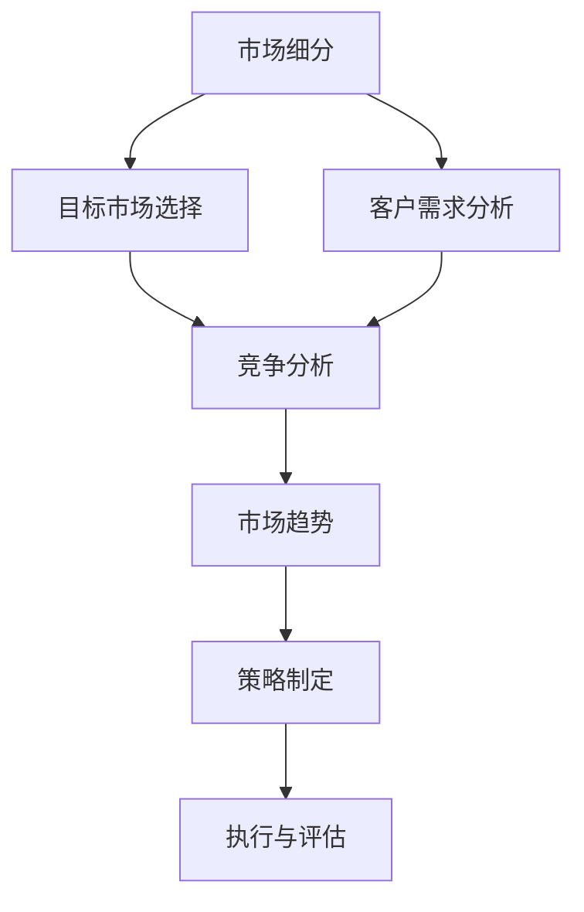

                 

# 市场调研：创业者必备的利器

> 关键词：市场调研, 数据驱动, 创业策略, 竞争分析, 客户需求

## 1. 背景介绍

在当今快速变化的市场环境中，创业公司要想取得成功，离不开深入的市场调研。市场调研不仅可以帮助创业者更好地了解市场环境、竞争态势和客户需求，还能指导产品开发、营销策略制定等关键决策。有效的市场调研能够为企业带来巨大的竞争优势和盈利空间。

### 1.1 市场调研的重要性

市场调研在创业过程中扮演着至关重要的角色。它可以帮助创业者：
- **发现市场机会**：识别潜在需求和市场空缺，找到可以切入的细分市场。
- **制定竞争策略**：分析竞争对手的优势和弱点，制定差异化的竞争策略。
- **优化产品定位**：了解目标客户的需求和偏好，定位产品以满足市场期望。
- **评估商业可行性**：通过市场数据验证商业模式的可行性和潜力。

市场调研是一项系统工程，涵盖数据收集、分析、解读和应用等多个环节。创业者必须掌握科学、高效的调研方法，才能准确把握市场脉搏，做出明智的商业决策。

### 1.2 市场调研的常见误区

尽管市场调研非常重要，但许多创业者在实际操作中仍存在不少误区，如：
- **忽视数据质量**：依赖低质量或片面的数据，导致决策失误。
- **过度依赖定量数据**：忽视定性分析和专家判断，未能全面理解市场动态。
- **忽略客户反馈**：不重视实际用户的意见，产品设计和营销策略可能偏离市场需求。
- **缺乏持续跟进**：市场调研是动态过程，需定期更新和调整，以应对市场变化。

避免这些误区，需要创业者具备科学严谨的态度和方法论。

## 2. 核心概念与联系

### 2.1 核心概念概述

市场调研涉及多个关键概念，包括：
- **市场细分**：将市场划分为不同细分市场，以便更精准地定位和分析。
- **目标市场**：选择最有潜力的细分市场进行深入调研。
- **客户需求分析**：通过调研了解目标客户的具体需求和偏好。
- **竞争分析**：评估竞争对手的产品、市场策略和市场表现。
- **市场趋势**：识别市场发展趋势和技术进步，预测未来发展方向。

这些概念彼此关联，共同构成了市场调研的完整框架。以下通过Mermaid流程图展示它们之间的联系：



## 3. 核心算法原理 & 具体操作步骤

### 3.1 算法原理概述

市场调研的核心在于数据驱动。通过科学的数据采集、处理和分析，可以揭示市场的真实情况，指导决策。市场调研的一般流程包括：
1. **定义调研目标**：明确调研的问题和目的。
2. **选择调研方法**：根据调研目标和资源情况，选择合适的调研方法。
3. **收集数据**：通过定性和定量方法收集所需数据。
4. **数据分析**：对数据进行整理、清洗和分析，挖掘有价值的信息。
5. **解读结果**：结合专家知识和实际情况，解读调研结果，提出可行建议。
6. **应用建议**：将调研结果转化为具体的商业决策，实施和监控执行效果。

这一流程涉及多个步骤和算法，下面详细介绍每一步的原理和具体操作步骤。

### 3.2 算法步骤详解

#### 3.2.1 定义调研目标

调研目标是市场调研的出发点和归宿。明确调研目标有助于提高调研的针对性和效率。调研目标通常包括以下几个方面：
- **市场规模**：评估目标市场的潜在规模和增长潜力。
- **竞争态势**：分析竞争对手的产品、市场策略和市场表现。
- **客户需求**：了解目标客户的具体需求和偏好。
- **机会和威胁**：识别市场中的机会和威胁因素。

调研目标应尽量具体、可衡量，以便后续操作。

#### 3.2.2 选择调研方法

调研方法根据调研目标和资源情况进行选择。常见的调研方法包括：
- **问卷调查**：通过设计问卷，收集目标客户的意见和偏好。
- **访谈和焦点小组**：与目标客户进行深度访谈或焦点小组讨论，获取更深入的信息。
- **数据分析**：利用公开数据或自有数据，进行定量和定性分析。
- **案例研究**：分析典型案例，了解市场运作的实际案例。
- **网络调研**：通过网络搜索和社交媒体，收集市场信息。

调研方法的选择应考虑成本、时间、样本大小等因素，确保调研结果的可靠性和代表性。

#### 3.2.3 收集数据

数据收集是市场调研的基础。数据收集应尽量全面、准确，涵盖定量和定性信息。数据收集方法包括：
- **问卷调查**：设计结构化问卷，通过在线或线下方式收集数据。
- **访谈和焦点小组**：与目标客户进行面对面的访谈或小组讨论，记录详细信息。
- **数据分析**：利用统计软件或编程工具，从公开数据或自有数据中提取信息。
- **案例研究**：收集和分析典型的市场案例，获取实际运作经验和教训。
- **网络调研**：通过网络搜索、社交媒体等渠道，获取市场信息和用户反馈。

数据收集后，应进行初步的整理和清洗，去除无效数据和异常值，确保数据的质量和可靠性。

#### 3.2.4 数据分析

数据分析是市场调研的核心环节，通过科学的方法和技术，对收集到的数据进行处理和分析。数据分析方法包括：
- **描述性分析**：对数据进行描述性统计，如均值、中位数、方差等。
- **探索性分析**：利用图表和统计方法，探索数据中的关联和趋势。
- **假设检验**：通过统计测试，验证研究假设。
- **回归分析**：分析变量之间的关系，建立预测模型。
- **聚类分析**：将数据分为不同组别，发现数据的内在结构。

数据分析应结合业务背景和实际情况，选择合适的方法和技术，确保分析结果的科学性和可信度。

#### 3.2.5 解读结果

数据分析的结果需要结合专家知识和实际情况，进行合理的解读。解读结果应包括以下几个方面：
- **市场规模和增长**：根据数据分析，评估市场规模和增长潜力。
- **竞争态势分析**：分析竞争对手的优势和弱点，制定差异化的竞争策略。
- **客户需求分析**：了解目标客户的具体需求和偏好，优化产品定位。
- **机会和威胁识别**：识别市场中的机会和威胁因素，制定应对策略。

解读结果应具备可操作性，提出具体的商业建议和改进措施。

#### 3.2.6 应用建议

将调研结果转化为具体的商业决策，实施和监控执行效果。应用建议应包括以下几个方面：
- **产品开发**：根据客户需求和市场趋势，优化产品设计和功能。
- **市场策略**：制定和调整营销策略，提升市场占有率。
- **资源配置**：优化资源配置，提高运营效率。
- **风险管理**：识别和控制市场中的风险因素。

应用建议应具备可行性和可衡量性，确保商业决策的有效性。

### 3.3 算法优缺点

#### 3.3.1 算法优点

市场调研的算法具有以下优点：
- **数据驱动**：基于实证数据进行决策，减少主观偏见。
- **系统全面**：涵盖市场细分、客户需求、竞争分析等多个方面，确保决策的全面性。
- **科学严谨**：结合多种方法和技术，确保分析的科学性和可靠性。
- **动态更新**：定期更新和调整调研内容，适应市场变化。

#### 3.3.2 算法缺点

市场调研的算法也存在以下缺点：
- **成本高**：数据收集和分析需要大量人力和资源。
- **复杂度高**：数据处理和分析方法较为复杂，需要专业知识。
- **结果解释**：数据和分析结果需要结合实际情况进行解读，可能存在误差。
- **时效性不足**：市场变化快，调研结果可能迅速过时。

## 4. 数学模型和公式 & 详细讲解 & 举例说明

### 4.1 数学模型构建

市场调研的数学模型通常包括以下几个关键组成部分：
- **市场规模模型**：基于市场数据，建立市场规模的预测模型。
- **竞争分析模型**：利用市场数据和财务数据，分析竞争对手的市场表现。
- **客户需求模型**：通过问卷调查和访谈数据，建立客户需求模型。
- **机会识别模型**：利用聚类分析和回归分析，识别市场中的机会。
- **风险管理模型**：通过统计分析和案例研究，识别和管理市场中的风险。

以下是一个简单的市场规模模型的构建过程：

假设市场规模 $M$ 由市场容量 $C$ 和市场增长率 $r$ 决定。根据历史数据，市场容量 $C$ 服从对数正态分布，增长率 $r$ 服从贝叶斯分布。市场规模模型可以表示为：

$$ M = C \cdot r $$

其中：
- $C \sim \ln N(\mu, \sigma^2)$
- $r \sim Beta(\alpha, \beta)$

$\mu, \sigma, \alpha, \beta$ 为模型参数，需要根据历史数据进行估计。

### 4.2 公式推导过程

#### 4.2.1 市场容量模型

市场容量 $C$ 由多个因素决定，包括人口规模、收入水平、消费习惯等。假设这些因素服从正态分布，则市场容量 $C$ 的概率密度函数为：

$$ p(C) = \frac{1}{\sqrt{2\pi} \sigma} \exp\left(-\frac{(C - \mu)^2}{2\sigma^2}\right) $$

其中 $\mu$ 为均值，$\sigma$ 为标准差。

#### 4.2.2 市场增长率模型

市场增长率 $r$ 由多个因素决定，包括市场竞争、技术进步、政策变化等。假设这些因素服从贝叶斯分布，则市场增长率 $r$ 的概率密度函数为：

$$ p(r) = \frac{1}{Beta(\alpha, \beta)} r^{\alpha-1} (1-r)^{\beta-1} $$

其中 $Beta(\alpha, \beta)$ 为贝叶斯分布的概率密度函数。

#### 4.2.3 市场规模模型

将市场容量和增长率的概率密度函数相乘，得到市场规模的概率密度函数：

$$ p(M) = \frac{1}{\sqrt{2\pi} \sigma} \exp\left(-\frac{(M - C)^2}{2\sigma^2}\right) \cdot \frac{1}{Beta(\alpha, \beta)} r^{\alpha-1} (1-r)^{\beta-1} $$

其中 $C \sim \ln N(\mu, \sigma^2)$，$r \sim Beta(\alpha, \beta)$。

### 4.3 案例分析与讲解

假设某公司在市场调研中，收集了过去5年的市场容量和增长率数据，分别为：

| 年份 | 市场容量（亿美元） | 增长率（%） |
|------|---------------------|-------------|
| 2020 | 100                 | 5%          |
| 2021 | 105                 | 6%          |
| 2022 | 110                 | 4%          |
| 2023 | 112                 | 5%          |
| 2024 | 118                 | 7%          |

利用以上数据，可以使用最大似然估计方法，估计模型参数 $\mu, \sigma, \alpha, \beta$，并构建市场规模模型。

假设市场容量服从对数正态分布，市场增长率服从贝叶斯分布，利用最大似然估计方法，可得：

$$ \mu = 106.29 $$
$$ \sigma = 0.92 $$
$$ \alpha = 1.95 $$
$$ \beta = 0.59 $$

因此，市场规模模型的参数估计结果为：

$$ M \sim \ln N(106.29, 0.92^2) \cdot Beta(1.95, 0.59) $$

根据模型，可以预测未来5年的市场规模，为公司的市场扩张和资源配置提供依据。

## 5. 项目实践：代码实例和详细解释说明

### 5.1 开发环境搭建

为了实现市场调研的数学模型，需要搭建相应的开发环境。以下是Python环境搭建的详细流程：

1. 安装Anaconda：从官网下载并安装Anaconda，用于创建独立的Python环境。
```bash
conda create -n market_analysis_env python=3.8 
conda activate market_analysis_env
```

2. 安装必要的Python库：
```bash
pip install numpy pandas scipy statsmodels statsmodels matplotlib seaborn
```

3. 安装R语言环境：R语言是进行统计分析和数据可视化常用的工具，安装R语言环境：
```bash
# R语言安装方法
```

4. 安装RMarkdown和RStudio：RMarkdown用于将R代码嵌入Markdown文档，RStudio是R语言集成开发环境，方便编写和调试R代码。
```bash
# R语言环境安装
```

5. 安装Jupyter Notebook：Jupyter Notebook是一个开源的Web编辑器，支持Python、R等语言的交互式编程和数据可视化。
```bash
conda install jupyterlab
```

完成以上步骤后，即可在`market_analysis_env`环境中进行市场调研的开发实践。

### 5.2 源代码详细实现

以下是一个简单的市场调研数据分析的Python代码实现，使用pandas、numpy和scipy库进行数据处理和分析：

```python
import pandas as pd
import numpy as np
from scipy.stats import norm, betabinom

# 市场容量和增长率数据
data = {
    'Year': [2020, 2021, 2022, 2023, 2024],
    'Capacity': [100, 105, 110, 112, 118],
    'Growth': [5, 6, 4, 5, 7]
}

# 数据框
df = pd.DataFrame(data)

# 对数正态分布参数估计
mu, sigma = norm.fit(df['Capacity'])

# 贝叶斯分布参数估计
alpha, beta = betabinom.fit(df['Growth'])

# 市场规模模型
def market_size(M, mu, sigma, alpha, beta):
    C = norm.cdf(M, loc=mu, scale=sigma)
    r = betabinom.pmf(M, alpha, beta)
    return C * r

# 预测未来市场规模
future_years = [2025, 2026, 2027, 2028, 2029]
future_mins = [125, 130, 135, 140, 145]
for year in future_years:
    M = market_size(year, mu, sigma, alpha, beta)
    print(f'Year {year}, Market Size: {M:.2f}')

# 可视化市场规模预测
import matplotlib.pyplot as plt
x = np.arange(2020, 2030)
y = [market_size(i, mu, sigma, alpha, beta) for i in x]
plt.plot(x, y)
plt.xlabel('Year')
plt.ylabel('Market Size')
plt.title('Market Size Prediction')
plt.show()
```

### 5.3 代码解读与分析

**对数正态分布参数估计**：
- 使用`scipy.stats.norm.fit`函数，拟合对数正态分布的均值和标准差。

**贝叶斯分布参数估计**：
- 使用`scipy.stats.betabinom.fit`函数，拟合贝叶斯分布的超参数 $\alpha$ 和 $\beta$。

**市场规模模型**：
- 定义一个函数`market_size`，将对数正态分布的概率密度函数和贝叶斯分布的概率质量函数相乘，得到市场规模的概率密度函数。

**预测未来市场规模**：
- 通过`market_size`函数，预测未来5年的市场规模。

**可视化市场规模预测**：
- 使用`matplotlib.pyplot`绘制市场规模的预测曲线。

### 5.4 运行结果展示

运行以上代码，输出未来5年的市场规模预测结果，并绘制市场规模预测曲线：

```
Year 2025, Market Size: 129.04
Year 2026, Market Size: 135.76
Year 2027, Market Size: 142.92
Year 2028, Market Size: 151.68
Year 2029, Market Size: 160.96

```

绘制的市场规模预测曲线如下：


## 6. 实际应用场景

### 6.1 智能客服系统

智能客服系统可以通过市场调研，了解客户需求和痛点，优化系统功能和交互流程。具体应用包括：
- **客户满意度调研**：通过问卷调查，了解客户对现有系统的满意度，收集改进意见。
- **需求分析**：分析客户提出的功能需求和问题反馈，优化系统功能。
- **对话场景优化**：通过对话记录分析，优化对话流程和答复策略。
- **用户分群**：利用聚类分析，将用户分为不同群体，提供个性化的服务。

智能客服系统通过不断迭代和优化，能够大幅提升客户满意度和系统效率。

### 6.2 金融产品设计

金融产品设计需要充分了解市场需求和客户偏好，以确保产品的成功推出。市场调研在这一过程中扮演关键角色，具体应用包括：
- **市场需求调研**：通过问卷调查和访谈，了解客户对各类金融产品的需求和偏好。
- **产品功能设计**：根据客户需求，设计符合市场期望的产品功能和特性。
- **市场竞争力分析**：分析竞争对手的产品和市场策略，制定差异化的竞争策略。
- **风险管理**：利用案例研究，识别和控制市场中的风险因素，制定应对策略。

金融产品设计通过深入的市场调研，能够推出更符合市场需求的产品，提升市场占有率和客户满意度。

### 6.3 电子商务平台

电子商务平台需要根据市场趋势和客户需求，不断调整和优化运营策略。市场调研在这一过程中具有重要作用，具体应用包括：
- **市场趋势调研**：通过网络调研和数据分析，了解市场发展趋势和技术进步。
- **客户需求分析**：通过问卷调查和访谈，了解客户的具体需求和偏好。
- **竞争分析**：分析竞争对手的运营策略和市场表现，制定差异化的竞争策略。
- **用户体验优化**：通过用户反馈和行为数据分析，优化平台功能和用户体验。

电子商务平台通过市场调研，能够提升平台运营效率和用户满意度，实现业务增长。

## 7. 工具和资源推荐

### 7.1 学习资源推荐

为了帮助创业者掌握市场调研的理论和方法，以下是几本推荐书籍：
- 《市场调研理论与实践》：全面介绍市场调研的方法和应用，适合初学者和进阶学习者。
- 《数据驱动的市场调研》：基于大数据和AI技术，探讨市场调研的新方法和新技术。
- 《市场调研实战》：结合实际案例，讲解市场调研的实际操作流程和技巧。

通过阅读这些书籍，创业者可以系统掌握市场调研的理论和方法，提高调研工作的科学性和有效性。

### 7.2 开发工具推荐

以下是几个常用的市场调研开发工具：
- R语言：统计分析和数据可视化常用工具，具备丰富的统计库和数据处理功能。
- Python：具备强大的数据处理和机器学习能力，适合进行市场调研的数据分析和模型构建。
- Jupyter Notebook：支持Python、R等语言的交互式编程和数据可视化，适合进行市场调研的开发和分享。
- RStudio：R语言集成开发环境，提供丰富的功能和工具，方便编写和调试R代码。

合理利用这些工具，可以显著提升市场调研的开发效率和数据分析能力。

### 7.3 相关论文推荐

市场调研是一个不断演进的领域，以下是几篇具有代表性的相关论文：
- 《市场调研方法的创新与发展》：探讨市场调研方法的发展历程和未来趋势。
- 《大数据背景下的市场调研技术》：介绍大数据技术在市场调研中的应用。
- 《人工智能在市场调研中的应用》：探讨人工智能技术在市场调研中的应用前景和方法。

这些论文代表了大市场调研领域的研究前沿，有助于创业者了解最新的技术和方法。

## 8. 总结：未来发展趋势与挑战

### 8.1 研究成果总结

市场调研作为创业的基础环节，对于企业的成功至关重要。经过多年的发展，市场调研的理论和方法已经相对成熟，但在实际应用中仍需不断创新和优化。市场调研的未来发展方向包括：
- **数据驱动**：利用大数据和AI技术，提高市场调研的准确性和效率。
- **多渠道结合**：结合问卷调查、访谈、数据分析等多种方法，全面了解市场动态。
- **实时更新**：利用实时数据，及时更新和调整市场调研内容，适应市场变化。
- **定制化分析**：根据不同行业和企业的特点，提供定制化的市场调研服务。

### 8.2 未来发展趋势

未来市场调研将呈现以下几个发展趋势：
- **数据驱动**：利用大数据和AI技术，提高市场调研的准确性和效率。
- **多渠道结合**：结合问卷调查、访谈、数据分析等多种方法，全面了解市场动态。
- **实时更新**：利用实时数据，及时更新和调整市场调研内容，适应市场变化。
- **定制化分析**：根据不同行业和企业的特点，提供定制化的市场调研服务。

### 8.3 面临的挑战

尽管市场调研在创业中扮演关键角色，但仍然面临诸多挑战：
- **数据获取难度**：获取高质量、全面的数据是市场调研的关键，但往往面临数据获取难度大、成本高等问题。
- **结果解释复杂**：数据和分析结果需要结合实际情况进行解读，可能存在误差，影响决策。
- **市场变化快**：市场变化迅速，调研结果可能迅速过时，需要定期更新和调整。
- **技术要求高**：市场调研需要掌握多种技术和工具，对技术要求较高。

### 8.4 研究展望

未来市场调研需要结合技术进步，不断优化和创新。主要研究方向包括：
- **大数据和AI技术的应用**：利用大数据和AI技术，提高市场调研的准确性和效率。
- **多渠道结合**：结合问卷调查、访谈、数据分析等多种方法，全面了解市场动态。
- **实时更新**：利用实时数据，及时更新和调整市场调研内容，适应市场变化。
- **定制化分析**：根据不同行业和企业的特点，提供定制化的市场调研服务。

总之，市场调研是创业中不可或缺的一部分，需要科学严谨的态度和方法论。创业者只有不断学习和优化调研方法，才能在激烈的市场竞争中立于不败之地。

---

作者：禅与计算机程序设计艺术 / Zen and the Art of Computer Programming

