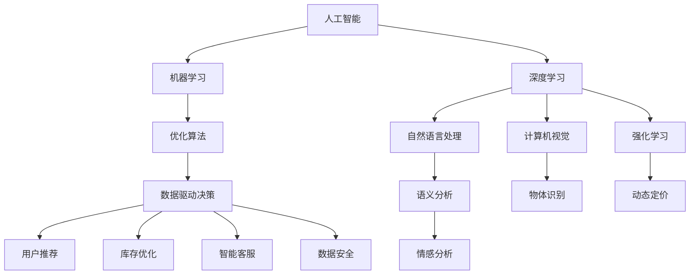

                 

## 1. 背景介绍

### 1.1 问题由来

在过去十年间，人工智能(AI)技术已经从概念走向了实际应用，其核心应用领域之一就是电子商务。电商平台通过引入AI技术，以提升用户体验、优化库存管理、强化个性化推荐等。然而，电商市场瞬息万变，消费者需求多样，市场竞争愈加激烈，如何通过AI手段精准把握市场趋势，调整策略，成为电商平台亟需解决的问题。

### 1.2 问题核心关键点

AI在电商平台的应用，通常聚焦于以下核心关键点：

- 用户行为分析：通过AI模型分析用户行为数据，挖掘用户需求，预测用户购买意图。
- 库存优化：利用AI预测销量，优化库存管理，减少库存积压或缺货情况。
- 个性化推荐：通过AI技术实现个性化推荐，提升转化率，增加客户黏性。
- 聊天机器人：使用AI构建智能客服，提高客户服务效率。
- 图像识别：通过AI图像识别技术，提升产品质量检测与分类。

这些核心应用点，直接影响了电商平台的运营效率和用户体验，成为企业决策的依据。

### 1.3 问题研究意义

研究AI在电商平台市场趋势分析中的应用，对于提升电商平台智能化水平，优化运营策略，增加收入增长具有重要意义：

1. **提升用户体验**：通过AI个性化推荐和智能客服，提升客户满意度，增强用户粘性。
2. **优化库存管理**：通过预测模型减少库存积压，提升资金周转率，降低运营成本。
3. **增加销售转化**：利用AI模型分析用户行为，精准推送产品，提高点击率和购买转化率。
4. **提高市场竞争力**：及时调整市场策略，把握用户需求，抢占市场先机。
5. **保障数据安全**：通过AI手段监控数据异常，防止数据泄露和欺诈。

## 2. 核心概念与联系

### 2.1 核心概念概述

要深入理解AI在电商平台的应用，首先需要了解相关的核心概念：

- **人工智能(AI)**：通过算法和模型，使计算机系统具备类人智能，包括感知、学习、推理等功能。
- **机器学习(ML)**：使计算机从数据中学习，通过算法优化模型参数，实现数据驱动决策。
- **深度学习(DL)**：一种特殊类型的机器学习，利用多层神经网络模拟人类大脑处理信息的过程。
- **自然语言处理(NLP)**：使计算机理解、处理和生成人类语言。
- **计算机视觉(CV)**：使计算机理解和分析视觉图像，如识别商品图片。
- **强化学习(RL)**：使机器通过交互学习最优策略，适用于电商平台的动态定价、库存管理等场景。

这些核心概念之间相互关联，形成了AI在电商平台的整个技术栈。

### 2.2 核心概念原理和架构的 Mermaid 流程图



以上流程图示意了AI技术在电商平台各个环节的应用：从底层数据处理到用户行为分析，再到推荐系统构建，最后到优化库存和智能客服，每一个环节都离不开AI技术。

## 3. 核心算法原理 & 具体操作步骤

### 3.1 算法原理概述

AI在电商平台的市场趋势分析，通常基于机器学习模型。其核心原理是通过分析历史数据，建立预测模型，预测未来的市场趋势。这涉及到以下几个步骤：

1. **数据收集**：从电商平台收集历史销售数据、用户行为数据、市场竞争数据等。
2. **数据预处理**：清洗、格式化数据，去除异常值，保证数据质量。
3. **特征工程**：提取、选择、构造特征，建立数据与市场趋势之间的映射关系。
4. **模型训练**：选择合适的模型，利用历史数据训练模型。
5. **模型验证**：在验证集上评估模型性能，调整模型参数。
6. **模型应用**：利用训练好的模型对新数据进行预测，分析市场趋势。

### 3.2 算法步骤详解

AI在电商平台市场趋势分析的具体操作步骤如下：

1. **数据收集与处理**：
   - 从电商平台的订单系统、网站访问记录、用户行为日志、社交媒体等渠道收集数据。
   - 清洗数据，去除噪音和重复值，确保数据的准确性和完整性。
   - 将数据转换为机器学习模型可接受的格式，如CSV、JSON等。

2. **特征工程**：
   - 选择与市场趋势预测相关的特征，如用户点击率、购买历史、价格变化、季节性因素等。
   - 构造新的特征，如时间窗口滑动、交叉特征等。
   - 应用特征选择方法，如递归特征消除(RFE)、Lasso回归等，优化特征集合。

3. **模型训练**：
   - 选择适合的市场趋势预测模型，如线性回归、随机森林、梯度提升树、神经网络等。
   - 利用历史数据对模型进行训练，调整模型参数。
   - 使用交叉验证技术，评估模型性能，防止过拟合。

4. **模型验证与调优**：
   - 在验证集上评估模型预测性能，计算误差指标如均方误差(MSE)、均方根误差(RMSE)、平均绝对误差(MAE)等。
   - 根据评估结果调整模型参数，提高模型泛化能力。
   - 可采用网格搜索、随机搜索、贝叶斯优化等方法，寻找最优参数组合。

5. **模型应用与监控**：
   - 将训练好的模型应用到新数据上，进行市场趋势预测。
   - 实时监控模型预测结果，检测异常和偏差。
   - 定期重新训练模型，保证预测结果的准确性和时效性。

### 3.3 算法优缺点

AI在电商平台市场趋势分析中具有以下优点：

- **预测准确性**：通过机器学习模型，可以捕捉复杂的数据关系，预测市场趋势。
- **实时性**：利用流式处理技术，可以实时更新预测模型，快速响应市场变化。
- **可解释性**：模型训练过程可解释，便于理解预测结果的逻辑依据。
- **自动化**：模型训练、验证、调优过程自动化，减少人工干预。

同时，AI市场趋势分析也存在一些缺点：

- **数据依赖性**：模型性能高度依赖于数据质量和特征工程。
- **计算成本**：模型训练和实时更新需要大量计算资源。
- **模型复杂性**：复杂模型可能存在过拟合风险，且难以解释。
- **应用场景局限性**：不同领域和产品线可能需要定制模型，通用性有限。

### 3.4 算法应用领域

AI在电商平台市场趋势分析主要应用于以下几个领域：

- **用户行为预测**：预测用户点击、浏览、购买行为，优化广告投放策略。
- **库存管理优化**：预测商品销售趋势，优化库存水平，减少库存成本。
- **价格动态调整**：根据市场变化，实时调整商品价格，提升销售利润。
- **供应链管理**：预测供应链需求，优化物流和仓储安排。
- **客户流失预测**：预测客户流失风险，采取针对性措施，提升客户忠诚度。

## 4. 数学模型和公式 & 详细讲解 & 举例说明

### 4.1 数学模型构建

市场趋势预测的数学模型通常包括以下几个关键组成部分：

- **输入特征**：如时间、商品价格、用户购买历史等。
- **输出目标**：预测未来的销售趋势。
- **模型结构**：如线性回归、随机森林、神经网络等。

### 4.2 公式推导过程

以线性回归模型为例，其基本公式如下：

$$
y = \beta_0 + \beta_1x_1 + \beta_2x_2 + ... + \beta_nx_n + \epsilon
$$

其中，$y$ 为预测的销售趋势，$\beta_i$ 为特征的系数，$x_i$ 为输入特征，$\epsilon$ 为随机误差。

利用最小二乘法，求解模型参数：

$$
\hat{\beta} = (X^TX)^{-1}X^Ty
$$

其中，$X$ 为特征矩阵，$y$ 为输出向量。

通过训练数据 $(x_i, y_i)$，不断迭代求解 $\hat{\beta}$，直至收敛。

### 4.3 案例分析与讲解

假设某电商平台收集到过去一年的商品销售数据，包括商品价格、促销活动、季节性因素等。利用这些数据，构建线性回归模型，预测未来的销售趋势。步骤如下：

1. **数据准备**：
   - 收集商品销售数据，如商品ID、销售日期、销售量等。
   - 提取时间、价格、促销活动等特征，构建特征矩阵 $X$。
   - 将销售量作为输出向量 $y$。

2. **模型训练**：
   - 将数据分为训练集和测试集。
   - 利用训练集数据 $(x_i, y_i)$，构建模型并训练。
   - 求解参数 $\hat{\beta}$，计算训练误差和测试误差。

3. **模型评估与调优**：
   - 利用测试集数据 $(x_i, y_i)$，评估模型预测性能。
   - 根据误差指标，选择最优模型参数，优化模型结构。
   - 可采用正则化、特征选择等方法，防止过拟合。

4. **预测应用**：
   - 将模型应用于新数据 $x_i$，进行销售趋势预测。
   - 实时监控预测结果，及时调整市场策略。

## 5. 项目实践：代码实例和详细解释说明

### 5.1 开发环境搭建

在进行市场趋势预测实践前，我们需要准备好开发环境。以下是使用Python进行TensorFlow开发的环境配置流程：

1. 安装Anaconda：从官网下载并安装Anaconda，用于创建独立的Python环境。

2. 创建并激活虚拟环境：
```bash
conda create -n tf-env python=3.8 
conda activate tf-env
```

3. 安装TensorFlow：根据CUDA版本，从官网获取对应的安装命令。例如：
```bash
conda install tensorflow tensorflow-estimator tensorflow-probability cudatoolkit=11.1 -c tf -c conda-forge
```

4. 安装相关库：
```bash
pip install pandas numpy sklearn joblib dask
```

5. 安装TensorBoard：用于模型训练和推理过程中的可视化。
```bash
pip install tensorboard
```

完成上述步骤后，即可在`tf-env`环境中开始市场趋势预测的实践。

### 5.2 源代码详细实现

下面以线性回归模型为例，给出使用TensorFlow进行市场趋势预测的代码实现。

```python
import tensorflow as tf
import pandas as pd
from sklearn.model_selection import train_test_split
from sklearn.preprocessing import MinMaxScaler

# 加载数据
data = pd.read_csv('sales_data.csv')

# 特征工程
features = data[['price', 'season', 'promotion', 'temp']]
labels = data['sales']
scaler = MinMaxScaler(feature_range=(0, 1))
scaled_features = scaler.fit_transform(features)

# 划分训练集和测试集
X_train, X_test, y_train, y_test = train_test_split(scaled_features, labels, test_size=0.2, random_state=42)

# 定义模型
model = tf.keras.models.Sequential([
    tf.keras.layers.Dense(units=32, activation='relu', input_shape=(4,)),
    tf.keras.layers.Dense(units=1)
])

# 编译模型
model.compile(optimizer=tf.keras.optimizers.Adam(learning_rate=0.001),
              loss='mean_squared_error',
              metrics=['mean_absolute_error'])

# 训练模型
model.fit(X_train, y_train, epochs=100, batch_size=32, validation_data=(X_test, y_test))

# 评估模型
mse, mae = model.evaluate(X_test, y_test)

# 打印评估结果
print(f'Mean Squared Error: {mse:.2f}')
print(f'Mean Absolute Error: {mae:.2f}')

# 预测应用
new_data = pd.read_csv('new_data.csv')
new_scaled = scaler.transform(new_data)
predictions = model.predict(new_scaled)
print(predictions)
```

这段代码实现了从数据加载、特征工程、模型训练到预测应用的全过程。通过TensorFlow，我们可以轻松地构建、训练、评估和应用市场趋势预测模型。

### 5.3 代码解读与分析

让我们再详细解读一下关键代码的实现细节：

- **数据加载**：通过Pandas库读取数据，进行初步清洗。
- **特征工程**：利用MinMaxScaler对特征进行归一化处理，以便于模型训练。
- **模型构建**：使用Sequential模型，定义输入层和输出层。
- **模型编译**：设置优化器、损失函数、评估指标等，准备模型训练。
- **模型训练**：利用fit函数训练模型，设置训练轮数、批次大小等参数。
- **模型评估**：通过evaluate函数评估模型性能，计算MSE和MAE。
- **预测应用**：将新数据进行归一化，输入模型进行预测。

这些关键步骤展示了TensorFlow进行市场趋势预测的全流程。在实际应用中，我们还需要对代码进行优化，如引入TensorBoard进行可视化监控、增加正则化技术防止过拟合、采用梯度累积等技巧提升训练效率。

## 6. 实际应用场景

### 6.1 智能推荐系统

电商平台利用AI进行市场趋势分析，最重要的应用场景之一是智能推荐系统。通过分析用户历史行为和市场数据，推荐系统会动态调整推荐算法，提升用户体验。

具体实现如下：

1. **数据收集**：收集用户点击记录、浏览记录、购买历史等数据。
2. **特征工程**：提取用户兴趣特征、商品特征、时间特征等。
3. **模型训练**：利用历史数据训练推荐模型，优化模型参数。
4. **模型应用**：实时推荐用户感兴趣的商品，提升点击率和购买转化率。

### 6.2 库存优化管理

库存优化是电商平台市场趋势分析的另一个重要应用场景。通过AI预测销售趋势，优化库存管理，减少库存积压和缺货情况。

具体实现如下：

1. **数据收集**：收集历史销售数据、库存数据、促销活动数据等。
2. **特征工程**：提取商品销售趋势、季节性因素、促销活动等特征。
3. **模型训练**：利用历史数据训练销售预测模型，优化库存水平。
4. **库存优化**：根据预测结果，动态调整库存，确保库存水平合理。

### 6.3 价格动态调整

价格动态调整是市场趋势分析的重要应用之一。通过AI实时监控市场变化，调整商品价格，提升销售利润。

具体实现如下：

1. **数据收集**：收集历史价格数据、市场竞争数据、用户反馈数据等。
2. **特征工程**：提取商品价格、促销活动、季节性因素等特征。
3. **模型训练**：利用历史数据训练价格预测模型，优化定价策略。
4. **价格调整**：根据预测结果，动态调整商品价格，提升销售收入。

## 7. 工具和资源推荐

### 7.1 学习资源推荐

为了帮助开发者系统掌握AI在电商平台的应用，这里推荐一些优质的学习资源：

1. **《TensorFlow实战机器学习》书籍**：深入浅出地介绍了TensorFlow的基本原理和应用案例，适合入门学习。
2. **《深度学习入门》课程**：由斯坦福大学开设，涵盖深度学习的基础知识和实践技巧。
3. **TensorFlow官方文档**：提供了详细的API文档和示例代码，是学习TensorFlow的重要参考资料。
4. **Kaggle竞赛**：通过参加Kaggle的机器学习竞赛，实战练习市场趋势预测技术。
5. **机器学习在线课程**：如Coursera、Udacity等平台提供的深度学习课程，系统学习AI相关知识。

通过对这些资源的学习实践，相信你一定能够快速掌握AI在电商平台的应用技巧，并用于解决实际的业务问题。

### 7.2 开发工具推荐

高效的开发离不开优秀的工具支持。以下是几款用于AI在电商平台应用开发的常用工具：

1. **TensorFlow**：由Google主导开发的深度学习框架，功能强大，生态完善。
2. **Keras**：基于TensorFlow的高级API，简化模型构建和训练过程。
3. **Pandas**：数据分析和处理库，支持大规模数据处理和分析。
4. **TensorBoard**：用于模型训练和推理过程中的可视化工具。
5. **Anaconda**：Python环境管理工具，支持虚拟环境管理。
6. **Jupyter Notebook**：交互式数据科学工作环境，方便数据处理和模型训练。

合理利用这些工具，可以显著提升AI在电商平台应用开发的效率，加快创新迭代的步伐。

### 7.3 相关论文推荐

AI在电商平台的应用研究得到了学界的持续关注。以下是几篇奠基性的相关论文，推荐阅读：

1. **《电商平台数据挖掘与机器学习》**：介绍了电商平台中数据挖掘和机器学习的多种应用，如用户推荐、库存优化、价格调整等。
2. **《利用深度学习进行市场趋势预测》**：探讨了利用深度学习模型进行市场趋势预测的方法，并给出了具体实现步骤。
3. **《强化学习在电商平台中的应用》**：研究了强化学习在电商平台中的动态定价、库存管理等应用。

这些论文代表了大语言模型微调技术的发展脉络。通过学习这些前沿成果，可以帮助研究者把握学科前进方向，激发更多的创新灵感。

## 8. 总结：未来发展趋势与挑战

### 8.1 总结

本文对AI在电商平台的应用进行了全面系统的介绍。首先阐述了AI在电商平台的应用背景和意义，明确了AI技术在电商市场趋势分析中的核心价值。其次，从原理到实践，详细讲解了市场趋势预测的数学原理和关键步骤，给出了具体代码实现。同时，本文还广泛探讨了AI在电商平台的市场趋势分析在智能推荐、库存管理、价格动态调整等多个领域的应用前景，展示了AI技术的广泛适用性。最后，本文精选了市场趋势预测技术的各类学习资源，力求为读者提供全方位的技术指引。

通过本文的系统梳理，可以看到，AI在电商平台的应用已经初具规模，从市场趋势预测到智能推荐，再到库存优化和价格动态调整，每一环节都离不开AI技术的支撑。未来，伴随AI技术的持续演进，电商平台将进一步智能化，为用户带来更优质的购物体验。

### 8.2 未来发展趋势

展望未来，AI在电商平台的应用将呈现以下几个发展趋势：

1. **深度学习模型的不断发展**：深度学习模型的精度和泛化能力不断提升，将推动AI在电商平台的应用更加精准和普适。
2. **实时处理能力的增强**：利用流式处理和分布式计算技术，实现实时数据处理和市场趋势预测，提升服务效率。
3. **个性化推荐的深化**：通过用户行为分析，实现更精准的用户个性化推荐，提升用户满意度和黏性。
4. **多模态数据的融合**：结合文本、图像、音频等多模态数据，提升市场趋势预测的准确性和可靠性。
5. **AI与业务融合的加强**：AI技术与电商业务深度融合，推动业务流程自动化和智能化。
6. **智能客服的普及**：通过智能客服，提升客户服务效率，降低运营成本。

这些趋势凸显了AI在电商平台应用的广阔前景。这些方向的探索发展，必将进一步提升电商平台的智能化水平，为消费者带来更好的购物体验。

### 8.3 面临的挑战

尽管AI在电商平台的应用已经取得显著进展，但在迈向更加智能化、普适化应用的过程中，仍面临诸多挑战：

1. **数据隐私和安全**：电商平台需要处理大量用户隐私数据，数据安全和隐私保护成为重要问题。如何确保用户数据的安全，防止数据泄露和滥用，是未来需要解决的首要问题。
2. **模型复杂性和可解释性**：复杂的AI模型难以解释，用户和业务人员难以理解模型决策逻辑。如何提高AI模型的可解释性，是未来需要解决的重要问题。
3. **实时处理性能**：AI模型在实时处理大规模数据时，性能和效率有待提高。如何提升AI模型在实时场景下的处理性能，是未来需要解决的重要问题。
4. **模型泛化能力**：AI模型在不同市场和业务场景中，泛化能力有待提升。如何提高AI模型在不同环境中的适应性，是未来需要解决的重要问题。
5. **跨领域知识融合**：AI模型需要与业务领域知识相结合，才能更好地服务于电商业务。如何构建跨领域知识融合的AI模型，是未来需要解决的重要问题。
6. **自动化和决策支持**：AI模型需要结合自动化和决策支持系统，才能更好地服务于电商业务。如何构建自动化和决策支持的AI系统，是未来需要解决的重要问题。

这些挑战需要学界和产业界共同努力，不断创新和改进，才能使AI技术在电商平台中发挥更大价值。

### 8.4 研究展望

面对AI在电商平台应用面临的挑战，未来的研究需要在以下几个方面寻求新的突破：

1. **跨领域知识融合**：将电商业务领域的知识与AI技术相结合，构建跨领域知识融合的AI模型。
2. **自动化和决策支持**：构建自动化和决策支持的AI系统，提高电商业务的智能化水平。
3. **模型可解释性**：提高AI模型的可解释性，使模型决策过程透明化，增强用户信任。
4. **数据隐私和安全**：在AI应用中加强数据隐私和安全保护，确保用户数据的安全。
5. **实时处理性能**：提升AI模型在实时场景下的处理性能，支持电商平台的实时决策。
6. **模型泛化能力**：提高AI模型在不同环境中的适应性，支持电商平台的跨市场推广。

这些研究方向将推动AI技术在电商平台中的深度应用，提升电商业务的智能化水平，带来更多商业价值和社会效益。

## 9. 附录：常见问题与解答

**Q1：电商平台如何收集用户数据？**

A: 电商平台通常通过用户在网站和APP上的行为数据，如浏览记录、点击记录、购买记录等，来收集用户数据。此外，还可以通过社交媒体、第三方数据合作等渠道获取用户数据。

**Q2：如何进行特征工程？**

A: 特征工程是构建预测模型的关键步骤，主要包括以下几个步骤：

1. **特征选择**：选择与目标变量相关的特征，如用户点击率、购买历史等。
2. **特征构造**：构造新的特征，如时间窗口滑动、交叉特征等。
3. **特征缩放**：对特征进行归一化或标准化，如MinMaxScaler、StandardScaler等。
4. **特征处理**：处理缺失值、异常值等，保证数据质量。

**Q3：如何评估市场趋势预测模型的性能？**

A: 市场趋势预测模型的性能评估通常通过以下指标进行：

1. **均方误差(MSE)**：衡量预测值与真实值之间的平均偏差。
2. **均方根误差(RMSE)**：MSE的平方根，衡量预测值与真实值之间的平均绝对偏差。
3. **平均绝对误差(MAE)**：衡量预测值与真实值之间的平均绝对偏差。
4. **R^2分数**：衡量预测值与真实值之间的相关性，值越接近1，表示模型预测越准确。

在实际应用中，通常结合多个指标进行评估，以确保模型预测的准确性和可靠性。

**Q4：如何构建智能推荐系统？**

A: 智能推荐系统的构建主要包括以下几个步骤：

1. **数据收集**：收集用户历史行为数据、商品数据、用户画像等。
2. **特征工程**：提取用户兴趣特征、商品特征、时间特征等。
3. **模型选择**：选择合适的推荐算法，如协同过滤、内容推荐等。
4. **模型训练**：利用历史数据训练推荐模型，优化模型参数。
5. **模型应用**：实时推荐用户感兴趣的商品，提升点击率和购买转化率。

智能推荐系统的关键在于对用户行为数据的深度挖掘和分析，构建高质量的推荐模型。

---

作者：禅与计算机程序设计艺术 / Zen and the Art of Computer Programming

