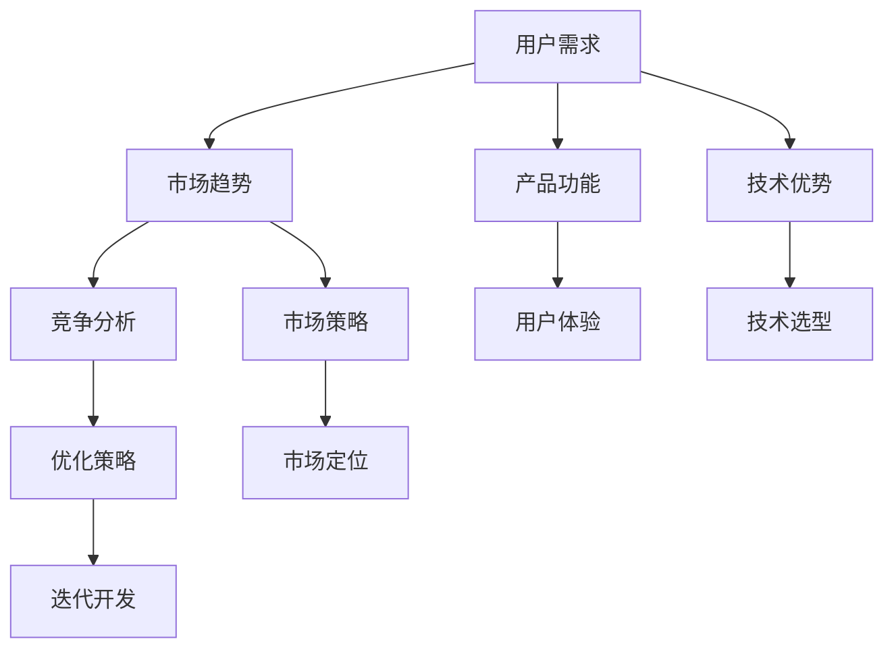

                 

# 市场需求：创业者的航标

## 1. 背景介绍

### 1.1 问题由来

在当今快速变化的市场环境中，创业者面临着前所未有的挑战。传统的商业模式和市场策略正逐渐被数字化、网络化、智能化的大趋势所取代，技术创新成为推动企业发展的核心驱动力。对于创业者而言，理解和把握市场需求，不仅有助于把握商业机会，还能有效规避风险，提升产品竞争力。

技术需求分析在市场分析中扮演着至关重要的角色。它不仅能够帮助创业者理解目标用户的行为、偏好和需求，还能引导产品设计和功能开发，确保产品能真正满足市场需求，从而实现商业价值最大化。

### 1.2 问题核心关键点

本文将从技术需求分析的多个维度进行探讨，包括但不限于用户需求、市场趋势、技术优势、竞争分析等。通过深入剖析市场需求，旨在为创业者提供实用的指导，帮助他们更好地制定市场策略，把握商业机遇。

## 2. 核心概念与联系

### 2.1 核心概念概述

在进行技术需求分析时，我们需要理解几个关键概念及其相互关系：

- **用户需求 (User Demand)**：指用户在使用产品或服务时遇到的问题、期望和需求。
- **市场趋势 (Market Trends)**：指市场环境和消费者行为的变化趋势，如新兴技术、消费者偏好、行业发展方向等。
- **技术优势 (Technological Advantage)**：指产品或服务相对于竞争对手在技术实现、创新性、用户体验等方面的优势。
- **竞争分析 (Competitive Analysis)**：指对市场中主要竞争者的产品或服务进行评估和比较，识别自身的竞争优势和不足。

这些概念之间的联系可以通过以下Mermaid流程图来展示：



这个流程图展示了这个过程的逻辑关系：

1. 用户需求驱动市场趋势的识别。
2. 市场趋势指导技术优势的实现。
3. 竞争分析提供改进优化策略。
4. 产品功能和用户体验的迭代优化。
5. 市场策略和产品功能共同决定市场定位。
6. 技术优势的实现需要技术选型。
7. 优化策略的实施需要迭代开发。

## 3. 核心算法原理 & 具体操作步骤

### 3.1 算法原理概述

技术需求分析的算法原理基于数据的收集、处理和分析，通过数据驱动的方法，识别和评估用户需求、市场趋势和技术优势。其核心思想是通过数据分析，发现用户痛点和市场机会，并据此进行产品设计和优化。

### 3.2 算法步骤详解

技术需求分析的算法步骤包括：

**Step 1: 数据收集与预处理**
- 从用户反馈、市场报告、社交媒体、竞争分析等多个渠道收集数据。
- 对数据进行清洗、去重和标准化处理，保证数据质量。

**Step 2: 数据分析与洞察**
- 使用统计分析、机器学习、自然语言处理等技术，对数据进行深入分析。
- 通过可视化工具（如Tableau、Power BI等）展现数据洞察。

**Step 3: 需求与趋势识别**
- 基于用户行为和反馈，识别用户需求和痛点。
- 分析市场趋势，识别新兴技术、行业发展方向等。

**Step 4: 技术优势评估**
- 评估产品或服务的技术实现、创新性、用户体验等方面。
- 比较与主要竞争对手的技术优势。

**Step 5: 竞争分析**
- 对主要竞争者的产品或服务进行评估和比较，识别自身的竞争优势和不足。

**Step 6: 优化策略制定**
- 基于需求、趋势和技术优势，制定产品优化策略。
- 设计产品功能和用户体验的迭代路径。

**Step 7: 迭代开发与测试**
- 实施优化策略，进行产品功能的迭代开发。
- 进行用户测试和市场反馈收集，进行产品优化。

### 3.3 算法优缺点

技术需求分析的优点包括：

- **数据驱动**：通过数据分析，能够客观、全面地识别用户需求和技术趋势。
- **市场导向**：基于市场趋势和竞争分析，能够制定更有竞争力的市场策略。
- **迭代优化**：通过持续的优化和迭代，不断提升产品体验和功能。

缺点包括：

- **数据依赖**：数据质量、完整性和准确性直接影响分析结果。
- **技术门槛**：需要一定的技术背景和工具使用能力。
- **成本高**：数据收集、分析和处理需要投入大量的人力和物力。

### 3.4 算法应用领域

技术需求分析在多个领域都有广泛应用，如：

- **软件开发**：识别用户需求，优化产品功能和用户体验。
- **市场营销**：基于市场趋势，制定精准的市场策略。
- **产品设计**：评估技术优势，进行产品的迭代设计和优化。
- **企业决策**：通过数据分析，辅助高层决策，制定企业战略。

## 4. 数学模型和公式 & 详细讲解 & 举例说明

### 4.1 数学模型构建

技术需求分析的数学模型构建主要包括以下几个步骤：

1. **数据收集与预处理**：定义数据收集模型，进行数据清洗和标准化处理。
2. **数据分析与洞察**：构建数据分析模型，使用统计学方法和机器学习算法。
3. **需求与趋势识别**：建立用户需求模型，识别痛点和趋势。
4. **技术优势评估**：构建技术评估模型，评估创新性和用户体验。
5. **竞争分析**：构建竞争分析模型，识别竞争优势。

### 4.2 公式推导过程

以下以用户需求模型为例，推导需求识别公式：

设用户需求数据集为 $D=\{(x_i,y_i)\}_{i=1}^N$，其中 $x_i$ 为需求描述，$y_i$ 为需求分类。使用支持向量机(SVM)进行分类，构建需求识别模型：

$$
\min_{\theta} \frac{1}{2} ||\theta||^2 + C\sum_{i=1}^N \text{hinge}(y_i,\theta^Tx_i)
$$

其中，$\theta$ 为分类超平面参数，$||\theta||^2$ 为正则化项，$C$ 为正则化系数，$\text{hinge}(y_i,\theta^Tx_i)$ 为分类损失函数。

通过求解上述优化问题，可以训练出一个用户需求分类模型。

### 4.3 案例分析与讲解

以某社交媒体平台的用户需求分析为例：

**数据收集与预处理**：
- 从社交媒体平台收集用户反馈和评论数据，去除噪声和重复信息。
- 使用自然语言处理技术，将文本数据转换为向量形式。

**数据分析与洞察**：
- 使用文本挖掘技术，识别用户关注的热门话题和问题。
- 使用情感分析模型，评估用户对不同功能的情感倾向。

**需求与趋势识别**：
- 使用分类模型识别用户需求，并将其归类为不同类别（如功能改进、用户体验优化等）。
- 基于用户反馈，识别市场趋势，如用户对新功能的期望。

**技术优势评估**：
- 评估平台技术实现（如算法性能、用户界面等）的优势和不足。
- 比较与竞争对手的平台，识别技术差异。

**竞争分析**：
- 收集竞争对手平台的数据，进行功能和用户体验的比较。
- 识别竞争对手的竞争优势和不足。

**优化策略制定**：
- 基于用户需求和市场趋势，制定功能和用户体验的优化策略。
- 设计产品迭代的路径和时间表。

**迭代开发与测试**：
- 实施优化策略，进行产品功能的迭代开发。
- 进行用户测试和市场反馈收集，进行产品优化。

## 5. 项目实践：代码实例和详细解释说明

### 5.1 开发环境搭建

在进行技术需求分析的项目实践前，我们需要准备好开发环境。以下是使用Python进行数据分析的环境配置流程：

1. 安装Anaconda：从官网下载并安装Anaconda，用于创建独立的Python环境。
2. 创建并激活虚拟环境：
```bash
conda create -n demand-analyze python=3.8 
conda activate demand-analyze
```

3. 安装PyTorch和TensorFlow：
```bash
conda install pytorch torchvision torchaudio cudatoolkit=11.1 -c pytorch -c conda-forge
conda install tensorflow
```

4. 安装Pandas、NumPy、Matplotlib、Scikit-learn、TensorBoard等工具包：
```bash
pip install pandas numpy matplotlib scikit-learn tensorflow tb-nightly
```

5. 安装数据分析相关的库：
```bash
pip install seaborn elasticsearch nlp libraries-of-finance pyarrow
```

完成上述步骤后，即可在`demand-analyze`环境中进行数据分析的实践。

### 5.2 源代码详细实现

以下是一个简单的Python代码实例，展示了如何使用Pandas和TensorFlow进行用户需求分析：

```python
import pandas as pd
import tensorflow as tf
from sklearn.model_selection import train_test_split
from tensorflow.keras.layers import Dense, Dropout, Embedding, Input, LSTM, BidirectionalLSTM, concatenate
from tensorflow.keras.models import Model
from tensorflow.keras.preprocessing import sequence
from sklearn.preprocessing import LabelEncoder

# 数据加载和预处理
data = pd.read_csv('user_feedback.csv')
data['text'] = data['feedback'].apply(lambda x: x.lower())
data['label'] = LabelEncoder().fit_transform(data['category'])

# 数据分割
train_data, test_data = train_test_split(data, test_size=0.2, random_state=42)

# 构建模型
input_text = Input(shape=(MAX_SEQ_LEN,), dtype='int32')
x = Embedding(VOCAB_SIZE, EMBEDDING_DIM, input_length=MAX_SEQ_LEN)(input_text)
x = BidirectionalLSTM(128, dropout=0.2, recurrent_dropout=0.2)(x)
x = Dense(64, activation='relu', dropout=0.2)(x)
output = Dense(NUM_CLASSES, activation='softmax')(x)
model = Model(input_text, output)

# 模型编译和训练
model.compile(optimizer='adam', loss='categorical_crossentropy', metrics=['accuracy'])
model.fit(X_train, Y_train, batch_size=BATCH_SIZE, epochs=NUM_EPOCHS, validation_data=(X_test, Y_test))

# 模型评估
loss, accuracy = model.evaluate(X_test, Y_test, verbose=0)
print('Test accuracy:', accuracy)
```

### 5.3 代码解读与分析

**数据加载和预处理**：
- 使用Pandas加载用户反馈数据，并进行简单的文本预处理，如转换为小写字母。
- 使用LabelEncoder将分类标签进行编码，便于模型处理。

**模型构建**：
- 使用Embedding层将文本数据转换为向量形式。
- 使用双向LSTM层进行序列建模，并通过Dropout层进行正则化。
- 使用Dense层进行特征提取和分类。
- 使用softmax激活函数进行多分类输出。

**模型编译和训练**：
- 使用Adam优化器和交叉熵损失函数进行模型编译。
- 在训练集上使用模型fit方法进行训练，同时使用validation_data进行模型验证。

**模型评估**：
- 在测试集上使用evaluate方法进行模型评估，并输出模型精度。

通过上述代码，我们可以实现一个简单的用户需求分类模型，并通过训练和评估，识别用户需求和优化策略。

## 6. 实际应用场景

### 6.1 智能推荐系统

技术需求分析在智能推荐系统中的应用极为广泛。通过分析用户的行为数据和反馈信息，可以识别用户的兴趣和需求，从而提供个性化的推荐内容。

在实践中，可以收集用户的历史浏览记录、购买记录、评分数据等，使用聚类和分类算法进行需求分析。识别出用户的兴趣群组，并将其映射到相应的产品或服务。通过持续的优化和迭代，不断提升推荐系统的准确性和用户体验。

### 6.2 智能客服

技术需求分析在智能客服中的应用同样重要。通过分析用户的历史查询记录和反馈信息，可以识别用户的需求和痛点，从而优化智能客服系统的响应策略。

在实践中，可以收集用户的历史查询数据和反馈信息，使用自然语言处理技术进行文本分析。识别出用户的问题类型和优先级，并根据这些信息调整客服策略，如增加对高频问题的解答、优化客服响应速度等。通过持续的优化和迭代，不断提升智能客服系统的响应准确性和用户体验。

### 6.3 智能广告

技术需求分析在智能广告中的应用也非常重要。通过分析用户的行为数据和反馈信息，可以识别用户的兴趣和需求，从而进行精准的广告投放。

在实践中，可以收集用户的历史行为数据和反馈信息，使用聚类和分类算法进行需求分析。识别出用户的兴趣群组，并将其映射到相应的广告投放策略。通过持续的优化和迭代，不断提升广告投放的精准性和效果。

### 6.4 未来应用展望

随着技术需求分析的不断发展和完善，未来的应用前景将更加广阔：

1. **个性化营销**：通过更深入的需求分析，实现更加精准的个性化营销，提升用户满意度和转化率。
2. **智能制造**：通过技术需求分析，优化生产流程和设备使用，提升生产效率和产品质量。
3. **智慧医疗**：通过分析患者的健康数据和需求，提供个性化的医疗服务，提升医疗效果和患者体验。
4. **智能交通**：通过分析交通流量和需求，优化交通路线和运营策略，提升交通效率和安全性。

## 7. 工具和资源推荐

### 7.1 学习资源推荐

为了帮助开发者系统掌握技术需求分析的理论基础和实践技巧，这里推荐一些优质的学习资源：

1. **《数据科学基础》系列书籍**：由统计学专家撰写，深入浅出地介绍了数据收集、数据分析和数据可视化的基本概念和经典方法。
2. **Coursera《数据分析与可视化》课程**：由斯坦福大学开设的在线课程，涵盖了数据清洗、数据探索、数据可视化等多个方面，是数据分析学习的优质资源。
3. **Kaggle数据科学竞赛平台**：提供丰富的数据集和案例，通过参与竞赛项目，可以实践和提升自己的数据分析技能。
4. **Python数据科学社区**：汇集了大量数据分析和机器学习的教程、资源和社区交流，是学习和分享的重要平台。

通过对这些资源的学习实践，相信你一定能够快速掌握技术需求分析的精髓，并用于解决实际的商业问题。

### 7.2 开发工具推荐

高效的开发离不开优秀的工具支持。以下是几款用于技术需求分析开发的常用工具：

1. **Jupyter Notebook**：用于编写和分享数据分析代码的协作平台，支持Python、R等多种语言，是数据分析项目开发的常用工具。
2. **Tableau**：可视化数据分析工具，能够快速生成图表和报表，帮助理解数据分析结果。
3. **Power BI**：微软推出的数据分析和可视化平台，支持多种数据源，易于使用和部署。
4. **Kaggle**：提供丰富的数据集和竞赛平台，方便数据收集和数据分析实践。
5. **TensorFlow**：由Google主导开发的深度学习框架，支持分布式计算和模型部署，适合大数据分析。

合理利用这些工具，可以显著提升技术需求分析的开发效率，加快创新迭代的步伐。

### 7.3 相关论文推荐

技术需求分析的发展得益于学界的持续研究。以下是几篇奠基性的相关论文，推荐阅读：

1. **《数据挖掘：概念与技术》**：全面介绍了数据挖掘的基本概念和常用方法，是数据分析学习的经典教材。
2. **《机器学习实战》**：由机器学习专家撰写，通过实践项目演示了机器学习算法的应用。
3. **《数据可视化：原理、技术和应用》**：介绍了数据可视化的基本原理和常用工具，帮助理解数据分析结果。
4. **《Python数据科学手册》**：详细介绍了Python在数据分析和机器学习中的应用，是数据分析学习的优秀参考。

这些论文代表了大数据分析技术的发展脉络。通过学习这些前沿成果，可以帮助研究者把握学科前进方向，激发更多的创新灵感。

## 8. 总结：未来发展趋势与挑战

### 8.1 总结

本文对技术需求分析的多个维度进行了全面系统的介绍。首先阐述了技术需求分析的现状和意义，明确了其对于市场分析和产品开发的价值。其次，从原理到实践，详细讲解了技术需求分析的数学模型和操作步骤，给出了技术需求分析的完整代码实例。同时，本文还探讨了技术需求分析在多个领域的应用，展示了其广泛的应用前景。

通过本文的系统梳理，可以看到，技术需求分析对于市场分析和产品开发具有重要作用。通过数据驱动的方法，能够客观、全面地识别用户需求和技术趋势，制定有竞争力的市场策略，优化产品功能和用户体验，从而实现商业价值最大化。未来，随着技术需求分析的不断发展，必将为创业者提供更强大的市场分析工具，推动技术创新和商业模式的变革。

### 8.2 未来发展趋势

展望未来，技术需求分析的发展趋势如下：

1. **大数据分析**：随着数据量的不断增长，大数据技术的应用将更加广泛。通过对海量数据的深度分析和挖掘，可以发现更多的市场机会和用户需求。
2. **人工智能技术**：人工智能技术的进步将进一步提升数据分析的效率和准确性。通过自然语言处理、计算机视觉等技术，可以实现更深入的用户需求分析和产品优化。
3. **云计算平台**：云计算平台的普及将提供更高效的数据处理和存储能力，降低技术需求分析的资源成本。
4. **多模态分析**：通过结合文本、图像、视频等多种数据源，进行多模态分析，可以更全面地理解用户需求和市场趋势。
5. **实时分析**：随着实时数据采集和处理技术的进步，技术需求分析将变得更加实时和动态，能够及时响应市场变化和用户需求。

### 8.3 面临的挑战

尽管技术需求分析已经取得了一定进展，但在迈向更加智能化、普适化应用的过程中，仍然面临诸多挑战：

1. **数据隐私和安全**：随着数据采集和分析的深入，用户隐私和安全问题成为重要关注点。如何保护用户数据，防止数据泄露和滥用，是亟待解决的难题。
2. **数据质量和噪声**：数据的质量和噪声直接影响分析结果，特别是在数据采集和清洗过程中，需要投入大量的人力和物力。
3. **技术门槛**：技术需求分析需要一定的技术背景和工具使用能力，对于非专业人士来说，存在一定的学习曲线。
4. **市场变化快速**：市场环境和用户需求变化快速，如何快速适应市场变化，及时调整产品策略，是技术需求分析的难点。
5. **资源成本高**：数据收集、分析和处理需要投入大量的人力和物力，资源成本较高。

### 8.4 研究展望

面对技术需求分析面临的挑战，未来的研究需要在以下几个方面寻求新的突破：

1. **数据隐私保护**：研究如何在保护用户隐私的前提下进行数据分析，开发更加安全的分析工具和算法。
2. **数据质量提升**：研究如何提高数据采集和清洗的自动化水平，降低人工干预和资源成本。
3. **易用性提升**：研究如何降低技术需求分析的技术门槛，使其更加易于使用和推广。
4. **动态分析**：研究如何构建动态分析模型，及时响应市场变化和用户需求。
5. **多模态融合**：研究如何将多种数据源进行融合分析，提升分析的全面性和深度。

这些研究方向的探索，必将引领技术需求分析技术迈向更高的台阶，为创业者提供更强大的市场分析工具，推动技术创新和商业模式的变革。

## 9. 附录：常见问题与解答

**Q1：技术需求分析是否适用于所有行业？**

A: 技术需求分析在多个行业都有广泛应用，包括但不限于软件开发、市场营销、产品设计、企业决策等。不同行业的具体应用场景和需求分析方法可能会有所不同，但基本思路是一致的。

**Q2：技术需求分析的难点和挑战是什么？**

A: 技术需求分析的难点和挑战主要包括以下几点：
1. 数据隐私和安全：如何保护用户数据，防止数据泄露和滥用。
2. 数据质量和噪声：数据的质量和噪声直接影响分析结果，特别是在数据采集和清洗过程中，需要投入大量的人力和物力。
3. 技术门槛：技术需求分析需要一定的技术背景和工具使用能力，对于非专业人士来说，存在一定的学习曲线。
4. 市场变化快速：市场环境和用户需求变化快速，如何快速适应市场变化，及时调整产品策略，是技术需求分析的难点。
5. 资源成本高：数据收集、分析和处理需要投入大量的人力和物力，资源成本较高。

**Q3：技术需求分析的未来发展方向是什么？**

A: 技术需求分析的未来发展方向主要包括：
1. 大数据分析：随着数据量的不断增长，大数据技术的应用将更加广泛。通过对海量数据的深度分析和挖掘，可以发现更多的市场机会和用户需求。
2. 人工智能技术：人工智能技术的进步将进一步提升数据分析的效率和准确性。通过自然语言处理、计算机视觉等技术，可以实现更深入的用户需求分析和产品优化。
3. 云计算平台：云计算平台的普及将提供更高效的数据处理和存储能力，降低技术需求分析的资源成本。
4. 多模态分析：通过结合文本、图像、视频等多种数据源，进行多模态分析，可以更全面地理解用户需求和市场趋势。
5. 实时分析：随着实时数据采集和处理技术的进步，技术需求分析将变得更加实时和动态，能够及时响应市场变化和用户需求。

**Q4：技术需求分析的具体步骤和方法有哪些？**

A: 技术需求分析的具体步骤和方法包括：
1. 数据收集与预处理：从多个渠道收集数据，并进行清洗、去重和标准化处理。
2. 数据分析与洞察：使用统计分析、机器学习、自然语言处理等技术，对数据进行深入分析，发现用户需求和市场趋势。
3. 需求与趋势识别：基于用户行为和反馈，识别用户需求和痛点，识别市场趋势和新兴技术。
4. 技术优势评估：评估产品或服务的技术实现、创新性、用户体验等方面。
5. 竞争分析：对主要竞争者的产品或服务进行评估和比较，识别自身的竞争优势和不足。
6. 优化策略制定：基于需求、趋势和技术优势，制定产品优化策略，设计产品迭代的路径和时间表。
7. 迭代开发与测试：实施优化策略，进行产品功能的迭代开发，进行用户测试和市场反馈收集，进行产品优化。

**Q5：技术需求分析的主要工具和资源有哪些？**

A: 技术需求分析的主要工具和资源包括：
1. Python数据科学社区：提供丰富的数据分析和机器学习的教程、资源和社区交流。
2. Jupyter Notebook：用于编写和分享数据分析代码的协作平台，支持Python、R等多种语言。
3. Tableau：可视化数据分析工具，能够快速生成图表和报表。
4. Power BI：微软推出的数据分析和可视化平台，支持多种数据源。
5. Kaggle：提供丰富的数据集和竞赛平台，方便数据收集和数据分析实践。

通过对这些资源的学习实践，相信你一定能够快速掌握技术需求分析的精髓，并用于解决实际的商业问题。

---

作者：禅与计算机程序设计艺术 / Zen and the Art of Computer Programming

