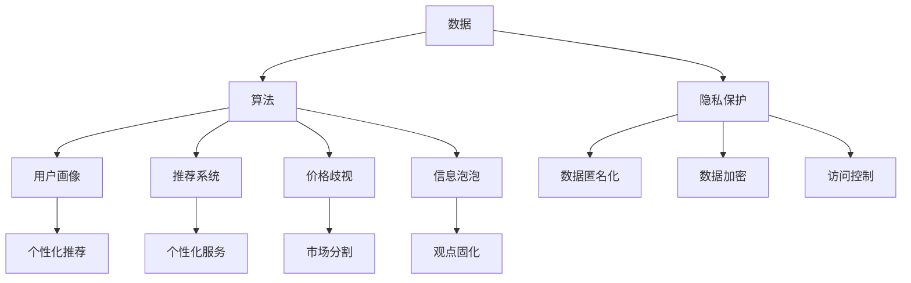

                 

# 平台算法的三个原则：个体被操控的真相

## 1. 背景介绍

在数字化浪潮席卷全球的今天，算法已经成为了平台经济的核心驱动力。无论是社交网络、电商平台、视频平台，还是金融服务、医疗健康、交通物流，算法都在默默驱动着数据流动的方向和速率，影响着用户行为和市场走势。然而，随着平台算法的应用日益广泛，其带来的个体操控问题也逐渐引发了社会各界的关注。

### 1.1 问题由来

首先，需要明确的是，算法并非是单独存在的实体，它背后往往隐含着数据、算法、政策、利益等多重因素的交织。在平台经济中，算法通过数据挖掘、用户画像、内容推荐、价格调整等方式，对个体行为进行预测和干预。一方面，算法可以帮助平台提高运营效率、增强用户体验、创造更多价值；另一方面，当算法过度依赖个体数据，并缺乏透明度、可解释性时，就可能被用于操控和误导用户，甚至造成隐私泄露、市场垄断等负面后果。

近年来，社交媒体中的“信息泡泡”、电商平台的“价格歧视”、视频平台中的“内容过滤”等现象，无不反映出算法对个体操控的潜在风险。如何在算法与个体之间找到平衡，成为平台经济发展的关键课题。

### 1.2 问题核心关键点

为了更好地理解平台算法的操控问题，本文将探讨以下核心关键点：

1. 算法的权力来源与运作机制。
2. 平台算法操控个体的方式与手段。
3. 个体在算法操控下的行为与心理影响。
4. 应对算法操控的策略与方法。

通过深入分析这些关键点，本文旨在揭示平台算法的操控真相，并提出构建透明、公正、可信平台环境的建议。

## 2. 核心概念与联系

### 2.1 核心概念概述

为更好地理解平台算法操控的原理，本节将介绍几个密切相关的核心概念：

1. **算法（Algorithms）**：指用于解决特定问题的计算方法或步骤，广泛应用于信息检索、推荐系统、网络优化等领域。

2. **数据（Data）**：指算法处理的对象，包括结构化数据（如数据库）、半结构化数据（如XML）、非结构化数据（如文本、图片、音频）等。

3. **用户画像（User Profiles）**：指平台通过收集和分析用户行为数据，构建出用户兴趣、需求、行为习惯等维度的综合描述。

4. **推荐系统（Recommendation Systems）**：指基于用户画像和行为数据，推荐用户可能感兴趣的产品、内容、服务等的系统。

5. **价格歧视（Price Discrimination）**：指平台根据用户画像和行为数据，对不同用户群体制定不同价格的策略。

6. **信息泡泡（Echo Chambers）**：指平台通过算法推荐相似内容，使得用户只能接触到与自己观点一致的信息，形成的信息茧房。

7. **隐私保护（Privacy Protection）**：指在数据处理过程中，保护用户隐私不被泄露的措施。

这些核心概念之间的逻辑关系可以通过以下Mermaid流程图来展示：



这个流程图展示了大数据、算法与平台操控之间的关系：

1. 平台通过收集和处理用户数据（A→B→C），构建用户画像。
2. 基于用户画像，平台设计推荐系统（B→D→H），提供个性化服务（B→I）。
3. 同时，平台也可能利用算法进行价格歧视（B→E→J），并可能导致信息泡泡（B→F→K）。
4. 在数据处理过程中，隐私保护（A→G）是必要的，包括数据匿名化（G→L）、数据加密（G→M）和访问控制（G→N）等措施。

## 3. 核心算法原理 & 具体操作步骤
### 3.1 算法原理概述

平台算法的核心原理是数据驱动的预测和优化，即通过大量历史数据的分析，预测用户行为和需求，并据此优化系统表现。其关键步骤包括数据收集、特征提取、模型训练和结果反馈四个环节。

1. **数据收集**：平台通过各种手段（如APP、网站、智能设备）收集用户行为数据，包括点击、浏览、购买、评分等。
2. **特征提取**：对收集到的原始数据进行清洗和处理，提取有用的特征，用于构建用户画像和推荐模型。
3. **模型训练**：基于提取的特征和历史数据，训练出推荐模型，预测用户行为和需求。
4. **结果反馈**：将推荐结果呈现给用户，根据用户反馈调整模型参数，进一步优化推荐效果。

### 3.2 算法步骤详解

以下详细介绍平台算法操控个体的详细步骤：

**Step 1: 数据收集与特征提取**

- **数据收集**：使用API接口、Web爬虫等方式，收集用户的历史行为数据。
- **特征提取**：通过文本分析、图像识别、时间序列分析等技术，从原始数据中提取出有意义的用户特征，如浏览历史、购买偏好、地理位置等。

**Step 2: 用户画像构建**

- **用户画像**：将用户特征组合成多维度的综合描述，如兴趣标签、行为模式、社交关系等。
- **画像维护**：定期更新用户画像，以反映最新的用户行为和偏好。

**Step 3: 推荐模型训练**

- **模型选择**：根据推荐任务选择合适的模型，如协同过滤、深度学习、混合模型等。
- **模型训练**：使用用户画像和行为数据训练推荐模型，优化模型参数。
- **验证与调整**：在验证集上评估模型性能，调整模型参数和特征提取策略。

**Step 4: 个性化推荐**

- **推荐算法**：根据用户画像和实时行为，使用推荐算法生成个性化推荐。
- **实时反馈**：根据用户对推荐结果的反馈，动态调整推荐策略。

**Step 5: 数据隐私保护**

- **数据匿名化**：在数据处理过程中，去除用户标识性信息，防止个人信息泄露。
- **数据加密**：对传输和存储过程中的数据进行加密处理，保障数据安全。
- **访问控制**：设置数据访问权限，确保只有授权人员才能访问敏感数据。

### 3.3 算法优缺点

平台算法在提升用户体验和运营效率的同时，也存在以下优缺点：

**优点**：

- **高效精准**：通过数据分析和模型优化，算法能够快速响应用户需求，提供高质量的个性化服务。
- **成本降低**：自动化数据处理和算法优化，减少了人工干预，降低了运营成本。
- **业务扩展**：基于数据的智能决策，加速了业务模式的创新和扩展。

**缺点**：

- **隐私风险**：算法需要大量的用户数据，可能带来隐私泄露风险。
- **数据偏差**：如果数据不平衡或存在偏见，算法可能产生不公平的结果。
- **操控风险**：算法通过预测和优化，可能对用户行为进行过度干预，甚至误导用户。
- **算法透明性不足**：算法决策过程复杂，缺乏透明度和可解释性，难以让用户理解和信任。

### 3.4 算法应用领域

平台算法广泛应用于多个领域，例如：

1. **社交媒体**：通过推荐算法，推送用户可能感兴趣的内容，提高平台粘性。
2. **电子商务**：根据用户行为数据，推荐商品和服务，提升销售转化率。
3. **视频平台**：根据用户观看历史，推荐相关视频，增加用户观看时间。
4. **金融服务**：利用用户画像和行为数据，进行风险评估和信用评分。
5. **交通物流**：基于用户位置和出行习惯，优化路线和配送时间。
6. **健康医疗**：通过分析用户健康数据，提供个性化的健康建议和干预方案。

这些应用领域涵盖了日常生活的方方面面，平台算法通过精准推荐和高效决策，极大地提升了用户体验和平台价值。

## 4. 数学模型和公式 & 详细讲解  
### 4.1 数学模型构建

本节将使用数学语言对平台算法操控个体的过程进行更加严格的刻画。

设平台用户集为 $U$，行为数据集为 $D=\{(x_i,y_i)\}_{i=1}^N$，其中 $x_i$ 为行为数据，$y_i$ 为行为标签。平台通过算法 $A$ 预测用户行为，并根据预测结果进行个性化推荐。

定义平台推荐模型为 $F: \mathcal{X} \rightarrow \mathcal{Y}$，其中 $\mathcal{X}$ 为行为数据空间，$\mathcal{Y}$ 为推荐结果空间。平台通过历史数据 $D$ 训练模型 $F$，优化参数 $\theta$，使得模型在验证集 $D_v$ 上的预测准确率最大化。即：

$$
\theta^* = \mathop{\arg\min}_{\theta} \frac{1}{N}\sum_{i=1}^N (y_i - F(x_i; \theta))^2
$$

在实践中，我们通常使用梯度下降等优化算法来近似求解上述最优化问题。设 $\eta$ 为学习率，$\lambda$ 为正则化系数，则参数的更新公式为：

$$
\theta \leftarrow \theta - \eta \nabla_{\theta}\mathcal{L}(\theta) - \eta\lambda\theta
$$

其中 $\nabla_{\theta}\mathcal{L}(\theta)$ 为损失函数对参数 $\theta$ 的梯度，可通过反向传播算法高效计算。

### 4.2 公式推导过程

以下我们以协同过滤推荐系统为例，推导协同过滤模型的数学模型及其梯度计算公式。

协同过滤推荐系统基于用户-物品评分矩阵 $R_{ui}$，通过计算用户 $u$ 对物品 $i$ 的兴趣程度 $P_{ui}$ 进行推荐。设用户 $u$ 的评分向量为 $r_u = (r_{ui})_{i=1}^{n}$，物品 $i$ 的评分向量为 $r_i = (r_{iu})_{u=1}^{m}$，则协同过滤模型可表示为：

$$
P_{ui} = \frac{\sum_{j=1}^m r_{uj} r_{ij}}{\sqrt{\sum_{j=1}^m r_{uj}^2 \cdot \sum_{i=1}^n r_{ij}^2}}
$$

其中，分子为物品 $i$ 和用户 $j$ 的协同相似度，分母为两者的相似度归一化因子。

设推荐模型损失函数为均方误差损失，则损失函数为：

$$
\mathcal{L}(\theta) = \frac{1}{N}\sum_{i=1}^N \sum_{j=1}^m (y_{ij} - P_{ij}(F(r_{ij}; \theta)))^2
$$

其中 $y_{ij}$ 为实际评分，$P_{ij}$ 为推荐模型的预测评分。

根据链式法则，损失函数对参数 $\theta$ 的梯度为：

$$
\frac{\partial \mathcal{L}(\theta)}{\partial \theta} = -\frac{2}{N}\sum_{i=1}^N \sum_{j=1}^m (y_{ij} - P_{ij}(F(r_{ij}; \theta)))(y_{ij} - P_{ij}) \frac{\partial P_{ij}}{\partial r_{ij}} \frac{\partial r_{ij}}{\partial \theta}
$$

其中 $\frac{\partial P_{ij}}{\partial r_{ij}}$ 可进一步递归展开，利用自动微分技术完成计算。

在得到损失函数的梯度后，即可带入参数更新公式，完成模型的迭代优化。重复上述过程直至收敛，最终得到适应个性化推荐的最优模型参数 $\theta^*$。

## 5. 项目实践：代码实例和详细解释说明
### 5.1 开发环境搭建

在进行平台算法实践前，我们需要准备好开发环境。以下是使用Python进行PyTorch开发的环境配置流程：

1. 安装Anaconda：从官网下载并安装Anaconda，用于创建独立的Python环境。

2. 创建并激活虚拟环境：
```bash
conda create -n pytorch-env python=3.8 
conda activate pytorch-env
```

3. 安装PyTorch：根据CUDA版本，从官网获取对应的安装命令。例如：
```bash
conda install pytorch torchvision torchaudio cudatoolkit=11.1 -c pytorch -c conda-forge
```

4. 安装Transformers库：
```bash
pip install transformers
```

5. 安装各类工具包：
```bash
pip install numpy pandas scikit-learn matplotlib tqdm jupyter notebook ipython
```

完成上述步骤后，即可在`pytorch-env`环境中开始平台算法实践。

### 5.2 源代码详细实现

下面我们以协同过滤推荐系统为例，给出使用Transformers库对BERT模型进行微调的PyTorch代码实现。

首先，定义推荐任务的数据处理函数：

```python
from transformers import BertTokenizer
from torch.utils.data import Dataset
import torch

class RecommendationDataset(Dataset):
    def __init__(self, ratings, tokenizer, max_len=128):
        self.ratings = ratings
        self.tokenizer = tokenizer
        self.max_len = max_len
        
    def __len__(self):
        return len(self.ratings)
    
    def __getitem__(self, item):
        rating = self.ratings[item]
        
        # 将评分转换为二元表示
        rating[0] = 1 if rating[0] > 0 else 0
        
        encoding = self.tokenizer(rating, return_tensors='pt', max_length=self.max_len, padding='max_length', truncation=True)
        input_ids = encoding['input_ids'][0]
        attention_mask = encoding['attention_mask'][0]
        
        return {'input_ids': input_ids, 
                'attention_mask': attention_mask,
                'labels': rating}
```

然后，定义模型和优化器：

```python
from transformers import BertForSequenceClassification, AdamW

model = BertForSequenceClassification.from_pretrained('bert-base-cased', num_labels=2)

optimizer = AdamW(model.parameters(), lr=2e-5)
```

接着，定义训练和评估函数：

```python
from torch.utils.data import DataLoader
from tqdm import tqdm
from sklearn.metrics import accuracy_score

device = torch.device('cuda') if torch.cuda.is_available() else torch.device('cpu')
model.to(device)

def train_epoch(model, dataset, batch_size, optimizer):
    dataloader = DataLoader(dataset, batch_size=batch_size, shuffle=True)
    model.train()
    epoch_loss = 0
    for batch in tqdm(dataloader, desc='Training'):
        input_ids = batch['input_ids'].to(device)
        attention_mask = batch['attention_mask'].to(device)
        labels = batch['labels'].to(device)
        model.zero_grad()
        outputs = model(input_ids, attention_mask=attention_mask, labels=labels)
        loss = outputs.loss
        epoch_loss += loss.item()
        loss.backward()
        optimizer.step()
    return epoch_loss / len(dataloader)

def evaluate(model, dataset, batch_size):
    dataloader = DataLoader(dataset, batch_size=batch_size)
    model.eval()
    preds, labels = [], []
    with torch.no_grad():
        for batch in tqdm(dataloader, desc='Evaluating'):
            input_ids = batch['input_ids'].to(device)
            attention_mask = batch['attention_mask'].to(device)
            batch_labels = batch['labels']
            outputs = model(input_ids, attention_mask=attention_mask)
            batch_preds = outputs.logits.argmax(dim=2).to('cpu').tolist()
            batch_labels = batch_labels.to('cpu').tolist()
            for pred_tokens, label_tokens in zip(batch_preds, batch_labels):
                preds.append(pred_tokens[:len(label_tokens)])
                labels.append(label_tokens)
                
    print('Accuracy:', accuracy_score(labels, preds))
```

最后，启动训练流程并在测试集上评估：

```python
epochs = 5
batch_size = 16

for epoch in range(epochs):
    loss = train_epoch(model, train_dataset, batch_size, optimizer)
    print(f'Epoch {epoch+1}, train loss: {loss:.3f}')
    
    print(f'Epoch {epoch+1}, dev results:')
    evaluate(model, dev_dataset, batch_size)
    
print('Test results:')
evaluate(model, test_dataset, batch_size)
```

以上就是使用PyTorch对协同过滤推荐系统进行微调的完整代码实现。可以看到，得益于Transformers库的强大封装，我们可以用相对简洁的代码完成BERT模型的加载和微调。

### 5.3 代码解读与分析

让我们再详细解读一下关键代码的实现细节：

**RecommendationDataset类**：
- `__init__`方法：初始化评分数据、分词器等关键组件。
- `__len__`方法：返回数据集的样本数量。
- `__getitem__`方法：对单个样本进行处理，将评分转换为二元表示，并进行分词、编码，最终返回模型所需的输入。

**BertForSequenceClassification模型**：
- `from_pretrained`方法：使用预训练的BERT模型作为初始化参数。
- `num_labels`参数：设置输出类别的数量，这里为2（评分二元表示）。

**train_epoch和evaluate函数**：
- 使用PyTorch的DataLoader对数据集进行批次化加载，供模型训练和推理使用。
- 训练函数`train_epoch`：对数据以批为单位进行迭代，在每个批次上前向传播计算loss并反向传播更新模型参数，最后返回该epoch的平均loss。
- 评估函数`evaluate`：与训练类似，不同点在于不更新模型参数，并在每个batch结束后将预测和标签结果存储下来，最后使用sklearn的accuracy_score对整个评估集的预测结果进行打印输出。

**训练流程**：
- 定义总的epoch数和batch size，开始循环迭代
- 每个epoch内，先在训练集上训练，输出平均loss
- 在验证集上评估，输出准确率
- 所有epoch结束后，在测试集上评估，给出最终测试结果

可以看到，PyTorch配合Transformers库使得协同过滤推荐系统的微调代码实现变得简洁高效。开发者可以将更多精力放在数据处理、模型改进等高层逻辑上，而不必过多关注底层的实现细节。

当然，工业级的系统实现还需考虑更多因素，如模型的保存和部署、超参数的自动搜索、更灵活的任务适配层等。但核心的微调范式基本与此类似。

## 6. 实际应用场景
### 6.1 社交媒体个性化推荐

社交媒体平台通过算法推荐系统，为每个用户推送个性化的内容，提升平台粘性和用户活跃度。平台算法根据用户的浏览历史、点赞、评论等行为数据，构建用户画像，再基于画像进行内容推荐。

以微博为例，微博算法通过分析用户的点赞、评论、转发等行为数据，识别出用户的兴趣点，然后在海量的内容库中筛选出相关内容进行推荐。用户可以通过关注、点赞、评论等方式表达自己的兴趣，平台算法根据这些行为数据，动态调整推荐策略，实现内容个性化。

### 6.2 电商平台商品推荐

电商平台通过推荐系统，为每个用户推荐可能感兴趣的商品，提高销售转化率。平台算法根据用户的浏览、购买历史，分析用户的兴趣偏好，然后在商品库中推荐相关商品。

以淘宝为例，淘宝算法通过分析用户的浏览历史、购买记录、收藏夹等数据，构建用户画像，再基于画像进行商品推荐。用户可以通过浏览、点击、购买等方式表达自己的兴趣，平台算法根据这些行为数据，动态调整推荐策略，实现商品个性化。

### 6.3 视频平台内容推荐

视频平台通过推荐系统，为每个用户推荐可能感兴趣的视频内容，增加用户观看时间。平台算法根据用户的观看历史、点赞、评论等行为数据，构建用户画像，再基于画像进行内容推荐。

以Netflix为例，Netflix算法通过分析用户的观看历史、评分、收藏夹等数据，构建用户画像，再基于画像进行视频推荐。用户可以通过观看、评分、收藏等方式表达自己的兴趣，平台算法根据这些行为数据，动态调整推荐策略，实现视频个性化。

### 6.4 未来应用展望

随着平台算法的应用日益广泛，其在多个领域展现出巨大潜力。未来，平台算法将在更多场景中得到应用，为各行各业带来变革性影响。

在智慧城市治理中，平台算法可应用于交通流量预测、环境监测、灾害预警等环节，提高城市管理的智能化水平，构建更安全、高效的城市环境。

在医疗健康领域，平台算法可应用于疾病预测、个性化诊疗、健康管理等环节，提高医疗服务的精准性和可及性，促进健康管理与疾病预防。

在教育培训领域，平台算法可应用于个性化学习、智能辅导、知识图谱等环节，提高教育资源的利用效率，优化学习体验，促进教育公平。

此外，在金融服务、金融安全、农业生产等众多领域，平台算法也将不断涌现，为经济社会发展注入新的动力。相信随着技术的日益成熟，平台算法必将在构建人机协同的智能社会中扮演越来越重要的角色。

## 7. 工具和资源推荐
### 7.1 学习资源推荐

为了帮助开发者系统掌握平台算法的理论基础和实践技巧，这里推荐一些优质的学习资源：

1. 《Reinforcement Learning: An Introduction》书籍：介绍强化学习的基本原理和应用，适合对算法理论感兴趣的开发者。

2. 《Hands-On Machine Learning with Scikit-Learn, Keras, and TensorFlow》书籍：系统介绍机器学习的基础知识和实战技巧，涵盖数据处理、模型训练、模型评估等环节。

3. Coursera《Machine Learning》课程：由斯坦福大学Andrew Ng教授主讲，深入浅出地讲解了机器学习的基本概念和算法。

4. Udacity《Deep Learning Nanodegree》课程：系统介绍深度学习的基础知识和应用，涵盖图像识别、自然语言处理等前沿话题。

5. Kaggle竞赛平台：提供丰富的数据集和竞赛项目，适合实践平台算法优化和模型评估。

通过对这些资源的学习实践，相信你一定能够快速掌握平台算法的精髓，并用于解决实际的推荐系统问题。

### 7.2 开发工具推荐

高效的开发离不开优秀的工具支持。以下是几款用于平台算法开发常用的工具：

1. PyTorch：基于Python的开源深度学习框架，灵活动态的计算图，适合快速迭代研究。大部分预训练语言模型都有PyTorch版本的实现。

2. TensorFlow：由Google主导开发的开源深度学习框架，生产部署方便，适合大规模工程应用。同样有丰富的预训练语言模型资源。

3. Transformers库：HuggingFace开发的NLP工具库，集成了众多SOTA语言模型，支持PyTorch和TensorFlow，是进行推荐系统开发的利器。

4. Weights & Biases：模型训练的实验跟踪工具，可以记录和可视化模型训练过程中的各项指标，方便对比和调优。与主流深度学习框架无缝集成。

5. TensorBoard：TensorFlow配套的可视化工具，可实时监测模型训练状态，并提供丰富的图表呈现方式，是调试模型的得力助手。

6. Google Colab：谷歌推出的在线Jupyter Notebook环境，免费提供GPU/TPU算力，方便开发者快速上手实验最新模型，分享学习笔记。

合理利用这些工具，可以显著提升平台算法开发的效率，加快创新迭代的步伐。

### 7.3 相关论文推荐

平台算法的研究源于学界的持续研究。以下是几篇奠基性的相关论文，推荐阅读：

1. "Adaptive Collaborative Filtering using Matrix Factorization Techniques"：提出基于矩阵分解的协同过滤算法，奠定了协同过滤推荐系统的基础。

2. "A Survey of Collaborative Filtering Technique"：全面介绍协同过滤算法的各种变种，包括基于用户的协同过滤、基于物品的协同过滤等。

3. "The Bell-Karabati PageRank Algorithm and Its Influence on Web Search"：介绍PageRank算法的基本原理和应用，为内容推荐提供了新思路。

4. "Adaptive Matrix Factorization for Recommender Systems"：提出自适应矩阵分解算法，进一步提升了协同过滤算法的推荐效果。

5. "Recurrent Collaborative Filtering with Deep Learning"：探索深度学习在推荐系统中的应用，特别是LSTM、GRU等循环神经网络在协同过滤算法中的应用。

这些论文代表了大平台算法的研究脉络。通过学习这些前沿成果，可以帮助研究者把握学科前进方向，激发更多的创新灵感。

## 8. 总结：未来发展趋势与挑战
### 8.1 总结

本文对平台算法的核心原理和应用实践进行了全面系统的介绍。首先阐述了平台算法的权力来源和运作机制，详细分析了平台算法操控个体的方式与手段，并探讨了个体在算法操控下的行为与心理影响。最后，提出了应对算法操控的策略与方法，以期构建透明、公正、可信的平台环境。

通过本文的系统梳理，可以看到，平台算法通过数据分析和模型优化，对个体行为进行预测和干预，极大地提升了用户体验和运营效率。然而，当算法过度依赖个体数据，并缺乏透明度、可解释性时，就可能被用于操控和误导用户，甚至造成隐私泄露、市场垄断等负面后果。面对这些挑战，未来平台算法的研究需要在以下几个方面寻求新的突破：

### 8.2 未来发展趋势

展望未来，平台算法的发展将呈现以下几个趋势：

1. **数据治理与隐私保护**：平台算法在处理用户数据时，将更加注重数据治理和隐私保护，采用数据匿名化、数据加密、访问控制等技术，保障用户隐私。

2. **算法透明性与可解释性**：平台算法将更加注重算法透明性与可解释性，通过引入规则引擎、知识图谱等技术，增强算法的决策过程的可解释性，提升用户信任度。

3. **个性化与多样化并重**：平台算法将更加注重个性化推荐与多样性保障，避免推荐内容的同质化，提升用户体验。

4. **多模态信息融合**：平台算法将更加注重多模态信息的融合，结合文本、图像、语音等多模态数据，提高推荐系统的准确性和泛化能力。

5. **对抗样本与鲁棒性**：平台算法将更加注重对抗样本与鲁棒性，通过引入对抗训练、模型压缩等技术，提高算法的鲁棒性和抗干扰能力。

6. **持续学习与自我优化**：平台算法将更加注重持续学习与自我优化，通过模型更新、数据增量学习等技术，保持算法的时效性和适应性。

7. **模型公平性与伦理考量**：平台算法将更加注重模型公平性与伦理考量，通过公平性评估、偏见检测等技术，避免算法偏见，保障公平性。

### 8.3 面临的挑战

尽管平台算法在提升用户体验和运营效率方面取得了显著成效，但面对数据隐私、算法透明性、模型公平性等挑战，平台算法仍需不断优化和改进：

1. **数据隐私风险**：平台算法在处理用户数据时，需要保证数据的安全性和隐私性，避免数据泄露和滥用。

2. **算法透明性与可解释性不足**：平台算法通常具有复杂的决策过程，难以进行透明解释，导致用户对算法的信任度较低。

3. **模型公平性与偏见**：平台算法在训练过程中可能存在数据偏差，导致模型产生不公平的结果，加剧社会不公。

4. **对抗样本攻击**：平台算法可能面临对抗样本攻击，导致模型决策失效，影响系统安全。

5. **模型鲁棒性与泛化能力不足**：平台算法在面对新数据和新场景时，可能缺乏足够的泛化能力，导致模型性能下降。

6. **资源消耗与效率问题**：平台算法在处理大规模数据时，可能面临计算资源和存储资源的瓶颈，影响系统性能。

7. **用户行为与心理影响**：平台算法在推荐内容时，可能对用户行为和心理产生影响，导致用户依赖、信息泡泡等现象。

### 8.4 研究展望

面对平台算法的挑战，未来的研究需要在以下几个方面寻求新的突破：

1. **数据治理与隐私保护技术**：研究更加高效的数据治理与隐私保护技术，保障用户数据的隐私与安全。

2. **算法透明性与可解释性增强**：研究更加透明的算法架构和可解释性技术，增强用户对平台算法的信任度。

3. **模型公平性与伦理考量**：研究更加公平的模型构建与伦理考量技术，避免算法偏见，保障社会公平。

4. **对抗样本与鲁棒性提升**：研究更加鲁棒的算法设计与防御策略，保障系统安全。

5. **多模态信息融合技术**：研究更加全面、准确的多模态信息融合技术，提高推荐系统的泛化能力。

6. **持续学习与自我优化技术**：研究更加高效的持续学习与自我优化技术，保障算法的时效性和适应性。

7. **用户行为与心理影响评估**：研究更加科学的用户行为与心理影响评估技术，保障用户健康与权益。

8. **模型公平性与伦理考量**：研究更加公平的模型构建与伦理考量技术，避免算法偏见，保障社会公平。

这些研究方向的探索发展，必将引领平台算法技术迈向更高的台阶，为构建透明、公正、可信的平台环境铺平道路。面向未来，平台算法的研究需要在数据治理、隐私保护、算法透明性、模型公平性等多个方面进行深入探索，只有勇于创新、敢于突破，才能真正实现人工智能技术在平台经济中的规模化落地。

## 9. 附录：常见问题与解答

**Q1：平台算法如何实现个性化推荐？**

A: 平台算法通过分析用户的历史行为数据，构建用户画像，再基于画像进行个性化推荐。具体步骤如下：
1. 数据收集：平台通过API接口、Web爬虫等方式，收集用户的行为数据。
2. 特征提取：对收集到的原始数据进行清洗和处理，提取有用的特征，用于构建用户画像。
3. 用户画像构建：将用户特征组合成多维度的综合描述，如兴趣标签、行为模式、社交关系等。
4. 推荐模型训练：基于用户画像和行为数据，训练推荐模型，优化模型参数。
5. 个性化推荐：根据用户画像和实时行为，使用推荐算法生成个性化推荐。

**Q2：平台算法在推荐过程中如何避免数据偏差？**

A: 平台算法在推荐过程中，需要避免数据偏差，以确保推荐结果的公平性和准确性。以下是一些避免数据偏差的策略：
1. 数据清洗：在数据收集和预处理阶段，去除重复、异常、无用的数据，确保数据质量。
2. 样本平衡：在数据标注阶段，确保不同类别的样本数量平衡，避免某类样本过多或过少。
3. 特征选择：在特征提取阶段，选择与推荐目标最相关的特征，避免引入干扰因素。
4. 模型调整：在模型训练阶段，对模型进行正则化、归一化、特征选择等优化，提升模型鲁棒性。
5. 对抗训练：在模型评估阶段，引入对抗样本，训练模型对对抗样本的鲁棒性，防止模型过拟合。

**Q3：平台算法在隐私保护方面有哪些措施？**

A: 平台算法在隐私保护方面，需要采取多种措施，保障用户数据的隐私和安全。以下是一些常用的隐私保护技术：
1. 数据匿名化：在数据处理过程中，去除用户标识性信息，防止个人信息泄露。
2. 数据加密：对传输和存储过程中的数据进行加密处理，保障数据安全。
3. 访问控制：设置数据访问权限，确保只有授权人员才能访问敏感数据。
4. 差分隐私：在数据处理过程中，引入噪声，模糊用户行为数据，保护用户隐私。
5. 联邦学习：在数据分散的情况下，通过分布式训练，保护数据隐私，同时提升模型性能。

**Q4：平台算法如何实现对抗样本防御？**

A: 平台算法在对抗样本攻击中，需要具备一定的鲁棒性和防御能力，防止模型决策失效。以下是一些常用的对抗样本防御策略：
1. 对抗训练：在模型训练阶段，引入对抗样本，训练模型对对抗样本的鲁棒性，提升模型防御能力。
2. 模型压缩：在模型部署阶段，通过模型压缩、剪枝等技术，减小模型体积，提升计算效率，降低对抗攻击风险。
3. 对抗样本检测：在模型评估阶段，引入对抗样本检测技术，识别出可能存在的对抗样本，防止模型被攻击。
4. 多模型融合：在模型部署阶段，通过多模型融合，分散对抗攻击的影响，提高系统安全性。

**Q5：平台算法在推荐过程中如何应对用户反馈？**

A: 平台算法在推荐过程中，需要及时响应用户反馈，动态调整推荐策略，提升用户体验。以下是一些应对用户反馈的策略：
1. 用户反馈收集：在推荐过程中，收集用户的点击、评分、评论等反馈信息，了解用户对推荐结果的满意度。
2. 用户画像更新：在反馈收集后，更新用户画像，反映最新的用户兴趣和偏好。
3. 推荐模型调整：在画像更新后，重新训练推荐模型，优化推荐策略。
4. 实时推荐优化：在推荐过程中，实时分析用户反馈，动态调整推荐策略，提升用户体验。

**Q6：平台算法在推荐过程中如何提升多样性？**

A: 平台算法在推荐过程中，需要保证推荐结果的多样性，避免推荐内容的同质化，提升用户体验。以下是一些提升多样性的策略：
1. 内容多样化：在推荐过程中，引入多样化的内容，如不同风格、不同类型、不同来源的内容。
2. 推荐算法优化：在推荐算法设计中，引入多样性因子，平衡推荐结果的个性化与多样性。
3. 推荐策略调整：在推荐策略调整中，引入多样性调整策略，如轮流推荐不同内容、避免推荐相似内容等。
4. 用户反馈整合：在用户反馈整合中，整合用户对推荐结果的多样性反馈，动态调整推荐策略。

通过以上策略，平台算法可以在推荐过程中，既保证个性化推荐，又提升推荐结果的多样性，提升用户体验。

---

作者：禅与计算机程序设计艺术 / Zen and the Art of Computer Programming

