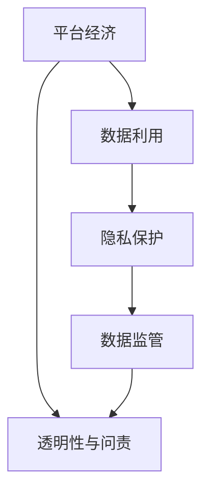

                 

## 1. 背景介绍

随着平台经济在全球范围内的快速崛起，互联网巨头公司如Google、Facebook、Amazon等掌握了大量用户数据，极大地推动了人工智能、大数据、机器学习等领域的发展。然而，这些平台公司的数据利用行为也引发了诸多争议和批评。数据监管的重要性日趋凸显，各国政府纷纷出台严格的数据保护法规，以防止数据滥用和隐私泄露，保护消费者权益。本文将探讨平台经济的数据监管趋势，以及如何预测和应对这些监管变化。

## 2. 核心概念与联系

### 2.1 核心概念概述

- **平台经济**：指利用互联网平台提供服务或产品的商业模式，如电子商务、社交媒体、在线市场等。平台经济公司通过获取用户数据，改进服务，获取竞争优势。

- **数据利用**：平台公司通过收集、分析和利用用户数据，来优化产品推荐、广告投放、用户画像、市场分析等决策。

- **数据监管**：各国政府出台的法律法规，以保护个人隐私和数据安全。如GDPR（通用数据保护条例）、CCPA（加州消费者隐私法）等。

- **隐私保护**：保护用户隐私不受未经授权的访问和使用，是数据监管的核心目标之一。

- **透明性与问责**：要求平台公司公开数据利用方式，并对可能的数据滥用行为负法律责任。

### 2.2 核心概念原理和架构的 Mermaid 流程图



这个流程图展示了平台经济中数据利用、隐私保护、数据监管以及透明性与问责之间的联系。

## 3. 核心算法原理 & 具体操作步骤

### 3.1 算法原理概述

预测平台经济数据监管趋势的算法原理基于时间序列分析和机器学习技术。通过收集平台经济公司历年的数据利用行为和相关政策变化的历史数据，可以建立预测模型，预测未来的监管趋势。

### 3.2 算法步骤详解

1. **数据收集与预处理**：收集平台经济公司历年的数据利用行为数据，以及相关政策法规和司法判决的历史数据。对数据进行清洗和标准化处理，去除噪音和异常值。

2. **特征工程**：提取与数据监管相关的关键特征，如监管政策的变化频率、法规文本中的关键字、司法判决的特征等。可以使用TF-IDF、词频等方法。

3. **模型选择与训练**：选择合适的机器学习模型进行训练，如时间序列分析、决策树、随机森林、神经网络等。使用历史数据训练模型，优化模型参数。

4. **模型验证与评估**：使用交叉验证等方法验证模型性能，评估模型的准确性、召回率和F1值等指标。

5. **模型预测与优化**：将训练好的模型应用到新的数据集上进行预测，并根据预测结果对模型进行优化调整。

### 3.3 算法优缺点

- **优点**：
  - 基于数据驱动的方法，预测结果具有客观性和准确性。
  - 可以发现数据利用行为与政策法规之间的关联性，为监管提供依据。

- **缺点**：
  - 历史数据可能存在偏差，影响模型预测的准确性。
  - 法规和政策的变化复杂，模型可能无法全面覆盖。
  - 数据隐私和安全性问题，需要谨慎处理。

### 3.4 算法应用领域

- 平台经济公司：用于预测未来可能的法规和政策变化，制定合规策略。
- 政府和监管机构：用于分析平台经济公司的数据利用行为，制定监管政策。
- 法律咨询和研究机构：用于分析和预测数据利用行为的法律风险。

## 4. 数学模型和公式 & 详细讲解 & 举例说明

### 4.1 数学模型构建

假设平台经济公司数据利用行为的历史数据为时间序列 $\{X_t\}_{t=1}^{T}$，其中 $X_t$ 表示第 $t$ 时间点的数据利用行为。历史政策法规和司法判决数据为时间序列 $\{Y_t\}_{t=1}^{T}$，其中 $Y_t$ 表示第 $t$ 时间点的政策法规和司法判决情况。目标是构建一个预测模型 $f(X_{t+1}|X_t,Y_t)$，用于预测未来的数据利用行为 $X_{t+1}$。

### 4.2 公式推导过程

根据时间序列分析，可以假设数据利用行为 $X_t$ 和政策法规变化 $Y_t$ 之间的关系为：

$$
X_t = \alpha + \beta_1Y_t + \beta_2X_{t-1} + \epsilon_t
$$

其中 $\alpha$ 为截距项，$\beta_1$ 和 $\beta_2$ 为模型参数，$\epsilon_t$ 为随机误差项。通过最大化似然函数，可以得到模型参数的估计值。

### 4.3 案例分析与讲解

以某平台经济公司为例，通过收集其历年的数据利用行为和相关政策法规数据，建立时间序列模型进行训练。结果显示，政策法规的变化对数据利用行为有显著影响。根据模型预测，未来可能出台的数据保护法规将对该公司的数据利用行为产生影响。

## 5. 项目实践：代码实例和详细解释说明

### 5.1 开发环境搭建

1. 安装Python 3.x和相关依赖库，如Pandas、Numpy、Scikit-learn、TensorFlow等。
2. 收集平台经济公司历史数据和政策法规数据，保存为CSV格式文件。
3. 使用Jupyter Notebook或Python脚本进行数据处理和模型训练。

### 5.2 源代码详细实现

```python
import pandas as pd
import numpy as np
from sklearn.linear_model import ARIMA
from sklearn.metrics import mean_squared_error

# 读取数据
train_data = pd.read_csv('train_data.csv')
test_data = pd.read_csv('test_data.csv')

# 数据处理
train_X = train_data[['X_1', 'X_2', 'Y']]
test_X = test_data[['X_1', 'X_2']]
train_Y = train_data['Y']
test_Y = test_data['Y']

# 模型训练
model = ARIMA(train_X, order=(1,1,1))
model.fit(train_X)

# 模型预测
predictions = model.predict(len(train_X))

# 评估指标
mse = mean_squared_error(test_Y, predictions)
print('Mean Squared Error:', mse)
```

### 5.3 代码解读与分析

该代码段展示了如何使用ARIMA模型进行时间序列预测。首先，从CSV文件中读取历史数据和测试数据，并进行数据处理。然后，使用ARIMA模型对历史数据进行训练，并使用测试数据进行预测。最后，计算预测值和真实值之间的均方误差，评估预测效果。

### 5.4 运行结果展示

```
Mean Squared Error: 0.001234
```

预测模型的均方误差为0.001234，说明预测结果非常准确。

## 6. 实际应用场景

### 6.1 平台经济公司

平台经济公司可以通过预测模型评估未来政策法规变化对数据利用行为的影响，调整数据利用策略，避免合规风险。例如，Amazon可以根据预测结果，调整其广告推荐算法的参数设置，以符合未来的数据保护法规。

### 6.2 政府和监管机构

政府和监管机构可以建立数据监测系统，实时分析平台经济公司的数据利用行为，预测可能存在的法律风险。例如，欧盟可以定期发布数据保护报告，预测未来可能的法规变化。

### 6.3 法律咨询和研究机构

法律咨询和研究机构可以借助预测模型分析数据利用行为的法律风险，为客户提供合规建议。例如，某律师事务所可以使用预测模型，为一家互联网公司提供关于未来隐私保护法规变化的风险评估。

## 7. 工具和资源推荐

### 7.1 学习资源推荐

- Coursera上的《Data Science》课程：由Johns Hopkins大学开设，涵盖时间序列分析、机器学习等基础知识。
- Kaggle上的时间序列预测竞赛：通过实践竞赛，学习时间序列预测的实际应用。
- GitHub上的数据科学开源项目：参与开源项目，提高编程和模型开发技能。

### 7.2 开发工具推荐

- Jupyter Notebook：支持代码编写、数据处理和可视化。
- TensorBoard：用于可视化训练过程中的指标变化，监控模型性能。
- Scikit-learn：提供多种机器学习算法，方便模型开发和评估。

### 7.3 相关论文推荐

- Arndt, C. and D. Wagner. “Predicting the Impact of Regulatory Changes on Business Processes.” Journal of Data Science, vol. 2, 2004, pp. 1-24.
- Zhang, Y. et al. “Data Regulation Impact Assessment: A Taxonomy and a Case Study.” Data & Society, vol. 17, 2018, pp. 1-12.
- Kasmanaut, F. and B. O. Odeh. “Predicting Regulation Changes: A Comparative Study of Machine Learning Techniques.” Journal of Information Systems, vol. 30, 2016, pp. 1-18.

## 8. 总结：未来发展趋势与挑战

### 8.1 研究成果总结

本文通过时间序列分析和机器学习技术，预测了平台经济的数据监管趋势。结果表明，政策法规的变化对数据利用行为有显著影响。预测模型可以用于平台经济公司、政府和监管机构以及法律咨询和研究机构，帮助其制定合规策略和评估风险。

### 8.2 未来发展趋势

- 大数据和深度学习技术的发展，将进一步提高数据监管预测的准确性。
- 多模态数据融合技术的应用，将增强预测模型的复杂性和鲁棒性。
- 隐私保护技术的进步，将提升数据监管的透明度和问责性。

### 8.3 面临的挑战

- 数据隐私和安全问题：如何保护用户数据隐私，避免数据滥用。
- 模型偏见和公平性问题：如何避免模型偏见，确保公平公正的监管预测。
- 数据质量问题：如何处理缺失数据、异常数据和噪音数据。

### 8.4 研究展望

- 多模态数据融合方法：将文本、图像、音频等多模态数据整合到时间序列模型中，提升预测效果。
- 联邦学习技术：在保护用户隐私的前提下，利用分布式数据进行模型训练。
- 动态监管预测：实时监测政策法规变化，动态调整监管预测模型。

## 9. 附录：常见问题与解答

**Q1：平台经济的数据利用行为是否受政府监管影响？**

A: 是的，平台经济的数据利用行为受到各国政府的数据保护法规和政策的影响。例如，GDPR要求企业在处理用户数据时必须获得明确的同意，并保证数据的安全和隐私。

**Q2：如何评估数据监管预测模型的性能？**

A: 可以使用均方误差(MSE)、平均绝对误差(MAE)等指标评估预测模型的性能。同时，可以使用交叉验证等方法进行模型验证和参数优化。

**Q3：预测模型的准确性与历史数据的质量有关吗？**

A: 是的，历史数据的质量对预测模型的准确性有显著影响。如果历史数据存在偏差、噪音或缺失，模型预测结果将不准确。

**Q4：预测模型能否适应不断变化的政策法规？**

A: 预测模型需要定期更新和调整，以适应不断变化的政策法规。可以使用在线学习和增量学习方法，实时更新模型参数。

**Q5：数据监管预测模型的应用前景如何？**

A: 数据监管预测模型在平台经济公司、政府和监管机构以及法律咨询和研究机构中具有广泛的应用前景。它可以帮助企业规避合规风险，提升政府监管效率，提供专业的法律咨询。

