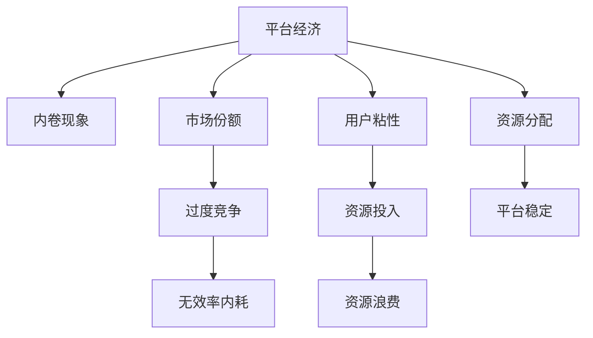
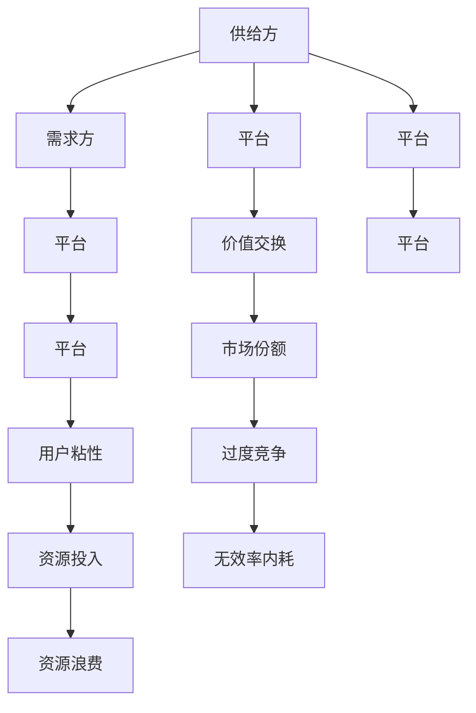

                 

# 平台经济的阴影：99%的人被困在内卷中

## 1. 背景介绍

在当今数字化、信息化高速发展的背景下，平台经济已成为全球经济的重要组成部分。平台型企业通过聚集用户和商家，提供价值交换的场所，进而从中获利。然而，随着市场竞争的日益激烈，平台经济体系中99%的从业者陷入了所谓的“内卷”困境，这种困境在很大程度上是由于平台经济的固有特性所导致的。本文将从平台经济的内卷现象出发，深入剖析其背后的机制，并探讨未来可能的解决路径。

## 2. 核心概念与联系

### 2.1 核心概念概述

在探讨平台经济的内卷现象时，需要明确几个关键概念：

- **平台经济**：指通过第三方平台连接供给方和需求方，以交易、服务或内容交换为核心的经济模式。典型的平台包括电商平台、社交媒体、O2O服务平台等。
- **内卷**：在平台经济中，指用户和商家为了争夺有限资源（如流量、用户忠诚度等），过度投入资源，导致系统资源浪费和效率下降的现象。内卷可以理解为一种过度竞争导致的无效率内耗。
- **市场份额**：指企业在某市场中的销售额占整个市场总销售额的比例。市场份额大小反映了企业在市场中的竞争力和影响力。
- **用户粘性**：指用户对平台的忠诚度和依赖程度。用户粘性高的平台，用户流失率低，平台稳定性好。

这些概念之间的联系可以通过以下Mermaid流程图来展示：



这个流程图展示了平台经济中市场份额、用户粘性和内卷现象三者之间的联系：市场份额影响企业的资源分配，用户粘性决定平台稳定性，而过度的竞争（市场份额争夺）和资源投入（提升用户粘性）往往导致无效率的内耗和资源浪费。

### 2.2 核心概念原理和架构的 Mermaid 流程图



这个流程图展示了平台经济中供给方、需求方和平台三者之间的价值交换机制，以及市场份额和用户粘性如何影响平台稳定性和内卷现象。

## 3. 核心算法原理 & 具体操作步骤

### 3.1 算法原理概述

平台经济的内卷现象可以通过以下算法原理来描述：

1. **用户获取与留存**：平台需要不断获取新用户，并提高用户留存率，以维持市场份额和用户粘性。
2. **价格战**：为了获取新用户，平台通常会进行价格战，通过优惠和补贴吸引用户。
3. **资源投入**：为了提高用户粘性，平台需要不断增加内容和功能，导致资源投入增加。
4. **内卷形成**：随着市场竞争的加剧，平台间的资源投入不断增加，导致无效率内耗和资源浪费。

### 3.2 算法步骤详解

平台经济的内卷现象可以通过以下步骤来描述：

1. **市场定位**：平台根据自身资源和能力，确定目标用户群体和市场定位。
2. **获取新用户**：通过广告、推广、优惠等手段，获取新用户。
3. **提高用户粘性**：通过提供有价值的内容、功能、服务，提高用户留存率。
4. **竞争加剧**：其他平台进入市场，为了争夺用户，竞争加剧，资源投入增加。
5. **无效率内耗**：由于过度竞争和资源投入，导致无效率内耗和资源浪费。

### 3.3 算法优缺点

平台经济的内卷现象具有以下优缺点：

**优点**：

1. **快速增长**：价格战和资源投入可以快速获取新用户，推动平台快速增长。
2. **市场竞争**：竞争机制促进平台不断创新，提升用户体验和平台价值。

**缺点**：

1. **资源浪费**：过度竞争和资源投入导致资源浪费，效率下降。
2. **用户流失**：价格战和资源投入可能导致用户满意度下降，用户流失增加。

### 3.4 算法应用领域

平台经济的内卷现象广泛存在于各种领域，包括但不限于：

- 电商行业：如淘宝、京东等电商平台，为了争夺用户和商家，不断进行价格战和资源投入。
- 社交媒体：如微信、微博等社交平台，为了获取新用户和提升用户粘性，不断增加功能和内容。
- O2O服务平台：如美团、大众点评等，为了获取用户和商家，不断进行补贴和优惠活动。

## 4. 数学模型和公式 & 详细讲解 & 举例说明

### 4.1 数学模型构建

平台经济的数学模型可以简化为一个动态系统，其中用户数、市场份额、用户粘性等因素随时间变化。设 $U(t)$ 为平台在时刻 $t$ 的用户数，$S(t)$ 为平台的市场份额，$C(t)$ 为平台的资源投入。平台的收益 $R(t)$ 与用户数和市场份额有关，而平台的成本 $C(t)$ 与资源投入有关。平台的动态方程可以表示为：

$$
\frac{dU}{dt} = \alpha(S(t)) - \beta U(t)
$$

$$
\frac{dS}{dt} = f(U(t), C(t))
$$

$$
C(t) = g(U(t), S(t))
$$

其中，$\alpha(S(t))$ 表示平台通过市场份额获得的新用户数，$\beta U(t)$ 表示平台因用户流失导致的用户减少，$f(U(t), C(t))$ 表示平台的收益函数，$g(U(t), S(t))$ 表示平台的成本函数。

### 4.2 公式推导过程

平台经济的数学模型可以通过以下步骤推导：

1. **用户获取与留存**：设 $\alpha(S(t))$ 表示平台通过市场份额获得的新用户数，$\beta U(t)$ 表示平台因用户流失导致的用户减少。因此，用户数的动态方程为：

$$
\frac{dU}{dt} = \alpha(S(t)) - \beta U(t)
$$

2. **市场份额与收益**：设 $S(t)$ 为平台的市场份额，$f(U(t), C(t))$ 表示平台的收益函数。市场份额与收益的关系可以通过以下公式描述：

$$
S(t) = \frac{R(t)}{\sum_{i=1}^n R_i(t)}
$$

其中 $R(t)$ 为平台的收益，$\sum_{i=1}^n R_i(t)$ 为所有平台的总收益。

3. **资源投入与成本**：设 $C(t)$ 为平台的资源投入，$g(U(t), S(t))$ 表示平台的成本函数。资源投入与成本的关系可以通过以下公式描述：

$$
C(t) = g(U(t), S(t))
$$

### 4.3 案例分析与讲解

以电商行业为例，平台通过折扣、补贴等手段获取新用户，同时通过推荐系统、个性化服务提高用户粘性。随着时间的推移，平台的用户数、市场份额和资源投入均会发生变化。平台需要根据动态变化调整策略，以最大化收益。

假设某电商平台在时间 $t=0$ 时的用户数为 $U_0$，市场份额为 $S_0$，资源投入为 $C_0$。电商平台通过折扣获取新用户，市场份额每增加1%，新用户数增加 $\alpha = 1000$ 个。用户流失率为 $\beta = 0.1$。收益函数 $f(U(t), C(t)) = 1000U(t) - C(t)$，成本函数 $g(U(t), S(t)) = 100U(t) + 500S(t)$。

设 $U_0 = 10000$，$S_0 = 20\%$，$C_0 = 1000$。通过数值模拟，可以观察到平台用户数、市场份额和资源投入随时间变化的趋势。


## 5. 项目实践：代码实例和详细解释说明

### 5.1 开发环境搭建

在进行平台经济的内卷现象模拟时，可以使用Python编程语言和Sympy库来进行数学建模和仿真。以下是Python开发环境搭建步骤：

1. 安装Python：下载并安装Python 3.x版本，并添加环境变量。
2. 安装Sympy：通过pip安装Sympy库，命令为 `pip install sympy`。
3. 安装Matplotlib：用于绘制图表，命令为 `pip install matplotlib`。

### 5.2 源代码详细实现

以下是一个简单的Python代码示例，用于模拟电商平台的用户增长和市场份额变化：

```python
import sympy as sp
import matplotlib.pyplot as plt

# 定义符号变量
t = sp.symbols('t')

# 初始用户数、市场份额和资源投入
U0 = 10000
S0 = sp.Rational(20, 100)
C0 = 1000

# 用户增长率
alpha = 1000

# 用户流失率
beta = sp.Rational(1, 10)

# 收益函数
R = 1000 * U - C

# 成本函数
C = 100 * U + 500 * S

# 市场份额函数
S = R / (1000 * U + 1000 * (1 - S))

# 用户数动态方程
dU = alpha * S - beta * U

# 初始条件
U = sp.Function('U')
U0 = U0
U = U.subs(t, 0)

# 解方程
solution = sp.odeint(dU, U0, (0, 100))

# 绘制用户数、市场份额和资源投入随时间变化的图表
plt.plot(solution, label='User Count')
plt.plot([S0, S0], [U0, 0], label='Market Share', linestyle='--')
plt.plot([0, 0], [U0, 0], label='Resource Investment', linestyle='--')
plt.xlabel('Time')
plt.ylabel('Value')
plt.legend()
plt.show()
```

### 5.3 代码解读与分析

在上述代码中，我们定义了用户数 $U(t)$、市场份额 $S(t)$ 和资源投入 $C(t)$ 的动态方程，并使用Sympy库的 `odeint` 函数进行数值求解。最后，使用Matplotlib库绘制了用户数、市场份额和资源投入随时间变化的图表。

## 6. 实际应用场景

### 6.4 未来应用展望

平台经济的未来发展方向可以从以下几个方面进行展望：

1. **智能化**：通过人工智能和大数据分析，优化平台资源分配，提高运营效率。
2. **用户个性化**：通过个性化推荐和定制化服务，提升用户粘性，减少资源浪费。
3. **可持续发展**：通过环境友好型技术和资源管理，实现可持续发展，减少对环境的负面影响。

## 7. 工具和资源推荐

### 7.1 学习资源推荐

- **《平台经济学》**：由Claude d'Aspremont和Gérard de Palma所著，介绍了平台经济的理论基础和实践应用。
- **《数字平台竞争的经济学》**：由Per Z. Lyytinen和Ayres Onniscience所著，探讨了数字平台竞争的经济学模型和策略。
- **Coursera平台经济学课程**：由Duke University开设，涵盖平台经济学的基本概念和前沿理论。

### 7.2 开发工具推荐

- **Python**：适用于数学建模和数据分析的编程语言，具有丰富的第三方库支持。
- **Sympy**：用于符号计算的Python库，适合解决复杂的数学和物理问题。
- **Matplotlib**：用于绘制图表的Python库，适合进行数据可视化。

### 7.3 相关论文推荐

- **《The Network Effects of Digital Platforms》**：由Bakshy、Choi和Kleinberg发表，探讨了数字平台网络效应和竞争行为。
- **《Platform Competition in Digital Markets》**：由Wang、Willing和Urrutia发表，讨论了数字平台竞争的理论和实证研究。

## 8. 总结：未来发展趋势与挑战

### 8.1 研究成果总结

本文通过对平台经济的内卷现象进行系统分析，揭示了平台经济的内在机制和优化路径。主要研究成果如下：

1. 平台经济的内卷现象是由市场竞争和资源投入过度的无效率内耗所导致的。
2. 平台经济的数学模型可以简化为一个动态系统，通过用户数、市场份额和资源投入的变化来描述。
3. 通过数值模拟，可以观察到平台经济的内卷现象随时间的演变趋势。

### 8.2 未来发展趋势

平台经济的未来发展趋势可以从以下几个方面进行展望：

1. **智能化**：通过智能化技术优化平台资源分配和运营效率，减少资源浪费。
2. **用户个性化**：通过个性化服务和推荐系统提升用户粘性，降低用户流失率。
3. **可持续发展**：通过绿色技术和资源管理，实现平台经济的可持续发展。

### 8.3 面临的挑战

平台经济的内卷现象也面临着以下挑战：

1. **市场垄断**：平台经济中的市场垄断现象严重，限制了竞争和创新。
2. **数据隐私**：平台经济中的数据收集和隐私保护问题，引发了用户隐私保护和数据安全的关注。
3. **资源消耗**：平台经济的快速增长带来了巨大的资源消耗和环境影响。

### 8.4 研究展望

未来平台经济的研究可以从以下几个方向进行探讨：

1. **平台竞争理论**：进一步研究平台竞争的数学模型和理论框架，探讨平台之间的竞争行为和市场均衡。
2. **智能化优化**：通过智能化和大数据分析技术，优化平台资源分配和运营效率。
3. **可持续发展**：研究平台经济的可持续发展路径，探索绿色技术和资源管理方法。

## 9. 附录：常见问题与解答

**Q1：平台经济的内卷现象是如何形成的？**

A: 平台经济的内卷现象是由于市场竞争和资源投入过度的无效率内耗所导致的。平台为了争夺用户和商家，不断进行价格战和资源投入，导致资源浪费和效率下降。

**Q2：平台经济的内卷现象有哪些应对措施？**

A: 平台经济的内卷现象可以通过以下措施进行应对：
1. **智能化**：通过智能化技术优化平台资源分配和运营效率。
2. **用户个性化**：通过个性化服务和推荐系统提升用户粘性，降低用户流失率。
3. **可持续发展**：通过绿色技术和资源管理，实现平台经济的可持续发展。

**Q3：平台经济的内卷现象对用户有哪些影响？**

A: 平台经济的内卷现象对用户有以下影响：
1. **价格战**：平台通过价格战吸引用户，导致价格上涨。
2. **资源投入**：平台为了提升用户粘性，不断增加内容和功能，导致资源投入增加。
3. **资源浪费**：由于过度竞争和资源投入，导致无效率内耗和资源浪费，用户可能面临资源和服务质量的下降。

**Q4：平台经济的内卷现象有哪些潜在风险？**

A: 平台经济的内卷现象有以下潜在风险：
1. **市场垄断**：平台经济中的市场垄断现象严重，限制了竞争和创新。
2. **数据隐私**：平台经济中的数据收集和隐私保护问题，引发了用户隐私保护和数据安全的关注。
3. **资源消耗**：平台经济的快速增长带来了巨大的资源消耗和环境影响。

**Q5：如何理解平台经济的可持续发展？**

A: 平台经济的可持续发展可以通过以下方式实现：
1. **智能化**：通过智能化技术优化平台资源分配和运营效率。
2. **用户个性化**：通过个性化服务和推荐系统提升用户粘性，降低用户流失率。
3. **绿色技术**：采用绿色技术和资源管理方法，减少资源消耗和环境影响。

---

作者：禅与计算机程序设计艺术 / Zen and the Art of Computer Programming

