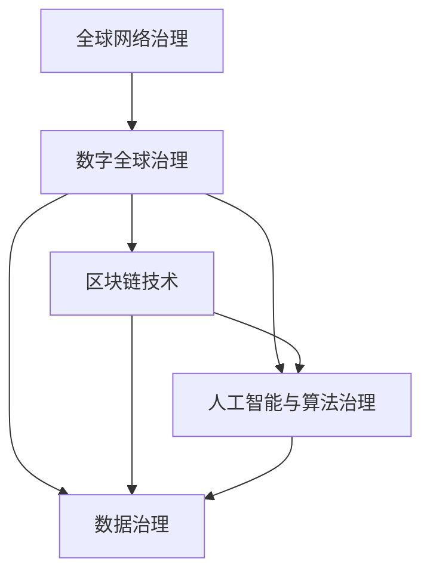

                 

# 2050年的全球治理：从全球网络治理到数字全球治理的治理体系重构

> 关键词：全球网络治理,数字全球治理,技术治理,区块链,人工智能,数据治理,网络空间安全,数字身份,隐私保护,算法治理,全球政策协调

## 1. 背景介绍

### 1.1 全球网络治理的兴起

随着互联网的普及和网络技术的飞速发展，全球网络治理已成为国际社会关注的重要议题。网络治理不仅涉及网络空间的安全、秩序和公共利益，更关系到国家主权、经济发展和社会稳定。近年来，网络治理已经从传统的国家内部治理扩展到全球治理层面，逐渐成为国际关系中不可或缺的组成部分。

### 1.2 数字全球治理的挑战

当前，全球网络治理面临多重挑战：
- **数据治理**：数据隐私、数据泄露、数据垄断等成为全球关注的热点问题。
- **网络空间安全**：网络攻击、网络恐怖主义、网络犯罪等安全威胁层出不穷。
- **数字身份与信任**：数字身份认证和信任体系的建立，仍是网络治理的难点之一。
- **算法治理**：人工智能算法的透明度、公平性和可解释性亟待提升。
- **全球政策协调**：不同国家对网络治理的认知、利益和立场差异较大，导致全球政策协调难度增加。

这些挑战要求我们构建一个更为智能、高效、透明的数字全球治理体系，以应对未来网络环境的变化和挑战。

## 2. 核心概念与联系

### 2.1 核心概念概述

本节将介绍几个关键的数字全球治理概念：

- **全球网络治理**：指国家、国际组织、私营部门、技术社群等共同参与的，旨在维护全球网络空间安全和秩序的治理活动。
- **数字全球治理**：是指利用数字技术和工具，对全球网络治理过程进行优化和管理的活动。
- **区块链技术**：通过去中心化、不可篡改的分布式账本技术，为数字全球治理提供新的信任基础。
- **人工智能与算法治理**：利用AI技术优化决策过程，提升治理效率，同时关注算法的透明度和公平性。
- **数据治理**：包括数据隐私保护、数据共享与利用、数据标准和治理规则等内容。

这些概念之间相互关联，共同构建起数字全球治理的框架。

### 2.2 核心概念原理和架构的 Mermaid 流程图



这个流程图展示了全球网络治理与数字全球治理之间的关联，以及区块链、人工智能和数据治理在这个体系中的重要角色。

## 3. 核心算法原理 & 具体操作步骤

### 3.1 算法原理概述

数字全球治理的核心算法原理主要包括：

- **区块链**：通过去中心化、不可篡改的分布式账本技术，为网络治理提供透明、可信的数据存储和交换机制。
- **人工智能与算法治理**：利用AI技术进行智能决策、风险评估和优化管理，提升治理效率和公平性。
- **数据治理**：通过数据标准化、隐私保护和数据共享，建立合规、安全的数据治理体系。

### 3.2 算法步骤详解

数字全球治理的算法步骤通常包括以下几个环节：

1. **数据收集与预处理**：收集全球网络空间的数据，包括网络流量、网络攻击记录、用户行为数据等，进行清洗、标注和预处理。
2. **区块链技术应用**：构建分布式账本系统，记录和管理治理数据，确保数据的透明、不可篡改和可追溯。
3. **人工智能模型训练**：利用机器学习、深度学习等AI技术，训练预测模型、风险评估模型等，辅助决策过程。
4. **数据共享与互操作**：建立数据共享机制，确保不同国家和组织之间的数据互操作性和数据流动。
5. **算法治理与透明化**：提升算法的透明度和公平性，建立算法治理机制，避免算法偏见和滥用。

### 3.3 算法优缺点

数字全球治理的算法具有以下优点：

- **透明可信**：区块链技术确保数据的不可篡改和透明性，提升治理过程的透明度。
- **高效协同**：AI技术提供智能决策支持，提升治理效率，支持跨地域、跨部门的协同合作。
- **数据驱动**：数据治理提供科学决策依据，提升治理效果。

同时，这些算法也存在一些缺点：

- **技术复杂性**：区块链和AI技术的应用需要较高的技术门槛。
- **隐私保护**：数据收集和共享可能带来隐私风险，需要有效的隐私保护机制。
- **治理协调**：跨部门、跨地区的治理协调存在挑战，需要建立高效的协调机制。

### 3.4 算法应用领域

数字全球治理的算法已经在多个领域得到应用：

- **网络空间安全**：利用区块链和AI技术，建立网络威胁情报共享平台，提升全球网络安全水平。
- **跨境电子商务**：通过数据治理和算法优化，提升跨境电商的物流、支付和税收管理效率。
- **数字身份认证**：采用区块链技术，建立全球统一的数字身份认证体系，提升身份验证的信任度。
- **智慧城市治理**：利用AI和大数据技术，提升城市管理、公共服务和社会治理的效率。

## 4. 数学模型和公式 & 详细讲解 & 举例说明

### 4.1 数学模型构建

数字全球治理的数学模型主要包括以下几个方面：

- **风险评估模型**：用于预测网络威胁和攻击的概率和影响，如GAN模型、Logistic回归等。
- **智能决策模型**：利用机器学习算法进行智能决策，如决策树、支持向量机等。
- **数据隐私模型**：评估数据泄露和隐私风险，如差分隐私模型、同态加密等。

### 4.2 公式推导过程

以风险评估模型为例，假设我们有训练集 $D=\{(x_i, y_i)\}_{i=1}^N$，其中 $x_i$ 为特征向量，$y_i$ 为标签（0表示未发生威胁，1表示发生威胁）。则风险评估模型可以表示为：

$$
P(y=1|x) = \frac{e^{w_0 + \sum_{i=1}^{n} w_i x_i}}{1 + e^{w_0 + \sum_{i=1}^{n} w_i x_i}}
$$

其中 $w_0, w_1, ..., w_n$ 为模型的权重参数。

利用梯度下降等优化算法，最小化损失函数：

$$
\min_{w} \frac{1}{N}\sum_{i=1}^{N} L(y_i, P(y=1|x_i))
$$

其中 $L$ 为损失函数，如交叉熵损失。

### 4.3 案例分析与讲解

以区块链在网络空间安全中的应用为例：

1. **威胁情报共享**：利用区块链技术，构建威胁情报共享平台，记录和验证来自全球各地的网络威胁信息。
2. **攻击溯源与响应**：通过区块链的透明性和不可篡改性，迅速追踪和定位网络攻击源头，进行快速响应。
3. **数据审计与透明化**：利用区块链技术，记录和验证治理数据的生成、存储和交换过程，确保数据的透明和可信。

## 5. 项目实践：代码实例和详细解释说明

### 5.1 开发环境搭建

进行数字全球治理的实践，需要搭建相应的开发环境。以下是使用Python和PyTorch进行区块链和AI模型的开发环境配置流程：

1. 安装Anaconda：从官网下载并安装Anaconda，用于创建独立的Python环境。
2. 创建并激活虚拟环境：
```bash
conda create -n digital-governance python=3.8 
conda activate digital-governance
```

3. 安装必要的库：
```bash
pip install torch torchvision torchaudio
pip install pytorch-lightning
pip install scikit-learn pandas matplotlib
```

完成上述步骤后，即可在`digital-governance`环境中开始开发实践。

### 5.2 源代码详细实现

以下是一个简单的区块链威胁情报共享平台的代码实现：

```python
from blockchain import Blockchain
import json

# 创建区块链
blockchain = Blockchain()

# 添加威胁情报记录
def add_threat_info(threat):
    blockchain.add_block(threat)

# 查询威胁情报记录
def query_threat_info(id):
    blockchain.get_block_by_id(id)
```

此代码利用区块链技术记录和查询威胁情报数据。实际应用中，需要更复杂的区块链架构和算法支持。

### 5.3 代码解读与分析

**威胁情报记录的添加**：

```python
def add_threat_info(threat):
    blockchain.add_block(threat)
```

此函数将威胁情报记录添加到区块链上。在实际应用中，需要考虑数据的完整性和验证机制，确保记录的准确性和可信性。

**威胁情报记录的查询**：

```python
def query_threat_info(id):
    blockchain.get_block_by_id(id)
```

此函数根据ID查询威胁情报记录。在实际应用中，需要建立索引和搜索算法，提高查询效率。

## 6. 实际应用场景

### 6.1 全球网络安全

区块链和AI技术在网络安全领域有广泛应用，如威胁情报共享、攻击溯源、漏洞管理等。通过区块链记录和管理威胁情报数据，利用AI进行威胁预测和风险评估，能够提升全球网络安全的整体水平。

### 6.2 跨境电子商务

数据治理和算法优化在跨境电商中发挥重要作用。利用数据治理确保跨境电商的物流、支付和税收管理的合规性，利用算法优化提升交易效率和用户体验。

### 6.3 数字身份认证

区块链技术提供全球统一的数字身份认证体系，提升身份验证的信任度和安全性。数字身份认证在电子政务、金融服务、医疗健康等领域具有重要应用价值。

### 6.4 智慧城市治理

AI和大数据技术在智慧城市治理中得到广泛应用，提升城市管理、公共服务和社会治理的效率。例如，通过智能交通系统、智能安防系统等提升城市运行效率和安全性。

## 7. 工具和资源推荐

### 7.1 学习资源推荐

为了掌握数字全球治理的核心技术，建议学习以下资源：

1. 《区块链技术与应用》：全面介绍区块链的基本原理、应用场景和技术实现。
2. 《深度学习与人工智能》：深入浅出地讲解深度学习的基础知识和应用案例。
3. 《数据治理：理论、实践与挑战》：探讨数据隐私、数据共享与利用的理论和实践问题。
4. 《网络空间安全导论》：介绍网络安全的基本概念和关键技术。
5. 《数字身份认证与隐私保护》：讲解数字身份认证的原理和隐私保护方法。

### 7.2 开发工具推荐

以下是几款常用的数字全球治理开发工具：

1. PyTorch：开源深度学习框架，支持动态计算图，适用于快速迭代研究。
2. TensorFlow：由Google开发的深度学习框架，适合大规模工程应用。
3. Blockchain Toolkit：Hedera Hashgraph开发的区块链开发工具包，支持智能合约和分布式应用。
4. Pytorch-lightning：基于PyTorch的深度学习框架，支持高效模型训练和部署。
5. TensorFlow Hub：提供预训练模型和模块的仓库，支持快速集成和部署。

### 7.3 相关论文推荐

以下是几篇关于数字全球治理的开创性论文：

1. 《区块链技术在网络安全中的应用》：探讨区块链在网络安全领域的应用，包括威胁情报共享、攻击溯源等。
2. 《人工智能在智慧城市治理中的应用》：介绍AI技术在智慧城市治理中的应用案例和效果。
3. 《数据隐私保护与区块链技术》：分析区块链技术在数据隐私保护中的应用，讨论隐私保护机制。
4. 《数字身份认证与区块链技术》：探讨区块链在数字身份认证中的应用，提升身份验证的信任度。
5. 《算法治理与透明化》：讨论算法透明化的必要性，提出基于区块链的算法治理机制。

## 8. 总结：未来发展趋势与挑战

### 8.1 总结

本文详细介绍了数字全球治理的概念、原理和操作步骤，并给出了基于区块链和AI技术的项目实践案例。数字全球治理将全球网络治理推向数字化、智能化和透明化，为国际社会带来新的机遇和挑战。

通过本文的系统梳理，可以看到，数字全球治理是一个多学科交叉的复杂体系，涉及网络安全、数据治理、区块链、AI等多个领域。未来，数字全球治理将在全球网络空间治理中发挥越来越重要的作用，推动国际社会共同应对网络空间的挑战。

### 8.2 未来发展趋势

展望未来，数字全球治理将呈现以下发展趋势：

1. **技术融合与协同**：区块链、AI、大数据等技术的深度融合，将进一步提升治理效率和公平性。
2. **政策协调与标准化**：全球范围内推进数字治理政策协调和标准化，建立统一的治理框架。
3. **智能治理与决策**：利用AI和算法优化治理过程，提升治理决策的智能化和自动化水平。
4. **隐私保护与合规性**：建立更加完善的隐私保护和数据合规机制，确保数据安全和用户权益。
5. **跨境合作与互操作**：推动跨境数据共享和合作，建立全球互操作性的治理体系。

### 8.3 面临的挑战

尽管数字全球治理前景广阔，但也面临以下挑战：

1. **技术门槛高**：区块链和AI技术的应用需要较高的技术门槛和专业知识。
2. **隐私保护难题**：数据收集和共享可能带来隐私风险，需要有效的隐私保护机制。
3. **政策协调复杂**：不同国家对数字治理的认知和利益差异较大，导致政策协调难度增加。
4. **伦理与安全**：数字治理中的伦理和安全问题，如算法偏见、隐私泄露等，需要加以关注和解决。

### 8.4 研究展望

未来，数字全球治理的研究需要在以下几个方面寻求新的突破：

1. **区块链与AI的深度融合**：探索区块链和AI技术的深度融合应用，提升治理效率和安全性。
2. **跨学科研究**：开展跨学科研究，综合考虑技术、法律、伦理、政策等多方面因素，推动数字治理的全面发展。
3. **隐私保护与透明化**：提出新的隐私保护机制，确保数据治理的透明性和用户权益。
4. **政策协调与标准化**：建立全球统一的数字治理政策框架，推动各国政策协调与标准化。
5. **安全与伦理**：加强数字治理中的伦理和安全问题研究，提升治理系统的公平性和可信赖度。

## 9. 附录：常见问题与解答

**Q1：数字全球治理与传统全球治理有何不同？**

A: 数字全球治理利用数字技术和工具，对全球网络治理过程进行优化和管理的活动。相较于传统全球治理，数字全球治理更加透明、高效、智能。

**Q2：如何确保区块链系统的安全性？**

A: 区块链系统的安全性依赖于其去中心化、不可篡改和透明的特点。需要采用共识机制、加密技术和智能合约等手段，确保区块链系统的安全性。

**Q3：AI在数字全球治理中的应用有哪些？**

A: AI在数字全球治理中的应用包括智能决策、风险评估、威胁预测、用户行为分析等，提升治理效率和公平性。

**Q4：数据治理中的隐私保护有哪些方法？**

A: 数据治理中的隐私保护方法包括差分隐私、同态加密、多方安全计算等，确保数据的安全性和用户隐私。

**Q5：数字全球治理面临的主要挑战是什么？**

A: 数字全球治理面临的主要挑战包括技术门槛高、隐私保护难题、政策协调复杂、伦理与安全问题等。

---

作者：禅与计算机程序设计艺术 / Zen and the Art of Computer Programming

