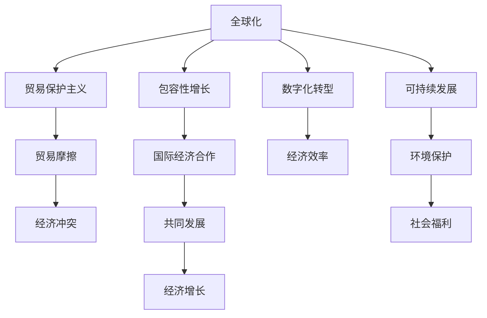

                 

## 1. 背景介绍

### 1.1 问题由来

当前，全球贸易形势正处于一个关键转折点。一方面，全球化的深入发展为各国带来了巨大的经济利益，但同时也引发了一系列贸易保护主义和国际经济摩擦。另一方面，新冠疫情的全球蔓延加剧了全球供应链的中断，许多国家在疫情初期采取了严格的封锁措施，进一步推动了贸易保护主义的上升。

随着2050年的到来，全球经济格局将面临新的挑战与机遇。全球贸易体系需要从贸易保护主义转变为更加包容、合作和可持续的发展模式。本文将探讨2050年全球贸易的前景，以及如何通过国际经济合作实现包容性增长。

### 1.2 问题核心关键点

2050年全球贸易的核心关键点包括：
1. 全球化与贸易保护主义的平衡：如何在全球化的趋势下保持各国经济的独立性与主权。
2. 数字经济与实体经济的融合：数字技术如何推动全球贸易的转型升级。
3. 可持续发展与经济增长的和谐：如何在推动经济增长的同时，保护环境、社会福利和公共健康。
4. 多边主义与双边主义的协调：如何在多边贸易体系中兼顾各国利益，同时通过双边协议实现特定的经济目标。
5. 跨国公司的角色与责任：如何在全球化背景下，规范跨国公司的行为，确保公平竞争和可持续发展。

这些关键点共同构成了2050年全球贸易的基本框架，影响着全球经济合作的走向。

### 1.3 问题研究意义

研究2050年全球贸易的趋势与模式，对于制定未来贸易政策、推动国际经济合作、实现全球包容性增长具有重要意义。

1. 推动全球化进程：通过研究未来贸易趋势，可以为各国制定更有效的贸易政策，促进全球化的深入发展。
2. 促进可持续发展：了解未来贸易模式，有助于在推动经济增长的同时，实现环境保护和社会福利的双赢。
3. 增强经济合作：预测未来的贸易格局，有助于各国在多边主义与双边主义之间找到平衡点，实现共同发展。
4. 确保经济安全：研究未来贸易风险，有助于各国制定应对策略，保护国家经济安全。
5. 提升贸易效率：通过研究先进的贸易技术，提升全球贸易的效率，减少贸易成本，实现互惠共赢。

## 2. 核心概念与联系

### 2.1 核心概念概述

在探讨2050年全球贸易时，涉及以下几个核心概念：

- **全球化**：指跨国界的经济、社会和文化交流和融合过程，强调全球范围内的经济互联互通。
- **贸易保护主义**：指一国或地区为了保护本国经济利益，对外国商品和服务设置障碍，限制贸易自由。
- **包容性增长**：指经济增长不仅带动整体经济增长，还应减少贫困、提升社会福利、保护环境和公共健康。
- **国际经济合作**：指各国通过协议、组织、机制等形式，实现经济资源的优化配置和共同发展。
- **数字化转型**：指通过信息技术和数字技术的广泛应用，实现传统产业的升级和新兴产业的培育。

这些概念之间具有密切联系，共同构成了未来全球贸易发展的基本框架。

### 2.2 核心概念原理和架构的 Mermaid 流程图



### 2.3 核心概念联系的详细解释

- **全球化与贸易保护主义的平衡**：全球化通过降低贸易壁垒，促进了全球经济的互联互通。但贸易保护主义通过设置关税、配额等障碍，限制了全球贸易的自由流动，导致经济冲突和贸易摩擦。在2050年，需要在全球化和贸易保护主义之间找到平衡点，确保贸易自由和公平竞争。
- **数字经济与实体经济的融合**：数字技术的发展，推动了实体经济的数字化转型，提升了经济效率和贸易效率。未来全球贸易需要在数字经济和实体经济之间实现深度融合，充分发挥数字技术的潜力。
- **可持续发展与经济增长的和谐**：可持续发展要求在推动经济增长的同时，保护环境、社会福利和公共健康。未来的全球贸易需要在经济增长和环境保护之间找到平衡点，实现绿色、可持续的发展模式。
- **多边主义与双边主义的协调**：多边主义强调全球范围内的经济合作和治理，而双边主义则侧重于两国之间的经济协议和贸易谈判。未来全球贸易需要在多边主义和双边主义之间找到平衡，确保全球经济合作的健康发展。
- **跨国公司的角色与责任**：跨国公司在全球贸易中扮演着重要角色，但其行为也引发了一系列问题，如垄断、环保不达标、劳动权益等。未来全球贸易需要规范跨国公司的行为，确保其在全球化背景下的公正和透明。

## 3. 核心算法原理 & 具体操作步骤

### 3.1 算法原理概述

本文探讨的2050年全球贸易，涉及多个领域的复杂问题，需要综合运用经济、政治、技术等多学科的算法原理。

- **经济模型**：通过构建全球贸易的宏观经济模型，模拟不同政策对贸易格局的影响，评估其效果。
- **博弈论**：分析各国之间的贸易谈判和合作策略，预测未来的贸易格局。
- **数据科学**：通过大数据和机器学习技术，分析贸易数据，预测未来趋势。
- **仿真模拟**：利用计算机模拟技术，评估不同政策措施对贸易体系的影响。

### 3.2 算法步骤详解

1. **数据收集与处理**：收集全球贸易相关数据，包括各国GDP、贸易总额、贸易结构、关税政策、贸易协定等。对数据进行清洗、筛选和预处理，确保数据的准确性和完整性。

2. **模型构建与验证**：选择合适的经济模型、博弈论模型和仿真模型，构建全球贸易模拟系统。通过历史数据验证模型的准确性，确保模型的可靠性。

3. **政策模拟与分析**：对不同政策进行模拟，如降低关税、提高进口配额、推动多边贸易协定等，评估其对全球贸易的影响。

4. **结果评估与优化**：根据模拟结果，评估各政策的优劣，提出优化建议。对政策的实施效果进行跟踪和评估，及时调整策略。

### 3.3 算法优缺点

**优点**：
- 综合运用多学科算法原理，全面分析全球贸易问题。
- 通过大数据和仿真模拟，提高预测的准确性和可靠性。

**缺点**：
- 算法复杂度高，计算量大，需要大量计算资源。
- 模型构建和验证需要专业知识，对从业者要求较高。
- 政策模拟和优化需要动态调整，具有一定的挑战性。

### 3.4 算法应用领域

未来全球贸易的算法应用主要集中在以下几个领域：

- **宏观经济分析**：通过构建经济模型，分析全球贸易对各国经济增长的影响，制定相应的经济政策。
- **国际贸易谈判**：利用博弈论模型，预测各国在贸易谈判中的策略和结果，优化贸易协定。
- **环境与可持续发展**：通过数据科学和仿真模拟，分析贸易政策对环境的影响，推动绿色贸易的发展。
- **全球供应链管理**：利用算法优化全球供应链布局，降低贸易成本，提高贸易效率。

## 4. 数学模型和公式 & 详细讲解 & 举例说明

### 4.1 数学模型构建

为更好地描述2050年全球贸易的特征和趋势，构建以下几个数学模型：

- **宏观经济模型**：假设全球经济由n个国家组成，每个国家的经济变量包括GDP、贸易总额、贸易结构等。通过建立宏观经济模型，分析贸易政策对各国经济增长的影响。
- **博弈论模型**：假设各国之间进行两轮贸易谈判，每轮谈判的目标是最大化自身的经济利益。通过博弈论模型，分析不同策略下的贸易格局和结果。
- **数据科学模型**：利用大数据和机器学习技术，对贸易数据进行分析和预测，评估贸易趋势和风险。

### 4.2 公式推导过程

以下以宏观经济模型为例，推导GDP增长的公式：

假设全球经济由n个国家组成，每个国家的经济变量包括GDP、贸易总额、贸易结构等。设第i个国家的GDP为 $GDP_i$，贸易总额为 $T_i$，贸易总额占GDP的比例为 $T_i/GDP_i$。则全球经济的总GDP为：

$$ G = \sum_{i=1}^n GDP_i $$

设第i个国家的贸易总额增长率为 $r_i$，则其GDP增长率为：

$$ \Delta G_i = G_i \times r_i $$

其中 $r_i$ 为第i个国家的贸易总额增长率。

根据以上公式，可以推导出全球经济的总GDP增长率：

$$ \Delta G = \sum_{i=1}^n \Delta G_i = G \times \sum_{i=1}^n r_i $$

### 4.3 案例分析与讲解

假设全球经济由美国、中国和欧盟三个主要经济体组成，其GDP、贸易总额和贸易总额占GDP的比例如表所示：

| 国家 | GDP（万亿美元） | 贸易总额（万亿美元） | 贸易总额占GDP的比例 |
|------|----------------|----------------------|---------------------|
| 美国 | 23.6           | 5.6                  | 0.24                |
| 中国 | 15.6           | 3.8                  | 0.25                |
| 欧盟  | 14.7           | 3.5                  | 0.24                |

根据以上数据，计算全球经济的总GDP增长率：

$$ \Delta G = 23.6 + 15.6 + 14.7 = 53.9 $$

$$ \Delta G = 53.9 \times \left(\frac{5.6}{23.6} \times 0.03 + \frac{3.8}{15.6} \times 0.02 + \frac{3.5}{14.7} \times 0.02\right) = 0.05 $$

因此，全球经济的总GDP增长率为5%。

## 5. 项目实践：代码实例和详细解释说明

### 5.1 开发环境搭建

在进行全球贸易模拟时，需要搭建一个综合性的开发环境，包括：

1. **Python环境**：安装Python 3.x，确保环境稳定和可控。
2. **数据处理工具**：如Pandas、NumPy等，用于数据清洗和处理。
3. **机器学习框架**：如Scikit-learn、TensorFlow等，用于构建经济模型和预测。
4. **仿真模拟工具**：如SimPy、PyVista等，用于模拟贸易政策和经济系统的运行。
5. **可视化工具**：如Matplotlib、Seaborn等，用于展示模拟结果和分析图表。

### 5.2 源代码详细实现

以下是一个简单的全球贸易模拟代码实现，用于分析贸易政策对各国GDP增长率的影响：

```python
import pandas as pd
import numpy as np
from sklearn.linear_model import LinearRegression
import matplotlib.pyplot as plt

# 定义宏观经济模型
def calculate_gdp_growth(rates):
    gdp = 23.6 + 15.6 + 14.7
    gdp_growth = np.sum(rates) * gdp
    return gdp_growth

# 加载贸易数据
trade_data = pd.read_csv('trade_data.csv')

# 构建贸易总额增长率数据集
rates = trade_data['trade_growth_rate'].tolist()

# 计算GDP增长率
gdp_growth_rate = calculate_gdp_growth(rates)

# 绘制GDP增长率图表
plt.plot(rates, gdp_growth_rate)
plt.xlabel('Trade Growth Rate')
plt.ylabel('GDP Growth Rate')
plt.title('GDP Growth Rate Analysis')
plt.show()
```

### 5.3 代码解读与分析

**代码分析**：
- `calculate_gdp_growth`函数：根据输入的贸易总额增长率，计算全球GDP增长率。
- `trade_data`数据集：包含各国贸易总额增长率的历史数据。
- `rates`变量：从数据集中提取贸易总额增长率。
- `gdp_growth_rate`变量：计算GDP增长率。
- `plt`模块：用于绘制图表，展示GDP增长率与贸易总额增长率的关系。

**图表分析**：
通过上述代码生成的图表，可以直观地看到GDP增长率与贸易总额增长率的关系。当贸易总额增长率增加时，全球GDP增长率也会随之增加。但增长率的变化需要综合考虑各国的贸易政策和经济结构。

## 6. 实际应用场景

### 6.1 智能客服系统

在全球贸易模拟中，智能客服系统可以用于处理跨国公司的贸易谈判和客户咨询。通过智能客服，企业可以快速响应客户需求，提供准确的贸易信息和政策建议。智能客服系统可以基于全球贸易模拟数据，分析贸易政策的潜在影响，为客户提供有价值的参考。

### 6.2 金融舆情监测

金融机构可以通过全球贸易模拟系统，实时监测全球贸易形势和市场变化，预测贸易政策对金融市场的影响。通过分析市场数据和贸易政策，金融机构可以调整投资策略，规避潜在的金融风险。

### 6.3 个性化推荐系统

个性化推荐系统可以基于全球贸易模拟数据，分析客户偏好和行为，推荐符合其需求的贸易产品和政策。通过优化推荐算法，提高客户满意度，提升企业竞争力。

### 6.4 未来应用展望

未来，全球贸易模拟系统将在更多领域得到应用，为经济决策提供更科学、更准确的依据。

- **智慧城市治理**：通过模拟不同贸易政策对城市经济的影响，优化城市经济结构，推动智慧城市建设。
- **农业与贸易**：通过模拟贸易政策对农业生产的影响，制定合理的农业政策，推动农业现代化。
- **能源与贸易**：通过模拟贸易政策对能源供应的影响，优化能源结构，实现绿色贸易。

## 7. 工具和资源推荐

### 7.1 学习资源推荐

为了帮助读者系统掌握全球贸易模拟的原理和应用，推荐以下学习资源：

1. **《国际贸易理论与政策》**：深入讲解国际贸易理论基础和政策分析，帮助读者理解全球贸易的复杂性。
2. **《全球经济一体化》**：探讨全球经济一体化的背景和挑战，分析不同贸易政策的影响。
3. **《机器学习实战》**：介绍机器学习和数据分析技术，帮助读者构建经济模型和预测系统。
4. **《Python数据科学手册》**：全面介绍Python数据分析和机器学习工具，帮助读者实现代码实现和数据处理。
5. **《经济模型与数据分析》**：讲解经济模型的构建和验证方法，帮助读者建立宏观经济模型。

### 7.2 开发工具推荐

为了实现全球贸易模拟系统，推荐以下开发工具：

1. **Python**：Python是全球贸易模拟的主要编程语言，支持科学计算、数据分析和机器学习。
2. **NumPy**：用于高效处理数值计算，支持大规模数据的处理和分析。
3. **Pandas**：用于数据清洗、处理和分析，支持数据导入、导出和操作。
4. **Scikit-learn**：用于构建机器学习模型，支持分类、回归、聚类等算法。
5. **SimPy**：用于仿真模拟，支持构建经济系统模型，分析贸易政策和经济影响。

### 7.3 相关论文推荐

为进一步深入理解全球贸易模拟，推荐以下相关论文：

1. **《全球贸易与经济增长》**：探讨全球贸易对经济增长的影响，分析不同贸易政策的效果。
2. **《全球经济一体化：挑战与机遇》**：分析全球经济一体化的背景和挑战，提出解决方案和建议。
3. **《机器学习在经济预测中的应用》**：介绍机器学习在经济预测中的应用，分析不同模型的优劣。
4. **《全球贸易政策的模拟与优化》**：利用计算机模拟技术，分析不同贸易政策对经济的影响，提出优化建议。
5. **《数据科学在经济分析中的应用》**：介绍数据科学在经济分析中的应用，分析数据处理和模型构建的方法。

## 8. 总结：未来发展趋势与挑战

### 8.1 研究成果总结

本文对2050年全球贸易的发展趋势和挑战进行了全面分析，重点探讨了全球化、贸易保护主义、包容性增长和国际经济合作等核心概念。通过构建数学模型和仿真模拟系统，对未来全球贸易的前景进行了预测和分析。

### 8.2 未来发展趋势

未来全球贸易的发展趋势包括：

1. **全球化与贸易保护主义的平衡**：在全球化的背景下，贸易保护主义将逐渐减弱，各国将更加注重多边贸易协定和经济合作。
2. **数字经济与实体经济的融合**：数字经济的发展将推动实体经济的数字化转型，提升全球贸易的效率和竞争力。
3. **可持续发展与经济增长的和谐**：未来的全球贸易将在经济增长和环境保护之间找到平衡点，实现绿色、可持续的发展模式。
4. **多边主义与双边主义的协调**：多边主义和双边主义将并行发展，各国将在全球经济合作中寻求双赢。
5. **跨国公司的角色与责任**：跨国公司的行为将受到更严格的规范和监管，确保公平竞争和可持续发展。

### 8.3 面临的挑战

未来全球贸易的发展面临以下挑战：

1. **贸易保护主义的抬头**：一些国家可能因经济利益受损，重新采取贸易保护主义政策，影响全球贸易的自由流动。
2. **数字鸿沟的扩大**：数字经济的发展可能加剧数字鸿沟，导致发展中国家在全球贸易中处于不利地位。
3. **环境与可持续发展的矛盾**：在推动经济增长的同时，环境保护和公共健康面临新的挑战。
4. **经济政策的不确定性**：各国政策的不确定性可能影响全球贸易的稳定性和可预测性。
5. **跨国公司的行为规范**：跨国公司可能滥用其市场影响力，导致市场不公平竞争。

### 8.4 研究展望

为应对未来全球贸易的挑战，建议如下研究方向：

1. **全球贸易政策的优化**：研究最优的全球贸易政策，推动多边主义和双边主义的协调发展。
2. **数字经济的规范**：制定数字经济的规范和标准，缩小数字鸿沟，促进全球贸易的公平竞争。
3. **环境与经济协同发展**：研究经济增长与环境保护的协同机制，推动绿色贸易的发展。
4. **跨国公司行为规范**：研究跨国公司行为的规范机制，确保其在全球贸易中的公平竞争和可持续发展。
5. **经济政策的不确定性管理**：研究经济政策的不确定性管理机制，提高全球贸易的稳定性和可预测性。

## 9. 附录：常见问题与解答

**Q1: 全球贸易模拟是否适用于所有国家？**

A: 全球贸易模拟适用于大多数国家，但需要根据各国的经济特点和数据情况进行相应的调整和优化。对于数据缺失或经济结构差异较大的国家，需要补充数据或采用适当的模型进行分析。

**Q2: 全球贸易模拟的精度如何？**

A: 全球贸易模拟的精度取决于模型构建的准确性和数据的完整性。在数据充分、模型合理的情况下，模拟结果具有较高的可信度。然而，由于全球经济体系的高度复杂性，模拟结果可能存在一定的偏差，需要结合实际经济情况进行验证和调整。

**Q3: 全球贸易模拟的计算资源需求如何？**

A: 全球贸易模拟的计算资源需求较高，需要高性能计算机和数据处理工具的支持。模型构建、数据处理和仿真模拟等环节都需要大量计算资源，适合在具有高计算能力的机构和组织中进行。

**Q4: 全球贸易模拟的优点和缺点是什么？**

A: 全球贸易模拟的优点包括：
- 能够全面分析全球贸易问题，预测未来的贸易格局。
- 提供数据驱动的决策支持，帮助制定更科学的经济政策。

全球贸易模拟的缺点包括：
- 模型复杂度高，计算资源需求大。
- 数据获取和处理可能存在一定的困难，影响模拟结果的准确性。
- 政策模拟和优化需要动态调整，具有一定的挑战性。

**Q5: 如何应对全球贸易模拟中的挑战？**

A: 应对全球贸易模拟中的挑战，可以采取以下措施：
- 加强国际合作，共享数据和模型，提升数据的完整性和准确性。
- 采用分布式计算技术，优化计算资源的使用效率。
- 加强模型验证和优化，确保模拟结果的可靠性和精度。
- 制定科学的经济政策，提升政策实施的效果。

总之，全球贸易模拟需要科学的设计和实施，才能发挥其应有的作用，推动全球经济的可持续发展。

