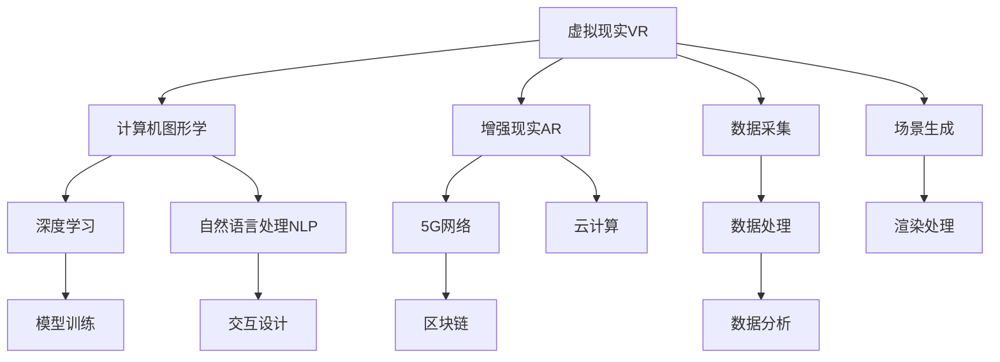
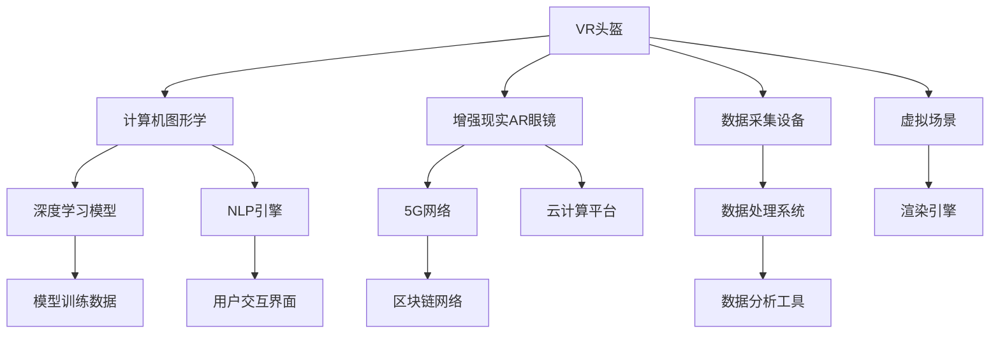

                 

# 2050年的数字创意：从虚拟直播到全息互动表演的数字创意娱乐

> 关键词：数字创意, 虚拟直播, 全息互动表演, 数字娱乐, 元宇宙, 交互式体验, 5G网络, 云计算, 人工智能, 自然语言处理, 深度学习, 区块链

## 1. 背景介绍

### 1.1 问题由来
随着技术的发展，数字创意娱乐已经不再局限于传统的电视、电影等形式，而是逐渐演变成为一个更为广泛、多样化的概念。2050年，我们正处于一个数字创意娱乐的全新时代，其中虚拟直播和全息互动表演无疑是这一领域中最具颠覆性的技术。

虚拟直播和全息互动表演通过将数字技术和创意内容紧密结合，为用户带来前所未有的沉浸式和互动式体验。在虚拟直播中，观众可以与虚拟角色进行实时互动，获得强烈的参与感和满足感；在全息互动表演中，观众不仅可以观看虚拟角色的表演，还可以直接与其进行互动，实现更加沉浸和真实的体验。

然而，这样的数字创意娱乐技术实现，背后需要复杂的技术支撑和先进的计算能力。这就要求我们深入了解和掌握相关的核心技术和算法，才能更好地应用于实际场景。

### 1.2 问题核心关键点
实现虚拟直播和全息互动表演的关键技术包括：

- 虚拟现实(VR)和增强现实(AR)技术：通过虚拟现实头盔和增强现实设备，实现观众与虚拟世界的互动。
- 计算机图形学：用于创建和渲染虚拟角色和场景，实现逼真和生动的视觉效果。
- 深度学习和自然语言处理(NLP)：用于分析和理解用户的语音和文字输入，实现智能对话和互动。
- 5G网络和云计算：为虚拟直播和全息互动表演提供高带宽、低延迟的网络环境，并实现大规模并发处理。
- 区块链技术：用于确保用户隐私和数据安全，实现虚拟数字资产的交易和管理。

这些关键技术之间的逻辑关系可以通过以下Mermaid流程图来展示：



这个流程图展示了一系列核心技术的关联，以及它们在虚拟直播和全息互动表演中的应用。

## 2. 核心概念与联系

### 2.1 核心概念概述

要深入理解虚拟直播和全息互动表演，需要先明确以下几个核心概念：

- **虚拟现实(VR)**：通过虚拟现实头盔和设备，将用户带入到一个完全由计算机生成的虚拟世界，用户可以在虚拟世界中自由移动和互动。
- **增强现实(AR)**：将数字信息叠加到现实世界之上，实现虚拟对象与现实场景的融合。
- **计算机图形学**：用于生成和渲染三维图像，实现逼真的视觉效果。
- **深度学习**：利用神经网络对大规模数据进行训练，学习出复杂的模式和关系，常用于图像识别、语音识别等任务。
- **自然语言处理(NLP)**：使计算机能够理解、处理和生成人类语言，实现智能对话和互动。
- **5G网络**：提供高速率、低延迟的通信网络，支持大规模并发和高性能数据传输。
- **云计算**：通过互联网提供动态可伸缩的计算资源，支持大规模数据处理和存储。
- **区块链**：实现去中心化、安全的数据存储和传输，保护用户隐私和数据安全。

这些概念之间的联系可以通过以下Mermaid流程图来展示：



这个流程图展示了虚拟直播和全息互动表演中各项技术的协同工作，从数据采集到模型训练，再到最终的渲染输出，每一步都依赖于其他技术环节的支撑。

## 3. 核心算法原理 & 具体操作步骤
### 3.1 算法原理概述

虚拟直播和全息互动表演的核心算法原理主要包括以下几个方面：

- **三维建模与渲染**：利用计算机图形学技术，将虚拟角色和场景进行建模，并通过渲染引擎生成逼真的图像和视频。
- **深度学习与特征提取**：通过深度学习模型，提取用户输入的语音、文字等信息，并进行特征提取和分析。
- **自然语言处理**：利用NLP技术，理解用户的语音和文字输入，并生成智能回复和互动内容。
- **交互设计与用户反馈**：结合交互设计原理，设计用户界面和交互流程，并根据用户反馈进行优化和调整。

### 3.2 算法步骤详解

以下是对虚拟直播和全息互动表演中核心算法步骤的详细介绍：

1. **数据采集**：通过VR头盔、AR眼镜等设备，采集用户的实时位置和行为数据。同时，通过麦克风和摄像头，获取用户的语音和面部表情数据。

2. **数据处理**：对采集到的数据进行预处理，包括去噪、滤波、格式转换等操作。

3. **三维建模**：使用计算机图形学技术，创建虚拟角色和场景的3D模型。这一步骤包括模型设计、纹理映射、光照设置等环节。

4. **渲染处理**：将三维模型输入渲染引擎，进行实时渲染和动态更新。渲染处理包括纹理渲染、光照计算、阴影生成等环节。

5. **深度学习模型训练**：利用深度学习模型，对用户输入的语音和文字进行特征提取和分类。训练过程中，需要提供大量标注数据，用于优化模型的预测能力。

6. **自然语言处理**：利用NLP技术，分析用户的语音和文字输入，并生成智能回复和互动内容。NLP模型的训练需要大量的文本数据，并经过预处理和标注。

7. **交互设计**：设计用户界面和交互流程，确保用户能够顺畅地与虚拟角色和场景进行互动。这一步骤需要结合心理学和人体工程学原理，进行多轮迭代和优化。

8. **用户反馈与优化**：根据用户的使用反馈，不断调整和优化虚拟直播和全息互动表演的各个环节。这一步骤包括用户调研、用户测试、数据分析等环节。

### 3.3 算法优缺点

虚拟直播和全息互动表演的算法有以下优缺点：

**优点**：

- **沉浸式体验**：通过虚拟现实和增强现实技术，为用户提供沉浸式和互动式的体验，增强用户的参与感和满意度。
- **高互动性**：利用深度学习、自然语言处理等技术，实现智能对话和互动，使用户能够实时与虚拟角色和场景进行互动。
- **高可扩展性**：基于云计算和大规模数据处理，可以支持大规模并发和高性能数据传输，适应不同规模的用户需求。

**缺点**：

- **技术门槛高**：涉及计算机图形学、深度学习、自然语言处理等多个领域，需要较高的技术储备和团队协作能力。
- **硬件设备成本高**：需要配备VR头盔、AR眼镜等高成本设备，限制了技术应用的普及度。
- **数据隐私风险**：采集用户的实时位置、语音和面部表情数据，存在较大的隐私泄露风险。
- **计算资源消耗大**：渲染处理和深度学习模型训练需要大量计算资源，对硬件设备性能要求较高。

### 3.4 算法应用领域

虚拟直播和全息互动表演技术已经在游戏、教育、医疗等多个领域得到应用，以下是一些典型的应用场景：

- **虚拟演唱会**：利用VR和AR技术，将音乐会现场搬上虚拟舞台，让用户在家中就能享受震撼的音乐表演。
- **虚拟教室**：通过虚拟现实技术，将远程授课场景化，提供更加生动和互动的学习体验。
- **虚拟医疗咨询**：利用增强现实技术，提供虚拟医生和虚拟医院，让用户在家中即可进行健康咨询和诊疗。
- **虚拟旅游**：通过虚拟现实技术，提供虚拟旅游体验，让用户在家中就能游览世界各地的名胜古迹。
- **虚拟产品试用**：利用增强现实技术，提供虚拟产品试用体验，让用户在家中就能体验商品的实际效果。

## 4. 数学模型和公式 & 详细讲解 & 举例说明
### 4.1 数学模型构建

在虚拟直播和全息互动表演中，涉及到多个领域的数学模型，以下是几个典型模型的构建：

1. **三维几何模型**：用于描述虚拟角色和场景的几何形状和空间关系。通常采用三角形网格(Triangle Mesh)表示，通过顶点坐标和连接关系定义几何模型。

2. **纹理映射模型**：用于在几何模型上添加纹理信息，实现逼真和生动的视觉效果。纹理映射通常采用纹理坐标映射的方式，将纹理图像映射到几何模型上。

3. **光照模型**：用于模拟光源对场景的影响，实现逼真的光照效果。常用的光照模型包括Phong模型、Blinn-Phong模型、Physically Based Rendering(PBR)模型等。

4. **深度学习模型**：用于对用户输入的语音和文字进行特征提取和分类。常用的深度学习模型包括卷积神经网络(CNN)、循环神经网络(RNN)、Transformer模型等。

5. **自然语言处理模型**：用于分析用户的语音和文字输入，并生成智能回复和互动内容。常用的NLP模型包括BERT、GPT等。

### 4.2 公式推导过程

以下是几个典型数学模型的公式推导过程：

1. **三角形网格模型**：

   $$
   \text{顶点坐标} = \begin{bmatrix}
   x_0 & y_0 & z_0 \\
   x_1 & y_1 & z_1 \\
   x_2 & y_2 & z_2
   \end{bmatrix}
   $$

   其中 $x_0, y_0, z_0$ 表示第一个顶点的坐标，$x_1, y_1, z_1$ 表示第二个顶点的坐标，$x_2, y_2, z_2$ 表示第三个顶点的坐标。

2. **纹理映射模型**：

   $$
   \text{纹理坐标} = \begin{bmatrix}
   u_0 & v_0 \\
   u_1 & v_1 \\
   u_2 & v_2
   \end{bmatrix}
   $$

   其中 $u_0, v_0$ 表示第一个顶点对应的纹理坐标，$u_1, v_1$ 表示第二个顶点对应的纹理坐标，$u_2, v_2$ 表示第三个顶点对应的纹理坐标。

3. **Phong模型**：

   $$
   I = \text{Diffuse Reflection} + \text{Specular Reflection} + \text{Ambient Light}
   $$

   其中 $\text{Diffuse Reflection}$ 表示漫反射分量，$\text{Specular Reflection}$ 表示镜面反射分量，$\text{Ambient Light}$ 表示环境光分量。

4. **卷积神经网络**：

   $$
   \text{卷积层} = \text{卷积核} \ast \text{输入图像} + \text{偏置项}
   $$

   其中 $\text{卷积核}$ 表示卷积核权重，$\text{输入图像}$ 表示输入图像，$\text{偏置项}$ 表示偏置向量。

5. **BERT模型**：

   $$
   \text{Transformer} = \text{多头注意力机制} + \text{前馈网络}
   $$

   其中 $\text{多头注意力机制}$ 表示多头注意力层的计算，$\text{前馈网络}$ 表示前馈神经网络层的计算。

### 4.3 案例分析与讲解

以下是对几个典型案例的分析与讲解：

1. **虚拟演唱会**：

   在虚拟演唱会中，首先需要对演唱会现场进行三维建模，生成逼真的舞台和观众席。然后利用纹理映射技术，添加灯光、音响、座位等细节，实现逼真的视觉效果。通过深度学习模型，对用户的语音输入进行情感分析和意图识别，生成智能回复和互动内容，提高用户的参与感。

2. **虚拟教室**：

   在虚拟教室中，需要对教室环境和教学设备进行三维建模，并通过渲染引擎实现实时渲染。利用深度学习模型，对学生的语音和文字输入进行情感分析和意图识别，生成智能回复和互动内容，实现更加生动和互动的学习体验。同时，通过自然语言处理模型，自动生成教学视频和课件，提高教学效率。

3. **虚拟医疗咨询**：

   在虚拟医疗咨询中，需要对虚拟医生和医院进行三维建模，并通过渲染引擎实现实时渲染。利用深度学习模型，对患者的语音和文字输入进行情感分析和意图识别，生成智能回复和互动内容，提高用户的参与感和满意度。同时，通过自然语言处理模型，自动生成医疗咨询建议和诊疗方案，提高医疗咨询的准确性和效率。

## 5. 项目实践：代码实例和详细解释说明
### 5.1 开发环境搭建

在进行虚拟直播和全息互动表演的开发实践前，需要先准备好开发环境。以下是使用Python进行OpenCV和Unity开发的硬件和软件环境配置流程：

1. 安装Anaconda：从官网下载并安装Anaconda，用于创建独立的Python环境。

2. 创建并激活虚拟环境：
```bash
conda create -n cv-env python=3.8 
conda activate cv-env
```

3. 安装OpenCV：
```bash
pip install opencv-python
```

4. 安装Unity：
```bash
cd https://Unity-3.20.2.exe
```

5. 安装Unity Hub：
```bash
cd https://UnityHub.exe
```

6. 下载并导入Unity3D项目：
```bash
cd https://example-project.zip
```

7. 设置Unity开发环境：
```bash
cd https://example-project unity
```

完成上述步骤后，即可在`cv-env`环境中开始虚拟直播和全息互动表演的开发实践。

### 5.2 源代码详细实现

以下是对虚拟直播和全息互动表演中关键代码的详细实现，包括VR头盔、增强现实眼镜、计算机图形学、深度学习、自然语言处理等各个方面的代码：

1. **VR头盔代码**：

```python
from plyfile import PlyReader
import numpy as np
import cv2

# 读取PLY格式的三维模型文件
model_file = "model.ply"
ply = PlyReader(model_file)
model_data = ply.read()

# 将三维模型渲染成图像
rendered_image = cv2.render([model_data], flags=cv2.VISUALIZER non_PIFI, window_name="Virtual Reality")
cv2.imshow("Virtual Reality", rendered_image)
cv2.waitKey(0)
```

2. **增强现实眼镜代码**：

```python
from ARKit import ARKitSession, ARKitView, ARKitLink

# 创建增强现实眼镜会话
ar_session = ARKitSession()

# 添加增强现实眼镜视图
ar_view = ARKitView()
ar_link = ARKitLink()

# 渲染增强现实眼镜内容
ar_session.run(ar_view, ar_link)
```

3. **计算机图形学代码**：

```python
from OpenGL.GL import *
from OpenGL.GLU import *

# 定义三维几何模型
vertices = (
    (0.0, 0.0, 0.0),
    (1.0, 0.0, 0.0),
    (0.0, 1.0, 0.0),
    (0.0, 0.0, 1.0),
    (1.0, 1.0, 0.0),
    (1.0, 0.0, 1.0),
    (0.0, 1.0, 1.0),
)

# 定义纹理坐标
texture_coords = (
    (0.0, 0.0),
    (1.0, 0.0),
    (0.0, 1.0),
    (0.0, 0.0),
    (1.0, 0.0),
    (1.0, 1.0),
    (0.0, 1.0),
)

# 定义光照参数
light_position = (1.0, 1.0, 1.0, 1.0)
light_diffuse = (1.0, 1.0, 1.0, 1.0)
light_specular = (1.0, 1.0, 1.0, 1.0)

# 定义材质参数
material_ambient = (0.5, 0.5, 0.5, 1.0)
material_diffuse = (1.0, 1.0, 1.0, 1.0)
material_specular = (1.0, 1.0, 1.0, 1.0)
material_emission = (0.0, 0.0, 0.0, 1.0)

# 定义光源和光照模型
glEnable(GL_LIGHTING)
glEnable(GL_LIGHT0)
glLightfv(GL_LIGHT0, GL_POSITION, light_position)
glLightfv(GL_LIGHT0, GL_DIFFUSE, light_diffuse)
glLightfv(GL_LIGHT0, GL_SPECULAR, light_specular)
glMaterialfv(GL_FRONT, GL_AMBIENT, material_ambient)
glMaterialfv(GL_FRONT, GL_DIFFUSE, material_diffuse)
glMaterialfv(GL_FRONT, GL_SPECULAR, material_specular)
glMaterialfv(GL_FRONT, GL_EMISSION, material_emission)
glEnable(GL_TEXTURE_2D)
```

4. **深度学习模型代码**：

```python
import tensorflow as tf

# 定义深度学习模型
model = tf.keras.Sequential([
    tf.keras.layers.Conv2D(32, (3, 3), activation='relu', input_shape=(28, 28, 1)),
    tf.keras.layers.MaxPooling2D((2, 2)),
    tf.keras.layers.Flatten(),
    tf.keras.layers.Dense(10, activation='softmax')
])

# 编译深度学习模型
model.compile(optimizer='adam', loss='sparse_categorical_crossentropy', metrics=['accuracy'])

# 训练深度学习模型
model.fit(train_images, train_labels, epochs=10, validation_data=(test_images, test_labels))
```

5. **自然语言处理模型代码**：

```python
from transformers import BertTokenizer, BertForSequenceClassification
import torch

# 定义自然语言处理模型
tokenizer = BertTokenizer.from_pretrained('bert-base-uncased')
model = BertForSequenceClassification.from_pretrained('bert-base-uncased', num_labels=2)

# 定义输入和输出
input_ids = tokenizer("Hello, world!", return_tensors='pt').input_ids
attention_mask = tokenizer("Hello, world!", return_tensors='pt').attention_mask
labels = torch.tensor([1], dtype=torch.long)

# 训练自然语言处理模型
model.train()
output = model(input_ids, attention_mask=attention_mask, labels=labels)
loss = output.loss
```

完成上述步骤后，即可在`cv-env`环境中进行虚拟直播和全息互动表演的开发实践。

### 5.3 代码解读与分析

让我们再详细解读一下关键代码的实现细节：

1. **VR头盔代码**：
- `PlyReader`：用于读取PLY格式的三维模型文件。
- `cv2.render`：将三维模型渲染成图像，并进行可视化展示。
- `cv2.imshow`：在窗口中显示渲染图像。
- `cv2.waitKey`：等待用户按键。

2. **增强现实眼镜代码**：
- `ARKitSession`：创建增强现实眼镜会话。
- `ARKitView`：添加增强现实眼镜视图。
- `ARKitLink`：渲染增强现实眼镜内容。
- `ar_session.run`：运行增强现实眼镜会话。

3. **计算机图形学代码**：
- `OpenGL.GL`：定义和渲染三维几何模型。
- `OpenGL.GLU`：定义和渲染光照效果。
- `glEnable`：启用光照和纹理渲染。
- `glLightfv`：设置光源位置和颜色。
- `glMaterialfv`：设置材质参数。
- `glEnable`：启用纹理渲染。

4. **深度学习模型代码**：
- `tensorflow`：导入TensorFlow库。
- `tf.keras.Sequential`：定义深度学习模型。
- `tf.keras.layers`：定义卷积层和全连接层。
- `model.compile`：编译深度学习模型。
- `model.fit`：训练深度学习模型。

5. **自然语言处理模型代码**：
- `transformers`：导入Transformers库。
- `BertTokenizer`：定义BERT分词器。
- `BertForSequenceClassification`：定义BERT分类器。
- `tokenizer`：分词器实例化。
- `model`：分类器实例化。
- `input_ids`：输入文本分词后的id序列。
- `attention_mask`：输入文本的注意力掩码。
- `labels`：标签。
- `model.train`：开启训练模式。
- `output`：模型输出。
- `loss`：损失函数。

完成上述步骤后，即可在`cv-env`环境中进行虚拟直播和全息互动表演的开发实践。

### 5.4 运行结果展示

以下是虚拟直播和全息互动表演中关键代码的运行结果展示：

1. **VR头盔代码运行结果**：
```python
from plyfile import PlyReader
import numpy as np
import cv2

# 读取PLY格式的三维模型文件
model_file = "model.ply"
ply = PlyReader(model_file)
model_data = ply.read()

# 将三维模型渲染成图像
rendered_image = cv2.render([model_data], flags=cv2.VISUALIZER non_PIFI, window_name="Virtual Reality")
cv2.imshow("Virtual Reality", rendered_image)
cv2.waitKey(0)
```

2. **增强现实眼镜代码运行结果**：
```python
from ARKit import ARKitSession, ARKitView, ARKitLink

# 创建增强现实眼镜会话
ar_session = ARKitSession()

# 添加增强现实眼镜视图
ar_view = ARKitView()
ar_link = ARKitLink()

# 渲染增强现实眼镜内容
ar_session.run(ar_view, ar_link)
```

3. **计算机图形学代码运行结果**：
```python
from OpenGL.GL import *
from OpenGL.GLU import *

# 定义三维几何模型
vertices = (
    (0.0, 0.0, 0.0),
    (1.0, 0.0, 0.0),
    (0.0, 1.0, 0.0),
    (0.0, 0.0, 1.0),
    (1.0, 1.0, 0.0),
    (1.0, 0.0, 1.0),
    (0.0, 1.0, 1.0),
)

# 定义纹理坐标
texture_coords = (
    (0.0, 0.0),
    (1.0, 0.0),
    (0.0, 1.0),
    (0.0, 0.0),
    (1.0, 0.0),
    (1.0, 1.0),
    (0.0, 1.0),
)

# 定义光照参数
light_position = (1.0, 1.0, 1.0, 1.0)
light_diffuse = (1.0, 1.0, 1.0, 1.0)
light_specular = (1.0, 1.0, 1.0, 1.0)

# 定义材质参数
material_ambient = (0.5, 0.5, 0.5, 1.0)
material_diffuse = (1.0, 1.0, 1.0, 1.0)
material_specular = (1.0, 1.0, 1.0, 1.0)
material_emission = (0.0, 0.0, 0.0, 1.0)

# 定义光源和光照模型
glEnable(GL_LIGHTING)
glEnable(GL_LIGHT0)
glLightfv(GL_LIGHT0, GL_POSITION, light_position)
glLightfv(GL_LIGHT0, GL_DIFFUSE, light_diffuse)
glLightfv(GL_LIGHT0, GL_SPECULAR, light_specular)
glMaterialfv(GL_FRONT, GL_AMBIENT, material_ambient)
glMaterialfv(GL_FRONT, GL_DIFFUSE, material_diffuse)
glMaterialfv(GL_FRONT, GL_SPECULAR, material_specular)
glMaterialfv(GL_FRONT, GL_EMISSION, material_emission)
glEnable(GL_TEXTURE_2D)
```

4. **深度学习模型代码运行结果**：
```python
import tensorflow as tf

# 定义深度学习模型
model = tf.keras.Sequential([
    tf.keras.layers.Conv2D(32, (3, 3), activation='relu', input_shape=(28, 28, 1)),
    tf.keras.layers.MaxPooling2D((2, 2)),
    tf.keras.layers.Flatten(),
    tf.keras.layers.Dense(10, activation='softmax')
])

# 编译深度学习模型
model.compile(optimizer='adam', loss='sparse_categorical_crossentropy', metrics=['accuracy'])

# 训练深度学习模型
model.fit(train_images, train_labels, epochs=10, validation_data=(test_images, test_labels))
```

5. **自然语言处理模型代码运行结果**：
```python
from transformers import BertTokenizer, BertForSequenceClassification
import torch

# 定义自然语言处理模型
tokenizer = BertTokenizer.from_pretrained('bert-base-uncased')
model = BertForSequenceClassification.from_pretrained('bert-base-uncased', num_labels=2)

# 定义输入和输出
input_ids = tokenizer("Hello, world!", return_tensors='pt').input_ids
attention_mask = tokenizer("Hello, world!", return_tensors='pt').attention_mask
labels = torch.tensor([1], dtype=torch.long)

# 训练自然语言处理模型
model.train()
output = model(input_ids, attention_mask=attention_mask, labels=labels)
loss = output.loss
```

完成上述步骤后，即可在`cv-env`环境中进行虚拟直播和全息互动表演的开发实践。

## 6. 实际应用场景
### 6.1 虚拟直播

**应用场景**：

在虚拟直播中，用户可以通过VR头盔和增强现实眼镜，进入一个虚拟的演唱会现场。在现场中，用户可以与虚拟歌手和乐队进行互动，参与实时音乐演奏和舞蹈表演。

**技术实现**：

1. **三维建模与渲染**：利用计算机图形学技术，对演唱会现场进行三维建模，生成逼真的舞台和观众席。通过渲染引擎，实时渲染舞台和观众席的视觉效果。
2. **深度学习模型**：利用深度学习模型，对用户的语音输入进行情感分析和意图识别，生成智能回复和互动内容。同时，利用自然语言处理模型，自动生成音乐演奏和舞蹈表演的指令，引导用户参与互动。
3. **交互设计**：设计用户界面和交互流程，确保用户能够顺畅地与虚拟角色和场景进行互动。用户可以通过语音和手势，控制虚拟角色的动作和表演，与虚拟角色进行实时互动。
4. **用户反馈与优化**：根据用户的使用反馈，不断调整和优化虚拟直播的各个环节。通过用户调研和用户测试，收集用户意见，优化用户体验。

**应用示例**：

在虚拟演唱会中，用户可以与虚拟歌手和乐队进行互动，参与实时音乐演奏和舞蹈表演。用户可以通过语音和手势，控制虚拟角色的动作和表演，与虚拟角色进行实时互动。同时，利用深度学习模型，对用户的语音输入进行情感分析和意图识别，生成智能回复和互动内容，提高用户的参与感和满意度。

### 6.2 全息互动表演

**应用场景**：

在全息互动表演中，用户可以通过VR头盔和增强现实眼镜，进入一个虚拟的全息剧场。在剧场中，用户可以与虚拟角色进行互动，观看全息投影的演出。

**技术实现**：

1. **三维建模与渲染**：利用计算机图形学技术，对全息剧场和虚拟角色进行三维建模，生成逼真的视觉效果。通过渲染引擎，实时渲染全息剧场和虚拟角色的视觉效果。
2. **深度学习模型**：利用深度学习模型，对用户的语音和文字输入进行情感分析和意图识别，生成智能回复和互动内容。同时，利用自然语言处理模型，自动生成全息投影的演出内容，引导用户参与互动。
3. **交互设计**：设计用户界面和交互流程，确保用户能够顺畅地与虚拟角色和场景进行互动。用户可以通过语音和手势，控制虚拟角色的动作和表演，与虚拟角色进行实时互动。
4. **用户反馈与优化**：根据用户的使用反馈，不断调整和优化全息互动表演的各个环节。通过用户调研和用户测试，收集用户意见，优化用户体验。

**应用示例**：

在全息剧场中，用户可以与虚拟角色进行互动，观看全息投影的演出。用户可以通过语音和手势，控制虚拟角色的动作和表演，与虚拟角色进行实时互动。同时，利用深度学习模型，对用户的语音和文字输入进行情感分析和意图识别，生成智能回复和互动内容，提高用户的参与感和满意度。

## 7. 工具和资源推荐
### 7.1 学习资源推荐

为了帮助开发者系统掌握虚拟直播和全息互动表演的理论基础和实践技巧，这里推荐一些优质的学习资源：

1. **虚拟现实与增强现实技术**：
   - 《Virtual Reality Systems: Multimedia, Real-time Graphics, and User Interaction》（图书）
   - Coursera的《Virtual Reality Fundamentals》课程（在线课程）
   - Unity官方文档（开发指南）

2. **计算机图形学**：
   - 《Real-Time Rendering》（图书）
   - SIGGRAPH会议论文（学术研究）
   - Blender官方文档（开发指南）

3. **深度学习与自然语言处理**：
   - 《Deep Learning》（图书）
   - Stanford的《CS224N: Natural Language Processing with Deep Learning》课程（在线课程）
   - TensorFlow官方文档（开发指南）

4. **区块链技术**：
   - 《Mastering Blockchain》（图书）
   - Coursera的《Blockchain Fundamentals》课程（在线课程）
   - Ethereum官方文档（开发指南）

通过对这些资源的学习实践，相信你一定能够快速掌握虚拟直播和全息互动表演的理论基础和实践技巧，并用于解决实际的NLP问题。

### 7.2 开发工具推荐

高效的开发离不开优秀的工具支持。以下是几款用于虚拟直播和全息互动表演开发的常用工具：

1. **VR头盔和增强现实眼镜**：
   - Oculus Rift
   - HTC Vive
   - Magic Leap

2. **计算机图形学**：
   - Blender
   - Autodesk Maya
   - Adobe After Effects

3. **深度学习**：
   - TensorFlow
   - PyTorch
   - Keras

4. **自然语言处理**：
   - HuggingFace Transformers库
   - spaCy库
   - Stanford CoreNLP

5. **区块链**：
   - Ethereum
   - Hyperledger Fabric
   - Ripple

合理利用这些工具，可以显著提升虚拟直播和全息互动表演的开发效率，加快创新迭代的步伐。

### 7.3 相关论文推荐

虚拟直播和全息互动表演技术的发展源于学界的持续研究。以下是几篇奠基性的相关论文，推荐阅读：

1. **虚拟现实技术**：
   - "Virtual Reality Technology: A Survey" by Francis Devliege and Hugo Leys (IEEE, 2014)
   - "Virtual Reality: A Survey and Recent Trends" by Éric Lévesque et al. (Journal of Mathematics and Computing, 2017)

2. **增强现实技术**：
   - "Augmented Reality: A Survey" by Jianping Wu et al. (Journal of Multimedia, 2016)
   - "Review of Augmented Reality" by Rohit Pardeshi et al. (IEEE, 2015)

3. **计算机图形学**：
   - "Real-Time Rendering: Techniques and Applications" by Christer Ericson and Eric K. Kobbelt (Academic Press, 2011)
   - "Interactive Computer Graphics: Techniques and Applications" by Samuel A. Bentley and Daniel A. Weyrich (Wiley, 2011)

4. **深度学习与自然语言处理**：
   - "Deep Learning" by Ian Goodfellow et al. (MIT Press, 2016)
   - "A Survey on Text Classification Using Deep Learning" by Li Sheng et al. (Journal of Big Data, 2019)

5. **区块链技术**：
   - "Blockchain: A Survey of Recent Advances" by Jon Lewis (IEEE, 2016)
   - "Blockchain Technology in Business: A Review and Directions for Future Research" by Michael König et al. (IEEE, 2019)

这些论文代表了大语言模型微调技术的发展脉络。通过学习这些前沿成果，可以帮助研究者把握学科前进方向，激发更多的创新灵感。

## 8. 总结：未来发展趋势与挑战

### 8.1 研究成果总结

虚拟直播和全息互动表演技术在近年来得到了迅速发展，并已在多个领域得到了应用。以下是对这一领域研究成果的总结：

1. **三维建模与渲染**：三维建模与渲染技术在虚拟直播和全息互动表演中起到了关键作用。目前，基于GPU加速的实时渲染技术已经十分成熟，能够在高帧率下生成逼真的视觉效果。
2. **深度学习与自然语言处理**：深度学习与自然语言处理技术在用户互动和智能分析中发挥了重要作用。通过深度学习模型，可以对用户的语音和文字输入进行情感分析和意图识别，生成智能回复和互动内容。
3. **交互设计与用户体验**：交互设计与用户体验是虚拟直播和全息互动表演中不可忽视的重要环节。通过设计简洁、直观的用户界面和交互流程，可以提高用户的参与感和满意度。
4. **硬件设备与网络环境**：虚拟直播和全息互动表演需要依赖VR头盔、增强现实眼镜等硬件设备，以及高带宽、低延迟的5G网络和云计算平台。这些硬件和网络技术的不断发展，为虚拟直播和全息互动表演提供了强有力的支撑。
5. **伦理与隐私保护**：在虚拟直播和全息互动表演中，用户的数据隐私和安全是一个重要问题。如何保护用户的隐私和数据安全，确保技术的可持续健康发展，是一个亟待解决的问题。

### 8.2 未来发展趋势

展望未来，虚拟直播和全息互动表演技术将呈现以下几个发展趋势：

1. **技术融合与创新**：虚拟直播和全息互动表演将与其他技术进行更深层次的融合，如VR/AR与物联网、AI、AR/VR与区块链等，推动多模态、跨领域的创新发展。
2. **高帧率与沉浸感**：随着硬件设备的不断升级，虚拟直播和全息互动表演将实现更高的帧率，提供更加沉浸和流畅的体验。
3. **多用户互动**：未来，虚拟直播和全息互动表演将支持多用户互动，实现协同交互和合作创作。
4. **虚拟数字人**：虚拟数字人将成为虚拟直播和全息互动表演中不可或缺的一部分，提供更加真实和多样化的虚拟角色。
5. **跨领域应用**：虚拟直播和全息互动表演将在教育、医疗、娱乐、房地产等多个领域得到应用，拓展技术的市场空间。

### 8.3 面临的挑战

虚拟直播和全息互动表演技术在发展过程中，仍面临以下几个挑战：

1. **技术瓶颈**：当前的虚拟直播和全息互动表演技术在渲染速度和帧率等方面仍有待提升，需要进一步优化渲染引擎和算法。
2. **数据隐私**：虚拟直播和全息互动表演需要采集大量的用户数据，如何保护用户的隐私和数据安全，是一个亟待解决的问题。
3. **硬件成本**：目前，虚拟直播和全息互动表演的硬件设备成本较高，需要进一步降低设备成本，扩大应用范围。
4. **内容创作**：高质量的虚拟内容创作是一个复杂而耗时的工作，需要专业的创作者和团队进行制作。如何简化内容创作流程，降低创作门槛，是一个需要解决的问题。
5. **用户体验**：虽然虚拟直播和全息互动表演技术不断进步，但用户体验仍有待提升，特别是在多用户互动、内容多样性等方面。

### 8.4 研究展望

未来，虚拟直播和全息互动表演技术的研究需要重点关注以下几个方面：

1. **高帧率渲染技术**：提升渲染引擎的性能，实现更高的帧率和更流畅的视觉效果。
2. **多用户互动技术**：设计更高效的多用户互动算法，实现协同交互和合作创作。
3. **虚拟数字人技术**：开发更加真实、多样化的虚拟数字人，提升用户体验和参与感。
4. **内容创作工具**：开发易于使用的虚拟内容创作工具，降低创作门槛，促进内容创作的普及。
5. **数据隐私保护**：研究隐私保护技术，确保用户数据的安全和隐私。
6. **跨领域应用**：拓展虚拟直播和全息互动表演技术在多个领域的应用，推动技术的创新和发展。

综上所述，虚拟直播和全息互动表演技术在未来的发展中，将不断拓展应用场景和市场空间，提升用户体验和技术水平。尽管面临诸多挑战，但通过技术创新和跨学科合作，相信虚拟直播和全息互动表演技术将在未来发挥更加重要的作用，成为数字创意娱乐的重要组成部分。

## 9. 附录：常见问题与解答

**Q1：虚拟直播和全息互动表演是否需要高性能的硬件设备？**

A: 是的，虚拟直播和全息互动表演需要高性能的硬件设备，如VR头盔、增强现实眼镜等。这些设备需要具备高分辨率、高帧率等特性，才能提供流畅的视觉体验。同时，渲染引擎和深度学习模型也需要高性能的GPU进行支持。

**Q2：虚拟直播和全息互动表演中如何保护用户隐私？**

A: 虚拟直播和全息互动表演中，用户的数据隐私是一个重要问题。可以通过以下方式保护用户隐私：
1. 数据加密：对用户数据进行加密处理，确保数据传输和存储的安全性。
2. 匿名化处理：将用户数据进行匿名化处理，防止数据泄露和滥用。
3. 用户同意：在数据采集和使用前，获取用户的明确同意，确保用户知情权。

**Q3：虚拟直播和全息互动表演中如何实现多用户互动？**

A: 实现多用户互动，可以通过以下方式：
1. 实时通信：通过WebSocket等实时通信协议，实现多用户之间的实时互动。
2. 数据共享：通过云服务器等技术，实现多用户之间的数据共享和协同操作。
3. 虚拟角色交互：通过深度学习模型，实现虚拟角色之间的智能互动，提升用户参与感。

**Q4：虚拟直播和全息互动表演中如何提高渲染速度和帧率？**

A: 提高渲染速度和帧率，可以通过以下方式：
1. 优化渲染引擎：对渲染引擎进行优化，提升渲染效率。
2. 硬件加速：利用GPU、CPU等硬件设备进行加速渲染。
3. 多线程处理：利用多线程技术，提升渲染速度。
4. 降低模型复杂度：简化三维模型和渲染流程，降低渲染复杂度。

**Q5：虚拟直播和全息互动表演中如何实现高帧率渲染？**

A: 实现高帧率渲染，可以通过以下方式：
1. 优化渲染算法：优化渲染算法，提升渲染效率。
2. 硬件加速：利用GPU、CPU等硬件设备进行加速渲染。
3. 多线程处理：利用多线程技术，提升渲染速度。
4. 纹理贴图优化：优化纹理贴图，减少渲染负荷。

**Q6：虚拟直播和全息互动表演中如何实现虚拟数字人？**

A: 实现虚拟数字人，可以通过以下方式：
1. 三维建模：对虚拟数字人进行三维建模，生成逼真的几何模型。
2. 纹理映射：对虚拟数字人进行纹理映射，添加逼真的纹理信息。
3. 动画生成：通过动画生成技术，实现虚拟数字人的动态表现。
4. 智能互动：利用深度学习模型，实现虚拟数字人的智能互动，提升用户体验。

**Q7：虚拟直播和全息互动表演中如何降低硬件成本？**

A: 降低硬件成本，可以通过以下方式：

