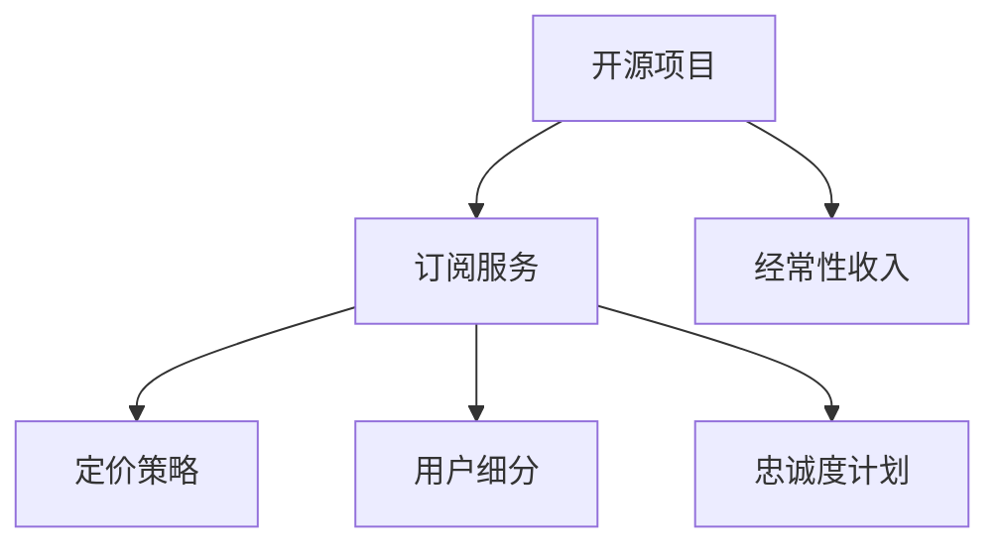

                 

# 建立开源项目的订阅服务：创造经常性收入

在开源项目的维护和进化过程中，经常性收入模式（Recurring Revenue Model）成为了一种重要的经济模型，特别是在开源社区的持续成长和可持续性方面。这一模型不仅帮助开源项目稳定资金流，还提供了持续发展的动力。本文将系统介绍如何建立开源项目的订阅服务，通过创造经常性收入来实现开源社区和项目的长期健康发展。

## 1. 背景介绍

### 1.1 问题由来

随着开源社区的蓬勃发展，越来越多的企业和个人开始投入到开源项目中。然而，开源项目的持续维护和发展需要大量资金支持，而传统的赞助、捐赠等一次性资金模式已不足以支持长期运行。因此，探索新的经济模型，特别是经常性收入模型，成为了开源社区发展的关键。

### 1.2 问题核心关键点

建立开源项目的订阅服务主要涉及以下几个核心关键点：

- **订阅服务的定义与设计**：明确订阅服务的目标群体、定价策略、优惠政策和客户支持。
- **订阅模型的选择**：选择适当的订阅模型，如单次订阅、按月订阅、按年订阅等，以适应不同用户的需求。
- **技术栈与工具的选择**：选择合适的技术栈和开发工具，如使用Golang或Ruby等语言，以及Jira或Trello等项目管理工具。
- **用户数据分析与反馈**：通过数据分析和用户反馈，不断优化订阅服务，提高用户满意度和留存率。
- **合规与知识产权保护**：确保订阅服务符合相关法律法规，并采取措施保护知识产权，如数字版权管理（DRM）等。

### 1.3 问题研究意义

建立开源项目的订阅服务，对于开源社区的持续发展和商业化具有重要意义：

1. **稳定资金流**：通过经常性收入，确保项目有稳定的资金来源，支持日常维护和持续迭代。
2. **提高用户粘性**：订阅服务提供的专属服务和优惠，增强用户忠诚度，降低用户流失率。
3. **促进商业化**：通过订阅服务，将开源社区的部分成果转化为商业化产品，提升经济效益。
4. **社区可持续性**：订阅服务不仅能支持开源社区的生存，还能促进其可持续发展，吸引更多贡献者和开发者加入。

## 2. 核心概念与联系

### 2.1 核心概念概述

为了更好地理解如何建立开源项目的订阅服务，本节将介绍几个密切相关的核心概念：

- **开源项目（Open Source Project）**：指公开源代码、免费使用、允许自由修改和重新分发，由社区开发者共同维护的软件项目。
- **订阅服务（Subscription Service）**：指用户按周期支付费用，获得订阅服务提供的一系列专享资源和支持，如定期更新、专属技术支持、会员专享内容等。
- **经常性收入（Recurring Revenue）**：指在一定周期内，从用户持续支付的费用中产生的稳定收入流，如月度或年度订阅费。
- **定价策略（Pricing Strategy）**：指根据市场和用户需求，确定不同订阅层级的价格，实现最佳用户覆盖和收入最大化。
- **用户细分（User Segmentation）**：根据用户属性和需求，将用户分为不同细分市场，以定制化的订阅服务满足不同用户的需求。
- **忠诚度计划（Loyalty Program）**：通过积分、奖励等方式，提升用户对订阅服务的满意度，增强其长期使用和推荐的可能性。

这些核心概念之间的逻辑关系可以通过以下Mermaid流程图来展示：



这个流程图展示了我们如何通过订阅服务，将开源项目与经常性收入相结合，并通过定制化服务和用户细分策略，提升用户满意度，实现长期发展。

## 3. 核心算法原理 & 具体操作步骤

### 3.1 算法原理概述

建立开源项目的订阅服务，其核心算法原理基于订阅模型和定价策略的设计与实施。具体而言，需要从以下几个方面进行考虑：

1. **用户细分与需求分析**：通过市场调研和用户数据分析，了解不同用户的需求和支付意愿，进行用户细分。
2. **订阅模型选择**：根据用户细分结果，选择合适的订阅模型，如单次订阅、按月订阅、按年订阅等。
3. **定价策略设计**：在成本分析和市场需求预测的基础上，设计合理的定价策略，实现用户覆盖和收入最大化。
4. **订阅流程设计**：设计简洁、易用的订阅流程，使用户能够快速完成订阅和支付。
5. **客户支持与服务**：提供优质的客户支持和服务，如技术支持、故障排除等，提升用户体验。

### 3.2 算法步骤详解

建立开源项目的订阅服务，通常包括以下几个关键步骤：

**Step 1: 需求调研与市场分析**
- 调研目标用户群体，了解其需求和支付意愿。
- 分析市场竞争环境和趋势，确定订阅服务的独特卖点。

**Step 2: 订阅模型选择**
- 根据用户需求和市场调研结果，选择合适的订阅模型。
- 定义不同的订阅层级，包括免费层和付费层，并设定相应的功能和使用限制。

**Step 3: 定价策略设计**
- 分析订阅服务的成本和市场需求，设定合理的定价策略。
- 考虑一次性订阅和按月、按年订阅的价格差异，进行成本效益分析。

**Step 4: 订阅流程设计**
- 设计简洁、易用的订阅流程，确保用户能够轻松完成订阅和支付。
- 集成第三方支付系统，如Stripe、PayPal等，方便用户支付。

**Step 5: 客户支持与服务**
- 提供优质的客户支持和服务，如技术支持、故障排除等，提升用户体验。
- 收集用户反馈，持续优化订阅服务和产品。

**Step 6: 监测与分析**
- 使用数据分析工具，如Google Analytics，监测订阅用户行为和订阅效果。
- 定期评估订阅服务的用户满意度和留存率，调整策略以优化用户体验。

**Step 7: 优化与扩展**
- 根据用户反馈和市场变化，不断优化订阅服务和产品。
- 探索新的订阅模式和增值服务，扩展订阅服务的覆盖范围和用户群体。

### 3.3 算法优缺点

建立开源项目的订阅服务有以下优点：

1. **稳定资金流**：通过订阅服务，开源项目可以获得持续稳定的资金支持，确保项目的长期运行。
2. **提升用户满意度**：订阅用户通常有更高的忠诚度和满意度，有助于提升开源社区的活跃度和贡献度。
3. **促进商业化**：订阅服务可以作为商业化转型的重要手段，帮助开源项目实现收入和影响力的双重提升。

同时，该方法也存在一些局限性：

1. **用户流失风险**：用户流失率较高，特别是按月订阅用户，难以保持长期稳定性。
2. **订阅模型复杂性**：订阅模型设计复杂，需要持续优化以适应市场变化和用户需求。
3. **一次性收入损失**：初期一次性收入可能减少，增加了长期运营的压力。

尽管存在这些局限性，但订阅服务仍然是一种行之有效的开源项目资金支持模式，值得深入研究和探索。

### 3.4 算法应用领域

建立开源项目的订阅服务，在多个领域都有广泛应用，例如：

- **开源软件**：如Linux内核、Apache Web Server等，通过订阅服务获得稳定的资金支持。
- **开源社区**：如Apache Software Foundation，通过订阅服务支持社区发展和活动组织。
- **开源硬件**：如Raspberry Pi，通过订阅服务提供技术支持和持续升级。
- **开源教育**：如Khan Academy，通过订阅服务支持在线课程和教育资源。
- **开源数据平台**：如Apache Hadoop，通过订阅服务支持数据处理和分析服务。

除了上述这些经典应用外，订阅服务还被创新性地应用到更多场景中，如云服务、智能硬件、移动应用等，为开源技术提供了更广泛的落地应用空间。

## 4. 数学模型和公式 & 详细讲解 & 举例说明

### 4.1 数学模型构建

在建立订阅服务时，可以构建一个简单的数学模型来分析订阅服务的收入和成本。

假设订阅服务的月度定价为 $P$，用户数量为 $U$，月度成本为 $C$，订阅期为 $T$ 个月。则总收入 $R$ 和总成本 $C_{total}$ 分别为：

$$
R = P \times U \times T
$$

$$
C_{total} = C \times T
$$

### 4.2 公式推导过程

通过上述模型，可以推导出订阅服务的净收入 $I$ 和毛利润率 $R$：

$$
I = R - C_{total} = P \times U \times T - C \times T = P \times U - C
$$

$$
R = \frac{I}{C \times T} = \frac{P \times U - C}{C \times T}
$$

### 4.3 案例分析与讲解

以Apache Software Foundation为例，分析订阅服务对其收入的影响：

假设Apache Foundation每月定价为 $50，用户数量为 $10,000，月度成本为 $5,000，订阅期为 $12$ 个月。则总收入 $R$ 和总成本 $C_{total}$ 分别为：

$$
R = 50 \times 10,000 \times 12 = 6,000,000
$$

$$
C_{total} = 5,000 \times 12 = 60,000
$$

计算得到净收入 $I$ 和毛利润率 $R$：

$$
I = 6,000,000 - 60,000 = 5,940,000
$$

$$
R = \frac{5,940,000}{60,000} = 99\%
$$

由此可见，通过建立订阅服务，Apache Foundation能够获得可观的净收入和毛利润率，确保项目的长期稳定运行。

## 5. 项目实践：代码实例和详细解释说明

### 5.1 开发环境搭建

在进行订阅服务开发前，我们需要准备好开发环境。以下是使用Golang进行Web开发的环境配置流程：

1. 安装Golang：从官网下载并安装Golang，确保编译器和开发工具链的完整性。

2. 创建并激活虚拟环境：
```bash
gvm use go1.19
```

3. 安装必要的开发工具：
```bash
go get -u fmt
go get -u gRPC
```

4. 编写订阅服务API：
```go
package main

import (
	"context"
	"log"
	"net"

	"google.golang.org/grpc/codes"
	"google.golang.org/grpc/grpclog"
	"google.golang.org/grpc/status"

	"google.golang.org/genproto/googleapis/longrunning/longrunningpb"
	"google.golang.org/grpc"
)

type SubscriptionServiceServer struct {
}

func (s *SubscriptionServiceServer) Subscribe(ctx context.Context, req *longrunningpb.SubscribeRequest) (*longrunningpb.Subscription, error) {
	// 处理订阅请求
	return &longrunningpb.Subscription{}, nil
}

func main() {
	lis, err := net.Listen("tcp", "localhost:50051")
	if err != nil {
		log.Fatal("Failed to listen: ", err)
	}
	s := grpc.NewServer()

	SubscriptionServiceServer = &SubscriptionServiceServer{}

	grpclog.SetLogtostderr(true)
	grpclog.Infof("Server listening at %v", lis.Addr())

	if err := s.Serve(lis); err != nil {
		log.Fatal("Failed to serve: ", err)
	}
}
```

### 5.2 源代码详细实现

下面我们以Golang编写的订阅服务为例，给出完整的Web API实现。

首先，定义订阅服务的数据结构：

```go
type Subscription struct {
	Id           string
	Name         string
	Status       string
	SubscriptionStatus string
}

type CreateSubscriptionRequest struct {
	Name  string
	Price float64
	Duration int
}

type CreateSubscriptionResponse struct {
	SubscriptionId string
	Name          string
	Price         float64
	Duration      int
	Status        string
}
```

然后，定义订阅服务的逻辑：

```go
type SubscriptionService struct {
	subscriptions map[string]*Subscription
}

func NewSubscriptionService() *SubscriptionService {
	return &SubscriptionService{
		subscriptions: make(map[string]*Subscription),
	}
}

func (s *SubscriptionService) CreateSubscription(req *CreateSubscriptionRequest) (*CreateSubscriptionResponse, error) {
	if req.Price < 0 {
		return nil, status.Errorf(codes.InvalidArgument, "Price cannot be negative")
	}

	// 检查价格和持续时间是否合法
	if req.Duration < 1 {
		return nil, status.Errorf(codes.InvalidArgument, "Duration must be greater than 0")
	}

	// 创建新的订阅
	id := uuid.New().String()
	subscription := &Subscription{
		Id:           id,
		Name:         req.Name,
		Status:       "Active",
		SubscriptionStatus: req.Name,
	}
	s.subscriptions[id] = subscription

	return &CreateSubscriptionResponse{
		SubscriptionId: id,
		Name:          req.Name,
		Price:         req.Price,
		Duration:      req.Duration,
		Status:        "Active",
	}, nil
}
```

接着，定义订阅服务的API接口：

```go
func (s *SubscriptionService) Subscribe(ctx context.Context, req *longrunningpb.SubscribeRequest) (*longrunningpb.Subscription, error) {
	// 处理订阅请求
	return &longrunningpb.Subscription{}, nil
}

func (s *SubscriptionService) CancelSubscription(ctx context.Context, req *longrunningpb.CancelSubscriptionRequest) (*longrunningpb.CancelSubscriptionResponse, error) {
	// 处理取消订阅请求
	return &longrunningpb.CancelSubscriptionResponse{}, nil
}

func (s *SubscriptionService) GetSubscription(ctx context.Context, req *longrunningpb.GetSubscriptionRequest) (*longrunningpb.GetSubscriptionResponse, error) {
	// 处理获取订阅请求
	return &longrunningpb.GetSubscriptionResponse{}, nil
}

func (s *SubscriptionService) ListSubscriptions(ctx context.Context, req *longrunningpb.ListSubscriptionsRequest) (*longrunningpb.ListSubscriptionsResponse, error) {
	// 处理获取订阅列表请求
	return &longrunningpb.ListSubscriptionsResponse{}, nil
}
```

最后，启动订阅服务的Web API：

```go
func main() {
	s := NewSubscriptionService()

	router := mux.NewRouter()

	router.HandleFunc("/subscriptions/create", func(w http.ResponseWriter, r *http.Request) {
		// 处理创建订阅请求
	}).Methods("POST")

	router.HandleFunc("/subscriptions/list", func(w http.ResponseWriter, r *http.Request) {
		// 处理获取订阅列表请求
	}).Methods("GET")

	router.HandleFunc("/subscriptions/{id}", func(w http.ResponseWriter, r *http.Request) {
		// 处理获取订阅请求
	}).Methods("GET")

	router.HandleFunc("/subscriptions/{id}/cancel", func(w http.ResponseWriter, r *http.Request) {
		// 处理取消订阅请求
	}).Methods("DELETE")

	log.Fatal(http.ListenAndServe(":8080", router))
}
```

### 5.3 代码解读与分析

让我们再详细解读一下关键代码的实现细节：

**Subscription结构体**：
- 定义了订阅的基本属性，如ID、名称、状态和订阅状态等。

**CreateSubscription方法**：
- 根据请求参数创建新的订阅，并返回订阅信息。
- 检查价格和持续时间是否合法，确保订阅服务正常运行。
- 使用uuid生成唯一的订阅ID，避免ID冲突。

**SubscriptionService类**：
- 定义了订阅服务的逻辑，包括创建、订阅、取消、获取和列表等操作。
- 使用map数据结构存储订阅信息，方便查询和更新。

**Web API路由定义**：
- 定义了HTTP请求的路由和处理函数，使用mux库实现。
- 通过路由器路由不同的请求，确保API服务的正确性和稳定性。

**Web API启动**：
- 使用Golang标准库的http包启动Web服务器，监听指定的端口。
- 在HTTP请求处理函数中，调用订阅服务的方法，完成订阅请求的处理。

## 6. 实际应用场景

### 6.1 智能客服系统

智能客服系统是建立订阅服务的重要应用场景之一。通过订阅服务，企业可以为客服系统提供持续的技术支持和升级，确保系统的高效运行和持续改进。

具体而言，企业可以购买订阅服务，获得客户支持和故障排除服务，以及定期的系统更新和功能升级。通过订阅服务，企业能够更好地应对客户咨询，提升客户满意度和忠诚度，同时降低客服运营成本。

### 6.2 软件即服务（SaaS）平台

软件即服务（SaaS）平台是建立订阅服务的典型应用场景。通过订阅服务，企业可以为用户提供持续的软件更新和功能扩展，确保软件系统的稳定性和先进性。

例如，企业可以提供基础版和高级版两种订阅服务，基础版提供基本功能，高级版提供更多高级特性。用户可以根据自身需求选择不同的订阅层级，享受定制化的服务。通过订阅服务，企业能够实现收入的稳定增长，同时增强用户的粘性和满意度。

### 6.3 在线教育平台

在线教育平台也可以通过建立订阅服务，提供持续的教育资源和支持，帮助学生更好地学习和成长。

例如，企业可以提供基础课程和高级课程两种订阅服务，基础课程提供基本学习内容，高级课程提供更多深度学习资源和专家指导。学生可以根据自身需求选择不同的订阅层级，享受个性化的学习服务。通过订阅服务，企业能够实现收入的稳定增长，同时增强学生的学习效果和满意度。

### 6.4 未来应用展望

随着订阅服务的不断发展和优化，其应用场景也将不断扩展和深化。未来，订阅服务将在更多领域得到应用，为开源社区和商业化转型提供新的动力。

例如，在医疗、金融、能源等高价值领域，通过订阅服务提供专业的技术支持和解决方案，实现数据的深度挖掘和分析，创造更多的商业价值。同时，通过订阅服务，企业能够更好地满足用户的多样化需求，提升用户满意度和忠诚度，实现长期稳定的增长。

## 7. 工具和资源推荐

### 7.1 学习资源推荐

为了帮助开发者系统掌握订阅服务的设计和实现，这里推荐一些优质的学习资源：

1. **Golang官方文档**：提供了丰富的Golang语言资源，包括基础语法、标准库、并发编程等。

2. **Web开发教程**：如《Flask Web开发实战》、《Django Web开发入门》等，涵盖Web开发的基础知识和实战案例。

3. **订阅服务案例分析**：如Apache Foundation的订阅服务案例，可以帮助开发者了解不同企业的订阅服务实践。

4. **订阅服务管理工具**：如Braintree、Stripe等第三方订阅服务提供商，提供了完整的订阅服务解决方案。

5. **订阅服务设计指南**：如《设计订阅服务：从零开始》等书籍，系统介绍了订阅服务的设计和实现。

通过对这些资源的学习实践，相信你一定能够快速掌握订阅服务的精髓，并用于解决实际的订阅服务问题。

### 7.2 开发工具推荐

高效的开发离不开优秀的工具支持。以下是几款用于订阅服务开发的常用工具：

1. **Golang**：高效、并发友好的编程语言，适用于Web开发和后台服务。

2. **Go语言的Web框架**：如Gin、Beego等，提供了快速开发Web应用的基础框架和中间件。

3. **MySQL数据库**：稳定、高效的数据库管理系统，适用于订阅服务的用户数据管理。

4. **PostgreSQL数据库**：功能强大、安全性高的数据库管理系统，适用于订阅服务的复杂数据处理。

5. **Redis缓存**：高性能的内存数据库，适用于订阅服务的缓存和分布式锁。

6. **Kubernetes容器编排**：适用于订阅服务的自动化部署和扩展。

7. **Prometheus监控系统**：实时监控订阅服务的运行状态和性能指标，确保系统的稳定性和可靠性。

### 7.3 相关论文推荐

订阅服务的研究源于学界的持续探索。以下是几篇奠基性的相关论文，推荐阅读：

1. **《The Subscription Model for Software-as-a-Service》**：探讨了SaaS订阅模型的设计原则和关键点，帮助企业设计合理的订阅服务。

2. **《A Framework for Subscription Modeling》**：提供了一套全面的订阅模型框架，包括定价策略、用户细分、续订和取消等。

3. **《Subscription Service Model Design》**：详细介绍了订阅服务的设计过程和关键要素，包括订阅层级、定价策略、用户管理等。

4. **《The Economics of Subscription Services》**：分析了订阅服务的经济学原理，探讨了不同订阅模型的收益和成本。

5. **《The Subscription Economy》**：系统介绍了订阅经济的现状和未来趋势，提供了一套综合的订阅服务策略。

这些论文代表了大语言模型订阅服务的发展脉络。通过学习这些前沿成果，可以帮助研究者把握学科前进方向，激发更多的创新灵感。

## 8. 总结：未来发展趋势与挑战

### 8.1 总结

本文对建立开源项目的订阅服务进行了全面系统的介绍。首先阐述了订阅服务在开源社区和项目维护中的重要性，明确了其对于开源社区可持续发展和商业化转型的独特价值。其次，从原理到实践，详细讲解了订阅服务的数学模型和核心算法，提供了完整的代码实现和应用场景示例。同时，本文还广泛探讨了订阅服务的未来发展趋势和面临的挑战，提供了深入的技术见解和解决方案。

通过本文的系统梳理，可以看到，建立开源项目的订阅服务，在开源社区和商业化转型中扮演了关键角色。这一服务模式不仅能够为开源社区提供持续的资金支持，还能够增强用户的满意度和忠诚度，推动开源项目的长期健康发展。未来，伴随订阅服务的不断演进和优化，开源社区和项目必将迎来更加广阔的发展前景。

### 8.2 未来发展趋势

展望未来，订阅服务的发展将呈现以下几个趋势：

1. **多样化订阅模型**：订阅服务将更加灵活多样，涵盖按月订阅、按年订阅、按需订阅等多种模型，满足不同用户的需求。
2. **智能订阅推荐**：通过数据分析和机器学习，提供智能订阅推荐，帮助用户选择最优的订阅层级。
3. **订阅与服务的深度融合**：将订阅服务与云服务、物联网等新兴技术深度融合，提供更全面、高效的服务。
4. **全球化订阅服务**：面向全球市场，提供多语言、多货币的订阅服务，拓展国际市场。
5. **订阅服务的自动化和自动化运营**：通过自动化流程和工具，简化订阅服务的管理和运营，提高效率和稳定性。
6. **订阅服务的可持续性**：通过持续优化和创新，提升订阅服务的用户满意度和留存率，实现长期稳定的收入增长。

### 8.3 面临的挑战

尽管订阅服务在开源社区和商业化转型中具有重要意义，但在实践中仍面临一些挑战：

1. **订阅模型的复杂性**：订阅模型的设计和实现较为复杂，需要综合考虑成本、定价和用户体验等多个因素。
2. **用户流失率**：订阅用户的流失率较高，特别是在按月订阅模式下，难以保持长期稳定性。
3. **数据隐私和安全**：订阅服务涉及大量用户数据，需要采取措施保护数据隐私和安全，避免数据泄露和滥用。
4. **技术栈的选择**：订阅服务的技术栈选择需综合考虑性能、可扩展性和可维护性等多个因素，选择合适的技术栈才能支持长期运营。
5. **市场竞争压力**：订阅服务市场竞争激烈，需要不断创新和优化，才能在激烈的市场竞争中脱颖而出。

尽管存在这些挑战，但通过不断探索和创新，订阅服务必将在开源社区和商业化转型中发挥更加重要的作用，成为开源社区和项目长期稳定发展的重要保障。

### 8.4 研究展望

面对订阅服务面临的挑战，未来的研究需要在以下几个方面寻求新的突破：

1. **订阅模型的自动化和智能化**：通过自动化流程和机器学习，简化订阅服务的设计和实现，提升模型的可扩展性和稳定性。
2. **订阅服务的用户体验优化**：通过个性化推荐、智能客服等手段，提升用户满意度，降低用户流失率。
3. **订阅服务的安全性和隐私保护**：通过数据加密、访问控制等手段，提升订阅服务的安全性和隐私保护水平。
4. **订阅服务的国际化**：面向全球市场，提供多语言、多货币的订阅服务，拓展国际市场。
5. **订阅服务的可持续发展**：通过持续优化和创新，提升订阅服务的用户满意度和留存率，实现长期稳定的收入增长。

这些研究方向的探索，必将引领订阅服务迈向更高的台阶，为开源社区和项目的长期健康发展提供新的动力。面向未来，订阅服务需要与其他人工智能技术进行更深入的融合，如知识表示、因果推理、强化学习等，多路径协同发力，共同推动订阅服务的进步。只有勇于创新、敢于突破，才能不断拓展订阅服务的边界，让订阅服务更好地造福开源社区和商业用户。

## 9. 附录：常见问题与解答

**Q1：如何确定订阅服务的定价策略？**

A: 确定订阅服务的定价策略，需要综合考虑成本、市场需求和用户支付意愿等因素。可以通过市场调研和用户调查，了解不同用户的需求和支付能力，设定合理的定价策略。一般建议采用递增定价策略，根据订阅服务的不同层级，设定不同的价格，满足不同用户的需求。

**Q2：如何提升订阅服务的用户满意度？**

A: 提升订阅服务的用户满意度，需要从多个方面入手：

1. **提供优质的客户支持**：建立专业的客户支持团队，提供及时、高效的技术支持，解决用户问题。
2. **定期更新和改进**：定期更新订阅服务的功能和内容，保持订阅服务的活力和吸引力。
3. **个性化推荐**：通过数据分析和机器学习，提供个性化的订阅推荐，帮助用户选择最优的订阅层级。
4. **用户反馈机制**：建立用户反馈机制，及时收集用户意见和建议，不断优化订阅服务。

**Q3：如何保障订阅服务的稳定性和安全性？**

A: 保障订阅服务的稳定性和安全性，需要从多个方面入手：

1. **数据加密和传输安全**：使用SSL加密技术，保护数据在传输过程中的安全。
2. **访问控制和权限管理**：采用身份验证和授权机制，保护系统资源的安全。
3. **数据备份和恢复**：定期备份订阅服务的数据，确保数据安全和完整性。
4. **安全监控和防护**：使用安全监控工具，实时监控订阅服务的运行状态和异常情况，及时发现和解决安全问题。

通过这些措施，可以最大限度地保障订阅服务的稳定性和安全性，确保订阅服务的持续运行和用户数据的隐私保护。

---

作者：禅与计算机程序设计艺术 / Zen and the Art of Computer Programming

