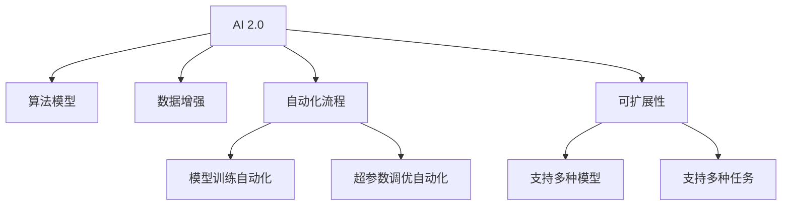

                 

# 开发工具：提高 AI 2.0 应用开发效率

## 1. 背景介绍

### 1.1 问题由来
随着人工智能(AI)技术在各行各业的应用深入，越来越多的企业和组织开始尝试将AI技术落地，提升自身业务效率和竞争力。然而，AI应用的开发和部署涉及算法模型训练、数据处理、系统集成等多个环节，流程复杂，成本高昂。如何提高AI应用的开发效率，降低开发成本，成为当前AI应用开发中的一个重要议题。

### 1.2 问题核心关键点
提高AI应用开发效率的核心在于选择和利用合适的开发工具，优化模型训练流程，提高算法调优效率，实现快速迭代和无缝部署。具体的关键点包括：

- **高效算法和模型选择**：选择合适的算法和模型，确保其在特定任务上具有高效性和泛化能力。
- **数据处理和增强**：高效处理和增强数据，保证模型训练质量。
- **自动化流程**：通过自动化工具，优化模型训练和评估流程，提高开发效率。
- **易用性**：选择易于使用的开发工具，降低技术门槛，促进团队协作。
- **可扩展性**：开发工具应支持多种模型和任务，具备良好的可扩展性。

### 1.3 问题研究意义
提高AI应用开发效率对于推动AI技术在各行业的普及具有重要意义：

1. **降低开发成本**：使用高效开发工具，可以显著减少开发所需的时间和人力成本，加速模型上线。
2. **提升模型效果**：优化训练流程，提高算法调优效率，能够提升模型的性能和效果。
3. **促进技术创新**：高效的开发环境能够支持快速实验和验证新算法，推动技术创新。
4. **增强应用可扩展性**：支持多种模型和任务的开发工具，有助于构建更灵活、可扩展的AI应用系统。
5. **加速行业应用**：高效的开发工具能够促进AI技术在各行各业的应用落地，驱动行业变革。

## 2. 核心概念与联系

### 2.1 核心概念概述

为更好地理解如何提高AI应用开发效率，本节将介绍几个密切相关的核心概念：

- **AI 2.0**：继第一代AI以机器学习算法为核心，第二代AI以深度学习为主，AI 2.0则强调模型集成、协同学习、多模态融合等技术手段，进一步提升AI系统的智能水平和应用效果。
- **算法模型**：如Transformer、BERT等，是AI应用的核心组成部分，决定了模型的性能和效果。
- **数据增强**：通过数据扩充、数据清洗等技术，提高训练数据的质量和多样性。
- **自动化流程**：包括模型训练自动化、超参数调优自动化等，减少人工干预，提高开发效率。
- **可扩展性**：指开发工具和框架能否支持多种模型和任务，实现灵活扩展。

这些核心概念之间的逻辑关系可以通过以下Mermaid流程图来展示：



这个流程图展示了我AI 2.0应用的开发过程中各关键组件及其之间的关系：

1. AI 2.0系统通过算法模型和数据增强获得基础能力。
2. 自动化流程，特别是模型训练和超参数调优，优化了开发效率。
3. 可扩展性使得系统能够灵活支持多种模型和任务。

## 3. 核心算法原理 & 具体操作步骤
### 3.1 算法原理概述

提高AI应用开发效率的关键在于选择和使用高效的算法和模型，通过优化数据处理和训练流程，实现快速迭代和无缝部署。具体的算法原理如下：

- **高效算法和模型选择**：选择高效、泛化能力强的算法和模型，如Transformer、BERT等，能够提升模型的性能和效果。
- **数据增强**：通过数据扩充、数据清洗等技术，提高训练数据的质量和多样性，提升模型的泛化能力。
- **自动化流程**：利用自动化工具，如TensorFlow、PyTorch等，优化模型训练和评估流程，减少人工干预，提高开发效率。
- **可扩展性**：选择可扩展性强的开发工具和框架，支持多种模型和任务，实现灵活扩展。

### 3.2 算法步骤详解

提高AI应用开发效率的算法步骤主要包括以下几个环节：

**Step 1: 选择合适的开发工具**
- 根据任务需求，选择合适的开发工具和框架，如TensorFlow、PyTorch、Scikit-learn等。
- 评估工具的性能、易用性和可扩展性，选择最符合需求的开发环境。

**Step 2: 数据预处理和增强**
- 收集和清洗训练数据，处理缺失值、噪声等数据问题。
- 通过数据增强技术，扩充训练数据，如数据扩充、回译、数据增强模型等。
- 使用数据增强工具，如ImageDataGenerator、DataAugmentor等，提高数据多样性。

**Step 3: 模型训练和调优**
- 选择合适的模型和算法，进行预训练和微调。
- 使用自动化工具，如Keras Tuner、Hyperopt等，自动搜索最优超参数。
- 通过并行计算和分布式训练，提高模型训练速度。

**Step 4: 模型评估和部署**
- 使用测试集对模型进行评估，验证模型效果。
- 优化模型部署流程，利用容器化工具如Docker，实现快速部署。
- 在生产环境中进行持续监控和优化，保证系统稳定性。

### 3.3 算法优缺点

提高AI应用开发效率的算法和工具具有以下优点：
1. 提升模型效果：高效算法和模型选择能够显著提升模型性能，更好地适应特定任务。
2. 降低开发成本：自动化流程和数据增强能够减少人工干预，提高开发效率。
3. 促进技术创新：支持快速实验和验证新算法，推动技术创新。
4. 增强系统可扩展性：可扩展性强的开发工具和框架，能够灵活支持多种模型和任务。

同时，这些工具和方法也存在一定的局限性：
1. 依赖高质量数据：数据增强和自动化流程需要高质量的标注数据，获取数据成本较高。
2. 需要技术背景：高效工具和算法需要一定的技术背景，对开发者要求较高。
3. 存在性能瓶颈：在大规模模型训练和部署时，可能面临性能瓶颈，需要优化资源配置。
4. 可解释性不足：某些自动化工具可能缺乏可解释性，难以理解模型决策过程。

尽管存在这些局限性，但通过合理选择和应用高效的开发工具，能够显著提升AI应用的开发效率和效果。

### 3.4 算法应用领域

提高AI应用开发效率的算法和工具在多个领域都有广泛应用，包括但不限于：

- **自然语言处理(NLP)**：如文本分类、情感分析、机器翻译等任务，通过优化数据处理和模型训练，实现快速迭代。
- **计算机视觉(CV)**：如图像识别、目标检测、图像生成等任务，通过数据增强和模型优化，提升模型效果。
- **推荐系统**：如电商平台推荐、新闻推荐等，通过自动化流程和模型调优，提高推荐效果和用户体验。
- **医疗健康**：如疾病诊断、基因分析等，通过优化数据处理和模型训练，提高诊断准确性。
- **金融风控**：如信用评分、欺诈检测等，通过高效工具和模型选择，提升风控效果。

这些领域展示了提高AI应用开发效率的广泛应用前景，推动了AI技术的深入发展和实际落地。

## 4. 数学模型和公式 & 详细讲解 & 举例说明

### 4.1 数学模型构建

提高AI应用开发效率的数学模型主要围绕数据增强和自动化流程进行构建。以下给出数据增强和模型训练的数学模型及其构建过程。

**数据增强数学模型**：
- 假设原始训练数据为 $\{(x_i, y_i)\}_{i=1}^N$，其中 $x_i$ 为输入样本，$y_i$ 为标签。
- 通过数据增强，生成增强后的数据 $\{x'_i, y'_i\}_{i=1}^M$，其中 $M$ 为增强后的样本数。
- 数据增强方式包括数据扩充、回译、数据增强模型等，具体增强方式可以根据任务需求进行选择。

**模型训练数学模型**：
- 假设增强后的训练数据为 $\{x'_i, y'_i\}_{i=1}^M$，模型参数为 $\theta$。
- 模型训练目标为最小化损失函数 $\mathcal{L}(\theta)$。
- 常见的损失函数包括交叉熵损失、均方误差损失等。

### 4.2 公式推导过程

以下对数据增强和模型训练的公式推导过程进行详细讲解。

**数据增强公式推导**：
- 假设数据增强方式为数据扩充，生成增强后的样本 $x'_i$ 为原始样本 $x_i$ 的变换，如旋转、翻转等。
- 假设损失函数为交叉熵损失，则增强后的损失函数为：
$$
\mathcal{L}_{enh}(\theta) = -\frac{1}{M}\sum_{i=1}^M \sum_{j=1}^C y'_i \log \sigma(\theta \cdot x'_i)
$$
其中 $\sigma(\cdot)$ 为激活函数，$C$ 为类别数。

**模型训练公式推导**：
- 假设使用梯度下降优化算法，则模型参数更新公式为：
$$
\theta \leftarrow \theta - \eta \nabla_{\theta}\mathcal{L}(\theta)
$$
其中 $\eta$ 为学习率，$\nabla_{\theta}\mathcal{L}(\theta)$ 为损失函数对模型参数的梯度。

**案例分析与讲解**：
- 以图像分类任务为例，使用数据增强技术，将原始图像进行随机裁剪、翻转、旋转等处理，生成增强后的图像。通过训练生成后的图像，模型可以学习到更多的数据分布特征，提升泛化能力。
- 使用自动化调参工具，如Keras Tuner，自动搜索最优超参数，如学习率、批量大小等，提高模型训练效率。
- 通过并行计算和分布式训练，利用多机多卡，提升模型训练速度，减少单次训练时间。

## 5. 项目实践：代码实例和详细解释说明
### 5.1 开发环境搭建

在进行AI应用开发前，我们需要准备好开发环境。以下是使用Python进行TensorFlow开发的环境配置流程：

1. 安装Anaconda：从官网下载并安装Anaconda，用于创建独立的Python环境。

2. 创建并激活虚拟环境：
```bash
conda create -n tf-env python=3.8 
conda activate tf-env
```

3. 安装TensorFlow：根据CUDA版本，从官网获取对应的安装命令。例如：
```bash
conda install tensorflow -c tf -c conda-forge
```

4. 安装TensorBoard：用于可视化模型训练和评估过程，查看损失函数、精度等指标。

5. 安装TensorFlow Addons：提供更多高级功能和组件，如分布式训练、TFRecords等。

完成上述步骤后，即可在`tf-env`环境中开始AI应用开发。

### 5.2 源代码详细实现

下面我以图像分类任务为例，给出使用TensorFlow对ResNet模型进行训练的PyTorch代码实现。

首先，定义数据处理函数：

```python
import tensorflow as tf
from tensorflow.keras.preprocessing.image import ImageDataGenerator

def preprocess_image(x):
    x = tf.image.resize(x, [224, 224])
    x = tf.image.per_image_standardization(x)
    return x

def load_data(path, batch_size):
    train_datagen = ImageDataGenerator(
        preprocessing_function=preprocess_image,
        rescale=1./255,
        shear_range=0.2,
        zoom_range=0.2,
        horizontal_flip=True,
        validation_split=0.2
    )
    train_generator = train_datagen.flow_from_directory(
        path,
        target_size=(224, 224),
        batch_size=batch_size,
        class_mode='categorical',
        subset='training'
    )
    val_generator = train_datagen.flow_from_directory(
        path,
        target_size=(224, 224),
        batch_size=batch_size,
        class_mode='categorical',
        subset='validation'
    )
    return train_generator, val_generator
```

然后，定义模型和优化器：

```python
import tensorflow.keras as keras

model = keras.applications.ResNet50(
    input_shape=(224, 224, 3),
    include_top=False,
    weights='imagenet',
    pooling='avg'
)

model.compile(
    optimizer=keras.optimizers.Adam(),
    loss='categorical_crossentropy',
    metrics=['accuracy']
)
```

接着，定义训练和评估函数：

```python
from tensorflow.keras.callbacks import EarlyStopping

def train_epoch(model, train_generator, val_generator, batch_size, optimizer):
    model.fit(
        train_generator,
        validation_data=val_generator,
        epochs=10,
        steps_per_epoch=len(train_generator),
        validation_steps=len(val_generator),
        callbacks=[EarlyStopping(patience=3)]
    )

def evaluate(model, test_generator, batch_size):
    model.evaluate(
        test_generator,
        steps=len(test_generator)
    )
```

最后，启动训练流程并在测试集上评估：

```python
batch_size = 32

train_generator, val_generator = load_data('path/to/dataset', batch_size)
test_generator = load_data('path/to/testset', batch_size)

train_epoch(model, train_generator, val_generator, batch_size, optimizer)
evaluate(model, test_generator, batch_size)
```

以上就是使用TensorFlow对ResNet模型进行图像分类任务微调的完整代码实现。可以看到，得益于TensorFlow的强大封装，我们可以用相对简洁的代码完成模型的加载和微调。

### 5.3 代码解读与分析

让我们再详细解读一下关键代码的实现细节：

**preprocess_image函数**：
- 定义了对输入图像的处理函数，包括图像大小缩放、标准化等预处理操作。

**load_data函数**：
- 使用ImageDataGenerator，对训练数据进行增强处理，包括随机裁剪、翻转、旋转等。
- 使用.flow_from_directory方法，从文件夹中加载图像，并进行数据增强和预处理。

**model.compile函数**：
- 定义了模型的优化器、损失函数和评估指标。
- 使用Adam优化器和交叉熵损失函数，评估指标为准确率。

**train_epoch函数**：
- 使用fit方法，对模型进行训练。
- 设置EarlyStopping回调，避免模型过拟合。

**evaluate函数**：
- 使用evaluate方法，对模型进行评估，并输出评估结果。

**训练流程**：
- 设置批量大小，加载训练和测试数据集。
- 在训练集上调用train_epoch函数进行模型训练。
- 在测试集上调用evaluate函数进行模型评估。

可以看出，TensorFlow的API设计简洁高效，能够大大降低模型开发和调优的难度，提高开发效率。

## 6. 实际应用场景
### 6.1 智能推荐系统

智能推荐系统是提高AI应用开发效率的一个重要场景。传统的推荐系统通常依赖于用户历史行为数据进行推荐，无法捕捉用户的隐性偏好和实时动态变化。使用基于AI的推荐系统，可以实时分析用户行为数据，预测用户偏好，实现个性化推荐。

在实践中，可以收集用户的浏览、点击、购买等行为数据，提取物品的特征向量，使用数据增强技术提高模型泛化能力。通过优化模型训练流程，利用自动化调参工具搜索最优超参数，快速迭代模型效果。最终，部署优化后的模型，实现实时推荐服务。

### 6.2 金融风险预测

金融风险预测是另一个典型的应用场景。金融机构需要实时监测市场动态，预测金融风险，规避潜在的金融风险。使用基于AI的风险预测系统，可以实时分析海量数据，快速发现异常情况，提供预警服务。

在实践中，可以收集金融市场的历史数据和实时数据，提取特征，构建训练集和测试集。通过优化模型训练流程，使用自动化调参工具搜索最优超参数，快速迭代模型效果。最终，部署优化后的模型，实现实时风险预测服务。

### 6.3 医疗影像诊断

医疗影像诊断是AI应用的另一个重要领域。传统的影像诊断需要耗费大量时间和精力，且准确率较低。使用基于AI的影像诊断系统，可以自动分析医疗影像，提高诊断准确率。

在实践中，可以收集医疗影像数据，提取特征，构建训练集和测试集。通过优化模型训练流程，使用自动化调参工具搜索最优超参数，快速迭代模型效果。最终，部署优化后的模型，实现实时影像诊断服务。

### 6.4 未来应用展望

随着AI技术的不断发展，基于AI的应用开发效率将不断提高，带来更多的应用场景。未来，AI 2.0技术将广泛应用于更多领域，如自动驾驶、智慧城市、智能家居等，推动各行各业的数字化转型。

## 7. 工具和资源推荐
### 7.1 学习资源推荐

为了帮助开发者系统掌握AI 2.0技术，提高AI应用开发效率，这里推荐一些优质的学习资源：

1. **TensorFlow官方文档**：提供了完整的TensorFlow教程和API文档，是学习TensorFlow的最佳资源。
2. **PyTorch官方文档**：提供了详细的PyTorch教程和API文档，是学习深度学习框架的重要资源。
3. **Scikit-learn官方文档**：提供了丰富的机器学习算法和工具，是学习机器学习的基础资源。
4. **Coursera深度学习课程**：由斯坦福大学、密歇根大学等知名大学提供的深度学习课程，是系统学习深度学习的重要资源。
5. **Kaggle竞赛平台**：提供了大量的数据集和竞赛任务，是学习数据增强和模型优化的好地方。

通过对这些资源的学习实践，相信你一定能够快速掌握AI 2.0技术的精髓，并用于解决实际的AI应用问题。

### 7.2 开发工具推荐

高效的开发离不开优秀的工具支持。以下是几款用于AI 2.0应用开发的常用工具：

1. **TensorFlow**：由Google主导开发的深度学习框架，提供了丰富的API和工具，支持分布式训练和模型部署。
2. **PyTorch**：由Facebook主导开发的深度学习框架，灵活性高，支持动态计算图和分布式训练。
3. **Keras**：高层次的深度学习API，易于使用，支持多种深度学习框架和预训练模型。
4. **Scikit-learn**：提供了丰富的机器学习算法和工具，支持数据预处理、特征提取和模型评估。
5. **Jupyter Notebook**：支持Python和多种科学计算库的交互式开发环境，方便代码调试和实验。

合理利用这些工具，可以显著提升AI 2.0应用的开发效率，加快创新迭代的步伐。

### 7.3 相关论文推荐

AI 2.0技术的发展源于学界的持续研究。以下是几篇奠基性的相关论文，推荐阅读：

1. **《ImageNet Classification with Deep Convolutional Neural Networks》**：AlexNet论文，提出了深度卷积神经网络，奠定了深度学习的基础。
2. **《TensorFlow: A System for Large-Scale Machine Learning》**：介绍TensorFlow框架的设计和应用，是学习TensorFlow的重要资源。
3. **《Deep Learning with PyTorch: AI Research with Python》**：介绍了PyTorch的原理和应用，是学习PyTorch的重要资源。
4. **《Scikit-learn: Machine Learning in Python》**：介绍了Scikit-learn库的原理和应用，是学习机器学习的重要资源。
5. **《A Survey of Recent Techniques in Transfer Learning》**：总结了当前最新的迁移学习技术，是学习迁移学习的参考资料。

这些论文代表了大语言模型微调技术的发展脉络。通过学习这些前沿成果，可以帮助研究者把握学科前进方向，激发更多的创新灵感。

## 8. 总结：未来发展趋势与挑战
### 8.1 总结

本文对提高AI 2.0应用开发效率的方法进行了全面系统的介绍。首先阐述了提高开发效率的关键在于选择合适的开发工具和算法，优化数据处理和训练流程，实现快速迭代和无缝部署。其次，从原理到实践，详细讲解了优化数据处理、模型训练和自动化流程的具体方法和步骤，给出了AI应用开发的完整代码实例。同时，本文还广泛探讨了AI 2.0技术在多个领域的应用前景，展示了AI 2.0技术的广阔前景。

通过本文的系统梳理，可以看到，提高AI 2.0应用开发效率对于推动AI技术在各行业的普及具有重要意义。技术发展需要工程实践的不断打磨，只有从数据、算法、工程、业务等多个维度协同发力，才能真正实现AI 2.0技术的广泛落地。

### 8.2 未来发展趋势

展望未来，提高AI 2.0应用开发效率的技术将呈现以下几个发展趋势：

1. **自动化调参技术的发展**：未来的自动化调参工具将更加智能和灵活，能够自动搜索最优超参数，优化模型训练流程。
2. **分布式训练和模型优化**：分布式训练和模型优化技术将更加成熟，支持大规模模型的训练和部署，提升模型性能和效率。
3. **多模态数据融合技术**：未来的AI 2.0系统将支持多种模态数据的融合，提升模型的全面性和鲁棒性。
4. **模型可解释性和透明性**：未来的AI 2.0系统将更加注重模型的可解释性和透明性，增强系统的可信任度。
5. **实时计算和推理技术**：未来的AI 2.0系统将支持实时计算和推理，实现动态调整和快速响应。

以上趋势凸显了提高AI 2.0应用开发效率的技术前景，这些方向的探索发展，必将进一步提升AI 2.0系统的性能和应用范围，为经济社会发展注入新的动力。

### 8.3 面临的挑战

尽管提高AI 2.0应用开发效率的技术已经取得了不小的进展，但在迈向更加智能化、普适化应用的过程中，它仍面临着诸多挑战：

1. **数据质量和多样性**：高质量、多样化的数据是提高模型性能的关键，如何获取和处理数据成为挑战。
2. **计算资源瓶颈**：大规模模型的训练和部署需要高性能计算资源，如何优化资源配置，提升系统性能。
3. **模型可解释性**：AI 2.0系统需要具备更高的可解释性，以便于理解和调试。
4. **安全性与隐私保护**：AI 2.0系统需要考虑数据安全与隐私保护，防止模型被恶意使用。
5. **实时计算与推理**：如何在保证模型性能的同时，实现实时计算和推理，提升系统响应速度。

面对这些挑战，未来的研究需要在技术、伦理、业务等多个层面进行突破，确保AI 2.0技术的应用和发展能够符合社会需求和伦理标准。

### 8.4 研究展望

面对未来AI 2.0技术的发展趋势和面临的挑战，研究者需要在以下几个方面寻求新的突破：

1. **自动化调参技术的优化**：开发更加智能、高效的自动化调参工具，实现更快速的模型训练和调优。
2. **分布式训练和模型优化技术**：研发更高效的分布式训练和模型优化技术，支持大规模模型的训练和部署。
3. **多模态数据融合技术**：开发支持多种模态数据融合的技术，提升模型的全面性和鲁棒性。
4. **模型可解释性和透明性技术**：开发可解释性强的模型和工具，增强系统的可信任度和透明度。
5. **安全性与隐私保护技术**：研发更加安全、可控的AI 2.0系统，保护数据安全与隐私。

这些研究方向的探索，必将引领AI 2.0技术迈向更高的台阶，为构建安全、可靠、可解释、可控的智能系统铺平道路。面向未来，AI 2.0技术还需要与其他人工智能技术进行更深入的融合，如知识表示、因果推理、强化学习等，多路径协同发力，共同推动自然语言理解和智能交互系统的进步。只有勇于创新、敢于突破，才能不断拓展AI 2.0的边界，让智能技术更好地造福人类社会。

## 9. 附录：常见问题与解答

**Q1：如何选择适合的开源框架？**

A: 选择适合的开源框架需要考虑多个因素，包括任务类型、数据规模、计算资源、开发团队的技术背景等。常见框架如TensorFlow、PyTorch、Scikit-learn等各有所长，建议根据具体情况进行选择。

**Q2：如何提高模型训练速度？**

A: 提高模型训练速度可以从以下几个方面入手：
1. 使用分布式训练，将训练任务分配到多个计算节点，提升训练效率。
2. 使用混合精度训练，将模型参数和梯度转换为定点数，减少内存占用和计算量。
3. 使用数据增强技术，增加训练数据的多样性，提升模型泛化能力。
4. 使用高效的优化器算法，如Adam、Adagrad等，提升训练速度和稳定性。

**Q3：如何优化模型部署流程？**

A: 优化模型部署流程可以从以下几个方面入手：
1. 使用模型压缩技术，减少模型大小，提升推理速度。
2. 使用模型量化技术，将浮点模型转换为定点模型，减少内存占用和计算量。
3. 使用容器化技术，如Docker，将模型打包为可移植的镜像，方便部署和维护。
4. 使用模型微调技术，根据实际需求对模型进行微调，优化模型效果。

**Q4：如何提高模型的可解释性？**

A: 提高模型的可解释性可以从以下几个方面入手：
1. 使用可解释的模型结构，如决策树、规则模型等，易于解释和理解。
2. 使用可解释的算法，如LIME、SHAP等，提供模型决策的局部解释。
3. 使用模型可视化工具，如TensorBoard、ModelScope等，可视化模型的训练过程和结果。
4. 提供模型透明性，确保模型决策符合伦理和法律要求。

这些问题的回答，希望能够帮助开发者更好地理解和应用AI 2.0技术，推动AI技术在各行业的落地和应用。

---

作者：禅与计算机程序设计艺术 / Zen and the Art of Computer Programming

