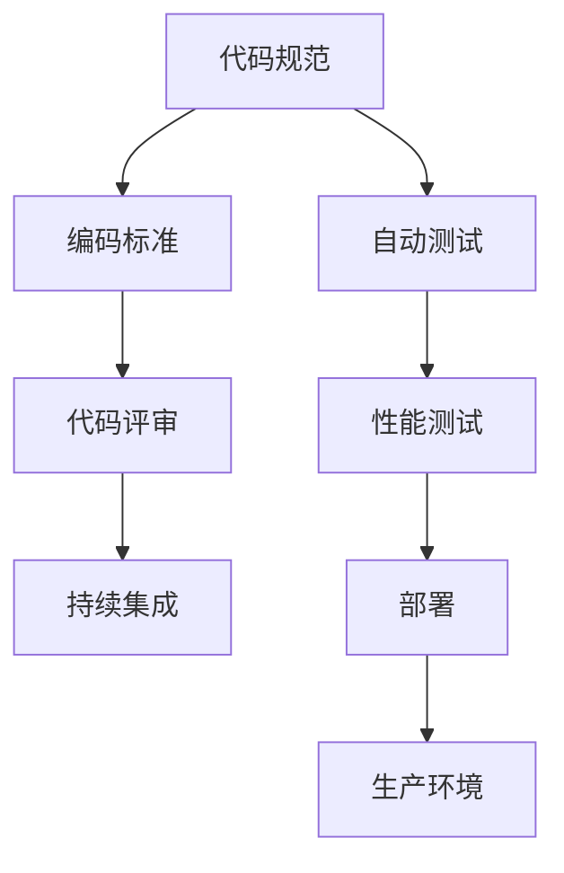

                 

# 开发规范与编码标准原理与代码实战案例讲解

> 关键词：开发规范,编码标准,代码实战,案例讲解,编程实践

## 1. 背景介绍

### 1.1 问题由来
在软件开发中，代码规范与编码标准一直是一个永恒的话题。随着项目规模的扩大和团队成员的增加，代码的一致性和可读性变得尤为重要。一个良好的开发规范和编码标准，能够有效提升团队协作效率，减少代码维护成本，防止潜在代码质量问题。特别是在面对大型系统或开源项目时，规范化显得更加必要。

然而，当前许多开发者对于如何制定和遵循代码规范与编码标准仍存在一定的困惑。一方面，开发者希望通过编写清晰、易于维护的代码，提升工作效率和项目质量。另一方面，由于不同项目、团队之间的风格和习惯差异，难以达成一致的规范和标准，导致代码风格杂乱，维护困难。

本文将从开发规范与编码标准的原理、操作实践以及实际案例三个层面展开讲解，帮助开发者更好地理解和应用代码规范与编码标准，以提升代码质量和项目管理能力。

## 2. 核心概念与联系

### 2.1 核心概念概述

为更好地理解代码规范与编码标准，我们首先介绍几个关键概念：

- **代码规范(Code Style)**：一组规则或指南，用于指导开发者编写代码的格式和风格，保证代码的可读性和一致性。例如，Google的代码风格指南(Style Guide)、Facebook的Hack指南等。

- **编码标准(Coding Standard)**：编码标准通常包含一系列详细的规则，涵盖了代码的结构、组织、命名约定等，确保代码的逻辑性和可维护性。例如，OpenSSL项目的Coding Standards。

- **代码评审(Code Review)**：代码评审是一种团队协作机制，通过其他开发者的审查和反馈，帮助提升代码质量。代码评审不仅关注代码的正确性，还包括编码风格和规范的遵守情况。

- **持续集成(CI/CD)**：持续集成是一种软件开发实践，通过自动化构建和测试，持续将代码变更整合到主干分支，及时发现和修复代码问题。

这些概念之间存在着紧密的联系，通过编码标准和代码规范的制定，代码评审和持续集成过程得以顺利进行，从而提高代码质量和项目效率。

### 2.2 核心概念原理和架构的 Mermaid 流程图(Mermaid 流程节点中不要有括号、逗号等特殊字符)



这个流程图展示了代码规范、编码标准与代码评审、持续集成之间的关系。通过定义统一的编码标准和规范，代码评审过程得以顺利进行，而持续集成则确保了规范的持续遵守，以及代码的质量和性能。自动测试和性能测试作为持续集成的一部分，确保代码变更的自动化和安全性。

## 3. 核心算法原理 & 具体操作步骤

### 3.1 算法原理概述

制定代码规范与编码标准的原理，主要基于以下几个方面：

- **可读性(Readability)**：代码规范需关注代码的可读性，使得其他开发者能够容易理解代码逻辑和结构，从而快速上手。

- **一致性(Consistency)**：编码标准要求代码在结构、命名、注释等方面保持一致，提升代码的可维护性。

- **可扩展性(Extensibility)**：通过模块化、接口定义等设计原则，确保代码在未来能够方便地进行扩展和重用。

- **安全性(Security)**：编码标准需考虑代码的安全性，防止潜在的安全漏洞和代码注入攻击。

- **性能优化(Performance Optimization)**：编码标准需关注代码的性能优化，避免不必要的资源消耗和性能瓶颈。

这些原理构成了一个综合的框架，帮助开发者在实际开发中遵循规范和标准，提升代码质量和项目效率。

### 3.2 算法步骤详解

制定和遵循代码规范与编码标准的具体步骤如下：

1. **确定目标**：明确项目和团队的需求，确定代码规范与编码标准的目标。

2. **选择参考标准**：根据项目需求和团队特点，选择适合的编码标准和代码规范，如Google Style Guide、Hack Guide等。

3. **编写文档**：编写详细的编码标准和代码规范文档，包括代码结构、命名约定、注释规范等。

4. **代码评审**：在代码评审过程中，确保所有代码符合编码标准和代码规范。

5. **持续集成**：在持续集成流程中，加入代码规范和编码标准的检查环节，确保代码变更符合规范。

6. **定期更新**：根据项目进展和团队反馈，定期更新代码规范与编码标准，确保其与时俱进。

7. **培训与教育**：对团队成员进行培训和教育，确保每个开发者都理解并遵守规范和标准。

### 3.3 算法优缺点

制定和遵循代码规范与编码标准的优点包括：

- **提高代码质量**：规范化提升代码的可读性和可维护性，减少潜在的质量问题。
- **促进团队协作**：规范化和标准化减少了团队成员之间的沟通成本，提升了协作效率。
- **减少维护成本**：统一的编码风格和规范，降低了代码变更和维护的复杂性。

同时，也存在一些缺点：

- **灵活性不足**：过于严格的规范可能限制开发者的自由度，影响创新。
- **学习成本高**：初期需要投入大量时间和精力进行规范教育和培训。
- **适应性差**：不同项目和团队有不同的需求，单一规范可能难以适应。

尽管存在这些缺点，但通过合理的平衡和优化，代码规范与编码标准仍然能够在大多数情况下提高开发效率和项目质量。

### 3.4 算法应用领域

代码规范与编码标准的应用领域非常广泛，涵盖软件开发、数据分析、机器学习等多个领域。以下是几个典型应用场景：

- **Web开发**：通过编写清晰、一致的HTML、CSS和JavaScript代码，提升Web应用的质量和性能。

- **移动应用开发**：通过规范移动应用的代码结构、接口设计和注释规范，提升应用的可维护性和用户体验。

- **数据科学**：通过统一的命名约定和注释规范，提升数据处理和分析代码的可读性和可维护性。

- **机器学习**：通过编码标准和代码规范，确保模型和算法的可解释性和可重用性。

- **自动化测试**：通过统一的测试框架和测试规范，提升测试用例的可读性和可维护性。

## 4. 数学模型和公式 & 详细讲解 & 举例说明（备注：数学公式请使用latex格式，latex嵌入文中独立段落使用 $$，段落内使用 $)
### 4.1 数学模型构建

代码规范与编码标准的数学模型通常基于一系列规则和约束条件，通过数学语言进行描述。以下是一个简单的数学模型示例：

```matlab
% 数学模型示例
% 假设我们有一组数据集 {x1, x2, ..., xn}
% 其中每个 xi 由 n 个特征构成 {xi_1, xi_2, ..., xi_n}
% 我们的目标是最小化损失函数 L(x, y)

% 假设我们有 m 个训练样本
% 我们的目标是最小化损失函数 L(x, y)
% 其中 y 是标签，x 是特征

% 假设我们的模型是线性回归模型
% 我们的目标是最小化损失函数 L(x, y)
% 其中 y = wx + b

% 假设我们的目标是最小化均方误差损失函数
% 我们的目标是最小化均方误差损失函数 L(x, y)
% 其中 L(x, y) = (y - wx - b)^2 / 2

% 假设我们的目标是最小化交叉熵损失函数
% 我们的目标是最小化交叉熵损失函数 L(x, y)
% 其中 L(x, y) = -y * log(w*x + b) - (1 - y) * log(1 - w*x - b)
```

### 4.2 公式推导过程

我们以均方误差损失函数为例，进行推导：

设样本总数为 $n$，每个样本有 $m$ 个特征，样本标签为 $y$，特征向量为 $\mathbf{x}$，模型参数为 $\mathbf{w}$ 和偏置项 $b$。均方误差损失函数为：

$$
L(\mathbf{x}, y) = \frac{1}{n} \sum_{i=1}^{n} (y - (\mathbf{w} \cdot \mathbf{x}_i + b))^2
$$

其中 $\mathbf{w} \cdot \mathbf{x}_i$ 表示特征向量 $\mathbf{x}_i$ 与模型参数 $\mathbf{w}$ 的点积。

通过求解该损失函数的最小值，可以得到最优模型参数 $\mathbf{w}^*$ 和偏置项 $b^*$：

$$
\mathbf{w}^* = \mathbf{(X^T X)^{-1}} \mathbf{X^T} \mathbf{y}
$$

$$
b^* = \mathbf{y} - \mathbf{X} \mathbf{w}^*
$$

其中 $\mathbf{X}$ 为特征矩阵，$X^T$ 为其转置矩阵。

### 4.3 案例分析与讲解

下面我们以一个实际案例，展示如何通过代码规范和编码标准提升代码质量。

假设我们有一个Web应用开发项目，使用JavaScript和React框架。项目初期，由于团队成员的编码习惯不同，代码风格混乱，可读性差。通过制定和遵循以下代码规范和编码标准，我们显著提升了代码质量：

1. **代码风格**：采用Google的JavaScript Style Guide，规定代码缩进、变量命名、函数调用等细节。

2. **模块化**：采用React组件化的设计思路，将界面组件和业务逻辑分离，提升代码的可维护性和重用性。

3. **注释规范**：在关键函数和代码块中添加清晰的注释，解释代码逻辑和设计意图。

4. **单元测试**：编写单元测试，确保代码变更不会引入新的错误。

5. **持续集成**：通过GitHub Actions和ESLint，自动检查代码风格和规范，确保每次代码提交符合标准。

6. **代码评审**：每次代码变更都必须通过代码评审，确保代码符合规范和标准。

通过以上措施，项目团队的代码质量得到了显著提升，开发效率也得到了优化。同时，代码变更的维护成本也大大降低，项目顺利交付。

## 5. 项目实践：代码实例和详细解释说明

### 5.1 开发环境搭建

在实际开发中，开发环境搭建是制定和遵循代码规范与编码标准的基础。以下是常用的开发环境搭建步骤：

1. **安装开发工具**：安装IDE（如Visual Studio Code、IntelliJ IDEA等）、版本控制系统（如Git）、构建工具（如Maven、Gradle等）、代码检查工具（如ESLint、Pylint等）。

2. **配置开发环境**：设置代码编辑器（如VSCode、Sublime Text等）的代码高亮、自动补全、语法检查等设置，确保开发环境一致。

3. **安装依赖库**：安装项目所需的依赖库和工具包，如npm、pip等，确保所有开发人员在相同的依赖环境下开发。

4. **代码提交规范**：制定代码提交规范，如提交前代码检查、代码格式检查等，确保每次提交的代码符合标准。

### 5.2 源代码详细实现

以下是Java项目的一个示例代码，展示如何遵循代码规范和编码标准：

```java
// 示例代码：Java项目中的命名规范和注释规范

// 定义一个工具类
public class Tools {
    
    // 定义一个静态方法
    public static String add(int a, int b) {
        // 代码块注释，解释方法逻辑
        return String.valueOf(a + b);
    }
    
    // 定义一个成员变量
    private static final int MAX_VALUE = 100;
    
    // 定义一个构造方法
    public Tools() {
        // 初始化代码注释
    }
    
    // 定义一个内部类
    public class InnerClass {
        // 内部类注释
    }
}
```

### 5.3 代码解读与分析

对于上述示例代码，以下是一些关键点的解读和分析：

- **命名规范**：方法名、变量名、类名等采用小驼峰命名法，便于理解和阅读。
- **注释规范**：在关键代码块和方法中添加注释，解释代码逻辑和设计意图。
- **变量和常量命名**：使用有意义的命名规则，便于理解和维护。
- **代码布局**：合理布局代码，确保代码层次清晰，易于阅读。

### 5.4 运行结果展示

以下是示例代码运行的结果：

```java
// 示例代码运行结果

// 调用add方法，输出结果
System.out.println(Tools.add(1, 2)); // 输出3
```

## 6. 实际应用场景

### 6.1 智能客服系统

智能客服系统是一个典型的应用场景，通过代码规范与编码标准，提升系统的可维护性和可扩展性。

在智能客服系统的开发过程中，制定和遵循统一的代码规范与编码标准，可以确保系统架构和代码风格的一致性。通过代码评审和持续集成，及时发现和修复代码问题，提升系统的稳定性和可靠性。

### 6.2 金融交易系统

金融交易系统需要高效、稳定和可靠，通过代码规范与编码标准，可以提升系统的代码质量和项目管理能力。

在金融交易系统的开发中，制定和遵循统一的编码标准和规范，确保系统架构和代码风格的一致性。通过代码评审和持续集成，及时发现和修复代码问题，提升系统的稳定性和可靠性。

### 6.3 大数据处理系统

大数据处理系统涉及数据采集、存储、处理和分析等多个环节，通过代码规范与编码标准，可以提升系统的可维护性和可扩展性。

在大数据处理系统的开发过程中，制定和遵循统一的编码标准和规范，确保系统架构和代码风格的一致性。通过代码评审和持续集成，及时发现和修复代码问题，提升系统的稳定性和可靠性。

## 7. 工具和资源推荐

### 7.1 学习资源推荐

为了帮助开发者系统掌握代码规范与编码标准，这里推荐一些优质的学习资源：

1. **《Clean Code: A Handbook of Agile Software Craftsmanship》**：Robert C. Martin（又称为Bob Theisbe）所著，介绍了编写清晰、易于维护的代码的基本原则和实践方法。

2. **《The Pragmatic Programmer》**：Andrew Hunt和David Thomas所著，介绍了优秀的软件开发实践，包括代码规范和编码标准等。

3. **Google JavaScript Style Guide**：Google提供的JavaScript代码规范，详细介绍了JavaScript代码编写风格和最佳实践。

4. **Python编码标准PEP 8**：Python官方编码标准，详细介绍了Python代码编写风格和最佳实践。

5. **《Effective Java》**：Joshua Bloch所著，介绍了Java编程中的最佳实践，包括代码规范和编码标准等。

### 7.2 开发工具推荐

高效的开发离不开优秀的工具支持。以下是几款用于代码规范与编码标准开发的常用工具：

1. **VSCode**：功能强大的代码编辑器，支持代码高亮、自动补全、语法检查等。

2. **GitHub Actions**：GitHub提供的持续集成服务，支持自动化构建和测试，确保代码变更符合标准。

3. **ESLint**：JavaScript代码检查工具，支持代码规范和风格检查，确保代码符合标准。

4. **Pylint**：Python代码检查工具，支持代码规范和风格检查，确保代码符合标准。

5. **SonarQube**：代码质量管理工具，支持代码审查、安全分析等，提升代码质量。

### 7.3 相关论文推荐

代码规范与编码标准的研究领域涉及软件开发、编程实践等多个方面，以下是几篇奠基性的相关论文，推荐阅读：

1. **《Design Patterns: Elements of Reusable Object-Oriented Software》**：Erich Gamma等所著，介绍了面向对象编程中的设计模式，提升了代码的可复用性和可维护性。

2. **《Code Complete》**：Steve McConnell所著，详细介绍了软件开发中的最佳实践，包括代码规范和编码标准等。

3. **《The Clean Coder》**：Robert C. Martin（又称为Bob Theisbe）所著，介绍了编程中的最佳实践，包括代码规范和编码标准等。

这些论文代表了大规模软件开发和编程实践的研究方向，通过学习这些前沿成果，可以帮助研究者把握学科前进方向，激发更多的创新灵感。

## 8. 总结：未来发展趋势与挑战

### 8.1 总结

本文对代码规范与编码标准的原理、操作实践以及实际案例进行了全面系统的介绍。首先阐述了代码规范与编码标准的重要性，明确了其对提升代码质量、团队协作和项目管理的积极作用。其次，从原理到实践，详细讲解了制定和遵循代码规范与编码标准的具体步骤和关键点，提供了代码实例和详细解释说明。最后，通过实际案例展示了代码规范与编码标准的实际应用，展示了其在提升代码质量和项目效率方面的巨大潜力。

通过本文的系统梳理，可以看到，代码规范与编码标准是软件开发中不可或缺的一部分，通过规范化的开发和项目管理，可以显著提升开发效率和项目质量。未来，随着软件开发复杂性的增加，代码规范与编码标准的应用将更加广泛，成为提高代码质量和团队协作效率的重要手段。

### 8.2 未来发展趋势

展望未来，代码规范与编码标准的发展趋势如下：

1. **自动化工具普及**：自动化工具和持续集成系统的普及，使得代码规范与编码标准的执行更加高效和可靠。

2. **动态分析与反馈**：通过动态代码分析工具，实时监控代码质量，并给出反馈建议，提升代码规范与编码标准的执行效果。

3. **跨语言规范**：随着跨语言编程的普及，统一的跨语言代码规范将逐步普及，提升代码的可移植性和可维护性。

4. **开源规范库**：开源社区将涌现更多优秀的代码规范和编码标准库，帮助开发者快速实现代码规范与编码标准的执行。

5. **持续学习与改进**：随着软件开发实践的不断演进，代码规范与编码标准也需要持续更新和改进，以适应新的开发需求和行业标准。

### 8.3 面临的挑战

尽管代码规范与编码标准在提升代码质量和项目效率方面发挥了重要作用，但在实际应用中也面临一些挑战：

1. **团队差异**：不同团队之间的编码习惯和风格差异，可能导致代码规范与编码标准的执行效果不佳。

2. **代码复杂性**：复杂系统的代码结构和逻辑，可能导致代码规范与编码标准的执行难度增大。

3. **执行成本**：严格的代码规范与编码标准执行可能增加开发成本，需要权衡规范的严格程度和执行成本。

4. **动态变化**：代码规范与编码标准需要适应项目需求和团队变化，需要灵活调整和优化。

5. **技术发展**：软件开发技术的发展，可能带来新的代码规范和编码标准需求，需要及时更新和适应。

### 8.4 研究展望

为了应对这些挑战，未来的研究可以从以下几个方向进行：

1. **自动化执行**：通过自动化工具和持续集成系统，提升代码规范与编码标准的执行效果。

2. **动态分析与反馈**：开发动态代码分析工具，实时监控代码质量，并给出反馈建议。

3. **跨语言规范**：研究跨语言代码规范的制定和执行方法，提升代码的可移植性和可维护性。

4. **持续学习与改进**：开发持续学习与改进机制，确保代码规范与编码标准与时俱进。

5. **动态调整与优化**：研究动态调整与优化方法，确保代码规范与编码标准适应项目需求和团队变化。

通过这些研究方向，未来的代码规范与编码标准将更加灵活、高效，为软件开发提供更强大的支持。

## 9. 附录：常见问题与解答

**Q1：如何制定适合项目的代码规范与编码标准？**

A: 制定适合项目的代码规范与编码标准需要考虑以下几个方面：

1. **项目需求**：根据项目需求和团队特点，选择合适的规范和标准，确保其适用性。

2. **团队共识**：通过团队讨论和共识，确定规范和标准的细节，确保团队成员的理解和接受。

3. **实践验证**：在实际开发中验证规范和标准的执行效果，根据反馈进行调整和优化。

**Q2：如何提升团队对代码规范与编码标准的执行效果？**

A: 提升团队对代码规范与编码标准的执行效果可以从以下几个方面入手：

1. **培训与教育**：对团队成员进行规范和标准的培训和教育，确保每个人都理解并遵守规范和标准。

2. **代码评审**：在代码评审过程中，重点关注规范和标准的执行情况，及时给出反馈和建议。

3. **工具支持**：使用代码检查工具和持续集成系统，自动检查代码规范和标准的执行效果，确保每次代码提交符合标准。

4. **奖励机制**：建立代码规范与编码标准的奖励机制，激励团队成员遵守规范和标准。

**Q3：如何处理规范与标准执行中的团队差异？**

A: 处理规范与标准执行中的团队差异可以从以下几个方面入手：

1. **灵活调整**：根据团队成员的编码习惯和风格，灵活调整规范和标准的细节，确保其执行效果。

2. **逐步执行**：在规范和标准的执行过程中，逐步引入新规范和标准，逐步提升团队成员的执行水平。

3. **团队协作**：通过团队协作和讨论，解决规范和标准执行中的问题，共同提升规范和标准的执行效果。

4. **持续改进**：定期收集团队成员的反馈和建议，持续改进规范和标准的细节，确保其适用性和可执行性。

---

作者：禅与计算机程序设计艺术 / Zen and the Art of Computer Programming

