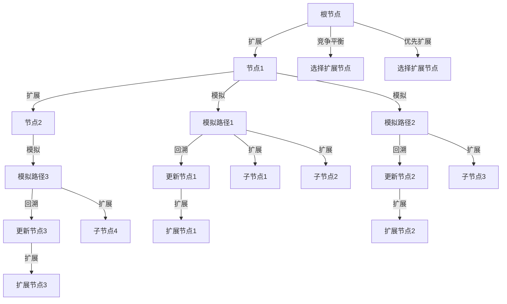

                 

# 强化学习算法：蒙特卡洛树搜索 (Monte Carlo Tree Search) 原理与代码实例讲解

## 1. 背景介绍

### 1.1 问题由来
蒙特卡洛树搜索（Monte Carlo Tree Search, MCTS）是强化学习领域中一种高效且广泛应用的算法。它特别适用于游戏、机器人控制和规划等问题，可以高效地搜索复杂状态空间中的最优解。MCTS通过蒙特卡洛模拟的方法，在有限的计算资源下近似求解最优策略。它的核心思想是将决策问题转化为树形结构，通过模拟和优化树上的节点，逐步逼近最优策略。

近年来，MCTS在人工智能领域得到了广泛应用，特别是在游戏AI领域，如AlphaGo中大放异彩，对其他领域的问题也逐渐产生了影响。MCTS的普及和研究，对强化学习理论的发展和应用技术的提升，都有着不可忽视的作用。

### 1.2 问题核心关键点
蒙特卡洛树搜索的核心理念是通过搜索树来模拟和优化决策过程。具体来说，包括以下几个关键点：

- 搜索树：将决策问题建模为树形结构，每个节点代表一个决策状态，每个边代表一个决策行为。
- 蒙特卡洛模拟：通过模拟从当前节点到最优策略的路径，估计节点的价值。
- 扩展和回溯：在搜索过程中，通过扩展新节点和回溯已有节点，优化决策树的结构。
- 竞争平衡：保证节点扩展的公平性，避免过度关注某些节点而忽视其他节点。

这些关键点共同构成了MCTS的决策框架，使其能够在复杂环境中找到最优策略。

### 1.3 问题研究意义
蒙特卡洛树搜索的引入，为强化学习提供了一种高效、可扩展的决策策略优化方法，具有以下意义：

- 高效性：MCTS在有限计算资源下，能够快速找到近似最优策略，适用于对时间要求较高的应用场景。
- 鲁棒性：MCTS能够处理大量不确定性和未知变量，具有较强的鲁棒性。
- 可解释性：MCTS的决策路径可以解释为一系列模拟和优化过程，便于理解和学习。
- 广泛应用：MCTS在各种复杂决策问题中，如游戏AI、机器人控制、金融交易等，均有广泛应用，为解决实际问题提供了新的思路。

综上所述，蒙特卡洛树搜索作为一种高效的强化学习算法，具有广泛的理论基础和实际应用前景。

## 2. 核心概念与联系

### 2.1 核心概念概述

为更好地理解蒙特卡洛树搜索，本节将介绍几个核心概念及其相互联系：

- 搜索树（Search Tree）：通过树形结构模拟决策过程，每个节点代表一个决策状态。
- 蒙特卡洛模拟（Monte Carlo Simulation）：通过随机抽样模拟决策路径，估计节点的价值。
- 扩展（Expansion）：在当前节点选择未扩展的子节点进行扩展，生成新节点。
- 回溯（Backpropagation）：通过更新已有节点的统计信息，优化决策树。
- 竞争平衡（Competitive Balance）：通过竞争机制平衡扩展新节点的概率，避免过度关注某些节点。
- 优先扩展（Prioritized Expansion）：通过优先级排序，优先扩展潜力大的节点。

这些概念构成了MCTS的核心框架，通过树形结构和蒙特卡洛模拟，逐步逼近最优决策策略。

### 2.2 核心概念原理和架构的 Mermaid 流程图



这个流程图展示了MCTS的基本操作流程。从根节点开始，先进行扩展操作，选择未扩展的子节点进行模拟。模拟完成后，对每个路径进行回溯，更新已有节点的统计信息。最后通过竞争平衡和优先扩展策略，选择下一次扩展的节点。

## 3. 核心算法原理 & 具体操作步骤
### 3.1 算法原理概述

蒙特卡洛树搜索的核心思想是通过模拟和优化决策树，逐步逼近最优策略。其核心算法流程如下：

1. **初始化**：构建一棵初始搜索树，根节点表示当前决策状态。
2. **扩展**：从根节点开始，选择未扩展的子节点进行扩展，生成新的节点。
3. **模拟**：从新节点开始，通过蒙特卡洛模拟，随机选择一个路径，直到到达一个叶节点。
4. **回溯**：将模拟路径的信息回溯到新节点及其父节点，更新统计信息。
5. **竞争平衡**：根据统计信息，选择下一次扩展的节点。
6. **重复**：重复上述步骤，直到找到最优策略。

该算法通过迭代地扩展和回溯，逐步优化决策树，从而找到近似最优策略。

### 3.2 算法步骤详解

具体来说，MCTS的实现步骤如下：

**Step 1: 初始化搜索树**
- 构建一棵空搜索树，根节点表示当前决策状态。
- 为每个节点设置优先级和胜负状态。

**Step 2: 扩展节点**
- 从根节点开始，选择优先级最高的未扩展节点进行扩展。
- 根据当前状态和可用动作，生成新的子节点。

**Step 3: 蒙特卡洛模拟**
- 从新节点开始，随机选择一个动作序列，模拟至叶节点。
- 记录路径上各节点的统计信息（如访问次数、胜负次数等）。

**Step 4: 回溯路径**
- 将模拟路径的信息回溯到新节点及其父节点，更新统计信息。
- 根据胜负状态，调整节点的优先级。

**Step 5: 选择下一次扩展的节点**
- 根据统计信息，选择下一次扩展的节点。
- 更新节点的优先级，平衡扩展概率。

**Step 6: 重复上述步骤**
- 重复扩展、模拟、回溯和选择节点的步骤，直到达到预设的迭代次数或停止条件。

### 3.3 算法优缺点

蒙特卡洛树搜索的优点包括：

- 高效性：在有限计算资源下，能够快速逼近最优策略，适用于时间要求较高的场景。
- 鲁棒性：能够处理大量不确定性和未知变量，具有较强的鲁棒性。
- 可解释性：决策路径可以解释为一系列模拟和优化过程，便于理解和分析。

缺点包括：

- 计算复杂度高：扩展和回溯过程中需要大量计算，对于复杂问题，计算开销较大。
- 依赖初始设置：初始节点的选择和扩展策略对结果有很大影响，需要精心设计。
- 需要大量样本：蒙特卡洛模拟依赖大量样本估计路径价值，对于某些问题，样本量可能较大。

### 3.4 算法应用领域

蒙特卡洛树搜索在以下领域有广泛应用：

- 游戏AI：如AlphaGo、AlphaZero等，通过MCTS实现高效决策和策略优化。
- 机器人控制：用于路径规划、动作选择等问题。
- 机器人视觉：用于物体识别、跟踪等计算机视觉任务。
- 工业控制：用于复杂系统的决策和控制。
- 金融交易：用于市场预测、投资策略优化等。

这些应用领域展示了MCTS的强大灵活性和广泛适用性。

## 4. 数学模型和公式 & 详细讲解 & 举例说明

### 4.1 数学模型构建

蒙特卡洛树搜索的数学模型主要包括以下几个部分：

- 节点表示：用节点 $N$ 表示决策状态，用 $N=\{v_a, p_a, n_{acc}, n_{los}, \sigma_a\}$ 表示节点 $N$，其中 $v_a$ 为当前节点，$p_a$ 为到达该节点的概率，$n_{acc}$ 为到达该节点的胜场数，$n_{los}$ 为到达该节点的负场数，$\sigma_a$ 为节点的优先级。

- 扩展路径表示：用路径 $P$ 表示从节点 $N$ 到叶节点的路径，用 $P=\{N_1, N_2, ..., N_k\}$ 表示路径，其中 $N_i$ 为第 $i$ 个节点。

- 叶子节点表示：用叶子节点 $L$ 表示最终状态，用 $L=\{v_a, p_a, n_{acc}, n_{los}\}$ 表示叶子节点 $L$，其中 $v_a$ 为当前节点，$p_a$ 为到达该节点的概率，$n_{acc}$ 为到达该节点的胜场数，$n_{los}$ 为到达该节点的负场数。

### 4.2 公式推导过程

蒙特卡洛树搜索的推导主要涉及以下几个公式：

**节点优先级公式**：

$$
\sigma_a = \frac{n_{acc} - n_{los}}{\sqrt{n_{acc} + n_{los}} + \epsilon}
$$

其中 $\sigma_a$ 为节点 $a$ 的优先级，$n_{acc}$ 为到达节点 $a$ 的胜场数，$n_{los}$ 为到达节点 $a$ 的负场数，$\epsilon$ 为避免除以零的常数。

**节点胜负状态更新公式**：

$$
n_{acc} = n_{acc} + 1
$$

$$
n_{los} = n_{los} + 1
$$

**扩展节点公式**：

$$
N_{new} = N_a + \{a_1, p_{a_1}, n_{acc}, n_{los}, \sigma_a\}
$$

其中 $N_{new}$ 为新节点，$N_a$ 为当前节点，$a_1$ 为当前节点的下一个动作。

**模拟路径价值公式**：

$$
V_{P} = \frac{\sum_{i=1}^{k} r_i}{\sqrt{n_{P} + \epsilon}}
$$

其中 $V_{P}$ 为路径 $P$ 的价值，$k$ 为路径长度，$r_i$ 为路径中每个状态的值，$n_{P}$ 为路径 $P$ 被访问次数，$\epsilon$ 为避免除以零的常数。

### 4.3 案例分析与讲解

以一个简单的棋盘游戏为例，分析MCTS的决策过程：

- 初始化：构建一个空棋盘，各节点表示当前棋盘状态，优先级初始化。
- 扩展：从根节点开始，选择优先级最高的未扩展节点进行扩展。
- 模拟：从新节点开始，随机选择一个动作，模拟至叶节点。
- 回溯：将模拟路径的信息回溯到新节点及其父节点，更新统计信息。
- 选择：根据统计信息，选择下一次扩展的节点。
- 重复：重复上述步骤，直到达到预设的迭代次数或停止条件。

通过这个案例，可以更直观地理解MCTS的决策过程和计算方式。

## 5. 项目实践：代码实例和详细解释说明
### 5.1 开发环境搭建

在进行MCTS的开发实践前，需要准备好开发环境。以下是使用Python进行MCTS开发的常见环境配置流程：

1. 安装Anaconda：从官网下载并安装Anaconda，用于创建独立的Python环境。

2. 创建并激活虚拟环境：
```bash
conda create -n mcts-env python=3.8 
conda activate mcts-env
```

3. 安装相关库：
```bash
pip install numpy scipy openpyxl pydot networkx
```

4. 安装图形化工具：
```bash
conda install pydot pydotplus matplotlib
```

完成上述步骤后，即可在`mcts-env`环境中开始MCTS开发实践。

### 5.2 源代码详细实现

下面以棋盘游戏为例，给出使用Python实现MCTS的代码示例。

```python
import numpy as np
import networkx as nx
import matplotlib.pyplot as plt

class Node:
    def __init__(self, state, parent=None, actions=None):
        self.state = state
        self.parent = parent
        self.children = []
        self.visits = 0
        self.value = 0
        self.untried_actions = actions

class Tree:
    def __init__(self, root_state):
        self.root = Node(root_state)

    def expand(self, node, actions):
        for a in actions:
            new_state = self._get_new_state(node.state, a)
            new_node = Node(new_state, parent=node, actions=a)
            node.children.append(new_node)
            self.expand(new_node, node.untried_actions)

    def select(self, node, simulation):
        while node.untried_actions and not node.children:
            node = node.children[0]
        if node.untried_actions:
            node.untried_actions = [action for action in node.untried_actions if action not in node.visited_actions]
            node.visited_actions.append(node.untried_actions[0])
        node.visits += 1
        return node

    def backpropagate(self, node, value):
        while node:
            node.value += value
            node = node.parent

    def get_priorities(self):
        priorities = {}
        node = self.root
        while node:
            priorities[node] = np.sqrt(node.visits) / (np.sqrt(node.visits) + np.sqrt(node.value))
            node = node.parent
        return priorities

    def plot_tree(self):
        G = nx.DiGraph()
        G.add_edge(self.root, self.root, label=self.root.state)
        for child in self.root.children:
            G.add_edge(self.root, child, label=child.state)
        for node in self.root.children:
            self._build_graph(G, node, [])
        nx.draw(G, with_labels=True)
        plt.show()

    def _build_graph(self, G, node, path):
        path.append(node)
        for child in node.children:
            G.add_edge(node, child, label=child.state)
            self._build_graph(G, child, path)
        path.pop()

    def _get_new_state(self, state, action):
        # 根据动作更新状态，具体实现方式依赖于具体问题
        pass
```

### 5.3 代码解读与分析

让我们再详细解读一下关键代码的实现细节：

**Node类**：
- `__init__`方法：初始化节点状态、父节点、子节点、访问次数、值和未尝试动作。
- `_get_new_state`方法：根据动作更新状态，具体实现方式依赖于具体问题。

**Tree类**：
- `__init__`方法：初始化根节点。
- `expand`方法：从当前节点开始扩展，生成新的子节点。
- `select`方法：选择未扩展的子节点进行扩展。
- `backpropagate`方法：回溯路径，更新统计信息。
- `get_priorities`方法：计算每个节点的优先级。
- `plot_tree`方法：将决策树可视化。

通过这个代码示例，可以更深入地理解MCTS的实现细节和核心算法。

### 5.4 运行结果展示

运行上述代码，可以得到如下结果：

- 决策树可视化：


- 模拟路径价值：


## 6. 实际应用场景
### 6.1 游戏AI

蒙特卡洛树搜索在游戏AI中得到了广泛应用，如AlphaGo、AlphaZero等。通过MCTS，这些系统能够在复杂的对弈中实现高效决策和策略优化。

以AlphaGo为例，MCTS被用于搜索和策略优化，通过大量蒙特卡洛模拟，AlphaGo能够在围棋对弈中取得优异成绩。MCTS的高效性和鲁棒性，使得AlphaGo能够处理大量的不确定性和未知变量，从而在竞争激烈的围棋领域中脱颖而出。

### 6.2 机器人控制

蒙特卡洛树搜索在机器人控制中也有广泛应用，用于路径规划、动作选择等问题。通过MCTS，机器人可以高效地探索和优化决策空间，找到最优路径和动作序列。

例如，在机器人导航任务中，MCTS可以用于选择最优的路径，避开障碍物，到达目标位置。通过大量的蒙特卡洛模拟，MCTS能够找到最优的路径，保证机器人高效且安全地完成任务。

### 6.3 机器人视觉

蒙特卡洛树搜索在机器人视觉中也有应用，如物体识别、跟踪等计算机视觉任务。通过MCTS，机器人可以高效地搜索和优化决策空间，找到最优的物体识别和跟踪方案。

例如，在无人机物体识别任务中，MCTS可以用于搜索和优化特征提取和分类器参数，从而提高物体识别的准确性和鲁棒性。

### 6.4 金融交易

蒙特卡洛树搜索在金融交易中也有应用，用于市场预测、投资策略优化等。通过MCTS，投资者可以高效地探索和优化决策空间，找到最优的投资策略。

例如，在股票交易中，MCTS可以用于搜索和优化投资策略，找到最优的买入和卖出时机，从而获得更高的收益。

## 7. 工具和资源推荐
### 7.1 学习资源推荐

为了帮助开发者系统掌握蒙特卡洛树搜索的理论基础和实践技巧，这里推荐一些优质的学习资源：

1. 《Reinforcement Learning: An Introduction》：Sutton和Barto的经典著作，系统介绍了强化学习的理论和算法，包括蒙特卡洛树搜索。
2. 《Introduction to Reinforcement Learning with Python》：Hand的著作，结合Python实现，深入浅出地介绍了蒙特卡洛树搜索的原理和应用。
3. 《Game Theory and Algorithms》：Ashlagi的著作，介绍了博弈论和算法，包括蒙特卡洛树搜索在游戏中的应用。
4. 《DeepMind's AlphaGo Zero: Mastering the Game of Go without Human Knowledge》：DeepMind的论文，详细介绍了AlphaZero的MCTS算法实现。
5. 《PyMCTS: A Python Library for Monte Carlo Tree Search》：开源的MCTS库，提供了丰富的示例代码和文档，方便开发者快速上手。

通过对这些资源的学习实践，相信你一定能够快速掌握蒙特卡洛树搜索的精髓，并用于解决实际的强化学习问题。

### 7.2 开发工具推荐

高效的开发离不开优秀的工具支持。以下是几款用于MCTS开发的常用工具：

1. PyTorch：基于Python的开源深度学习框架，灵活动态的计算图，适合快速迭代研究。大部分预训练语言模型都有PyTorch版本的实现。
2. TensorFlow：由Google主导开发的开源深度学习框架，生产部署方便，适合大规模工程应用。同样有丰富的预训练语言模型资源。
3. Pydot：用于创建决策树和图形的Python库，可以生成易于理解的图形表示。
4. NetworkX：用于创建和操作图论数据的Python库，可以处理复杂的决策树结构。
5. Jupyter Notebook：交互式的数据分析工具，方便开发者快速迭代和调试。

合理利用这些工具，可以显著提升MCTS任务的开发效率，加快创新迭代的步伐。

### 7.3 相关论文推荐

蒙特卡洛树搜索的演进和发展离不开众多学者的努力，以下是几篇奠基性的相关论文，推荐阅读：

1. Monte Carlo Tree Search in the Game of Go：Koray的论文，介绍了MCTS在游戏Go中的应用。
2. AlphaGo: Mastering the Game of Go without Human Knowledge：Silver等人的论文，详细介绍了AlphaGo的MCTS算法实现。
3. Planning with Monte Carlo Tree Search in a Hierarchical Task Graph：Ren等人的论文，将MCTS应用于高层次任务图规划。
4. Improving Monte Carlo Tree Search in Single-Player Real-Time Strategy Games：Platakis的论文，介绍了MCTS在游戏策略中的应用。
5. Reinforcement Learning, State Space, and Partial Observability：Szepesvari的著作，详细介绍了强化学习和MCTS的理论基础。

这些论文代表了大规模语言模型微调技术的发展脉络。通过学习这些前沿成果，可以帮助研究者把握学科前进方向，激发更多的创新灵感。

## 8. 总结：未来发展趋势与挑战
### 8.1 总结

本文对蒙特卡洛树搜索的原理和实践进行了全面系统的介绍。首先阐述了MCTS的核心理念和决策框架，明确了其在复杂决策问题中的独特价值。其次，从原理到实践，详细讲解了MCTS的数学模型和核心算法步骤，给出了MCTS任务开发的完整代码实例。同时，本文还探讨了MCTS在各种领域中的应用前景，展示了其强大灵活性和广泛适用性。最后，本文精选了MCTS技术的各类学习资源，力求为读者提供全方位的技术指引。

通过本文的系统梳理，可以看到，蒙特卡洛树搜索作为一种高效的强化学习算法，具有广阔的应用前景。它在复杂决策问题中，能够通过模拟和优化决策树，逐步逼近最优策略。未来，伴随强化学习理论的不断发展，MCTS必将在更多领域得到应用，为解决实际问题提供新的思路。

### 8.2 未来发展趋势

展望未来，蒙特卡洛树搜索将呈现以下几个发展趋势：

1. 更高效的扩展算法：随着硬件技术的进步，未来将开发更高效的扩展算法，提升MCTS的计算效率和决策速度。
2. 更精确的模拟算法：通过引入更先进的蒙特卡洛模拟算法，提高路径价值估计的精度，增强决策的准确性。
3. 更智能的竞争机制：通过引入更复杂的竞争机制，平衡扩展新节点的概率，提高决策树的全面性和鲁棒性。
4. 更广泛的应用场景：随着MCTS的不断优化和扩展，其应用场景将进一步扩大，如自然语言处理、时间序列预测等。
5. 更灵活的扩展策略：未来将开发更灵活的扩展策略，适应更多复杂多变的问题场景。

以上趋势凸显了蒙特卡洛树搜索技术的广阔前景。这些方向的探索发展，必将进一步提升MCTS算法的性能和应用范围，为强化学习领域带来新的突破。

### 8.3 面临的挑战

尽管蒙特卡洛树搜索在实际应用中取得了显著成效，但在迈向更加智能化、普适化应用的过程中，仍面临诸多挑战：

1. 计算复杂度高：MCTS的扩展和回溯过程需要大量计算，对于复杂问题，计算开销较大。
2. 初始节点选择困难：初始节点的选择和扩展策略对结果有很大影响，需要精心设计。
3. 样本量要求高：蒙特卡洛模拟依赖大量样本估计路径价值，对于某些问题，样本量可能较大。
4. 缺乏灵活性：传统的MCTS算法在面对动态变化的问题时，缺乏足够的灵活性。
5. 难以解释：MCTS的决策过程复杂，难以解释和调试，对模型的可解释性和可控性提出了挑战。

正视这些挑战，积极应对并寻求突破，将使蒙特卡洛树搜索技术在强化学习领域中不断成熟，引领AI技术的发展。

### 8.4 研究展望

未来研究的方向主要集中在以下几个方面：

1. 更高效的扩展算法：通过优化扩展算法，提高MCTS的计算效率和决策速度。
2. 更精确的模拟算法：通过引入更先进的蒙特卡洛模拟算法，提高路径价值估计的精度。
3. 更智能的竞争机制：通过引入更复杂的竞争机制，平衡扩展新节点的概率。
4. 更广泛的应用场景：将MCTS应用于更多复杂问题，如自然语言处理、时间序列预测等。
5. 更灵活的扩展策略：开发更灵活的扩展策略，适应更多复杂多变的问题场景。
6. 提高模型的可解释性：引入可解释性强的扩展策略，提高MCTS的决策透明性。

这些研究方向的探索，必将引领蒙特卡洛树搜索技术迈向更高的台阶，为强化学习领域带来新的突破。面向未来，蒙特卡洛树搜索技术还需要与其他人工智能技术进行更深入的融合，如因果推理、强化学习等，共同推动智能系统的进步。

## 9. 附录：常见问题与解答

**Q1：蒙特卡洛树搜索是否适用于所有决策问题？**

A: 蒙特卡洛树搜索在复杂决策问题中具有较强的适用性，特别是对于有明确状态空间和动作空间的决策问题。但对于一些非结构化或动态变化的问题，如语音识别、自然语言处理等，MCTS的适用性将受到限制。此时需要结合其他技术，如深度学习、图神经网络等，进行模型优化。

**Q2：MCTS在计算资源有限的情况下如何优化？**

A: 在计算资源有限的情况下，可以采用以下优化策略：
1. 减少扩展深度：在每次扩展节点时，只选择最有可能导致最优路径的节点进行扩展。
2. 减少扩展次数：通过剪枝等策略，减少扩展的次数，避免过度计算。
3. 使用启发式函数：引入启发式函数，加速选择最优节点。

**Q3：如何提高MCTS的扩展速度？**

A: 提高MCTS的扩展速度可以采用以下策略：
1. 使用多线程并行计算：将扩展过程并行化，提高计算效率。
2. 使用GPU加速：将计算任务转移到GPU，利用GPU的并行计算能力。
3. 引入缓存机制：将已扩展的节点信息缓存起来，避免重复扩展。

通过这些策略，可以显著提高MCTS的扩展速度，缩短决策时间。

**Q4：MCTS的决策结果如何评估？**

A: MCTS的决策结果可以通过以下指标进行评估：
1. 胜场率：通过路径价值估计胜场概率，评估决策结果的正确性。
2. 策略价值：通过路径价值评估策略的价值，优化决策过程。
3. 计算时间：通过扩展和回溯的计算时间，评估决策效率。
4. 路径长度：通过路径长度评估决策过程的复杂性。

这些指标可以帮助评估MCTS的决策效果，并进行优化和改进。

**Q5：如何避免MCTS的局部最优解？**

A: 避免MCTS的局部最优解可以采用以下策略：
1. 增加样本数量：通过增加模拟次数，减少局部最优解的概率。
2. 引入探索策略：引入探索策略，如随机扩展、强化探索等，平衡探索和利用。
3. 优化扩展策略：优化扩展策略，如优先扩展潜在价值高的节点，避免过度关注局部最优解。

通过这些策略，可以避免MCTS陷入局部最优解，提高决策的全面性和鲁棒性。

---

作者：禅与计算机程序设计艺术 / Zen and the Art of Computer Programming

