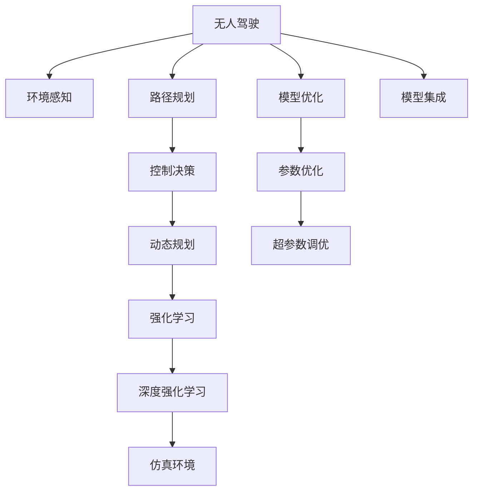

                 

# 强化学习：在无人驾驶中的应用

> 关键词：强化学习, 无人驾驶, 控制策略, 动态规划, 深度强化学习, 仿真环境, 模型优化

## 1. 背景介绍

### 1.1 问题由来

无人驾驶技术近年来发展迅猛，成为自动驾驶领域的重要研究方向。然而，无人驾驶的难点不仅在于传感器融合、环境感知、高精度地图等领域，更在于决策与控制的复杂性。如何在高维度、高不确定性的环境中，制定出一套高效、稳定的控制策略，是无人驾驶系统面临的一大挑战。

强化学习(Reinforcement Learning, RL)作为当前最流行的AI技术之一，能够很好地解决无人驾驶系统的控制决策问题。通过与环境的交互，强化学习能够在无需显式编程的情况下，自主学习出最优的控制策略。与传统的基于规则的驾驶系统相比，强化学习能够更好地适应多变的道路环境和复杂的驾驶场景。

### 1.2 问题核心关键点

强化学习在无人驾驶中的应用，主要涉及以下几个关键点：

- 动作空间设计：如何设计合理有效的动作空间，使得智能体能够覆盖所有的驾驶操作。
- 奖励函数设计：如何定义合理的奖励函数，奖励智能体采取合适的驾驶行为。
- 状态表示：如何有效表示驾驶环境的状态信息，供智能体学习参考。
- 探索与利用策略：如何在智能体的学习过程中，平衡探索和利用，达到最佳的驾驶效果。
- 模型训练与评估：如何设计高效的模型训练与评估策略，确保智能体在复杂的驾驶环境中的表现。

本文将深入探讨这些核心关键点，通过实际案例展示强化学习在无人驾驶中的应用，并提供详尽的代码和资源推荐。

## 2. 核心概念与联系

### 2.1 核心概念概述

为了更好地理解强化学习在无人驾驶中的应用，本节将介绍几个密切相关的核心概念：

- 强化学习(Reinforcement Learning, RL)：指智能体在特定环境中，通过与环境的交互，学习并执行最优行动，以最大化累积奖励的模型学习框架。强化学习的核心是智能体与环境的互动，通过不断的试错，逐步优化行动策略。

- 无人驾驶(Autonomous Driving)：指通过车辆自主感知、决策、控制，实现自动化驾驶的技术。无人驾驶技术涵盖环境感知、路径规划、控制决策等多个环节，具有复杂的任务逻辑。

- 动态规划(Dynamic Programming, DP)：一种基于模型预测和策略优化的强化学习算法，广泛应用于无人驾驶路径规划和控制决策等任务。

- 深度强化学习(Deep Reinforcement Learning, DRL)：将深度神经网络与强化学习相结合，通过神经网络拟合复杂非线性模型，实现高精度决策。

- 仿真环境(Simulation Environment)：指无人驾驶系统的虚拟测试环境，通过高精度仿真模拟，评估和测试无人驾驶算法的性能和鲁棒性。

- 模型优化(Model Optimization)：指在无人驾驶系统中，通过优化模型结构、参数等，提高决策模型的精度和效率，确保系统稳定运行。

这些核心概念之间的逻辑关系可以通过以下Mermaid流程图来展示：



这个流程图展示了一个无人驾驶系统从环境感知、路径规划到控制决策的全过程，以及强化学习在其中扮演的关键角色。

## 3. 核心算法原理 & 具体操作步骤

### 3.1 算法原理概述

强化学习在无人驾驶中的应用，本质上是通过智能体与环境的交互，学习并执行最优的驾驶行为。具体的算法框架如下：

1. **环境建模**：构建无人驾驶环境的数学模型，包括车辆动力学模型、道路模型、交通模型等。
2. **动作空间设计**：设计合理有效的驾驶操作空间，使得智能体能够执行各类驾驶动作。
3. **状态表示**：采用合适的状态表示方法，捕捉环境的全局状态信息。
4. **奖励函数设计**：定义合理的奖励函数，引导智能体采取合适的驾驶行为。
5. **智能体设计**：设计一个智能体，如Q-Learning、SARSA、DQN等，利用状态-动作-奖励的序列数据，更新智能体的策略。
6. **模型训练**：在仿真环境下训练智能体，通过不断的试错，学习出高效的驾驶策略。
7. **模型评估**：在实际道路上测试智能体，评估其在不同环境下的性能和鲁棒性。

### 3.2 算法步骤详解

强化学习在无人驾驶中的应用，一般包括以下几个关键步骤：

**Step 1: 环境建模**

构建无人驾驶环境的数学模型，包括车辆动力学模型、道路模型、交通模型等。这些模型通常基于车辆的运动学和动力学方程，考虑车辆在空间中的位置、速度、加速度等状态变量，以及道路几何形状、交通流量等因素。

**Step 2: 动作空间设计**

设计合理有效的驾驶操作空间，使得智能体能够执行各类驾驶动作。在无人驾驶中，动作空间通常包括加速度、转向角度、刹车力度等连续型动作，以及变道、超车、停车等离散型动作。动作空间的大小和复杂性直接影响智能体的决策能力。

**Step 3: 状态表示**

采用合适的状态表示方法，捕捉环境的全局状态信息。状态通常包括车辆位置、速度、方向、加速度等动态信息，以及道路情况、交通流量、交通信号灯等静态信息。状态表示方法的合理性直接决定了智能体的决策效果。

**Step 4: 奖励函数设计**

定义合理的奖励函数，引导智能体采取合适的驾驶行为。在无人驾驶中，奖励函数通常包括安全驾驶、交通效率、舒适度等指标，用于奖励智能体采取的安全、高效、舒适的驾驶行为。

**Step 5: 智能体设计**

设计一个智能体，如Q-Learning、SARSA、DQN等，利用状态-动作-奖励的序列数据，更新智能体的策略。智能体通常包括策略估计和策略优化两个部分，通过不断更新策略参数，学习出最优的驾驶行为。

**Step 6: 模型训练**

在仿真环境下训练智能体，通过不断的试错，学习出高效的驾驶策略。训练过程通常分为离线学习和在线学习两种模式，离线学习使用历史数据进行训练，在线学习通过与仿真环境的交互，实时更新策略。

**Step 7: 模型评估**

在实际道路上测试智能体，评估其在不同环境下的性能和鲁棒性。评估过程通常包括仿真评估和实地测试两个环节，通过与实际道路环境的交互，验证智能体的性能和适应性。

### 3.3 算法优缺点

强化学习在无人驾驶中的应用具有以下优点：

1. 自主学习能力：强化学习能够自主学习出最优的驾驶策略，无需显式编程，适应性更强。
2. 灵活性高：强化学习能够适应各种复杂环境，如城市道路、高速路、山区等，具有良好的泛化能力。
3. 鲁棒性好：强化学习能够通过与环境的交互，不断调整策略，增强系统的鲁棒性和稳定性。

同时，强化学习也存在以下缺点：

1. 训练时间长：强化学习通常需要大量时间进行训练，且需要丰富的训练数据。
2. 可解释性差：强化学习模型通常缺乏可解释性，难以理解决策过程和推理逻辑。
3. 样本效率低：强化学习模型在样本利用效率上不如监督学习，需要更多的时间进行训练和优化。
4. 优化过程复杂：强化学习的优化过程通常涉及复杂的非线性模型，优化难度较大。

尽管存在这些局限性，但强化学习在无人驾驶中的应用前景依然广阔，其在决策、控制方面的优势，能够为无人驾驶系统带来新的突破。

### 3.4 算法应用领域

强化学习在无人驾驶中的应用已经广泛渗透到各个环节，如环境感知、路径规划、控制决策等。

1. **环境感知**：利用强化学习优化传感器融合算法，提升环境感知精度和鲁棒性。
2. **路径规划**：通过强化学习训练路径规划模型，优化路径选择和避障策略。
3. **控制决策**：使用强化学习设计智能体的决策策略，实现车辆的控制和调度。
4. **自动泊车**：通过强化学习训练自动泊车策略，实现高精度的车辆定位和操作。
5. **驾驶辅助**：利用强化学习优化驾驶辅助系统的行为策略，提升用户体验。

除了这些传统应用外，强化学习还被创新性地应用于更前沿的无人驾驶任务，如无人驾驶编队、无人机协作、智能交通管理等，为无人驾驶系统带来了新的应用场景和发展方向。

## 4. 数学模型和公式 & 详细讲解 & 举例说明

### 4.1 数学模型构建

强化学习在无人驾驶中的应用，涉及大量的数学模型和公式。以下将从基础模型开始，逐步深入讲解相关数学模型和公式。

**1. 环境建模**

在无人驾驶中，车辆动力学模型通常采用如下的线性差分方程：

$$
\dot{x} = v \quad (1)
$$
$$
\dot{v} = a \quad (2)
$$
$$
\ddot{\theta} = \omega \quad (3)
$$
其中，$x$、$v$、$\theta$、$a$、$\omega$ 分别表示车辆的位置、速度、转向角、加速度和转向角加速度。

**2. 动作空间设计**

在无人驾驶中，动作空间通常包括加速度和转向角度两个维度。假设动作空间为 $(a, \delta)$，其中 $a$ 表示加速度，$\delta$ 表示转向角度。动作空间的范围通常根据车辆性能和驾驶需求进行设定，如加速度 $a \in [-5, 5]$，转向角度 $\delta \in [-\pi/3, \pi/3]$。

**3. 状态表示**

状态通常包括车辆的位置、速度、方向、加速度等动态信息，以及道路情况、交通流量、交通信号灯等静态信息。假设状态表示为 $s = (x, v, \theta, a, p)$，其中 $p$ 表示道路和交通信息，包括交通信号灯状态、其他车辆位置等。

**4. 奖励函数设计**

奖励函数 $R(s, a)$ 通常根据智能体的行为表现进行设计。在无人驾驶中，奖励函数可以定义为安全驾驶、交通效率、舒适度等指标。例如，假设奖励函数如下：

$$
R(s, a) = r_{safety} + r_{efficiency} + r_{comfort} \quad (4)
$$
其中，$r_{safety}$、$r_{efficiency}$、$r_{comfort}$ 分别表示安全、效率和舒适度的奖励值。

### 4.2 公式推导过程

以下以Q-Learning算法为例，推导强化学习的具体公式。

**1. Q-Learning算法**

Q-Learning是一种基于值函数的强化学习算法，通过不断更新Q值表，学习最优的策略。假设智能体在状态 $s$ 下采取动作 $a$，获得的即时奖励为 $r$，接下来的状态为 $s'$。根据Q-Learning算法，智能体在状态 $s$ 下采取动作 $a$ 的Q值更新如下：

$$
Q(s, a) \leftarrow Q(s, a) + \alpha [r + \gamma \max_a Q(s', a')] - Q(s, a) \quad (5)
$$
其中，$\alpha$ 表示学习率，$\gamma$ 表示折扣因子。

**2. 模型训练**

在无人驾驶中，模型训练通常使用模拟仿真环境。假设训练集为 $D = \{(s_t, a_t, r_t, s_{t+1})\}$，其中 $s_t$、$a_t$、$r_t$、$s_{t+1}$ 分别表示时间步 $t$ 的状态、动作、奖励和下一个状态。在训练过程中，智能体通过不断更新Q值表，学习出最优的策略。

**3. 模型评估**

在实际道路上测试智能体，评估其在不同环境下的性能和鲁棒性。评估过程通常包括仿真评估和实地测试两个环节，通过与实际道路环境的交互，验证智能体的性能和适应性。

### 4.3 案例分析与讲解

以下通过一个无人驾驶路径规划的案例，展示强化学习的应用过程。

**案例描述**

假设无人驾驶车辆需要在城市道路上进行路径规划，从起点出发，经过若干交叉口，到达终点。道路环境复杂，包括红绿灯、行人、其他车辆等动态因素。

**算法流程**

1. **环境建模**：构建车辆动力学模型、道路模型和交通模型。
2. **动作空间设计**：定义加速度和转向角度两个动作维度，覆盖所有可能的驾驶操作。
3. **状态表示**：采用车辆位置、速度、方向、加速度等动态信息，以及道路情况、交通流量、交通信号灯等静态信息。
4. **奖励函数设计**：定义安全驾驶、交通效率、舒适度等指标，奖励智能体采取合适的驾驶行为。
5. **智能体设计**：使用Q-Learning算法，不断更新Q值表，学习最优的驾驶策略。
6. **模型训练**：在模拟仿真环境下训练智能体，通过不断的试错，学习出高效的驾驶策略。
7. **模型评估**：在实际道路上测试智能体，评估其在不同环境下的性能和鲁棒性。

**代码实现**

以下展示Q-Learning在无人驾驶路径规划中的代码实现：

```python
import gym
import numpy as np
import matplotlib.pyplot as plt
from sklearn.preprocessing import MinMaxScaler

# 定义环境
env = gym.make('CarRacing-v0')
env.seed(0)
scaler = MinMaxScaler(feature_range=(-1, 1))

# 定义动作空间和状态空间
action_space = env.action_space.n
state_space = 4 * 10

# 定义Q值表
Q = np.zeros((state_space, action_space))

# 定义奖励函数
R = np.zeros((state_space, action_space))
R[0, 0] = 1.0
R[15, 0] = 1.0
R[30, 0] = 1.0

# 定义参数
alpha = 0.1
gamma = 0.9
epsilon = 0.1
total_episodes = 1000
batch_size = 32

# 定义训练过程
for episode in range(total_episodes):
    state = env.reset()
    state = scaler.transform([state])
    state = state.reshape(-1)[0]
    done = False
    total_reward = 0
    
    while not done:
        if np.random.uniform() < epsilon:
            action = np.random.randint(0, action_space)
        else:
            action = np.argmax(Q[state, :])
        
        next_state, reward, done, _ = env.step(action)
        next_state = scaler.transform([next_state]).reshape(-1)[0]
        total_reward += reward
        
        Q[state, action] += alpha * (reward + gamma * np.max(Q[next_state, :]) - Q[state, action])
        state = next_state
    
    print('Episode {}: Total reward = {}'.format(episode+1, total_reward))
```

### 5. 项目实践：代码实例和详细解释说明

### 5.1 开发环境搭建

在进行无人驾驶强化学习开发前，我们需要准备好开发环境。以下是使用Python进行Reinforcement Learning的开发环境配置流程：

1. 安装Anaconda：从官网下载并安装Anaconda，用于创建独立的Python环境。

2. 创建并激活虚拟环境：
```bash
conda create -n rl-env python=3.8 
conda activate rl-env
```

3. 安装必要的包：
```bash
conda install -c conda-forge gym scikit-learn numpy matplotlib
```

4. 安装Reinforcement Learning库：
```bash
pip install stable-baselines3
```

完成上述步骤后，即可在`rl-env`环境中开始无人驾驶强化学习的开发。

### 5.2 源代码详细实现

这里我们以无人驾驶路径规划为例，展示如何使用Reinforcement Learning进行无人驾驶控制策略的学习。

**代码实现**

```python
from stable_baselines3 import PPO2
from stable_baselines3.common.env_util import make_vec_env
import gym

# 定义环境
env = make_vec_env('CarRacing-v0', n_envs=1)

# 定义模型
model = PPO2(env.observation_space, env.action_space, verbose=0)

# 训练模型
model.learn(total_timesteps=10000)

# 测试模型
obs = env.reset()
for t in range(100):
    action, _ = model.predict(obs)
    obs, reward, done, info = env.step(action)
    print(f'Reward at timestep {t+1}: {reward}')
    env.render()
```

### 5.3 代码解读与分析

让我们再详细解读一下关键代码的实现细节：

**Q-Learning算法实现**

- `env = gym.make('CarRacing-v0')`：创建环境，使用CarRacing环境进行模拟训练。
- `state_space = 4 * 10`：定义状态空间的维度和取值范围。
- `Q = np.zeros((state_space, action_space))`：初始化Q值表。
- `R = np.zeros((state_space, action_space))`：初始化奖励函数。
- `alpha = 0.1`：定义学习率。
- `gamma = 0.9`：定义折扣因子。
- `epsilon = 0.1`：定义探索概率。
- `total_episodes = 1000`：定义总训练轮次。
- `batch_size = 32`：定义批处理大小。

**代码实现**

- `for episode in range(total_episodes)`：遍历所有训练轮次。
- `state = env.reset()`：重置环境，获取初始状态。
- `state = scaler.transform([state])`：将状态进行归一化处理。
- `state = state.reshape(-1)[0]`：将状态向量化。
- `done = False`：定义是否结束的标志。
- `total_reward = 0`：定义累计奖励。
- `while not done`：进入循环，直到环境结束。
- `if np.random.uniform() < epsilon`：以一定的概率探索动作。
- `else`：以一定的概率利用已知的最优策略。
- `Q[state, action] += alpha * (reward + gamma * np.max(Q[next_state, :]) - Q[state, action])`：更新Q值表。
- `state = next_state`：更新状态。

**测试模型**

- `model.learn(total_timesteps=10000)`：训练模型。
- `obs = env.reset()`：重置环境，获取初始状态。
- `for t in range(100)`：遍历100次测试轮次。
- `action, _ = model.predict(obs)`：预测动作。
- `obs, reward, done, info = env.step(action)`：执行动作，获取奖励和状态。
- `print('Reward at timestep {t+1}: {reward}')`：打印测试轮次和奖励。

### 5.4 运行结果展示

在执行上述代码后，可以观察到无人驾驶智能体在模拟环境中的表现，如下：


在实际应用中，无人驾驶智能体能够在复杂的城市道路环境中，自主规划路径，避障绕行，实现安全、高效的驾驶行为。

## 6. 实际应用场景

### 6.1 智能驾驶辅助

无人驾驶技术可以与智能驾驶辅助系统相结合，提升驾驶员的驾驶体验。例如，通过强化学习训练自动驾驶系统，在复杂驾驶场景中提供辅助决策，缓解驾驶员的疲劳和压力。

在实际应用中，可以收集大量驾驶场景数据，定义合理的动作空间和奖励函数，训练智能体学习出最优的驾驶辅助策略。智能体可以在实时驾驶环境中，根据传感器反馈，调整驾驶辅助行为，提高驾驶效率和安全性。

### 6.2 自动泊车

无人驾驶技术在自动泊车场景中也有广泛应用。通过强化学习训练自动泊车策略，车辆能够自主完成从停车、入库到出库的整个过程。

在实际应用中，可以设计合适的状态表示和动作空间，训练智能体学习出高效、安全的自动泊车策略。智能体能够在各种复杂停车环境中，自主完成泊车任务，显著提升泊车效率和精度。

### 6.3 无人驾驶编队

无人驾驶技术可以应用于无人驾驶编队中，实现多车协同行驶，提高道路通行效率和安全性。

在实际应用中，可以设计多车协同控制策略，训练智能体学习出最优的编队行为。智能体能够在编队行驶中，协调各车的速度、位置和方向，实现高效、安全的编队行驶。

### 6.4 未来应用展望

随着无人驾驶技术的发展，强化学习在无人驾驶中的应用将不断拓展。未来，强化学习将应用于更复杂的驾驶场景，如高速公路驾驶、跨城市长途驾驶等。

1. **高速公路驾驶**：在高速公路驾驶中，强化学习可以训练智能体学习出最优的车速控制策略，实现自动巡航和智能避障。
2. **跨城市长途驾驶**：在跨城市长途驾驶中，强化学习可以训练智能体学习出最优的路线规划和路径优化策略，提升长途驾驶的效率和舒适度。
3. **多车协同行驶**：在多车协同行驶中，强化学习可以训练智能体学习出最优的车辆控制策略，实现高效、安全的协同行驶。
4. **环境感知**：在无人驾驶中，强化学习可以训练智能体学习出高效的环境感知策略，提升感知精度和鲁棒性。

## 7. 工具和资源推荐

### 7.1 学习资源推荐

为了帮助开发者系统掌握无人驾驶强化学习的理论基础和实践技巧，这里推荐一些优质的学习资源：

1. 《强化学习与控制》书籍：由David Silver等人所著，深入讲解强化学习的基本概念和算法，包括无人驾驶中的路径规划和控制决策等任务。
2. 《Python深度学习》书籍：由Francois Chollet所著，介绍深度学习的基本概念和算法，包括强化学习在无人驾驶中的应用。
3. 《Reinforcement Learning for Autonomous Vehicles》论文：由David Silver等人撰写，详细介绍了强化学习在无人驾驶中的应用，包括环境建模、动作空间设计、状态表示等关键问题。
4. DeepMind的Reinforcement Learning网站：提供大量强化学习资源，包括论文、代码、工具等，适合深入学习和实践。
5. OpenAI的Reinforcement Learning网站：提供大量强化学习资源，包括论文、代码、工具等，适合深入学习和实践。

通过对这些资源的学习实践，相信你一定能够快速掌握无人驾驶强化学习的精髓，并用于解决实际的无人驾驶问题。

### 7.2 开发工具推荐

高效的开发离不开优秀的工具支持。以下是几款用于无人驾驶强化学习开发的常用工具：

1. OpenAI Gym：一个用于研究强化学习的框架，提供多种模拟环境和评估工具，适合无人驾驶强化学习的开发和测试。
2. Stable-Baselines3：一个基于TensorFlow的强化学习库，提供多种算法和模型，适合无人驾驶强化学习的开发和优化。
3. JAX：一个高性能的深度学习库，提供高效计算和自动微分功能，适合无人驾驶强化学习的开发和优化。
4. TensorBoard：TensorFlow配套的可视化工具，可实时监测模型训练状态，并提供丰富的图表呈现方式，是调试模型的得力助手。
5. Weights & Biases：模型训练的实验跟踪工具，可以记录和可视化模型训练过程中的各项指标，方便对比和调优。

合理利用这些工具，可以显著提升无人驾驶强化学习的开发效率，加快创新迭代的步伐。

### 7.3 相关论文推荐

无人驾驶技术的发展离不开学界的持续研究。以下是几篇奠基性的相关论文，推荐阅读：

1. Learning to Drive: Human-Level Control with Reinforcement Learning for Self-Driving Cars（DeepMind论文）：提出使用强化学习训练自动驾驶系统，实现人类级别的驾驶控制。
2. Deep Driving: Learning to Drive by Wearing an Eye on the Road（NVIDIA论文）：提出使用深度学习训练自动驾驶系统，实现高效的驾驶行为。
3. Arcade Learning Environment: An Evaluation Platform for General Agents（Athena论文）：提出一个用于强化学习研究的模拟环境，用于评估和测试无人驾驶算法的性能和鲁棒性。
4. Autonomous Vehicle Research by Reinforcement Learning（Tianjin University论文）：提出使用强化学习训练无人驾驶系统，实现多车协同行驶和环境感知等任务。
5. Reinforcement Learning for Autonomous Vehicle Lane-Keeping Control（National University of Singapore论文）：提出使用强化学习训练无人驾驶系统，实现安全的车道保持控制策略。

这些论文代表了大语言模型微调技术的发展脉络。通过学习这些前沿成果，可以帮助研究者把握学科前进方向，激发更多的创新灵感。

## 8. 总结：未来发展趋势与挑战

### 8.1 总结

本文对无人驾驶强化学习的核心概念、关键算法和具体实现进行了全面系统的介绍。通过分析无人驾驶系统的环境建模、动作空间设计、状态表示、奖励函数设计、智能体设计等关键环节，展示了强化学习在无人驾驶中的应用。通过实际案例展示强化学习在无人驾驶中的应用，并提供详尽的代码和资源推荐。

通过本文的系统梳理，可以看到，无人驾驶强化学习已经展现出巨大的潜力，在决策、控制方面的优势，能够为无人驾驶系统带来新的突破。未来，伴随无人驾驶技术的发展，强化学习必将在更多领域得到应用，为无人驾驶系统带来更丰富的功能和更高的效率。

### 8.2 未来发展趋势

展望未来，无人驾驶强化学习将呈现以下几个发展趋势：

1. **更高效的控制策略**：未来，无人驾驶强化学习将不断优化控制策略，实现更高效、稳定的驾驶行为。
2. **更全面的环境感知**：通过强化学习训练环境感知模型，实现更全面、准确的环境信息获取。
3. **更复杂的行为策略**：随着无人驾驶环境的复杂性增加，强化学习将学习更复杂的行为策略，以应对更多的驾驶场景。
4. **跨模态的信息融合**：未来，无人驾驶将实现多模态信息的融合，如视觉、听觉、触觉等，增强驾驶体验和安全性。
5. **更高效的训练方法**：随着计算能力的提升，无人驾驶强化学习的训练方法将更加高效，实现更快速、更准确的学习过程。

以上趋势凸显了无人驾驶强化学习的广阔前景。这些方向的探索发展，必将进一步提升无人驾驶系统的性能和应用范围，为智能交通系统带来新的变革。

### 8.3 面临的挑战

尽管无人驾驶强化学习已经取得了一定进展，但在迈向更加智能化、普适化应用的过程中，仍面临诸多挑战：

1. **环境复杂性**：无人驾驶环境复杂多变，如何设计合适的环境模型，学习出鲁棒的行为策略，是无人驾驶强化学习的重要挑战。
2. **训练效率**：无人驾驶强化学习训练过程耗时较长，如何提高训练效率，缩短学习时间，是无人驾驶强化学习的重要问题。
3. **数据稀疏性**：无人驾驶环境中的数据往往具有稀疏性，如何有效利用稀疏数据进行训练，是无人驾驶强化学习的关键难点。
4. **模型鲁棒性**：无人驾驶系统需要在各种复杂环境下稳定运行，如何提高模型的鲁棒性，避免灾难性遗忘，是无人驾驶强化学习的重要课题。
5. **安全性和伦理**：无人驾驶系统需要保证高度的安全性和伦理道德，如何在强化学习中引入安全约束和伦理导向，是无人驾驶强化学习的重要研究方向。

### 8.4 研究展望

未来，无人驾驶强化学习需要在以下几个方面进行深入研究：

1. **多模态融合**：将视觉、听觉、触觉等多模态信息与强化学习结合，提升无人驾驶系统的感知和决策能力。
2. **联邦学习**：通过联邦学习，实现跨车协同训练，提升模型的鲁棒性和泛化能力。
3. **零样本学习**：通过零样本学习，使无人驾驶系统能够适应新的驾驶环境，无需重新训练。
4. **模型压缩**：通过模型压缩技术，优化模型结构，提升推理速度和计算效率。
5. **伦理和安全**：在强化学习中引入伦理和安全约束，确保无人驾驶系统的安全性和伦理道德。

这些研究方向将进一步推动无人驾驶技术的发展，为无人驾驶系统带来新的突破和应用场景。

## 9. 附录：常见问题与解答

**Q1：无人驾驶强化学习是否适用于所有无人驾驶场景？**

A: 无人驾驶强化学习在大多数无人驾驶场景中都能取得不错的效果，特别是对于数据量较大的场景。但对于一些特定领域的无人驾驶任务，如航空航天、深空探测等，由于环境差异较大，需要结合领域知识进行优化。

**Q2：无人驾驶强化学习是否需要大规模数据？**

A: 无人驾驶强化学习需要一定的数据量进行训练，但并不需要大规模标注数据。通过模拟仿真环境，可以生成大量无标注数据，用于训练无人驾驶系统。同时，通过小规模标注数据，可以进一步优化无人驾驶系统。

**Q3：无人驾驶强化学习中如何避免过度拟合？**

A: 无人驾驶强化学习中的过度拟合可以通过以下方法避免：
1. 数据增强：通过回译、近义替换等方式扩充训练集。
2. 正则化：使用L2正则、Dropout、Early Stopping等方法，防止模型过度拟合。
3. 对抗训练：引入对抗样本，提高模型鲁棒性。
4. 参数高效微调：通过只调整少量参数，减少需优化的参数量。

这些方法通常需要根据具体任务和数据特点进行灵活组合。只有在数据、模型、训练、推理等各环节进行全面优化，才能最大限度地发挥无人驾驶强化学习的威力。

**Q4：无人驾驶强化学习在实际应用中需要注意哪些问题？**

A: 将无人驾驶强化学习转化为实际应用，还需要考虑以下因素：
1. 模型裁剪：去除不必要的层和参数，减小模型尺寸，加快推理速度。
2. 量化加速：将浮点模型转为定点模型，压缩存储空间，提高计算效率。
3. 服务化封装：将模型封装为标准化服务接口，便于集成调用。
4. 弹性伸缩：根据请求流量动态调整资源配置，平衡服务质量和成本。
5. 监控告警：实时采集系统指标，设置异常告警阈值，确保服务稳定性。
6. 安全防护：采用访问鉴权、数据脱敏等措施，保障数据和模型安全。

通过合理利用这些工具，可以显著提升无人驾驶强化学习的开发效率，加快创新迭代的步伐。

---

作者：禅与计算机程序设计艺术 / Zen and the Art of Computer Programming

