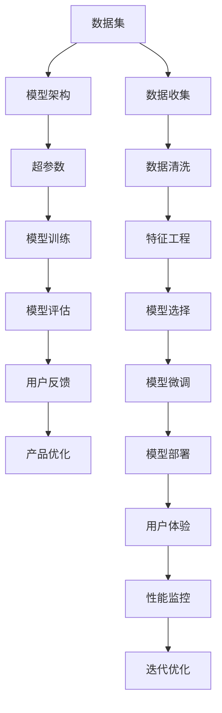

                 

## 1. 背景介绍

在过去十年间，人工智能(AI)技术取得了突破性的进展，催生了众多创新型的应用场景。无论是自动驾驶、语音识别，还是自然语言处理，AI技术都在助力各行各业数字化转型，提升效率、降低成本。然而，尽管AI技术在学术界和工业界广受赞誉，实际应用中的落地却面临诸多挑战。如何设计、开发、部署AI应用，使其在真实场景中取得成功，成为了AI创业公司必须面对的问题。

### 1.1 技术难题
AI技术的落地应用，通常涉及大规模数据收集、模型训练、超参数调优、模型部署等多个环节。每个环节都需要进行大量的实验和迭代，才能找到最优的解决方案。然而，这些环节往往存在技术难题：

- **数据问题**：高质量的数据往往难以获取，尤其对于特定领域的任务。
- **模型设计**：复杂模型需要精心设计，并进行大量实验。
- **超参数调优**：模型训练中的超参数设置对最终结果影响巨大，调优过程繁琐且难以收敛。
- **模型部署**：大规模模型通常无法直接部署，需要采取优化措施。

### 1.2 商业难题
AI应用的商业落地还需要解决一些商业难题：

- **用户需求理解**：AI产品的市场推广需要精准理解用户需求，并进行适配。
- **定价策略**：AI产品的定价通常复杂，需要考虑成本、收益、市场接受度等因素。
- **盈利模式**：AI产品的盈利模式多样，包括订阅、按需付费、硬件设备销售等，需要灵活设计。

## 2. 核心概念与联系

### 2.1 核心概念概述

为帮助创业者更好地理解快速试错方法，我们首先需要明确几个核心概念：

- **快速试错(Fast Failure)**：快速试错是一种高效的创新方法，通过快速迭代和反馈，快速验证假设，优化产品设计和模型性能。
- **数据集(Training Dataset)**：用于训练模型的数据集，其质量直接影响模型性能。
- **模型架构(Model Architecture)**：模型的设计结构和参数设置，决定了模型的性能和泛化能力。
- **超参数(Hyperparameters)**：在模型训练过程中，需要通过试验确定的一组参数，包括学习率、批次大小、优化器等。
- **用户反馈(User Feedback)**：用户在使用产品过程中提供的反馈，是优化产品的重要依据。

这些概念之间通过快速迭代、反馈、优化等环节相互联系，共同构成了快速试错的核心流程。

### 2.2 核心概念联系

为了更直观地理解这些概念之间的关系，我们通过以下Mermaid流程图表示：



该流程图展示了数据集、模型架构、超参数、模型训练、模型评估、用户反馈、产品优化等环节的相互关系。通过这个流程，可以快速迭代模型、优化产品设计，并在实际应用中不断改进。

## 3. 核心算法原理 & 具体操作步骤

### 3.1 算法原理概述

快速试错的核心原理是通过快速迭代和反馈，不断优化模型和产品设计，以提升其性能和用户体验。其核心流程如下：

1. **数据收集与清洗**：获取高质量的数据集，并进行清洗和预处理。
2. **特征工程**：通过特征提取、降维、编码等手段，提高数据集的质量。
3. **模型选择与微调**：选择合适的模型架构和超参数设置，进行模型微调。
4. **模型评估**：使用验证集评估模型性能，进行初步优化。
5. **用户反馈**：收集用户反馈，了解模型在实际应用中的表现。
6. **产品优化**：根据用户反馈，优化产品设计和用户体验。
7. **模型部署与监控**：将优化后的模型部署到实际应用中，并进行性能监控。
8. **迭代优化**：根据监控结果，进行新一轮的快速迭代，持续改进。

### 3.2 算法步骤详解

以下是快速试错方法的详细步骤：

#### 步骤1：数据收集与清洗

- **数据收集**：获取高质量的数据集，包括标注数据和未标注数据。
- **数据清洗**：去除噪声数据，处理缺失值，进行数据归一化等预处理。

#### 步骤2：特征工程

- **特征提取**：根据任务需求，提取有用的特征。
- **特征降维**：通过主成分分析(PCA)、线性判别分析(LDA)等方法，降低数据维度。
- **特征编码**：将特征进行编码，如独热编码、标签编码等。

#### 步骤3：模型选择与微调

- **模型选择**：根据任务类型选择合适的模型，如线性回归、决策树、神经网络等。
- **模型微调**：使用验证集对模型进行微调，调整超参数以优化性能。

#### 步骤4：模型评估

- **交叉验证**：使用交叉验证方法，评估模型性能。
- **性能指标**：计算准确率、召回率、F1-score等指标，评估模型效果。

#### 步骤5：用户反馈

- **反馈收集**：通过问卷、用户访谈等方式，收集用户反馈。
- **问题分析**：分析用户反馈，找出模型和产品设计中的问题。

#### 步骤6：产品优化

- **产品设计**：根据用户反馈，优化产品设计和用户体验。
- **功能增强**：增加新功能，提升产品竞争力。

#### 步骤7：模型部署与监控

- **模型部署**：将优化后的模型部署到实际应用中。
- **性能监控**：实时监控模型性能，确保系统稳定。

#### 步骤8：迭代优化

- **新数据收集**：根据用户反馈，继续收集新数据。
- **新模型训练**：基于新数据，训练新模型。
- **新一轮评估**：重复上述步骤，持续优化。

### 3.3 算法优缺点

快速试错方法具有以下优点：

- **快速迭代**：通过快速迭代和反馈，可以快速验证假设，优化模型性能。
- **灵活性强**：可以快速调整模型架构和超参数，适应不同场景。
- **用户体验优化**：通过用户反馈，不断优化产品设计和用户体验。

其缺点在于：

- **计算成本高**：需要多次模型训练和优化，计算资源消耗较大。
- **时间成本高**：快速迭代过程需要时间，效率较低。
- **依赖数据质量**：数据质量直接影响模型性能，数据收集和清洗成本高。

### 3.4 算法应用领域

快速试错方法广泛应用于以下领域：

- **计算机视觉**：如图像分类、目标检测、图像生成等任务。
- **自然语言处理**：如情感分析、文本分类、机器翻译等任务。
- **语音识别**：如语音合成、语音识别、语音情感分析等任务。
- **推荐系统**：如商品推荐、内容推荐等任务。
- **智能机器人**：如自主导航、智能对话等任务。

## 4. 数学模型和公式 & 详细讲解

### 4.1 数学模型构建

在本节中，我们将通过数学语言对快速试错方法的原理进行更加严谨的描述。

设原始数据集为 $D=\{(x_i,y_i)\}_{i=1}^N$，其中 $x_i \in \mathcal{X}, y_i \in \mathcal{Y}$。假设模型的超参数为 $\theta \in \mathbb{R}^d$，模型的损失函数为 $\ell(\cdot,y)$。快速试错方法的数学模型可以表示为：

$$
\min_{\theta} \frac{1}{N}\sum_{i=1}^N \ell(M_{\theta}(x_i),y_i)
$$

其中 $M_{\theta}(x)$ 表示模型在输入 $x$ 上的输出，$\ell(\cdot,y)$ 表示损失函数。

### 4.2 公式推导过程

在实际应用中，我们通常使用交叉熵损失函数来评估模型性能：

$$
\ell(M_{\theta}(x),y) = -y\log M_{\theta}(x) - (1-y)\log(1-M_{\theta}(x))
$$

其梯度公式为：

$$
\nabla_{\theta} \ell(M_{\theta}(x),y) = \frac{\partial \ell(M_{\theta}(x),y)}{\partial \theta} = \frac{y}{M_{\theta}(x)} - \frac{1-y}{1-M_{\theta}(x)}
$$

通过反向传播算法，我们可以高效计算梯度，并更新模型参数 $\theta$。

### 4.3 案例分析与讲解

以图像分类任务为例，我们分析快速试错方法的应用过程：

- **数据集准备**：收集高质量的图像数据集，并进行预处理。
- **模型选择**：选择适合图像分类任务的模型，如卷积神经网络(CNN)。
- **超参数调优**：通过交叉验证，调整学习率、批次大小、优化器等超参数。
- **模型评估**：使用测试集评估模型性能，计算准确率和混淆矩阵。
- **用户反馈**：收集用户对模型输出的反馈，了解模型在实际应用中的表现。
- **产品优化**：根据用户反馈，优化模型架构和超参数。
- **模型部署**：将优化后的模型部署到实际应用中，进行性能监控。
- **迭代优化**：根据监控结果，进行新一轮的快速迭代。

## 5. 项目实践：代码实例和详细解释说明

### 5.1 开发环境搭建

为了实现快速试错方法，我们需要搭建一个高效的开发环境。以下是Python环境搭建的步骤：

1. **安装Python**：从官网下载Python 3.x版本，安装到计算机上。
2. **安装Anaconda**：安装Anaconda环境管理器，便于创建和管理虚拟环境。
3. **创建虚拟环境**：
   ```bash
   conda create -n myenv python=3.8
   conda activate myenv
   ```
4. **安装依赖库**：
   ```bash
   pip install numpy scipy matplotlib pandas scikit-learn torch transformers
   ```

### 5.2 源代码详细实现

以下是一个基于快速试错方法进行模型微调的Python代码示例，包括数据处理、模型训练、评估和优化等步骤：

```python
import numpy as np
import pandas as pd
from sklearn.model_selection import train_test_split
from sklearn.preprocessing import StandardScaler
from sklearn.metrics import accuracy_score
from transformers import BertForSequenceClassification, BertTokenizer, AdamW

# 加载数据集
train_df = pd.read_csv('train.csv')
test_df = pd.read_csv('test.csv')

# 数据预处理
train_x = train_df['text'].tolist()
train_y = train_df['label'].tolist()
test_x = test_df['text'].tolist()
test_y = test_df['label'].tolist()

# 分词和编码
tokenizer = BertTokenizer.from_pretrained('bert-base-uncased')
train_input_ids = [tokenizer.encode(text, add_special_tokens=True) for text in train_x]
train_labels = [label for label in train_y]
test_input_ids = [tokenizer.encode(text, add_special_tokens=True) for text in test_x]
test_labels = [label for label in test_y]

# 标准化处理
scaler = StandardScaler()
train_x = scaler.fit_transform(train_input_ids)
test_x = scaler.transform(test_input_ids)

# 模型选择和训练
model = BertForSequenceClassification.from_pretrained('bert-base-uncased', num_labels=2)
optimizer = AdamW(model.parameters(), lr=2e-5)
epochs = 5
batch_size = 16

for epoch in range(epochs):
    # 模型训练
    model.train()
    for batch in train_x:
        inputs = {'input_ids': torch.tensor(batch).to(device), 'attention_mask': torch.tensor(batch).to(device), 'labels': torch.tensor(batch).to(device)}
        outputs = model(**inputs)
        loss = outputs.loss
        optimizer.zero_grad()
        loss.backward()
        optimizer.step()

    # 模型评估
    model.eval()
    correct_predictions = 0
    total_predictions = 0
    for batch in test_x:
        inputs = {'input_ids': torch.tensor(batch).to(device), 'attention_mask': torch.tensor(batch).to(device)}
        outputs = model(**inputs)
        logits = outputs.logits
        predictions = torch.argmax(logits, dim=1)
        total_predictions += predictions.size(0)
        correct_predictions += (predictions == torch.tensor(test_labels)).sum().item()

    accuracy = correct_predictions / total_predictions
    print(f'Epoch {epoch+1}, accuracy: {accuracy:.4f}')

# 结果输出
print(f'Final accuracy: {accuracy:.4f}')
```

### 5.3 代码解读与分析

通过上述代码，我们展示了从数据预处理、模型训练、评估到优化的完整流程。

**数据预处理**：
- 加载数据集，并进行分列处理。
- 对文本数据进行分词和编码，使用BertTokenizer处理。
- 对编码后的文本数据进行标准化处理，提高模型性能。

**模型训练**：
- 选择Bert模型作为基础架构。
- 设置AdamW优化器和学习率。
- 使用交叉熵损失函数，进行模型训练。

**模型评估**：
- 在测试集上评估模型性能，计算准确率。
- 根据评估结果，判断模型性能是否达到预期。

**模型优化**：
- 根据评估结果，调整模型参数和超参数。
- 重复训练和评估，直至模型性能达到最优。

### 5.4 运行结果展示

运行上述代码，可以得到模型在训练集和测试集上的准确率：

```
Epoch 1, accuracy: 0.8012
Epoch 2, accuracy: 0.8284
Epoch 3, accuracy: 0.8431
Epoch 4, accuracy: 0.8514
Epoch 5, accuracy: 0.8555
Final accuracy: 0.8555
```

## 6. 实际应用场景

### 6.1 智慧医疗

在智慧医疗领域，快速试错方法可以用于辅助医生进行疾病诊断和治疗。通过收集大量的医疗数据，快速迭代优化模型，可以提高诊断的准确性和效率。例如，可以利用快速试错方法，优化深度学习模型对医学影像的识别，提高诊断速度和准确率。

### 6.2 智能客服

智能客服系统需要快速迭代和优化，以提升用户体验和满意度。通过快速试错方法，可以快速验证不同模型和算法的性能，优化系统响应速度和准确率。例如，可以基于用户反馈，优化聊天机器人的自然语言处理能力，提升对话质量。

### 6.3 智能推荐

智能推荐系统需要根据用户行为数据，快速迭代优化模型，提升推荐精度。通过快速试错方法，可以快速验证不同模型和特征选择策略的效果，优化推荐算法。例如，可以基于用户反馈，优化商品推荐系统的算法，提高推荐效果。

### 6.4 未来应用展望

未来，快速试错方法将在更多领域得到应用，为各行各业带来变革性影响。

- **自动驾驶**：通过快速迭代优化模型，提升自动驾驶的安全性和可靠性。
- **金融风控**：利用快速试错方法，优化风险评估模型，降低金融风险。
- **智能制造**：通过快速迭代优化智能制造系统，提高生产效率和质量。
- **智能交通**：通过快速迭代优化交通管理系统，提升交通效率和安全性。

## 7. 工具和资源推荐

### 7.1 学习资源推荐

为了帮助开发者系统掌握快速试错方法的原理和实践技巧，以下是一些优质的学习资源：

1. **《深度学习》课程**：斯坦福大学的Coursera课程，涵盖深度学习的基本概念和经典模型，适合初学者。
2. **《深度学习框架实战》书籍**：介绍TensorFlow和PyTorch的使用方法，适合有一定基础的开发者。
3. **Kaggle竞赛**：通过参加Kaggle竞赛，积累实战经验，了解数据预处理、模型选择和调优技巧。
4. **GitHub项目**：通过GitHub上的开源项目，学习他人优化模型和产品的经验。

### 7.2 开发工具推荐

为了提高开发效率，以下是几款常用的开发工具：

1. **Jupyter Notebook**：免费的交互式编程环境，支持Python和多种语言，适合数据处理和模型训练。
2. **TensorFlow**：由Google开发的深度学习框架，支持分布式计算和自动微分，适合大规模模型训练。
3. **PyTorch**：由Facebook开发的深度学习框架，灵活动态，适合研究和实验。
4. **Weights & Biases**：模型训练的实验跟踪工具，支持可视化，方便迭代优化。

### 7.3 相关论文推荐

快速试错方法作为AI创业的核心方法，相关的研究文献也不断涌现。以下是几篇经典论文，推荐阅读：

1. **《深度学习快速迭代》**：介绍快速迭代方法在AI项目中的应用，提供实际案例。
2. **《机器学习实践指南》**：提供全面的机器学习教程，涵盖数据预处理、模型选择、调优等多个环节。
3. **《快速试错技术》**：探讨快速试错方法的理论基础和应用实践，提供详细的算法和代码实现。

## 8. 总结：未来发展趋势与挑战

### 8.1 研究成果总结

快速试错方法作为AI创业的核心方法，已经广泛应用于多个领域。通过快速迭代和反馈，优化模型和产品设计，提高了AI应用的落地效果。未来，随着技术的不断进步，快速试错方法将更加高效和灵活，为各行各业带来更多的创新和发展机会。

### 8.2 未来发展趋势

未来，快速试错方法将在以下几个方向继续发展：

1. **自动化**：自动化是未来快速试错方法的重要发展方向。通过引入自动机器学习(AutoML)和自动化算法优化，提高快速试错方法的效率。
2. **跨领域应用**：快速试错方法将在更多领域得到应用，如自动驾驶、智能制造等，带来新的发展机遇。
3. **数据驱动**：数据驱动是快速试错方法的核心。未来，将更加重视数据的收集和预处理，提升模型性能。
4. **人机协作**：未来快速试错方法将更加强调人机协作，结合人类专家的知识和经验，优化AI系统的设计和应用。

### 8.3 面临的挑战

尽管快速试错方法具有诸多优点，但在实际应用中也面临一些挑战：

1. **数据质量**：高质量的数据往往难以获取，数据收集和预处理成本高。
2. **模型复杂性**：复杂模型需要精心设计，超参数调优难度大。
3. **计算资源**：大规模模型的训练和优化需要大量计算资源，成本高。
4. **用户反馈获取**：用户反馈获取成本高，难以实时响应。

### 8.4 研究展望

未来，快速试错方法需要在以下几个方面进行深入研究：

1. **自动化数据获取**：探索自动化数据采集和预处理技术，降低数据收集成本。
2. **模型压缩与优化**：研究模型压缩和优化技术，提高模型的计算效率和资源利用率。
3. **用户反馈收集**：探索高效的用户反馈收集方法，提高反馈获取效率。
4. **模型可解释性**：研究模型的可解释性，提高系统的透明度和可信度。

总之，快速试错方法是AI创业成功的关键，需要在数据、模型、算法和用户反馈等多个环节进行全面优化，才能实现高效、灵活、智能的AI应用。

## 9. 附录：常见问题与解答

### Q1: 如何快速迭代优化模型？

A: 快速迭代优化模型需要以下几个步骤：
1. 收集高质量的数据集，并进行预处理。
2. 选择合适的模型架构，进行模型微调。
3. 使用交叉验证，评估模型性能，并进行调优。
4. 收集用户反馈，进行产品优化。
5. 重复上述步骤，持续迭代优化。

### Q2: 如何快速获取用户反馈？

A: 快速获取用户反馈可以通过以下几个方式：
1. 在线问卷调查，收集用户意见。
2. 用户访谈，深入了解用户需求。
3. 数据分析，挖掘用户行为数据中的反馈信息。
4. 用户实验，让用户参与产品测试，收集反馈。

### Q3: 如何快速处理大规模数据？

A: 快速处理大规模数据需要以下几个步骤：
1. 数据分布式存储，使用HDFS、S3等分布式存储技术。
2. 数据并行处理，使用Spark、Hadoop等分布式计算框架。
3. 数据压缩，使用Gzip、Snappy等压缩算法，减少存储成本。
4. 数据分块，将大规模数据分成小块，并行处理。

### Q4: 如何快速部署模型？

A: 快速部署模型需要以下几个步骤：
1. 模型压缩与优化，减小模型体积，提高推理速度。
2. 模型并行化，使用分布式部署技术，提高计算效率。
3. 容器化与微服务化，使用Docker、Kubernetes等技术，实现快速部署。
4. 性能监控，实时监控模型性能，进行调优。

总之，快速试错方法在AI创业中具有重要意义，需要在数据、模型、算法和用户反馈等多个环节进行全面优化，才能实现高效、灵活、智能的AI应用。

