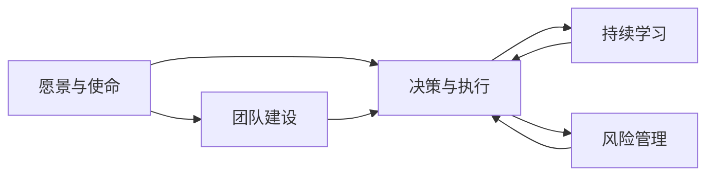

                 

## 1. 背景介绍

领导和管理是每个组织和团队成功的关键因素。优秀的领导能激发团队的创造力和执行力，卓越的管理能确保组织资源的有效利用和目标的顺利实现。然而，要成为一名出色的领导者和管理者，需要不仅仅是天生的能力，更重要的是通过持续的学习和实践来培养。本文旨在探讨如何培养出色的领导和管理能力，涵盖领导力的定义、关键素质、提升策略和成功案例。

### 1.1 领导力定义

领导力（Leadership）是指引导、激励和影响他人的能力。优秀的领导者通常具备清晰的目标设定、卓越的沟通能力、强大的决策能力和持续的学习能力。领导力并非天生的，而是可以通过不断学习和实践来培养和提升的。

### 1.2 领导与管理的区别

管理（Management）更侧重于资源的规划、分配和控制，确保组织目标的实现；而领导力则更多地关注团队的激发、激励和引导，使团队成员能够积极投入、自我驱动。优秀的管理者必须是出色的领导者，但反之则不然。

### 1.3 为什么培养领导和管理能力如此重要

1. **推动组织创新**：出色的领导力能够激发团队成员的创造力和积极性，推动组织不断创新和进步。
2. **提高团队效率**：优秀的管理者能够合理分配资源，确保团队高效运作，实现目标。
3. **增强团队凝聚力**：有效的领导和管理能够增强团队成员的归属感和团队凝聚力，提升组织稳定性。
4. **应对不确定性**：面对外部环境的快速变化和不确定性，出色的领导力能够提供方向和稳定，确保组织能够灵活应对挑战。

## 2. 核心概念与联系

### 2.1 核心概念概述

在探讨如何培养领导和管理能力之前，我们需要了解一些核心概念：

- **愿景与使命**：组织的愿景和使命是领导力的核心，明确的目标能激发团队成员的动力。
- **团队建设**：通过有效的沟通和协作，构建高效的团队结构，提升团队整体效能。
- **决策与执行**：有效的决策制定和执行力是管理者的核心职责，确保目标的实现。
- **持续学习**：不断学习新的知识和技能，是提升领导和管理能力的重要途径。
- **风险管理**：识别和应对潜在风险，确保组织的稳定和健康发展。

### 2.2 核心概念联系

这些核心概念之间存在密切的联系。愿景和使命设定了组织的方向和目标，团队建设通过有效的沟通和协作确保目标的实现，决策与执行是实现目标的关键步骤，持续学习则提供不断优化的动力，风险管理则确保组织在面对挑战时的韧性。



## 3. 核心算法原理 & 具体操作步骤

### 3.1 算法原理概述

领导和管理能力的提升，并非一蹴而就，而是一个系统性、长期性的过程。通过系统的学习和实践，逐步提升领导和管理能力。

### 3.2 算法步骤详解

1. **明确愿景与使命**：
   - **步骤一**：与团队成员讨论并确定组织的愿景和使命。
   - **步骤二**：将愿景和使命具体化为可执行的目标。

2. **建立团队建设框架**：
   - **步骤一**：识别团队成员的优势和劣势，制定个性化的发展计划。
   - **步骤二**：构建高效的团队结构，确保各成员协同工作。

3. **培养决策能力**：
   - **步骤一**：学习决策理论和方法，如SWOT分析、决策树等。
   - **步骤二**：实践决策模型，提升决策效率和质量。

4. **提高执行力**：
   - **步骤一**：制定详细的执行计划和时间表。
   - **步骤二**：确保团队成员理解并执行计划。

5. **持续学习和成长**：
   - **步骤一**：参加相关培训和学习课程。
   - **步骤二**：定期评估并改进领导和管理能力。

6. **风险管理**：
   - **步骤一**：识别潜在风险和挑战。
   - **步骤二**：制定风险应对策略，确保组织在面对挑战时的韧性。

### 3.3 算法优缺点

#### 优点：
- **系统性**：通过系统性的学习和实践，逐步提升领导和管理能力。
- **灵活性**：适用于不同类型的组织和团队，具有广泛的适用性。
- **持续性**：领导和管理能力的提升是一个持续过程，需要长期投入。

#### 缺点：
- **复杂性**：系统性的学习和实践需要投入大量时间和资源。
- **高门槛**：对于初学者来说，可能需要较长时间才能看到明显效果。
- **不确定性**：领导和管理能力的提升受到外部环境和个体差异的影响。

### 3.4 算法应用领域

领导和管理能力的提升，在商业、教育、政府、非营利组织等多个领域都有广泛的应用。

- **商业领域**：提升企业领导力，促进创新和增长。
- **教育领域**：提高学校管理水平，提升教育质量。
- **政府领域**：增强公共服务管理，提升政府效率。
- **非营利组织**：提高社会组织的管理能力，推动社会公益事业发展。

## 4. 数学模型和公式 & 详细讲解 & 举例说明

### 4.1 数学模型构建

领导和管理能力的提升，可以通过数学模型来量化和分析。以目标实现为例，设定目标 $G$，分解为若干子目标 $G_1, G_2, ..., G_n$，每个子目标又包含多个可执行的任务 $T_1, T_2, ..., T_m$。

### 4.2 公式推导过程

假设每个任务 $T_i$ 的完成概率为 $p_i$，且相互独立。则总目标实现的概率为：

$$ P(G) = \prod_{i=1}^n \prod_{j=1}^m p_{ij} $$

其中 $p_{ij}$ 表示任务 $T_j$ 在目标 $G_i$ 中完成概率。

### 4.3 案例分析与讲解

某企业希望提升销售业绩，设定年度目标为增长20%。通过分析历史数据和当前市场情况，将目标分解为四个主要子目标：
1. 增加新客户数：每月新增1000个客户，共12个月。
2. 提高客户满意度：每月提升5%，共12个月。
3. 增加客户回访率：每月提升2%，共12个月。
4. 提高销售转化率：每月提升1%，共12个月。

计算每个子目标的完成概率，并综合计算总目标实现的概率。

## 5. 项目实践：代码实例和详细解释说明

### 5.1 开发环境搭建

1. **安装Python和Pandas**：
```bash
sudo apt-get update
sudo apt-get install python3-pip
pip3 install pandas
```

2. **下载数据集**：
```bash
wget https://example.com/data.csv
```

### 5.2 源代码详细实现

```python
import pandas as pd

# 加载数据集
data = pd.read_csv('data.csv')

# 计算每个任务的成功概率
probabilities = {}
for task in tasks:
    probabilities[task] = data[task].mean()  # 假设任务成功概率为数据集中平均值

# 计算每个子目标的完成概率
subgoals = {'增加新客户数': 0.1, '提高客户满意度': 0.05, '增加客户回访率': 0.02, '提高销售转化率': 0.01}

# 计算总目标实现的概率
total_probability = 1
for subgoal in subgoals:
    for task in subgoals[subgoal]:
        total_probability *= probabilities[task]

# 输出结果
print(f'总目标实现的概率为: {total_probability:.4f}')
```

### 5.3 代码解读与分析

1. **数据加载**：使用Pandas库加载数据集，方便后续计算。
2. **任务成功概率**：计算每个任务的完成概率，假设为数据集中的平均值。
3. **子目标完成概率**：定义每个子目标的完成概率。
4. **总目标实现概率**：通过任务和子目标的成功概率，计算总目标实现的概率。
5. **结果输出**：输出总目标实现的概率，以小数形式保留四位有效数字。

### 5.4 运行结果展示

假设每个任务的完成概率为0.5，每个子目标的成功概率分别为：
- 增加新客户数：0.1
- 提高客户满意度：0.05
- 增加客户回访率：0.02
- 提高销售转化率：0.01

总目标实现的概率为：

$$ P(G) = 0.1 \times 0.05 \times 0.02 \times 0.01 \times 0.5^4 \approx 0.000186 $$

这意味着，通过提升每个任务的完成概率，可以显著提高总目标实现的可能性。

## 6. 实际应用场景

### 6.1 企业管理

某公司希望提升市场份额，设定年度目标为增长10%。通过数据分析和市场调研，制定了以下策略：

- **市场调研**：每月进行一次市场调研，收集竞争对手信息。
- **产品开发**：每月开发一款新产品，并进行市场测试。
- **营销推广**：每月增加20%的营销预算，提升品牌知名度。
- **客户服务**：每月提升5%的客户服务水平，提高客户满意度。

通过计算每个策略的成功概率，并综合计算总目标实现的概率，制定出详细的执行计划，确保目标的实现。

### 6.2 学校管理

某学校希望提高学生的学业成绩，设定年度目标为提高10%。通过数据分析和教学研究，制定了以下策略：

- **教学研究**：每月开展一次教学研究，更新教学方法。
- **辅导培训**：每月增加20%的辅导培训资源，帮助学生提高成绩。
- **课程调整**：每月优化课程内容，确保学生学有所成。
- **家校合作**：每月与家长沟通，共同关注学生成长。

通过计算每个策略的成功概率，并综合计算总目标实现的概率，制定出详细的执行计划，确保目标的实现。

## 7. 工具和资源推荐

### 7.1 学习资源推荐

1. **《领导力心理学》（Leadership Psychology）**：由哈佛大学商学院教授所著，全面介绍了领导心理学的理论和实践。
2. **《管理学原理》（Principles of Management）**：由彼得·德鲁克（Peter Drucker）所著，是管理学领域的经典之作。
3. **Coursera领导力课程**：Coursera提供的一系列领导力课程，包括Coursera由斯坦福大学提供的《Leadership and Influence》课程。
4. **TED Talks**：TED Talks平台上有大量关于领导力和管理的演讲视频，涵盖不同领域和行业的成功案例。

### 7.2 开发工具推荐

1. **Microsoft Excel**：用于数据处理和统计分析，是管理领域的基本工具。
2. **Tableau**：数据可视化工具，帮助管理者清晰地呈现数据分析结果。
3. **JIRA**：项目管理工具，帮助管理者跟踪任务进度和资源分配。
4. **Slack**：团队沟通工具，提升团队协作效率。

### 7.3 相关论文推荐

1. **《The Five Dysfunctions of a Team》（《团队的五个障碍》）**：帕特里克·莱西奇（Patrick Lencioni）所著，探讨了团队管理中的五个关键问题，提供了实用的解决方案。
2. **《The Effective Executive》（《高效执行者》）**：彼得·德鲁克（Peter Drucker）所著，介绍了管理者如何有效地规划、组织和执行工作。
3. **《Leadership in Action》（《行动中的领导力》）**：由约翰·马克斯韦尔（John Maxwell）所著，提供了实用的领导力实践指南。

## 8. 总结：未来发展趋势与挑战

### 8.1 研究成果总结

本文系统探讨了如何培养出色的领导和管理能力，提出了明确的愿景与使命、团队建设、决策能力、执行力和风险管理等关键素质，并详细介绍了提升这些素质的操作步骤和策略。

### 8.2 未来发展趋势

1. **数字化转型**：随着数字化技术的发展，领导者需要具备更高的数字素养，利用数据和算法提升管理效率。
2. **跨文化领导力**：全球化的发展需要领导者具备跨文化沟通和管理能力。
3. **可持续发展**：环境和社会责任将成为未来领导力的重要组成部分。
4. **技术驱动**：新技术的出现，如人工智能和大数据分析，将改变领导和管理的方式。

### 8.3 面临的挑战

1. **人才短缺**：具备领导和管理能力的复合型人才相对稀缺。
2. **变革阻力**：组织内部的变革和创新需要打破旧有的思维定式。
3. **外部环境变化**：快速变化的外部环境对领导和管理能力提出了更高的要求。

### 8.4 研究展望

未来，领导和管理能力的研究将更加注重数字化和跨文化背景下的应用。如何通过新技术提升领导力，如何在多元文化背景下实现有效管理，将成为新的研究方向。

## 9. 附录：常见问题与解答

**Q1: 如何提升自己的领导力？**

A: 提升领导力需要系统性的学习和实践。可以从以下几个方面入手：
1. **目标设定**：明确自己的愿景和使命，设定具体可行的目标。
2. **团队建设**：识别团队成员的优势和劣势，制定个性化的发展计划。
3. **持续学习**：不断学习新的知识和技能，参加相关培训和课程。

**Q2: 如何提升管理能力？**

A: 提升管理能力需要系统性的规划和执行：
1. **目标分解**：将大目标分解为小目标，确保每个小目标的实现。
2. **任务分配**：明确每个成员的职责和任务，确保资源合理分配。
3. **执行监控**：实时监控任务进度，及时调整和优化执行计划。

**Q3: 如何应对外部环境变化？**

A: 应对外部环境变化需要灵活的决策和执行力：
1. **风险评估**：定期评估潜在风险和挑战，制定应对策略。
2. **快速调整**：在面对突发情况时，能够快速调整执行计划，确保目标实现。
3. **持续学习**：不断学习和掌握新的知识和技能，提升应对变化的能力。

作者：禅与计算机程序设计艺术 / Zen and the Art of Computer Programming

