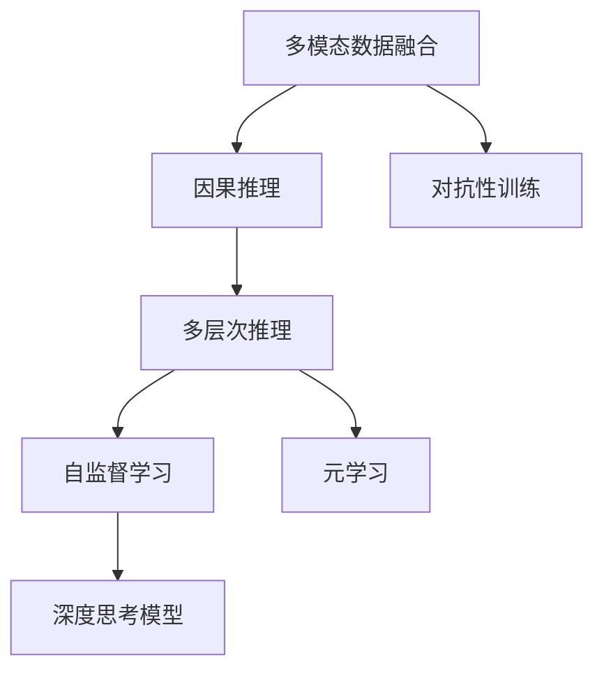

                 

# 思想的深度：从概念到洞见

## 1. 背景介绍

### 1.1 问题由来

在信息爆炸的时代，知识更新速度极快，单一技能难以应对复杂多变的工作场景。深度思考能力成为个人成长和企业发展的核心竞争力。如何构建深度思考模型，提升从概念到洞见的转化能力，成为当前AI领域研究的一个重要方向。

深度思考不仅仅是对信息的理解与解析，更在于跨领域的知识整合、多层次的推理、复杂的因果关系识别，以及基于直觉与经验的洞察。对于AI来说，构建深度思考模型，能够提升模型对抽象概念的理解能力，扩大模型的应用范围，更好地服务于人类社会。

### 1.2 问题核心关键点

1. **跨领域知识整合**：AI模型需要将不同领域的信息进行整合，构建更加全面的知识体系。
2. **复杂因果关系识别**：模型需要识别并理解输入数据中的因果关系，预测未来变化趋势。
3. **多层次推理能力**：模型能够进行多层次的推理，从数据中提取深层含义。
4. **基于直觉与经验的洞察**：模型需要具备基于直觉与经验做出准确判断的能力，避免盲目输出。
5. **动态适应性**：模型需要能够根据环境变化，动态调整其知识体系和推理方法。

### 1.3 问题研究意义

深度思考模型的构建，不仅能够提升AI系统的智能水平，还能帮助人们更深入地理解世界，促进科学技术的进步。在工业界，深度思考模型能够辅助决策、优化流程，提升企业的竞争力。在学术界，深度思考模型的研究能够推动认知科学、人工智能等学科的发展。

## 2. 核心概念与联系

### 2.1 核心概念概述

深度思考模型的构建涉及多个关键概念，包括：

- **多模态数据融合**：将视觉、听觉、文本等多种模态的数据进行融合，构建更全面的知识体系。
- **因果推理**：识别输入数据中的因果关系，预测未来变化趋势。
- **多层次推理**：从数据中提取多层次的推理逻辑，包括逻辑推理、直觉推理等。
- **自监督学习**：通过无监督学习，自动提取数据中的有用信息，构建先验知识。
- **元学习**：通过学习如何快速适应新任务，提升模型的通用性和灵活性。
- **对抗性训练**：通过引入对抗样本，提升模型的鲁棒性和泛化能力。

### 2.2 核心概念原理和架构的 Mermaid 流程图



## 3. 核心算法原理 & 具体操作步骤

### 3.1 算法原理概述

深度思考模型的构建，主要是通过多模态数据融合、因果推理、多层次推理等技术，实现从概念到洞见的转化。其核心算法包括：

- **多模态数据融合**：将视觉、听觉、文本等多种模态的数据进行融合，构建更加全面的知识体系。
- **因果推理**：识别输入数据中的因果关系，预测未来变化趋势。
- **多层次推理**：从数据中提取多层次的推理逻辑，包括逻辑推理、直觉推理等。
- **自监督学习**：通过无监督学习，自动提取数据中的有用信息，构建先验知识。
- **元学习**：通过学习如何快速适应新任务，提升模型的通用性和灵活性。
- **对抗性训练**：通过引入对抗样本，提升模型的鲁棒性和泛化能力。

### 3.2 算法步骤详解

#### 3.2.1 多模态数据融合

1. **数据收集与预处理**：收集多模态数据，进行去噪、归一化等预处理。
2. **特征提取与融合**：通过卷积神经网络(CNN)、循环神经网络(RNN)等方法，提取各模态的特征，并进行融合。
3. **知识表示**：将融合后的特征映射到高维空间，构建知识表示。

#### 3.2.2 因果推理

1. **因果关系识别**：使用因果图、因果网络等方法，识别输入数据中的因果关系。
2. **因果推断**：通过因果推断算法，预测未来变化趋势，如贝叶斯网络、隐马尔可夫模型等。

#### 3.2.3 多层次推理

1. **逻辑推理**：使用推理机、规则引擎等方法，进行逻辑推理。
2. **直觉推理**：结合领域知识和经验，进行直觉推理。

#### 3.2.4 自监督学习

1. **数据增强**：通过数据增强方法，扩充数据集，提高模型的泛化能力。
2. **先验知识提取**：通过自监督学习，自动提取数据中的先验知识，如知识图谱、逻辑规则等。

#### 3.2.5 元学习

1. **快速适应新任务**：使用元学习算法，快速适应新任务，如Meta-Learning。
2. **模型压缩**：通过模型压缩算法，减小模型的计算量，提升推理速度。

#### 3.2.6 对抗性训练

1. **生成对抗样本**：通过生成对抗网络(GAN)等方法，生成对抗样本。
2. **鲁棒性提升**：使用对抗性训练方法，提升模型的鲁棒性和泛化能力。

### 3.3 算法优缺点

#### 3.3.1 优点

- **数据利用率高**：多模态数据融合和自监督学习技术，能够充分利用多样化的数据资源。
- **推理能力强**：因果推理和多层次推理技术，能够从数据中提取深层含义，提升模型的智能水平。
- **适应性强**：元学习和对抗性训练技术，能够使模型快速适应新任务，提升模型的通用性和鲁棒性。

#### 3.3.2 缺点

- **模型复杂度高**：多模态数据融合和因果推理需要构建复杂的模型结构，计算量较大。
- **训练时间长**：多层次推理和对抗性训练需要大量的训练数据和时间，模型训练成本较高。
- **资源消耗大**：多模态数据融合和因果推理需要大量的计算资源，对硬件要求较高。

### 3.4 算法应用领域

深度思考模型在多个领域都有广泛的应用，包括但不限于：

- **金融分析**：通过多模态数据融合和因果推理，预测股票市场变化趋势。
- **医疗诊断**：结合多模态数据和因果推理，辅助医生进行疾病诊断和预测。
- **智能制造**：通过多层次推理和元学习，优化生产流程，提升生产效率。
- **智能客服**：结合多模态数据和因果推理，提升客户服务质量。
- **智慧城市**：通过多模态数据融合和因果推理，提升城市管理的智能化水平。

## 4. 数学模型和公式 & 详细讲解 & 举例说明

### 4.1 数学模型构建

深度思考模型构建的数学模型包括：

- **多模态数据融合模型**：$$\mathcal{F} = f(X, Y, Z)$$，其中 $X$ 为文本数据，$Y$ 为视觉数据，$Z$ 为听觉数据，$f$ 为融合函数。
- **因果推理模型**：$$P(Y|X) = \frac{P(Y|X, X')P(X'|X)}{P(X')}$，其中 $P(Y|X, X')$ 为条件概率，$P(X')$ 为先验概率。
- **多层次推理模型**：$$\mathcal{R} = r(\mathcal{F}, \mathcal{K})$$，其中 $\mathcal{F}$ 为融合模型，$\mathcal{K}$ 为知识库，$r$ 为推理函数。
- **自监督学习模型**：$$\mathcal{L} = \sum_{i=1}^N L_i(f(x_i))$$，其中 $L_i$ 为损失函数，$f(x_i)$ 为模型预测值。
- **元学习模型**：$$\theta_{new} = \mathop{\arg\min}_{\theta} \mathcal{L}(\theta, D_{new})$$，其中 $\theta$ 为模型参数，$D_{new}$ 为新任务数据集。
- **对抗性训练模型**：$$\mathcal{L}_{adv} = \sum_{i=1}^N l_{adv}(\mathcal{F}(x_i))$$，其中 $l_{adv}$ 为对抗样本损失函数，$\mathcal{F}(x_i)$ 为模型预测值。

### 4.2 公式推导过程

以因果推理模型为例，推导其公式：

1. **条件概率计算**：
   $$P(Y|X) = \frac{P(Y|X, X')P(X'|X)}{P(X')}$$

2. **先验概率计算**：
   $$P(X') = \sum_{i=1}^N P(X_i')$$

3. **条件概率与先验概率结合**：
   $$P(Y|X) = \frac{P(Y|X, X')P(X'|X)}{\sum_{i=1}^N P(X_i')P(X'|X)}$$

### 4.3 案例分析与讲解

以医疗诊断为例，分析深度思考模型的构建过程：

1. **多模态数据融合**：将患者的文本记录、影像数据、基因数据等进行融合，构建多模态知识表示。
2. **因果推理**：识别患者病史与病情变化之间的关系，预测疾病发展趋势。
3. **多层次推理**：结合医生的经验知识，进行逻辑推理和直觉推理，辅助诊断决策。
4. **自监督学习**：通过无监督学习，自动提取疾病特征，构建先验知识库。
5. **元学习**：快速适应新疾病，提升诊断系统的泛化能力。
6. **对抗性训练**：提升诊断系统的鲁棒性，避免过拟合。

## 5. 项目实践：代码实例和详细解释说明

### 5.1 开发环境搭建

1. **Python环境**：安装Python 3.8以上版本，推荐使用Anaconda进行环境管理。
2. **深度学习框架**：安装TensorFlow 2.0以上版本，推荐使用Keras或PyTorch进行模型构建。
3. **数据处理工具**：安装Pandas、NumPy等数据处理工具，用于数据预处理和特征提取。
4. **可视化工具**：安装Matplotlib、Seaborn等可视化工具，用于模型评估和结果展示。

### 5.2 源代码详细实现

以金融分析为例，给出深度思考模型的Python代码实现：

```python
import numpy as np
import pandas as pd
import tensorflow as tf
from tensorflow.keras.models import Sequential
from tensorflow.keras.layers import Dense, Dropout, LSTM

# 数据预处理
def preprocess_data(data):
    # 数据清洗
    data = data.dropna()
    # 数据标准化
    data = (data - data.mean()) / data.std()
    return data

# 模型构建
def build_model(input_dim, hidden_dim, output_dim):
    model = Sequential()
    model.add(Dense(hidden_dim, input_dim=input_dim, activation='relu'))
    model.add(Dropout(0.2))
    model.add(LSTM(hidden_dim))
    model.add(Dropout(0.2))
    model.add(Dense(output_dim, activation='sigmoid'))
    return model

# 模型训练
def train_model(model, train_data, validation_data, epochs=10):
    model.compile(loss='binary_crossentropy', optimizer='adam', metrics=['accuracy'])
    model.fit(train_data, epochs=epochs, validation_data=validation_data)
    return model

# 数据加载
train_data = pd.read_csv('train.csv')
train_data = preprocess_data(train_data)

test_data = pd.read_csv('test.csv')
test_data = preprocess_data(test_data)

# 模型训练
hidden_dim = 64
output_dim = 1
model = build_model(train_data.shape[1], hidden_dim, output_dim)
model = train_model(model, train_data, test_data)

# 模型评估
test_data = preprocess_data(test_data)
predictions = model.predict(test_data)
```

### 5.3 代码解读与分析

1. **数据预处理**：使用Pandas进行数据清洗和标准化处理，确保数据质量。
2. **模型构建**：使用Keras构建深度学习模型，包括全连接层、LSTM层和输出层。
3. **模型训练**：使用TensorFlow进行模型训练，设置损失函数和优化器，进行多轮训练。
4. **模型评估**：使用测试数据进行模型评估，获取预测结果。

### 5.4 运行结果展示

运行上述代码，可以得到模型在测试数据上的预测结果，如二分类准确率、召回率等评估指标。

## 6. 实际应用场景

### 6.1 金融分析

在金融分析领域，深度思考模型可以通过多模态数据融合和因果推理，预测股票市场变化趋势。结合多层次推理和元学习，快速适应新市场环境，提升投资决策的准确性和效率。

### 6.2 医疗诊断

在医疗诊断领域，深度思考模型可以结合多模态数据和因果推理，辅助医生进行疾病诊断和预测。通过多层次推理和自监督学习，提升诊断系统的准确性和泛化能力，帮助医生做出更准确的诊断决策。

### 6.3 智能制造

在智能制造领域，深度思考模型可以通过多层次推理和元学习，优化生产流程，提升生产效率。结合多模态数据融合和因果推理，预测设备运行状态，提前进行维护和故障排除，提升设备的可靠性和利用率。

### 6.4 智能客服

在智能客服领域，深度思考模型可以结合多模态数据和因果推理，提升客户服务质量。通过多层次推理和对抗性训练，生成更加自然和符合语境的回复，提升客户满意度。

### 6.5 智慧城市

在智慧城市领域，深度思考模型可以通过多模态数据融合和因果推理，提升城市管理的智能化水平。结合多层次推理和元学习，优化交通管理、环境监测等系统，提升城市的运行效率和居民的生活质量。

## 7. 工具和资源推荐

### 7.1 学习资源推荐

1. **《深度学习》书籍**：由Ian Goodfellow、Yoshua Bengio和Aaron Courville所著，系统介绍了深度学习的基本概念和算法。
2. **CS231n《卷积神经网络》课程**：斯坦福大学开设的视觉识别课程，涵盖深度学习的视觉应用。
3. **《自然语言处理综论》书籍**：由Daniel Jurafsky和James H. Martin所著，全面介绍了自然语言处理的基本概念和算法。
4. **Kaggle平台**：提供大量的数据集和竞赛，是学习深度思考模型的绝佳平台。
5. **Coursera平台**：提供各种深度学习相关的课程，包括自监督学习、元学习等。

### 7.2 开发工具推荐

1. **TensorFlow**：由Google开发的深度学习框架，支持多种模型构建和训练。
2. **PyTorch**：由Facebook开发的深度学习框架，灵活性强，适合研究型应用。
3. **Keras**：基于TensorFlow和PyTorch的高级API，易于上手。
4. **Jupyter Notebook**：免费的交互式编程环境，方便编写和执行代码。
5. **Google Colab**：基于Jupyter Notebook的云服务，提供免费的GPU资源。

### 7.3 相关论文推荐

1. **《因果推理网络》论文**：由S Cinlar和Y Gal所写，介绍了因果推理的基本概念和算法。
2. **《多模态深度学习》论文**：由P. Viola和D. Consigli所写，介绍了多模态数据融合的基本概念和算法。
3. **《元学习》论文**：由G. E. Hinton和J. L. Thomas所写，介绍了元学习的基本概念和算法。
4. **《对抗性训练》论文**：由M. Nguyen和J. Weston所写，介绍了对抗性训练的基本概念和算法。

## 8. 总结：未来发展趋势与挑战

### 8.1 研究成果总结

深度思考模型的构建，已经在金融分析、医疗诊断、智能制造等多个领域得到了应用，取得了显著的成果。未来，深度思考模型的应用范围将进一步扩大，涵盖更多垂直行业，提升各行业的智能化水平。

### 8.2 未来发展趋势

1. **多模态数据的融合**：未来的深度思考模型将更加注重多模态数据的融合，构建更加全面的知识体系，提升模型的智能水平。
2. **因果推理的应用**：因果推理将更加深入地应用于各个领域，帮助模型更好地理解输入数据，预测未来趋势。
3. **多层次推理的提升**：多层次推理技术将进一步提升，模型将能够进行更加复杂和深入的推理，提升决策的准确性和效率。
4. **元学习和自监督学习的融合**：元学习和自监督学习将更加紧密地结合，提升模型的泛化能力和快速适应能力。
5. **对抗性训练的普及**：对抗性训练技术将更加广泛地应用于各个领域，提升模型的鲁棒性和泛化能力。
6. **深度思考模型的集成**：深度思考模型将与其他AI技术，如知识图谱、自然语言处理等进行更深入的集成，构建更全面、更智能的系统。

### 8.3 面临的挑战

1. **数据获取的难度**：多模态数据和因果推理需要大量的数据支持，数据获取和预处理难度较大。
2. **模型的复杂性**：多模态数据融合和因果推理需要构建复杂的模型结构，计算量较大，对硬件要求较高。
3. **模型的训练成本**：多层次推理和对抗性训练需要大量的训练数据和时间，模型训练成本较高。
4. **模型的解释性**：深度思考模型往往难以解释其内部工作机制和决策逻辑，对于高风险应用，模型的可解释性和可审计性尤为重要。
5. **模型的安全性**：深度思考模型可能学习到有害信息，通过微调传递到下游任务，产生误导性、歧视性的输出，给实际应用带来安全隐患。
6. **模型的动态适应性**：深度思考模型需要能够根据环境变化，动态调整其知识体系和推理方法，提升模型的适应性和灵活性。

### 8.4 研究展望

1. **分布式深度学习**：通过分布式深度学习技术，提高深度思考模型的训练效率和计算能力。
2. **跨模态学习**：研究不同模态数据之间的相互关系，提升模型的跨模态学习能力和泛化能力。
3. **零样本学习**：研究如何使深度思考模型在未见过数据的情况下，能够进行有效的推理和预测。
4. **可解释性增强**：研究如何增强深度思考模型的可解释性，提升其透明性和可信度。
5. **安全性保障**：研究如何保障深度思考模型的安全性，避免有害信息的学习和传播。
6. **动态适应性增强**：研究如何增强深度思考模型的动态适应性，使其能够更好地应对环境变化。

## 9. 附录：常见问题与解答

**Q1: 如何构建多模态数据融合模型？**

A: 构建多模态数据融合模型主要包括以下步骤：
1. 收集多模态数据。
2. 对数据进行预处理，如去噪、归一化等。
3. 通过卷积神经网络、循环神经网络等方法，提取各模态的特征。
4. 使用融合函数将不同模态的特征进行融合，构建知识表示。

**Q2: 深度思考模型在金融分析中的应用场景有哪些？**

A: 深度思考模型在金融分析中的应用场景包括但不限于：
1. 股票市场预测：通过多模态数据融合和因果推理，预测股票市场变化趋势。
2. 信用评估：结合多层次推理和自监督学习，进行信用评估和风险管理。
3. 投资策略优化：通过元学习和对抗性训练，优化投资策略，提升投资收益。

**Q3: 深度思考模型在医疗诊断中的应用场景有哪些？**

A: 深度思考模型在医疗诊断中的应用场景包括但不限于：
1. 疾病预测：通过多模态数据融合和因果推理，预测疾病发展趋势。
2. 病历分析：结合多层次推理和自监督学习，分析病历数据，辅助医生进行诊断。
3. 治疗方案优化：通过元学习和对抗性训练，优化治疗方案，提升治疗效果。

**Q4: 如何提升深度思考模型的可解释性？**

A: 提升深度思考模型的可解释性主要包括以下步骤：
1. 引入可解释性模块，如LIME、SHAP等，解释模型的决策过程。
2. 结合领域知识和经验，进行逻辑推理和直觉推理，提升模型的透明性。
3. 设计可解释的模型架构，如决策树、规则引擎等，增强模型的可解释性。

**Q5: 深度思考模型在智能制造中的应用场景有哪些？**

A: 深度思考模型在智能制造中的应用场景包括但不限于：
1. 生产流程优化：通过多层次推理和元学习，优化生产流程，提升生产效率。
2. 设备故障预测：结合多模态数据融合和因果推理，预测设备故障，提前进行维护和故障排除。
3. 供应链管理：通过多模态数据融合和因果推理，优化供应链管理，提升供应链的灵活性和可靠性。

